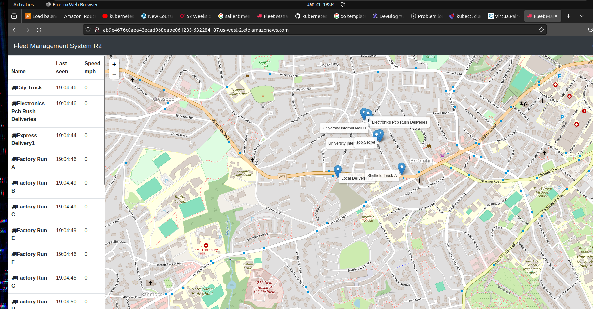

# restart the kops cluster for AWS kubernetes environment 

- for `restporing the kops cluster` we can `create the cluster` and `edit the cluster` and `update the cluster` and applying the `yaml definition file using the kubectl command` using the `kops command line` 

- if we are using the `bootstrap instance` and `we stop the instance` in order to `save the money` , then we need to `restart the instance` if we want to use the ` instances to run the kops cluster` then we `we also need to the security group of the EC2 instance` and `select myip` which will `select the local public IP of the computer in order to communicate`

- then we can set the `NAME` and `KOPS_STATE_STORE` evironmental variable in this case out here

    
    ```bash
        export NAME=fleetman.k8s.local
        export KOPS_STATE_STORE=s3://pratik-kops-12345
        # here saving the NAME and KOPS_STATE_STORE environmental variable in this case out in here

        # then we can use the kops create cluster command in order to create the cluster configuration 
        kops create cluster \
        --name=${NAME} \
        --zones=us-west-2a,us-west-2b,us-west-2c \
        --discovery-store=s3://pratik-kops-12345/${NAME}/discovery
        
        # but we also need to make sure that s3 bucket that we have created for the state store should have the public access
        # here using this command we can create the kops cluster configuration in this case

        # then we can check the configuration as below 
        kops edit cluster --name ${NAME}
        # editing the cluster to see the configuration 
        # the output will be as below
        # Please edit the object below. Lines beginning with a '#' will be ignored,
        # and an empty file will abort the edit. If an error occurs while saving this file will be
        # reopened with the relevant failures.
        #
        apiVersion: kops.k8s.io/v1alpha2
        kind: Cluster
        metadata:
        creationTimestamp: "2024-01-14T14:33:16Z"
        name: fleetman.k8s.local
        spec:
        api:
            loadBalancer:
            class: Network
            type: Public
        authorization:
            rbac: {}
        channel: stable
        cloudProvider: aws
        configBase: s3://pratik-kops-12345/fleetman.k8s.local
        etcdClusters:
        - cpuRequest: 200m
            etcdMembers:
            - encryptedVolume: true
            instanceGroup: control-plane-us-west-2a
            name: a
            manager:
            backupRetentionDays: 90
            memoryRequest: 100Mi
            name: main
        - cpuRequest: 100m
            etcdMembers:
            - encryptedVolume: true
            instanceGroup: control-plane-us-west-2a
            name: a
            manager:
            backupRetentionDays: 90
            memoryRequest: 100Mi
            name: events
        iam:
            allowContainerRegistry: true
            legacy: false
            useServiceAccountExternalPermissions: true
        kubeProxy:
            enabled: false
        kubelet:
            anonymousAuth: false
        kubernetesApiAccess:
        - 0.0.0.0/0
        - ::/0
        kubernetesVersion: 1.28.5
        networkCIDR: 172.20.0.0/16
        networking:
            cilium:
            enableNodePort: true
        nonMasqueradeCIDR: 100.64.0.0/10
        serviceAccountIssuerDiscovery:
            discoveryStore: s3://pratik-kops-12345/fleetman.k8s.local/discovery/fleetman.k8s.local 
            enableAWSOIDCProvider: true
        sshAccess:
        - 0.0.0.0/0
        - ::/0
        subnets:
        - cidr: 172.20.0.0/18
            name: us-west-2a
            type: Public
            zone: us-west-2a
        - cidr: 172.20.64.0/18
            name: us-west-2b
            type: Public
            zone: us-west-2b
        - cidr: 172.20.128.0/18
            name: us-west-2c
            type: Public
            zone: us-west-2c
        - cidr: 172.20.192.0/18
            name: us-west-2d
            type: Public
            zone: us-west-2d
        topology:
            dns:
            type: Private
            
        - cidr: 172.20.192.0/18
            name: us-west-2d
            type: Public
            zone: us-west-2d

        kops get ig --name ${NAME}
        # here this will provide the output as below
        # here checking the default masternode and workernode for the kops cluster
        NAME				        ROLE		    MACHINETYPE	MIN	MAX	ZONES
        control-plane-us-west-2a	ControlPlane	t3.medium	1	1	us-west-2a
        nodes-us-west-2a		    Node		    t3.medium	1	1	us-west-2a
        nodes-us-west-2b		    Node		    t3.medium	1	1	us-west-2b
        nodes-us-west-2c		    Node		    t3.medium	1	1	us-west-2c


        # if we want to change the instance group then we can use the command as
        # the instance group decide how many masternode/controlplain or workernode required for the cluster 
        kops edit ig --name ${NAME} <name of node for which we want to increase the min and max Size value>
        # using this command if we want to increase the number of nodes we can edit here 
        # here we can edit the minSize and maxSize to checkout the values in this case
        
        kops edit ig --name ${NAME} nodes-us-west-2a
        # the output here is as below 
        # the output will be as below 
        # Please edit the object below. Lines beginning with a '#' will be ignored,
        # and an empty file will abort the edit. If an error occurs while saving this file will be
        # reopened with the relevant failures.
        apiVersion: kops.k8s.io/v1alpha2
        kind: InstanceGroup
        metadata:
        creationTimestamp: "2024-01-21T13:01:26Z"
        labels:
            kops.k8s.io/cluster: fleetman.k8s.local
        name: nodes-us-west-2a
        spec:
        image: 099720109477/ubuntu/images/hvm-ssd/ubuntu-jammy-22.04-amd64-server-20231207
        machineType: t3.medium
        maxSize: 1
        minSize: 1
        role: Node
        subnets:
        - us-west-2a


    ```

- now onece been set up then we can use the command as below to create the `kops kubernetes cluster`

    ```bash
        
        kops update cluster --name ${NAME} --yes --admin=87600h
        # updating the kops configuration to create cluster
        # here the --yes will let you perform the action else it will be a dry run 
        # here we are using admin means which provide admin priviledges to run the cluster
        # here 87600h means that we need 10 years of admin access for the same

        # if we want we can set the kubectl to set the command against the kops kubernetes cluster as below
        kops export kubecfg --name ${NAME} --admin=87600h
        # here exporting the kubecfg for the kubectl command line to fire command against the kops cluster
        # the outcome is as below 
        kOps has set your kubectl context to fleetman.k8s.local

        # once comes up we can validate the cluster by using the command as 
        kops validate cluster --name ${NAME}
        # this will be turn out green after few run 
        # this command takes around 5 mins to be get the success
        Validating cluster fleetman.k8s.local
        NAME				ROLE		MACHINETYPE	MIN	MAX	SUBNETS
        control-plane-us-west-2a	ControlPlane	t3.medium	1	1	us-west-2a
        nodes-us-west-2a		Node		t3.medium	1	1	us-west-2a
        nodes-us-west-2b		Node		t3.medium	1	1	us-west-2b
        nodes-us-west-2c		Node		t3.medium	1	1	us-west-2c

        NODE STATUS
        NAME			ROLE		READY
        i-00acce095e7954439	node		True
        i-01c69eae6a60b1cb7	node		True
        i-045c3c8511b2a730d	node		True
        i-0bfe1ff2fa1cbae6c	control-plane	True

        Your cluster fleetman.k8s.local is ready

    ```

- then in order to run the `workloads over the kops cluster that we created and validated` then we can use the command asb below

- here we can goto the `folder` &rarr; `pract_deploy_resources_into_kops_cluster_aws` &rarr; `kubectl apply -f .` which will apply all the `yml configuration` at a time

- we can do that as below 

    ```bash
        cd pract_deploy_resources_into_kops_cluster_aws # moving to the folder
        kubectl apply -f .
        # applying the kubernetes yml changtes in here
        # the output will be as below in this case
        deployment.apps/mongodb created
        service/fleetman-mongodb created
        service/fleetman-webapp created
        service/fleetman-queue created
        service/fleetman-position-tracker created
        service/fleetman-api-gateway created
        persistentvolumeclaim/mongo-pvc created
        storageclass.storage.k8s.io/cloud-ssd created
        deployment.apps/queueapp created
        deployment.apps/position-simulator created
        deployment.apps/position-tracker created
        deployment.apps/api-gateway created
        deployment.apps/webapp created

        # we can also get the AWS loadbalancer static DNS using the kubectl get all command 
        kubectl get all 
        # using the kubectl get all command to see all the kubernetes object inside the default namespace
        NAME                                      READY   STATUS    RESTARTS   AGE
        pod/api-gateway-56c46fbcdb-x8xxq          1/1     Running   0          60s
        pod/mongodb-578b98fbd4-p8qg7              1/1     Running   0          67s
        pod/position-simulator-5fdb4ddbd5-z5fp5   1/1     Running   0          61s
        pod/position-tracker-59fdfd8cf4-ksjjg     1/1     Running   0          61s
        pod/queueapp-f55dcb97d-dbjdl              1/1     Running   0          62s
        pod/webapp-66765b68df-bhjxj               1/1     Running   0          60s
        pod/webapp-66765b68df-fh852               1/1     Running   0          60s

        NAME                                TYPE           CLUSTER-IP      EXTERNAL-IP                                                              PORT(S)              AGE
        service/fleetman-api-gateway        ClusterIP      100.71.30.55    <none>                                                                   8080/TCP             65s
        service/fleetman-mongodb            ClusterIP      100.70.181.61   <none>                                   27017/TCP            67s
        service/fleetman-position-tracker   ClusterIP      100.68.97.67    <none>                                                                   8080/TCP             65s
        service/fleetman-queue              ClusterIP      100.71.255.61   <none>                                                                   8161/TCP,61616/TCP   66s
        service/fleetman-webapp             LoadBalancer   100.65.233.44   ab9e4676c8aea43ecad968eabe061233-632284187.us-west-2.elb.amazonaws.com   80:32688/TCP         66s # here we can see ELB DNS
        service/kubernetes                  ClusterIP      100.64.0.1      <none>                                                                   443/TCP              5m12s

        NAME                                 READY   UP-TO-DATE   AVAILABLE   AGE
        deployment.apps/api-gateway          1/1     1            1           62s
        deployment.apps/mongodb              1/1     1            1           69s
        deployment.apps/position-simulator   1/1     1            1           63s
        deployment.apps/position-tracker     1/1     1            1           63s
        deployment.apps/queueapp             1/1     1            1           64s
        deployment.apps/webapp               2/2     2            2           62s

        NAME                                            DESIRED   CURRENT   READY   AGE
        replicaset.apps/api-gateway-56c46fbcdb          1         1         1       62s
        replicaset.apps/mongodb-578b98fbd4              1         1         1       69s
        replicaset.apps/position-simulator-5fdb4ddbd5   1         1         1       63s
        replicaset.apps/position-tracker-59fdfd8cf4     1         1         1       63s
        replicaset.apps/queueapp-f55dcb97d              1         1         1       64s
        replicaset.apps/webapp-66765b68df               2         2         2       62s

        # here we can also use the kubectl describe svc fleetman-webapp to see the same details as well
        kubectl describe svc fleetman-webapp 
        # the output in this case as below 
        Name:                     fleetman-webapp
        Namespace:                default
        Labels:                   <none>
        Annotations:              <none>
        Selector:                 app=webapp
        Type:                     LoadBalancer
        IP Family Policy:         SingleStack
        IP Families:              IPv4
        IP:                       100.65.233.44
        IPs:                      100.65.233.44
        LoadBalancer Ingress:     ab9e4676c8aea43ecad968eabe061233-632284187.us-west-2.elb.amazonaws.com # here also we can see the `AWS ELB DNS name which is static`
        Port:                     http  80/TCP
        TargetPort:               80/TCP
        NodePort:                 http  32688/TCP
        Endpoints:                100.96.2.200:80,100.96.3.40:80
        Session Affinity:         None
        External Traffic Policy:  Cluster
        Events:
        Type    Reason                Age    From                Message
        ----    ------                ----   ----                -------
        Normal  EnsuringLoadBalancer  3m22s  service-controller  Ensuring load balancer
        Normal  EnsuredLoadBalancer   3m19s  service-controller  Ensured load balancer
    
    
    
    
    ```

- now `loadbalancer` that will be going to `created because of the fleetman-webapp service` takes time to be `come into in service` after the `health check with the instances and getting successful ping` and once it come to inservice then we can access the `static DNS name of the loadbalancer` to access the `fleetman-webapplication`

- 
