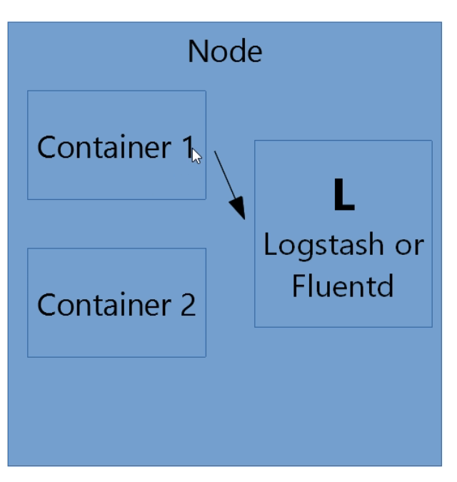
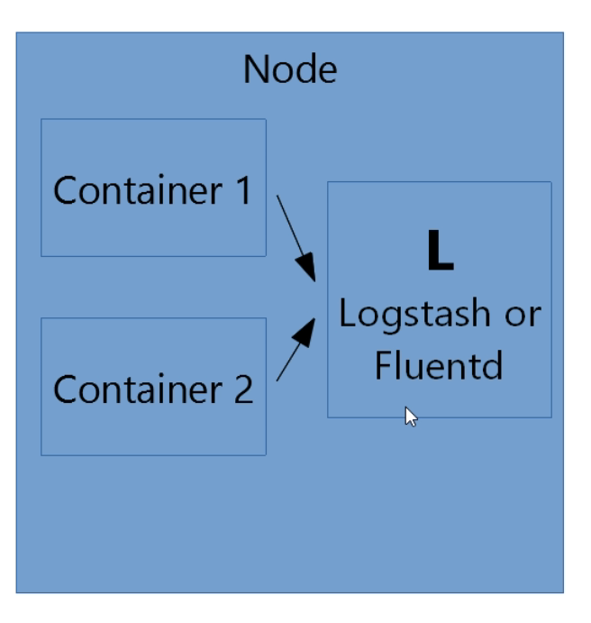
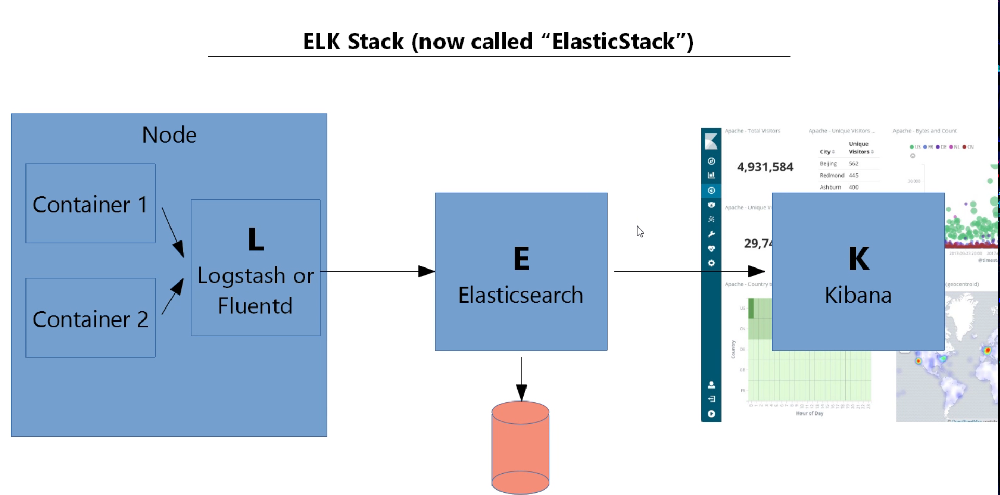
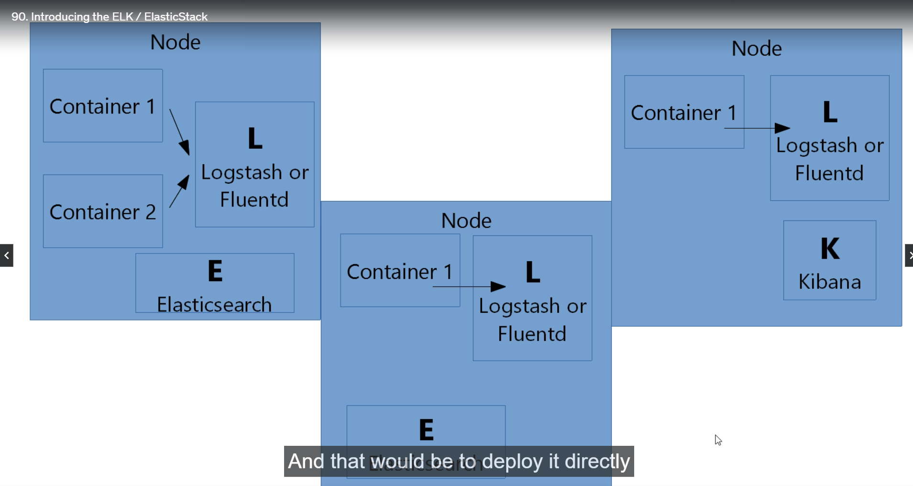

# Introduction to ELK / ElasticStack 

- **How to monitor the Kubernetes Cluster Health and How to analyze the Containers logs**

- this is `really critical` for `smooth running` of any type of `production deployment` 

- we start by `using logging` the `kubernetes cluster`

- we currently deployed the `kubernetes PODs` into the `AWS EKS/KOPS cluster` which containers the `Containers` , each of the `container` will be `writing the logs`

- we can get the `logs of the POD container` by using the command as below 

    ```bash
        kubectl logs <name of the POD container>
        # this will provide the Logs for that container
        # here we will be see the Logs of the POD in this case

        # for example if we see now the AWS EKS cluster have below PODs
        kubectl get po
        # it will display all the PODs in the default namespace in the kubernetes cluster
        NAME                                READY   STATUS    RESTARTS   AGE
        api-gateway-7c996ff9db-k7kzb        1/1     Running   0          8h
        mongodb-65bd7dbbfb-pr9ct            1/1     Running   0          4h13m
        position-simulator-6f78798c-zqdv2   1/1     Running   0          8h
        position-tracker-7f5bfddf94-nbb4x   1/1     Running   0          8h
        queueapp-c679b7cdb-q886g            1/1     Running   0          8h
        webapp-5bdb5b4bd7-nnr2b             1/1     Running   0          8h

        # now we can run the commnd as below to see the logs of position-simulator as below 
        kubectl logs position-simulator-6f78798c-zqdv2
        # the output will be as below 
        .   ____          _            __ _ _
        /\\ / ___'_ __ _ _(_)_ __  __ _ \ \ \ \
        ( ( )\___ | '_ | '_| | '_ \/ _` | \ \ \ \
        \\/  ___)| |_)| | | | | || (_| |  ) ) ) )
        '  |____| .__|_| |_|_| |_\__, | / / / /
        =========|_|==============|___/=/_/_/_/
        :: Spring Boot ::        (v1.4.0.RELEASE)

        2024-01-28 08:03:37.540  INFO 1 --- [           main] c.v.s.PositionsimulatorApplication       : Starting PositionsimulatorApplication v0.0.1-SNAPSHOT on position-simulator-6f78798c-zqdv2 with PID 1 (/webapp.jar started by root in /)
        2024-01-28 08:03:37.558  INFO 1 --- [           main] c.v.s.PositionsimulatorApplication       : The following profiles are active: production-microservice
        2024-01-28 08:03:37.875  INFO 1 --- [           main] s.c.a.AnnotationConfigApplicationContext : Refreshing org.springframework.context.annotation.AnnotationConfigApplicationContext@443b7951: startup date [Sun Jan 28 08:03:37 UTC 2024]; root of context hierarchy
        2024-01-28 08:03:41.649  INFO 1 --- [           main] o.s.j.e.a.AnnotationMBeanExporter        : Registering beans for JMX exposure on startup
        2024-01-28 08:03:41.663  INFO 1 --- [           main] o.s.c.support.DefaultLifecycleProcessor  : Starting beans in phase 2147483647
        2024-01-28 08:03:41.698  INFO 1 --- [           main] c.v.s.PositionsimulatorApplication       : Started PositionsimulatorApplication in 5.298 seconds (JVM running for 6.821)
        2024-01-28 08:03:41.708  INFO 1 --- [           main] s.c.a.AnnotationConfigApplicationContext : Closing org.springframework.context.annotation.AnnotationConfigApplicationContext@443b7951: startup date [Sun Jan 28 08:03:37 UTC 2024]; root of context hierarchy
        2024-01-28 08:03:41.709  INFO 1 --- [           main] o.s.c.support.DefaultLifecycleProcessor  : Stopping beans in phase 2147483647
        2024-01-28 08:03:41.710  INFO 1 --- [           main] o.s.j.e.a.AnnotationMBeanExporter        : Unregistering JMX-exposed beans on shutdown
        2024-01-28 08:03:43.341  WARN 1 --- [ool-1-thread-14] c.v.simulator.journey.Journey            : Queue unavailable - backing off 5000ms before retry
        2024-01-28 08:03:43.343  WARN 1 --- [ool-1-thread-13] c.v.simulator.journey.Journey            : Queue unavailable - backing off 5000ms before retry
        2024-01-28 08:03:43.343  WARN 1 --- [ool-1-thread-15] c.v.simulator.journey.Journey            : Queue unavailable - backing off 5000ms before retry
        2024-01-28 08:03:43.344  WARN 1 --- [ool-1-thread-17] c.v.simulator.journey.Journey            : Queue unavailable - backing off 5000ms before retry
        2024-01-28 08:03:43.344  WARN 1 --- [pool-1-thread-4] c.v.simulator.journey.Journey            : Queue unavailable - backing off 5000ms before retry
        2024-01-28 08:03:43.344  WARN 1 --- [ool-1-thread-21] c.v.simulator.journey.Journey            : Queue unavailable - backing off 5000ms before retry
        2024-01-28 08:03:43.344  WARN 1 --- [ool-1-thread-22] c.v.simulator.journey.Journey            : Queue unavailable - backing off 5000ms before retry
        2024-01-28 08:03:43.344  WARN 1 --- [ool-1-thread-24] c.v.simulator.journey.Journey            : Queue unavailable - backing off 5000ms before retry
        2024-01-28 08:03:43.344  WARN 1 --- [ool-1-thread-26] c.v.simulator.journey.Journey            : Queue unavailable - backing off 5000ms before retry
        2024-01-28 08:03:43.344  WARN 1 --- [ool-1-thread-27] c.v.simulator.journey.Journey            : Queue unavailable - backing off 5000ms before retry
        2024-01-28 08:03:43.344  WARN 1 --- [ool-1-thread-32] c.v.simulator.journey.Journey            : Queue unavailable - backing off 5000ms before retry
        2024-01-28 08:03:43.344  WARN 1 --- [ool-1-thread-33] c.v.simulator.journey.Journey            : Queue unavailable - backing off 5000ms before retry
        2024-01-28 08:03:43.344  WARN 1 --- [ool-1-thread-31] c.v.simulator.journey.Journey            : Queue unavailable - backing off 5000ms before retry
        2024-01-28 08:03:43.344  WARN 1 --- [ool-1-thread-30] c.v.simulator.journey.Journey            : Queue unavailable - backing off 5000ms before retry
        --- [ool-1-thread-35] c.v.simulator.journey.Journey            : Queue unavailable - backing off 5000ms before retry
        2024-01-28 08:03:43.344  WARN 1 --- [pool-1-thread-3] c.v.simulator.journey.Journey            : Queue unavailable - backing off 5000ms before retry
        2024-01-28 08:03:43.344  WARN 1 --- [pool-1-thread-1] c.v.simulator.journey.Journey            : Queue unavailable - backing off 5000ms before retry
        2024-01-28 08:03:43.344  WARN 1 --- [ool-1-thread-16] c.v.simulator.journey.Journey            : Queue unavailable - backing off 5000ms before retry
        2024-01-28 08:03:43.345  WARN 1 --- [ool-1-thread-34] c.v.simulator.journey.Journey            : Queue unavailable - backing off 5000ms before retry
        2024-01-28 08:03:43.345  WARN 1 --- [ool-1-thread-36] c.v.simulator.journey.Journey            : Queue unavailable - backing off 5000ms before retry
        2024-01-28 08:03:43.345  WARN 1 --- [ool-1-thread-38] c.v.simulator.journey.Journey            : Queue unavailable - backing off 5000ms before retry
        2024-01-28 08:03:43.345  WARN 1 --- [ool-1-thread-37] c.v.simulator.journey.Journey            : Queue unavailable - backing off 5000ms before retry
        2024-01-28 08:03:43.345  WARN 1 --- [ool-1-thread-10] c.v.simulator.journey.Journey            : Queue unavailable - backing off 5000ms before retry
        2024-01-28 08:03:43.345  WARN 1 --- [ool-1-thread-29] c.v.simulator.journey.Journey            : Queue unavailable - backing off 5000ms before retry
        2024-01-28 08:03:43.345  WARN 1 --- [pool-1-thread-8] c.v.simulator.journey.Journey            : Queue unavailable - backing off 5000ms before retry
        2024-01-28 08:03:43.345  WARN 1 --- [pool-1-thread-7] c.v.simulator.journey.Journey            : Queue unavailable - backing off 5000ms before retry
        2024-01-28 08:03:43.345  WARN 1 --- [pool-1-thread-6] c.v.simulator.journey.Journey            : Queue unavailable - backing off 5000ms before retry
        2024-01-28 08:03:43.345  WARN 1 --- [ool-1-thread-18] c.v.simulator.journey.Journey            : Queue unavailable - backing off 5000ms before retry
        2024-01-28 08:03:43.345  WARN 1 --- [ool-1-thread-12] c.v.simulator.journey.Journey            : Queue unavailable - backing off 5000ms before retry
        2024-01-28 08:03:43.345  WARN 1 --- [ool-1-thread-23] c.v.simulator.journey.Journey            : Queue unavailable - backing off 5000ms before retry
        2024-01-28 08:03:43.345  WARN 1 --- [ool-1-thread-11] c.v.simulator.journey.Journey            : Queue unavailable - backing off 5000ms before retry
        2024-01-28 08:03:43.345  WARN 1 --- [pool-1-thread-9] c.v.simulator.journey.Journey            : Queue unavailable - backing off 5000ms before retry
        2024-01-28 08:03:43.345  WARN 1 --- [pool-1-thread-2] c.v.simulator.journey.Journey            : Queue unavailable - backing off 5000ms before retry
        2024-01-28 08:03:43.345  WARN 1 --- [ool-1-thread-19] c.v.simulator.journey.Journey            : Queue unavailable - backing off 5000ms before retry
        2024-01-28 08:03:43.345  WARN 1 --- [pool-1-thread-5] c.v.simulator.journey.Journey            : Queue unavailable - backing off 5000ms before retry
        2024-01-28 08:03:43.345  WARN 1 --- [ool-1-thread-25] c.v.simulator.journey.Journey            : Queue unavailable - backing off 5000ms before retry
        2024-01-28 08:03:43.345  WARN 1 --- [ool-1-thread-20] c.v.simulator.journey.Journey            : Queue unavailable - backing off 5000ms before retry
        2024-01-28 08:03:43.360  WARN 1 --- [ool-1-thread-28] c.v.simulator.journey.Journey            : Queue unavailable - backing off 5000ms before retry


    ```

- here we can see the `WARNING` on the `kubernetes PODs` which can be `quite alarming` , we can see like these `in production if we have the some serious emergency that we are getting in the cluster` which is a `respectable way of checking the logs like this in case of emergency` which is one type of `manual log inspection`

- `manual log inspection` will be ok when we are `start building a New cluster` and making the `Cluster as up and running` , where we are `piecing together` the `components such as PODs/Replica-set/Deployment` for the `first time`

- `manual log inspection` will be ok when we are `testing the cluster locally` as well in this case 

- Here we want to look over what we need to do once the `cluster been stable and running up and fine` , when the `cluster been running fine` then its tempting to `forget about loggin the POD container logs` , but `logs can provide valiable info` about the `application running on the cluster` , it will be great if we can `analyze the logs of the container on real time`

- with the `logs` we can do things such as `counting the number of visitor for the website` i.e the `analytics of the traffics` , which can also be done using the `Google Analytics` , but if we want to take control of that we can `do that by fetching the logs of the webapp POD container`

- Even though the `website running fine` on the `Frontend as looks ok` , there might be chances that `some of the component i.e POD container` will be failing which will be causing `horrible problem later on`

- As we are `running the microservice system` which is `complex system` , even though `one component failing we wil not able to get that info until we check the logs of each POD container`

- one thing we can do is `once the cluster been stable and up and running` then we need to `look for the all POD container logs` and watching for the `exception that can be raised or error that been logged `  

- but `we can't check` the `logs of each POD container in the microservice system` by using the `manual log inspection` and `checking for the exception and error logged`

- we can possibly `write a script` in order to check the `logs` for `each POD container in the microservice system` in this case `which can be a lot harder`

- another `problem with logging` being the `logs were inside the POD container` which is `ephemeral or short lived` , once the `POD container restart then all the memory and file inside the POD container will be discarded` for which we can `loose the historical logs of that POD container which can be catastrophic` because those `log file of the crashed POD container can contain some critical logs which now being removed` which we want to `monitor later on`

- we need to fetch the `Historical error Logs in order to see that whats happening with the Microservice system for smooth running` from the `ephemeral logs of the POD container`

- the common solution for the `distributed loggging` is by `ELK Stack up until now` which also known as `Elastic Stack` now 

- here these are called `stack` because we will be using `multiple software components` to `achieve what we are looking for` 

- There are 3 component in the `Distributed Login System`

  - `Logstash/FluentD`
  
  - `ElasticSearch`
  
  - `Kibana`
  
- lets suppose we have a `Kubernetes node` with `2 POD container inside it` which are `writing logs` to the `POD container file system`

- hence we need to `gather together the Logs` in order to perform `analysis` on those `logs`

- here the `first element` of the `ELK stack` will be `going to be get used` ,  here need to `install` the `another software component as POD container` which will be running along with the `2 POD container inside the Kubernetes Node`

- that `another software component` traditionally known as `Logstash` which is the `L from the ELK stack accronym` in this case , but at this time `another component tool called Fluentd which does the same work as logstash` has the `most common choice` for `gather the Logs from the POD container`

- whether to choose `Logstash or fluentd(here we are using fluentd)` , they both `operate pretty much in the same way`

- this `Logstash or Fluentd software component that we are running as the POD container` will going to `find all the Logs in the Kubernetes Node from all the other POD container that running al-together`

- the `2 POD container` running inside the `Kubernetes Nodes will be writing the logs` and `Fluentd` will be capacble to `find those logs from the Docker container`

-  

- on the above picture the `Arrow Mark` showing the `Log Data flow` thats been happening from the `POD container to the Fluentd POD container`

- here there is no dependency bettween the `POD container which been writing logs to the specific file` and the `Fluentd POD container` which been `grabing those logs from that specific file location` , the `POD container have no knowledge that Fluentd POD container been grabbing the logs from it log file` , it more of a `pull model` where the `fluentd` will pulling the `logs` from all the other `POD container running inside that Kuibernetes Node`

- 

- `Fluentd/Logstash` can perform the same thing with the `Docker container` , but it is capable of perform the same thing `other languages as wellas datasources` links given here [Fluentd Data Source plugin](https://www.fluentd.org/datasources)

- `Fluentd` now a days `considered` as the `better performer` for `certain circumstances` hence becoming a `common choices`

- `Fluentd` gather only the `logs from all the POD container running inside the node` , it will not going to `store those logs` or `analyze` those `logs`

- for `analyze the logs` we need the `second component` which is `Elastic Search which is the E of the ELK` which refered as the `distributed seach and anayltic engine` , with `Elastic Search` we can store the data into the `Elastic Search Database` and then `we can query those Data trhat we have saved` which is based on `apache lucene which been built on java originally but now have multiple language stack`

- `Fluentd/logstash` will not going to `store the log data that its getting from all the POD container inside the Kubernetes node` , but rather `send them to the ElasticSeach to anaylyze` the same 

- we will be `continiously streaming the logs data  into the ElasticSeach(installed somewhere)` , we can `query the ElasticSearch Frontent` to `fetch the logs data we are constantly feeding`

- we can do that but `here we can also use the 3rd software component of the ELK stack known as the Kibana which define the K in the ELK stack`

- `Kibana` let us to `visualize the ElasticSeach Data` and `Navigate through the ElasticSearch`

- 

- `kibana` will provide `user friendly` way to interact with the `ElasticSeach Data` through `charts and graphs and other way for mining the ElasticSeach Data and finding out things about the ElasticSeach Data `

- in a `few moment` we will be `installing ELK stack` on the `EKS kubernetes cluster`


- **How to architect this ELK stack Installation in the Kubernetes Cluster for logging the Entire cluster**

- there is `Docker container` available for the `all the 3 software component` for the `ELK stack`

- we need to have the `fluentd container` running inside `every of the kubernetes Node inside the kubernetes Cluster` so that it can find `all the container inside the kubernetes Node`

- **Where will be installing the `ElasticSearch` & `Kibana` in the kubernetes cluster**

- the `answer` is `it does not matter` where we will be `installing` the `ElasticSearch` & `Kibana` , we can `arfchitect this in anyway you like`

- we can use the `pre installed ElasticSearch` `hosted` by the `cloud Provider(AWS)` in this case 

- in `AWS` we can ge the `hosted pre installed ElasticSearch as searvice` 

- rather than `setting the ElasticSearch` as `POD container` we can use the `hosted pre installed ElasticSearch as searvice instance` availble in `AWS` , which make sure there will be `robust implementation of the ElasticSearch` outside of the `Kubernetes Cluster`

- for `kibana` as its a `User Interface for the ElasticSearch`we can install anywhere such as `on the new EC2 instance` where the `kibana will be running outside of the Kubernetes cluster`

- hence we can `architect in anyway` the `ELS stack inside the Kubernetes cluster` 

- But there is `quick and dirty way` of running `ELK stack inside the kubernetes cluster` as below 

- 

- as we have the `3 kubernetes nodes` inside the `Kubernetes cluster` showin in the `above snip`

- here we are using `each software component of the ELK stack` as `POD container` in this  case

- we need to make sure that `Fluentd POD container` must be running inside the `each of the Kubernetes Node inside the kubernetes CLuster`

- we can make the `ElasticSeach POD container` as the `replica-set` which make sure `one instances of the ElasticSeach POD container` will be running always 

- because if the `ElasticSeach POD container` crashed then we `might loose some logs data` , hence we need to make sure that `one instance is running always`

- we need to `replicate the ElasticSeach POD container` accross `2 nodes` inside the `kubernetes CLuster` soo that it can handle the `node crash`

- we can use `kibana` as a `POD container` which is a `Webapp POD container` inside  a `songle node inside the Kubernetes cluster`

- if the `node goes down` we will losse access to the `ElasticSearch frontent` untill the `node come back up` and `reschedule the PODs` due to `Auto Scaling group`

- with this we don't have to use the `external implementation for the ElaticSearch` and we don't have to `fire new node` for handling the `ELK stack` for `cluster logging`

- but downside  is `we can overload the kubernetes Node` by installing all these `additional ELK POD container`

-   