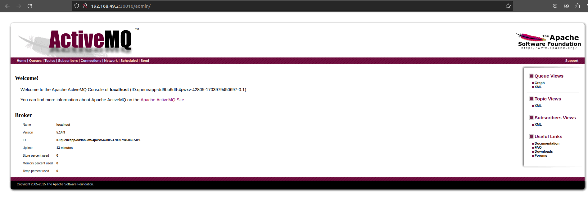

# Deploy Queue Application 

- from the `preveious session` now we have the clear understanding `why we have five separate component of micro-services system`

- we have the following component 
  
  - `A web-frontend` `implemented in Javascript and written in angular`
  
  - the `web frontend been calling the API Gateway`
  
  - on the `backend microservice` we have the 
    
    - `position tracker` , which will calculate the `speed of the vehicle` and `store the position of the vehicles into DB`
    
    - we also have a `message queue` which will `save the vehicle position as message` coming from the `position simulator`
    
    - we have the `position simulator` which will `testing micro-service` which will `generate the position of the vehicle` the `as they move accross the country`
    
    - we can replace the `position simulator` microservice with `real world vehicle with GPS(global positioning system) installed in them` when we `rollout to the real world`
    
- we need to convert this `micro-service system` into the `kubernetes deployment` 

- clearly these `microservice will going to be PODs/Deployment/Replicaset` , really hard thing is to getting it start , we can start from anywhere but we will start with the `Queue App i.e Active MQ micro-service` which is a good central point to start 

# Deploying the QueueApp i.e Active MQ

- before we start `deploying the Active MQ` queapp it is good to start the `minikube kubernetes cluster` by `minikube start --driver=docker`

- also `preveiously` we have deployed the `PODs/Service/Replica-Set/Deployment` to the `default namespace` , it is a `good idea to delete them to start from clean sheet`   

- if we are trying to `delete the PODs manually` then that will be auto created as `Replica-Set` and `Deployment` backing that up  

- we can clean that by using the command as below 

  ```bash
      kubectl delete -f <Definition file we want to delete>
      # if we want to del;ete the resources defined inside the definition file 
      # for this we can use as below 
      cd practical_kube_deployment 
      kubectl delete -f workloads.yml
      # inside the workloads.yml we have deined the Deployments hence it will delete the corresponding replica-set and corresponding POD as well 
      # the output will be as below 
      deployment .apps "webapp" deleted
      pod "queueapp" deleted

      kubectl delete -f services.yml
      # as we have define all the servi9ces inside the services.yml then it will remove all the kubernetes services in this casse
      # below will be output for the same 
      service "fleetman-database" deleted
      services "fleetman-webapp" deleted
      services "fleetman-queue" deleted

      # we can also do the below where it wilol delete all the resoces defined in the corresponding definition file inside the directorey as below 
      klubectl delete -f .
      # deleting all the resources defined in the definition file inside that specific folder
      # this is the important command in order to remove all the resources inside theall the definition file inside the CWD
      deployment .apps "webapp" deleted
      pod "queueapp" deleted
      service "fleetman-database" deleted
      services "fleetman-webapp" deleted
      services "fleetman-queue" deleted

      cd practical_kube_networking
      kubectl apply -f networking_test.yml
      # removing the resources inside the definition file 
      # below will be the output as 
      pod "mysql" deleted 

      #now when we do a kubectl get all to get all the reosources inside the default namespace then we will be getting as below 
      kubectl get all
      #below will be the output for the same
      NAME                 TYPE        CLUSTER-IP   EXTERNAL-IP   PORT(S)   AGE
      service/kubernetes   ClusterIP   10.96.0.1    <none>        443/TCP   7h30m
      # we can see the kubernetes APi service being availab le over here
  
  
  ```

- if we `accidently delete the service/kubernetes service` kubernetes will `auto recreate the service`

- we need to create a file named as `workloads.yml`  where we can put the `PODs/Replica-Set/Deployment` as these all belong to the `Workloads API`

- we can create the `workloads.yml` definition file in order to define the `QueueApp`

- for the `queueapp microservice` the name of `docker image with Tag` being `richardchesterwood/k8s-fleetman-queue:release1` 

- we need to `expose the Port 8161 as nodePort Service on port 30010` for the `Admin console` which is no longer required but `good to have` , as the `queueapp will run on the background without the need of Admin console to be exposed` but `Admin console` can be `very helpful` to see  `system been up and running using the Admin console`

- we also need to `expose the port 61616 for send and receive message` in this case , we need not have to expose this `port to browser or outside cluster` , it will be an `internal port` which will be `running inside the minikube kubernetes cluster`

- `queueapp is an critical part` of the `microservice system` , `hence always need instances to be running `

- if the `queueapp POD container` goes down we want the `kubernetes minikube cluster` to `restart the POD and ake it as running`

- for that reason we can either use a `replica-set` or `deployment` for this `queueApp POD container`

- here will be going for the `Deployment` as we want to do `upgrade to the QueueApp  over time` and make it as `rolling deployment` by `bringing the old-replicaset repilcas to 0 and new replica-set with replicas to be deployed`

- hence we can define that as below 

  ```yaml
      workloads.yaml
      ==============
      apiVersion: apps/v1 # making the apiVersion as apps/v1 as we are using the deployment which belong to the apps group
      kind: Deployment #using the kubernetes object as Deployment 
      metadata: # defining the name for the Deployment over here 
        name: queueapp
      spec: # defining the  specification for the Deployment over here
        replicas: 1 # here we want 1 instance of the Queueapp t be running always at a particular time 
        selector: # defining the selector to select the POD based on the labels 
          matchLabels: # defining the matchLabel as which selectoe key-value pair will match to POD label
            app: queueapp
        template: # defining the POD definitionas template over here
          metadata: # defining the label of the POD as app: queueapp
            labels: # definign the POD label as key-value pair
              app: queueapp
          spec: # defining the specification for the POD definition 
            containers: # defining the container list to use it here
              - name: queueapp # defining the container name queueapp
                image: richardchesterwood/k8s-fleetman-queue:release1
                # defining the image and release Tag for this 

  ```

- we can `deploy these changes` by `applying the definition file as below` 

  ```bash
      kubectl apply -f wrkloads.yml
      # applying the changes for the deployment
      # below will be the output for the same 
      deployment.apps/queueapp created

      # we can also see the kubernetes object created in the default namespace as below 
      kubectl get all
      # fetching all the kubernetes object in default namespace as below
      NAME                           READY   STATUS    RESTARTS      AGE
      pod/queueapp-dd9bb6dff-4pwxv   1/1     Running   1 (21m ago)   13h

      NAME                        TYPE        CLUSTER-IP       EXTERNAL-IP   PORT(S)                          AGE
      service/kubernetes          ClusterIP   10.96.0.1        <none>        443/TCP                          21h

      NAME                       READY   UP-TO-DATE   AVAILABLE   AGE
      deployment.apps/queueapp   1/1     1            1           13h

      NAME                                 DESIRED   CURRENT   READY   AGE
      replicaset.apps/queueapp-dd9bb6dff   1         1         1       13h

      #now if we want to see the logs of the POD then we can do it as below 
      kubectl describe POD queueapp-dd9bb6dff-4pwxv 
      # fetching the PODs desctiption using the command as below 
      Name:             queueapp-dd9bb6dff-4pwxv
      Namespace:        default
      Priority:         0
      Service Account:  default
      Node:             minikube/192.168.49.2
      Start Time:       Sun, 31 Dec 2023 05:07:27 +0530
      Labels:           app=queueapp
                        pod-template-hash=dd9bb6dff
      Annotations:      <none>
      Status:           Running
      IP:               10.244.0.16
      IPs:
        IP:           10.244.0.16
      Controlled By:  ReplicaSet/queueapp-dd9bb6dff
      Containers:
        queueapp:
          Container ID:   docker://80402c869ffa1aea4702797f58c320dd22a1328fdc18101bc67549b27e08cf12
          Image:          richardchesterwood/k8s-fleetman-queue:release1
          Image ID:       docker-pullable://richardchesterwood/k8s-fleetman-queue@sha256:bc2cb90a09aecdd8bce5d5f3a8dac17281ec7883077ddcfb8b7acfe2ab3b6afa
          Port:           <none>
          Host Port:      <none>
          State:          Running
            Started:      Sun, 31 Dec 2023 18:24:33 +0530
          Last State:     Terminated
            Reason:       Error
            Exit Code:    255
            Started:      Sun, 31 Dec 2023 05:07:27 +0530
            Finished:     Sun, 31 Dec 2023 18:24:00 +0530
          Ready:          True
          Restart Count:  1
          Environment:    <none>
          Mounts:
            /var/run/secrets/kubernetes.io/serviceaccount from kube-api-access-fs5wd (ro)
      Conditions:
        Type              Status
        Initialized       True 
        Ready             True 
        ContainersReady   True 
        PodScheduled      True 
      Volumes:
        kube-api-access-fs5wd:
          Type:                    Projected (a volume that contains injected data from multiple sources)
          TokenExpirationSeconds:  3607
          ConfigMapName:           kube-root-ca.crt
          ConfigMapOptional:       <nil>
          DownwardAPI:             true
      QoS Class:                   BestEffort
      Node-Selectors:              <none>
      Tolerations:                 node.kubernetes.io/not-ready:NoExecute op=Exists for 300s
                                  node.kubernetes.io/unreachable:NoExecute op=Exists for 300s
      Events:
        Type     Reason                  Age                From     Message
        ----     ------                  ----               ----     -------
        Warning  FailedCreatePodSandBox  22m                kubelet  Failed to create pod sandbox: rpc error: code = Unknown desc = failed to set up sandbox container "b610edc2fd68dbfe1488a45afe3ff8d1567ba5c1ebd6c45ea5a5e3cc3c6d95fd" network for pod "queueapp-dd9bb6dff-4pwxv": networkPlugin cni failed to set up pod "queueapp-dd9bb6dff-4pwxv_default" network: running [/usr/sbin/iptables -t nat -C CNI-530a72ddeedb267b7fdded68 ! -d 224.0.0.0/4 -j MASQUERADE -m comment --comment name: "bridge" id: "b610edc2fd68dbfe1488a45afe3ff8d1567ba5c1ebd6c45ea5a5e3cc3c6d95fd" --wait]: exit status -1:
        Normal   SandboxChanged          22m (x2 over 22m)  kubelet  Pod sandbox changed, it will be killed and re-created.
        Normal   Pulled                  22m                kubelet  Container image "richardchesterwood/k8s-fleetman-queue:release1" already present on machine
        Normal   Created                 22m                kubelet  Created container queueapp
        Normal   Started                 22m                kubelet  Started container queueapp


  ```

- we also have to define the `kubernetes services` as below for the `fleetman-queueapp` which will expose the `Ports` for the `fleetman-queueapp` as below 

- we can define  the `Service Definition` for the `Queue Deployment` as below with `srvices.yml` file

- here we need to `open` the `port 8161 as nodePor4t Srvice to port 30010 for the Admin console` and `port 61616 as the internal Port for the cluster which will help in send/receive the message`
  

  ```yaml
      services.yaml
      =============
      apiVersion: v1 # defining the apiVersion as v1 as Services belong to the core group
      kind: Service # defining the kubernetes object type as Service in this case
      metadata: # defining the Metadata for the name of service in here 
        name: fleetman-queueapp 
      spec: # defining the specification for the Service
        selector: # defining the selector to match the POD lable for service
          app: queueapp # defining the selector with key-value pair
        ports: # defining the Port we want to expose for the serrvice or allow the  traffic
          - name: admin # defining the port name as admin in here
            port: 8161 # allowing traffic on port 8161
            targetPort: 8161 # allowing the container port  as 8161
            protocol: TCP # defining the portocol as TCp here
            nodePort: 30010 # defining the nodePort Service outside the cluster as 30010

          - name: endpoints # defining another port to expose with the name as endpoint
            port: 616156 # allowing the Traffic on port 61616
            targetPort: 61616 # allowing the port 61616 on container 
            protocol: TCP # defining the protocol as TCP
            # as this need to be internal Service to the cluster we need not have to define the nodePort in this case

        type: NodePort # defining the NodePort as the Kubernetes Service type here
  
  ```

- we can dploy these changes by applying it as below 

  ```bash
      kubectl apply -f services.yml
      # appkying the changesto the definition to deploy it on to the kubernetes cluster 
      # we can see the below output in this case
      # we can see the below output 
      service/fleetman-queueapp created

      #now we can fetch the ip of the minikube kubernetes cluster in order to access the service as below 
      minikube ip
      # fetching the IP address of minikube cluster
      # below will be the output 
      192.168.49.2

      #now we can access the Admin console as 
      http://192.168.49.2:30010
      # we can see here the admin console 
      # we can click on manage admin console in order to access the Admin console 
      # here the USERNAME AND PASSWORD being admin admin and select the option as queues
      # once we go further we can see all the listed queue in the Admin console here 

  ```

- 

- of couse `putting username and password in Admin console` is not `secure` , but as soon as we make the `queueapp up and running` we will be `removing the part where it can be accessed outside the cluster` so that it will belong as an `internal service in that case`

-    