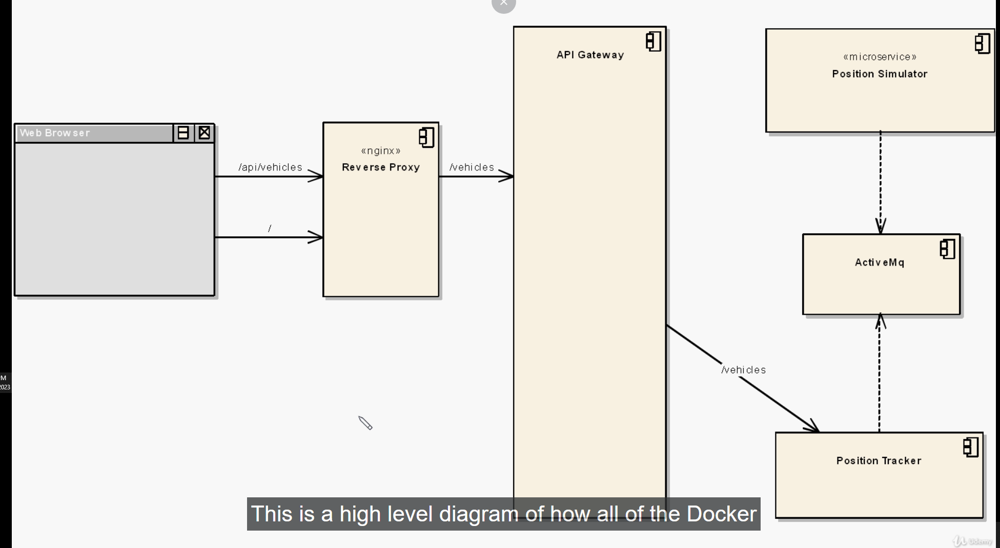
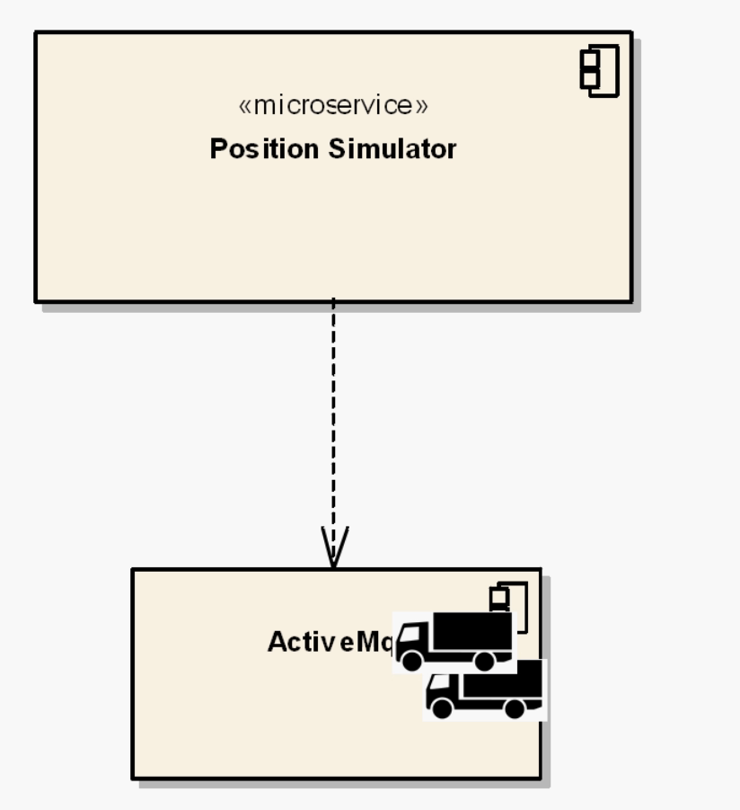
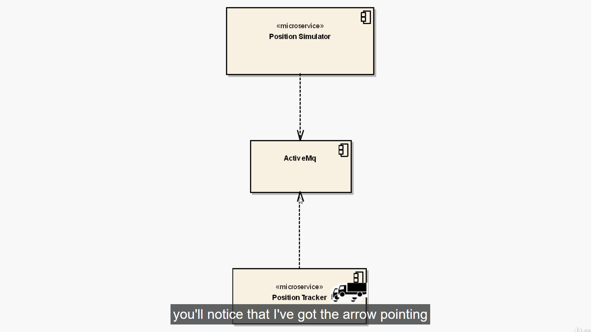
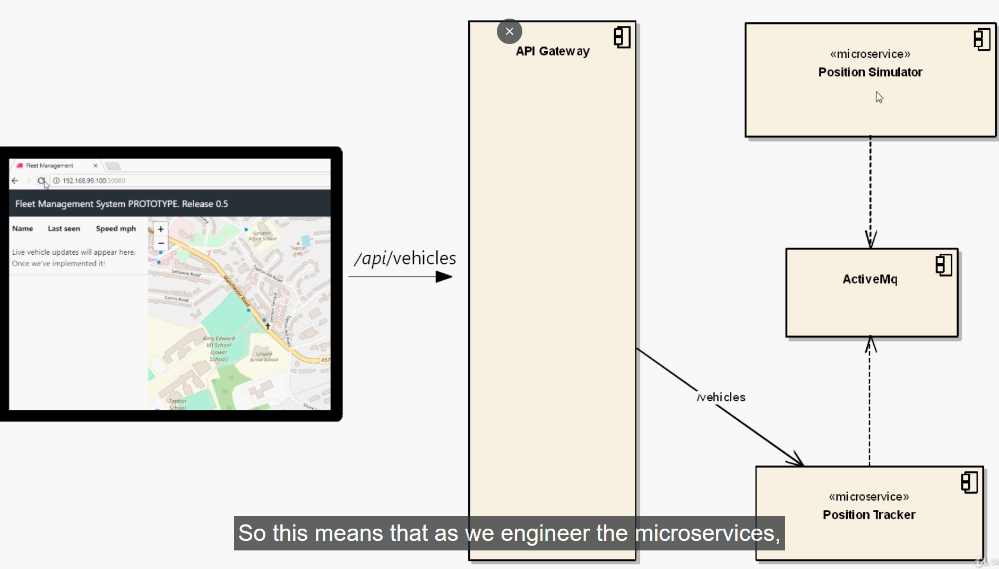

# integtrating kubernetes with Microservice Deployment 

- lets suppose the `Development Team` has `given a system` where `develope the application` and stored into `series of docker image`

- and your job as `operations engineer` is nee to `deploy it onto the cloud`

- we can go to the [Docker HUb](https://hub.docker.com) under the `richard chestwood` repo we can see these `series of docker image` with the `prefix` as `k8s`

- we need to assemble the `docker images` and build a `micro-service system` 

- need to decide whether these `images` should be a `POD/replica-ser/Deployments` , we need to `piecde them together` like `jigsaw puzzle`

- here there are `5 docker images` which construst a `basic micro-service` with `reasonable complexity` rather than the `hello-world problem`

- we can't deploy these `images` rather than having a `some understanding of the system` i.e `basic architecture of the system`

### overview of fleetman microservice architecture and How it is deployed

- below is the `high level architectural diagram` of `docker image` hang together

- 

- here each of the `box` such as below
  
  - `Reverse Proxy`
  
  - `API Gateway` 
  
  - `Position Simulator`
  
  - `Active MQ`
  
  - `Position Tracker`

- the `docker images` been present in [Docker HUb](https://hub.docker.com) under the `richard chestwood` repo we can see these `series of docker image` with the `prefix` as `k8s`

- it is complecated enough to illustrate `all th point` relates to the `kubernetes` , but `not so complecated that you will overwhelm by it `

- even though we don't have the `inner understanding of the system` , but `we can still able to deploy this system` to `public cloud`

- **we will see `What each of the piece are` and `how that being deployed together` ?**
  
  - the `system` is for the `transport company` who want to `track the vehicles such as delivery truck` as they `move around the country`
  
  - each of the `tracking vehicle` is `equipped` with a `global positioning system` and `periodically i.e every 10 sec sends the info(current position)` back to the `central server`
  
  - we have many of the `tracking vehicle` , `moving around the country` reporting their `current position`
  
  - bvut we don't have `real vehicle` in this  case , we have the `micro-service` named as `position simulator` for this 
  
  - **Position Simulator**
    
    - as the name suggest , `Position Simulator microservice` will `simulate` the `real vehicle moving around the country`
    
    - we can see all the `code` for the `Position Simulator microservice` on [Dickchesterwood Github Link](https://github.com/DickChesterwood/k8s-fleetman) &rarr; `release0-reconstruction-branch` branch
    
    - if we goto the folder as  [Dickchesterwood Github Link](https://github.com/DickChesterwood/k8s-fleetman) &rarr; `release0-reconstruction-branch` branch &rarr;  `k8s-fleetman-position-simulator/src` &rarr; `/main/resources/tracks` then we can see a `series of file` listed as the `latitude and longitude value` from where the `data been coming on` which are the `test-data`
    
    - it has been implemented with `JAVA` and implemented wusing the `spring boot` 
    
    - it just run an `infinity loop` and `randomly after every few seconds sends these latitute and longitude position od the simulated vehicle from the file` 
    
    - the `position simulator` microservice will `read` the `position(latitude and longitude) range` and provide the `current position for the same`
    
    - here the `name of file of test-data` become the `name of the vehicle` which will also appear on the `frontend as well`
    
    - if `we want to add a new test data file , then we will need to add the files `to the  `k8s-fleetman-position-simulator/src/main/resources/tracks` folder
    
    - when the `position simulator` reads the `latitude and longitude` then it need to `do something  with it` , will send the `current position to the Active MQ message queue`
    
    - as we know the `single micro-service` should do `one thing at a time` , incase of the `position simulator` that will be `simulating the position`
    
    - once it read the `latitude and longitude` and provide the `position to the Queue` the `job of the position simulator been done`
    
    - 
    
    - a `queue is a common aspect of the micro-service architecture` that `which allow to send data accross the system(which is service in this case)` without `coupling micro-service together`
    
  
  - **Active MQ**
    
    - here we are using the `Active MQ` for the `message Queue` , there could be `multiple Queue of choices` , but here we are using the `Active MQ` queue service
    
    - here the `Queue` i.e `Active MQ` like other `micro-service` such as `position simulator` been implemented as the `Docker Image`
    
    - here in order to see the `code for the Active MQ` we can go to the   [Dickchesterwood Github Link](https://github.com/DickChesterwood/k8s-fleetman) &rarr; `release0-reconstruction-branch` branch &rarr; `k8s-fleetman-queue/Dockerfile`
    
    - which is a simple docker file  which been using the `apache-activemq-5.14.3` for message queue
    
    - its just a simple `DFockerfile` which been using the `apache-activemq-5.14.3` provided by `apache.org`
    
    - 
    
  
  - **Position Tracker**
    
    - the `next microservice` being the `posuition tracker microservice` , `cetainly this is the most important micro-service for the system `
    
    - which will `read` the `current position` from the `Active MQ Queue` and `perform various calculation on them`  such as `speed of the vehicle ` 
    
    - it also create a `repository` in order to `fetch the histry of the vehicle for a particular warehouse` and to track `where the vehicle have been`
    
    -  
    
    -  here the `arrow been pointing` from the `position tracker` microservice to the `Active MQ` microservice 
    
    - as the `diagram` been represented in `UML` which point to the `dependency` over here
    
    - the `Position Tracker` microservice  need the `Active MQ` queue to read the `current position send by the position simulator`
    
  
  - the `above three component` represent the `entire backend of the micro-service system` , in real life `we could have many more microservicce for the backend of miucroservice system`
  
  - we also have the `frontend` to all of the `backend microservice that we have discussed` , which been written in `javascript app written in  angular`
  
  - the `last component that we need is a API Gateway`
  
  
  - **API Gateway**
    
    - the reason the `API Gateway` is necessary because `somehow the javascript frontend application` need to communicate with the `Backend Microservice`
    
    - its a bad practise to `Javascript frontend application` communicate to the `Backend Micro Service`
    
    - the reason being the `backend microservice` will `going to constantly change based on the requirement` we can` perform more calculation on the poisition tracker and etc ` 
    
    - the  `backend microservice` system can be `upgraded , modified and generally engineered`
    
    - the `microservice` generally `very small` and hence `need to splitted down or sometime also in opposite we need to combine two very small microservice to make as one microservice serving single responsibilty`  hence the `backend microservice` will be constant state of `flux or changing`
    
    - if we allowed the `Javascript frontent` to communicate with the `backend micro service` directly then we need to `makke changes on frontend as well` which consider as `anti pattern` and never should be allowed
    
    - hence we have introduced another `microservice` named as `API Gateway`
    
    - this is the `singl;e point of entry for the entire fleetman application`
    
    - the `frontend` going to make the `REST request to the API Gateway on an URL end point` and the `API Gateway` then `deligate` that `request on the specific endpoint` to the `corresponding microservice` based on the `some sort of logic in API Gatway` and able to `map the incoming request from frontend by REST on specific endpont to the corresponding backend micro-service`
    
    - the `frontend` will `only comminicate` to the `API Gateway` lets say on the `endpoint /api/vehicles REST end point service`  and then the `API Gatway` will forward that `/vehicles endpoint` to the `position tracker backend microservice`
    
    - the `logic` inside the `API Gateway`  is one kind of mapping , `if the REST REQUEST comes to an URL endpoint then forward that to specific backend microservice` 
    
    -  
    
    - as we engineer the `backend microservices` , `if we add new backend microservices and split up existing microservices` , then we don't have to bother about the `frontend javascript application` , we just have to add the `logic` to map  a `REST URL endpoint` to the `newly added or splitted microservice` to redirect the request over to that 
    
    - if we need further info on `API Gatway` read [API Gatway For Begginner](https://microservices.io/patterns/apigateway.html)