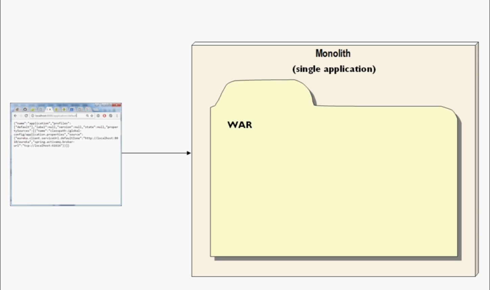
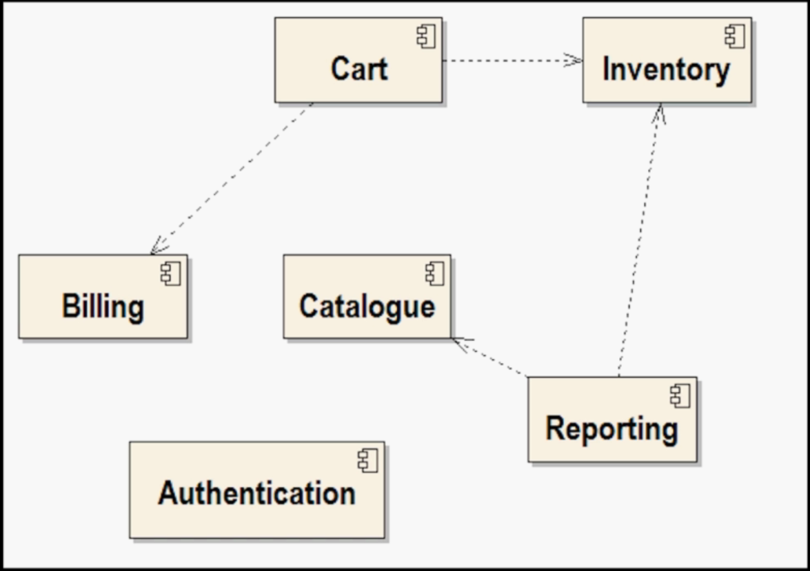
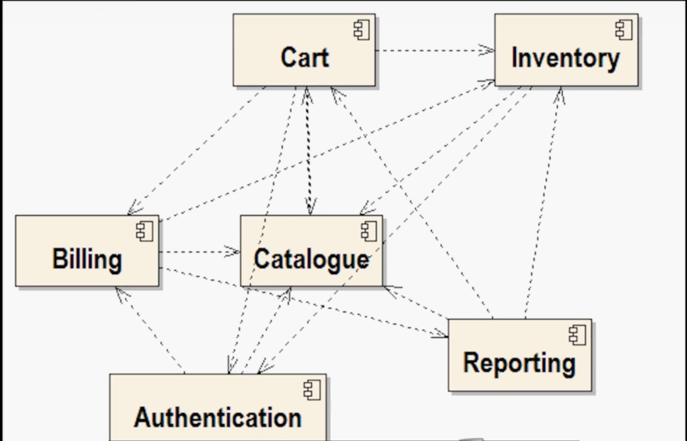

# kubernetes to deploy a Microservice Architecture

- Here we will use `kubernetes` to deploy `microservices architecture`

- here we have `multiple PODs, Services, Replica-set and Deployment ` we will be `Networking it all together`

- here will be getting `some problem along the way` , that will help in `fill in the gap`  , `learn some extra feature` such as
 
  - `environment variable`
  
  - `how to get the logs from a POD`

- the `system we are building` for the course is a `micro-service arechitecture` 

### High level concept with respect to Microservice

- **What is microservice is all about ?**
  
  - the `easiest way` to `explain the micro-service architecture` is to `contrast against` the `traditional architecture` , where we call the `traditional architecture` as `monoliths`
  
  - **monolithic Application** :- 
  
  - here in case of the `monoliths system` the `entire system been deployed as a single unit`
 
  - if it a `Java Web Based Application` then that can be the `single WAR file`
  
  - 
  
  - `unless it is a simple application` , the `war file` `won't be fullfilling only one business need` , it will be `fullfilling many many business requirement`
  
  - for example 
    
    - for a `shoping website` inside the `WAR file` we can `fetch code` for the `things` such as 
      
      - `shoping cart management`
      
      - `catalogue management`
      
      - `sales`
      
      - `inventory management`
      
      - `authentication`
      
      - `backend Administration`
      
      - `reporting feature`
      
      - `so on and on`     
      
    - over time the `Application` will get `bigger and bigger` , encompassing `different business requirement`
    
    - there will be a `global database` backing all these `application` , all these `business area` can `read and write to the database schema` of the `gloobal database`
    
    - but that is actually not the case the `DB schema can be broken into multiple separate schemas` , but its common to have a `global DB`
    
    - ofthen these `global database` been `shared` with `other monilothic application`   
    
    - if the `global database` been shared accross `multiple monolithic system` being the `integration database`
    
    - one of the `big problem`  of the `monolithic application` been it is going to be ` get bloated` , eventually become `too big to manage easily`
    
    - it will become `harder and harder to make changes to one business area` without `accidently impacting/breaking other business area` , which will make `hard to co-ordinate`        
    
    - by the time the `monolith get this big` , we have `multiple Teams managing different different business area` , thyey will start `crossing each other in this case`
    
    - lets suppose we are making changes to the `inventory requirement` then we need to communicate with the `colleague of other team` to make sure `i am not impacting one of them`
    
    - `which can delay the new release process` untill we make sure that `co-ordinate release will not impact the entire monolith application`
    
    - lets suppose we are making the change to the `inventory business requirement` , which will impact the `product business area` , hence we can't `make changes untill the issue been fixed on the product business area upgraded`
    
    - in case of `monolithic application` we will have the `Big Build Process` and where the `release need to be co-ordinated and make sure entire monolith application working fine`
    
    - we can't do a `big bang release` untill `days or week passed` 
    
    - the solution to this `very simple which is good engineering` 

    - **microservice**
    
    - we can think `micro-service` is an `extreme form of modularity` 
    
    - in case of the `micro-service` we need to `build the system` as `self contained component` which is now a days called as `microservice architecture`
    
    - A `micro-service` can be `considered` as the `self contained component or sub system`  
    
    - these `self contained component or sub system or micro-services` can 
      
      - `function on their own` 
      
      - `developed on their own` 
      
      - `deployed on their own`     
      
      - but these `microservice` will `communicate with each other` using `well defined interface` 
      
    -  
    
    - the above picture is `fragment of UML(Unified Modeling Language)` i.e `UML provides a set of graphical notation techniques to create abstract models of software systems`  , here the `symbol` represent the `UML component` that fits with the `concept of Microservice perfectly`
    
    - the `big idea of the micro-service` is that `separation of the component will be going to be extreme` 
    
    - in the `traditional approach`  we will be building all these `component separately as JAVA Packages` but at the end we will going to `package togethere as single big WAR file`
    
    - as we are using the `packages such as WAR for monolith application` again hence it will not provide the `serious level of separation at run time`
    
    - but in case of `micro-service` these `separate component` will be developed in 
      
      - `their own workspace`
      
      - `these separate component have their own standalone hardware`     
      
    - if  `we can afford it to have their own standalone hardware` then `each component or service` have their `own prvate physical instance server`
    
    - here `own prvate physical instance server` can be turnout `really expensive`  hence we can use the `container where we can define each micro-services i.e self contained component`
    
    - the point being `each microservice` is going to be `for its self contained through out its deployment as well entirely`
    
    - `one microservice code` `should not have direct visibilty` of `another microservice code`
    
    - but `there will be communication between` the `micro-service` hence there will be `interfaces`
    
    - these `interfaces can be anything` , there are `multiple options are there`
      
      - `interface can be REST call traditionally`
      
      - `interfacr can also be message queue`
      
    - `many internet real-estate such as Netflix` taken `onboard with` the `bold compnent separation using the micro-service architecture`
    
    - in case of `micro-service` we need to architect each `each system` as `separate service `  , each `separate service` will be `responsible for only one business rwquirement` which is `ideal`
    
    - the business requirement is something the `solution architect`  to decide    
    
    - one piece of rule while defining the `business requirement` is the `Two Pizza Rule` introduced by `Jeff Bezos`    

    - if a `single microservice development team(while coding)` can `feed with 2 Pizza` , which `make thing focsued`
    
    - that means the `micro-services` should be very `constrained in size`
    
    - if there were `5-6 developer developing the micro service then thats too big and need further breakdown`
    
    - here the  `micro-service` we will be creating will be `dealing with a single specific area` 
    
    - as `architect` we need to make sure of `single responsibilty principle` , which decide `what point we will devide the microservice into multiuple microservice` , which should have `few lines of code inside the micro-service`
    
    -  another `chief spect of micro-service` `with respect to` `good design` and `good architecture` being 
       
       - `highly cohesive`
         
           - `each microservice` will handle `one business requirement`
           
           - `coheshive` means `each microservice` should have `single set of responsiblity`  
           
           -  for example 
              
              - let suppose we have a `micro-service` named as `mailing list service` whose `responsibility` is to manage the `mailing list`
              
              - when the `customer sign up` this `micro-service` will `store their details such as mailing preferences (daily/weekly etc)` , `might check for the invalid customer if the customer already exist`
              
              - we can use this `service` responsible to `boardcast email newssettler` 
              
              - but `handling email newsettler` is completely different from `handling separate mailing list`
              
              - here the `broadcasting the email newsettler` can be a `separate micro-service` compare to `handling the mailing list` as both are `different responsibilty and apart from each other`
              
              - while `broadcasting the email newsettler microservice` can communicate with the `mailing list microservice` in order to fetch the `list of email to send the email` but both can be different microservice  
              
              - even there will be high chances to mix both the `business requirement` such as `handling mail list` and `broadcast email newsettler`     
       
       - `loosely coupled`   
         
         - `looselt coupled` means we need to `minimize the communication interface` between `two-microservice`
         
         - it will not be good if the `dependecy between the micro-service` looks something as below 
         
         -  
         
         - `maintaining loose coupling by minimizing the communication interface can be hard ` , we need to be `very careful` while sertting up the `communication interface between the interface` but thats the task of `sys architect` , `How the3 microservices are fitting together`
         
         - we can use `messaging` which can help in `reducing the / loosing the coupling in the system`
         
         - 

    
 
