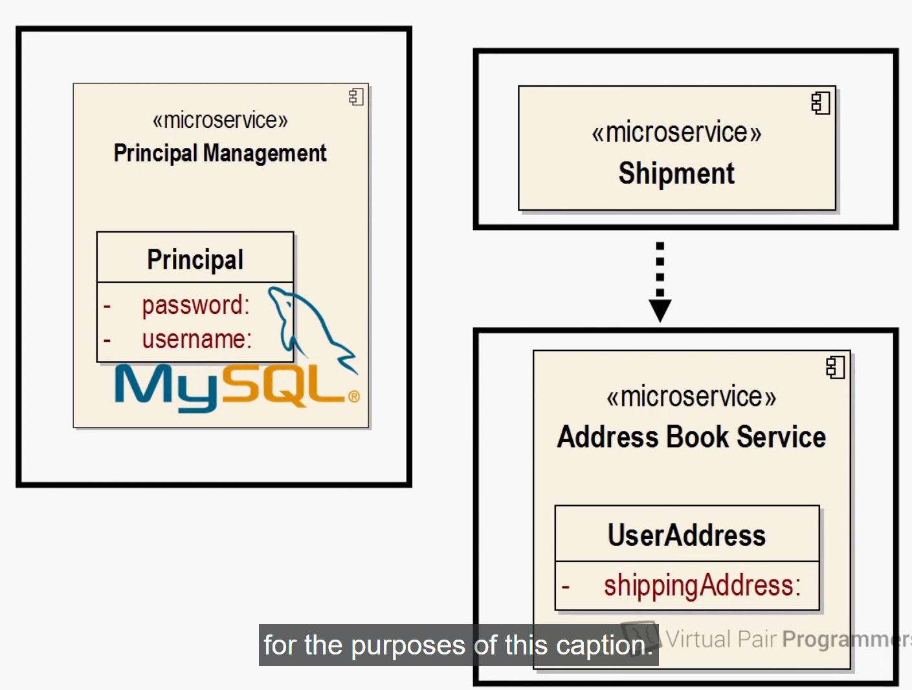
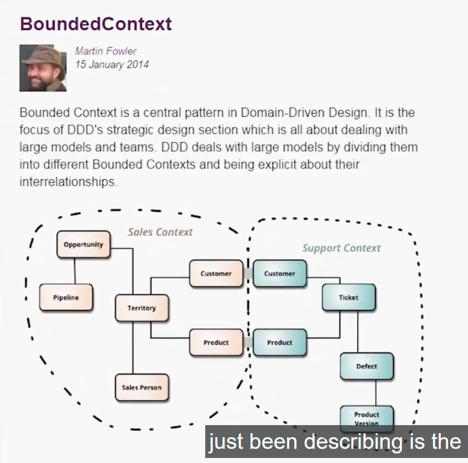

# introduction to micro-service part2

- here we will now discuss about the `usage databases in microservices`

- well this is `controversial` , as `many project or many business` `depends on` the `integration DB that we have discussed earlier`

- these `integration database` can be considered to be `build up for years and years`  and it could be the `biggest business assset of the organization`

- but for the `micro-service architrecture` the `Integration DB` are definately a `Big NO`

- because they immidiately `violate` the `2 priciple that we have discussed for the micro-service`
  
  - `Hightly coheshive` :- as the `integration DB` contains `many different business area` hence `not coheshive`
  
  - `loose coupling`  :- it is `not loosely coupled` as `any part of the system` can `read and write` to the `Integration DB` , even though , we can `manage` the `user prviledges` and use the `roles for multiple business areas` for `different different read and write priviledged` or we can have `database` which been devided into `multiple schemas`, but we do have a `major integration of the system` that is going to `cause a lot of coupling`
  
- for `many project` the `integration DB are preceious for buisiness` are the `show stopper for the micro-services` , hence `micro-service` is not for you 

- `micro-service` is not a `silver bullet` which can `solve every project issue` 

- 

- but we still need the `data store` , whether
  
  - that can be a `traditional relational Database` such as `MYSQL`
  
  - even that can be `NOSQL Database` such as `MongoDB`
  
  - Or `Big Database` such as `Hadoop`   
  
  - Or it could be a `Flat File` where we want to `store the Data`
  
- But in case of `micro-service` , each of the `Service` should have  `individual data Source i.e data store` and that `particular micro-service of the system` can only `read and write data` into that `data store`

-  the benefit of these being 
   
   - we can have `multiple type of data storage`    
   
   - if `one microservice` is `best suited to use a relational database` then thats fine
   
   - if `another microservice` have `best suited for the big database` then that could have a `BIg Database storage`
   
- that means `we have to think differently` about the `data models` , `data` been spread around the `entire system differently` as we have `different DB storage` for `different microservice`

- for example
  
  - lets suppose we have a `User Table` in a `monolith application` which is reposibile to store
    
    - `Username` and `Password` for `authentication`
    
    - and `shippingAdress` of the `user`
    
  - in that case `if we have a regular routin to ship the Product` we need to `seek the User Table in order to fetch the shippingAdress`
  
  - but in case of `authentication routin` also `when user try to login` in order to validate we can use the `Same User Table` to validate `whether the Username and Password been matching`
  
  -  
  
  - if we think carefully then `User Authentication` and `ShippingAdress` are `complete opposite to each other`  hence it will be `highly incoheshive` as it serving `multiple business requirement`
  
  - for this case `we need to refactor wavier ` for the `incoheshiveness of the User Table` in below way with `username, password, shipingAddress`

  - we can't have `single Data Source(such as user Details table(username, password, shipingAddress ))` which need to be used by `2 micro-services(authentication) and shipment`
  
  - we can have a `separate micro-service` for the `User Authentication` and save the DataStorage in `pricipal Table` and this microservice task is to `deal with authentication and validation`
  
  - we can have a `another microservice` such as `Shipment Microservice` which should have the `User shippingAdress`
  
  - 
  
  - but if we think `shipment microservice` `does not have to maintain` the `User shippingAdress` as it is `dealing with shipment` and `scheduled Delivery`
  
  - hence we can define `another microservice` named as `AddressBook microservice` which will dave the `User shipAddress` inside a `userAdddress Table Data Storage`
  
  - we need to connect the `Shipment MicroService` to the `AddressBook Microservice` to fetch the `User shipAddress` and `fetch the User shipAddress for shipment`
  
  -            

  - preveiously in the `monolith approach` what we have `though of as the database table` are going to be `modeled into different different data store differently in micro-service`
  
- while designing the `micro-service` it is not possible to `provide the design upfront`

- the `micro-service architecture` are `emergent` and are `going to be get developed as we are making more understanding of the system` 

- there are chances to `design, build and deploy` an `incoheshive system combing multiple business requirement` as above `while developing micro-service architecture` , but need to `refactor that later to make it coheshive(on a eureka moment)`

- `agility` is very important incase of `micro-service architecture` , as a human being all the question can't be answered while buiding the  software system

- There is a `jargon` for `separating the combined business requirement` is known as `bounded context` by `martin fowler` which been coined by `eric evans` on a book called as `Domain-Driven Design`

- `larger model` into small `bounded context` based on `Domain-Driven Design` , `Bounded context` means which we have the `data storage explicitly for a dedicated area` while developing the `larger model` by `Domain Driven Development`

- 

- here `we can see an example in the pic` where have the `monolithic system` been devided into `different bounded context` such as `sales context` and `support context` and both have the `customer and product data storage` which is `present/duplicated in both the bounded context` buit should be `completly different from each other`

- the `bounded context` `makes good sense` to `have single data store for the microservices`

- 