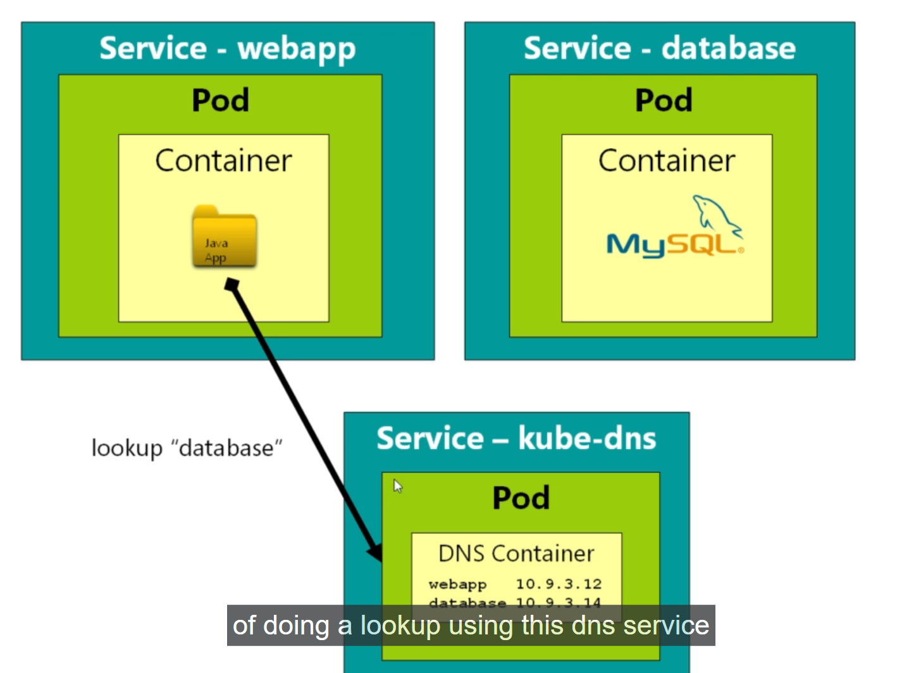

# Accessing the MYSQL from the POD

- we know now `why the kube-dns service` was not showing `when we try to fetch all kubernetes object in kubernetes cluster` , because of `different namespace`

- now we want to `establish a communication` from our `web-container POD` to the `Database POD service which is in a different POD from the web-container`

- as we know in order to make the communication between the `WebApp container POD Service` and `Database POD Service` we need to look for the `Database Service(Remote Service we want to access) lookup` inside the `kube-dns service` which is the `Key Value Database containing the service name as key and Service IP as value` which will provide access to the `Service`

- we can see the `below pic` in order to understand in a better way 

- 

- we have the `web container POD` for the `WebApplication`

- in the `Production microservice architecture` we will be using `complecated Database` such as `replicated mongoDB structure`  

- for now in order to test we will using the `mysql container POD` and `corresponding Service` accessing that `database service` inside the `webapp POD`

- we can do that using the below `YAML definition` called as `networking-test.yml` for the `mysql:5 Database POD service`

    ```yaml
        networking-test.yml
        =====================
        apiVersion: v1 # defining the apiVersion for the POD as v1 as it falls under the core group
        kind: Pod # definingthe type of kubernetes object as Pod in here
        metadata: # defining the name and label for POD that will be created
            name: mysql # defining the name of the POD as mysql
            labels: # defining the POD label as app: mysql as key-value pair
                app: mysql
        spec: # defining the specification for the POD with container details
            containers: # defining all the container in this case here
                - name: mysql # defining the name of the container as mysql 
                  image: mysql:5 # defining the name of the image as mysql:5
                  env: # defining the Environment variable for the Container
                    - name: MYSQL_ROOT_PASSWORD # here the mysql DB with root password as password
                      value: password

                    - name: MYSQL_DATABASE # mysql default DB will be created with the name as the fleetman
                      value: fleetman


        --- # Document Separator in order to define the Kubernetes Service in here

        apiVersion: v1 # defining the apiVerison as v1 in this case
        kind: Service # defining the type of kubernetes object as Service in here
        metadata: # defining the name of service which we want to reach as fleetman-database
            name: fleetman-database 
        spec: # defining the specification for the Kubernetes Services in here
            selector: # selector to select the POD based on the POD label
                app: mysql
            ports: # defining the Port we want to expose from the POD container
                - name: http # here the name of the port we want to accept as http
                  port: 3306 # allowing the traffic on port 3306 in here
                  targetPort: 3306 # forwarding traffic to port 3306 in  here
            type: ClusterIP # defining the type of Service will be as ClusterIp in this case which can only be accessed within the kubernetes cluster as both the webapp POD and fleetman-database POD are inside the same cluster they can able to communicate with each other

    
    ```

- here we can `provide the environment variable for the POD` and set it  by using the `env` inside the `containers definition`

- but in the `Production label` we can define the `kubernetes secrets` rather than using the `env` and setting the `Password on the container`

- we can `apply` those changes in order to deploy the `kubernetes service` as below

    
    ```bash
        kubectl apply -f networking-test.yml
        # here we are deploying the changes by applying the kubernetes deployment file 
        #  we can see the below response as output in here
        pod/mysql created
        service/fleetman-database created
    
        #now if we want to fetch all the kubernetes object inside the default namespace 
        # here we can use the command as below 
        kubectl get all 
        # below will be the response
        NAME                          READY   STATUS    RESTARTS      AGE
        pod/mysql                     1/1     Running   0             110s # here we can see the PODs created with the name as mysql as POD name
        pod/queueapp                  1/1     Running   1 (84m ago)   3h14m
        pod/webapp-7f58455867-k2sbd   1/1     Running   1 (84m ago)   3h14m
        pod/webapp-7f58455867-n4smg   1/1     Running   1 (84m ago)   3h14m

        NAME                        TYPE        CLUSTER-IP       EXTERNAL-IP   PORT(S)          AGE
        service/fleetman-database   ClusterIP   10.104.120.205   <none>        3306/TCP         110s # we can see also the Service created with the name as fleetman-database
        service/fleetman-queueapp   NodePort    10.110.156.33    <none>        8161:30010/TCP   3h14m
        service/fleetman-webapp     NodePort    10.109.54.70     <none>        80:30080/TCP     3h14m
        service/kubernetes          ClusterIP   10.96.0.1        <none>        443/TCP          3h16m

        NAME                     READY   UP-TO-DATE   AVAILABLE   AGE
        deployment.apps/webapp   2/2     2            2           3h14m

        NAME                                DESIRED   CURRENT   READY   AGE
        replicaset.apps/webapp-7f58455867   2         2         2       3h14m

    
    ```

- now as we know `we already have the webapp container` which been spunned using the `Deployment` , we can access the `Terminal of that Webapp POD ` and access the `fleetman-database` service

- here for the `Kubernetes Service as fleetman-database` has the `internal cluster IP` as `10.104.120.205` which can be `different and dynamically allocated when the cluster restart`

- we justr have to `exec to the WebApp Container POD` and try to access the `Fleetm,an-Database Service` from there by `issuing some command` rather than changing the `code of the webApp container POD` and need to validate whether we can access that `Database` inside the `WebApp container POD`

- if we are going to the `github` &rarr; `DickChesterwood/k8s-fleetman` on the `branch` as `release0-reconstruction-branch` &rarr; `k8s-fleetman-webapp-angular/Dockerfile` then we can see that the base image used for the `WebApp container`  is of `Alpine image` as `FROM nginx:1.14.0-alpine` which will provide the `basic terminal in order to access container terminal`

- `alpine is a basic light weight terminal without any rubbish hence can be used with container ` very usefule to build the `Docker container`

- `Alpine` does not have the `bash shell installed by default` hence we need to use the `sh terminal/shell in that case` 

- we can acchieve that using the command as below 

    
    ```bash
        kubectl exec -it webapp-7f58455867-k2sbd -- sh
        # using the kubectl exec -it command in order to access the POD container Terminal and executing the command as sh here
        # it will attach the container terminal with a TTY(Teletype Terminal)
        # but if we are using cygwin then it does not have the terletype terminal hence we need to  use an alternative as winpty terminal
        
    ```
