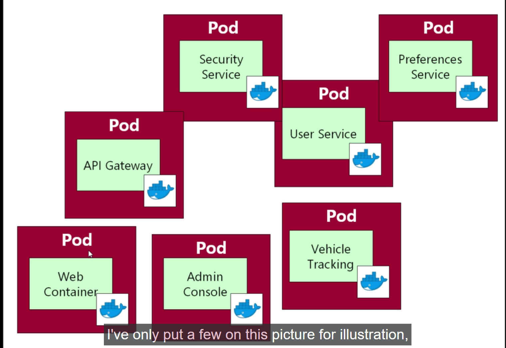
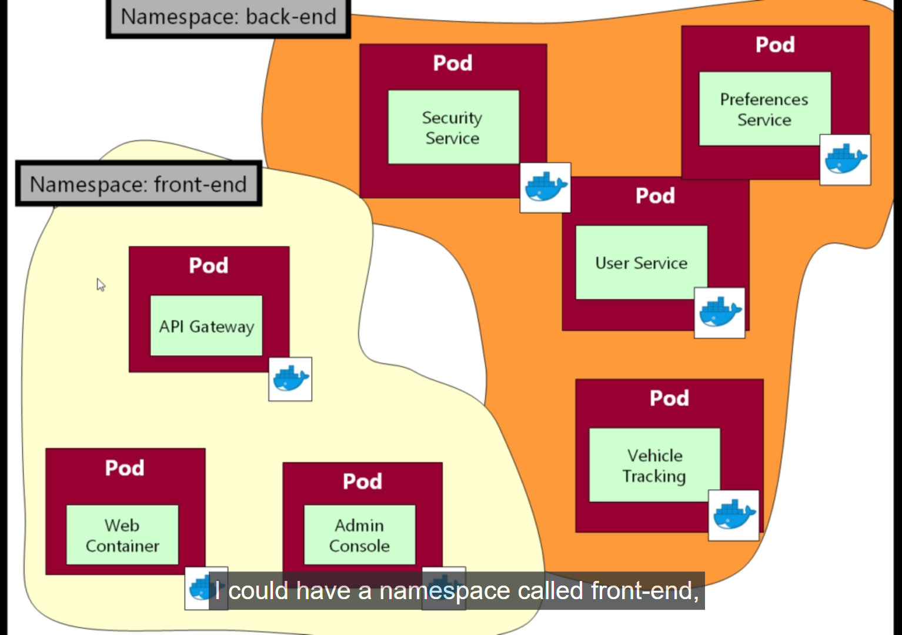

# Kubectl Namespace

- when we do a `kubectl get all` we can only see the 
  
  - PODs
  
  - Services
  
  - Replica-set
  
  - Deployment

that we have `manually deployed` into the `kubernetes cluster`

- we are expecting to see `one more service` named as `kube-dns Service` while we are using the `kubectl get all` command against the `minikube kubernetes local cluster`

- in order to describe that we need to understand `How namespace work in kubernetes ?`

### Namespaces in kubernetes 


- A `namespaces` is a `way of "partioning the resources in kubernetes" into "separate area"`

- lets suppose we are `working` with the `kubernetes system` which has `1000 PODs` and `1000 Services` , but `Kubernetes resources also means PODs, Services, replica-set and deployment as well` all the `statement we are making with respect to the PODs and Services also holds true for replica-set and deployment as well`

- we can see the below snipd for reference , where have `multiple POD as Services` inside the `kubernetes cluster`

- 

- As we are working with the `kubernetes system` which has `1000 PODs` and `1000 Services` then it will be `very difficult to work on that kubernetes system` as there `too many PODs and Services on that kubernetes system`

- the `idea of kubernetes namespace ` that we can `go through` the `PODs and Services` inside the `kubernetes system` and `allocate` the `PODs and Services` into a specific `kubernetes namespace`

- in this `pic` we can see that 
  
  - the `web-container` which is inside the `POD` should have a `associated Service` as its going to run  
  
  - we also have the `Admin console` and its associate `Services` which can also behave as the `Frontend PODs and Service`
  
  - we also have the `API Gateway POD` and its associate `Services` which can also be considered as the `Frontend POD and Service`
  
  - hence we can put all these `PODs` and `Associated Service` into a `namespace` called as `frontend`

  - similarly `vehicle tracking` , `User Service` , `Security Service`,  `Preference Service` can be considered as the `backend Application` , hence can be put to a `namespace` called `backend`

  - we can see the `pic` as below 

  - 


- `kubernetes namespace` is nothing but putting the `resouces such as (PODs/Services/Replica-Set/Deployment)` into what is nothing more than a `folder/packages(if considering the language prospective)` , even some of the language such as `c#` has the concept of `namespace` already associated with the `language` which is exactly same as `kubernetes namespaces`

- up untill now `we have not use the namespace while issuing the kubectl command` 

- `when we don't speecify` the `namespace` while issuing the `kubectl command` then `it will create and fetch the resource result from the "default" kubernetes namespace`

- if we are issuing the command such as `kubectl get all` without specifying the `particular namespace` then we will fetch the `resources(PODs/Services/Replica-Set/Deployment) in the default namespace only` as below 

  
  ```bash
      kubectl get all
      # fetching the kubernetes object inside the default namespace and inside the kubernetes cluster
      # this below will be the response for the same 
      NAME                          READY   STATUS    RESTARTS   AGE
      pod/queueapp                  1/1     Running   0          33s
      pod/webapp-7f58455867-k2sbd   1/1     Running   0          33s
      pod/webapp-7f58455867-n4smg   1/1     Running   0          33s

      NAME                        TYPE        CLUSTER-IP      EXTERNAL-IP   PORT(S)          AGE
      service/fleetman-queueapp   NodePort    10.110.156.33   <none>        8161:30010/TCP   26s
      service/fleetman-webapp     NodePort    10.109.54.70    <none>        80:30080/TCP     26s
      service/kubernetes          ClusterIP   10.96.0.1       <none>        443/TCP          2m21s

      NAME                     READY   UP-TO-DATE   AVAILABLE   AGE
      deployment.apps/webapp   2/2     2            2           33s

      NAME                                DESIRED   CURRENT   READY   AGE
      replicaset.apps/webapp-7f58455867   2         2         2       33s

  ```

- `kubernetes` `with basic configuration`  `by default comes with` few `additional namespaces` , we can verify that using the command as `kubectl get namespaces` or `kubectl get ns` command as below 

  ```bash
      kubectl get namespaces
      # fetching all the namespaces for the kubernetes system
      #Or
      kubectl get ns
      # which will provide the response as below
      NAME              STATUS   AGE
      default           Active   5m41s # here this is the default namespace that we are working with untill now
      kube-node-lease   Active   5m41s 
      kube-public       Active   5m41s
      kube-system       Active   5m41s
  
  ```

- `kubernetes` has also its `own internal namespace` which can be named as 
  
  -  `kube-system`
  
  -  `kube-public`
  
  -  `kube-node-lease`

- if we want to fetch the `resources in that specific namespace` then we need to be `specific` and need to provide the `namespace details` as below

- if we want to see all the `PODs` that reside inside the `kube-system namespace` then we can use the command as below

  ```bash
      # if we use only kubectl get pods/po
      kubectl get pods/po
      # this will provide the PODs details inside the default namespace as below
      NAME                      READY   STATUS    RESTARTS   AGE
      queueapp                  1/1     Running   0          15m
      webapp-7f58455867-k2sbd   1/1     Running   0          15m
      webapp-7f58455867-n4smg   1/1     Running   0          15m

      kubectl get pods/po -n <namespace>
      # using the above command we can see the all the PODs inside specific namespace
      #for example :- if we want to see all the PODs inside the kube-system namespace then we can see that as below 

      kubectl get po -n kube-system
      # this will provide all the PODs that reside inside the kube-system namespace
      NAME                               READY   STATUS    RESTARTS      AGE
      coredns-5dd5756b68-zll6f           1/1     Running   0             10m
      etcd-minikube                      1/1     Running   2 (11m ago)   11m
      kube-apiserver-minikube            1/1     Running   2 (11m ago)   11m
      kube-controller-manager-minikube   1/1     Running   2 (11m ago)   11m
      kube-proxy-ch2kf                   1/1     Running   0             10m
      kube-scheduler-minikube            1/1     Running   2 (11m ago)   11m
      storage-provisioner                1/1     Running   1 (10m ago)   11m

      # if we want to fetch all the kubernetes object inside the particular kubernetes namespace then we can use the command as below 
      kubectl get all -n kube-system
      # this will fetch all the kubernetes object under a particular namespace
      NAME                                   READY   STATUS    RESTARTS      AGE
      pod/coredns-5dd5756b68-zll6f           1/1     Running   0             12m # here we can see the POD with name as <name of Deployment>-<random str from replica set>-<random str>
      pod/etcd-minikube                      1/1     Running   2 (12m ago)   13m
      pod/kube-apiserver-minikube            1/1     Running   2 (12m ago)   13m
      pod/kube-controller-manager-minikube   1/1     Running   2 (12m ago)   13m
      pod/kube-proxy-ch2kf                   1/1     Running   0             12m
      pod/kube-scheduler-minikube            1/1     Running   2 (12m ago)   13m
      pod/storage-provisioner                1/1     Running   1 (12m ago)   12m

      NAME               TYPE        CLUSTER-IP   EXTERNAL-IP   PORT(S)                  AGE
      service/kube-dns   ClusterIP   10.96.0.10   <none>        53/UDP,53/TCP,9153/TCP   12m # here we will be seeing the Service named as kube-dns and its POD being <name of Deployment>-<random str from replica set>-<random str> and also we can see the Service with the name as kubenetes-dashboard as well in few cases

      NAME                        DESIRED   CURRENT   READY   UP-TO-DATE   AVAILABLE   NODE SELECTOR            AGE
      daemonset.apps/kube-proxy   1         1         1       1            1           kubernetes.io/os=linux   12m # here we can see the daemonset named as kube-proxsy which we will discuss later

      NAME                      READY   UP-TO-DATE   AVAILABLE   AGE
      deployment.apps/coredns   1/1     1            1           12m # we can see the Deployment with the name as coredns

      NAME                                 DESIRED   CURRENT   READY   AGE
      replicaset.apps/coredns-5dd5756b68   1         1         1       12m # we can see the replica-set for the Deployment <name of Deployment>-<random str>
  
  ```

- but we can also see the `another namespace` listed as `kube-public` when we did a `kubectl get ns` command above

- if we want to `fetch the resouces` inside the `kube-public` namespace then  we need to provide the below command 

    ```bash
        kubectl get all -n kube-public
        # fetching all the resources in kube-public namespace in here
        # below will be the output
        No resources found in kube-public namespace.
    
    ```

- here this `kube-public` namespace will be used `internal kubernetes system` that `we don't really need`

- we might think like `inside the kube-public namespace` we need to `put our resources` and `kube-system namespace will be internally used by kubernetes to handle additional Service and PODs related to kubernetes  infrastructure` , but that not true `bith the kube-public, kube-system` namespace were uised by the `kubernetes internally` , we wil not be putting any resource inside the `kube-public/kube-systen namespaces`

- if we go for the `stack overflow link` as [What kube-public namespace does in kubernetes system](https://stackoverflow.com/questions/45929548/whats-the-kube-public-namespace-for) then we can get the `anwser` with `blog post` and `design document`

- `kube-public namespace` there `if we want to share the certificates and config maps` , which does not required much while dealing with `kubernetes system`

- if we want to `putting resources` inside a `specific different namespace` , in that case we have to remember that `we need to always provide the namespace details while creating and fetching the resources`

- if we want to fetch all the `kubernetes object in kube-system namespace` then we can have to provide the `kubectl get all -n <namespace where we want to query>`

- we can do that as below 

    ```bash
        kubectl get all -n kube-system
        # fetching all the kubernetes object inside the kube-system namespace as below
        NAME                                   READY   STATUS    RESTARTS      AGE
        pod/coredns-5dd5756b68-zll6f           0/1     Running   1 (48s ago)   112m
        pod/etcd-minikube                      1/1     Running   3 (48s ago)   113m
        pod/kube-apiserver-minikube            1/1     Running   3 (48s ago)   112m
        pod/kube-controller-manager-minikube   1/1     Running   3 (48s ago)   112m
        pod/kube-proxy-ch2kf                   1/1     Running   1 (48s ago)   112m
        pod/kube-scheduler-minikube            1/1     Running   3 (48s ago)   112m
        pod/storage-provisioner                1/1     Running   2 (48s ago)   112m

        NAME               TYPE        CLUSTER-IP   EXTERNAL-IP   PORT(S)                  AGE
        service/kube-dns   ClusterIP   10.96.0.10   <none>        53/UDP,53/TCP,9153/TCP   112m

        NAME                        DESIRED   CURRENT   READY   UP-TO-DATE   AVAILABLE   NODE SELECTOR            AGE
        daemonset.apps/kube-proxy   1         1         1       1            1           kubernetes.io/os=linux   112m

        NAME                      READY   UP-TO-DATE   AVAILABLE   AGE
        deployment.apps/coredns   0/1     1            0           112m

        NAME                                 DESIRED   CURRENT   READY   AGE
        replicaset.apps/coredns-5dd5756b68   1         1         0       112m

      #lets suppose we want to enquire about the particular Service such as the kube-dns service then we hyave to use the command as below 
      kubectl get svc kube-dns -n kube-system
      # here in order to enquire about a particular service we need to use the command as above with the -n <namspace> , else we will end up getting the error as by default it will look in the default namespace in that case
      # we can see the details as below 
      Name:              kube-dns
      Namespace:         kube-system
      Labels:            k8s-app=kube-dns
                        kubernetes.io/cluster-service=true
                        kubernetes.io/name=CoreDNS
      Annotations:       prometheus.io/port: 9153
                        prometheus.io/scrape: true
      Selector:          k8s-app=kube-dns
      Type:              ClusterIP
      IP Family Policy:  SingleStack
      IP Families:       IPv4
      IP:                10.96.0.10
      IPs:               10.96.0.10
      Port:              dns  53/UDP
      TargetPort:        53/UDP
      Endpoints:         10.244.0.59:53
      Port:              dns-tcp  53/TCP
      TargetPort:        53/TCP
      Endpoints:         10.244.0.59:53
      Port:              metrics  9153/TCP
      TargetPort:        9153/TCP
      Endpoints:         10.244.0.59:9153
      Session Affinity:  None
      Events:            <none>
 
    
      # if we want to fetch the PODs details for a specifc POD inside the kube-system such as the `coredns POD` then also while providing we need to use -n <namespace> here
      kubectl get pods/po coredns-5dd5756b68-zll6f -n kube-system
      #fetching the POD details inside the specific kube-system namespace
      Name:                 coredns-5dd5756b68-zll6f
      Namespace:            kube-system
      Priority:             2000000000
      Priority Class Name:  system-cluster-critical
      Service Account:      coredns
      Node:                 minikube/192.168.49.2
      Start Time:           Wed, 27 Dec 2023 15:54:10 +0530
      Labels:               k8s-app=kube-dns
                            pod-template-hash=5dd5756b68
      Annotations:          <none>
      Status:               Running
      IP:                   10.244.0.59
      IPs:
        IP:           10.244.0.59
      Controlled By:  ReplicaSet/coredns-5dd5756b68
      Containers:
        coredns:
          Container ID:  docker://db7bae04277ab37ebce6e4bdfb42a34e14b63fd0390430719f117f3568e26252
          Image:         registry.k8s.io/coredns/coredns:v1.10.1
          Image ID:      docker-pullable://registry.k8s.io/coredns/coredns@sha256:a0ead06651cf580044aeb0a0feba63591858fb2e43ade8c9dea45a6a89ae7e5e
          Ports:         53/UDP, 53/TCP, 9153/TCP
          Host Ports:    0/UDP, 0/TCP, 0/TCP
          Args:
            -conf
            /etc/coredns/Corefile
          State:          Running
            Started:      Wed, 27 Dec 2023 17:46:01 +0530
          Last State:     Terminated
            Reason:       Error
            Exit Code:    255
            Started:      Wed, 27 Dec 2023 15:54:10 +0530
            Finished:     Wed, 27 Dec 2023 17:45:31 +0530
          Ready:          True
          Restart Count:  1
          Limits:
            memory:  170Mi
          Requests:
            cpu:        100m
            memory:     70Mi
          Liveness:     http-get http://:8080/health delay=60s timeout=5s period=10s #success=1 #failure=5
          Readiness:    http-get http://:8181/ready delay=0s timeout=1s period=10s #success=1 #failure=3
          Environment:  <none>
          Mounts:
            /etc/coredns from config-volume (ro)
            /var/run/secrets/kubernetes.io/serviceaccount from kube-api-access-lbrbv (ro)
      Conditions:
        Type              Status
        Initialized       True 
        Ready             True 
        ContainersReady   True 
        PodScheduled      True 
      Volumes:
        config-volume:
          Type:      ConfigMap (a volume populated by a ConfigMap)
          Name:      coredns
          Optional:  false
        kube-api-access-lbrbv:
          Type:                    Projected (a volume that contains injected data from multiple sources)
          TokenExpirationSeconds:  3607
          ConfigMapName:           kube-root-ca.crt
          ConfigMapOptional:       <nil>
          DownwardAPI:             true
      QoS Class:                   Burstable
      Node-Selectors:              kubernetes.io/os=linux
      Tolerations:                 CriticalAddonsOnly op=Exists
                                  node-role.kubernetes.io/control-plane:NoSchedule
                                  node.kubernetes.io/not-ready:NoExecute op=Exists for 300s
                                  node.kubernetes.io/unreachable:NoExecute op=Exists for 300s
      Events:
        Type     Reason          Age                    From     Message
        ----     ------          ----                   ----     -------
        Normal   SandboxChanged  6m5s                   kubelet  Pod sandbox changed, it will be killed and re-created.
        Normal   Pulled          6m5s                   kubelet  Container image "registry.k8s.io/coredns/coredns:v1.10.1" already present on machine
        Normal   Created         6m5s                   kubelet  Created container coredns
        Normal   Started         6m4s                   kubelet  Started container coredns
        Warning  Unhealthy       5m47s (x3 over 5m57s)  kubelet  Readiness probe failed: HTTP probe failed with statuscode: 503

    
    ```

- currently `we will be using the default namespace in order to deploy the kubernetes resource as of now`

- but when we go for `kubernetes monitoring and logging` then we will be using the `multiple third party PODs` in that case we can put them into the `separate namespace` and keep the `core PODs inside the default namespace of kubernetes` as there can `multiple number of PODs and Services while using the microservices`

