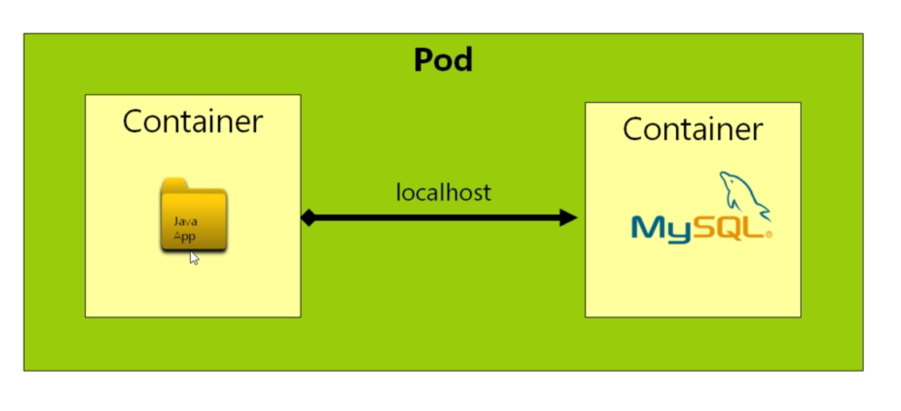

# Networking and Service Discovery in Kubernetes

- here we will learn `How Kubernetes Handle Networking` and we will also learn about the `How Service Discovery works`

- if we have the `docker swarm user` knowledge then we actuially know `How service discovery works there `  , in kubernetes also `Service Discovery remain being same as docker swarm`

### how do we network containers together

- lets suppose we have `application` deployed onto a `container` , in the below example we can see that `there is a JAVA/any other application` running inside the `container`

- we want to store the `Application Data` running inside the `container` into a `Database`

- it will be a really bad idea to incorporate the `Application along with the Database` inside a `single container` , as `docker container` are `designed` to `server` a `single service`

- but it is possible to `add both the Application along with the Database` into the `single container` i.e exposing `multiple service` from a `single container` after putting a `lot of needless effort`

- we can rather set up a `separate container` for the `database` which can use the `MYSQL Database image` , we have to `Network these 2  separate container together (Application and Database cntainer)`

-  

- in `kubernetes` if we have `2 container inside the single POD` then `com munication between these container will be very easy`

- `two container inside the single POD can see each other using the localhost` , if the `Application` want to communicate with the `Database` then it can use the `http://localhost:3306` in order to communicate with the `MYSQL Database(for which the default port being 3306)` and we can see the `Data in the database inside the Application` 

- 

- we can have `multiple container inside the single POD in kubernetes` , but that actually not a `good idea and not recomended`

- the `above approach not being recomended` because `having the Database and Application container inside the POD will make the POD much more complicated manage`

- if the `POD` failed then we need to figure out `the fail due to the Application container or Database container Error`

- it is recomended to have `different or separate POD for the Application container and Database container` , we also need to `expose the functionality of service for these different different POD` 

- 

- we know for the `each kubernetes service` have their `own separate private IP address and Dedicated Port` which can be `accessed inside the kubernetes cluster`

- if the `application` want to `communicate` with the `Database` in order to access the `Data` hence we just have to `access` the `Database Service IP` inside the `Application POD code` as both of them are inside the same `kubernetes cluster`

- but we can't know the `Ip address of the Kubernetes POD as servcie` as that be `dynamically allocated inside the kubernetes cluster` by the `kubernetes cluster`

- the `very next time we run the kubernetes cluster`  the `Ip address of the Kubernetes POD as servcie` `can be changed` as its `dynamically allocated`  

- the `solution` over `here`  `kubernetes` `handles` the `Own private DNS Service`

- `A DNS Service` basically `a database` containing the `key-value pair` with the `key as the label` which is equal to `kubernetes service name` and the `IP adress of the service as the value`

- `kubernetes` `takes the full responsiblity` to `handle` the `private DNS Service` , we don't have to `configure or manage` these `Private DNS service` as `kubernetes will take care of it`

- this `Private DNS service` named as `kube-dns` with the `POD name` as `kube-dns` , there can be `multiple container` which is responsible to handle the `DNS Servcie` usign the `key-value Database where key is the service name and value is the service ip`

- we don't need to `configure and manage the kube-dns Service which represent the Private DNS Service` , it is `private DNS Service` `running` on the `background` when we start the `kubernetes minikube cluster`

- if the `application POD as service` want to `communicate` with the `Database Service POD` then we can `refer the Database Service name inside the Application POD container code such as Database URI` and when the request come then the `Application POD as Service` will look for the `Database Service as key label` inside the `kube-dns Private DNS Service` and get the `corresponding Service IP` and can communicate with each other inside the same `kubernetes cluster`

-  

- it is very similar to the `docker swarm network request`

### Why have not we seen the DNS Service while listing all the kubernetes object inside the kubernetes minikube cluster

- if we do a `kubectl get all` then we can see the `all the kubernetes object inside the cluster` , but we can't see the `kubedns service` over here

- we can see the below info here

    ```bash
        kubectl get all
        # fetching all kubernetes object inside the kubernetes minikube cluster
        NAME                          READY   STATUS    RESTARTS       AGE
        pod/queueapp                  1/1     Running   3 (105m ago)   27h
        pod/webapp-7f58455867-bnhb5   1/1     Running   1 (105m ago)   10h
        pod/webapp-7f58455867-nfqnt   1/1     Running   1 (105m ago)   10h

        NAME                        TYPE        CLUSTER-IP     EXTERNAL-IP   PORT(S)          AGE
        service/fleetman-queueapp   NodePort    10.97.37.84    <none>        8161:30010/TCP   27h
        service/fleetman-webapp     NodePort    10.103.74.42   <none>        80:30080/TCP     27h
        service/kubernetes          ClusterIP   10.96.0.1      <none>        443/TCP          5d23h

        NAME                     READY   UP-TO-DATE   AVAILABLE   AGE
        deployment.apps/webapp   2/2     2            2           27h

        NAME                                DESIRED   CURRENT   READY   AGE
        replicaset.apps/webapp-76db76b84f   0         0         0       27h
        replicaset.apps/webapp-7f58455867   2         2         2       27h
        replicaset.apps/webapp-868c45864d   0         0         0       10h

    ```


- this is because of the `concept of kubernetes namespace`
