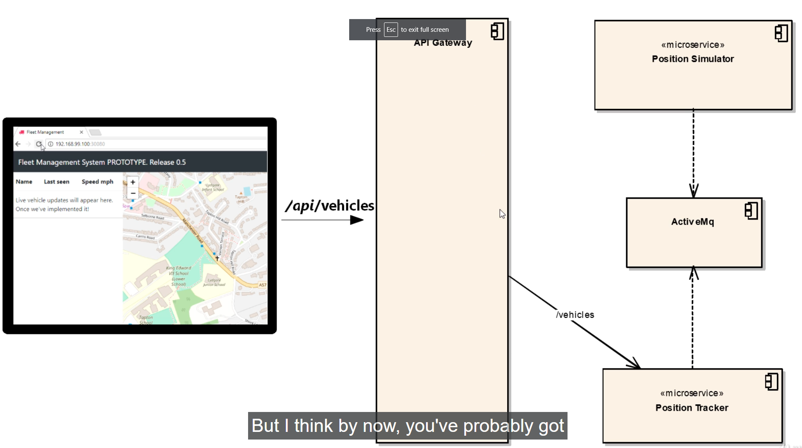
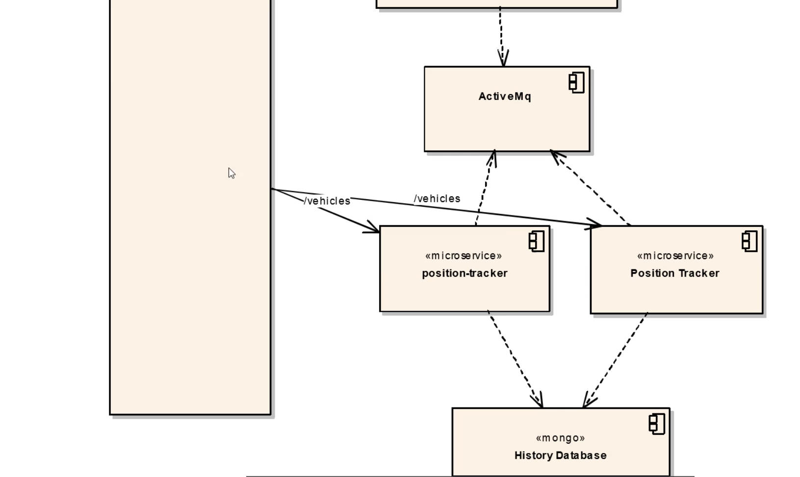
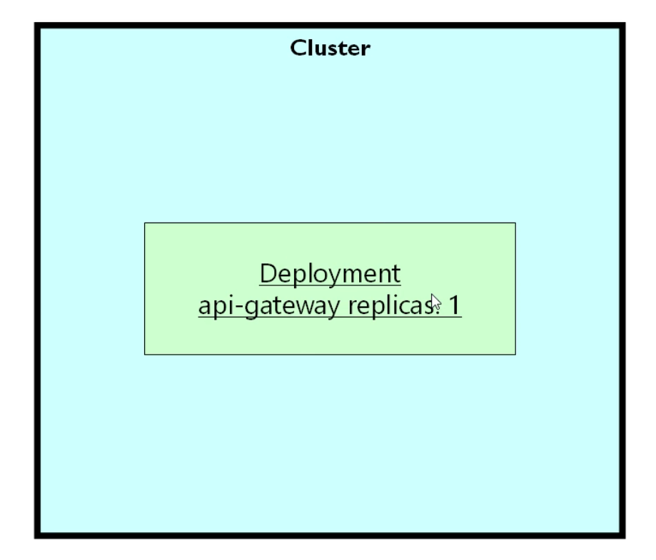
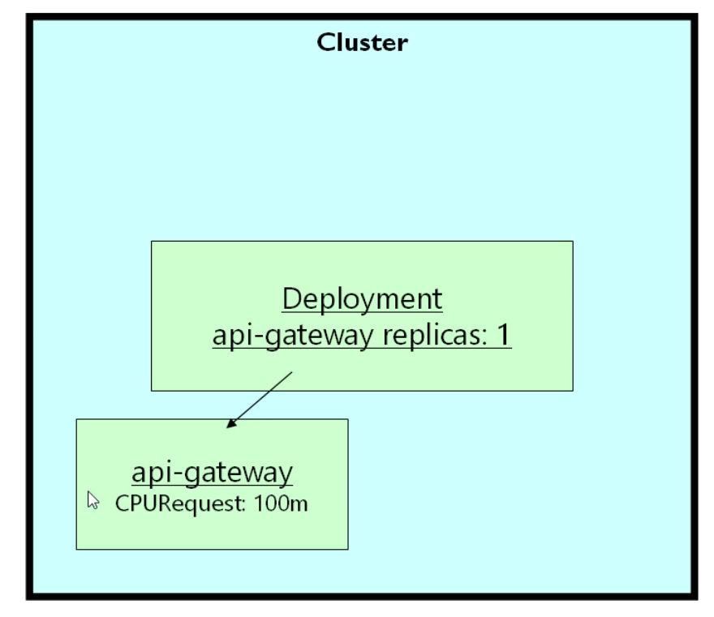
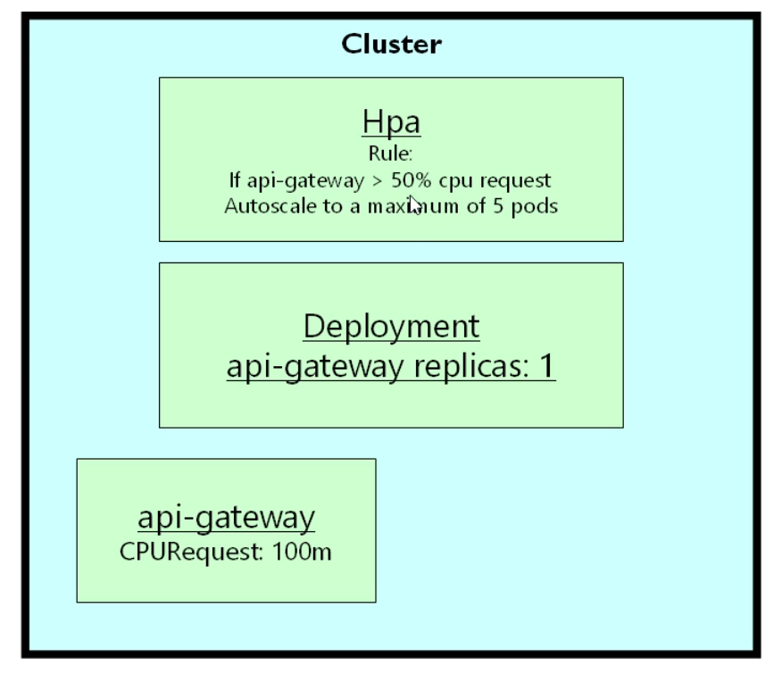
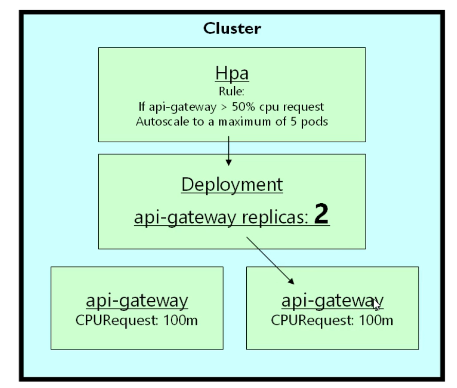

# Introducing Replication and Autoscaling

- here we will be looking at the `Horizontal POD Auto Scaling`

- we will be looking as `kubernetes can automatically resize the kubernetes cluster` depending on the `current workload`

- image that `we have a POD` that `POD contains the microservice or web container` , here the `POD need not have to be a MicroServie` here we are using the `microservice` as example

- but lets suppose the `one of the POD microservice` occasionally `works hard because of the traffic due to more no of user in the weekend`compared to `moday to friday`

- if the `microservice POD` can be `replicated` then we can simply `replicate the POD microservice` , where `multiple copies of the POD microservice` running at the `same time`

- one thing to keep in mind that `Not Every POD` is `replicable`

- **When a POD is allowed to be replicated and when the POD is not allowed to be replicated**

- its `actually not about` the `replication of the POD container` , we can `replicate any POD container` and kubernetes will perform dutifully `replication` of the `POD container` by creating multiple copies of the `kubernetes POD`

- but we need to ensure that `software running inside the POD` i.e `microservice` that must be `designed to be replicated` i.e if the `software is replicated` then `system` will going to `behave properly` with the `replication`

-  

- here inside the `fleetman micro service system` , we have the `web frontend` and the `API-Gateway` , the `APi Gateway` is a way that `frontend java script` to communicate with the `other backend microservice`

- here we will not call or reference to `each backend microservcie which would likely to be changed over time` from the `javascript web frontend`

- by using the `APi Gateway` we are ensuring that `java script` has to contact only one `single point of entry` to contact the `backend microservice`

- the `API-Gateway` is a simple `spring boot application` which will take the `simple incoming rest request from the Web Frontend in Java Script` and `APi- Gateway` will forward that `request` to the `corresponding backend microservcie` for the `fullfillment of the request`

- here the `javascript web frontend` will call the `API-Gatway` with the URL endpoint as `/api/vehicles` in order to `list out the number of vehicles` then the `API Gateway` knowns the `backend microservice responsible for listing out the number of vehicle` is the `Position tracker` backend microservice and hence the `API Gateway` will route the `URL request /api/vehicles` to the `position tracker` microservice


<br/><br/>

- here the `position-simulator` even though considered as the `microservice` which is not a `microservice` ,  as its just the `generating the test data` simulating the `vehicle position`

- In real life `that will be a microservice` which will be `reading GPS Position` from the `trucks` using the `GPS Receiver`

- there is a `big problem` with this service in here , here the `position-simulator` reading the `test data` from the `own internal files`

- but if we try to replicate the `position-simulator` then we have the `duplicated test data`

- if we replicate the `position-simulator` then `each of the replicated POD micro-service` will try to `send the own test data into the Active MQ queue` , which willo generate the `weird behaviour on the vehicle` , we will end up getting `twice many messages` for `each truck` in this case , which can create `weird situations` for the `POD container`

- hence the `position-simulator` can't be replicated in this case , as the `software designed` not to `replicate the POD`

<br/><br/>

- But if we consider the `position-tracker` microservice , which is a `stateless microservice`

- the `concept` of `statelessness` means that `POD microservice` will `not contain/hold` any `data` that it need to `share with other microservices`

- when the `request` comes in from the `APi Gateway` such as the `/vehicles` to `get all the vehicles` , the `position tracker` receive that `rest request` and `process the request and perform some calcuation in its memory` and `saved the data` to the `mongodb Database`

- the `position tracker` can `perform some calculation based on the propritory patented code` before `returning the data`

- hence there will be `No Problem` in `replicating the position tracker backend microservice` as its `stateless in nature`

- if the `calculation happenning inside the position-tracker` is `CPU intensive Tak which get too busy` then we can `deploy another instance of the position tracker microservice` as the `replica`

- 

- with the `2 position-tracker replica` , `any incoming request` that comes in the `API Gateway` , the `API Gateway` need to get the `number of vehicle` from the `/vehicle URL` then it can goto `list of vehicles` then the `API-Gatway Kubernetes Service` will contect the `Position-Tracker Kubernetes Service` and the  `Position-Tracker Kubernetes Service` will then `loadbalanced` and get the `vehicles` from `any of the copies of the Position-Tracker` Deployment , where this `kubernetes service` will be `load balanced` with the `round robin` fashion alogorithm

- hence when the request comes from the `API Gateway` to `Position-Tracker Kubernetes Service` then the `Position-Tracker Kubernetes Service` will forward that `request` to the `first Position Tracker POD for the first Request` and `Next Position Tracker POD for the next Request` , request from `Position-Tracker Kubernetes Service`  will be going to be `backward and forward`

- but there are `currently development` going on with the `kubernetes` to introduce the `more sophesticated` way of `loadbalancing algorithm` such as `request will be routed to POD which is less busy at that point of time`

- as long as the `POD microservice` were designed correctly then we can `simply replicate them` if they were stateless in nature

- here we can `replicate` the `Position-Tracker microservice` because the `all the data generated by the Position Tracker` saved to the `another POD container` which is the `mongo POD container` in that case


<br/><br/>

- here the `mongo POD container` is `not replicable` , as the `Databases are very very difficult to replicate`

- if we want to `replicate the mongodb POD container` then we need to `use the mongo own replication system`

- hence the `database replication` also being difficult can be done using the `StatefulSets` which is a `not covered yet` , untill that we can' replicate the `mongo POD container`

<br/><br/>

- here the `Position Tracker` microservice getting the `messages` from the `Active MQ Service` which is the `latest vehicle position`

- the `Position Tracker` will receiove the `message of the vehicle position from the Active MQ Service` and save that to the `mongodb Database`

- here the `message of the vehicle position from the Active MQ Service` will be `read` by `one of the Postion Tracker POD through the kubernetes Service` and `saved` to the `mongodb shared database` , once saved then `any of the Position-Tracker microservice` will able to read the `info`

<br/><br/>

- hence  before `replicating the POD container` inside the `microservice system` make sure `is it actually maing sense to replicate the POD` ?

<br/>

- coming back to the `APi Gatway` microservice in here , many of the `cloud provider` provide the `API Gateway` which will be `hosted and managed service`

- `API Gateway` are `pretty easy to implement`

- by the `nature of the API Gateway` they are `easy to replicate` as they are `completely stateless` in nature , which will be passing the `rest request` to `another microservice`

- we can spin up `multiple instances of the API-Gateway POD container` , where if one node `goes down` then there will be `another instance` of the `APi Gateway POD container`

- here we will be using the `API Gateway` as an example for the `Hosrizontal POD auto scaling`

- **What do we mean By Horizontal POD AutoScaling**

- the `general` term for the `horizontal scaling` means `increasing the capacity of the system` by `creating` the `more instances of something`

- for the `kubernetes cluster` , if we want to make `kubernetes cluster more powerful` then `horizontal scaling` means `increasing the number of Nodes of the cluster`

- the `related concept` will be as `vertical scaling` ,where we will be increasing the `capacity of the Nodes inside the kubernetes cluster`

- in `kubernetes` , when we are taking the `POD` and creating `multiple instances` of the `POD` then we are `horizontally scaling the same`

- here we will know `how to automatically increase the number of instances of the POD i.e automatically horizontally scale` based on the `run time of the microservice system running on the Node of the cluster`

- image we have the `kubernetes cluster with One Node` and we have created the `Deployment inside the cluster` as below 

- 

- here the `number of replicas` inside the `Deployment` as `1` in this case

- when we `deploy the changes to kubernetes cluster by applying the changes` then it will create the `1 POD with respect to the Deployment` that we have specified

- 

- here we know that `we can specify the requests and limits for the POD container` as there is `1 container` with respect to the `POD`

- here is one area `where the requests that we set for the POD container being very special`

- lets suppose we have specified `CPU request of 100m i.e 100millicore` for the `Api-gateway POD` which been created by the `API Gateway` Deployment 

- here that means in order to `run the API Gateway POD` comfortably , we will need the `CPU of 100m i.e 100millicore i.e 1/10 of the core`

- we can use this `CPU request` to `generate/trigger` the `Automatic Auto Scaling`

- 

- here we will `deploying another kubernetes resource` such as `HPA object` which is a `Horiozontal POD autoscaler object`

- this object will `help in capture the rules` 

- the `rules` will be `something along the line of` if the `actual CPU Usage of the POD container i.e api-gateway POD container` exceed `50% of the CPU that been requested` which will be `decided by using the metrics-server` , then the `HPA(Horizontal POD autoScaler)` will modify the `Deployment` upto a `particular maximum of 5 PODS`

- imagine the `API Gateway POD` been runniong with the `CPU request` as `100m` , for some reason the `API Gateway POD` being busy and use `more than 50% of the CPU requested` then `HPA will request Deployment in order to create another instance of the POD container by increaqsing the number of replicas`

- 

- all of this works in reverse as well in this case

- if the `CPU usga eof the POD container` being less than `50% of the CPU requested` and there are `2 instances` are running then we can see the `HPA will request the Deployment to scale down the number of replicas which will in turn Terminate the additional POD that been deployed due to high usage`

- **Demo for Kubernetes HPA**

- here we have `Deployment of all of workload with the replica count as 1 hence have 1 instances of POD`

- also in this case we will `concerntrate on the API Gateway` in this case

- we need to set up the `individual HPA Rule` for `each of the Deployment Microservice`

- it `does not make sense` to set `one HPA Rule for all of the Deployment` 

- if we have the `multiple Deployment` then we need to create `individual HPA for each of the Deployment` considering that `POD microservice is replicable` and `will not affect the system` if we are `replicating the POD container`

- here we have `prepared the special version of the API Gateway POD microservice`

- here in that `API-Gatway POD microservice image` we have included the `special URL endpoint` which will `perform the intensive calculation with random mathmatics in order to make the CPU request go crazy for the POD container`

- we can change the `workload.yml` file which will support the `api-gateway new image` as below

    
    ```yaml
        workloads.yml
        ==============
        apiVersion: apps/v1 # here the Deployment belongs to the apps group hyence defined as below 
        kind: Deployment # type of the kubernetes object is deployment
        metadata: # name of the Deployment been described here
        name: position-simulator
        spec: # specification for the Deployment been defined here
        selector: # selector to select the POD based on the POD label
            matchLabels:
            app: position-simulator
        replicas: 1 # replicas of the POD defined as 1 at any instance
        template: # template for the POD container
            metadata: # POD labels been defined inside the metadata section
            labels:
                app: position-simulator
            spec: # Specification of the POD container been defined in here
            containers: # container details provided here
            - name: position-simulator # name of the container
                image: richardchesterwood/k8s-fleetman-position-simulator:resources # image of the container 
                env: # env Variable for the container
                - name: SPRING_PROFILES_ACTIVE # name 0f the env Variable 
                value: production-microservice # value of the env Variable
                resources: # setting up the resource request for the position-simulator POD container
                requests:
                    memory: 350Mi # setting up the resources in the range as 350Mi i.e 350 Megabyte 
                    cpu: 100m # setting up the resources in this request as  100millicore

        ---

        apiVersion: apps/v1 # here the Deployment belongs to the apps group hence defined as below 
        kind: Deployment # type of the kubernetes object is deployment
        metadata: # name of the Deployment been described here
        name: position-tracker
        spec: # specification for the Deployment been defined here
        selector: # selector to select the POD based on the POD label
            matchLabels:
            app: position-tracker
        replicas: 1 # replicas of the POD defined as 1 at any instance
        template: # template for the POD container

            metadata: # POD labels been defined inside the metadata section
            labels:
                app: position-tracker
            spec: # Specification of the POD container been defined in here
            containers: # container details provided here
            - name: position-tracker # name of the container
                image: richardchesterwood/k8s-fleetman-position-tracker:resources # image of the container 
                env: # env Variable for the container
                - name: SPRING_PROFILES_ACTIVE # name 0f the env Variable 
                value: production-microservice # value of the env Variable
                resources: # setting up the resource request for the position-tracker POD container
                requests:
                    memory: 350Mi # setting up the resources in the range as 350Mi i.e 350 Megabyte 
                    cpu: 100m # setting up the resources in this request as  100millicore


        ---

        apiVersion: apps/v1 # here the Deployment belongs to the apps group hence defined as below 
        kind: Deployment # type of the kubernetes object is Deployment
        metadata: # name of the Deployment been described here
        name: api-gateway
        namespace: default # here the namespace for the POD being as default
        spec: # defining the specification for the Deployment in this case
        selector: # selector for the deployment based on POD label being defined in here
            matchLabels:
            app: api-gateway
        replicas: 1 #replicas of the POD defined as 1 at any instance
        template: # template for the POD container
            metadata: # POD labels been defined inside the metadata section
            labels:
                app: api-gateway
            spec: # Specification of the POD container been defined in here
            containers: # container details provided here
            - name: api-gateway # name of the container
                image: richardchesterwood/k8s-fleetman-api-gateway:performance # image of the container changing the tags to performance
                env: # env Variable for the container
                - name: SPRING_PROFILES_ACTIVE # name 0f the env Variable 
                value: production-microservice # value of the env Variable
                resources: # setting up the resource request for the api-gateway POD container
                requests:
                    memory: 350Mi # setting up the resources in the range as 350Mi i.e 350 Megabyte 
                    cpu: 100m # setting up the resources in this request as  100millicore

        ---

        apiVersion: apps/v1 # here the Deployment belongs to the apps group hence defined as below 
        kind: Deployment # type of the kubernetes object is Deployment
        metadata: # name of the Deployment been described here
        name: webapp
        namespace: default # here the namespace it belong to is default
        spec: # defining the specification for the Deployment in this case
        selector: # selector for the deployment based on POD label being defined in here
            matchLabels:
            app: webapp
        replicas: 1 # replicas of the POD defined as 1 at any instance
        template: # template for the POD container

            metadata: # POD labels been defined inside the metadata section
            labels:
                app: webapp
            spec: # Specification of the POD container been defined in here
            containers: # container details provided here
            - name: webapp # name of the container
                image: richardchesterwood/k8s-fleetman-webapp-angular:release2 # image of the container 
                env: # env variable defined for the container
                - name: SPRING_PROFILES_ACTIVE # name of the env Variable
                value: production-microservice # value of the env Variable
                resources:
                requests:
                    memory: 50Mi
                    cpu: 50m


        ---

        apiVersion: apps/v1 # here the Deployment belongs to the apps group hence defined as below 
        kind: Deployment # type of the kubernetes object is Deployment
        metadata: # name of the Deployment been described here
        name: queueapp
        spec: # here the spoecification for the Deployment been defined in here
        replicas: 1 # here we are spinning 1 replica in this case
        selector: # selector for the deployment based on POD label being defined in here
            matchLabels:
            app: queueapp
        template: # template for the POD container
            metadata: # POD labels been defined inside the metadata section
            labels:
                app: queueapp
            spec: # specification for the POC container
            containers: # container details been provided here
            - name: queueapp # name of the container
                image: richardchesterwood/k8s-fleetman-queue:resources # image of the container 
                resources: # reouces for the container
                requests: # here requesting for the resources in the POD container
                    memory: 300Mi # we need the Memory of 300 megabyte
                    cpu: 100m # we need the cpu of 100millicore


    ```

- here we are using the `resources image tag` for the `rest of the Deployment` which is not `resource i.e CPU and RAM Memory Hungry`

- here the `performance image tag for the API Gateway Deployment` is also not `resource hungry` , but we do use the `special URL` which can perform `CPU intensive Task in order to make the CPU request go crazy for the POD container`

- we can `deploy` this changes with the `Option` as below 

    ```bash
        kubectl apply -f workloads.yml
        # Deployiong the changes to the Kubernetes cluster by Applying the changes in this case
        deployment.apps/position-simulator unchanged
        deployment.apps/position-tracker unchanged
        deployment.apps/api-gateway configured
        deployment.apps/webapp unchanged
        deployment.apps/queueapp unchanged

        # fetching all the kubernestes resources inside the default namespace
        # here we can get the response by using the kubectl get all command
        kubectl get all
        # the output will be as below
        NAME                                     READY   STATUS             RESTARTS       AGE
        pod/api-gateway-597c9f8675-fqv7v         1/1     Running            0              2m12s
        pod/mongodb-5558cf99d9-l28qp             1/1     Running            50 (33h ago)   40h
        pod/position-simulator-f9c8794ff-qtwgn   1/1     Running            3 (33h ago)    2d6h
        pod/position-tracker-bb49fdd8f-z79ld     1/1     Running            3 (10m ago)    2d6h
        pod/queueapp-7fff87bc5d-htbxr            1/1     Running            3 (10m ago)    2d7h
        pod/webapp-587c5cbd6d-v6sjt              0/1     Running   6 (4m9s ago)   40h

        NAME                                TYPE        CLUSTER-IP       EXTERNAL-IP   PORT(S)                          AGE
        service/fleetman-api-gateway        NodePort    10.98.253.94     <none>        8080:30020/TCP                   3d10h
        service/fleetman-mongodb            ClusterIP   10.105.26.241    <none>        27017/TCP                        3d10h
        service/fleetman-position-tracker   ClusterIP   10.106.223.207   <none>        8080/TCP                         3d10h
        service/fleetman-queue              NodePort    10.96.124.11     <none>        8161:30050/TCP,61616:32249/TCP   3d10h
        service/fleetman-webapp             NodePort    10.99.66.177     <none>        80:30030/TCP                     3d10h
        service/kubernetes                  ClusterIP   10.96.0.1        <none>        443/TCP                          4d

        NAME                                 READY   UP-TO-DATE   AVAILABLE   AGE
        deployment.apps/api-gateway          1/1     1            1           2d7h
        deployment.apps/mongodb              1/1     1            1           3d10h
        deployment.apps/position-simulator   1/1     1            1           2d7h
        deployment.apps/position-tracker     1/1     1            1           2d7h
        deployment.apps/queueapp             1/1     1            1           2d7h
        deployment.apps/webapp               0/1     1            0           2d7h

        NAME                                            DESIRED   CURRENT   READY   AGE
        replicaset.apps/api-gateway-57f4df64d6          0         0         0       2d7h
        replicaset.apps/api-gateway-597c9f8675          1         1         1       2m12s
        replicaset.apps/api-gateway-697d5d48bd          0         0         0       2d6h
        replicaset.apps/mongodb-5558cf99d9              1         1         1       40h
        replicaset.apps/mongodb-567fdd6b84              0         0         0       40h
        replicaset.apps/mongodb-659cb5db54              0         0         0       3d10h
        replicaset.apps/position-simulator-7cb7567b8c   0         0         0       2d7h
        replicaset.apps/position-simulator-f9c8794ff    1         1         1       2d6h
        replicaset.apps/position-tracker-7d4c8b5965     0         0         0       2d7h
        replicaset.apps/position-tracker-bb49fdd8f      1         1         1       2d6h
        replicaset.apps/queueapp-7fff87bc5d             1         1         1       2d7h
        replicaset.apps/webapp-587c5cbd6d               1         1         0       40h
        replicaset.apps/webapp-66765b68df               0         0         0       2d7h


    ```

- for the `API Gateway POD microservice` , for `Testing Purpose` we can have the `curl <minikube IP>:<NodePort>/api` then we will be getting the `DateTime` response from the `API Gateway POD microservice`

- we can use the below command to see the below info 

    ```bash
        curl http://192.168.49.2:30030/api
        # here we are using the minikube IP address with the Kubernetes Service NodePort to access to Service Outside of the cluster
        # we can get the minikube ip using the command as `minikube ip` command 
        # we will also get the minikube IP address with the Kubernetes Service NodePort of the kubernetes service using the command as minike svc --url <Service Name>
        # here we are accessing the /api URL endpoint which will HIT the API-Gateway to provide the Dat and Time as the response as below
        # below will be output for the same
        <p>Fleetman API Gateway at Fri Mar 08 11:21:09 GMT 2024</p>

    ```

- here if we are using the `URL endpoint` as `/api/panic` then it will `redirect the API Gateway to Special URL` which perform `CPU intensive Task in order to make the CPU request go crazy for the POD container`

- we can do that as well using the `curl command` as below 

    ```bash
        curl http://192.168.49.2:30030/api/panic
        # here we are hitting the URL endpoint as /api/panic
        # this will perform some CPU intensive Task and make the CPU request go crazy
        # here we need to perform this curl command multiple time to increase the CPU request Usage
        # the result will be as below 
        
        Results
        0.4980303947417202
        0.7605447090702907
        0.5307555181446534
        0.4850623162638466
        0.8823027734940408
        0.406893307816916
        0.21791576142316393
        0.2943334506508206
        0.3243915847530662
        0.008709842126961909
        0.30853959783554175
        0.4538077598192898
        0.6257812015183968
        0.5722180541253049
        0.7442600655363791
        0.6148140945545075
        0.6743229942355875
        0.998101334665764
        0.7867397112312472
        0.02212006658582011
        0.905029925424083
        0.3080710762337142
        0.2696481320635776
        0.3418999044957054
        0.2304367709043822
        0.05936162802562772
        ---

    ```

- we need to make sure that `metrics server` being enabled inside the `minikube kubernetes local cluster` , if not `enable` it then we can make it `enable` using the command as below 

    ```bash
        minikube addons enable metrics-server
        # here we are adding the minikube addons with the name as metrics-server
        # we will be adding the minikube addons as metrics-server in here
        💡  metrics-server is an addon maintained by Kubernetes. For any concerns contact minikube on GitHub.
        You can view the list of minikube maintainers at: https://github.com/kubernetes/minikube/blob/master/OWNERS
            ▪ Using image registry.k8s.io/metrics-server/metrics-server:v0.6.4
        🌟  The 'metrics-server' addon is enabled

    ```

- once the `metrics-server` being enabled we need to wait for `a muinute` in order to `make the kubectl top to get the metrics from the POD`

- now if we perform the `kubectl top POD` in order to see the `resource(CPU and RAM Memory) usage` of `Api gateway POD` then we can see the `High in number`

    ```bash
        kubectl top pod
        # fetching the resource usage acrross the default namespace POD in this case
        # here we will be getting the below output in this case
        NAME                                 CPU(cores)   MEMORY(bytes)   
        api-gateway-597c9f8675-fqv7v         1160m        229Mi       # here we can see the High Range for the APi-gateway POD container     
        mongodb-5558cf99d9-l28qp             269m         457Mi           
        position-simulator-f9c8794ff-qtwgn   22m          213Mi           
        position-tracker-bb49fdd8f-z79ld     7m           313Mi           
        queueapp-7fff87bc5d-htbxr            27m          335Mi           
        webapp-587c5cbd6d-v6sjt              1m           9Mi             

    ```

- here for the `APi Gateway` POD microservice we have set the `CPU and Memory requests` as `100 millicore and 350 MegaByte`

- but if we are checking the `kubectl top pod` as we are not making `curl request` hence the `CPU request limit is well behind the CPU request that we have submitted or requested`

    ```bash
        kubectl top pod
        # fetching the resource usage acrross the default namespace POD in this case
        # here we will be getting the below output in this case
        NAME                                 CPU(cores)   MEMORY(bytes)   
        api-gateway-597c9f8675-fqv7v         4m           230Mi    # here we can see that CPU request is weel behind the CPu request that we are making        
        mongodb-5558cf99d9-l28qp             271m         459Mi           
        position-simulator-f9c8794ff-qtwgn   23m          213Mi           
        position-tracker-bb49fdd8f-z79ld     9m           314Mi           
        queueapp-7fff87bc5d-htbxr            28m          342Mi           
        webapp-587c5cbd6d-v6sjt              1m           9Mi     

    ```

- but if reuse the `curl command` multiple times in order to `perform the CPU intensive Task to make the CPU request go crazy` then we can see the `CPU request` will be much `higher than the CPU requested`

    ```bash
        curl http://192.168.49.2:30030/api/panic
        # here we are hitting the URL endpoint as /api/panic
        # this will perform some CPU intensive Task and make the CPU request go crazy
        # here we need to perform this curl command multiple time to increase the CPU request Usage
        # the result will be as below 
        # we need to execute the command multiple times
        Results
        0.4980303947417202
        0.7605447090702907
        0.5307555181446534
        0.4850623162638466
        0.8823027734940408
        0.406893307816916
        0.21791576142316393
        0.2943334506508206
        0.3243915847530662
        0.008709842126961909
        0.30853959783554175
        0.4538077598192898
        0.6257812015183968
        0.5722180541253049
        0.7442600655363791
        0.6148140945545075
        0.6743229942355875
        0.998101334665764
        0.7867397112312472
        0.02212006658582011
        0.905029925424083
        0.3080710762337142
        0.2696481320635776
        0.3418999044957054
        0.2304367709043822
        0.05936162802562772
        ---

        # now when we check the kubectl top pod command in order to check the CPU and Memory Usage
        # here we can see the info as below 
        kubectl top pod
        # fetching the resource usage acrross the default namespace POD in this case
        # here as the kubernetes Metrics Server taking 1` minutes to gather the metrics we will wait for a Minute as the default sampling value to see the higher value
        # here we will be getting the below output in this case
        NAME                                 CPU(cores)   MEMORY(bytes)   
        api-gateway-597c9f8675-fqv7v         2856m        231Mi        # here we can see that CPU request is weel Ahead the CPu request that we are makin   
        mongodb-5558cf99d9-l28qp             288m         460Mi           
        position-simulator-f9c8794ff-qtwgn   25m          213Mi           
        position-tracker-bb49fdd8f-z79ld     7m           314Mi           
        queueapp-7fff87bc5d-htbxr            32m          344Mi           
        webapp-587c5cbd6d-v6sjt              1m           9Mi

    ```

- here the `hitting the /api/panic URL endpoint` means the `URL` is a way of `simulating that API Gateway getting the High Volume Of Traffic from thousand of User`

- as we are getting the `High Volume Of Traffic from thousand of User` it make sense to perform `Horizontal Auto Scaling` make sense , through which will increase the `no of copies of the POD container` to distribute the `traffic accross the POD` provided the `PODs are replicable`

- by hitting the `special URL multiple times` which will make the `CPU request go crazy` we can `trigger an event for Horizontal POD Autoscaling`

- **How to SetUp the `Horizontal POD AutoScaling` inside the kubernetes Cluster**

- we can goto the `kubernetes documentation` on the URL as [HPA Walkthrough Docs](https://kubernetes.io/docs/tasks/run-application/horizontal-pod-autoscale-walkthrough/)

- we can use the `kubectl` command in order to `create the HPA(Horizontal POD AutoScaler)` for the `kubernetes cluster`

- here we need to `remember` that we are `autoscaling` the `kubernetes Deployment or Replicaset` not the `POD` , which will change the `number of replica`

- this will create the `HPA(Horizontal POD AutoScaler)` object inside the `kubernetes cluster`

    
    ```bash
        
        kubectl autoscale deployment <name of the Deployment> --cpu-percent=<CPU percentage compared to the CPU request> --min = < min number of POD instance from the Deployment> --max = <max number of POD instance from the Deployment>
        # here we will be using the command as kubectl autoscale command for the Deployment or replicaset as well 
        # here --cpu percent show the % of the CPU that is originally requested
        # here --cpu-percentage can go beyond the 100% as it s relative to the CPU that been requested
        # here the --min stands for How many instances for the minimum POD which will scale Down if there is no more traffic 
        # here the --max stands for How many instances for the maximum POD which will scale UP if there is more number in traffic
        
        kubectl autoscale deployment api-gateway --cpu-percent=400 --min=1 --max=5
        # here we want to crate the HPA i.e Horizontal POD AutoScaler for the Deployment 
        # name of the Deployment in this case as api-gateway
        # --cpu-percent here we are stating if the CPU request what we originally estimated as 100m if it goes 400% i,e 400millicore then trigger this HPA
        # the --cpu-percent is relative to the CPU request what we originally estimated
        # here setting the minimum number of POD as 1 to scale down when there is no  traffic and CPU request will  be way below of what we requested
        # here setting the maximum number of POD as 5 to scale up when there is huge traffic and CPU request will  be way ahead of what we requested
        # the output will be as below 
        horizontalpodautoscaler.autoscaling/api-gateway autoscaled

        # now we can see the HPA object inside the cluster as below 
        kubectl get hpa
        # here we are trying to fetch the HPA object inside the kubernetes cluster for default namespace
        # here the Horizontal POD autoscaler created with the same name as the Deployment i.e api-gateway by default
        # here the output will be as below
        NAME          REFERENCE                TARGETS   MINPODS   MAXPODS   REPLICAS   AGE
        api-gateway   Deployment/api-gateway   4%/400%   1         2         1          63s
        # here are requesting for the 100 millicore  
        # and usage of the kubectl top pod as 4m hence it will be 4%/400% usage in here

        # the problem with the kubernetes imparative command is if we destroy the kubernetes cluster and reapply the YAMl file then we need to explicitly provide the HPA command using kubectl autoscale command else the HPA object will not be created
        # hence reconmend to use Scripted way to perform this

        # we can see the description of the HPA object inside the cluster as below 
        # here we are trying to describe the HPA object inside the kubernetes cluster for default namespace
        kubectl describe hpa api-gateway
        # here we are describing the HPA object in this case as below 
        Name:                     api-gateway
        Namespace:                default
        Labels:                   <none>
        Annotations:              autoscaling.alpha.kubernetes.io/conditions:
                                    [{"type":"AbleToScale","status":"True","lastTransitionTime":"2024-03-08T17:43:12Z","reason":"ReadyForNewScale","message":"recommended size...
                                autoscaling.alpha.kubernetes.io/current-metrics:
                                    [{"type":"Resource","resource":{"name":"cpu","currentAverageUtilization":4,"currentAverageValue":"4m"}}]
        CreationTimestamp:        Fri, 08 Mar 2024 23:12:57 +0530
        Reference:                Deployment/api-gateway
        Target CPU utilization:   400%
        Current CPU utilization:  4%
        Min replicas:             1
        Max replicas:             2
        Deployment pods:          1 current / 1 desired
        Events:                   <none>
 
    ```

- here if we can `push the CPU Usage of the api-gateway POD container to 400% of 100m i.e 400m` then it will spin the `another kubernetes POD container` as a part of the `HPA rule` 

- now when we raise the `curl request to the /api/panic enspoint` in order to make the `CPU request` go crazy then we can see the below info 

    ```bash
        curl http://192.168.49.2:30030/api/panic
        # here we are hitting the URL endpoint as /api/panic
        # this will perform some CPU intensive Task and make the CPU request go crazy
        # here we need to perform this curl command multiple time to increase the CPU request Usage
        # the result will be as below 
        # we need to execute the command multiple times
        Results
        0.4980303947417202
        0.7605447090702907
        0.5307555181446534
        0.4850623162638466
        0.8823027734940408
        0.406893307816916
        0.21791576142316393
        0.2943334506508206
        0.3243915847530662
        0.008709842126961909
        0.30853959783554175
        0.4538077598192898
        0.6257812015183968
        0.5722180541253049
        0.7442600655363791
        0.6148140945545075
        0.6743229942355875
        0.998101334665764
        0.7867397112312472
        0.02212006658582011
        0.905029925424083
        0.3080710762337142
        0.2696481320635776
        0.3418999044957054
        0.2304367709043822
        0.05936162802562772
        ---

        # now when we check the kubectl top pod command in order to check the CPU and Memory Usage
        # here we can see the info as below 
        kubectl top pod
        # fetching the resource usage acrross the default namespace POD in this case
        # here as the kubernetes Metrics Server taking 1` minutes to gather the metrics we will wait for a Minute as the default sampling value to see the higher value
        # here we will be getting the below output in this case 
        NAME                                 CPU(cores)   MEMORY(bytes)   
        api-gateway-597c9f8675-fqv7v         2156m        243Mi           
        mongodb-5558cf99d9-l28qp             273m         464Mi           
        position-simulator-f9c8794ff-qtwgn   25m          213Mi           
        position-tracker-bb49fdd8f-z79ld     8m           314Mi           
        queueapp-7fff87bc5d-htbxr            31m          326Mi           
        webapp-587c5cbd6d-v6sjt              1m           9Mi

        
        kubectl describe hpa api-gateway                                                            (minikube/default)
        # # here we are describing the HPA object in this case as below 
        Name:                     api-gateway
        Namespace:                default
        Labels:                   <none>
        Annotations:              autoscaling.alpha.kubernetes.io/conditions:
                                    [{"type":"AbleToScale","status":"True","lastTransitionTime":"2024-03-08T17:43:12Z","reason":"SucceededRescale","message":"the HPA controll...
                                autoscaling.alpha.kubernetes.io/current-metrics:
                                    [{"type":"Resource","resource":{"name":"cpu","currentAverageUtilization":2156,"currentAverageValue":"2156m"}}]
        CreationTimestamp:        Fri, 08 Mar 2024 23:12:57 +0530
        Reference:                Deployment/api-gateway
        Target CPU utilization:   400%
        Current CPU utilization:  2156%
        Min replicas:             1
        Max replicas:             2
        Deployment pods:          1 current / 2 desired
        Events:
        Type    Reason             Age   From                       Message
        ----    ------             ----  ----                       -------
        Normal  SuccessfulRescale  13s   horizontal-pod-autoscaler  New size: 2; reason: cpu resource utilization (percentage of request) above target
        
    
    ```

- here `we can see that the event been trigger to scale up the Deployment to number 2` by the `HPA rules` for the `CPU request`

- now when we are performing the `kubectl get pod` we can see that `2 PODs been running for the API Gateway` as the `CPU request` well ahead of the `CPU request that rule` that we have set hence as `New POD will be scaled Automatically by increasing the size of the replica`

- we can see the `kubectl get pods` to see the below info

    ```bash
        kubectl get pod
        # fetching the PDO in the detfault namespace
        # here the output will be as below 
        # here we can see the 2 instances of the api-gateway POD container
        NAME                                 READY   STATUS    RESTARTS         AGE
        api-gateway-597c9f8675-fqv7v         1/1     Running   1 (6h37m ago)    6h40m
        api-gateway-597c9f8675-wcz8z         1/1     Running   0                82s
        mongodb-5558cf99d9-l28qp             1/1     Running   51 (6h37m ago)   47h
        position-simulator-f9c8794ff-qtwgn   1/1     Running   4 (6h37m ago)    2d13h
        position-tracker-bb49fdd8f-z79ld     1/1     Running   4 (6h37m ago)    2d13h
        queueapp-7fff87bc5d-htbxr            1/1     Running   4 (6h37m ago)    2d13h
        webapp-587c5cbd6d-v6sjt              1/1     Running   8 (6h36m ago)    47h


    ```

- we can get the `YAML definition` for the `HPA object` by using the command as below 

    ```bash
        kubectl get hpa api-gateway -o yaml
        # fetching the YAML definiton for the HPA object in this case 
        # here we can see the info as below 
        apiVersion: autoscaling/v2
        kind: HorizontalPodAutoscaler
        metadata:
        creationTimestamp: "2024-03-08T17:42:57Z"
        name: api-gateway
        namespace: default
        resourceVersion: "107021"
        uid: 6d6d03ca-a49f-4f50-a1a0-d0eccd1a39f2
        spec:
        maxReplicas: 2
        metrics:
        - resource:
            name: cpu
            target:
                averageUtilization: 400
                type: Utilization
            type: Resource
        minReplicas: 1
        scaleTargetRef:
            apiVersion: apps/v1
            kind: Deployment
            name: api-gateway
        status: # here the status will calculated on the fly considering the current usage of the Replica and Desired Replica in this case
        conditions:
        - lastTransitionTime: "2024-03-08T17:43:12Z"
            message: recommended size matches current size
            reason: ReadyForNewScale
            status: "True"
            type: AbleToScale
        - lastTransitionTime: "2024-03-08T17:43:12Z"
            message: the HPA was able to successfully calculate a replica count from cpu resource
            utilization (percentage of request)
            reason: ValidMetricFound
            status: "True"
            type: ScalingActive
        - lastTransitionTime: "2024-03-08T17:55:28Z"
            message: the desired count is within the acceptable range
            reason: DesiredWithinRange
            status: "False"
            type: ScalingLimited
        currentMetrics:
        - resource:
            current:
                averageUtilization: 4
                averageValue: 4m
            name: cpu
            type: Resource
        currentReplicas: 1
        desiredReplicas: 1
        lastScaleTime: "2024-03-08T17:56:28Z"


    ```

- hence from here we can define the `autoscaler.yml` as below

    ```yaml
        autoscaler.yml
        ==============
        apiVersion: autoscaling/v2 # fetching the apiVersion from kubetrnetes using the command as below kubectl api-resources | grep Horizontal
        kind: HorizontalPodAutoscaler # here we are using the kubernetes object as HorizontalPodAutoscaler
        metadata: # defining the name and namespace inside the metadata section in here
            name: api-gateway-another # here the name of the HorizontalPodAutoscaler i.e HPA as api-gateway-another
            namespace: default # here defining the namespace as default in this case
        spec:
            maxReplicas: 2  # here defining the maximum number of Replica to spin to when there is high number of traffic 
            minReplicas: 1  # here defining the minimum number of Replica to spin down to when there is low number of traffic
            scaleTargetRef: # here we will referencing the scaleTargetRef in this case which will point to which Deployment Or ReplicaSet to refer to
                apiVersion: apps/v1 # here the apiVersion of the Deployument which belong to the apps Groups
                kind: Deployment # kind of kubernetes object as Deployment
                name: api-gateway # here the name of the kubernetes Deployment 
            metrics: # here defining the metrcis under which we can define the which resource we want to Use
            -   type: Resource # here the type of Metrics Defining which is a List as Resource
                resource: # here defing the which resource we want to refer inside the nmetrics-server
                    name: cpu # here we are referencing the CPU resource in this case
                    target: # here defining the target that will trigger the AutoScaling event
                        averageUtilization: 400 # here the averageUtilization is of 400% in this case
                        type: Utilization # here the type of target that will trigger the AutoScaling event is Utilization
            
    ```

- we can `Deploy this changes to the cluster` by `applying the changes` as below

    ```bash
        kubectl apply -f autoscaler.yml
        # Deploy this changes to the cluster by applying the changes
        # here we can get the output in this case as below 
        horizontalpodautoscaler.autoscaling/api-gateway-another created

        # here we can check the kubectl get hp which will provide <unknow>/400% as the HPA willbe taking a minute to refer the CPU request data from autoscaler 
        # it can take few minutes to puopulate the <unknown> field
    ```