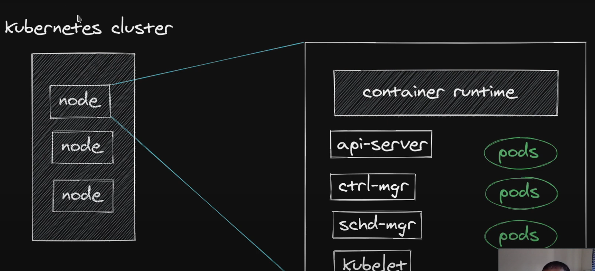
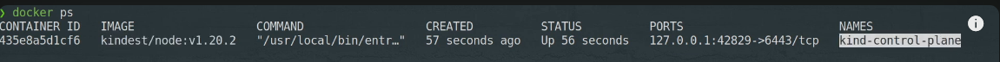
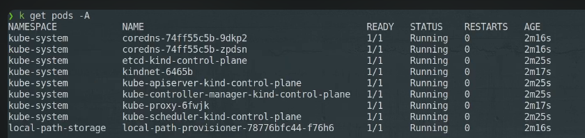
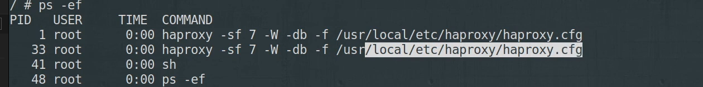
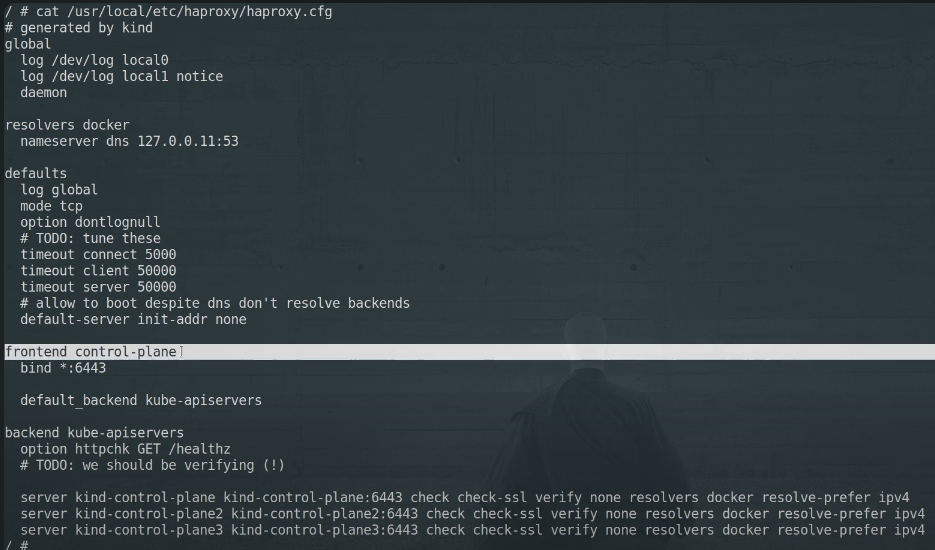
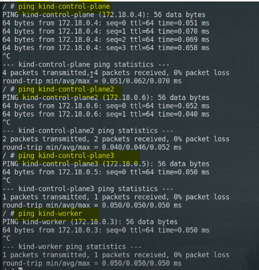
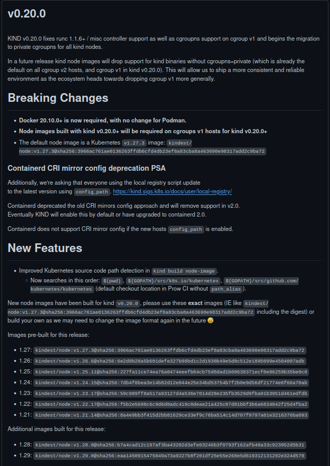

# kubernetes kind cluster with multiple nodes 

- `kubernetes cluster` is nothing but `bunch of machine` running your `prodcution containerized workloads`

-  

- we do have `few master and worker node` running inside the `kubernetes cluster` which can be 
  
  - here the `nodes` can be `phyical machine` on the `datacenter`
  
  - the `node` can also be `virtual machine local workstation`
  
  - the `node` can be also `virtual machine provided by the cloud provider such as AWS/GCP and etc`
  
  - the `node` can be `docker container`  as well
  
- the `node` should have `some kind of container runtime` such as `docker container runtime` or `containerd runtime` to `run the container`

- the `node` also have `few other things` for the `master node` such as 
  
  - `api-server`
  
  - `ctrl-manager`
  
  - `schd-mgr`
  
  - `kubelet`
  
  - `kube-proxy` 
  
- if it is a `worker node` then we have the below things
  
  - `kubelet` 
  
  - `kube-proxy`

- the `kubernetes node` can be `phyical machine` in `datacenter` or `virtual machine local workstation` or `virtual machine provided by the cloud provider such as AWS/GCP and etc` or it can be `docker container` as well

- `kind` will use `docker` to create the `worker and master node` , but `kind node as docker container runtime` but ratyher uses `containerd runtime`

- we can install the `kind kubernetes cluster` using the command as below 

    
    ```bash
        [ $(uname -m) = x86_64 ] && curl -Lo ./kind https://kind.sigs.k8s.io/dl/v0.20.0/kind-linux-amd64
        # this will check the linux architecture and install the kind on the current working directory
        chmod +x ./kind
        # provide the executable permission to kind
        sudo cp ./kind /usr/local/bin/kind
        # copying the king to the /usr/local/bin so that we can run the kind command 

        kind version 
        # this will provide the kind version which being installed 
        # the output will be as below 
        kind v0.20.0 go1.20.4 linux/amd64

        # if we run only the kind then we can see the output as below 
        kind
        # the output will be as below 
        kind creates and manages local Kubernetes clusters using Docker container 'nodes'

        Usage:
        kind [command]

        Available Commands:
        build       Build one of [node-image]
        completion  Output shell completion code for the specified shell (bash, zsh or fish)
        create      Creates one of [cluster]
        delete      Deletes one of [cluster]
        export      Exports one of [kubeconfig, logs]
        get         Gets one of [clusters, nodes, kubeconfig]
        help        Help about any command
        load        Loads images into nodes
        version     Prints the kind CLI version

        Flags:
        -h, --help              help for kind
            --loglevel string   DEPRECATED: see -v instead
        -q, --quiet             silence all stderr output
        -v, --verbosity int32   info log verbosity, higher value produces more output
            --version           version for kind

        Use "kind [command] --help" for more information about a command.

    ```

- we can create the `kubernetes cluster` using the `kind command line` as below 

    ```bash
        kind create cluster
        # this will going to create the kind kubernetes cluster in local
        # this will create the kubernetes cluster with single master node
        # this will going to use the kindest/node:v1.20.2 docker image in order to create the kubernetes cluster
        # this will going to run only the masternode as control plane only
        # the output will be as below 
        # this will update the ~/.kube/config file using which kubectl can reach tpo the kind kubernetes cluster

        

        # we can see the kind cluster configuration inside the ~/.kube/config folder
        # if we do want to see the docker images then it will crwate the docker image with the name as kindest/node

        # we can see that as below 
        docker images | grep kind
        # here the output will be as below 
        # the output will be as below 
        kindest/node                                                                                   v1.28.0                     ad70201dab13   6 months ago    950MB

        # if we check then we can see few docker container running as below 
        docker ps | grep kind
        # the output will be as below 
        

    ```

- the `kind get cluster` command will show `how many cluster we are running at a time`

- as we have the `config update to the ~/.kube/config` then we can see the `cluster info` by usign the command as below 

- we can use the command as `kubectl cluster info`

    ```bash
        kubectl cluster-info
        # here we can see the cluster info using the kubectl command 
        # as we have the configuration save to the ~/.kube/config file over here
        # the output will be as 
        Kubernetes control plane is running at https://127.0.0.1:32869
        CoreDNS is running at https://127.0.0.1:32869/api/v1/namespaces/kube-system/services/kube-dns:dns/proxy

        To further debug and diagnose cluster problems, use 'kubectl cluster-info dump'.

    ```

- if we are creating the `kind cluster` using the command as `kind create cluster` then it willl going to `create the cluster` with the name as `kind` which can be validated using the command as `kind get clusters`

- but if we are trying the provide a different name to the `kubernetes cluster` then we can pass the `--name command to it`

- we can create the cluster using the command as below 

    ```bash
        kind get clusters
        # fetching the clustername using the kind get cluster command 
        # the output will be as below
        # here as we have created the kind cluster using the command as kind create cluster by default the name of the cluster is kind
        kind

        # but we can create the named cluster by providing the --name flag
        kind create cluster --name <name of your cluster>
        # this will going to create the named cluster in this case
        # but here also only one node will be created as kind-ccontrol-plane
        # when we are creating the kind vcluster the node will have the name such as <kind cluster name that been given else kind>-controlplane or worker


    ```

- if we are using the command such as `kubectl get pods -A` to check all the `PODs running inside the kubernetes cluster` then we will get it as below

- 

- here we can see the `below kubernetes POD` should be running such as below as its is the `masternode` or `control plane`
  
  - `coredns`
  
  - `etcd`
  
  - `kindnet`
  
  - `kube-apiserver`
  
  - `kube-controller-manager`
  
  - `kube-proxy`
  
  - `kube-scheduler`
  
  - `local-path-provisioner` 
  
- if do a `docker ps` then we can see the `kind node been running as docker container`n as below 

    ```bash
        docker ps
        # checking the container running inside the host system
        # here the kind node been working as the docker container in this case
        CONTAINER ID   IMAGE                  COMMAND                  CREATED       STATUS       PORTS                       NAMES
        526e0e8f72a3   kindest/node:v1.28.0   "/usr/local/bin/entr…"   3 hours ago   Up 3 hours   127.0.0.1:32869->6443/tcp   kind-control-plane

        # here we can see the port forwarding from 32869 on the Host will be redirecting to port 6443 on the docker container which is the kind node in this case
    

    ```

- if we have a look over the `~/.kube/config` there we can see the `kinhd kubernetes cluster details` as well

- we can see those info as below 

    ```bash
        cat ~/.kube/config
        # here we can see the kubernetes cluster info in this case
        # the output will be as below
        apiVersion: v1
        clusters:
        - cluster:
            certificate-authority-data: LS0tLS1CRUdJTiBDRVJUSUZJQ0FURS0tLS0tCk1JSURCVENDQWUyZ0F3SUJBZ0lJUm5yckJ0ZTFXTUl3RFFZSktvWklodmNOQVFFTEJRQXdGVEVUTUJFR0ExVUUKQXhNS2EzVmlaWEp1WlhSbGN6QWVGdzB5TkRBeU1qRXdPVFF4TWpoYUZ3MHpOREF5TVRnd09UUTJNamhhTUJVeApFekFSQmdOVkJBTVRDbXQxWW1WeWJtVjBaWE13Z2dFaU1BMEdDU3FHU0liM0RRRUJBUVVBQTRJQkR3QXdnZ0VLCkFvSUJBUUNzV0lMVFBaaEg5Vit6VUtDMlFBeVI3VkwyQWtVU1B6SG8yUFp6WkNLaDJUSTJKWXRqTWFOL1U0M1gKUk5GNkYzQmtwdFN5cW5OL0lVY3VESlVOWHBrZWVlMDhid096SWFyUGZ2VVk1RFdnVGRMdEVoZUw5QXd3UE5mOApnWHFTTDEwNjlacVl1bDlkamFDQk1aemRMcHoyQmdtMEJhbGZSNDMwSkYxK3VZYmpDclhGcU0xVGNTUUd4ZTN6CnBxbXZEOXYxS3NpSUtsUWFqU0Fia0c1dUdkMHIxREtqK2EzbjZEdW5DOXY5YmVJZWJ5bjFxaGtKbHBqYlVsWUIKT2x3ZjBtS0pvRFY1bHZiWkpRWlRrQzdqTmJPeW84ZUFkQ0NycEpTNDkvUU1PMEd3ZGdEaWFOK1NGaDh2bC9xcwpQVGx2Szh0Lzc3b2VKOWpzUzJKMlFSaWdIWkYxQWdNQkFBR2pXVEJYTUE0R0ExVWREd0VCL3dRRUF3SUNwREFQCkJnTlZIUk1CQWY4RUJUQURBUUgvTUIwR0ExVWREZ1FXQkJSc0k4dmROTVg5a2pkRENqZFVOQlh6ZjN1ZUFUQVYKQmdOVkhSRUVEakFNZ2dwcmRXSmxjbTVsZEdWek1BMEdDU3FHU0liM0RRRUJDd1VBQTRJQkFRQmp1OWZMeFZlagpXdytDVFF3NC9yeHR6dFBCSTNBNWpOMW1aUTF3NTNIRng3TnNrc0hPQnF1SWlqUVZQM1NDK2ZrYlVOOHZ2TldDCnQ0RDBqUTVNVlUvaFFVaWgyWkZ6dnhObklWY3NpdWZsN2NlczZ4akJPNDM2cm45Qy9FWENpKy94UW1hMXE5ajMKNTBXVzdwdTJHbytpME5lRlJtblJ6L3ByazdhSktSajdKSlRQVGY2cVRzeHc2RnpjcE1aZitOT3JEeDM3alNJTgpLR1UzMVVVSXNOWkpYTjRURnltd2JSVnhVRmthSUhyR2JXanc4dS9LbnlGRFJseHE1MjlkN1hQNlZKajJzdC93CmlUWkxudUJKNm9XRldWMExpcmdEREJYTEhJdGoxTlpqTVhPUnQzUm5HV3ZPQlNFdHRQVVZzQlJ1WVJkZGsvOE4KSmJwR3l6cHR4VFNNCi0tLS0tRU5EIENFUlRJRklDQVRFLS0tLS0K
            server: https://127.0.0.1:32869 # here we can see the server as the response as docker ps which is the kube api server with which kubectl will going to connect
        name: kind-kind
        contexts:
        - context:   
            cluster: kind-kind # here the context-name is kind-kind which will be because the kind cluster will be named as kind-<name of cluster>
            user: kind-kind
        name: kind-kind 
        current-context: kind-kind
        kind: Config
        preferences: {}
        users:
        - name: kind-kind
            user:
                client-certificate-data: LS0tLS1CRUdJTiBDRVJUSUZJQ0FURS0tLS0tCk1JSURJVENDQWdtZ0F3SUJBZ0lJVi9WV0tVek5yS1l3RFFZSktvWklodmNOQVFFTEJRQXdGVEVUTUJFR0ExVUUKQXhNS2EzVmlaWEp1WlhSbGN6QWVGdzB5TkRBeU1qRXdPVFF4TWpoYUZ3MHlOVEF5TWpBd09UUTJNekJhTURReApGekFWQmdOVkJBb1REbk41YzNSbGJUcHRZWE4wWlhKek1Sa3dGd1lEVlFRREV4QnJkV0psY201bGRHVnpMV0ZrCmJXbHVNSUlCSWpBTkJna3Foa2lHOXcwQkFRRUZBQU9DQVE4QU1JSUJDZ0tDQVFFQTJMR0xBMU1qMXBNQ1JPNVQKRFZFOStUc1hOUTBJNVFubWNtQWU1SDR4aXFwNnVPVE9EV210aE1vWGc3TWo2b08vR0loUVplR1hNTEVmV2RwYQpyN2VWS2J5clU0L04zZnh3MUpCMXRlTDRIRmEwYkhBelJMUGhnRHBqQ0pML0NZTURkandBL3ovZmdRVTdySHR5CkZCRno0eFV4RHNPNkhXdnNHaHBlcjZ6Z3BWSG9CaWhBVG92TVB6Qy9idmVjRFhEUC8vb2RVbWwxUGJXemFTY04KaUZpNUpEZ1V3NytBNG94VkUzbEFNaU5WZWpGa09rNUttT0ZaUWVEenMwRkhDaE1oTElKdU0wblRCbWRwK1oxZgpheFVQODgzK0JIUXN3bHVxVEV6anlVOGtkV0pGd0pSZkVKZ0t2Tit2SkxpTyt1c3ZkM2JXOFlSNS9aazlUcmNnCkhSK21yUUlEQVFBQm8xWXdWREFPQmdOVkhROEJBZjhFQkFNQ0JhQXdFd1lEVlIwbEJBd3dDZ1lJS3dZQkJRVUgKQXdJd0RBWURWUjBUQVFIL0JBSXdBREFmQmdOVkhTTUVHREFXZ0JSc0k4dmROTVg5a2pkRENqZFVOQlh6ZjN1ZQpBVEFOQmdrcWhraUc5dzBCQVFzRkFBT0NBUUVBRllWdFNZaW5WaWtuNXJhTTJsRDJ4NXU1dGtMSHluanNOUHlPClU2bVBENkdvTTk3eFdPMmpja2YxZVBRWjdtQzRkczBOS0ZhZnRhZVZ4eTVmeTlKR0x2Z0xPSTgxRWM1V0QzWG0KcUYwTnlFajRZbVRVZXVJUHJBUWtlZmdDSlhoQ25uYnIxT2ZmUnY5VEE4WWlBaEQ3OVE0S3FHbG1vaXZZUS9ncQpyaUc2N0Z0ZW5Zck1uYnlJV2oxVHUweDdlTytyVzJaVGsyckpaV1c1RW02Ulk3T3ZKN3RmU0x6MzRiUTRUZlFJClVPWEw0QXdEaklVUW9YZFFGN3p6UFVOcm1vbmxGVTdmalk5TGZJaUpUcmpVazR4VUFQQVI1QkMreHdEbm5oT04KTkhFeDNhbXBJYWJ4US9mNnRrMkhIVmk1Nk9PUkdNWGd3a1Z2d0ZueVdSYm50VmEzSmc9PQotLS0tLUVORCBDRVJUSUZJQ0FURS0tLS0tCg==
                client-key-data: LS0tLS1CRUdJTiBSU0EgUFJJVkFURSBLRVktLS0tLQpNSUlFb3dJQkFBS0NBUUVBMkxHTEExTWoxcE1DUk81VERWRTkrVHNYTlEwSTVRbm1jbUFlNUg0eGlxcDZ1T1RPCkRXbXRoTW9YZzdNajZvTy9HSWhRWmVHWE1MRWZXZHBhcjdlVktieXJVNC9OM2Z4dzFKQjF0ZUw0SEZhMGJIQXoKUkxQaGdEcGpDSkwvQ1lNRGRqd0Evei9mZ1FVN3JIdHlGQkZ6NHhVeERzTzZIV3ZzR2hwZXI2emdwVkhvQmloQQpUb3ZNUHpDL2J2ZWNEWERQLy9vZFVtbDFQYld6YVNjTmlGaTVKRGdVdzcrQTRveFZFM2xBTWlOVmVqRmtPazVLCm1PRlpRZUR6czBGSENoTWhMSUp1TTBuVEJtZHArWjFmYXhVUDg4MytCSFFzd2x1cVRFemp5VThrZFdKRndKUmYKRUpnS3ZOK3ZKTGlPK3VzdmQzYlc4WVI1L1prOVRyY2dIUittclFJREFRQUJBb0lCQUN0QVhNZmdHMklqMjZzWQppcms0d3c3eERYUElVME1zRTdRMm5WUHNJRVZXTzhLVjRNN3FqZmpZUVpORytWOUF4cTdGM281SFZkOGhLMm5LCjNKa0FJcVMvQk05Yi83SlVSYzBYdkhiK2c1bGNjUXpINUdQTko3QnBkd1RxR2oreXg4a2N0dkk3dElmVEhKTVQKM0xSR3U0UFM0Z1RaYWxlZkIvUTUyVFpsWWoxODJxaVhDcEZWM09MNGN3cERaVWg0eW9tM2E4NnBUQSt2Uzkxcwp1cXhHRUJuNjlSdXRvYUJ6eTIzTWVTd2JtRFd2ajdrVmJpUW43YmlmL2dUZHpoSkRWNWljUnhBUHJseFdIblhBCitpa3MvMUVFaTdMR3ZxcWt1S0F5VEo5U3FtVW1XbFdQbGMycFRZSE5oR25qeUswTHZFR1JrOGllMnA1K3N4anMKNDF3dDRoMENnWUVBNDhEdTRNdnBpd3RsNDhwaUYrVHdCdFd6OGk3STRrWUxBeGl6UnN1N244QmQxSzJ5ZHdoOAo5UFUxSGVIMlpoWjVvS3djWG4yYWFlNGtFZlp1TXVBZGpoN252c2twazVOdDlKQW80TTNJQkRtU3E0ZnlWN2lpClJUaXlJSmk2eXpjcEhFZVBWQ2RWNU45Z2tMZ0lic3ZGUmRnaUdwUWt1VjdLd0ExZVRoTm8zOHNDZ1lFQTg1RjAKNGl5ZEZYSThJWTNMclNRakxqZHlIUUg3MWc0V1g2dVViL1l4NHFhZ0grWm05VmNsUnV0bm1Kck5TZHVjUW0vbApwdlAxZDBDR2U2NU9oNlcyMWFicnhZckJPYmJ6Mkk3VGJwOWFUZzBZYWdyemdmNUptb1pkM082a0tyOWFnQnpKClAzM3VzbEhYaUpYNlJFdDZXbEo3UGs3aEphTEE2bGtNQlUrZFZHY0NnWUFTYk90bWVGaStqUCtEUEQ1UFhKQW0KbldkZmNuV0NDTlNmUFlKVGVld0Y4cFFrdnFDdmpKby9YdzhiQ2NyYlczb2ZpNDBILy9WY0dJNEdmZjlRVWwxUgp3Q0pUaHdhOEQ3TlhrOG9hMWNzV3ZHbW5RdXBTT25lMlRlM3JRUy9yZk56d2tzRi90MmIxaXpUT3dIUytNZklWCnduU1AzZWhTcnQ2TVJ3aVlIRzNoblFLQmdINjhnQm96NXFUREpTQzhmRytpTHlBY1A2ZHlZY3oyMVpPQVh5T0cKOGx3aUlZMlh3SmtHZUdJWG1YY2hqWkpSMEZRTmoyeTQ0ay9qNWxZeTA2L25mV1JjajYvaFREdXd3OTg2S2pBVQpnTk8rSXFjQy9jUDFRZTFDMzFKWFpsckw2TlppcENFQ2NSS2VYVTAzNU5wbWY4ckJ3bGtnaUN5aUxFbUVmaW5CClRIY2ZBb0dCQUpvZ3YzL0NRSTlrSnJZR0R2TDRDM3RYZ25vbVNZSWlXK0pLY2huVjBwQzNjN2w2aUN3ZlpKeTYKVEg5d1hCblRRZ3UxeVgwZjhyQlM5endYdnZCbVNwQkdVb04wSHZHMERYOExpMTlPbm9WVlVRY2tGVW5VQm05dQpVK3FFaVJQc3UyMnVTM1AwRWk5dTVZbFlFK25pek9Ta0J5b3lzRnVWS1FaSUdWNzY0MGo4Ci0tLS0tRU5EIFJTQSBQUklWQVRFIEtFWS0tLS0tCg==
  
    ```

- here we will get to know same info also using the command as below 

    ```bash
        grep server ~/.kube/config
        # this will provide us the kind kubernetes API Server with which the kubectl command going to interact
        # we can get the response as below in this case
        server: https://127.0.0.1:32869

    ```

- when we are running the `kubectl` command it is going to `hit` the `https://127.0.0.1:32869` which will be redirected to port `6443` inside the `kind node as docker container` wherer the `kubernetes API server been running`

- we can get into the `kind kubernetes node` using the `docker exec` commaand as below 

    ```bash
        docker ps
        # checking the container running inside the host system
        # here the kind node been working as the docker container in this case
        CONTAINER ID   IMAGE                  COMMAND                  CREATED       STATUS       PORTS                       NAMES
        526e0e8f72a3   kindest/node:v1.28.0   "/usr/local/bin/entr…"   3 hours ago   Up 3 hours   127.0.0.1:32869->6443/tcp   kind-control-plane

        # then we can acccess the kind node which is running as the diocker container as below 
        docker exec -it kind-control-plane bash
        # using the docker exec command we can get into the kind kubernetes cluster
        # here weill be access the kubernetes kind node iun this case
        
        
        # imp
        # inside the kind kubernetes node the runtime will be a containerd runtime not the docker runtime
        # here we can see which all container ru8nning inside the kind kubernetews node by using the below command 

        # here we will be using the containerd runtime to see which container and images been running
        # we can see that as below 
        crictl ps
        # here we are runnign the containerd runtime instead of the docker runtime
        # hence the command output as below 
        CONTAINER           IMAGE               CREATED             STATE               NAME                      ATTEMPT             POD ID              POD
        c77f0d5e01fd5       ce18e076e9d4b       4 hours ago         Running             local-path-provisioner    0                   9c5697503262d       local-path-provisioner-6f8956fb48-fsl8d
        ee1228f55c60c       ead0a4a53df89       4 hours ago         Running             coredns                   0                   0adb1d076fc1e       coredns-5dd5756b68-85p64
        e71bdfdbb9092       ead0a4a53df89       4 hours ago         Running             coredns                   0                   ffc475db49469       coredns-5dd5756b68-vsr54
        a40403be4a295       b0b1fa0f58c6e       4 hours ago         Running             kindnet-cni               0                   9a67836be306b       kindnet-xwdpf
        3ca03604a00dd       b16199d508b6d       4 hours ago         Running             kube-proxy                0                   a1b20010a8d5e       kube-proxy-hjfgz
        4ddcc0ac5adde       73deb9a3f7025       4 hours ago         Running             etcd                      0                   c4174bf0de062       etcd-kind-control-plane
        38187e5d65aeb       a432ea809db3e       4 hours ago         Running             kube-apiserver            0                   05b0d16e0e82a       kube-apiserver-kind-control-plane
        1118dbfda4f6d       df537910e4a99       4 hours ago         Running             kube-controller-manager   0                   933d817881021       kube-controller-manager-kind-control-plane
        cc073f94eea01       553617289d9f1       4 hours ago         Running             kube-scheduler            0                   80f3e930bf70a       kube-scheduler-kind-control-plane

        # we can use the command as below for the containerd runtime rather than the docker runtime
        crictl run: Run a new container.
        crictl ps: List containers.
        crictl images: List container images.
        crictl logs: Fetch the logs of a container.
        crictl exec: Run a command in a running container.
        crictl pull: Pull a container image.

        # we can also see which images been spuned inside the kind kubernetes node which is the docker container using the command as below 
        crictl images
        # here we are listing out the ijmages that the kind kubernetes masternode or control plane been running 
        # the output will be as below
        IMAGE                                      TAG                  IMAGE ID            SIZE
        docker.io/kindest/kindnetd                 v20230511-dc714da8   b0b1fa0f58c6e       27.7MB
        docker.io/kindest/local-path-helper        v20230510-486859a6   be300acfc8622       3.05MB
        docker.io/kindest/local-path-provisioner   v20230511-dc714da8   ce18e076e9d4b       19.4MB
        registry.k8s.io/coredns/coredns            v1.10.1              ead0a4a53df89       16.2MB
        registry.k8s.io/etcd                       3.5.9-0              73deb9a3f7025       103MB
        registry.k8s.io/kube-apiserver             v1.28.0              a432ea809db3e       85.8MB
        registry.k8s.io/kube-controller-manager    v1.28.0              df537910e4a99       81.5MB
        registry.k8s.io/kube-proxy                 v1.28.0              b16199d508b6d       74.7MB
        registry.k8s.io/kube-scheduler             v1.28.0              553617289d9f1       61.5MB
        registry.k8s.io/pause                      3.7                  221177c6082a8       311kB

        # we can also see all the kubernetres info such as etcd,kube-api-server and kube-controll-manager and kube-scheduler inside the below folder
        cd /etc/kubernetes/manifest
        # here we can see all the manifest files for the etcd,kube-apiserver kube-controller0-manager and kube-scheduler and etc
        # the output will be as below
        ls
        # here the output will be as below
        etcd.yaml  kube-apiserver.yaml kube-controller-manager.yaml  kube-scheduler.yaml

    ```

- we can confirm the `kind kubernetees node` which is a `docker container` running the `containerd runtime` by using the command as below 

    ```bash
        kubectl get nodes -o wide
        # here we are fetching all the info about the kind kubernetes node using the command as below
        # here we will begetting the output as below 
        NAME                 STATUS   ROLES           AGE     VERSION   INTERNAL-IP   EXTERNAL-IP   OS-IMAGE                         KERNEL-VERSION     CONTAINER-RUNTIME
        kind-control-plane   Ready    control-plane   3h50m   v1.28.0   172.18.0.4    <none>        Debian GNU/Linux 11 (bullseye)   6.5.0-18-generic   containerd://1.7.1
        # here we can see the kubernetes version installed on the kind kubernetes node inside the kind kubernetes cluster as well
    ```

- we can delete the `kind kubernetes cluster` using the command as `kind delete cluster --name <kind kubernetes cluster>`

- here we can use the command as below 

    ```bash
        kind delete cluster
        # if we are using the kind kubernetes cluster with the name as kind then this command will be enough 
        Deleting cluster kind

        # if we are using the kind kubernetes cluster with the name different from kind then we canuse the command as below 
        # here we can run the command as 
        kind delete cluster --name <cluster-name>
        # here we are removing the named kind kubernetes cluster
        Deleting cluster <cluster name>

        # when we delete the kind kubernetes cluster it will going to remove the kind kubernetes node i.e the docker container as well
        #if we are dong docker ps then nothing going to show up
        docker ps
        # here we can see no images been spunned
        CONTAINER ID   IMAGE                  COMMAND                  CREATED       STATUS       PORTS                       NAMES

        # even if we do the kubectl cluster-info then also we will not be able to see any info out in here
        # the output in this case will be as below 
        kubectl cluster-info

    ```

- **Switching Between Multiple Kind Kubernetes Cluster**

- when we delete the `kind kubernetes cluster` then it will not `gpoing to delete the ~/.kube/config file`

- now we can spin `2 kind kubernetes cluster` we can switch between the `kind kubernetes cluster` using the `context`

-  we can run the `first kind kubernewtes cluster` using the command as below 

    ```bash
        kind create cluster
        # here we are going to create the default kind kubernetes cluster
        # this will create the kind kubernetes cluster with only one masternode which is running as the docker container
        # the nname and context of the cluster will become kind-kind
        # below will be the output for the same
        Creating cluster "kind" ...
        ✓ Ensuring node image (kindest/node:v1.27.3) 🖼
        ✓ Preparing nodes 📦  
        ✓ Writing configuration 📜 
        ✓ Starting control-plane 🕹️ 
        ✓ Installing CNI 🔌 
        ✓ Installing StorageClass 💾 
        Set kubectl context to "kind-kind"
        You can now use your cluster with:

        kubectl cluster-info --context kind-kind

        Have a nice day! 👋


        # we can see the docker container as well where we can see the kind kubernetes node working as the docker container
        # here this will be the ouput in this case
        docker ps
        # fetching the kind kubernetes node which been actiang as the dockier container
        CONTAINER ID   IMAGE                  COMMAND                  CREATED              STATUS              PORTS                       NAMES
        06c41f5f4d4c   kindest/node:v1.27.3   "/usr/local/bin/entr…"   About a minute ago   Up About a minute   127.0.0.1:41177->6443/tcp   kind-control-plane

        # here we want to see the kubernetes server URL then we can see that as below
        grep server ~/.kube/config
        # the output will be in the form as below 
        server: https://127.0.0.1:41177

        # we can also perform the below action to see what cluster configuration we are using
        # here we can use the command as below 
        kubectl cluster-info
        # here we can get the cluster info as below 
        Kubernetes control plane is running at https://127.0.0.1:41177
        CoreDNS is running at https://127.0.0.1:41177/api/v1/namespaces/kube-system/services/kube-dns:dns/proxy

        To further debug and diagnose cluster problems, use 'kubectl cluster-info dump'.

        # we can use the kubectl get nodes to see which all nodes been running under the kubernetes cluster
        # for that we can use the command as below 
        kubectl get nodes -o wide
        # here fetching the kind kubernetes node info 
        NAME                 STATUS   ROLES           AGE   VERSION   INTERNAL-IP   EXTERNAL-IP   OS-IMAGE                         KERNEL-VERSION     CONTAINER-RUNTIME
        kind-control-plane   Ready    control-plane   14m   v1.27.3   172.18.0.2    <none>        Debian GNU/Linux 11 (bullseye)   6.5.0-18-generic   containerd://1.7.1


    ```

- now one the `default kind kubernetes cluster` being created we can't spun the `another kubernetes cluster` by using the command `kind create cluster`

- here we need to prefer the `name kind kubernetes cluster` in this case hence we can create that as below 

    ```bash
        kind create cluster --name mycluster
        # here we are crweating the kind kubernetes cluster with only one master node using the command as kind create cluster --name mycluster
        # here we will be using the --name flag to create the named kind kubernetes cluster
        # the name of the kubernetes kind cluster being as kind-<cluster name>
        # but the name of the node being <name that been given>-control-plane or worker
        # the output will be in terms as below
        Creating cluster "mycluster" ...
        ✓ Ensuring node image (kindest/node:v1.27.3) 🖼
        ✓ Preparing nodes 📦  
        ✓ Writing configuration 📜 
        ✓ Starting control-plane 🕹️ 
        ✓ Installing CNI 🔌 
        ✓ Installing StorageClass 💾 
        Set kubectl context to "kind-mycluster"
        You can now use your cluster with:

        kubectl cluster-info --context kind-mycluster

        Not sure what to do next? 😅  Check out https://kind.sigs.k8s.io/docs/user/quick-start/


        # if we want to see what all cluster we have we can use the command as below 
        kind get clusters
        # fetching all the clusteer created using kind 
        # the output in here will be as below 
        kind
        mycluster

        # here now if we are doing the docker ps then we can see the below info 
        docker ps 
        # here listing out the docker container in form of kind kubernetes node
        # the output will be as below
        CONTAINER ID   IMAGE                  COMMAND                  CREATED          STATUS          PORTS                       NAMES
        efe6fcd221bb   kindest/node:v1.27.3   "/usr/local/bin/entr…"   12 minutes ago   Up 12 minutes   127.0.0.1:39119->6443/tcp   mycluster-control-plane
        06c41f5f4d4c   kindest/node:v1.27.3   "/usr/local/bin/entr…"   18 minutes ago   Up 18 minutes   127.0.0.1:41177->6443/tcp   kind-control-plane

        # here we want to see the kubernetes server URL then we can see that as below
        grep server ~/.kube/config
        # the output will be in the form as below 
        server: https://127.0.0.1:41177
        server: https://127.0.0.1:39119

        # now we can see the detail of the ~/.kube/config file as below 
        cat ~/.kube/config
        # here we can able to see the both the kind kubernetes cluster info now being merged
        apiVersion: v1
        clusters:
        - cluster:
            certificate-authority-data: LS0tLS1CRUdJTiBDRVJUSUZJQ0FURS0tLS0tCk1JSUMvakNDQWVhZ0F3SUJBZ0lCQURBTkJna3Foa2lHOXcwQkFRc0ZBREFWTVJNd0VRWURWUVFERXdwcmRXSmwKY201bGRHVnpNQjRYRFRJME1ESXlNVEU0TXpBeU5Wb1hEVE0wTURJeE9ERTRNekF5TlZvd0ZURVRNQkVHQTFVRQpBeE1LYTNWaVpYSnVaWFJsY3pDQ0FTSXdEUVlKS29aSWh2Y05BUUVCQlFBRGdnRVBBRENDQVFvQ2dnRUJBTkMvCndOMlNoWmNkb0srMlBiM3d3SXlCVXkvT1FWb0NDQVRSYnlmVW9KcGMxbjV3ZWZBUkZHUWJCQmdsOXB2cDZhOUEKbmppMWpIcUxRVnlZOVA4OEFndWRXc1ZMbkErTHVBRy83OUNxbDZhbURJNStjLytZeUxGZUVqSXBnVUx5ays2ZAozd3R0aWNiRzVlVlFsSElGdDJmcUNYd0dkNlRCa3UrcTE4N1k1T0tNYytzdUcrVzlXOUZ5dktId1lPZ1NnSllzClF3ekx4OUpLbGVEcHc1THY1RzFuZXNJWlVhQlV1dHRVWC9BRWtVMWhubDYvOWtUTDBpamtQRkI1NlBLT2lweU4KWm10NFJraXUzdWM2UFhlNlMxUStaaDhKQ1RNa1FvNUU1VXprYlZLRlRicm1UMmpuMTdCclB2amhjUlVhNmZSOQpvZWF6VkhNZ1FFbjNTOGplblpjQ0F3RUFBYU5aTUZjd0RnWURWUjBQQVFIL0JBUURBZ0trTUE4R0ExVWRFd0VCCi93UUZNQU1CQWY4d0hRWURWUjBPQkJZRUZIdDRmTVdNbC9Vd0V4T2hrT0Vsd1BFMmozYWpNQlVHQTFVZEVRUU8KTUF5Q0NtdDFZbVZ5Ym1WMFpYTXdEUVlKS29aSWh2Y05BUUVMQlFBRGdnRUJBTWpyR1RjbE9EZVIvSUUvZ0QyVwp2Si9uaVFuQ3VOVmEvY3VIUllHcHFvUlpxNUErakVaUTZBVzU4L3NTblZodW1PaHFWY1QxcjB4anhqUkpIdndXClRXNE9Ya3phOEl2UFpWWFVsb3hIT1hWZ2NFNEpQdEpLeXAvTjRGN3ZpQTJ6T2x6ZytqNlNQOHNrVmV5ekxPS1QKWGRlVm1JODUxK0ZLVWlRU0U0cjdMT3U5V1hVOHUvUURQbzNCSHM0TnJLWXh4TWREN0pqMXd0KzduVS9DK2ticwo0bE5GRnVkN3NQM0NLNHgrYkZFcC9WdzhaVGI3Vkd3allWVXJxR0k0bTdoZ2NaZmZONkZBV08vRFpSaDBDb0d6CmhNYzlKQk5jRlp6citiZk5oSzF2OS94QnNCcGRya2U0amlZaG9tbjVVWFBFeEZUazFoNGpGcXhMUVA1SXdrcVYKQy9vPQotLS0tLUVORCBDRVJUSUZJQ0FURS0tLS0tCg==
            server: https://127.0.0.1:41177
            name: kind-kind
        - cluster:
            certificate-authority-data: LS0tLS1CRUdJTiBDRVJUSUZJQ0FURS0tLS0tCk1JSUMvakNDQWVhZ0F3SUJBZ0lCQURBTkJna3Foa2lHOXcwQkFRc0ZBREFWTVJNd0VRWURWUVFERXdwcmRXSmwKY201bGRHVnpNQjRYRFRJME1ESXlNVEU0TXpZek4xb1hEVE0wTURJeE9ERTRNell6TjFvd0ZURVRNQkVHQTFVRQpBeE1LYTNWaVpYSnVaWFJsY3pDQ0FTSXdEUVlKS29aSWh2Y05BUUVCQlFBRGdnRVBBRENDQVFvQ2dnRUJBSzE1CkN3eWlGNjFRem5yMnhxNW1ZUFVwcG9ML2pFYkNONHN3aEtENStERXU3TFE2VkpDaVhZYks5OEZDall3dWUvd0IKVmpXQ3RxZHVDUFViT2c1Nk1MR0N3bGtrQnh0clZMMU95QldXckV2akt3NTJmWStYbDBzSThmWEphVWlHSWZyWgpScmpxMllKR0xTNEhQc0V6SWswNEwzMlRtRHcxeUJtVXQvM2diOFZmNG95SUt1TDQwSStWZjhMOFJwbzFXL2d5Cmw4eTFVN21sajZDeVM1Mm43WG1DaG1XYjBEaFNNc2pzcWVIS3BZUGpYVGtWUHZZRGhldDdxTDltdTVYRFhMQVEKM2dCQmlOWnh1UzkyUDdhTW1WVmZsT0ZNRmU5MUl1UmIySmdDK2NQbGk0S0JLRWRpc0FGMTBIVWZwbEpTcklhNAp0cmliWGNNU0dXNWZTa3VXSVFVQ0F3RUFBYU5aTUZjd0RnWURWUjBQQVFIL0JBUURBZ0trTUE4R0ExVWRFd0VCCi93UUZNQU1CQWY4d0hRWURWUjBPQkJZRUZQNTlPcDVRZTNRMHhWTzJ5UjhPOUdWaUxJWStNQlVHQTFVZEVRUU8KTUF5Q0NtdDFZbVZ5Ym1WMFpYTXdEUVlKS29aSWh2Y05BUUVMQlFBRGdnRUJBS2RFQzB1cGlLVE1LenFyYVdFNApJZzNKMEw4emFmNFZuckRMNlk3bjQ0eFhiR2EvVmd0c1dvM2gvVU1WcEZCc0tRVVN2Z1lWRVo0VTZTa3FpZElNCml6cEdDY1VyK0R4RDgwNHlGTDhhSUVtR1UvdTB1aGJHU3FJMkZDRlk3bzhnNnlyY2lodEpFUjBjTDBhUlgvRE8KNUQxRDRZNm1EKzdIOWxjUXh2aXBob0wrKzI5ZDV6THFBVlh1d3hxc1JneXZuNlNvTXdTVUNEeTJSQ3ZFKytmMgp2RFd5aGxSczdGdTlUNWRQajZoK0JCejZLOWN6SXkwS3NlVmRSQUZnRW15aWtQVDV5VzMrYWpqU0xEbW5UVE9yCmJ1MzNYZGNVUHZTMkxvS29PMGxQeWExeHE0YjdvTEZidGJ4OWVmUk4wRlg0ZzVTNGVpRlBrdkxxOWRXS3RaeEgKY2FZPQotLS0tLUVORCBDRVJUSUZJQ0FURS0tLS0tCg==
            server: https://127.0.0.1:39119
            name: kind-mycluster
        contexts:
            - context:
                cluster: kind-kind
                user: kind-kind
            name: kind-kind
            - context:
                cluster: kind-mycluster
                user: kind-mycluster
            name: kind-mycluster
        current-context: kind-kind
        kind: Config
        preferences: {}
        users:
        - name: kind-kind
          user:
            client-certificate-data: LS0tLS1CRUdJTiBDRVJUSUZJQ0FURS0tLS0tCk1JSURJVENDQWdtZ0F3SUJBZ0lJWndIVUV3NGJaaUF3RFFZSktvWklodmNOQVFFTEJRQXdGVEVUTUJFR0ExVUUKQXhNS2EzVmlaWEp1WlhSbGN6QWVGdzB5TkRBeU1qRXhPRE13TWpWYUZ3MHlOVEF5TWpBeE9ETXdNamRhTURReApGekFWQmdOVkJBb1REbk41YzNSbGJUcHRZWE4wWlhKek1Sa3dGd1lEVlFRREV4QnJkV0psY201bGRHVnpMV0ZrCmJXbHVNSUlCSWpBTkJna3Foa2lHOXcwQkFRRUZBQU9DQVE4QU1JSUJDZ0tDQVFFQXpOOU1iUU0zV2FZb2NMaFMKNmh2S1pTeEJMczJRMmhhY3MvY09wRmdTajB5VDlnZEdTczlCMXk3dkNTUXJyTzdGZHNIZTZad2YxdDFLYkRKdQpST3RoRHQrU29sWHZUWWFOVkpqVU9NL3I1a0pzVGxwQlZiaDI0MVBtd0VJaHdObjNwZkJIWHRRVFg5WGpNRFFwClRaVWU5S2FCaWVwdFBod1lnNlNXRTk2cnp6b21kUEVUTGZaMkc2SzVxUmhiOGRKMGgrNHJ3RHRCSndQOHplSmUKT1Z3NDdKRmZqZDgzOCtkUDBlc2lrUDExQ0o5eDEzdDRSV2hQUHkyNFk0d2FjMlBqNUhZcWlUcGV2Tm5TSU9KOQp3Z3laUm12QklrV3dTZEdHemdlVklHQTBXSjBaWitQUTRQQXlZbWE3dElXempnakFRLzhXTVVoTC82aWYzSUVIClRUY25iUUlEQVFBQm8xWXdWREFPQmdOVkhROEJBZjhFQkFNQ0JhQXdFd1lEVlIwbEJBd3dDZ1lJS3dZQkJRVUgKQXdJd0RBWURWUjBUQVFIL0JBSXdBREFmQmdOVkhTTUVHREFXZ0JSN2VIekZqSmYxTUJNVG9aRGhKY0R4Tm85MgpvekFOQmdrcWhraUc5dzBCQVFzRkFBT0NBUUVBd3ByZjZNVWozQUVqQkk1Ulp0R2xqOHNHL2NHR0FLQm1mNkxQCkxUbkZXS1hYc1FOT1h4R05KRTNPby85dS83T1hxZyswZFpSdSs4aldmNm8weHRzNDhyM2RmdlF0eFpMeWhQdlYKMUxWMHdWQnJMN0VXcXMyR1hlVHBDQ0toNFBEcmxHOEhadXIvMmVSNDUxZ0pScTdtbGx5UnYvcFhrQUtVTnJQOApsaTNITG1nSVVDa3F1bkpPYjFaSEpYTVFhRzM2a0xOVCt4WU1jSStBVzhBdWhwOG53WDlJRnNJMzV2WFJNbkc4ClZIR2FVeGZPcFRsbWhzTWoxOVhIYkE5R2liTlB3SGJOOTFOcE9kRzdFVXRZTytsdmxicjkrOEcyNGhVbVdHNUUKVXU4Nk1VamI5Q0VhZkR3aXJIaXorUkFOWm1iZjNBZ2ZNSWxLd2w4SGk0Tm5RYTJxSVE9PQotLS0tLUVORCBDRVJUSUZJQ0FURS0tLS0tCg==
            client-key-data: LS0tLS1CRUdJTiBSU0EgUFJJVkFURSBLRVktLS0tLQpNSUlFb2dJQkFBS0NBUUVBek45TWJRTTNXYVlvY0xoUzZodktaU3hCTHMyUTJoYWNzL2NPcEZnU2oweVQ5Z2RHClNzOUIxeTd2Q1NRcnJPN0Zkc0hlNlp3ZjF0MUtiREp1Uk90aER0K1NvbFh2VFlhTlZKalVPTS9yNWtKc1RscEIKVmJoMjQxUG13RUlod05uM3BmQkhYdFFUWDlYak1EUXBUWlVlOUthQmllcHRQaHdZZzZTV0U5NnJ6em9tZFBFVApMZloyRzZLNXFSaGI4ZEowaCs0cndEdEJKd1A4emVKZU9WdzQ3SkZmamQ4MzgrZFAwZXNpa1AxMUNKOXgxM3Q0ClJXaFBQeTI0WTR3YWMyUGo1SFlxaVRwZXZOblNJT0o5d2d5WlJtdkJJa1d3U2RHR3pnZVZJR0EwV0owWlorUFEKNFBBeVltYTd0SVd6amdqQVEvOFdNVWhMLzZpZjNJRUhUVGNuYlFJREFRQUJBb0lCQUJZVGdkTEZZL04vR2lCNwpYRVBwMXJkc08ySGx1TlFuVjU5MDRka0h2SWhBZ2praXM0cGdKd0lmQnBiL2xNMC90WHVFakphendpS1BHZlBxCncwTWQ4Z2wrUWZqSU5jOHV6by90SUFFM05uNUxiZ3hMWVhyeE02NXZYaEFka0RHTnkwZlFTb0NIYmNjSDcwRkUKZmFia2lMOW9LZEZJdDVqWHdqUjlTY2ErV2Rrc2cyRld5WU51SHBWQ3V0bm5sTDJJYStjY0lSL3Z6QTZWeXI5UApKdmUvZEJtL05DMi96MXBDTk5XQ2xlKytENjlFdjRuUWJhN2hHQ1hjOGxXTElxcVllUDVaakcxQlhYNTZVMFpBClhaQUhoNHo1VzY5NTZGTzRLQks2TnVHY2xZN210clEzQU5kU3NteHhXak9HSlkzaitxQ1AyeEhYQk1iNUJvMFQKckg0Zkl1a0NnWUVBKzVlblB6WjJlanA1RVhsVnJ6bGR3aHJLa2M0OEdNTWRaQ2hRcFd2c3ZuY3lKTTEybzdXRwpFMjUzY2hPbTJnTHlSUVFSL1lqSno5TTF0TDlvVjlTMzlJdzBscXFqc2lLLzZqQ21yU1BtZFlnODAwakNrRWRQClFHeUxxNnpESWxhalFxV3REeFdvbURJb2ZMVkp5TFpYSnVGd0tNTUY2NE51eUpZYnZ3WlArRk1DZ1lFQTBIWWQKSXZ3VXJyQlNlSWZWU0xPZzhWKzVxMWZUcUZjUzJJMXVIUzd2QXpsTFMyUm4wR3F4bVgxYkR5bmoyNUoxQjhIdwp5TE05QlFGL2dzb21ON2ZjVHN4aDlSQlU0NUFzMW5IZ3dzRjlYNG1vN0lPdnBjbUJmQ1R2ZmdNS0VhbnpRWEl2CkNKMk1haWJUZ0c3eDdYT0R3b3U0b1BRWHBzK3VjSGNib3lDMWFUOENnWUI3QXRRZ0lSWGVmelp3cDcyUU5lRTAKcFhyRHZXMCt3aTlkcUNSK0xQMk14cVM2djhheEZuRGVrVlZQYm5KWEI3ZkNyTkhLLzVXRXlvVG93ZWxYZ0VjTgpCM3d5Nm0ydEREWi9YNWd1OFcyZHE2WHB2QnA5QnBDbU5DdzZIUGN2aytLeEZHWkFDTnZzeGlGcmtBdnFXZFRVCnlzYlc5enV1d2cxcGY1TkRXK2UveHdLQmdIeE5vZ3dsY3BQRUVqbExEZlEvSUg0dHpZSU5hZW1jbW1GRTNGOU0KaUR0TTQ4ZitCQ1YwS1pqVDlnTnh3Q3hEQmNQdGNvM0t5MXo3eXJRTHBJUmUvMkNCWVB3SGxBYnFCc0tNdnpDQwp2aWJFNkZTNEpYbmZVWFhjZEc2WWsxMTdFTkY2cSs4Z093VmxSNEx6SlJHcGF1MEw4YmtRTkRaRTZzaW5UWFNWCllYZHpBb0dBUUxCWTJVWGU4d3p5NmNjS0FvMWlCaHc4MGFVOUx5SkE0UFREWVVFWnpndmJ6eFV2Zy9kcXFtcTIKS1IwMmpETXRSSzNPRWlaOUlFT0E2SmV5ZHRnUEd6NlllYTJQa1VOeXV5bFpIOWdPcFdDQkNZekxSNERWSHZKegozMHdtNWUzLzZnTEl1R0ZZUUZaeTlGMkpacHd5SGMwVTVjcmxpdGNoLzRhTlRXb1ZZM3M9Ci0tLS0tRU5EIFJTQSBQUklWQVRFIEtFWS0tLS0tCg==
        - name: kind-mycluster
          user:
            client-certificate-data: LS0tLS1CRUdJTiBDRVJUSUZJQ0FURS0tLS0tCk1JSURJVENDQWdtZ0F3SUJBZ0lJUUNuN1ZnSTFURXN3RFFZSktvWklodmNOQVFFTEJRQXdGVEVUTUJFR0ExVUUKQXhNS2EzVmlaWEp1WlhSbGN6QWVGdzB5TkRBeU1qRXhPRE0yTXpkYUZ3MHlOVEF5TWpBeE9ETTJOREJhTURReApGekFWQmdOVkJBb1REbk41YzNSbGJUcHRZWE4wWlhKek1Sa3dGd1lEVlFRREV4QnJkV0psY201bGRHVnpMV0ZrCmJXbHVNSUlCSWpBTkJna3Foa2lHOXcwQkFRRUZBQU9DQVE4QU1JSUJDZ0tDQVFFQTBUT2dIWGFOWVoxRGdIeTUKV3kvZFRhKzVsc05jTmZFeTRCemlSbDY1dGVodnZoUk5nVGl6UmE1dHJPaU5uQ2RrNkNKdXpiZXpqZ0taVkVkSgpCQmdKV015L2hHS05zNExHbk9MT2hDcEZTVjNVUlhrdGk0M01qN1RiOTRnL2tTbmZlRFAxRDMvQkx1QW9MT0txCnVoWXFKcTBoQ3QydmhkdUZNZ1VheTkzcnk2QW5vclpxQ3Y0WUk3cDNCNXQxbklXK2JTclptTUxtL1dUUmJZRW8KUVlJV29hOVVtM2M0dk14ZkVXTlcvWkRrUUVXZktTUXV1WWtKTlA3NFJ0K0VscFBaUDNDM0laV1BINEFULzhtRApvMkJ2RTVXUUlBeXdFS0w0WldoOW10M0NwWXRJd2RRVUdkNTRmVWlJSExlYWVYS1U3RUV1S2orTWozR3RtNmRkCkNXaitYUUlEQVFBQm8xWXdWREFPQmdOVkhROEJBZjhFQkFNQ0JhQXdFd1lEVlIwbEJBd3dDZ1lJS3dZQkJRVUgKQXdJd0RBWURWUjBUQVFIL0JBSXdBREFmQmdOVkhTTUVHREFXZ0JUK2ZUcWVVSHQwTk1WVHRza2ZEdlJsWWl5RwpQakFOQmdrcWhraUc5dzBCQVFzRkFBT0NBUUVBUVphRXFkcS9GdWZWYlZIR1Y4UGZZODNkbnNIUktpNlY3ZEtLCmhURTNpT2lrVnlIUTZaRERnSEtBS2lnMzU3Mkl0MFoveDR5RzFPNnUzaXZUV250VDVSYXZrUjlUdnFBLzlEOWUKemxlQXlXVlJYVXlyL1ZqRWlJaGlZWHdlTFJpRURRditzSWZjeTlhRlNoWmNqeVltZTQycmFHM2pObGIrSnpxWgpnMlE1Q3l5a0dYUHdaVHowSzM2cWlCUVUrUXJCejBPeERkZnMzSVlwZW5RWFVKaVNSNldBS0FPdmhEdlNPalRrCjRVeWFUWUhLQXNpcS9aU3lrdGV1ei96UkJpSW1RTDVSUkcrOE9kQ2c5dk56dmlFQTA4VDh1cklCMHRtTEhBUHQKS0FKOFNzdnI4Z3dKV0dDdDRzSkVaWW9lcHFBMkxrMkIwOG1OeXhHQitrdWRYRVV1UUE9PQotLS0tLUVORCBDRVJUSUZJQ0FURS0tLS0tCg==
            client-key-data: LS0tLS1CRUdJTiBSU0EgUFJJVkFURSBLRVktLS0tLQpNSUlFb3dJQkFBS0NBUUVBMFRPZ0hYYU5ZWjFEZ0h5NVd5L2RUYSs1bHNOY05mRXk0QnppUmw2NXRlaHZ2aFJOCmdUaXpSYTV0ck9pTm5DZGs2Q0p1emJlempnS1pWRWRKQkJnSldNeS9oR0tOczRMR25PTE9oQ3BGU1YzVVJYa3QKaTQzTWo3VGI5NGcva1NuZmVEUDFEMy9CTHVBb0xPS3F1aFlxSnEwaEN0MnZoZHVGTWdVYXk5M3J5NkFub3JacQpDdjRZSTdwM0I1dDFuSVcrYlNyWm1NTG0vV1RSYllFb1FZSVdvYTlVbTNjNHZNeGZFV05XL1pEa1FFV2ZLU1F1CnVZa0pOUDc0UnQrRWxwUFpQM0MzSVpXUEg0QVQvOG1EbzJCdkU1V1FJQXl3RUtMNFpXaDltdDNDcFl0SXdkUVUKR2Q1NGZVaUlITGVhZVhLVTdFRXVLaitNajNHdG02ZGRDV2orWFFJREFRQUJBb0lCQUNzSzRDcXZ0YThiMkVPYgpaZGVwSlhOU2NIRGdpUnhnSUFPVWJjbmt1M2o5OWQrNTlhaGNyaVhzR1l5MTNFMEFuZlpVLzA4OE9LbERSNkRiCmVkNXB3NktObmVuekRReWVINWN2NHlXMlBNTTNsdkVrV1lhWkNqbVhFSnNCWVhMUWxyWDRtcmN4cGVHckpSajMKR2dGbmhneW5HbUZOODBzck8yQnJSSFFsbU5vd0hoRFd3c0RWVndaRjB5ZGs1bkZrU1JVU1hUc3dlTDM4TDFZUApSS1VsTGR4aWJvbGRMT0MvL28yMGVQUWhoQXVEV3N6QlYyS3BKQ01Udk1uT1U3SjNTT1dla2plVmU0QUx1R2dsCjF0cVFUZncrUDFvSXQzSGVmVjE4TCs0T1FUU0tvVndWODRpb1F0TWdYNHhraVRFQXFVUXB0RnZwaE40bzVNSUkKODVBMGpRRUNnWUVBOWI3Z2V2VEFBV3dOUE4vMElpRjJRZG1ia0E5MGNHNzV0Qm44R3lvaUNGNkhNbXY2NjdvcApVTXZzc29XSVJZOE1FOUZFT1RZcmtNekJzK3BNdlRRZHVsN3picVBJcEwxMlVUeWlkZXlrRUE5V2FuZllMNFVXCk5zd2JScSt0ZmU1VlVpUEJJQnpLemdrYUxVOU9VbU91NXh2aml4alJWckdmZ0xlZlg2VVB3OUVDZ1lFQTJlNWcKTzFjWVdTeUkrYzhhdVF3aU1vSGdNcEtLQUxsTzFzOUJhVnBTUU05WEFwajVhUkorQW1SajZRaHRub1ZYZjFlawo4eFU5U3plM0FSK3ZUZkJEb2FHeUVOeHVBWEMxcno5dFBpZzFmTzFpUFd2bjdMYVNkMmQwVERjOXBmR3dhK1ZsCmdsUjlZd0VSaFo1NlF6SU9OZlpId1gxMXlpL2hkZEMxbzNSeU1NMENnWUJ3dFl6cmw5bUFUWGg4MVJKNW5QTksKSEc0VzBwL0srWHNaT1ZuQmM3K01LeDdDNTNkOEtqUE0xTnJJdmluVURWbXl0U1lmUDFNWDVIRnEvU2taRmhBVQpiSHdsNElTajJpbXI5SzFtZkpSNnNTNG5RclFxaDFXNjZENFNXM3lzNTJUR2VaT1lFTnlMUnUxMG5vMERpS2l0CllzTW9Cc2ZzaFNic3VFc21hT1FrSVFLQmdDVlN4ZmhqdWkvTGlNbi94anZhOENCbVRkZGJjWGNlUlhwVWxJZE8KaUxmQXlzNFBGT2dCMnNMZUhwNVNhek95OG9GRXFXTllSOThSODYybGw0aHBsYXVnM2JZMWlrR0U1QmpYYkFZeApMTGZ3ajlxbEdGdGFDVXVaMURrWlhOMkd2d2c3aVY4QXlWaWpYalRjSjJSS3RsUlhrWUo1MGlxR2VMNk11QTcrCmFuQWhBb0dCQU54VHZwMjRkVFhSeXFUWEJrLytHaXVUc0gwL2NDZjVkK0lod1hWSytGL3R0YzZDWjNRUDBlcEkKTXQxcjljelB3UGJUaHJoUlpRU1J3emZwUU42N1hnaThtZzZoNjluM1Y4WWNnN1g1WjByMDNuVWRwcGtKSENJdQp5b3ZMSWVnNGx1QUpTSndXK2ltai9OMjVoVm0vR0R2SVpRdVkzUlpWT0J4bG9yNmZ6RnlYCi0tLS0tRU5EIFJTQSBQUklWQVRFIEtFWS0tLS0tCg==

    ```

- when we create `multiple kind kubernetes cluster` the details will be added to the `~/.kube/config` file in this case

- when we are using the command as `kubectl get nodes` which is by default point to the `newly created kind cluster` i.e `kind-mycluster` kind kubernetes cluster

- if we want to see the `other kind cluster info` then we need to pass the `--context <kind kubernetes cluster context>` along with the `kubectl command` in this case 

- hence we will get the outcome as below 

    ```bash
        kubectl get nodes
        # want to see the nodes for the current kubernetes cluster
        # as by default the latest kind kubernetes cluster will be checked in hence we will get the output as below
        # her we will get the kind-mycluster info iun this case
        NAME                      STATUS   ROLES           AGE   VERSION
        mycluster-control-plane   Ready    control-plane   25m   v1.27.3

        # here we can use the command as --context iof we want ot see the nodes in othwer kind kubernetes cluster
        # hence we can use the command as below 
        kubectl get nodes --context kind-kind
        # here we are using the kind-kind to see the nodes inside the kind-kind kind kubernetes cluster
        # the output will be as this 
        NAME                 STATUS   ROLES           AGE   VERSION
        kind-control-plane   Ready    control-plane   33m   v1.27.3

        # we can use this command to access kubernetwes resource at every place if we want to see the info on other kubernetes lcuster
        
        # if we want to permanently switch the context  then we canuse the command as below 
        kubectl config use-context <context that we want to use>
        # this will permanently switch the context unless asked to change


        # we can get all the context available inside the kube config file as below 
        kubectl config get-contexts
        # here we will be getting the all the context avaialble inside the ~/.kind/config file 
        # hence we can use as below

        CURRENT   NAME                               CLUSTER                   AUTHINFO
                  kind-kind                          kind-kind                 kind-kind    
        *         kind-mycluster                     kind-mycluster            kind-mycluster                                                                               
 
    ```

- **How to create the `multi node kind klubernetes cluster`**

- we can't be able to `create the multinode kind kubernetes node` using the command line `kind create cluster`

- we need to create a `configuration file` and then we can use that `configuration file` to create `multi node kind kubernetes cluster` using the command as `kind create cluster --name <name of the cluster> --config <config file we have created>`

- here we can first delete the `kind kubernetes cluster` thats been created which can be done as below 

    ```bash
        
        kind delete cluster
        # this will going to delete the default kind cluster
        # the output will be as below
        Deleting cluster "kind" ...
        Deleted nodes: ["kind-control-plane"]

        # if we want to delete the named cluster then we have to provide the --name flag onto it 
        # hence we canuse the command as below in this case
        kind delete cluster --name mycluster
        # this wilol going to delete the named cluster as muclster in this case
        Deleting cluster "mycluster" ...
        Deleted nodes: ["mycluster-control-plane"]

    ```

- we can refer `kind user manual` using the mentioned link [kind user manual](https://kind.sigs.k8s.io/docs/user/quick-start/#installation)  

- here if we are gouing to `quiick start` &rarr; `configuring-your-kind-cluster` then we can see the info as below 

- here we can create the `config.yml` file creating the `multinode multi master kubernetes cluster` as below

    ```yaml
        config.yml
        ==========
        apiVersion: kind.x-k8s.io/v1alpha4 # here the apiVersion can be fetched in the kind documentation 
        kind: Cluster # here we are creating the kubernetes object as Cluster
        nodes: # using the nodes which need to be spunned under the kind kubernetes cluster
            - role: control-plane # here we are creating the kind controlplane or master node
              image: kindest/node:v1.28.0 # here we are using the image which can be fetch inside the kind release giothub page
            - role: control-plane # here we are creating the another kind controlplane or master node
              image: kindest/node:v1.28.0 # here we are using the image which can be fetch inside the kind release giothub page
            - role: worker # here we are creating the kind controlplane or worker node
              image: kindest/node:v1.28.0 # here we are using the image which can be fetch inside the kind release giothub page


    ```

- here we are spinning up the  `2 master node` and `one worker node` in this case

- here we can apply these changes to deploy the `multinode multi master kubernetes cluster` using the command as below 

    ```bash
        kind create cluster --name mycluster --config config.yml
        # here using the --config referencing the config file we created for the multinode multi master kind kubernetes cluster
        # here --name as we are using the kind kubernetes cluster with the name as mycluster
        # the output in this case will be as below
        Creating cluster "mycluster" ...
        ✓ Ensuring node image (kindest/node:v1.28.0) 🖼
        ✓ Preparing nodes 📦 📦 📦  
        ✓ Configuring the external load balancer ⚖️  # here as we can see the a External load balancer been created which will handle the master node
        ✓ Writing configuration 📜 
        ✓ Starting control-plane 🕹️ 
        ✓ Installing CNI 🔌 
        ✓ Installing StorageClass 💾 
        ✓ Joining more control-plane nodes 🎮 
        ✓ Joining worker nodes 🚜 
        Set kubectl context to "kind-mycluster"
        You can now use your cluster with:

        kubectl cluster-info --context kind-mycluster

        Not sure what to do next? 😅  Check out https://kind.sigs.k8s.io/docs/user/quick-start/


    ```

- here in this case `kubectl command` will not be `issued against the masternode` rather it will be issued against the `external load blancer`

- we can validate that using the command as below `grep server ~/.kube/config` as below

    ```bash
        docker ps
        # here seeing what all kind kubernetes node as docker container been spunned
        # here we can see the output as below in this case
        CONTAINER ID   IMAGE                                COMMAND                  CREATED          STATUS          PORTS                       NAMES
        7d567c7c1967   kindest/node:v1.28.0                 "/usr/local/bin/entr…"   14 minutes ago   Up 14 minutes   127.0.0.1:46317->6443/tcp   mycluster-control-plane2
        b64bf4dacfd6   kindest/node:v1.28.0                 "/usr/local/bin/entr…"   14 minutes ago   Up 14 minutes                               mycluster-worker
        1709051e5a9a   kindest/node:v1.28.0                 "/usr/local/bin/entr…"   14 minutes ago   Up 14 minutes   127.0.0.1:38845->6443/tcp   mycluster-control-plane
        72426c7f7794   kindest/haproxy:v20230606-42a2262b   "haproxy -W -db -f /…"   14 minutes ago   Up 14 minutes   127.0.0.1:41789->6443/tcp   mycluster-external-load-balancer

        # here we can see that there are 2 master node ot control-plane
        # also we can see the worker node in this case
        # additionally we can see an external LoadBalancer in this case as well

        # now if we want to see against which particular do0cker container kubectl request will be made then we can run the command as below 
        # here the below command will show against which server the kubectl will make the API call requests
        grep server ~/.kube/config
        # here we are fetching the kube config server details in this case
        server: https://127.0.0.1:41789
        # we can see that this been made against the mycluster-external-load-balancer


        # we can see what all kubernetes nodes available inside the kind kubernetes cluster and what version of kubernetes been used then we can use the command as below
        kubectl get nodes -o wide
        # fetching the kind kubernetes node using the kubectl command in thsi case
        # the poutput will be as below 
        NAME                       STATUS   ROLES           AGE   VERSION   INTERNAL-IP   EXTERNAL-IP   OS-IMAGE                         KERNEL-VERSION     CONTAINER-RUNTIME
        mycluster-control-plane    Ready    control-plane   19m   v1.28.0   172.18.0.5    <none>        Debian GNU/Linux 11 (bullseye)   6.5.0-18-generic   containerd://1.7.1
        mycluster-control-plane2   Ready    control-plane   19m   v1.28.0   172.18.0.3    <none>        Debian GNU/Linux 11 (bullseye)   6.5.0-18-generic   containerd://1.7.1
        mycluster-worker           Ready    <none>          18m   v1.28.0   172.18.0.4    <none>        Debian GNU/Linux 11 (bullseye)   6.5.0-18-generic   containerd://1.7.1
        # here as we are listing the node hence the exdternal load balancer will not be displayed


    ```

- the `external LoabBalancer` will handle the `kubectl request`  and forward it to `one of the master node` , in case the `one master node or control plane being down then the other one can be used in round robin fashion`

- we can see that using the below command 

    ```bash
        
        docker exec -it mycluster-external-load-balancer sh
        # accessing the mycluster-external-load-balancer which been handling the master noide in this case
        # accessing the terminal of the external load balancer in this case

        # here i am unable to exec into the external-load-balancer hence attaching the sacreenshot 
    
    ```

- 

- here if we take a look at the `/usr/local/etc/haproxy/cfg`  then we can see the below info in this case

- 

- from the `above snip` we can see that `any traffic coming to the port 6443 of the external LoadBalancer` on the `frontend` then it will be `redirected to one of the masternode or control-plane on backend kube api server` to server the `kubectl command` and `seerve the request` 

- here we can see that `backend kube api service` been `refered` using `service name` as `kind-control-plane:6443,kind-control-plane1:6443 amd kind-control-plane2:6443`

- as the `Ip Address of the kind-control-plane container IP can change over time` hence it `refered by their name`

- as they are inside the same `docker network` hence `external LoadBalancer` can connect to the `all the control-plane and worker node`

- we can validate that using the command as below 

    ```bash
        docker network ls
        # here we can see that the kind docker bridge network been created for the same 
        # hence all the kubernetes control plane and worker node and load balancer are inside the same network hence can ping each other
        # we can see the berlow output in that case
        NETWORK ID     NAME         DRIVER    SCOPE
        8f64ffcbdc06   bridge       bridge    local
        44e16ce30376   host         host      local
        516de038c1e3   kind         bridge    local
        78862666b39c   minikube     bridge    local
        f2c8a6bd4156   none         null      local
        2f10a26d62f1   tt_network   bridge    local
        
    ```

- here we are `inside` the `external-load-balancer` of the `kind kubernetes cluster managing the masternode` then we can do an `ping to check whether we can access the other docker container` here we can see that as below 

- 

- all the `kind kubernetes node inside the kind cluster` which are the `docker container` are running inside the `same docker network` , hence can able to `ping each other` using the `name of the container`

- we can also see that all the `kind kubernetes node` using the `same docker network` below command as well 

    
    ```bash
        docker inspect mycluster-external-load-balancer
        # inspecting the external load balancer in this case
        # if we go to the Networking section then we can see the below info in that case
        "Networks": {
                "kind": { # here we can see that itrs using the docker bridge network as kind
                    "IPAMConfig": null,
                    "Links": null,
                    "Aliases": [
                        "72426c7f7794",
                        "mycluster-external-load-balancer"
                    ],
                    "MacAddress": "02:42:ac:12:00:02",
                    "NetworkID": "516de038c1e312c195c67a672a0bc665a2adbc2e99725044a437aaaf041e70d3",
                    "EndpointID": "db0e84563299a62eb2592c999b4bf0fbf285a9cb39cf69a0bdf7fc567b2c4be7",
                    "Gateway": "172.18.0.1",
                    "IPAddress": "172.18.0.2",
                    "IPPrefixLen": 16,
                    "IPv6Gateway": "fc00:f853:ccd:e793::1",
                    "GlobalIPv6Address": "fc00:f853:ccd:e793::2",
                    "GlobalIPv6PrefixLen": 64,
                    "DriverOpts": null,
                    "DNSNames": [
                        "mycluster-external-load-balancer",
                        "72426c7f7794"
                    ]
                }
            }

        # similarly then we can use the command as 
        docker inspect mycluster-control-plane2
        # here fetching the Networking Details of the inspect using the command as docker inspect
        # the output will be same
        "Networks": {
                "kind": {
                    "IPAMConfig": null,
                    "Links": null,
                    "Aliases": [
                        "7d567c7c1967",
                        "mycluster-control-plane2"
                    ],
                    "MacAddress": "02:42:ac:12:00:03",
                    "NetworkID": "516de038c1e312c195c67a672a0bc665a2adbc2e99725044a437aaaf041e70d3",
                    "EndpointID": "e0dabd571862fb62c34b634a7d18170282866e24b30d46c68348bd6e42088ddd",
                    "Gateway": "172.18.0.1",
                    "IPAddress": "172.18.0.3",
                    "IPPrefixLen": 16,
                    "IPv6Gateway": "fc00:f853:ccd:e793::1",
                    "GlobalIPv6Address": "fc00:f853:ccd:e793::3",
                    "GlobalIPv6PrefixLen": 64,
                    "DriverOpts": null,
                    "DNSNames": [
                        "mycluster-control-plane2",
                        "7d567c7c1967"
                    ]
                }
            }


    ```

- we can deploy as `specific version of the kubernetes inside the kind kubernetes cluster` as well 

- for that we need to use the `--image` flag along with the `kind kubernetes cluster`

- A specific version of the `kind` can support specific version of `kubernetes` to be spunned 

- here i am using the `kind` as `0.20.0` hence we can see that details in the `github release page of the kind`   

- we can find these image on the `kind github release page` as mentioned [kind github release page](https://github.com/kubernetes-sigs/kind/releases) 

- 

- we can use the `--image` along with the `kind kubernetes object` as below 

    ```bash
        kind create cluster --image <image reference from the github reloease page>
        # here we can create the single kind kubernetes cluster using the above command 
    
    ```

    ```yaml
        # but if we want to create the multinode cluster then we need to mention that inside the config.yml as below 
        # here we can define as below 
        config.yml
        ==========
        kind: Cluster # here the kubernetes object of type as Cluster
        apiVersion: kind.x-k8s.io/v1alpha4 # here the apiVersion can be fetched in the kind documentation 
        nodes: # definign the node info in here
        - role: control-plane # here defining the control-plane
          image: kindest/node:v1.27.3@sha256:3966ac761ae0136263ffdb6cfd4db23ef8a83cba8a463690e98317add2c9ba72 # image reference from github release
        - role: control-plane # here defining the control-plane
          image: kindest/node:v1.27.3@sha256:3966ac761ae0136263ffdb6cfd4db23ef8a83cba8a463690e98317add2c9ba72 # image reference from github release
        - role: worker # here defining the worker node
          image: kindest/node:v1.27.3@sha256:3966ac761ae0136263ffdb6cfd4db23ef8a83cba8a463690e98317add2c9ba72 # image reference from github release


    ```

- then we can deploy the changes uduing the command as `kind create cluster --config config.json`

- we can validate which version of `kubernetes being installed` using the command as `kubectl get nodes -o wide` 

- **how to use the PersistentVolumeClaim and StorageClass with the kind kubernetes cluster**

- `kind` like `minikube` comes with the `default` `StorageClass` called `standard`

- when `provisioning the kind kubernetes cluster` we can see the `details` as creating the  `StorageClass`

- we can fetch the `StorageClass` that got created using the command as below 

    ```bash
        kubectl get sc
        # fetching the StorageClass from the kind kubernetes cluster
        # ther we can see the info as below 
        NAME                 PROVISIONER             RECLAIMPOLICY   VOLUMEBINDINGMODE      ALLOWVOLUMEEXPANSION   AGE
        standard (default)   rancher.io/local-path   Delete          WaitForFirstConsumer   false                  75m

        # here we can see the VOLUMEBINDINGMODE as WaitForFirstConsumer
        # WaitForFirstConsumer means once after we defined the persitentVolumeClaim for the Storage
        # until one POd which been using the persitentVolumeClaim will not come up running till that time the pvc will show as pending


    ```

- now if we provision a `persitentVolumeClaim` as below 

    ```yaml
        pvc.yml
        =======
        apiVersion: v1 # here the apiversion as v1 as it belong to the core Group
        kind: PersistentVolumeClaim # the type of object being PersistentVolumeClaim
        metadata: # name of the persitentVolume as pvc-demo
            name: pvc-demo
        spec: # here definign the spec for the pvc here
            resources: # requestuing for the storage of 500Mi
                requests:
                    storage: 500Mi
            accessModes: # here the kind kiubernetes cluster have the load-path-provision which support only ReadWriteOnce not ReadWritemany
                - ReadWriteOnce
            storageClassName: standard # here we are defining the default Storageclass created by the kind 


    ```

- if we `deploy this change` then we can see that `pvc` will be in `pending` state as `no POD` curreently using it we can see that as below 

    ```bash
        kubectl apply -f pvc.yml
        # Deploying the changes to the kubetrnetes cluster by applying the changes
        # the output will be as below
        persistentvolumeclaim/pvc-demo created

        kubectl get pvc
        # here can see the pvc currently in pending astate as No POD been using this PVC
        NAME       STATUS    VOLUME   CAPACITY   ACCESS MODES   STORAGECLASS   AGE
        pvc-demo   Pending                                      standard       27s

    ```

- once we deployed a `POD` which will be using the `pvc` then we can see that `pvc` will now in `Bound stage`

- we can define the `POD definition` as below in this case  as `Deployment`

    ```yaml
        busybox.yml
        ===========
        apiVersion: v1 #here the apiVersion being v1 as Pod belong to core group
        kind: Pod # type of kubernetes obejct as Pod
        metadata: # name of the POD as busybox
            name: busybox
        spec: # specificstion of the POD being defined in here
            containers: # container details in here
                - name: busybox # name of the container
                  image: busybox # image for the container
                  command: ["/bin/sh"] # command run on container
                  args: ["-c" , "sleep 600"] # args passe to the command
                  volumeMounts: # performing a Bolume Mounting
                    - name: host-volume # name of the VolumeMount for container path
                      mountPath: /mydata # container path location
            volumes: # volumes for the PV on hostPath
                - name: host-volume # referencing the  volumeMount in here
                  persistentVolumeClaim: # using the persistentVolumeClaim
                    claimName: pvc-demo # referncing the pvc in this case


    ```

- we can `Deploy the changes` by `applying the changes` as below 

    ```bash
        kubectl apply -f busybox.yml
        # `Deploy the changes` by `applying the changes` 
        pod/busybox created

        kubectl get pods 
        # checking the POD status in this case as below 
        NAME      READY   STATUS    RESTARTS   AGE
        busybox   1/1     Running   0          30s


        kubectl get pvc
        # now as the POD been using the pvc we can see the statuis as Bound
        # the output will be as below 
        NAME       STATUS   VOLUME                                     CAPACITY   ACCESS MODES   STORAGECLASS   AGE
        pvc-demo   Bound    pvc-dfa8a6ca-23ae-42de-866d-b3aedb1a3c30   500Mi      RWO            standard       14m

        # as we know the Storageclass will create the persistentVolume on the background once the claim been bound
        # hence we can see the persistentVolume details as 
        kubectl get pv
        # below will be response
        NAME                                       CAPACITY   ACCESS MODES   RECLAIM POLICY   STATUS   CLAIM              STORAGECLASS   REASON   AGE
        pvc-dfa8a6ca-23ae-42de-866d-b3aedb1a3c30   500Mi      RWO            Delete           Bound    default/pvc-demo   standard                3m11s


        # we can also do it as below 
        kubectl get pods,pvc
        # fetching both the pods and pvd in this case both together
        NAME          READY   STATUS    RESTARTS   AGE
        pod/busybox   1/1     Running   0          73s

        NAME                             STATUS   VOLUME                                     CAPACITY   ACCESS MODES   STORAGECLASS   AGE
        persistentvolumeclaim/pvc-demo   Bound    pvc-dfa8a6ca-23ae-42de-866d-b3aedb1a3c30   500Mi      RWO            standard       14m

    
    ```

- **How to Setup Local LoadBalancer using the MetalLb with Kind Kubernetes cluster**