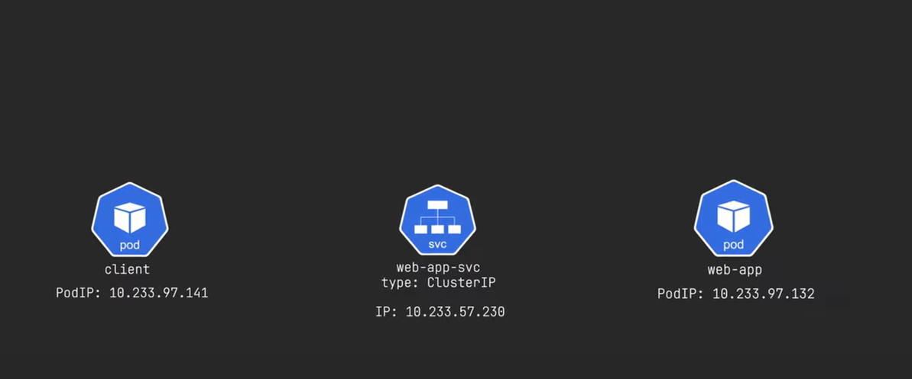

# How to use the MetalLB in kind kubernetes cluster

- `metalLB` is a `Load Balancing` solution for the `bare metal configuration` such as `Kind Kubernetes cluster`

- `kind` is a `tool` in order to provision the `kubernetes cluster` using the `docker cointainer as the kubernetes nodes`

- after `setting up the new kubernetes cluster and deployed the application and service` we need to perform a lot of thing `in order to expose that application or service outside of the kubernetes cluster`

- here using the `metalLB` we will be using the `external roueable IP address as the Load Balancer` for the `application` and `Services`

- we will be learning `ingress controller` using which `we can access the application and service through the domain name`

- **Kubernetes POD networking and How the component that we will be installing falls into this category** 

- when we deploy the `webapp` container into the `kubernetes application` then the `POD` or `POD replica inside the Deployment` will have the `POD IP Address` byb using the `CNI Plugin`. the `IP Address of the POD` will be `local` to the `POD` and only be accessable using the `POD Network Namespace`

- this `POD` will be only accessable using the `POD Network Namespace`

- 

- for this `POD` to be accessable by another `POD` we have the use the `network abstraction` known as the `kubernetes Service`

- the `Service` will be of `type as clusterIP` by default which has the `ClusterIP` which is `reachable` from `anywhere inside the Kubernetes cluster`

- `traffic` send to the `clusterIP` forwarded to the `POD IP Address` in order to server

- 

- 

- `traffic` send to the `clusterIP` forwarded to the `multiple POD IP Address` as the `LoadBalancer` if the `POD` has `multiple replicas` using the `destination nut` rules

- 

- using the `Service` which provide the `cluster wide connectivity` inside the `kubernetes cluster` 

- but we will `not be able to access` the `ClusterIP Service`  from `outside of the kubernetes cluster`

- 

- there are `2 ways` we can use to `facilitate the external access to the POD`
  
  - using the `NodePort` Service Type
  
  - using the `LoadBalancer` Service Type
  
- **NodePort Service Type**
  
  - when we create the `Service` with type as `NodePort` then a `unique static port` will be `assigned to the root network Namespace of the each Node`
  
  - this `unique static Port` will be mapped to the `backend kubernetes Service Port` using the `port translation`
  
  - we have the `direct network connectivity` to the `Node Network` hence can access the `unique static Port on the Node Network IP` to access the `Service`
  
  - we can access the `static port with the any Node IP` then we can access `kubernetes service associated with the POD` inside the `kubernetes clsuter`
  
  - but in many cases we don't want to use the `Node IP` as `application IP`
  
  - 
  
  - if we are running `100 or 1000 of kubernetres services` then it will difficult to handle the `Ports` inside the `kubernetes Nodes` if we are using the `NodePort` service
  
  - this `open up` a `huge security Risk` for the `Cluster`
  
- **LoadBalancer Service Type**
  
  - A `better` approach will be `associating each kubernetes Service that we want to expose` with `different external Ip Address` as the `LoadBalancer` Service
  
  - each `LoadBalancer` Service instance will be assigned with `external unique routableIP Address`
  
  - the `LoadBalancer IP` Address will be the `subset` of the `kubernetes Node Network IP Addresses` which is `accessable` from `local`
  
  - hence we can use the `external IP Address` to access `kubernetes Service Associated with it` which been linked to `POD`
  
  - but there is one `caveat` to use this , we need to have `loadBalancer` installed to the `kubernetes cluster` which will be assignignn the `external Ip Address for the kubernetes Service4 type as LoadBalancer`
  
- **`MetalLB` kubernetes Local LoadBalancer**:-

- A `common loadBalancer` in the `kubernetes cluster` will be the `metallb loadbalancer` in the `kubernetes cluster`

- once the `metalLb` loadBalancer been installed `it will be creating a namespace` called the `metallb-system`

- here the `metalLb` LoadBalancer will create the `IPAddressPool` which will going to `provide a range of IP` as the `external IP` which will be allocated to the `kubernetes services` of type as `LoadBalancer`

- also the `metalLb` LoadBalancer will create the `speaker daemonset`  which will be installed on `each kubernetes Nodes`

- `each speaker agent` uses the `gratutious app` in order to `configure` the `Node Network Interface` to `respond to the app request that been made`

- for example :-
  
  - if we have the `5 POD running` and a `Kubernetes Service for each of the POD` been defined as the `LoadBalancer` then  `IPAddressPool` will assign the `External Ip to the Kubernetes Service`
  
  - then the `metalLb Speaker` will then `advertize using the gratutious app` to `any machine in the node network`

  - each of the `external Ip` assigned to the `Services` will be `attached to the MAC Address of the kubernetes Node`
  
  - `Any Request` coming ton the `external IP` will be forwarded to the `Node Network Interface using the Mac Address` and then it can access the `KIubernetes Service associated with the POD` 
  
- **How to install the MetalLb LoadBalancer inside the kubernetes cluster**

- here the reference for the `MetalLb LoadBalancer` provided in [MetalLB reference manual](https://metallb.universe.tf/configuration/)

- here we can use the `helm` or `kustomize` to `install the required metalLB LoadBalancer` 

- here we will be using the `manifest approach` to install `metalLB` on the `kubernetes cluster`

- before installing this we need to `make` the `kube-proxy` configMap which sits inside the `kube-system` namespace where we need to make the `strictARP: true` `which is by default false`

- here we will be using the command as below 

    
    ```bash
        kubectl edit configmap kube-proxy -n kube-system
        # here we are using the kube-system namespace in this case
        # here also we are editing  the  kube-proxy config map inside the  kube-system namespace
        # here we need to set the strictARP: true

    ```

- 

- then we can use the `metallb-native` manifest to `deploy the metallb on the kubernetes cluster inside the metal-system namespace`

- we can execute the command as below 

    ```bash
        kubectl apply -f https://raw.githubusercontent.com/metallb/metallb/v0.14.3/config/manifests/metallb-native.yaml
        # here applying the changes to the metallb-native.yaml to install the required metalLB component
        # here the output will be as below 
        namespace/metallb-system created # here we can see the namespace got created
        customresourcedefinition.apiextensions.k8s.io/bfdprofiles.metallb.io created
        customresourcedefinition.apiextensions.k8s.io/bgpadvertisements.metallb.io created
        customresourcedefinition.apiextensions.k8s.io/bgppeers.metallb.io created
        customresourcedefinition.apiextensions.k8s.io/communities.metallb.io created
        customresourcedefinition.apiextensions.k8s.io/ipaddresspools.metallb.io created
        customresourcedefinition.apiextensions.k8s.io/l2advertisements.metallb.io created
        serviceaccount/controller created
        serviceaccount/speaker created
        role.rbac.authorization.k8s.io/controller created
        role.rbac.authorization.k8s.io/pod-lister created
        clusterrole.rbac.authorization.k8s.io/metallb-system:controller created
        clusterrole.rbac.authorization.k8s.io/metallb-system:speaker created
        rolebinding.rbac.authorization.k8s.io/controller created
        rolebinding.rbac.authorization.k8s.io/pod-lister created
        clusterrolebinding.rbac.authorization.k8s.io/metallb-system:controller created
        clusterrolebinding.rbac.authorization.k8s.io/metallb-system:speaker created
        configmap/metallb-excludel2 created
        secret/webhook-server-cert created
        service/webhook-service created
        deployment.apps/controller created #metallb controller also get created with this
        daemonset.apps/speaker created # here we can see the speaker daemonset get created
        validatingwebhookconfiguration.admissionregistration.k8s.io/metallb-webhook-configuration created

        # now if we check the metal-system namespace to see all the resource that been created then we can see as below 
        kubectl get all -n  metallb-system 
        # here we can see the ouput as below 
        NAME                             READY   STATUS    RESTARTS   AGE
        pod/controller-7d678cf54-fp9d8   1/1     Running   0          2m8s # here we can see the controller running for the metalLB
        pod/speaker-d58tq                1/1     Running   0          2m8s
        pod/speaker-kw7br                1/1     Running   0          2m8s
        pod/speaker-rmmnp                1/1     Running   0          2m8s

        NAME                      TYPE        CLUSTER-IP     EXTERNAL-IP   PORT(S)   AGE
        service/webhook-service   ClusterIP   10.96.126.77   <none>        443/TCP   2m8s

        NAME                     DESIRED   CURRENT   READY   UP-TO-DATE   AVAILABLE   NODE SELECTOR            AGE
        daemonset.apps/speaker   3         3         3       3            3           kubernetes.io/os=linux   2m8s # here we can see the speaker daemonset

        NAME                         READY   UP-TO-DATE   AVAILABLE   AGE
        deployment.apps/controller   1/1     1            1           2m8s # controller deployment details we can see in here 

        NAME                                   DESIRED   CURRENT   READY   AGE
        replicaset.apps/controller-7d678cf54   1         1         1       2m8s


    ```

- we can get all the `resources info (such as APIVersion and Type and Shortform and Aditional Property)` that `metallb` uses by using the command as below 

    ```bash
        kubectl api-resources | grep metallb
        # here we can see the ouput as below iwhere we can get more info abount the metalBl resourses
        # the ouput will be as below 
        bfdprofiles                                    metallb.io/v1beta1                     true         BFDProfile
        bgpadvertisements                              metallb.io/v1beta1                     true         BGPAdvertisement
        bgppeers                                       metallb.io/v1beta2                     true         BGPPeer
        communities                                    metallb.io/v1beta1                     true         Community
        ipaddresspools                                 metallb.io/v1beta1                     true         IPAddressPool
        l2advertisements                               metallb.io/v1beta1                     true         L2Advertisement

    ```

- now we need to create the `IPAddressPool` and `L2Advertisement` as below in order to `complete the metalLB configuration`
 
- we can define the `ip.yml` and `l2config.yml` as below 

    ```yaml
        ip.yml
        ======
        apiVersion: metallb.io/v1beta1 # we can get the apiVersion using the command as kubectl api-resources | grep metallb
        kind: IPAddressPool # here the IPAddressPool is the type of kubernetes object in this case 
        metadata: # here defining the name of the IPAddressPool
            name: first-pool
            namespace: metallb-system # defining the namespace as metallb-system 
        spec: # defining the spec for the IPAddressPool
            addresses: # here we can get the info about the network range using the `docker network inspect kind` command which will provide the kind node which is a docker container network address its is 172.18.0.1-172.18.0.255 here i am using the small chunk of it
                - 172.18.0.10-172.18.0.250

    ```

- we can `deploy this changes to the cluster by applying the changes` as below 

    ```bash
        kubectl apply -f ip.yml -n metallb-system 
        # here applying the changes and making sure to deployy to the metallb-system namespace
        ipaddresspool.metallb.io/first-pool created

        # we can get to see the IPAddressPool using the command as below 
        kubectl get IPAddressPool -n metallb-system 
        # fetching the IPAddressPool that we have created inside the metallb-system namespace
        # the output weill be as below for this system
        NAME         AUTO ASSIGN   AVOID BUGGY IPS   ADDRESSES
        first-pool   true          false             ["172.18.0.10-172.18.0.250"]

    ```


    ```yaml
        l2config.yml
        ============
        apiVersion: metallb.io/v1beta1 # we can get the apiVersion using the command as kubectl api-resources | grep metallb
        kind: L2Advertisement # here kubernetes object will be of type as L2Advertisement
        metadata: # providing the name for the L2Advertisement
            name: homelab-l2
            namespace: metallb-system # using the namespace as the metallb-system 
        spec: # specification for the L2Advertisement config 
            ipAddressPools: # here defining IPAddressPool
                - first-pool # here we are referencing the IPAddressPool that we have created 

    ```

- we can `deploy this changes to the cluster by applying the changes` as below 

    ```bash
        kubectl apply -f l2config.yml -n metallb-system 
        # here applying the changes and making sure to deployy to the metallb-system namespace
        # the output as below 
        l2advertisement.metallb.io/homelab-l2 created

        # we can see the details about the L2Advertisement as below 
        kubectl get L2Advertisement -n  metallb-system 
        # here we are using the command as to get the L2Advertisement kubernetes object created in reference to the IPAddressPool
        # the output will be as below in this case
        NAME         IPADDRESSPOOLS   IPADDRESSPOOL SELECTORS   INTERFACES
        homelab-l2   ["first-pool"]     


    ```

- now we can create the `Deployment and Service` as below with the `kubernetes Service type as LoadBalancer` to use the `metalLb LoadBalancer`

- we are testing the `metalLb LoadBalancer` by creating the `test Deployment` with `Service as LoadBalancer`

- we can do that as below `workloads.yml` for the `Deployment with Service as LoadBalancer`

    ```yaml
        workloads.yml
        =============
        apiVersion: apps/v1 # here the apiVersion being as the apps/v1 as the apiGroup belong to apps
        kind: Deployment # here defining the kubernetes object with type as Deployment
        metadata: # defining the nae of the Deployment as webapp
            name: webapp
            labels: #defining the Labels for the Deployment so that Service can fetch the Deployment with the specific labels
                app.kubernetes.io/name: webapp
                name: webapp
        spec: # here definig the specification for the Deployment in here
            selector: # here we are definig the selector which will select the app based on labels
                matchLabels:
                    app.kubernetes.io/name: webapp
            replicas: 1 # here we will be defining only onen replica will be spunned
            template: # defining the template for the POD definition
                metadata:
                    labels: # defining the POD label based on which Deployment wand Services will associate with the POD
                        app.kubernetes.io/name: webapp
                spec: # defining the POD specification in this case as in here
                    containers: # container label info been provided in here
                        - name: webapp # name of the container
                          image: nginx # image for the container
                          command: # command used when the container been spunned
                            - /bin/sh
                            - -c
                            - "echo 'welcome to my webapp' > /usr/share/nginx/html/index.html & nginx -g 'daemon off;'"
                    dnsConfig: # here we can specify the DNS configuration with respect to the POD container
                        options: # defining the options for the Extra DNS configuration as below
                            - name: ndots # here we are using the ndot rule so when the request come it will check for 2 dot inside the name if not there then add extra info
                              value: 2 # here we are checking for the 2 ndots, son that if a request made as `example.com` where only one . is there it will add extra info

        ---

        apiVersion: v1 # here we are defining the apiVersion as v1 as the services belong to  the core api Group
        kind: Service  # defining the kubernetes object as Service in this case
        metadata: # name of the kubernetes Service as webapp-svc
            name: webapp-svc
            labels: # defining the labels inside the Kubernetes Service 
                app.kubernetes.io/name: webapp
        spec: # specification for the Service
            selector: # here defining the selector based on the POD label so that the Service can associate with the PODs 
                app.kubernetes.io/name: webapp
            ports:
                - name: http # name of the port being as http
                  port: 80 # allow traffic on port 80
                  targetPort: 80 # target Port as 80 which will open for the container
                  protocol: TCP # here we are using the protocol as TCp in this case
            type: LoadBalancer # defining the Service type as the LoadBalancer in this case


    ```

- if we `Deploy the changes` to the `kubernetes cluster` by `applying the  changes` then we can see the result as below 

- we can perform this action using the command line as 

    ```bash
        
        kubectl apply -f workloads.yml
        # here we are using the workloads.yml to Deploy the changes to the kind kubernetes cluster
        # the output will be as below
        deployment.apps/webapp created
        service/webapp-svc created

        # now if we want to see all the resource that we have deployed to the default namespace then we can use the command as below
        kubectl get all
        # fetching all kubernetes workloads inside the default namespace
        # the output will be as below 
        NAME                          READY   STATUS    RESTARTS   AGE
        pod/webapp-795df9cf5b-s6drr   1/1     Running   0          7m30s

        NAME                 TYPE           CLUSTER-IP      EXTERNAL-IP   PORT(S)        AGE
        service/kubernetes   ClusterIP      10.96.0.1       <none>        443/TCP        15m
        service/webapp-svc   LoadBalancer   10.96.104.139   172.18.0.10   80:31915/TCP   7m30s # here we can see that metalLB provided the external Ip for the LoadBalancer svc

        NAME                     READY   UP-TO-DATE   AVAILABLE   AGE
        deployment.apps/webapp   1/1     1            1           7m30s

        NAME                                DESIRED   CURRENT   READY   AGE
        replicaset.apps/webapp-795df9cf5b   1         1         1       7m30s

    ```

- if we want to reach to the `http://172.18.0.10` then `we can access the webpage` as below 

-  

- here also we can see the `same info` by using the curl request as below 

    ```bash
        curl http://172.18.0.10
        # here we are doing a curl i.e GET request to the website
        # the3 output will be as below 
        welcome to my webapp

    ```

- an even better way to access the website by using the `domain name` rather than the `External IP Address assigned by metalLB`

- it will remove the `hassle of remebering the External IP Address` with the `registering Port` in this case

- this will also address the `issue of running out of external IP Address that can be assigned`

- **Ingress Controller** 

- to achieve this we need to install and use the `ingress controller` inside the `kubernetes cluster`

- An `ingress controller` is just a `reverse proxy` that `which is a server that sits between the client and webserver`

- it act as an `intermidiate between` the `client` and `webserver`

- `ingress controller` `provide many benifit` such as `Load Balacing` and `caching` and `SSL Termination` etc

- here the `ingress controller` have the `Service` as the `LoadBalancer type` to which `metalLB` will assign the `external IP Address`

- we can `point the domain and subdomain` defined inside the `/etc/hosts`  to `Ingress controller LoadBalancer service External Ip` so all the `traffic will go through the ingress controller`

- then the `ingress controller` can `route` this to the `specific services` using the `ingress rule defined`

- 

- just like `LoadBalncer` there are multiple `type of ingress controller` that can be used in here such as 
  
  - `haproxy`
  
  - `traefik`
  
  - `ingress`  

- **How to install and use the nginx Ingress controller on kubernetes** 

- we can install the `nginx Ingress controller` in many different way such as 
  
  -  `using manifest`
  
  -  `using helm`

- we can refer the `nginx reference manual` using the link as [nginx docs](https://docs.nginx.com/nginx-ingress-controller/installation/integrations/app-protect-dos/configuration/)

- here we will be using the `helm package manager` in order to `install the ingress controller` on the `kubernetes cluster`

- first we need to pull the `nginx-ingress-controller`  by using the `helm pull` command as below 

    ```bash
        helm pull oci://ghcr.io/nginxinc/charts/nginx-ingress --untar --version 1.1.3
        # here we are pulling nginx-ingress repo using the helm pull command

        cd nginx-ingress 
        # moving to the  nginx-ingress folder for reference

        kubectl create ns nginx-ingress
        # here we are creating the nginx-ingress namespace using the command as kubectl create ns
        
        # then we need to checkout to the nginx-ingress namespace that we have created
        kubectl config set-context --current --namespace=nginx-ingress
        # here we are using the kubectl command to checkout to the nginx-ingress namespace
        
        # we can also do that using the kubens command as below 
        # but for this we need to make sure the kubens is installed
        # for installing the kubens command line
        mkdir -p ~/.local/bin
        wget https://raw.githubusercontent.com/ahmetb/kubectx/master/kubectx -O ~/.local/bin/kubectx
        wget https://raw.githubusercontent.com/ahmetb/kubectx/master/kubens -O ~/.local/bin/kubens
        chmod +x ~/.local/bin/kubectx ~/.local/bin/kubens
        sudo mv ~/.local/bin/kubectx /usr/local/bin
        sudo mv ~/.local/bin/kubens /usr/local/bin
 
        # here we can use the kubens command to checkout to the other namespace as below
        kubens <namespace> we want to checkout to 
        # for example
        kubens nginx-ingress
        # using this we can checkout to the nginx-ingress namespace


        # then we need to install the custom resource definition or crd using the command as below 
        # we can use the kubectl command to deploy all the crd provided by the nginx-ingress
        kubectl apply -f crd
        # here it will going to install all the custom resource definition in inginx-ingress namespace


        # then we can install the nginx-ingress controller and service using the command as below
        # using helm we need to install the release
        helm install nginx-ingress oci://ghcr.io/nginxinc/charts/nginx-ingress --version 1.1.3
        # here we are using the nginx-ingress release as well 

        # then we can see all the POD and Service inside the nginx-ingress namespace 
        kubectl get all -n nginx-ingress
        # here we can see the nginx-ingress controller POD and nginx-ingress Service as well 
        # we can see the below output in this case
        NAME                                          READY   STATUS              RESTARTS   AGE
        pod/nginx-ingress-controller-548d4c58-9jz6n   0/1     ContainerCreating   0          13s

        NAME                               TYPE           CLUSTER-IP    EXTERNAL-IP   PORT(S)                      AGE
        service/nginx-ingress-controller   LoadBalancer   10.96.145.7   172.18.0.11   80:30502/TCP,443:30565/TCP   13s

        NAME                                       READY   UP-TO-DATE   AVAILABLE   AGE
        deployment.apps/nginx-ingress-controller   0/1     1            0           13s

        NAME                                                DESIRED   CURRENT   READY   AGE
        replicaset.apps/nginx-ingress-controller-548d4c58   1         1         0       13s

    ```

- now with `ingress changes` Deployed then we can see that `ingress-controller` service as the `LoadBalancer` and `metalLb` assigned the `external IP Address` for the same

- here we can change the `existing kubernetes Service` in the `default namespace` as `ClusterIP` as we have the `nginx-ingress controller service in place which is of type LoadBalancer`

- hence we can rewrite the `workloads.yml` as below 

    ```yaml
        workloads.yml
        ==============
        apiVersion: apps/v1 # here the apiVersion being as the apps/v1 as the apiGroup belong to apps
        kind: Deployment # here defining the kubernetes object with type as Deployment
        metadata: # defining the nae of the Deployment as webapp
            name: webapp
            labels: #defining the Labels for the Deployment so that Service can fetch the Deployment with the specific labels
                app.kubernetes.io/name: webapp
                name: webapp
        spec: # here definig the specification for the Deployment in here
            selector: # here we are definig the selector which will select the app based on labels
                matchLabels:
                    app.kubernetes.io/name: webapp
            replicas: 1 # here we will be defining only onen replica will be spunned
            template: # defining the template for the POD definition
                metadata:
                    labels: # defining the POD label based on which Deployment wand Services will associate with the POD
                        app.kubernetes.io/name: webapp
                spec: # defining the POD specification in this case as in here
                    containers: # container label info been provided in here
                        - name: webapp # name of the container
                          image: nginx # image for the container
                          command: # command used when the container been spunned
                            - /bin/sh
                            - -c
                            - "echo 'welcome to my webapp' > /usr/share/nginx/html/index.html & nginx -g 'daemon off;'"
                    dnsConfig: # here we can specify the DNS configuration with respect to the POD container
                        options: # defining the options for the Extra DNS configuration as below
                            - name: ndots # here we are using the ndot rule so when the request come it will check for 2 dot inside the name if not there then add extra info
                              value: 2 # here we are checking for the 2 ndots, son that if a request made as `example.com` where only one . is there it will add extra info

        ---

        apiVersion: v1 # here we are defining the apiVersion as v1 as the services belong to  the core api Group
        kind: Service  # defining the kubernetes object as Service in this case
        metadata: # name of the kubernetes Service as webapp-svc
            name: webapp-svc
            labels: # defining the labels inside the Kubernetes Service 
                app.kubernetes.io/name: webapp
        spec: # specification for the Service
            selector: # here defining the selector based on the POD label so that the Service can associate with the PODs 
                app.kubernetes.io/name: webapp
            ports:
                - name: http # name of the port being as http
                  port: 80 # allow traffic on port 80
                  targetPort: 80 # target Port as 80 which will open for the container
                  protocol: TCP # here we are using the protocol as TCp in this case
            type: ClusterIP # defining the Service type as the ClusterIP in this case as we are using the ClusterIp Service


    ```

- if we `Deploy the changes` to the `kubernetes cluster` by `applying the  changes` then we can see the result as below 

- we can perform this action using the command line as 

    ```bash
        kubectl apply -f workloads.yml
        # here we are using the workloads.yml to Deploy the changes to the kind kubernetes cluster
        # the output will be as below
        deployment.apps/webapp unchanged
        service/webapp-svc configured
    
    ```

- we can define the `ingress rule` where we will redirecting from `host domain name` to the `ClusterIP`

    
    ```yaml
        ingress.yml
        ===========
        apiVersion: networking.k8s.io/v1 # here we can see the apiVersion from the command as kubectl api-resources | grep ingress
        kind: Ingress # here the kubernetes Resource type as Ingress
        metadata: # name of the Ingress as basic-routing
            name: basic-routing
            annotations: # here we can also use the annotations to define the ingress class name as nginx as well
                kubernetes.io/ingress.class: "nginx" 
        spec: # here defining the specification for the ingress rule in this case
            rules: # herre we will be defining the host based or path based rules in this case
                - host: web-app.home-k8s.lab # here hostname being defined in here
                  http:
                    paths:  
                        - path: / # accessing the root endpoint
                          pathType: Prefix # defining the pathType as [prefix in this case]
                          backend: # defining the backend as service in this case
                            service: 
                                name: webapp-svc # defining the backend service in this case
                                port:
                                    number: 80 # accessing on the port 80 in this case 

    ```

- then we can `Deploy the changes` onto the `kubernetes cluster` by applying the changes on the `workloads.yml` and `ingress.yml` as below 

    
    ```bash
        kubectl apply -f workloads.yml
        # here we are deploying the WorkLoad changes onto the cluster and making the Service as the ClusterIp to take advantage of ingress controller
        # here the output will be as below
        deployment.apps/webapp unchanged
        service/webapp-svc configured


        kubectl apply -f ingress.yml
        # here we are deploying the changes for the ingress rules for the ingress controller
        # we can see the output as below in this case
        ingress.networking.k8s.io/basic-routing created

        # here then we need to change the /etc/host file to redirect the DNS name to the external IP which been provided by metalLb to the ingress controller service
        # we can able to achieve the same using the A-Record inside the DNS Server that been using instead of the /etc/hosts 
        # we can do that as below 
        sudo nano /etc/hosts
        # here the output will be as below in this case
        127.0.0.1	localhost
        127.0.1.1	pratik-virtual-machine
        172.18.0.11 web-app.home-k8s.lab # here we have define the ingress controller service External Ip provided by metallb against the domain name

        # The following lines are desirable for IPv6 capable hosts
        ::1     ip6-localhost ip6-loopback
        fe00::0 ip6-localnet
        ff00::0 ip6-mcastprefix
        ff02::1 ip6-allnodes
        ff02::2 ip6-allrouters

        # now when we try to reach to the kubernetes POD application using the curl then we will be able to get the response
        # hence here we can define the rule as below 
        curl  web-app.home-k8s.lab 
        # here we can see the response as below 
        welcome to my webapp

    ```

- here we can see the `details` as when we try to access the `web browser`

-  

- 