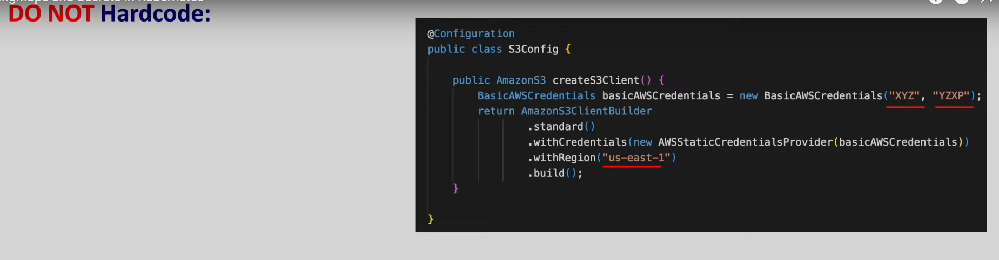
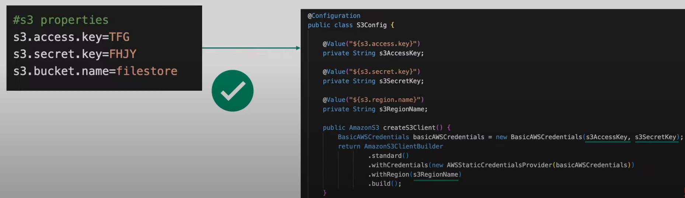
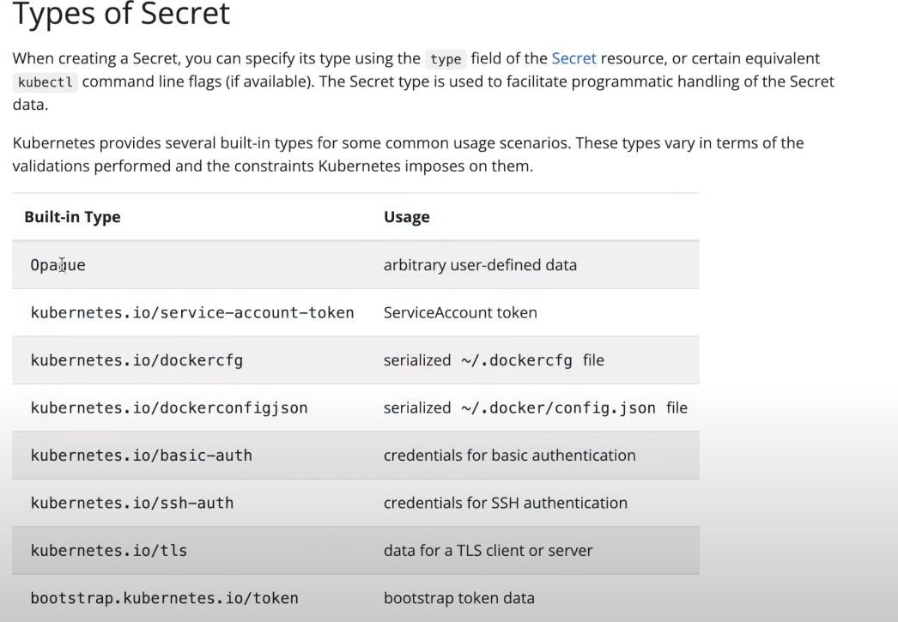

# configMaps and Secrets in kubernetes

- here if we see the `mongodb` implementation of `replica` using the `StatefulSets` then we can see we can provide the `MONGO_INITDB_ROOT_USERNAME` and `MONGO_INITDB_ROOT_PASSWORD` as the `env Variable`

- this way we can `change the same POD container` using `different env variable` without `rebuilding the actual image`

- here we will learn `How to pass the same configuration data to the POD container` using the `configMaps` and `Secrets`

- `when we are developing the application we should not hardcode the values which will be changed for different environment`

- 

- rather than that we can `configure those properties` so that we don't have to `rebuild the image` again and again

- we can `pass those values from outside to the container`  as described below 

- 

- that we can make sure we can `reuse the same image` with `different environment such as DEV/QA/STAGING/PROD` by passing the `values into it`

- there are `3 ways` we can define the `configuration data`
  
  - `Passing It as Args`
  
  - `configuration file`
  
  - `using environment variables`
  
- `hardcoding` this `configuration data` inside the `YAML definition file` is `not a good idea` because for `different env` we need to `then we different different definition YAML files`

- to resue the `same Definition YAML` accross `multiple different environment` it is a good idea that we can define the `configuration` inside a `separate space in a common place based on` different env and `refer that data` inside the Definition YAML`

- for this `kubernetes` provide `2 special resources` which is `configMaps and Secrets`

- these 2 `kubernetes resources (configMaps and Secrets)` to set the `configuration` `separately` inside the `POD definition file` 

- these 2 `kubernetes resources (configMaps and Secrets)` to set the `configuration` for the `POD definition YAML`

- **Kubernetes configMaps and Secrets**

- **configMaps**
  
  - `configMaps` is a `kubeernetes object` that will let you to `store the configuration` which can be used accross `different Application POD`
  
  - here we can develope the `configMap` and used it as `configuration` inside the `POD definition`
  
  - for the `mongodb POD` application we can create the `configuration` as below 

    ```yaml
        mongo-configmap.yml
        ====================
        apiVersion: v1 # here the apivrsion being as v1 as the configMap belong to the core group
        kind: ConfigMap # here creating the kubernetes object of type ConfigMap
        metadata: # here providing the name for the configMap as mongo-configmap
            name: mongo-configmap
        data: # like other kubernetes object has the spec field configMaps has the data field in this case
        # data field wioll going to take the key value pair as value
            username : admin
            password : password
            # here the username and password as configMap which can be used inside the POD definition 
            # here we can define the configuration file inside the configMap as well
            mongodb.conf : | # here the name of the configuration file will be as mongodb.conf and below were the value saved to the configuration file
                storage:
                    dbPath: /data/configdb
                replication:
                    replSetName: "rs0"


    ```

  - A `configMap` is `not designed` to `Hold Large Data`
  
  - the `data` stored inside the `configMap` must not exceed `1MB`
  
  - if the `configuration data` which need to be provided to the `POD` being `high` then we can use the `volumeMount` for the same or use the separate `db service or file server service`
  
  - if we want to make this `configMap` should not be changed then we can define it as `immutable` as `true` parallel to the `data` section as below 
  
    ```yaml
        mongo-configmap.yml
        ====================
        apiVersion: v1 # here the apivrsion being as v1 as the configMap belong to the core group
        kind: ConfigMap # here creating the kubernetes object of type ConfigMap
        metadata: # here providing the name for the configMap as mongo-configmap
            name: mongo-configmap
        immutable: true # defining the immutable as true in this case so that configMaps can't be edited
        # the default value for the immutable being false
        data: # like other kubernetes object has the spec field configMaps has the data field in this case
        # data field wioll going to take the key value pair as value
            username : admin
            password : password
            # here the username and password as configMap which can be used inside the POD definition 
            # here we can define the configuration file inside the configMap as well
            mongodb.conf : | # here the name of the configuration file will be as mongodb.conf and below were the value saved to the configuration file
                storage:
                    dbPath: /data/configdb
                replication:
                    replSetName: "rs0"


    ```

- if we mention the `configMap` as `immutable` then the `configMap` `can't be edited` then `we need to delete the existing configMap and recreate it`

- as of now , we can make this configMap as `immutable: false` and deploy the changes to the `kubernetes cluster` as below 

    ```bash
        kubectl apply -f mongo-configmap.yml
        # here deploying the changes to the default namespace of the kubernetes cluster by applying changes
        # the output will be as below 
        configmap/mongo-configmap created


        # we can verify that `configMap` been created with the command as below 
        kubectl get cm
        # yhere this will provide the configMap which got created
        NAME               DATA   AGE
        kube-root-ca.crt   1      44h
        mongo-configmap    3      20s # here 3 means defined with 3 keys inside the data section fo the configMaps

        # we can also see the description of the configMap using the  command as below 
        # here we can see the below output
        kubectl describe configmap/cm mongo-configmap
        Name:         mongo-configmap
        Namespace:    default
        Labels:       <none>
        Annotations:  <none>

        Data
        ====
        mongodb.conf:
        ----
        storage:
            dbPath: /data/configdb
        replication:
            replSetName: "rs0"

        password:
        ----
        password
        username:
        ----
        admin

        BinaryData
        ====

        Events:  <none>


    ```

- now we can define the `mongodb StatefulSets` as below where we will be refering the `configMap` as below 

    ```yaml
        storage-aws.yml
        ===============
        apiVersion: storage.k8s.io/v1 # here defining the apiVersion for the storage which can be fetched in kubectl api-resources -o wide | grep storageclass
        kind: StorageClass # here defining the type of kubernetes object will be as type StorageClass
        metadata: # name of the StorageClass as the cloud-mongo-ssd
            name: cloud-mongo-ssd 
        provisioner: ebs.csi.aws.com # here we are usign the ebs.csi.aws.com
        parameters: # here using the parameters to  define which type of volume we are using as type
            type: gp2 # here we are suing the general purpose volume in this case
        volumeBindingMode: Immediate # here the volumeBinding mode as Immediate instead of WaitForFirstConsumer so that the association can happen well

    ```


    ```yaml
        mongo-replicaset.yml
        ====================
        apiVersion: v1 # here using the apiVersion as v1 as the Services even the headlessService belong to the v1 version
        kind: Service # here the kind of kubernetes object as Service
        metadata: # name fo the headlessService as mongo which bween referenced inside the statefuleSets
            name: mongo
            namespace: traceability-dev-test-1 # here we are using the namespace as taceability-dev-test-1
            labels: # name for the Service we can defined as mongo
                name: mongo
        spec: # spec for the Services defined in here
            selector: # selector for the Service defined in here based on POD label
                app: mongo # 
            ports: # port been defined in here
                - name: mongo # name of the port
                  port: 27017 # port number we will be using to allow traffic
                  targetPort: 27017 # container port to be exposed
                  prtocol: TCP # here the protocol is TCP
            clusterIP: None # definig the clusterIp as None make itas headless servive which will be linked with the StatefulSets


        ---
        apiVersion: apps/v1 # here the StatefulSets belong to the apps aiGroup hence we can define that as apps/v1
        kind: StatefulSet # here the kubernetes object will be of type as  StatefulSet
        metadata: # here defining the statefulSets as the name as mongo
            name: mongo
            namespace: traceability-dev-test-1 # here we are using the namespace as taceability-dev-test-1
        spec: # defining the spec for the mongo StatefulSet
            selector: # here definign the selector so that StatefulSet will fetch the selector based on the matched POD label
                matchLabels: 
                    app: mongo
            replicas: 3 # here the number of replicas as 3n in this case
            serviceName: mongo # here define the headlessService as mongo
            template: # defining the template as the POD definition in this case
                metadata: # defining the POD label inside the metadata section so that StatefulSets can pick it up
                    labels:
                        app: mongo
                spec: # defining the spec for the POD definition in this case
                    containers: # container definition been defined also in here
                        - name: mongo # name of the container
                          image: mongo:4.0.8 # image for the container
                          args: ["--dbpath", "/data/db"] # args passed to the default command of mongodb container
                          env: # here env variable for the POD container defined in here
                            - name: MONGO_INITDB_ROOT_USERNAME # name of the env variable
                              value: admin # value for the env variable
                            - name: MONGO_INITDB_ROOT_PASWORD # name of the env variable
                              value: password # value for the env variable
                          command: # command which will get executed when the POD starts with the args value
                            - mongod
                            - "--bind_ip_all"
                            - "--replSet"
                            - "rs0"
                          volumeMounts: # performing a volumeMounts for the db container in this case
                            - name: mongo-persistence-volume # name of the volumeMount whioch will be used a the claim as well
                              mountPath: /data/db # path inside the container which need to be refered
            volumeClaimTemplates: # definign the volumeClaimTemplates for creating the persistenceVolumeClaim  in this case
                - metadata: # here the metadata for the persistenceVolumeClaim where we define the name
                    name: mongo-persistence-volume # name of the persistenceVolumeClaim
                  spec: # specification for the persistenceVolumeClaim
                    resources: # requesting for the resource of 1Gi
                        requests:
                            storage: 1Gi
                    accessModes: ['ReadWriteOnce'] # providing it permission so that one POD inside the nnode does the read and write rest od similar POD will do the read
                    storageClassName: cloud-mongo-ssd # here defining the storageClass as cloud-mongo-ssd which we will create


    ```

- now as our `mongo-configMap.yml` for the `configMap Definition` and `mongo-replicaset.yml` has been `deployed` onto the `kubernetes cluster` then we will see `How to use the configMap as the environment variable` inside the `mongo-replicate.yml Stateful Sets`

- we can use the `mongo-congigmap.yml` where we defined the `key value pair` inside the `Data` which can be used as the `env variable in this case`

- here preveiously inside the `mongo-replicaset.yml` statefulSet we have hardcoded the `env variable` as `MONGO_INITDB_USERNAME` and `MONGO_INITDB_PASSWORD`

- `now instead of hardcoding the env variable` we can get the Dat from the configMaps as below 

- we can define the `mongo-replicaset.yml` file where the env varaible been coming from the `configMaps`

    ```yaml
        
        mongo-replicaset.yml
        ====================
        apiVersion: v1 # here using the apiVersion as v1 as the Services even the headlessService belong to the v1 version
        kind: Service # here the kind of kubernetes object as Service
        metadata: # name fo the headlessService as mongo which bween referenced inside the statefuleSets
            name: mongo
            namespace: traceability-dev-test-1 # here we are using the namespace as taceability-dev-test-1
            labels: # name for the Service we can defined as mongo
                name: mongo
        spec: # spec for the Services defined in here
            selector: # selector for the Service defined in here based on POD label
                app: mongo # 
            ports: # port been defined in here
                - name: mongo # name of the port
                  port: 27017 # port number we will be using to allow traffic
                  targetPort: 27017 # container port to be exposed
                  prtocol: TCP # here the protocol is TCP
            clusterIP: None # definig the clusterIp as None make itas headless servive which will be linked with the StatefulSets


        ---
        apiVersion: apps/v1 # here the StatefulSets belong to the apps aiGroup hence we can define that as apps/v1
        kind: StatefulSet # here the kubernetes object will be of type as  StatefulSet
        metadata: # here defining the statefulSets as the name as mongo
            name: mongo
            namespace: traceability-dev-test-1 # here we are using the namespace as taceability-dev-test-1
        spec: # defining the spec for the mongo StatefulSet
            selector: # here definign the selector so that StatefulSet will fetch the selector based on the matched POD label
                matchLabels: 
                    app: mongo
            replicas: 3 # here the number of replicas as 3n in this case
            serviceName: mongo # here define the headlessService as mongo
            template: # defining the template as the POD definition in this case
                metadata: # defining the POD label inside the metadata section so that StatefulSets can pick it up
                    labels:
                        app: mongo
                spec: # defining the spec for the POD definition in this case
                    containers: # container definition been defined also in here
                        - name: mongo # name of the container
                          image: mongo:4.0.8 # image for the container
                          args: ["--dbpath", "/data/db"] # args passed to the default command of mongodb container
                          env: # here env variable for the POD container defined in here
                            - name: MONGO_INITDB_ROOT_USERNAME # name of the env variable
                              # here we can get the value from the configMaps as below 
                              valueFrom:
                                configMapKeyRef:  # this will be the key and configMap that we have defined inside the data section inside the configMap
                                    key: username  # here need to provide the key that we have defined inside the Dat Section
                                    name: mongo-configmap # configMap name defined in here
                            - name: MONGO_INITDB_ROOT_PASWORD # name of the env variable
                              # here we can get the value from the configMaps as below 
                              valueFrom:
                                configMapKeyRef:  # this will be the key and configMap that we have defined inside the data section inside the configMap
                                    key: password  # here need to provide the key that we have defined inside the Dat Section
                                    name: mongo-configmap # configMap name defined in here
                          command: # command which will get executed when the POD starts with the args value
                            - mongod
                            - "--bind_ip_all"
                            - "--replSet"
                            - "rs0"
                          volumeMounts: # performing a volumeMounts for the db container in this case
                            - name: mongo-persistence-volume # name of the volumeMount whioch will be used a the claim as well
                              mountPath: /data/db # path inside the container which need to be refered
            volumeClaimTemplates: # definign the volumeClaimTemplates for creating the persistenceVolumeClaim  in this case
                - metadata: # here the metadata for the persistenceVolumeClaim where we define the name
                    name: mongo-persistence-volume # name of the persistenceVolumeClaim
                  spec: # specification for the persistenceVolumeClaim
                    resources: # requesting for the resource of 1Gi
                        requests:
                            storage: 1Gi
                    accessModes: ['ReadWriteOnce'] # providing it permission so that one POD inside the nnode does the read and write rest od similar POD will do the read
                    storageClassName: cloud-mongo-ssd # here defining the storageClass as cloud-mongo-ssd which we will create


    ```

- here we are now have the `mongo-replicaset.yml` which beeen using the `configMap` defined value as the `env variable`

- we can deploy these changes onto the `kubernetes cluster` using it as follow

    ```bash
        kubectl apply -f mongo-replicaset.yml
        # deploying the changes onto the kubernetes cluster by applying the changes in this case
        # we can apply the configuration as below 
        # the output will be as below
        service/mongo unchanged
        statefulset.apps/mongo configured

    ```

- we have also used the `configMaps` as the `configuration file` by defining the `mongodb.conf` info inside the `configMaps`

- here if we want to use the `configuration file defined inside the configMap` inside the `StatefulSets` then we can defrine it as below 

- to use the `configuration file i.e mongodb.conf` defined inside the `configMaps` , if we want to use the `custom configfile to the command` while the `POD been getting cretaed`

- so we have to define the command as `mongod --bind_ip_all --replSet --config=/etc/mongo/mongdb.conf`

- but as we know there is `default config` file currently inside the container `/etc/mongo/mongdb.conf` 

- how does this `StatefulSet` get the `idea about the /etc/mongo/mongdb.conf` to put the `configMap configuration file configuration rather than the default one` ?

- for that we need to do a `volume` mapping of the `configMaps` to the  `specific folder` i.e `/etc/mongo/mongdb.conf` using the `volumeMounts`  

- we can safely say that `configMaps` and `Secrets` are special type of `kubernetes volumes`

- we can map the `configMaps configuration file` onto the `POD container` created from the `mongo-replicaset.yml` `StatefulSets` as below 

- here we can define that as below

    ```yaml
        mongo-replicaset.yml
        ====================
        apiVersion: v1 # here using the apiVersion as v1 as the Services even the headlessService belong to the v1 version
        kind: Service # here the kind of kubernetes object as Service
        metadata: # name fo the headlessService as mongo which bween referenced inside the statefuleSets
            name: mongo
            namespace: traceability-dev-test-1 # here we are using the namespace as taceability-dev-test-1
            labels: # name for the Service we can defined as mongo
                name: mongo
        spec: # spec for the Services defined in here
            selector: # selector for the Service defined in here based on POD label
                app: mongo # 
            ports: # port been defined in here
                - name: mongo # name of the port
                  port: 27017 # port number we will be using to allow traffic
                  targetPort: 27017 # container port to be exposed
                  prtocol: TCP # here the protocol is TCP
            clusterIP: None # definig the clusterIp as None make itas headless servive which will be linked with the StatefulSets


        ---

        apiVersion: apps/v1 # here the StatefulSets belong to the apps aiGroup hence we can define that as apps/v1
        kind: StatefulSet # here the kubernetes object will be of type as  StatefulSet
        metadata: # here defining the statefulSets as the name as mongo
            name: mongo
            namespace: traceability-dev-test-1 # here we are using the namespace as taceability-dev-test-1
        spec: # defining the spec for the mongo StatefulSet
            selector: # here definign the selector so that StatefulSet will fetch the selector based on the matched POD label
                matchLabels: 
                    app: mongo
            replicas: 3 # here the number of replicas as 3n in this case
            serviceName: mongo # here define the headlessService as mongo
            template: # defining the template as the POD definition in this case
                metadata: # defining the POD label inside the metadata section so that StatefulSets can pick it up
                    labels:
                        app: mongo
                spec: # defining the spec for the POD definition in this case
                    containers: # container definition been defined also in here
                        - name: mongo # name of the container
                          image: mongo:4.0.8 # image for the container
                          args: ["--dbpath", "/data/db"] # args passed to the default command of mongodb container
                          env: # here env variable for the POD container defined in here
                            - name: MONGO_INITDB_ROOT_USERNAME # name of the env variable
                              # here we can get the value from the configMaps as below 
                              valueFrom:
                                configMapKeyRef:  # this will be the key and configMap that we have defined inside the data section inside the configMap
                                    key: username  # here need to provide the key that we have defined inside the Dat Section
                                    name: mongo-configmap # configMap name defined in here
                            - name: MONGO_INITDB_ROOT_PASWORD # name of the env variable
                              # here we can get the value from the configMaps as below 
                              valueFrom:
                                configMapKeyRef:  # this will be the key and configMap that we have defined inside the data section inside the configMap
                                    key: password  # here need to provide the key that we have defined inside the Dat Section
                                    name: mongo-configmap # configMap name defined in here
                          command: # command which will get executed when the POD starts with the args value
                            # here as we have already used the replSetName as rs0 hence we can ignore that in here
                            - mongod
                            - "--bind_ip_all"
                            - "--config=/etc/mongo/mongodb.conf"
                          volumeMounts: # performing a volumeMounts for the db container in this case
                            - name: mongo-persistence-volume # name of the volumeMount whioch will be used a the claim as well
                              mountPath: /data/db # path inside the container which need to be refered
                            - name: mongo-config-volume # defining the persistentolume in this case
                              mountPath: /etc/mongo # here we are providing the volumeMount name as /etc/mongo/ which can be looked as the /etc/mongod/mongodb.conf which created from configMaps to get the configuration file to the spewcific location
                    volumes:
                        - name: mongo-config-volume # referencing the persistentolume in this case
                          configMap: # here defining the volumes with the configMaps in this case so that it will consider the configuration file
                            name: mongo-configmap # configMap name defined in here
                            items: # here defining the items to specify which particular key we want as the configuration file
                                - key: mongodb.conf # here we mongo.conf key considered as the configuration file
                                  path: mongodb.conf # refereencing to file which will be created inside the default pv managed by kubernetes
                                  # here the path means the content of the mongodb.conf key will be considered as the mongodb.conf file 
                            # imp
                            # here if we don't mention the items then it will going to create 3 files based on all the key that is avaialable and 
            volumeClaimTemplates: # definign the volumeClaimTemplates for creating the persistenceVolumeClaim  in this case
                - metadata: # here the metadata for the persistenceVolumeClaim where we define the name
                    name: mongo-persistence-volume # name of the persistenceVolumeClaim
                  spec: # specification for the persistenceVolumeClaim
                    resources: # requesting for the resource of 1Gi
                        requests:
                            storage: 1Gi
                    accessModes: ['ReadWriteOnce'] # providing it permission so that one POD inside the nnode does the read and write rest od similar POD will do the read
                    storageClassName: cloud-mongo-ssd # here defining the storageClass as cloud-mongo-ssd which we will create


    ```

- in order to access the `configMap configuration` which need to be used then the `StatefulSets POD container` then we need somehow to provide the `configMap configuration` onto the `mongo StatefulSets pOD container`

- for that we can use the `volume mapping` which will `map the configMap configuration` onto the `StatefulSets POD container on specific location mentioned in volumeMounts`

- as the `configMap` and `Secrets` are `special type of volume` using the `volumes field` we can mount them over to the `StatefulSets POD container`

- if we now `deploy the changes to the kubernetes cluster` by `applying the changes` then we can see as 

    ```bash
        kubectl apply -f mongo-replicaset.yml
        # here deploying the changes to the kubernetes cluster
        # the output weill be as 
        service/mongo unchanged
        statefulset.apps/mongo configured

        # when we will trying get all the POD created by the StatefulSets inside the default namespace then 
        kubectl get all
        # this will provide the below input
        NAME          READY   STATUS    RESTARTS   AGE
        pod/mongo-0   1/1     Running   0          6m17s
        pod/mongo-1   1/1     Running   0          6m16s
        pod/mongo-2   1/1     Running   0          6m15s

        NAME                 TYPE        CLUSTER-IP   EXTERNAL-IP   PORT(S)     AGE
        service/kubernetes   ClusterIP   10.96.0.1    <none>        443/TCP     14h
        service/mongo        ClusterIP   None         <none>        27017/TCP   4h32m

        NAME                     READY   AGE
        statefulset.apps/mongo   3/3     6m17s

        # here we can access one of the POD to see the configMap as env variable and configuration file 
        kubectl exec -it pod/mongo-0 -- bash
        # accessing the terminal of the mongodb POD container created from the statefulSets as below
        root@mongo-0:/# env
        # here we are executing the command as env which will show all the env variables
        HOSTNAME=mongo-0
        MONGO_VERSION=4.0.8
        KUBERNETES_PORT=tcp://10.96.0.1:443
        KUBERNETES_PORT_443_TCP_PORT=443
        TERM=xterm
        KUBERNETES_SERVICE_PORT=443
        KUBERNETES_SERVICE_HOST=10.96.0.1
        MONGO_PACKAGE=mongodb-org
        LS_COLORS=rs=0:di=01;34:ln=01;36:mh=00:pi=40;33:so=01;35:do=01;35:bd=40;33;01:cd=40;33;01:or=40;31;01:mi=00:su=37;41:sg=30;43:ca=30;41:tw=30;42:ow=34;42:st=37;44:ex=01;32:*.tar=01;31:*.tgz=01;31:*.arc=01;31:*.arj=01;31:*.taz=01;31:*.lha=01;31:*.lz4=01;31:*.lzh=01;31:*.lzma=01;31:*.tlz=01;31:*.txz=01;31:*.tzo=01;31:*.t7z=01;31:*.zip=01;31:*.z=01;31:*.Z=01;31:*.dz=01;31:*.gz=01;31:*.lrz=01;31:*.lz=01;31:*.lzo=01;31:*.xz=01;31:*.bz2=01;31:*.bz=01;31:*.tbz=01;31:*.tbz2=01;31:*.tz=01;31:*.deb=01;31:*.rpm=01;31:*.jar=01;31:*.war=01;31:*.ear=01;31:*.sar=01;31:*.rar=01;31:*.alz=01;31:*.ace=01;31:*.zoo=01;31:*.cpio=01;31:*.7z=01;31:*.rz=01;31:*.cab=01;31:*.jpg=01;35:*.jpeg=01;35:*.gif=01;35:*.bmp=01;35:*.pbm=01;35:*.pgm=01;35:*.ppm=01;35:*.tga=01;35:*.xbm=01;35:*.xpm=01;35:*.tif=01;35:*.tiff=01;35:*.png=01;35:*.svg=01;35:*.svgz=01;35:*.mng=01;35:*.pcx=01;35:*.mov=01;35:*.mpg=01;35:*.mpeg=01;35:*.m2v=01;35:*.mkv=01;35:*.webm=01;35:*.ogm=01;35:*.mp4=01;35:*.m4v=01;35:*.mp4v=01;35:*.vob=01;35:*.qt=01;35:*.nuv=01;35:*.wmv=01;35:*.asf=01;35:*.rm=01;35:*.rmvb=01;35:*.flc=01;35:*.avi=01;35:*.fli=01;35:*.flv=01;35:*.gl=01;35:*.dl=01;35:*.xcf=01;35:*.xwd=01;35:*.yuv=01;35:*.cgm=01;35:*.emf=01;35:*.ogv=01;35:*.ogx=01;35:*.aac=00;36:*.au=00;36:*.flac=00;36:*.m4a=00;36:*.mid=00;36:*.midi=00;36:*.mka=00;36:*.mp3=00;36:*.mpc=00;36:*.ogg=00;36:*.ra=00;36:*.wav=00;36:*.oga=00;36:*.opus=00;36:*.spx=00;36:*.xspf=00;36:
        MONGO_REPO=repo.mongodb.org
        JSYAML_VERSION=3.13.0
        PATH=/usr/local/sbin:/usr/local/bin:/usr/sbin:/usr/bin:/sbin:/bin
        GPG_KEYS=9DA31620334BD75D9DCB49F368818C72E52529D4
        PWD=/
        MONGO_INITDB_ROOT_PASWORD=password # here we can see the PASSWORD which coming from the configMaps
        SHLVL=1
        HOME=/root
        MONGO_MAJOR=4.0
        KUBERNETES_PORT_443_TCP_PROTO=tcp
        KUBERNETES_SERVICE_PORT_HTTPS=443
        MONGO_INITDB_ROOT_USERNAME=admin ## here we can see the USERNAME which coming from the configMaps
        GOSU_VERSION=1.11
        KUBERNETES_PORT_443_TCP_ADDR=10.96.0.1
        KUBERNETES_PORT_443_TCP=tcp://10.96.0.1:443
        _=/usr/bin/env
 
        # now we can also access the configuration file inside the container as below 
        root@mongo-0:/# cat /etc/mongo/mongodb.conf 
        # here we are accessing the volumeMount path inside the container where we want to host it
        storage:
            dbPath: /data/configdb  #here the value being configdb
        replication:
            replSetName: "rs0"


    ```

- now if we change the `key and value` inside the `configMaps` then we can see that `whether the StatefulSets POD container` been getting updated or not 

- for this we can define the `mongo-configmap.yml` as below

    ```yaml
        mongo-configmap.yml
        ====================
        apiVersion: v1 # here the apivrsion being as v1 as the configMap belong to the core group
        kind: ConfigMap # here creating the kubernetes object of type ConfigMap
        metadata: # here providing the name for the configMap as mongo-configmap
            name: mongo-configmap
        data: # like other kubernetes object has the spec field configMaps has the data field in this case
        # data field wioll going to take the key value pair as value
            username : admin1 # here changed the username ot admin 1 in this case
            password : password
            # here the username and password as configMap which can be used inside the POD definition 
            # here we can define the configuration file inside the configMap as well
            mongodb.conf : | # here the name of the configuration file will be as mongodb.conf and below were the value saved to the configuration file
                storage:
                    # here we have changed the path to /data/db
                    dbPath: /data/db 
                replication:
                    replSetName: "rs0"


    ```

- one more thing to keep in mind that `configMap` and `POD container which been using those configMap` should be inside the `same namespace`

- if we `Deploy the configMaps onto the kubernetes cluster` then check the `POD container whether the existing env value as well as the configuuration file of the configMap` been updated or not 

- we can perform it as below 

    ```bash
        kubectl apply -f mongo-configmap.yml
        # here we are Deploying the configMap updated values onto the kubernetes cluster
        configmap/mongo-configmap configured

        # now we cann check one of the POD container of the StatefuleSets as below 
        kubectl exec -it pod/mongo-0 -- bash
        # then it will provide the terminal for the container
        root@mongo-0:/# env
        # here checking for the env value  here
        HOSTNAME=mongo-0
        MONGO_VERSION=4.0.8
        KUBERNETES_PORT=tcp://10.96.0.1:443
        KUBERNETES_PORT_443_TCP_PORT=443
        TERM=xterm
        KUBERNETES_SERVICE_PORT=443
        KUBERNETES_SERVICE_HOST=10.96.0.1
        MONGO_PACKAGE=mongodb-org
        LS_COLORS=rs=0:di=01;34:ln=01;36:mh=00:pi=40;33:so=01;35:do=01;35:bd=40;33;01:cd=40;33;01:or=40;31;01:mi=00:su=37;41:sg=30;43:ca=30;41:tw=30;42:ow=34;42:st=37;44:ex=01;32:*.tar=01;31:*.tgz=01;31:*.arc=01;31:*.arj=01;31:*.taz=01;31:*.lha=01;31:*.lz4=01;31:*.lzh=01;31:*.lzma=01;31:*.tlz=01;31:*.txz=01;31:*.tzo=01;31:*.t7z=01;31:*.zip=01;31:*.z=01;31:*.Z=01;31:*.dz=01;31:*.gz=01;31:*.lrz=01;31:*.lz=01;31:*.lzo=01;31:*.xz=01;31:*.bz2=01;31:*.bz=01;31:*.tbz=01;31:*.tbz2=01;31:*.tz=01;31:*.deb=01;31:*.rpm=01;31:*.jar=01;31:*.war=01;31:*.ear=01;31:*.sar=01;31:*.rar=01;31:*.alz=01;31:*.ace=01;31:*.zoo=01;31:*.cpio=01;31:*.7z=01;31:*.rz=01;31:*.cab=01;31:*.jpg=01;35:*.jpeg=01;35:*.gif=01;35:*.bmp=01;35:*.pbm=01;35:*.pgm=01;35:*.ppm=01;35:*.tga=01;35:*.xbm=01;35:*.xpm=01;35:*.tif=01;35:*.tiff=01;35:*.png=01;35:*.svg=01;35:*.svgz=01;35:*.mng=01;35:*.pcx=01;35:*.mov=01;35:*.mpg=01;35:*.mpeg=01;35:*.m2v=01;35:*.mkv=01;35:*.webm=01;35:*.ogm=01;35:*.mp4=01;35:*.m4v=01;35:*.mp4v=01;35:*.vob=01;35:*.qt=01;35:*.nuv=01;35:*.wmv=01;35:*.asf=01;35:*.rm=01;35:*.rmvb=01;35:*.flc=01;35:*.avi=01;35:*.fli=01;35:*.flv=01;35:*.gl=01;35:*.dl=01;35:*.xcf=01;35:*.xwd=01;35:*.yuv=01;35:*.cgm=01;35:*.emf=01;35:*.ogv=01;35:*.ogx=01;35:*.aac=00;36:*.au=00;36:*.flac=00;36:*.m4a=00;36:*.mid=00;36:*.midi=00;36:*.mka=00;36:*.mp3=00;36:*.mpc=00;36:*.ogg=00;36:*.ra=00;36:*.wav=00;36:*.oga=00;36:*.opus=00;36:*.spx=00;36:*.xspf=00;36:
        MONGO_REPO=repo.mongodb.org
        JSYAML_VERSION=3.13.0
        PATH=/usr/local/sbin:/usr/local/bin:/usr/sbin:/usr/bin:/sbin:/bin
        GPG_KEYS=9DA31620334BD75D9DCB49F368818C72E52529D4
        PWD=/
        MONGO_INITDB_ROOT_PASWORD=admin # pointing to the PASSWORD env variable which is still OLD one here
        SHLVL=1
        HOME=/root
        MONGO_MAJOR=4.0
        KUBERNETES_PORT_443_TCP_PROTO=tcp
        KUBERNETES_SERVICE_PORT_HTTPS=443
        MONGO_INITDB_ROOT_USERNAME=admin # pointing to the USERNAME env variable which is still OLD one here
        GOSU_VERSION=1.11
        KUBERNETES_PORT_443_TCP_ADDR=10.96.0.1
        KUBERNETES_PORT_443_TCP=tcp://10.96.0.1:443
        _=/usr/bin/env

        # imp
        # when we update the configMap values by default the if the configMap used as the env variable will not bechanged 
        # it need a StatefulSet POD container restart to reflect the updated env variable

        # restarting one of the StatfulSet POD container
        kubectl delete pod mongo-0
        # as it is a part of the StatefulSet then it will goingg to be get restarted
        
        # once after the restart
        # now we cann check one of the POD container of the StatefuleSets as below 
        kubectl exec -it pod/mongo-0 -- bash
        # then it will provide the terminal for the container
        root@mongo-0:/# env
        # here using trhe env value in here again after the POD restart
        HOSTNAME=mongo-0
        MONGO_VERSION=4.0.8
        KUBERNETES_PORT_443_TCP_PORT=443
        KUBERNETES_PORT=tcp://10.96.0.1:443
        TERM=xterm
        KUBERNETES_SERVICE_PORT=443
        KUBERNETES_SERVICE_HOST=10.96.0.1
        MONGO_PACKAGE=mongodb-org
        LS_COLORS=rs=0:di=01;34:ln=01;36:mh=00:pi=40;33:so=01;35:do=01;35:bd=40;33;01:cd=40;33;01:or=40;31;01:mi=00:su=37;41:sg=30;43:ca=30;41:tw=30;42:ow=34;42:st=37;44:ex=01;32:*.tar=01;31:*.tgz=01;31:*.arc=01;31:*.arj=01;31:*.taz=01;31:*.lha=01;31:*.lz4=01;31:*.lzh=01;31:*.lzma=01;31:*.tlz=01;31:*.txz=01;31:*.tzo=01;31:*.t7z=01;31:*.zip=01;31:*.z=01;31:*.Z=01;31:*.dz=01;31:*.gz=01;31:*.lrz=01;31:*.lz=01;31:*.lzo=01;31:*.xz=01;31:*.bz2=01;31:*.bz=01;31:*.tbz=01;31:*.tbz2=01;31:*.tz=01;31:*.deb=01;31:*.rpm=01;31:*.jar=01;31:*.war=01;31:*.ear=01;31:*.sar=01;31:*.rar=01;31:*.alz=01;31:*.ace=01;31:*.zoo=01;31:*.cpio=01;31:*.7z=01;31:*.rz=01;31:*.cab=01;31:*.jpg=01;35:*.jpeg=01;35:*.gif=01;35:*.bmp=01;35:*.pbm=01;35:*.pgm=01;35:*.ppm=01;35:*.tga=01;35:*.xbm=01;35:*.xpm=01;35:*.tif=01;35:*.tiff=01;35:*.png=01;35:*.svg=01;35:*.svgz=01;35:*.mng=01;35:*.pcx=01;35:*.mov=01;35:*.mpg=01;35:*.mpeg=01;35:*.m2v=01;35:*.mkv=01;35:*.webm=01;35:*.ogm=01;35:*.mp4=01;35:*.m4v=01;35:*.mp4v=01;35:*.vob=01;35:*.qt=01;35:*.nuv=01;35:*.wmv=01;35:*.asf=01;35:*.rm=01;35:*.rmvb=01;35:*.flc=01;35:*.avi=01;35:*.fli=01;35:*.flv=01;35:*.gl=01;35:*.dl=01;35:*.xcf=01;35:*.xwd=01;35:*.yuv=01;35:*.cgm=01;35:*.emf=01;35:*.ogv=01;35:*.ogx=01;35:*.aac=00;36:*.au=00;36:*.flac=00;36:*.m4a=00;36:*.mid=00;36:*.midi=00;36:*.mka=00;36:*.mp3=00;36:*.mpc=00;36:*.ogg=00;36:*.ra=00;36:*.wav=00;36:*.oga=00;36:*.opus=00;36:*.spx=00;36:*.xspf=00;36:
        MONGO_REPO=repo.mongodb.org
        JSYAML_VERSION=3.13.0
        PATH=/usr/local/sbin:/usr/local/bin:/usr/sbin:/usr/bin:/sbin:/bin
        GPG_KEYS=9DA31620334BD75D9DCB49F368818C72E52529D4
        PWD=/
        MONGO_INITDB_ROOT_PASWORD=password # pointing to the PASSWORD env variable which is still NEW one here
        SHLVL=1
        HOME=/root
        MONGO_MAJOR=4.0
        KUBERNETES_PORT_443_TCP_PROTO=tcp
        KUBERNETES_SERVICE_PORT_HTTPS=443
        MONGO_INITDB_ROOT_USERNAME=admin1 # pointing to the PASSWORD env variable which is still NEW one here
        GOSU_VERSION=1.11
        KUBERNETES_PORT_443_TCP_ADDR=10.96.0.1
        KUBERNETES_PORT_443_TCP=tcp://10.96.0.1:443
        _=/usr/bin/env
        


    ```

- but `in case of configMap as configuration file` when we change the `configMap` then those changes `reflected inside the POD container immdeately`

- we can validate by below steps

  ```bash
        # here we can access one of the POD to see the configMap as env variable and configuration file 
        kubectl exec -it pod/mongo-0 -- bash
        # accessing the terminal of the mongodb POD container created from the statefulSets as below
        
        # here inside the configMaps also we have change the values of the dbpath from /data/configdb to /data/db
        # if we check the POD container then we can see the latest changes (sometimes need a a little bit of time)
        # here we can see the below info

        root@mongo-0:/# cat /etc/mongo/mongodb.conf 
        # here we are seeing the content of the /etc/mongo/mongodb.conf 
        # we can see the updated value in this case
        storage:
            dbPath: /data/db
        replication:
            replSetName: "rs0"
        root@mongo-0:/# 

  ```   

- `configMap` does not `differenciate between single line key and value` or `multiline key and value as configuration file`

- it depends on the `POD container` which bee consume the `configMap` which can be `consumed as file or env variable`

- we can use the `single configMaps` insdie `multiple POD container as well`

- if we change the `configMaps` then it will reflected in all the `multiple POD container` which been using it

- `configMaps` consumed as the `conffiguration file as volume` will be updated when we `update the configMap`

- but `configMaps` consumed as the `conffig env variable` will not be updated and need a `POD container restart`

- **Kubernetes Secrets**

- but we have used `password` inside the `configMaps` is a `confidential data`

- there might be other confidential data such as `Authentication token` and `SSH token` and etc

- for `configuring such confidential data` kubernetes provide the resource `known as the kubernetes secrets`

- `configMaps` and `Secrets` are same `in term of how to create and use/consume them` , the only difference being `Secrets are secured`

- `kubernetes secrets` been `encrypted` inside the `etcd database` inside the `kubernetes cluster`

- we can create the `mongo-secret.yml` as below 

    ```yaml
        mongo-secret.yml
        ================
        apiVersion: v1 # here the apivrsion being as v1 as the configMap belong to the core group
        kind: Secret # here creating the kubernetes object of type Secret
        metadata: # here providing the name for the Secret as mongo-secret
            name: mongo-secret
        data: # like other kubernetes object has the spec field configMaps has the data field in this case
        # data field wioll going to take the key value pair as value
            password : <base64 format of the password>
            
    ```

- we can get the `base64` for any particular string as below `echo -n <str> | basr64`

- we can decode from the `base64` to the `normal str` one using the command as  `echo -n <base64> | basr64 --decode/-d`

- hence we can generate the `password` string to the `base64` form as  below

    ```bash
        echo -n password | base64
        # converting the password from normal string to base64 format 
        # the output will be as below 
        cGFzc3dvcmQ=

        # we want to decode the base64 to normal String then we can use as 
        echo -n cGFzc3dvcmQ= | base64 -d
        # here we are decoding into the base64 form to normal form
        # the output will be as below 
        password% # here ignore the %

    ```

- here then we can redeine the `mongo-secrtet.yml` as below 

    ```yaml
        mongo-secret.yml
        ================
        apiVersion: v1 # here the apivrsion being as v1 as the configMap belong to the core group
        kind: Secret # here creating the kubernetes object of type Secret
        metadata: # here providing the name for the Secret as mongo-secret
            name: mongo-secret
        type: Opaque # here as we are using the user defined secret we are using the Opaque in the same level as data
        data: # like other kubernetes object has the spec field configMaps has the data field in this case
        # data field wioll going to take the key value pair as value
            password : cGFzc3dvcmQ=
            # herwe we are suing the base64 encoded code


    ```

- we can see the `different type of kubernetes secrets` as below 

- 

- for `basic Authentication` we can use the `kubernetes.io/basic-auth`

- here we can define the `mongo-replicaset.yml` file as to use the `kubernetes secret mongo-secret.yml` as below 

- here we can use the `configMaps` as well as its already there in the `kubernetes cluster` we can update that as below 

    ```yaml
        mongo-configmap.yml
        ===================
        apiVersion: v1
        kind: ConfigMap
        metadata:
        name: mongo-configmap
        immutable: false # defining the immutable as true in this case so that configMaps can't be edited
        data: # like other kubernetes object has the spec field configMaps has the data field in this case
        # data field wioll going to take the key value pair as value
        username: admin1
        # here the username and password as configMap which can be used inside the POD definition 
        # here we can define the configuration file inside the configMap as well
        mongodb.conf: | # here the name of the configuration file will be as mongodb.conf and below were the value saved to the configuration file
            storage:
                dbPath: /data/db
            replication:
                replSetName: "rs0"

    ```

- deploying the changes onto the cluster by applying the changes

- here we need to give the `POD` a restart before we apply the `Secrets` so that `env variable will be updated`

    ```bash
        kubectl apply -f mongo-configmap.yml
        # applying the updated changes of configMap onto the clsuter
        # the output will be as below 

        kubectl delete pod mongo-0
        # deleting the POD so that env variable will be updated
        pod "mongo-0" deleted

        # as a part of the StatefulSets then it will be recreated
    ```

- we can define that `mongo-replicaset.yml` as below 

    ```yaml
        mongo-replicaset.yml
        ====================
        apiVersion: v1 # here using the apiVersion as v1 as the Services even the headlessService belong to the v1 version
        kind: Service # here the kind of kubernetes object as Service
        metadata: # name fo the headlessService as mongo which bween referenced inside the statefuleSets
            name: mongo
            namespace: traceability-dev-test-1 # here we are using the namespace as taceability-dev-test-1
            labels: # name for the Service we can defined as mongo
                name: mongo
        spec: # spec for the Services defined in here
            selector: # selector for the Service defined in here based on POD label
                app: mongo # 
            ports: # port been defined in here
                - name: mongo # name of the port
                  port: 27017 # port number we will be using to allow traffic
                  targetPort: 27017 # container port to be exposed
                  prtocol: TCP # here the protocol is TCP
            clusterIP: None # definig the clusterIp as None make itas headless servive which will be linked with the StatefulSets


        ---

        apiVersion: apps/v1 # here the StatefulSets belong to the apps aiGroup hence we can define that as apps/v1
        kind: StatefulSet # here the kubernetes object will be of type as  StatefulSet
        metadata: # here defining the statefulSets as the name as mongo
            name: mongo
            namespace: traceability-dev-test-1 # here we are using the namespace as taceability-dev-test-1
        spec: # defining the spec for the mongo StatefulSet
            selector: # here definign the selector so that StatefulSet will fetch the selector based on the matched POD label
                matchLabels: 
                    app: mongo
            replicas: 3 # here the number of replicas as 3n in this case
            serviceName: mongo # here define the headlessService as mongo
            template: # defining the template as the POD definition in this case
                metadata: # defining the POD label inside the metadata section so that StatefulSets can pick it up
                    labels:
                        app: mongo
                spec: # defining the spec for the POD definition in this case
                    containers: # container definition been defined also in here
                        - name: mongo # name of the container
                          image: mongo:4.0.8 # image for the container
                          args: ["--dbpath", "/data/db"] # args passed to the default command of mongodb container
                          env: # here env variable for the POD container defined in here
                            - name: MONGO_INITDB_ROOT_USERNAME # name of the env variable
                              # here we can get the value from the configMaps as below 
                              valueFrom:
                                configMapKeyRef:  # this will be the key and configMap that we have defined inside the data section inside the configMap
                                    key: username  # here need to provide the key that we have defined inside the Dat Section
                                    name: mongo-configmap # configMap name defined in here
                            - name: MONGO_INITDB_ROOT_PASWORD # name of the env variable
                              # here we can get the value from the configMaps as below 
                              valueFrom:
                                # imp
                                # this also be changed to secretKeyRef
                                secretKeyRef:  # this will be the secretKeyRef
                                    # imp 
                                    # here we will be using the secrets in this case
                                    key: password  # here need to provide the key that we have defined inside the Dat Section
                                    name: mongo-secret # secrets using it as in here
                          command: # command which will get executed when the POD starts with the args value
                            # here as we have already used the replSetName as rs0 hence we can ignore that in here
                            - mongod
                            - "--bind_ip_all"
                            - "--config=/etc/mongo/mongodb.conf"
                          volumeMounts: # performing a volumeMounts for the db container in this case
                            - name: mongo-persistence-volume # name of the volumeMount whioch will be used a the claim as well
                              mountPath: /data/db # path inside the container which need to be refered
                            - name: mongo-config-volume # defining the persistentolume in this case
                              mountPath: /etc/mongo # here we are providing the volumeMount name as /etc/mongo/ which can be looked as the /etc/mongod/mongodb.conf which created from configMaps to get the configuration file to the spewcific location
                    volumes:
                        - name: mongo-config-volume # referencing the persistentolume in this case
                          configMap: # here defining the volumes with the configMaps in this case so that it will consider the configuration file
                            name: mongo-configmap # configMap name defined in here
                            items: # here defining the items to specify which particular key we want as the configuration file
                                - key: mongodb.conf # here we mongo.conf key considered as the configuration file
                                  path: mongodb.conf # refereencing to file which will be created inside the default pv managed by kubernetes
                                  # here the path means the content of the mongodb.conf key will be considered as the mongodb.conf file 
                            # imp
                            # here if we don't mention the items then it will going to create 3 files based on all the key that is avaialable and 
            volumeClaimTemplates: # definign the volumeClaimTemplates for creating the persistenceVolumeClaim  in this case
                - metadata: # here the metadata for the persistenceVolumeClaim where we define the name
                    name: mongo-persistence-volume # name of the persistenceVolumeClaim
                  spec: # specification for the persistenceVolumeClaim
                    resources: # requesting for the resource of 1Gi
                        requests:
                            storage: 1Gi
                    accessModes: ['ReadWriteOnce'] # providing it permission so that one POD inside the nnode does the read and write rest od similar POD will do the read
                    storageClassName: cloud-mongo-ssd # here defining the storageClass as cloud-mongo-ssd which we will create


    ```

- here we can deploy the `kubernetes secrets` defined inside the `mongo-secret.yml` onto the `kubernetes cluster`

- also we can update the `mongo-replicaset.yml` as below 

    ```bash
        kubectl apply -f mongo-secret.yml
        # here we are Deploying the Secret updated values onto the kubernetes cluster
        secret/mongo-secret created

        # now we can deploy the mongo-replicaset.yml file as 
        # here the file name being a little change to mongo-replicate.yml
        kubectl apply -f mongo-replicate.yml
        # the output will be as below 
        service/mongo unchanged
        statefulset.apps/mongo configured


        # now we can access the POD containeer to see the password been updated or not in the env
        kubectl exec -it pod/mongo-0 -- bash
        # this pwill provide the terminal into the POD as below 
        root@mongo-0:/# env
        # when putting the env inside the POD container terminal
        HOSTNAME=mongo-0
        MONGO_VERSION=4.0.8
        KUBERNETES_PORT_443_TCP_PORT=443
        KUBERNETES_PORT=tcp://10.96.0.1:443
        TERM=xterm
        KUBERNETES_SERVICE_PORT=443
        KUBERNETES_SERVICE_HOST=10.96.0.1
        MONGO_PACKAGE=mongodb-org
        LS_COLORS=rs=0:di=01;34:ln=01;36:mh=00:pi=40;33:so=01;35:do=01;35:bd=40;33;01:cd=40;33;01:or=40;31;01:mi=00:su=37;41:sg=30;43:ca=30;41:tw=30;42:ow=34;42:st=37;44:ex=01;32:*.tar=01;31:*.tgz=01;31:*.arc=01;31:*.arj=01;31:*.taz=01;31:*.lha=01;31:*.lz4=01;31:*.lzh=01;31:*.lzma=01;31:*.tlz=01;31:*.txz=01;31:*.tzo=01;31:*.t7z=01;31:*.zip=01;31:*.z=01;31:*.Z=01;31:*.dz=01;31:*.gz=01;31:*.lrz=01;31:*.lz=01;31:*.lzo=01;31:*.xz=01;31:*.bz2=01;31:*.bz=01;31:*.tbz=01;31:*.tbz2=01;31:*.tz=01;31:*.deb=01;31:*.rpm=01;31:*.jar=01;31:*.war=01;31:*.ear=01;31:*.sar=01;31:*.rar=01;31:*.alz=01;31:*.ace=01;31:*.zoo=01;31:*.cpio=01;31:*.7z=01;31:*.rz=01;31:*.cab=01;31:*.jpg=01;35:*.jpeg=01;35:*.gif=01;35:*.bmp=01;35:*.pbm=01;35:*.pgm=01;35:*.ppm=01;35:*.tga=01;35:*.xbm=01;35:*.xpm=01;35:*.tif=01;35:*.tiff=01;35:*.png=01;35:*.svg=01;35:*.svgz=01;35:*.mng=01;35:*.pcx=01;35:*.mov=01;35:*.mpg=01;35:*.mpeg=01;35:*.m2v=01;35:*.mkv=01;35:*.webm=01;35:*.ogm=01;35:*.mp4=01;35:*.m4v=01;35:*.mp4v=01;35:*.vob=01;35:*.qt=01;35:*.nuv=01;35:*.wmv=01;35:*.asf=01;35:*.rm=01;35:*.rmvb=01;35:*.flc=01;35:*.avi=01;35:*.fli=01;35:*.flv=01;35:*.gl=01;35:*.dl=01;35:*.xcf=01;35:*.xwd=01;35:*.yuv=01;35:*.cgm=01;35:*.emf=01;35:*.ogv=01;35:*.ogx=01;35:*.aac=00;36:*.au=00;36:*.flac=00;36:*.m4a=00;36:*.mid=00;36:*.midi=00;36:*.mka=00;36:*.mp3=00;36:*.mpc=00;36:*.ogg=00;36:*.ra=00;36:*.wav=00;36:*.oga=00;36:*.opus=00;36:*.spx=00;36:*.xspf=00;36:
        MONGO_REPO=repo.mongodb.org
        JSYAML_VERSION=3.13.0
        PATH=/usr/local/sbin:/usr/local/bin:/usr/sbin:/usr/bin:/sbin:/bin
        GPG_KEYS=9DA31620334BD75D9DCB49F368818C72E52529D4
        PWD=/
        MONGO_INITDB_ROOT_PASWORD=password # here we can see the Values being used in here
        SHLVL=1
        HOME=/root
        MONGO_MAJOR=4.0
        KUBERNETES_PORT_443_TCP_PROTO=tcp
        KUBERNETES_SERVICE_PORT_HTTPS=443
        MONGO_INITDB_ROOT_USERNAME=admin1
        GOSU_VERSION=1.11
        KUBERNETES_PORT_443_TCP_ADDR=10.96.0.1
        KUBERNETES_PORT_443_TCP=tcp://10.96.0.1:443
        _=/usr/bin/env


    ```

- same as `configMaps` for `Secrets` as well
  
  - `Secrets` consumed as the `env variable` will not be updated and need a `POD container restart`

- here in `kubernetes secrets` we are `encoding` the `data` not `encrypting` the `data` , hence can be easyly decoded as `echo -n <base64> | basr64 --decode/-d`

- we can also `read the secret by going into the POD container` 

- we need to make sure to `restrict` the `kubernetes secrets` using the `kubernetes RBAC rules`

- **When to gofor configMaps and when to go for Secrets**

- if we have `non sensitive data` as the `configuration file` and  `env variable` then we can define that `configMaps`

- if we have the `senstive data` then we can go for the `secrets`

- if we have the `sensitive and non sensitive data as env variable` then we can go with `kubernetes secrets` 