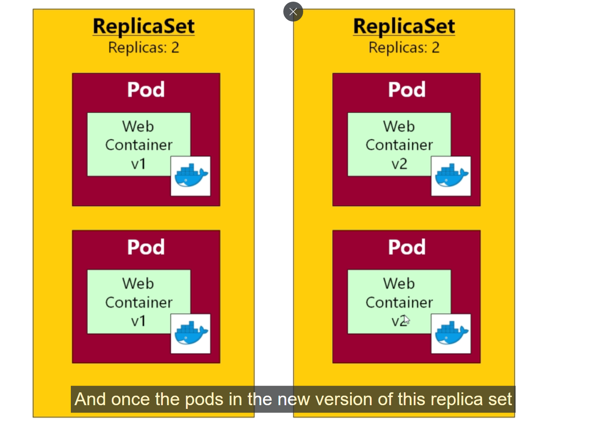
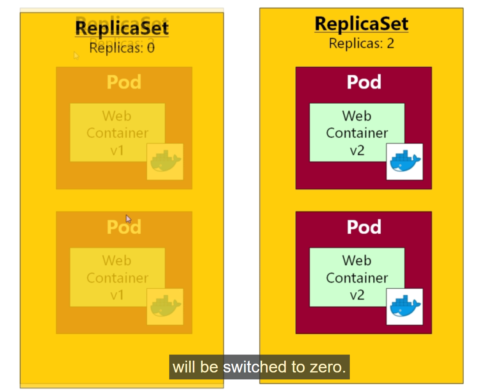

# Deployments in Kubernetes 

- last session we learnt that `How to handle POD using replica-set` , because mopst of the time we will not `Directly deploy the PODs onto the kubernetes cluster`

- as well as the `replica-set` we can use the `Deployment` in order to manage `PODs on the kubernetes cluster` which is also `prefered`

- in kubernetes `A Deployment is basically is more sophesticated form of replica-set` , which is `one more additional feature along with the replica-set`

- with the `Deployment` we got the `automatic rolling updates` with `Zero Down Time`

- we did the `rolling update` with the help of the `changing Service Selector block` based on the `changing the POD labels` which we have to do manually `for zero Downtime upgrade`

- but the `Deployments` are `more elegent` and we can `perform` also the `rollbacks` if `somethign goes wrong`

- if we go to the `Workload API` in [kubernetes 1.28 API one page guilde](https://kubernetes.io/docs/reference/generated/kubernetes-api/v1.28/#deployment-v1-apps)

- we are going to see the `Deployment YAML Definition` for the `Deployment` is same as `Replica-Set`

- apart from the `kind: Deployment` rest all the `blocks of the Deployment yml file` is same as replica set

- we can define the `Deployment` as below 

    
    ```yaml
        deployment.yml
        ==============
        apiVersion: apps/v1 # defining the apiVersionb as apps/v1 as it present in the apps group here
        kind: Deployment # defining the kind of kubernetes object as Deployment in this case
        metadata: # defining the name for the deployment
            # Unique key of the Deployment instance
            name: deployment-example
        spec: # defining the specification for the Deployment over here
            # 3 Pods should exist at all times.
            replicas: 3 # defining the number of replicas for the POD being 3
            
            selector: # defining the selector for the PODs to be spunned on
                matchLabels: 
                    app: nginx # defing the key value pair to be matched to the POD label
            
            template: # here we can define  the POD definition over here
                metadata: # defining the POD label which need to be selected
                    labels: # defining the label for the POD in key-value pair
                    # Apply this label to pods and default
                    # the Deployment label selector to this value
                    app: nginx
                
                spec: # defining the spec for the POD here
                    containers: # defining the container name and image for the POD
                        - name: nginx # defining the name of the POD which need to be spunned on
                          image: nginx:1.14 #defining the image for the container inside the POD

    
    ```

- the `yaml definition structure of thye Deployment` is exactly same as the `Structure of the yml for the replica-set` with only difference as `kind: Deployment`

- we can add some `additional field onto the Deployment yml definition` if we want to tune the `rolling updates` for the `Deployment`

- we can resue the `replica-set` YAML definition  over here for the `Deployment`  here as below 

- here we want to deploy the `webapp-container` POD `prototype` with the `tag as release0` over here to the `kubernetes cluster` ,then we want to perform the `Zero Downtime rolling updates for the Deployment` in here

- if we now a `kubectl get all` to fetch all the `kubernetes object inside the kubernetes cluster` then we can see now the
  
  - `replica-set`
  
  - `PODs`
  
  - `Service`  

- if we are trying to `delete the PODs that been tied to the replica set` then it will come back up as it has the `replicas: <no>` defined in its definition 

- now we can remove the `replica-set` that we have created using the command as `kubectl delete rs <replica-set name>` which will terminate the `corresponding POD` that been created through  it  

- we can see the below output in this case out in here 

    ```bash
        kubectl get all
        # fetching all kkubernetes object inside the kubernetes cluster
        NAME                          READY   STATUS    RESTARTS       AGE
        pod/queueapp                  1/1     Running   1 (125m ago)   131m
        pod/webapp-fc94r              1/1     Running   0              123m
        pod/webapp-xwscm              1/1     Running   0              123m

        NAME                        TYPE        CLUSTER-IP     EXTERNAL-IP   PORT(S)          AGE
        service/fleetman-queueapp   NodePort    10.97.37.84    <none>        8161:30010/TCP   124m
        service/fleetman-webapp     NodePort    10.103.74.42   <none>        80:30080/TCP     130m
        service/kubernetes          ClusterIP   10.96.0.1      <none>        443/TCP          4d21h


        NAME                     DESIRED   CURRENT   READY   AGE
        replicaset.apps/webapp   2         2         2       131m
        

        # we can delete the replica-set over here by using the kubectl delete rs <replica-set name> which will term inate the PODs as well
        kubectl delete rs webapp
        # using this we can remove the replica-set in this case 
        replicaset.apps/webapp  deleted

        # now when we do the kubectl get all to fetch all the kubernetes object inside the cluster then we can see the details as below
        kubectl get all
        
        NAME                          READY   STATUS    RESTARTS       AGE
        pod/queueapp                  1/1     Running   1 (125m ago)   131m

        NAME                        TYPE        CLUSTER-IP     EXTERNAL-IP   PORT(S)          AGE
        service/fleetman-queueapp   NodePort    10.97.37.84    <none>        8161:30010/TCP   124m
        service/fleetman-webapp     NodePort    10.103.74.42   <none>        80:30080/TCP     130m
        service/kubernetes          ClusterIP   10.96.0.1      <none>        443/TCP          4d21h
    
    ```

- we can define the `Deployment yml definition` for the `webapp` with `release:0` `tag` as below 

    ```yaml
        workloads.yml
        =============
        apiVersion: apps/v1 # defining the apiVersion for the Deployment as it lies under the apps group
        kind: Deployment # defining the kind of object as Deployment over here
        metadata: # defining the metadata sectiuon for Deployment name over here
            name: webapp
        spec: # defining the specification for the Deployment over here 
            replicas: 2 # defining the replicas of the POD we want from the Deployment
            selector: # defining the Selector with key-value pair as app: webapp here
                matchLabels:
                    app: webapp
            template: # defining the POD definition over here with the label info
                metadata: # metadata for the POD defined here
                    labels: # labels of key-value pair to be selected
                        app: webapp

                spec: # specification for the Container defined here
                    contianers: #container for the POD defined here
                        - image: richardchesterwood/k8s-fleetman-webapp-angular:release0 # defining the container image over here
                           name: webapp # defining the container name over here
        
        --- # using the document separator defining the another POD with Deployment

        apiVersion: v1 # defining the POD apiVerison in this case
        kind: Pod # defining the kind of kubernetes object as POD here 
        metadata: # defining thw name and label for the queueapp POD
            name: queueapp
            labels:
                app: queueapp
        spec: # defining the specification for the POD in here
            containers: # defining the container that need to reside inside the POD in kubernetes
                - name: queueapp # defining the containers name in this particular case
                  image: richardchesterwood/k8s-fleetman-queue:release1 # images for the container POD


    ```

- we will also be upgrading the `pod/queueapp` to the `part of replica-set` as well as a part of `Microservice architecture`

- we can apply the changes using the command as `kubectl apply -f <definition file>` as below 


    ```bash
        kubectl apply -f workloads.yaml
        # here we are applying the changes and deployng the Deployment in this case out in here 
        # we can see the below output in this case
        deployment.apps "webapp" created
        pod "queueapp" unchanged

        #now when we try to access the web-browser in the cluster ip of minikube and do a hard refresh we can see the previous version of webapp where only map been showing up
        minikube ip
        # below will eb the output in that case
        192.168.49.2

        # now when we access the web-browser then we can see the output as below 
        http://192.168.49.2:30080
        # we can access the webappwith the map prototype because of the container version inside POD


        #if we want to see the all kubernetes object then we can see the output as below
        kubectl get all
        # fetching all the object inside the kubernetes cluster
        NAME                          READY   STATUS    RESTARTS       AGE
        pod/queueapp                  1/1     Running   1 (149m ago)   155m
        pod/webapp-7f58455867-fc94r   1/1     Running   0              147m
        pod/webapp-7f58455867-xwscm   1/1     Running   0              147m

        NAME                        TYPE        CLUSTER-IP     EXTERNAL-IP   PORT(S)          AGE
        service/fleetman-queueapp   NodePort    10.97.37.84    <none>        8161:30010/TCP   148m
        service/fleetman-webapp     NodePort    10.103.74.42   <none>        80:30080/TCP     154m
        service/kubernetes          ClusterIP   10.96.0.1      <none>        443/TCP          4d22h

        NAME                     READY   UP-TO-DATE   AVAILABLE   AGE
        deployment.apps/webapp   2/2     2            2           155m

        NAME                                DESIRED   CURRENT   READY   AGE
        replicaset.apps/webapp-76db76b84f   2         2         2       155m 

    
    ```

- here we can see that `Deployment` will going to create a `Corresponding Replica Set` in this case out in here 

- we can consider the `Deployment` is an `entity` in `Kubernetes` which `manages` the `replica-set` for you

- hence we don't have to deal with the `Deployment` rather than `creating replica-set` directly on the `Kubernetes cluster` which will handle management of the `replica-set`

- when `Deployment` create the `Relica-Set` then it will create the `replica-set` with the `name` as `<Deployment Name>-<random alphanumeric string>` and this `replica-set` will handle the `PODs` hence the name of the became `<Deployment name>-<random alphanumeric string of the replica-set>-<random alphanumeric string>`

- when we are `updating the Deployment` then it will going to `create and destroy new replica-set` which in turn `create and destroy the PODs` and hence in order to manage the `replica-set` individually then we need to define the `replica-set` with `random string with prefix along with Deployment name`

- the `replica-set` also need to `create and destroy the PODs in order to manage` hence we need to `uniquely define that also with the random string as well in that case`

### How to Do a Rolling update in a Deployment with Fiddle around manually updating the POD label and Service Selector

- when we work with the `New container image` for updating the `Application` , when we make `changes` to the `image` inside the `Kubernetes Deployment yaml definition` and `redeploy` the changes then it will `create a new Replica Set` with the `updated image that been provided into it and spun the container as well`

- once the `replica-set` created those `PODs with new image and PODs are ready and avaiable` then `Deployment` will `shutdown the Existing the PODs inside the existing replica-set` and bring the `replicas count to 0 ` , but the `existing replica-set will be there but with no PODs or replicas as 0` , this will be helpful in case we want to `rollback the changes` if the `New PODs not working as expected inside the Deployment` then we can resurect the `old replica-set` with the `number of replicas as 2 back again`

-  &rarr; 

- but `here in this case if we want to update the webapp-container to the release0-5 tag` then `we can do that by changing the image of the container inside the deployment as below`  

- we can also add the `additional fields` onto the `Deployment Definition yml file` as well

- we can add something as `minReadySeconds`  which been present in `DeploymentSpec` i.e `spec` section inside the `kubernetes API overview under the workload section/Deployment V1`

- `minReadySeconds` is `Minimum number of seconds for which a newly created pod should be ready without any of its container crashing i.e make the PODs avialable from ready state`

- by default the `minReadySeconds` to `0 second` , but we can `make it to 30 seconds` if we want those changes `if we want to see the rolling update better way`

- if we are not setting the `minReadySeconds` then the `new-replica set will created very fastt also the old replica set will be scaled down as well quickly`

- we can visualize the `replica-set getting created underneath each POD will be created (Depending on the number of replicas) but with a minReadySeconds time`

- we can do that by as below 

    
    ```yaml
        workloads.yml
        =============
        apiVersion: apps/v1 # defining the apiVersion for the Deployment as it lies under the apps group
        kind: Deployment # defining the kind of object as Deployment over here
        metadata: # defining the metadata sectiuon for Deployment name over here
            name: webapp
        spec: # defining the specification for the Deployment over here 
            minReadySeconds: 30 # defining the minReadySeconds as 30 sec in this case out in here
            replicas: 2 # defining the replicas of the POD we want from the Deployment
            selector: # defining the Selector with key-value pair as app: webapp here
                matchLabels:
                    app: webapp
            template: # defining the POD definition over here with the label info
                metadata: # metadata for the POD defined here
                    labels: # labels of key-value pair to be selected
                        app: webapp

                spec: # specification for the Container defined here
                    contianers: #container for the POD defined here
                        - image: richardchesterwood/k8s-fleetman-webapp-angular:release0 # defining the container image over here
                           name: webapp # defining the container name over here
        
        --- # using the document separator defining the another POD with Deployment

        apiVersion: v1 # defining the POD apiVerison in this case
        kind: Pod # defining the kind of kubernetes object as POD here 
        metadata: # defining thw name and label for the queueapp POD
            name: queueapp
            labels:
                app: queueapp
        spec: # defining the specification for the POD in here
            containers: # defining the container that need to reside inside the POD in kubernetes
                - name: queueapp # defining the containers name in this particular case
                  image: richardchesterwood/k8s-fleetman-queue:release1 # images for the container POD
    
    ```

- we can apply those changes using the command as `kubectl apply -f <Definition file>` and we can also see the `behaviour` by using the command as `kubectl get all` command constantly and if we `do a hard refresh on the webpage then we can see without zero downtime the application been updated`

- we can do that as below 

    ```bash
        kubectl apply -f workloads.yml
        # applying the changes and Deploying the deployment for the rolling update in this case out in here
        # we can see the below changes
        deployment.apps "webapp" created
        pod "queueapp" unchanged    

        # we need no changes in the services.yml file     


        #now when we do the kubectl get all we can see the below output
        kubectl get all
        #checking the kubernetes object inside the kubernetes cluster
        NAME                          READY   STATUS    RESTARTS       AGE
        pod/queueapp                  1/1     Running   1 (149m ago)   155m
        pod/webapp-7f58455867-fc94r   1/1     Running   0              147m
        pod/webapp-7f58455867-xwscm   1/1     Running   0              147m

        NAME                        TYPE        CLUSTER-IP     EXTERNAL-IP   PORT(S)          AGE
        service/fleetman-queueapp   NodePort    10.97.37.84    <none>        8161:30010/TCP   148m
        service/fleetman-webapp     NodePort    10.103.74.42   <none>        80:30080/TCP     154m
        service/kubernetes          ClusterIP   10.96.0.1      <none>        443/TCP          4d22h

        NAME                     READY   UP-TO-DATE   AVAILABLE   AGE
        deployment.apps/webapp   2/2     2            2           155m

        NAME                                DESIRED   CURRENT   READY   AGE
        replicaset.apps/webapp-76db76b84f   2         2         2       155m
        replicaset.apps/webapp-7f58455867   1         1         1       147m
            
        #after 30 seconds
        #now when we do the kubectl get all we can see the below output
        kubectl get all
        #checking the kubernetes object inside the kubernetes cluster
        NAME                          READY   STATUS    RESTARTS       AGE
        pod/queueapp                  1/1     Running   1 (149m ago)   155m
        pod/webapp-7f58455867-fc94r   1/1     Running   0              147m
        pod/webapp-7f58455867-xwscm   1/1     Running   0              147m

        NAME                        TYPE        CLUSTER-IP     EXTERNAL-IP   PORT(S)          AGE
        service/fleetman-queueapp   NodePort    10.97.37.84    <none>        8161:30010/TCP   148m
        service/fleetman-webapp     NodePort    10.103.74.42   <none>        80:30080/TCP     154m
        service/kubernetes          ClusterIP   10.96.0.1      <none>        443/TCP          4d22h

        NAME                     READY   UP-TO-DATE   AVAILABLE   AGE
        deployment.apps/webapp   2/2     2            2           155m

        NAME                                DESIRED   CURRENT   READY   AGE
        replicaset.apps/webapp-76db76b84f   1         1         1       155m
        replicaset.apps/webapp-7f58455867   2         2         2       147m
    
        #after 30 seconds
        #now when we do the kubectl get all we can see the below output
        kubectl get all
        #checking the kubernetes object inside the kubernetes cluster
        NAME                          READY   STATUS    RESTARTS       AGE
        pod/queueapp                  1/1     Running   1 (149m ago)   155m
        pod/webapp-7f58455867-fc94r   1/1     Running   0              147m
        pod/webapp-7f58455867-xwscm   1/1     Running   0              147m

        NAME                        TYPE        CLUSTER-IP     EXTERNAL-IP   PORT(S)          AGE
        service/fleetman-queueapp   NodePort    10.97.37.84    <none>        8161:30010/TCP   148m
        service/fleetman-webapp     NodePort    10.103.74.42   <none>        80:30080/TCP     154m
        service/kubernetes          ClusterIP   10.96.0.1      <none>        443/TCP          4d22h

        NAME                     READY   UP-TO-DATE   AVAILABLE   AGE
        deployment.apps/webapp   2/2     2            2           155m

        NAME                                DESIRED   CURRENT   READY   AGE
        replicaset.apps/webapp-76db76b84f   0         0         0       155m
        replicaset.apps/webapp-7f58455867   2         2         2       147m

        #NOW WHEN WE ACCESS THE MINIKUBE IP AS  
        minikube ip
        # showing the minikube ip
        # below will eb the output in that case
        192.168.49.2

        # now when we access the web-browser then we can see the output as below 
        http://192.168.49.2:30080
        # we can access the webappwith the map with app menu prototype because of the container version inside POD


    ```
- we can use `Deployment for web-container POD as well as the microservice POD as well` so that we can make sure `one of the POD always responding to the Service request`

- we can `rollout upgrade for the Deployment` then we can perform something as below using the `kubectl rollout status deployment/deploy <deployment name>`

    ```bash
        
        kubectl rollout status deployment <name of the deployment>
        # THIS WILL SHOW THE STATUS OF THE ROLLING UPDATES FOR THE DEPLOYMENT
        # Or we can use it as below in this case
        kubectl rollout status deploy <name of the deployment>


        # for example we can see the rollout update status using the command as 
        kubectl rollout status deploy webapp
        # this will provide output as below
        deployment "webapp" successfully rolled out    
    
    ```

- this will show the `current deployment status that we are doing` when we are performing the `rolling updates`

- if we want to try this `kubectl rollout status deploy <deployment name>` then we need to perform a `manual rollback` again back to the `release0` for the `webapp`

- we can do that by changing the `workloads.yml` file as

    
    ```yaml
        workloads.yml
        =============
        apiVersion: apps/v1 # defining the apiVersion over here
        kind: Deployment # here the kubernetes object is of type Deployment in here
        metadata: # defining the metadata for the Deployment over here
            name: webapp
        spec:
            minReadySeconds: 30 # here we are defining the minimum time for the POD before marking it as available from ready 
            replicas: 2 # defining the number of replica in this case out in here
            
            selector: # defining the Selector for the Selecting POD in this case out in here
                matchLabels: # defining the POD label that need to be matched with the key value pair
                    app: webapp
            
            template: # defining POD definition over here
                metadata: # defining the POD label in key value pair to be selected from the Selector of the Deployment through replica-set
                    labels:
                        app: webapp

                spec: # specification for the PODs
                    containers: # defining the containers for the Deployments PODs
                        - name: webapp # providing the name of the container as webapp in here
                          image: richardchesterwood/k8s-fleetman-webapp-angular:release0 # changing the image back to the release0 tag for prototype
        
        --- # defining the Document separator for the Defining the queueapp POD and separate from the Deployment definition
        
        apiVersion: v1 # defining the apiVersion as v1 over here
        kind: Pod # here the kubernetes object type is of POD
        metadata: # defining the name and label key value pair for the POD over here
            name: queueapp
            labels: # defining the POD label in the key value format
                app: queueapp
        spec: # specification for the POD been defined in here
            containers:
                - name: queueapp # defining the name of the kubernetes POD container
                  image: richardchesterwood/k8s-fleetman-queue:release1 # defining the image for the POD over here
    
    
    ```

- now we can apply those changes by making it as `kubectl apply -f <Definition yml file>` and check the `Deployment Rollout status` by using the `kubectl rollout status deploy <Deployment name>`

- we can see the output as below 

    
    ```bash
        kubectl apply -f workloads.yml
        # applying the changes by using the command as kubectl apply -f workloads.yml
        # here we can see the output as below
        deployment.apps/webapp configured
        pod/queueapp unchanged
    
        #now we can see the rollout status for the Deployment as below 
        kubectl rollout status deploy webapp
        # it will hold the terminal untill the rollout happens and provide interactive instruction for the same 
        # if we want to come out then we want to perform the ctrl+C
        # here below will be the output in this case
        Waiting for deployment "webapp" rollout to finish: 1 out of 2 new replicas have been updated...
        Waiting for deployment "webapp" rollout to finish: 1 out of 2 new replicas have been updated...
        Waiting for deployment "webapp" rollout to finish: 1 out of 2 new replicas have been updated...
        Waiting for deployment "webapp" rollout to finish: 1 old replicas are pending termination...
        Waiting for deployment "webapp" rollout to finish: 1 old replicas are pending termination...
        Waiting for deployment "webapp" rollout to finish: 1 old replicas are pending termination...
        deployment "webapp" successfully rolled out

        # now if we do a minikube ip to get the IP address of the cluster
        minikube ip
        # this will provide the below response
        192.168.49.2

        # now when we access the nodePort 30080 along with the cluster ip then we will get the response as below
        http://192.168.49.2:30080
        # here we can see the preveious release0 version where we can see the prototype Map by using ctrl+f5
        
        # important:- 
        #now if we want to fetch all the kubernetes object inside the kubernetes minikube cluster we will get the output as below 
        # here kubernetes is smart enough to fetch that alredy the Kubernetes replica-set present with 0 replicas of POD for the release0 tags which we updated last time
        # hence it will going to reuse that replica set as well and based on that we can see the Same Changes in the POD as well 
        # the release0-5 tag POD  will going to scaled down to 0 but it will replica-set will be still there
        # Deployment have last 10 replica-set whether thats been updated or rolled out 
        pod/queueapp                  1/1     Running   2 (80m ago)   16h
        pod/webapp-76db76b84f-9p9s7   1/1     Running   0             2m37s
        pod/webapp-76db76b84f-sv2rj   1/1     Running   0             2m6s

        NAME                        TYPE        CLUSTER-IP     EXTERNAL-IP   PORT(S)          AGE
        service/fleetman-queueapp   NodePort    10.97.37.84    <none>        8161:30010/TCP   16h
        service/fleetman-webapp     NodePort    10.103.74.42   <none>        80:30080/TCP     16h
        service/kubernetes          ClusterIP   10.96.0.1      <none>        443/TCP          5d11h

        NAME                     READY   UP-TO-DATE   AVAILABLE   AGE
        deployment.apps/webapp   2/2     2            2           16h

        NAME                                DESIRED   CURRENT   READY   AGE
        replicaset.apps/webapp-76db76b84f   2         2         2       16h
        replicaset.apps/webapp-7f58455867   0         0         0       16h
            

    ```

- But there is a `build-in rollback feature avialble` rather than doing the `manual rollback  doing inside the yml file that we are trying to do here`

- we can do that using the `kubectl rollout` command as below

    
    ```bash
        kubectl rollout history deploy webapp
        # using this command we can fetch the version of the yml file and the Deployment version as well 
        # this will provide the response as below 
        deployment.apps/webapp 
        REVISION  CHANGE-CAUSE
        2         <none>
        3         <none>

        # here the REVESION 3 means we have the release0 which we have manually rolled back now on the yml file
        # REVESION 2 means we have the release0-5 we have that version set out in here
        # if we want to fallback to that revesion then we can do that as below 
        kubectl rollout undo deploy webapp --to-revision=2
        # here we don't have to change the underlying YAML file in this case out in here
        # here we are saying kubernetes that we want to rollback to Version 2 which will be release0-5 version
        # here as we are currently on the REVESION 3 currently we can tell explicitly to go back to the REVESION 2 here
        # by default when we use the undo subcommand it will go back to one REVESION earlier i.e 2 without specifying the --to-revision=2 
        
        # this will provide the output as below
        deployment.apps/webapp rolled back

        #now if we want to check the status we can use the kubectl rollout status deploy <Deployment name > here
        kubectl rollout status deploy webapp
        # we can see the output as below
        deployment "webapp" successfully rolled out
    
        # now if we do a minikube ip to get the IP address of the cluster
        minikube ip
        # this will provide the below response
        192.168.49.2

        # now when we access the nodePort 30080 along with the cluster ip then we will get the response as below
        http://192.168.49.2:30080
        # here we can see the preveious release0-5 version where we can see the prototype Map by using ctrl+f5

        
        #when we now do a kubectl rollout history deploy <deployment name> then we can see that lastest REVESION been changed
        kubectl rollout history deploy webapp
        # fetching the history as webapp in this case over here
        # below will br the output for the same
        deployment.apps/webapp 
        REVISION  CHANGE-CAUSE
        3         <none> # which is for the release0 Tag
        4         <none> # same as REVESION:2 which was preveiously there for release0-5


        #now if we want to see all kubernetes object inside the kubenetes cluster then we can see the below details
        kubectl get all
        # fetching all the object inside the cluster as below
        # kubernetes is smart enough to know that there is an unused replica-set which preveiously used for release0-5
        # hence it will going to reuse that and PODs also going to spun accordingly
        # hence as we are only going forward and backword with the release Tag hence we can see the replica-set been reused and the REVESION have only 2 version when we do the 
        # kubectl rollout history deploy <deployment> showing only 2 REVESION based on the replica-set we are creating or reusing

        NAME                          READY   STATUS    RESTARTS       AGE
        pod/queueapp                  1/1     Running   2 (116m ago)   16h
        pod/webapp-7f58455867-bnhb5   1/1     Running   0              5m46s
        pod/webapp-7f58455867-nfqnt   1/1     Running   0              6m17s

        NAME                        TYPE        CLUSTER-IP     EXTERNAL-IP   PORT(S)          AGE
        service/fleetman-queueapp   NodePort    10.97.37.84    <none>        8161:30010/TCP   16h
        service/fleetman-webapp     NodePort    10.103.74.42   <none>        80:30080/TCP     16h
        service/kubernetes          ClusterIP   10.96.0.1      <none>        443/TCP          5d12h

        NAME                     READY   UP-TO-DATE   AVAILABLE   AGE
        deployment.apps/webapp   2/2     2            2           16h

        NAME                                DESIRED   CURRENT   READY   AGE
        replicaset.apps/webapp-76db76b84f   0         0         0       16h # which managing the release-0
        replicaset.apps/webapp-7f58455867   2         2         2       16h # which managing the release0-5 here
        
        
        
        #imp:-
        # here we now have the yml file with the Different tag version release0 as we have done the build in rollback and the services point to  tag version release0-5
        # here we can see that there is mismatch between the yml and services
        

    ```

- the `Definition of YML file` should describe the `exact state of the kubernetes system` i.e `whats been running on the live kubernetes system`

- hence this `kubernetes rollout` command should be only in case of `emergency` , if something gone wrong while performing the `Rolling update to the Deployment` then we can performt these `kubernetes rollout` command that we have discussed above

- if we are doing the `built-in rollback` using the `kubernetes rollout undo deploy <deployment name>` then we need to fix the `YML file` as the next task 

- if we have the `New PODs` inside the `Deployment` while performing the `rolling upgrade` there is a `Problem while spinning new POD through the Replica-set` then at that time `Preveious POD ran through older replica-set` will still be there untill the `new PODs spunned and ready` untill then `that OLD pod created by old replica-set can seve the service request`

- only the `new PODs` are `available or healty` then only the `Previous POD spunned by preveious replica-set` will going to `scale down`

- we can demo that using the below example by `knowingly provide unknow Tag version of the image here`

    
    ```yaml
        workloads.yml
        =============
        workloads.yml
        =============
        apiVersion: apps/v1 # defining the apiVersion over here
        kind: Deployment # here the kubernetes object is of type Deployment in here
        metadata: # defining the metadata for the Deployment over here
            name: webapp
        spec:
            minReadySeconds: 30 # here we are defining the minimum time for the POD before marking it as available from ready 
            replicas: 2 # defining the number of replica in this case out in here
            
            selector: # defining the Selector for the Selecting POD in this case out in here
                matchLabels: # defining the POD label that need to be matched with the key value pair
                    app: webapp
            
            template: # defining POD definition over here
                metadata: # defining the POD label in key value pair to be selected from the Selector of the Deployment through replica-set
                    labels:
                        app: webapp

                spec: # specification for the PODs
                    containers: # defining the containers for the Deployments PODs
                        - name: webapp # providing the name of the container as webapp in here
                          image: richardchesterwood/k8s-fleetman-webapp-angular:releaseDNE0 # changing the image back to the releaseDNE0 tag for prototype which does not exist hence this new POD can't be spunned by the Replica-set
        
        --- # defining the Document separator for the Defining the queueapp POD and separate from the Deployment definition
        
        apiVersion: v1 # defining the apiVersion as v1 over here
        kind: Pod # here the kubernetes object type is of POD
        metadata: # defining the name and label key value pair for the POD over here
            name: queueapp
            labels: # defining the POD label in the key value format
                app: queueapp
        spec: # specification for the POD been defined in here
            containers:
                - name: queueapp # defining the name of the kubernetes POD container
                  image: richardchesterwood/k8s-fleetman-queue:release1 # defining the image for the POD over here
    
    
    ```

- now when we perform the `deploying the changes using the apply command here` then we will get the out output in this case as below 

    
    ```bash
        kubectl apply -f workloads.yml
        #deploying the changes using the apply command here
        deployment.apps/webapp configured
        pod/queueapp unchanged
            
        # now when we perform the kubectl command to see all the kubernetes object 
        kubectl get all
        # fetching the kubernetes object in this case out here
        NAME                          READY   STATUS             RESTARTS       AGE
        pod/queueapp                  1/1     Running            2 (147m ago)   17h
        pod/webapp-7f58455867-bnhb5   1/1     Running            0              35m # preveious POD created through the preveious-replica set been running
        pod/webapp-7f58455867-nfqnt   1/1     Running            0              36m # preveious POD created through the preveious-replica set been running
        pod/webapp-868c45864d-tjlp6   0/1     ImagePullBackOff   0              4m28s # here we can see that POD are getting the error as ImagePullBackOff

        NAME                        TYPE        CLUSTER-IP     EXTERNAL-IP   PORT(S)          AGE
        service/fleetman-queueapp   NodePort    10.97.37.84    <none>        8161:30010/TCP   17h
        service/fleetman-webapp     NodePort    10.103.74.42   <none>        80:30080/TCP     17h
        service/kubernetes          ClusterIP   10.96.0.1      <none>        443/TCP          5d13h

        NAME                     READY   UP-TO-DATE   AVAILABLE   AGE
        deployment.apps/webapp   2/2     1            2           17h

        NAME                                DESIRED   CURRENT   READY   AGE
        replicaset.apps/webapp-76db76b84f   0         0         0       17h
        replicaset.apps/webapp-7f58455867   2         2         2       17h # we can see that preveious replica-set still running as well corresponding POD as well
        replicaset.apps/webapp-868c45864d   1         1         0       4m28s # here we can see that new replica-set getting created to spin the POD image
        # here we can also see the DESRIRED and CURRENT  status showing as 1 but the READY will still be 0 means there is problem while this new replica-set creating the new POD

        # while creating the POD we can see the status as ImagePullBackOff which means while pulloing the image there were some problem as the Tag is not valid
        # it might be because the Registry been down and Image been wrong
        # it will put it to the Infinity Loop and trying to pull the image on regular interval
        # this is helpful because there might be some network problem hence loop will help pulling it down on regular interval rather than doing it only one time

        #but if we access the minikube ip as below
        # now if we do a minikube ip to get the IP address of the cluster
        minikube ip
        # this will provide the below response
        192.168.49.2

        # now when we access the nodePort 30080 along with the cluster ip then we will get the response as below
        http://192.168.49.2:30080
        # here we can see the preveious release0-5 version where we can see the prototype Map by using ctrl+f5

        # if we want to see the problem happens to the kubernetes POD then we can see as below
        kubectl describe pod webapp-868c45864d-tjlp6
        # fetching the kubernetes pd version in here 
        Name:             webapp-868c45864d-tjlp6
        Namespace:        default
        Priority:         0
        Service Account:  default
        Node:             minikube/192.168.49.2
        Start Time:       Tue, 26 Dec 2023 15:24:13 +0530
        Labels:           app=webapp
                        pod-template-hash=868c45864d
        Annotations:      <none>
        Status:           Pending
        IP:               10.244.0.46
        IPs:
        IP:           10.244.0.46
        Controlled By:  ReplicaSet/webapp-868c45864d
        Containers:
        webapp:
            Container ID:   
            Image:          richardchesterwood/k8s-fleetman-webapp-angular:releaseDNE0
            Image ID:       
            Port:           <none>
            Host Port:      <none>
            State:          Waiting
            Reason:       ImagePullBackOff
            Ready:          False
            Restart Count:  0
            Environment:    <none>
            Mounts:
            /var/run/secrets/kubernetes.io/serviceaccount from kube-api-access-4t8fm (ro)
        Conditions:
        Type              Status
        Initialized       True 
        Ready             False 
        ContainersReady   False 
        PodScheduled      True 
        Volumes:
        kube-api-access-4t8fm:
            Type:                    Projected (a volume that contains injected data from multiple sources)
            TokenExpirationSeconds:  3607
            ConfigMapName:           kube-root-ca.crt
            ConfigMapOptional:       <nil>
            DownwardAPI:             true
        QoS Class:                   BestEffort
        Node-Selectors:              <none>
        Tolerations:                 node.kubernetes.io/not-ready:NoExecute op=Exists for 300s
                                    node.kubernetes.io/unreachable:NoExecute op=Exists for 300s
        Events:
        Type     Reason     Age                    From               Message
        ----     ------     ----                   ----               -------
        Normal   Scheduled  10m                    default-scheduler  Successfully assigned default/webapp-868c45864d-tjlp6 to minikube
        Normal   Pulling    7m52s (x4 over 10m)    kubelet            Pulling image "richardchesterwood/k8s-fleetman-webapp-angular:releaseDNE0"
        Warning  Failed     7m38s (x4 over 9m49s)  kubelet            Failed to pull image "richardchesterwood/k8s-fleetman-webapp-angular:releaseDNE0": Error response from daemon: manifest for richardchesterwood/k8s-fleetman-webapp-angular:releaseDNE0 not found: manifest unknown: manifest unknown
        Warning  Failed     7m38s (x4 over 9m49s)  kubelet            Error: ErrImagePull
        Warning  Failed     7m24s (x6 over 9m49s)  kubelet            Error: ImagePullBackOff
        Normal   BackOff    5m2s (x15 over 9m49s)  kubelet            Back-off pulling image "richardchesterwood/k8s-fleetman-webapp-angular:releaseDNE0"

    
    ```
- we need to `check whether the POD image` which been used it `correct or not`

- if we are going to fix the `Deployment definition` as reference to the `correct Tag version` such as `release0-5 ` then we can below output 

- we can perform below action for the same 

    ```yaml
        workloads.yml
        =============
        apiVersion: apps/v1 # defining the apiVersion over here
        kind: Deployment # here the kubernetes object is of type Deployment in here
        metadata: # defining the metadata for the Deployment over here
            name: webapp
        spec:
            # removing the minReadySeconds over here cause causing delay over here
            replicas: 2 # defining the number of replica in this case out in here
            
            selector: # defining the Selector for the Selecting POD in this case out in here
                matchLabels: # defining the POD label that need to be matched with the key value pair
                    app: webapp
            
            template: # defining POD definition over here
                metadata: # defining the POD label in key value pair to be selected from the Selector of the Deployment through replica-set
                    labels:
                        app: webapp

                spec: # specification for the PODs
                    containers: # defining the containers for the Deployments PODs
                        - name: webapp # providing the name of the container as webapp in here
                          image: richardchesterwood/k8s-fleetman-webapp-angular:releaseDNE0 # changing the image back to the release0-5 which will reuse the replica set if there are already associated to it
        
        --- # defining the Document separator for the Defining the queueapp POD and separate from the Deployment definition
        
        apiVersion: v1 # defining the apiVersion as v1 over here
        kind: Pod # here the kubernetes object type is of POD
        metadata: # defining the name and label key value pair for the POD over here
            name: queueapp
            labels: # defining the POD label in the key value format
                app: queueapp
        spec: # specification for the POD been defined in here
            containers:
                - name: queueapp # defining the name of the kubernetes POD container
                  image: richardchesterwood/k8s-fleetman-queue:release1 # defining the image for the POD over here
    
    ```

- we can perform these `deploy changes` by using the command as below

    ```bash
        kubectl apply -f workloads.yml
        #deploying the changes using the apply command here
        deployment.apps/webapp configured
        pod/queueapp unchanged

        #now if we want to see the changes we can kubernetes object inside kubernetes cluster as below
        kubectl get all
        # we can see the below outpout 
        NAME                          READY   STATUS    RESTARTS       AGE
        pod/queueapp                  1/1     Running   2 (157m ago)   17h
        pod/webapp-7f58455867-bnhb5   1/1     Running   0              46m
        pod/webapp-7f58455867-nfqnt   1/1     Running   0              47m
        # here we can see the POD which has issue now being Terminated

        NAME                        TYPE        CLUSTER-IP     EXTERNAL-IP   PORT(S)          AGE
        service/fleetman-queueapp   NodePort    10.97.37.84    <none>        8161:30010/TCP   17h
        service/fleetman-webapp     NodePort    10.103.74.42   <none>        80:30080/TCP     17h
        service/kubernetes          ClusterIP   10.96.0.1      <none>        443/TCP          5d13h

        NAME                     READY   UP-TO-DATE   AVAILABLE   AGE
        deployment.apps/webapp   2/2     2            2           17h

        NAME                                DESIRED   CURRENT   READY   AGE
        replicaset.apps/webapp-76db76b84f   0         0         0       17h
        replicaset.apps/webapp-7f58455867   2         2         2       17h # old replica-set made to use ehich refer to the release0-5
        replicaset.apps/webapp-868c45864d   0         0         0       15m # we can see that preveious wrong POD config repliuca set still there but scale down to replicas as 0


    
        # now if we do a minikube ip to get the IP address of the cluster
        minikube ip
        # this will provide the below response
        192.168.49.2

        # now when we access the nodePort 30080 along with the cluster ip then we will get the response as below
        http://192.168.49.2:30080
        # here we can see the preveious release0-5 version where we can see the prototype Map by using ctrl+f5
    
    ```

- as we know the `Deployment` will going to keep `last 10 replica-set` hence we can see the `faulty unhealthy replica-set which been scaled down still be there` , if we want , then we can `remove it manually` using the `kubectl delete rs <replica-set>`