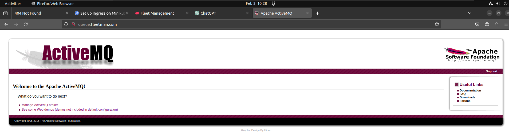

# adding More Routes for the Ingress Control in kubernetes 

- we have the basic `ingress controller` set up , benifit we will be getting as `even though` we are running `minikube` , we still can access the `application using the domain name` in this case

- Even though we have `cheated` to make that `work` , but still we don't have to use the `ugly nodeport` to access the `kubernetes service` in that case

- the `real reason` behind using the `ingress controller` because we want to expose `multiple services from our minikube kubernetes cluster`

- here we want to `access the activeMQ kubernetes service admin console` as well in this case 

- we can do that `defining a new host rule` in the `ingress.yml` file as below 

    
    ```yaml
        ingress.yml
        ===========
        apiVersion: networking.k8s.io/v1 # defining the apiVersion as networking.k8s.io/v1
        kind: Ingress # defining the type of kubernetes object as Ingress in this case
        metadata: # defining the name for the ingress service in this case over here
            name: basic-routing
        spec: # defining the specification for the ingress rule in here
            rules: # definign the routing rules in this case over here
                - host: fleetman.com  # defining the hostname as fleetman.com which we have defined in the /etc/hosts file
                  http:
                    paths: # defining the all the end points as the paths in here for the domain name as hosts
                      - path: / # defining the endpoint as path here
                        pathType: Prefix # defining the pathType as Prefix in this case
                        backend: # defining the backend for the ingress controller
                            service: # here the backend for the ingress controller will be as service
                                name: fleet-webapp # defining the name of the service to which we want to point to 
                            port: # pointing to the internal Port of the kubernetes Service to redirect to 
                                name: 80 # pointing to internal Port 80 for fleetman-webapp service

                - host: queue.fleetman.com # defining another hostname as fleetman.com which we have defined in the /etc/hosts file
                  # here in the professional cluster we need to add that to the `route 53` host domain name in that case
                  http:
                    paths:
                    -   path: /admmin
                        pathType: Prefix # defining the pathType as Prefix in this case
                        backend: # defining the backend for the ingress controller
                            service: # here the backend for the ingress controller will be as service
                                name: fleetman-queue #pointing to the queue service in here as fleetman-queue
                            port: # defining the internal port of the admin in here 
                                number: 8161 # pointing to the internal Port of the  fleetman-queue service


    ```

- we can goto the `/etc/hosts` file in `linux/macOS` or `C:\Windows\system32\drivers\etc\hosts` in `windows` through `running the cmd on the administrator mode`

- then we can edit the `/etc/hosts` we can edit the file as below 

    ```bash
        sudo nano /etc/hosts
        # editing the /etc/hosts as below 
        127.0.0.1	localhost
        127.0.1.1	pratik-virtual-machine
        192.168.49.2 fleetman.com # here we have define the fleetman.com for the minikube ip address
        # then we are using the http://fleetman.com then it will redirect to the minikube ip on port 80
        # as we have already redirected the minikube IP port 80 to our service hence our service will be going to show up


        192.168.49.2  queue.fleetman.com  # here we have define the queue.fleetman.com for the minikube ip address
        # then we are using the http://admin.fleetman.com then it will redirect to the minikube ip on port 8161 which associated with the fleetman-queue service
        # as we have already redirected the minikube IP port 8161 to our service hence our service will be going to show up
        
        # The following lines are desirable for IPv6 capable hosts
        ::1     ip6-localhost ip6-loopback
        fe00::0 ip6-localnet
        ff00::0 ip6-mcastprefix
        ff02::1 ip6-allnodes
        ff02::2 ip6-allrouters

    ```

- we can `deploy the changes into the minikube kubernetes cluster` by applying the changes as below 

    ```bash
        kubectl apply  -f ingress.yml
        # applying the changes and deploying to the minikube kubernetes cluster
        # the output will be as below
        ingress.networking.k8s.io/basic-routing configured

    ```

- these `ingress changes` are `instantenious` which will going to happen `within 30 sec of apply`

- here now we can see the `ingress details`  as below 

    ```bash
        kubectl describe ingress/ing basic-routing
        # fetching all the ingress details in this case here
        Name:             basic-routing
        Labels:           <none>
        Namespace:        default
        Address:          192.168.49.2
        Ingress Class:    nginx
        Default backend:  <default>
        Rules:
        Host                Path  Backends
        ----                ----  --------
        fleetman.com        
                            /   fleetman-webapp:80 (10.244.0.43:80)
        queue.fleetman.com  
                            /   fleetman-queue:8161 (10.244.0.40:8161)
        Annotations:          <none>
        Events:
        Type    Reason  Age                From                      Message
        ----    ------  ----               ----                      -------
        Normal  Sync    35s (x3 over 86m)  nginx-ingress-controller  Scheduled for sync


    ```

- now if we goto the `http://queue.fleetman.com` then we can see the outcome as below 

- 

- we can setup `different rules/roots` that we can setup using the `ingress controller`

- we can see the `official docs for the same` as [Ingress controller User Guide](https://kubernetes.github.io/ingress-nginx/)

- we can use different `ingress controller` , but the one that we are currenly working with being `ingress-nxinx controller`

- we can do such as below using the `template` in `nginx ingress controller`

    - how to `serve` a `custom error` using the `ingress controller`
    
    - how to server the `custom header` using the `ingress controller`
    
    - how to `rewrite the rules` using the `ingress controller`
    
    - how to do `BasicAuthentication` using the `ingress controller` 
  
- we want the user to `access` the `fleetman web application frontend` , but we want to `protect the admin console for the queue`

- 