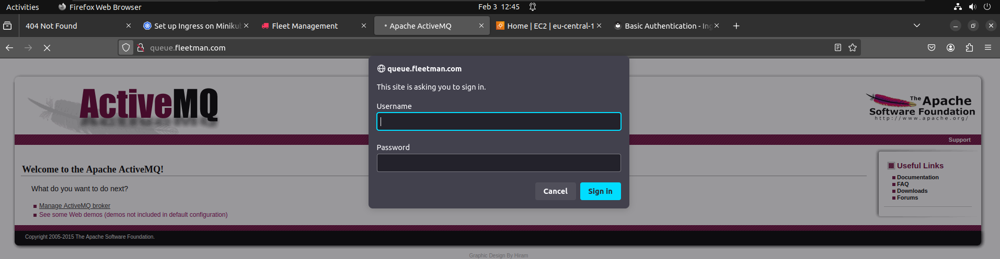
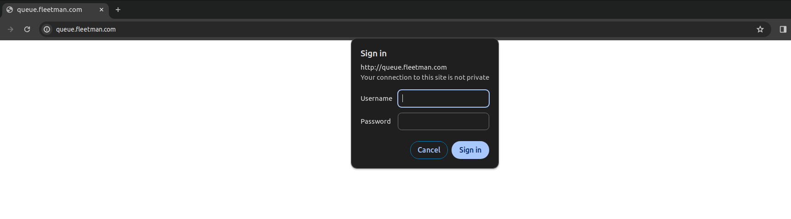
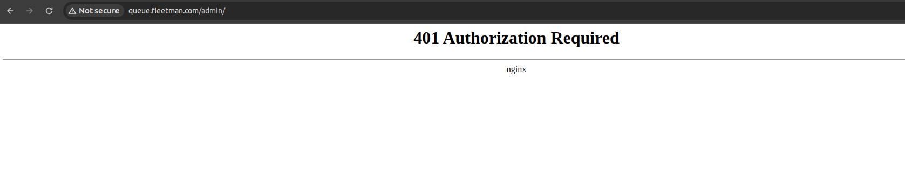
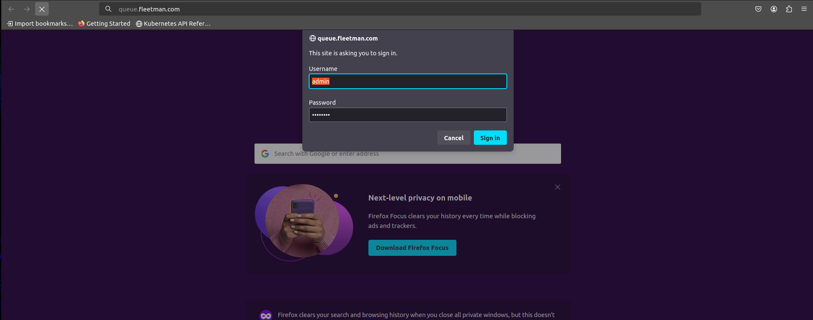
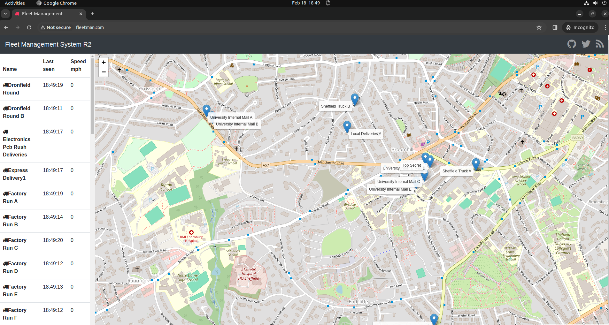

# Authentication using the Ingress rule in kubernetes

- in the `preveious session` we have `set the routing rules` to expose `multiple kubernetes services` in the `minikube kubernetes cluster` through `multiple host` using `domain and sub domain name`

- we can `provide various paths and patterns` using the `ingress-nginx controller using routing rules` document as [Different Example of Ingress-Nginx](https://kubernetes.github.io/ingress-nginx/examples)

- we want the user to `access` the `fleetman web application frontend` , but we want to `protect the admin console for the queue` which is not `by default available` for the `users`

- `activeMQ` by default `provide security` , hence being secure `manage the ActiveMQ broker` , then it will `prompt for the username and password`

- 

- but thats not good enough `but we want to make the homepage for the activeMQ` as well 

- here we will be doing a `basic Authentication` for the `admin console ingress controller`

- but we can also so as below with the `ingress controller`
    
    - `Client Certificate Authentication`
    
    - `External Basic Authenticatioon` 
    
    - `External OAUTH Authentication`


- all we need to do `kubernetes secrets` which will contain the `hashed version of the username and password` that `we are using it for the queue admin console Site`

- once we setup the `kubernetes secret` we can `reference that secret` from the `ingress controller`

- we need to `generate` the `kubernetes secrets` in an `insdustry standard form`

- `apache` provide an `commandline utility provided by apache` called the `htpasswd` to generate `which have multiple hashing algorithm to generate the hashing password`

- we can also use the `online htpasswd password generator` in the link as below [htpasswd online password generator](https://www.web2generators.com/apache-tools/htpasswd-generator)

- we can also install it using the `htpasswd` command line utility as well as below 

    ```bash
        sudo apt update
        # updating the package manager
        sudo apt install apache2-utils
        # updating the apache2-utils package which will install the htpasswd commandline utility tools

        # now we can check the htpasswd command line version using the command as 
        htpasswd -v
        # this will provide the version for the htpasswd commandline utility tools
        # the output will be as below 
        Usage:
            htpasswd [-cimBdpsDv] [-C cost] passwordfile username
            htpasswd -b[cmBdpsDv] [-C cost] passwordfile username password

            htpasswd -n[imBdps] [-C cost] username
            htpasswd -nb[mBdps] [-C cost] username password
        -c  Create a new file.
        -n  Don't update file; display results on stdout.
        -b  Use the password from the command line rather than prompting for it.
        -i  Read password from stdin without verification (for script usage).
        -m  Force MD5 encryption of the password (default).
        -B  Force bcrypt encryption of the password (very secure).
        -C  Set the computing time used for the bcrypt algorithm
            (higher is more secure but slower, default: 5, valid: 4 to 17).
        -d  Force CRYPT encryption of the password (8 chars max, insecure).
        -s  Force SHA encryption of the password (insecure).
        -p  Do not encrypt the password (plaintext, insecure).
        -D  Delete the specified user.
        -v  Verify password for the specified user.
        On other systems than Windows and NetWare the '-p' flag will probably not work.
        The SHA algorithm does not use a salt and is less secure than the MD5 algorithm.


    ```

- now we can generate the `basic auth` password uding the `htpasswd` commandline tools

- for that we can use the command as below
    
    ```bash
        htpasswd -c auth <user of the basic-auth>
        # here admin is the username in this case
        # here  we are generating the password using command as htpaswd
        # this will ask for the password and retype password
        # this will generate the basic-auth token for the password in bcrypt format
        # the username and password will be stored to the auth file in the same directory

        # then we need to generate the generic kubernetes secret using the  below command as 
        kubectl create secret generic basic-auth --from-file=auth
        # here we are generating a generic Secret
        # here we will generating the basic-auth secret which will convert the bcrypt password to base64 format saved it as the secret
        secret/basic-auth created

        # if we want to see the content of the secret then we can do as below
        # here we will be using the command as kubectl get secret <secret name> -o yaml
        kubectl get secret basic-auth -o yaml
        # generating the yaml configuration for the secret
        apiVersion: v1
        data:
            auth: YWRtaW46JGFwcjEkajNYenNlSTIkUDQ0TXhyc1VGS3YzeTg5d2liaWV6MQo= # here key become auth and password is the base64 version of the bcrypt password
            # here the filename become the key for the kubernetes secrets file
            # if we even decode this bas64 code then we will get the bcrypt version in this case
        kind: Secret
        metadata:
        creationTimestamp: "2024-02-18T04:16:39Z"
        name: basic-auth
        namespace: default
        resourceVersion: "89571"
        uid: 542dcf14-4248-4a87-824a-113804437cc5
        type: Opaque


    ```

- now we `can use these secrets` inside the `ingress rule` yaml which is `ingress.yml` as below

- we need to add `annotations` inside the `metadata` `section` of the `ingress.yml` file which we can fetched from [Basic Auth Rules](https://kubernetes.github.io/ingress-nginx/examples/auth/basic/)

- this `extra annotation` will provide the `extra configuration for the ingress` 
    
    ```yaml
        ingress.yml
        ============
        apiVersion: networking.k8s.io/v1
        # here defining tthe apiVersion as networking.k8s.io/v1 which can be fetched from kubectl api-resources -o wide | grep ingress
        kind: Ingress # defining the kubernetes object will be as type Ingress
        metadata: # defining the name fo the ingress rule as basic-routing
            name: basic-routing
            annotations:
                # type of authentication
                nginx.ingress.kubernetes.io/auth-type: basic
                # name of the secret that contains the user/password definitions that we have saved into the basioc-auth kubernetees secret
                nginx.ingress.kubernetes.io/auth-secret: basic-auth
                # message to display with an appropriate context why the authentication is required i.e any message if we want to show to the browser
                nginx.ingress.kubernetes.io/auth-realm: 'Authentication Required'
        spec: # specification for the ingress
            rules: # here we are defining the routing rule or ingress rules in this case 
                - host: fleetman.com # here defining the name as fleetman.com
                  http: # here we are getting the http request in this case
                    paths: 
                    - path: / # definign the path endpoint for the host. we can provide reegex pattern as well
                      pathType: Prefix # here the pathType as prefix
                      backend: # using the service backend
                        service: # service details
                            name: fleetman-webapp # name of the service
                            port: # port number info of the service
                                number: 80 # port number of the service i.e ClusterIP Service been exposing
                
                - host: queue.fleetman.com # here defining the name as queue.fleetman.com
                  http: # here we are getting the http request in this case
                    paths: 
                    - path: / # definign the path endpoint for the host. we can provide reegex pattern as well
                      pathType: Prefix # here the pathType as prefix
                      backend: # using the service backend
                        service: # service details
                            name: fleetman-queue # name of the service
                            port: # port number info of the service
                                number: 8161 # port number of the service i.e ClusterIP Service been exposing
                

    ```

- now we can deploy the `ingress.yml` onto the `kubernetes cluster` by using the command as 

    ```bash
        kubectl apply -f ingress.yml
        # applying the changes and deploying the Defintion to the kubernetes cluster
        # here the output will be shown as below
        ingress.networking.k8s.io/basic-routing configured

        # now when we want to descrube the annotation then we will be getting the result as below 
        kubectl describe ing basic-routing 
        # fetching the ingress details from the describe command
        Name:             basic-routing
        Labels:           <none>
        Namespace:        default
        Address:          192.168.49.2
        Ingress Class:    nginx
        Default backend:  <default>
        Rules:
        Host                Path  Backends
        ----                ----  --------
        fleetman.com        
                            /   fleetman-webapp:80 (10.244.1.247:80)
        queue.fleetman.com  
                            /   fleetman-queue:8161 (10.244.1.243:8161)
        Annotations:          nginx.ingress.kubernetes.io/auth-realm: Authentication Required # here we can see the annotation been appied
                            nginx.ingress.kubernetes.io/auth-secret: basic-auth
                            nginx.ingress.kubernetes.io/auth-type: basic
        Events:
        Type    Reason  Age                From                      Message
        ----    ------  ----               ----                      -------
        Normal  Sync    28m (x2 over 28m)  nginx-ingress-controller  Scheduled for sync
 

    ```

- now if we goto the `queue.fleetman.com` then we can see the `basic Authentication` page in this case

- but we can notice `in some browser` the `relam message` that we put in `not coming` that is `browser specific`

- but now when we are asking the `queue,fleetman.com` then we can see the `basic Authentication Page`

- 

- if we provide the `bas credentials` then we will be getting an `401 Authorization Required` prompt in this case

- 

- if we are inside the `corporate network` then we need to go for `client certificate authentication`

- in case of the `client certificate authentication` we aneed to generate the `client certificate` and `kubernetes secret for the client certificcate` provide that to `admin`

- we will be using that inside the `ingress rule or routing rules` where `client with particular certificate can access the webpage`

- some people might think the `basic Authentication` that we have done so far is `insecure` 

- `basic Authentication` is still an `authentication standard for internet` 

- if we are usig the `basic Authentication` then we make the `site` as `https with TLS and SSL certificate` with the `basic Authentication it can be considered as secure`

- when we configure the `site` with the `https i.e TLS and SSL certificate` then all the `traffic between the client and server been encrypted` , otherwise the `username and password` that we are using `basic Authentication` can be `intercepted`

- `securiing with https using TLS and SSL Cert` is a `pre-requisite` if we are using the `basic Authentication` 

- so we have setup the `basic Authentication` for the `activeMQ` application 

- but now with the `ingress changes` the `web frontend` also become `basic-authentication` protected

- if we don't want to `use basic Authentication` for the `User Application` then we need to `remove` the `annotations` that we declared inside the `metadata  section` for the `ingress rule` or `routing rules`

- as the `annotations` sits on the `top of the ingress` hence we can see that `that been applied for all the hosts defined inside the rules`

- hence if we don't `flewetmman webapp` basic Authentiocated then we must define `another ingress definition yml` and separate the `queue.fleetman.com` which is `basic Authenticated` and `fleetman webApp` which is not `basic Authenticated`
 
- we can define them as below `ingress-public.yml` where `no basic Authentication for fleetman webapp` and `ingress-auth.yml` with `basic Authentication` for the `queue.fleetman.com`


    ```yaml
        ingress-public.yml
        ===================
        apiVersion: networking.k8s.io/v1
        # here defining tthe apiVersion as networking.k8s.io/v1 which can be fetched from kubectl api-resources -o wide | grep ingress
        kind: Ingress # defining the kubernetes object will be as type Ingress
        metadata: # defining the name fo the ingress rule as ingress-public
            name: ingress-public
        spec: # specification for the ingress
            rules: # here we are defining the routing rule or ingress rules in this case 
                - host: fleetman.com # here defining the name as fleetman.com
                  http: # here we are getting the http request in this case
                    paths: 
                    - path: / # definign the path endpoint for the host. we can provide reegex pattern as well
                      pathType: Prefix # here the pathType as prefix
                      backend: # using the service backend
                        service: # service details
                            name: fleetman-webapp # name of the service
                            port: # port number info of the service
                                number: 80 # port number of the service i.e ClusterIP Service been exposing
                

    ```

    ```yaml
        ingress-auth.yml
        ================
        apiVersion: networking.k8s.io/v1
        # here defining tthe apiVersion as networking.k8s.io/v1 which can be fetched from kubectl api-resources -o wide | grep ingress
        kind: Ingress # defining the kubernetes object will be as type Ingress
        metadata: # defining the name fo the ingress rule as ingress-auth
            name: ingress-auth
            annotations:
                # type of authentication
                nginx.ingress.kubernetes.io/auth-type: basic
                # name of the secret that contains the user/password definitions that we have saved into the basioc-auth kubernetees secret
                nginx.ingress.kubernetes.io/auth-secret: basic-auth
                # message to display with an appropriate context why the authentication is required i.e any message if we want to show to the browser
                nginx.ingress.kubernetes.io/auth-realm: 'Authentication Required'
        spec: # specification for the ingress
            rules: # here we are defining the routing rule or ingress rules in this case 
                
                - host: queue.fleetman.com # here defining the name as queue.fleetman.com
                  http: # here we are getting the http request in this case
                    paths: 
                    - path: / # definign the path endpoint for the host. we can provide reegex pattern as well
                      pathType: Prefix # here the pathType as prefix
                      backend: # using the service backend
                        service: # service details
                            name: fleetman-queue # name of the service
                            port: # port number info of the service
                                number: 8161 # port number of the service i.e ClusterIP Service been exposing


    ```


- now we can deploy the `ingress.yml` onto the `kubernetes cluster` by using the command as 

    ```bash
        kubectl delete ing basic-routing
        # deleting the older ingress that been deployed
        ingress.networking.k8s.io/basic-routing deleted


        kubectl apply -f ingress-auth.yml
        # applying the changes and deploying the Defintion to the kubernetes cluster
        # here the output will be shown as below
        ingress.networking.k8s.io/ingress-auth created

        kubectl apply -f ingress-public.yml
        # applying the changes and deploying the Defintion to the kubernetes cluster
        # here the output will be shown as below
        ingress.networking.k8s.io/ingress-public created
    
    ```

- now when we try to access the `queue.fleetman.com` then we can see the `basic Authentication`

- 

- but when we will try for the `fleetman.com` then we can't see the `basic Authentication`  

-  

- if we are suing the command as this `kubectl describe ing` then it will provide the `description of all the ingress in the namespace`

    ```bash
        kubectl describe ing
        # describing all the ingress defined in this case
        # the output will be as below 
        Name:             ingress-auth
        Labels:           <none>
        Namespace:        default
        Address:          192.168.49.2
        Ingress Class:    nginx
        Default backend:  <default>
        Rules:
        Host                Path  Backends
        ----                ----  --------
        queue.fleetman.com  
                            /   fleetman-queue:8161 (10.244.1.243:8161)
        Annotations:          nginx.ingress.kubernetes.io/auth-realm: Authentication Required
                            nginx.ingress.kubernetes.io/auth-secret: basic-auth
                            nginx.ingress.kubernetes.io/auth-type: basic
        Events:
        Type    Reason  Age                    From                      Message
        ----    ------  ----                   ----                      -------
        Normal  Sync    5m10s (x2 over 5m36s)  nginx-ingress-controller  Scheduled for sync


        Name:             ingress-public
        Labels:           <none>
        Namespace:        default
        Address:          192.168.49.2
        Ingress Class:    nginx
        Default backend:  <default>
        Rules:
        Host          Path  Backends
        ----          ----  --------
        fleetman.com  
                        /   fleetman-webapp:80 (10.244.1.247:80)
        Annotations:    <none>
        Events:
        Type    Reason  Age                    From                      Message
        ----    ------  ----                   ----                      -------
        Normal  Sync    5m10s (x2 over 5m26s)  nginx-ingress-controller  Scheduled for sync


    ```

- one `problem` with the `basic Authentication` the `credetial` will be stored into the `browser cache` and we will not be able to `logout` once after the `authentication`

- we can set the `regular expression` on the `path` that we can see on the [kubernetes ingress nginx docs](https://kubernetes.github.io/ingress-nginx/)

- we can also do the `path Based routing` , untill now what we have done is `host bassed routing`

- if we have only `one host` we want to use `multiple end point` then we can define the `path based routing ingress rule`

- we can define that as below 

- here the `fleetman-webapp` and `fleetman-queue` `application is not configured to work like that` and use the `hardcoded route in CSS file` hence its not possible to demo 

- but we can absolutely try that as below `ingress.yml`

    
    ```yaml
        ingress.yml
        ============
        apiVersion: networking.k8s.io/v1
        # here defining tthe apiVersion as networking.k8s.io/v1 which can be fetched from kubectl api-resources -o wide | grep ingress
        kind: Ingress # defining the kubernetes object will be as type Ingress
        metadata: # defining the name fo the ingress rule as ingress-public
            name: ingress-public
        spec: # specification for the ingress
            rules: # here we are defining the routing rule or ingress rules in this case 
                - host: fleetman.com # here defining the name as fleetman.com
                  http: # here we are getting the http request in this case
                    paths: 
                    - path: / # definign the path endpoint for the host. we can provide reegex pattern as well
                      pathType: Prefix # here the pathType as prefix
                      backend: # using the service backend
                        service: # service details
                            name: fleetman-webapp # name of the service
                            port: # port number info of the service
                                number: 80 # port number of the service i.e ClusterIP Service been exposing
                    
                    - path: /webapp
                      pathType: Prefix # here the pathType as prefix
                      backend: # using the service backend
                        service: # service details
                            name: <service name> # name of the service
                            port: # port number info of the service
                                number: <port number> # port number of the service i.e ClusterIP Service been exposing
                    


    ```

- we can define as below for the `path based routing` inside the `ingress.yml` as below 

    ```yaml
        ingress.yml
        ===========
        apiVersion: networking.k8s.io/v1
        # here defining tthe apiVersion as networking.k8s.io/v1 which can be fetched from kubectl api-resources -o wide | grep ingress
        kind: Ingress # defining the kubernetes object will be as type Ingress
        metadata: # defining the name fo the ingress rule as ingress-public
            name: ingress-public
        spec: # specification for the ingress
            rules: # here we are defining the routing rule or ingress rules in this case 
                - host: fleetman.com # here defining the name as fleetman.com
                  http: # here we are getting the http request in this case
                    paths: 
                    - path: / # definign the path endpoint for the host. we can provide reegex pattern as well
                      pathType: Prefix # here the pathType as prefix
                      backend: # using the service backend
                        service: # service details
                            name: fleetman-webapp # name of the service
                            port: # port number info of the service
                                number: 80 # port number of the service i.e ClusterIP Service been exposing
                
                - host: fleetman.com # here defining the name as fleetman.com
                  http: # here we are getting the http request in this case
                    paths: 
                    - path: /webapp # definign the path endpoint for the host. we can provide reegex pattern as well
                      pathType: Prefix # here the pathType as prefix
                      backend: # using the service backend
                        service: # service details
                            name: fleetman-webapp # name of the service
                            port: # port number info of the service
                                number: 80 # port number of the service i.e ClusterIP Service been exposing


    ```