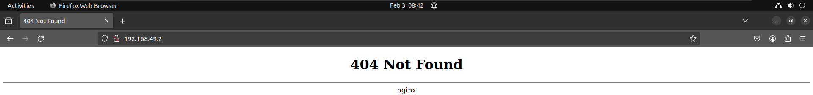
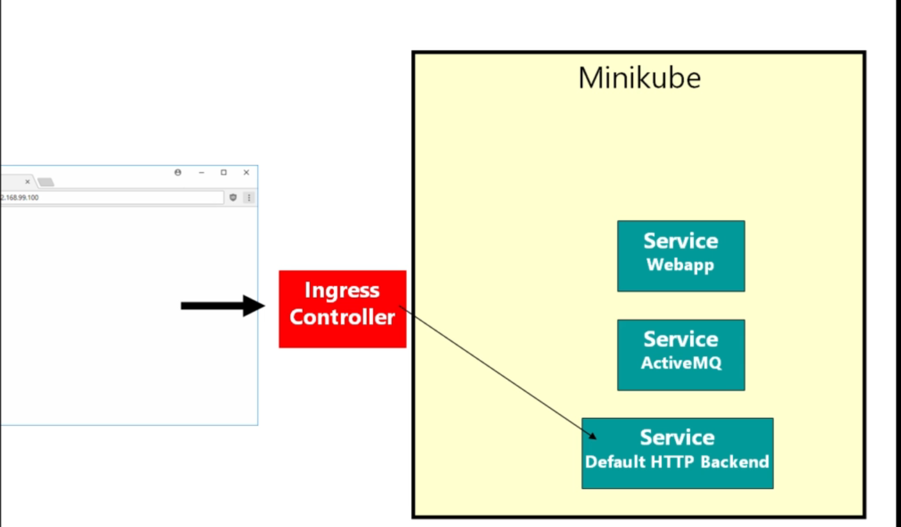
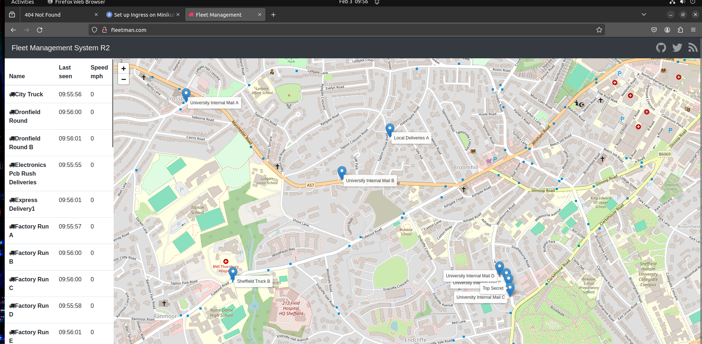

# defining Routing Rules in kubernetes ingress

- the `ingress controller` in `kubernetes` is a `resource` which will help in making the `routing rules` , which will ensure `multiple service` `connected` to `ultimately` to the `same loadBalancer`

- here `we don't need` to all things using the `loadBalancer` but will be doing things through `minikube` , which will be for the `local development and testing`

- in `minikube` the `ingress controller` will be an `addon` service that being `avaialable`

- we can see the `minikube addons list` using the command as below which will show the `minikube inbuild addons whether they are enabled or not`


    ```bash/
        minikube addons list
        # fetching the minikube addon in here
        # it will also going to display whether they are enabled or disabled
        # the output will be as below 
        |-----------------------------|----------|--------------|--------------------------------|
        |         ADDON NAME          | PROFILE  |    STATUS    |           MAINTAINER           |
        |-----------------------------|----------|--------------|--------------------------------|
        | ambassador                  | minikube | disabled     | 3rd party (Ambassador)         |
        | auto-pause                  | minikube | disabled     | minikube                       |
        | cloud-spanner               | minikube | disabled     | Google                         |
        | csi-hostpath-driver         | minikube | disabled     | Kubernetes                     |
        | dashboard                   | minikube | disabled     | Kubernetes                     |
        | default-storageclass        | minikube | enabled ✅   | Kubernetes                     |
        | efk                         | minikube | disabled     | 3rd party (Elastic)            |
        | freshpod                    | minikube | disabled     | Google                         |
        | gcp-auth                    | minikube | disabled     | Google                         |
        | gvisor                      | minikube | disabled     | minikube                       |
        | headlamp                    | minikube | disabled     | 3rd party (kinvolk.io)         |
        | helm-tiller                 | minikube | disabled     | 3rd party (Helm)               |
        | inaccel                     | minikube | disabled     | 3rd party (InAccel             |
        |                             |          |              | [info@inaccel.com])            |
        | ingress                     | minikube | disabled     | Kubernetes                     |
        | ingress-dns                 | minikube | disabled     | minikube                       |
        | inspektor-gadget            | minikube | disabled     | 3rd party                      |
        |                             |          |              | (inspektor-gadget.io)          |
        | istio                       | minikube | disabled     | 3rd party (Istio)              |
        | istio-provisioner           | minikube | disabled     | 3rd party (Istio)              |
        | kong                        | minikube | disabled     | 3rd party (Kong HQ)            |
        | kubeflow                    | minikube | disabled     | 3rd party                      |
        | kubevirt                    | minikube | disabled     | 3rd party (KubeVirt)           |
        | logviewer                   | minikube | disabled     | 3rd party (unknown)            |
        | metallb                     | minikube | disabled     | 3rd party (MetalLB)            |
        | metrics-server              | minikube | disabled     | Kubernetes                     |
        | nvidia-device-plugin        | minikube | disabled     | 3rd party (NVIDIA)             |
        | nvidia-driver-installer     | minikube | disabled     | 3rd party (Nvidia)             |
        | nvidia-gpu-device-plugin    | minikube | disabled     | 3rd party (Nvidia)             |
        | olm                         | minikube | disabled     | 3rd party (Operator Framework) |
        | pod-security-policy         | minikube | disabled     | 3rd party (unknown)            |
        | portainer                   | minikube | disabled     | 3rd party (Portainer.io)       |
        | registry                    | minikube | disabled     | minikube                       |
        | registry-aliases            | minikube | disabled     | 3rd party (unknown)            |
        | registry-creds              | minikube | disabled     | 3rd party (UPMC Enterprises)   |
        | storage-provisioner         | minikube | enabled ✅   | minikube                       |
        | storage-provisioner-gluster | minikube | disabled     | 3rd party (Gluster)            |
        | storage-provisioner-rancher | minikube | disabled     | 3rd party (Rancher)            |
        | volumesnapshots             | minikube | disabled     | Kubernetes                     |
        |-----------------------------|----------|--------------|--------------------------------|


    ```
- in the `horizontal Auto scaling` we have used the `heapster and metrics-server` minikube addon 

- but there is `minikube addon` available for the `ingress controller` as well

- we can enable the `ingress minikube addon` by using the command as `minikube addons enable <addon name>`

- we can see that as below
    
    ```bash
        minikube addons enable ingress
        # enabling the minikube addon ingress service in here 
        ingress is an addon maintained by Kubernetes. For any concerns contact minikube on GitHub.
        You can view the list of minikube maintainers at: https://github.com/kubernetes/minikube/blob/master/OWNERS
        .io/ingress-nginx/kube-webhook-certgen:v20231011-8b53cabe0
            ▪ Using image registry.k8s.io/ingress-nginx/controller:v1.9.4
            ▪ Using image registry.k8s.io/ingress-nginx/kube-webhook-certgen:v20231011-8b53cabe0
        🔎  Verifying ingress addon...
        enbled

    ```

- once the `ingress controller` being active as the `minikube addon` then we can see `few pods` inside the `ingress-nginx` namespace in this case

- we can see the `below PODs are getting created because of it` are listed here

    ```bash
        kubectl get pods -n ingress-nginx
        # fetching the PODs inside the ingress-nginx namespace here 
        # the ouput will be as below 
        NAME                                        READY   STATUS      RESTARTS   AGE
        ingress-nginx-admission-create-ckrrm        0/1     Completed   0          129m
        ingress-nginx-admission-patch-lkr7h         0/1     Completed   1          129m
        ingress-nginx-controller-7c6974c4d8-zfgrf   1/1     Running     0          129m

        # here we can see the ingress controller being set for this as "ingress-nginx-controller-<replicaset-ID>-<random string>"
        # this will also be creating one more pod as well which should be as "default-http-backend-<>-<>"


    ```

- if we do a `kubectl get svc --all-namespaces` then we can see the `below info` in this case

- we can see the `ingress controller` will create the `service` as `ingress-nginx-controller` which is a `NodePort service` been linked to the `internal port 80` which is the `default port of the minikube cluster`

    ```bash
        kubectl get svc --all-namespaces
        # fetching the kubernetes service accross all the namespaces in this case 
        # the output will be as below
        NAMESPACE       NAME                                 TYPE        CLUSTER-IP      EXTERNAL-IP   PORT(S)                      AGE
        default         kubernetes                           ClusterIP   10.96.0.1       <none>        443/TCP                      21m
        ingress-nginx   ingress-nginx-controller             NodePort    10.104.39.52    <none>        80:32266/TCP,443:32423/TCP   21m
        ingress-nginx   ingress-nginx-controller-admission   ClusterIP   10.109.176.55   <none>        443/TCP                      21m
        kube-system     kube-dns                             ClusterIP   10.96.0.10      <none>        53/UDP,53/TCP,9153/TCP       21m


    ```

- we can see that in here the `ingress-nginx-controller service` which will be `pointing` to the port  `80:30495/TCP,443:32369/TCP` in this case , hence the `nodeport` will be greater than `80:30495/TCP`

- here the `minikube` set things up , so that `on port 80 of the minikube ip` the `ingress-nginx-controller` been `working or runing` which is a `nginx webserver`

- if we now visit the `minikube ip` then we can see the below info

    ```bash
        minikube ip
        # this will show the minikube kubernetes cluster IP in this case
        # the below will be the response
        192.168.49.2
    
    ```

- as `minikube associate its Ip with port 80` for the `nginx ingress controller` hence when we visit the `http://192.168.49.2` with the default port as `80` we can see the `nginx error of 404`

- 

- currently the `pciture` is like this as below , but insead of the `default http backend` we have the `ingress-nginx-controller` service

- 

- here the `services` are avialable , but `can't be access outside of the cluster` as they are `ClusterIP` Service

- in `minikube` there is no `load balancer` , hence `minikube` just put the `ingress controller` outside of the `minikube kubernetes cluster(i think as)` , what i think , but even though this is a `POD` inside of the `cluster`

- hence all the `request` go through the `ingress controller` and diverted to the `ingress-nginx-controller` which is shown as `Default Backend Http in the picture (Old one)` , currently that refer to the `ingress-nginx-controller` service which been showing the `404 nginx outcome that we have seen` , when `accessing the minikube IP address`

- here we will be `performing the below action`
  
  - we `redirect` the `request coming from the ingress controller` to the `ingress nginx controller service` to the ` 2 service` that we want to `expose` to the `user`  
  
- we need to write the `config` file for the same which will `redirect` the  `request coming from the ingress controller` to the `ingress nginx controller service` 

- we can see the configuration in [Minikube kubernetes ingress controller configuration](https://kubernetes.io/docs/tasks/access-application-cluster/ingress-minikube)
 
- we can write the `ingress.yml` as below 

    ```yaml
        ingress.yml
        ===========
        # from kubernetes 1.14 onward the apiVersion of the ingressController is networking.k8s.io/v1
        apiVersion: networking.k8s.io/v1
        kind: Ingress # here the type of kubernetes object we will be building is the kubernetes Ingress object
        metadata: # defining the name for the Ingress controller
            name: basic-routing # here defining the name of the ingress as basic-routing
        spec: # defining the specification for the routing in this case in here
            rules: # here we will be defining the routing rules for the ingress controller
                # here we will be defining the series of host i.e list of hosts in this case here
                - host: fleetman.com # here defining the host that we have defined inside the /etc/hosts files in linux or driver/etc/hosts in windows
                  http: # here we need to define the http in  this case
                    paths: # defining the multiple path as list in here
                     # here we can define multiple paths in this case over here
                     - path: /
                       pathType: Prefix # here we must define the  pathType as prefix in this case
                       backend: # here defining the backend service that we will be pointing to 
                            service:
                                name: fleetman-webapp # here the name of service being as fleetman-webapp
                                port: # which port fleetman-webapp kubernetes Service that exposes internally
                                    number: 80 # here we need to specify the port which being opened by the backend service that we are pointing to internally


    ```

- here we need to define the `domain name` against the `host` attribute defined here , but with the current setup , we don't have the `domain name`

- we can't use the `dotted quad IP Address` in the `host` as well , because the `IP Address` of the `mode` will `going to be get changed `

- here we can use a `good trick to simulate the domain-name` here as below 

- we can goto the `/etc/hosts` file in `linux/macOS` or `C:\Windows\system32\drivers\etc\hosts` in `windows` through `running the cmd on the administrator mode`

- then we can edit the `/etc/hosts` we can edit the file as below 

    ```bash
        sudo nano /etc/hosts
        # editing the /etc/hosts as below 
        127.0.0.1	localhost
        127.0.1.1	pratik-virtual-machine
        192.168.49.2 fleetman.com # here we have define the fleetman.com for the minikube ip address
        # then we are using the http://fleetman.com then it will redirect to the minikube ip on port 80
        # as we have already redirected the minikube IP port 80 to our service hence our service will be going to show up

        # The following lines are desirable for IPv6 capable hosts
        ::1     ip6-localhost ip6-loopback
        fe00::0 ip6-localnet
        ff00::0 ip6-mcastprefix
        ff02::1 ip6-allnodes
        ff02::2 ip6-allrouters

    ```

- this `/etc/hosts` file will be contacted first `when the domain name entered in the browser`

- if it does not find the `/etc/hosts` it will going to provide the `proper DNS server` on the `internet`

- we have added the `minikube ip` and `domain name that we want` as above `so that we someone entered the domain name` it will redirect to the `minikube ip` which associated with the `Service` 

- but as the `ingress changes` are not yet `deployed to the cluster` hence even though the `domain name will be redirected to minikube IP` , it will not redirect to the service, rather it will go to the default `ingress-nginx controller` , which will provide the `404 error response in nginx`. 

- but once we deployed the changes then `minikube IP on port 80` rather than pointing to the `ingress-nginx controller` pointing to `our kubernetes service` , we can see the fleetman page in here

- if we have not added the `ingress` to the `backend service` , which is currently pointed by the `minikube Ip on port 80` then we will be getting the `some other` as `fleetman.com` page as it will not find the `domain name in the /etc/hosts` and will check in `internet DNS service` and redirect to the `some other company`

- we can `deploy the changes into the minikube kubernetes cluster` by applying the changes as below 

    ```bash
        kubectl apply  -f ingress.yml
        # applying the changes and deploying to the minikube kubernetes cluster
        # the output will be as below
        ingress.networking.k8s.io/basic-routing created

    ```

- now we can see the `kubernetes ingress object` in the `minikube kubernetes cluster` as below 

    ```bash
        kubectl get ingress/ing
        # here llisting out all the ingress controller in the default namespace out in here
        # this will show the setoff ingress over here
        # the output will be as below
        NAME            CLASS   HOSTS          ADDRESS        PORTS   AGE
        basic-routing   nginx   fleetman.com   192.168.49.2   80      50m

    ```

- here now we can see the `ingress details`  as below 

    ```bash
        kubectl describe ingress/ing basic-routing
        # fetching all the ingress details in this case here
        Name:             basic-routing
        Labels:           <none>
        Namespace:        default
        Address:          192.168.49.2
        Ingress Class:    nginx
        Default backend:  <default>
        Rules: # here we can see the set off routing rules defined in this case as below 
        Host          Path  Backends
        ----          ----  --------
        fleetman.com  
                        /   fleetman-webapp:80 (10.244.0.43:80)
        Annotations:    <none>
        Events:
        Type    Reason  Age                From                      Message
        ----    ------  ----               ----                      -------
        Normal  Sync    51m (x2 over 52m)  nginx-ingress-controller  Scheduled for sync


    ```

- now if we goto the `http://fleetman.com` then we can see the `details` as below and our webapp will be running there

-  