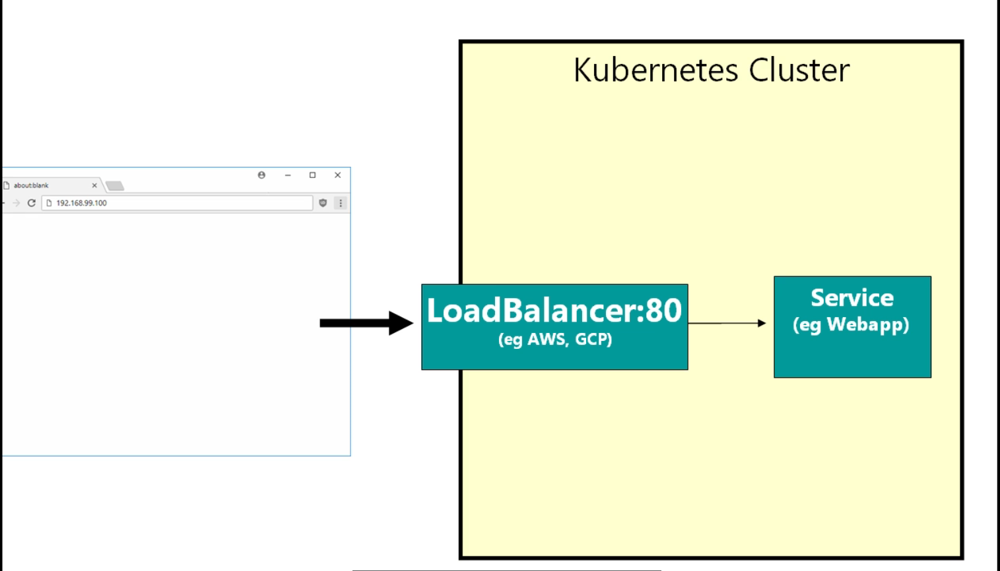
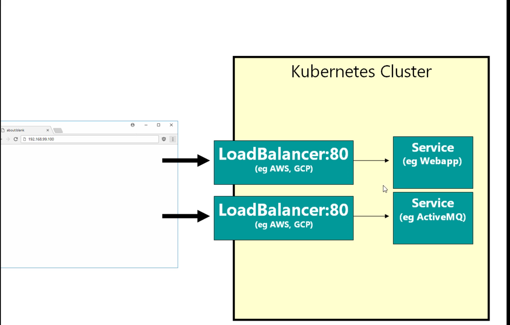
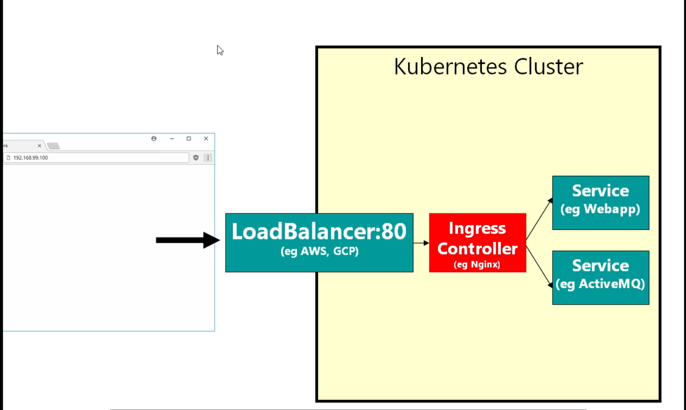

# introduction to Ingress controller in kubernetes with minikube

- **what is ingress controller in kubernetes and what can it do for you**

- so far we have seen only `2 ways` to access `services` in `kubernetes` in a `production cluster` 

- if we are running on `minikube  kubernetes cluster` we have only one way to `accessing the service` in `kubernetes cluster` i.e the `client` can able to `publically access the service`

- we have seen so far we can define the ` kubernetes Service` of type `NodePort` that `allow us to s[pecify the port` for that `kubernetes service`

- we can `access that port assigned with the kubernetes service` using the `Browser or rest client or whatever means`

- here we have the `services.yml` file as below which will be defining the `fleetman-queue` and `fleetman-webapp` as the `NodePort`

- we can define the `services.yml` as below in this case

    ```yaml
        services.yml
        ============
        apiVersion: v1 # here the apiVersion is of v1 in here as it is a service
        kind: Service # here the kind which is Kubernetes Service
        metadata: # defining the metadata i.e name of the service as fleetman-webapp
            name: fleetman-webapp
        spec: # defining the specification for the service
            selector: # defining the selector as key value based on POD label
                app: webapp
            ports: # defining the ports for the services being defined in here
                - name: http # here the name of the port being http
                  port: 80 # defining he port for the service beig as 80
                  protocol: TCP # defining the protocol for the Service being as TCP
                  nodePort: 30080 # here the nodePort being as 30080
            type: NodePort # here the type of the Services in this case is of NodePort type
        
        ---

        apiVersion: v1 # here the apiVersion is of v1 in here as it is a service
        kind: Service # here the kind which is Kubernetes Service
        metadata: # defining the metadata i.e name of the service as fleetman-queue
            name: fleetman-queue
        spec: # defining the specification for the service
            selector:  # defining the selector as key value based on POD label
                app: queueapp
            ports: # defining the ports for the services being defined in here
                - name: admin # here the name of the port being admin for admin console
                  port: 8161 # here the port that the incoming traffic and container will allow is of 8161
                  protocol: TCP # protocol here is of type TCP
                  nodePort: 30010 # here the nodePort for accessing outside is of 30010

                - name: endpoint # here the name of the port being endpoint
                  port: 61616 # here the port being as 61616
                  protocol: TCP # here the protocol as TCP in here
                  nodePort: 30020 # here the nodePort as 30020 in this case

            type: NodePort # here the services is of type as NodePort

        ---
        apiVersion: v1 # here the apiVersion is of v1 in here as it is a service
        kind: Service # here the kind which is Kubernetes Service
        metadata: # defining the name for the kubernetes service is of fleetman-api-gateway
            name: fleetman-api-gateway
        spec: # here the selector for the specification for the service being defined in this case
            selector: # defining the selector for the POD labels
                app: api-gateway
            ports: # defining the ports for allowing traffic and container allowed port
                - name: rest # name of the port being as rest
                  port: 8080 # allowing traffic and container on port 8080
                  protocol: TCP # here the protocol is of TCP in this case
                  
            type: ClusterIP # here the type of Service in this case is of ClusterIP

        ---

        apiVersion: v1 # here the apiVersion is of v1 in here as it is a service
        kind: Service # here the kind which is Kubernetes Service
        metadata: # defining the name for the kubernetes service is of fleetman-position-tracker
            name: fleetman-position-tracker
        spec: # defining the specification for the Service declared in here
            selector: # here the selector for the POD labels
                app: position-tracker
            ports: # here the port being mentioned as in this case to allow the traffic and on ports
                - name: rest # defining the name of the port as rest again
                  port: 8080 # allowing the traffic and the container port is on port 8080
                  protocol: TCP # here the protocol is of TCP
                  
            type: ClusterIP # here the service Type is of ClusterIP


    ```

- here the we want the `scenario that we want to go through` is that 
  
  - of course we want to the `user` i.e `member of the public` to be able to `access the webApp` through the `web interface`
  
  - but we also want the `administrator of the system` to access the `queueapp admin console` , we will be providing the `username and password` for the same

- hence we have define  the `fleetman-webapp and fleetman-queue` as the `NodePort` so that it can `accessable through` the `web interface`

- but the only `disadvantage` of the `NodePort` service being that `it can be accessed using in the range of 30000 and above`

- here we are using the `NodePort` of `30080` for the `fleetman-webapp` service and we are using the `NodePort` of `30010` for the `fleetman-queue` service

- but the `purpose` of the `NodePort` when we are `testing locally` , where `debugging the YAML file` , but noway a `professsional website` be hosted on the port `30080`

- if we are using the `minikube` , the `only option for the services` being the `clusterIP` which will be for the `Services will be inside the cluster`

- here we have defined the `api-gateway` and `position-tracker` in the `term` as `Cluster` , hence `position-tracker` can access `mongodb` internally with in the cluster

- the `real way of accessing` the `Service` inside the `Production Cluster` by using the `load balancer` as displayed in the snip below

- 

- the `load balancer` is provided by the `cloud provider` such as `AWS/GCP/Azure`

- these `load balancer` are the `hardware resources` which will `highly available` and `highly resilient` and absolutely `battle tested` by `million of the project`

- in the `kubernetes service yml defintion` we need to specify the `Service type as Load Balancer` , then it tell `kubernetes Produiction cluster hosted in cloud ` to provision `new Load Balancer` which is going to `provisioned by Cloud Provider such as AWS` which will not be part of the `kubernetes`

- we can tell `to forward traffic on specific port using the route 53` and `we can defined a domain name in route 53` which will `forward that traffic to the load balacer` on the `port 80` in that case `load balacer` then `forward traffic` to the `kubernetes cluster to a particular service`

- there is `biog problem` with this 

- the `above snip` with only `one load balancer` make sense when we have only `one service i.e webapp service` to `publish it onto`

- if we have `more than one service such as admin console for the webapp` then we need `more load balancer` in the `prodcution cluster` to deploy that `service into`

- with the current set up , we need the `those many number of load balancer in the cluster` based on `number of services we want to deploy onto`

- 

- the `advantage` with this approach being `because the load balancer` being `different` and `they are separate hardware entities` therefore have `separate static DNS` therefore `both different load balancer can listen tio port 80` in this case

- so we can have the `domain name` set in `route 53` which will redirect the `fleetman.com` onto the `first LoadBalacer` which will point to the `fleetman-webapp` kubernetes Service

- we can configure the `another sub domain name`  set in `route 53` which will redirect the `admin.fleetman.com`  onto the `Second LoadBalacer` which will point to the `fleetman-queue` kubernetes Service

- but the `main disadvantage` being the `load balancer` are being `expensive items` , which cost `$30 dollar per month to run` , which is fine `for one load balancer` but `multiple load balancer hardware component can be difficult`

- if have `10/20/50 kubernetes services to be exposed to public` then it does seem feasible and cost can `rack up very easily`

- we may want to `publish grafana for monitoring the cluster`

- we might want to `publish ELK for publishing the logs for the cluster`

- we also need the `prometheus frontent` as well

- even though for this `small microservice application` we want the `5 services to be exposed to the public` hence needing `5 load balancer`

- in `AWS Platform` there is a concept of `application load balancer or ALB`

- there are `3 type` of `load balancer` avaialble in the `AWS platform`
  
  - `Classic Load Balacer` which we are `currently using` for the `Load Balancing` which is `pretty basic`
  
  - `Network Load Balancer`
  
  - `Application Load Balancer as (ALB) ` which is aviable newly in `AWS Platform`   

- we can configure the `Application Load Balancer as (ALB)` with the `routing rules`

- we can tell the `Application Load Balancer as (ALB)` if the `incoming traffic` matches a `particular domain name` then redirect to the `particular service` , if `some other domain name pattern` then it will redirect to the `another service`

- hence we can solve the `problem` of `spinning multiple service to public` using the `Application Load Balancer`

- but currently `kubernetes does not work very well` with the `Application Load Balancer as (ALB)` , because the `Application Load Balancer as (ALB)` is not aviable in all `cloud platform` , here the `kubernetes want to be cloud agnostic` and have to work `kubernetes with application load balancer`

- we don't have `bother about` learning `kubernetes with Application Load Balancer` because there is concept of `ingress controller` in `kubernetes`

- `ingress controller` in `kubernetes` is the `general solutuion for spinnign multiple service in kubernetes` which `will work for all cloud providers`

- the `idea of the ingress controller` in the `kubernetes` is very simple i.e as below 

- 

- here we have `rearchitect` this to have `only one load balancer` which will be for the `one load balancer`

- we can listen on any port `typically be port 80` and `instead` of taking to the `services` it must talk to the `special service` which is known as `ingress controller`

- the `ingress controller` is just a `service` , but `its not the service ` that we need to `write ourself` , `its a predefined service` which is `plugable`

- we can get `different implementation ` for the `ingress controller` , but most often iot is `nginx` , which is `common webserver` used in `millions of project`

- and this `ingress controller` which is of `nginx`  , which is `really the configuration of the nginx`

- all it will do based on the `configuration provided in the ingress ocntroller i.e nginx` will be going to `routing decession` to route to a `particular service or another service`

- based on the `domain name request` and `configuration of the ingress ocntroller` we can make the `routing rules to redirect to a particular service or another service` which is `known as fanning out`

- we can redirect to `multiple service` we like `onto the ingress controller` and all the way through `we will be reusing the same load balancer` with `ingress controller to redirect to multiple service`

- we will `still have one load balancer` , which will helpful to `connect the POD running on any Nodes inside the kubernetes clsuter using the service in this case using the ingress controller` so that `client can reach to the Service they want to`

- here we have `another load balancer` which being `associated` with the `kubernetes cluster master node` and against which we are firing the `kubectl command` through the `rest api interface` for the `management of the cluster`

- here in the `production cluster` now we have `2 load balancer`
  
  - `one to manage the kubernetes clsuter` which the `enduser will not touch`
  
  - `another one loadbalancer` for `all the user to use the same to access the application` 