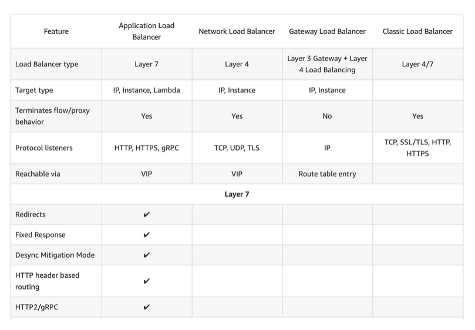

# running ingress on kubernetes EKS cluster

- if we want to run the `ingress controller` on `production level cloud kubernetes cluster` , the `routing/ingress rules` that we have defined `ingress-public.yml` and `ingress-auth.yml` will `remain unchanged`

- we can `simply port these ingress rules and apply the changes to deploy to the cluster` onto the `cloud` in order to use them

- we need to `install` the `ingress controller itself` onto the `cloud kubernetess cluster such as EKS cluster`

- we did thaq `on the minikube kubernetes cluster` by just running the `minikube addons enable ingress` command as `kubernetes nginx ingress controller` act as the `addons` on the `minikube local kubernetes cluster`

- its hard to `install the kubernetes nginx iongress controller` on `cloud`

- we need the help of the `kubernetes infgress nginx reference manual` to `perform this action` [kubernetes ingress nginx Deployment](https://kubernetes.github.io/ingress-nginx/deploy/)

- if we goto the `quick start Guide` or `prerequisite Generic Deployment command`

- then we need to install the `ingress nginx controller` using the command as below

    ```bash
        wget kubectl apply -f https://raw.githubusercontent.com/kubernetes/ingress-nginx/controller-v1.8.2/deploy/static/provider/aws/deploy.yaml
        # here we are downloading the deploy.yaml which will help in installing the ingress-nginx on aws
        # here we will be getting the deploy.yml file from github
        
        kubectl apply -f deploy.yaml
        # here applying the changes so that kubernetes resource can be deployed to the cluster
        # there many kubernetes object will be created inside the ingress-nginx namespace
        # this namespace also going to be get created
        # it will going to create network load balancer (NLB) this time 
        # few extension of the ingress-nginx controller will also be installed as a part of this 
        # the output will be as below 
        namespace/ingress-nginx created  # here we can see the namespace ingress-nginx been created
        serviceaccount/ingress-nginx created
        serviceaccount/ingress-nginx-admission created
        role.rbac.authorization.k8s.io/ingress-nginx created
        role.rbac.authorization.k8s.io/ingress-nginx-admission created
        clusterrole.rbac.authorization.k8s.io/ingress-nginx created
        clusterrole.rbac.authorization.k8s.io/ingress-nginx-admission created
        rolebinding.rbac.authorization.k8s.io/ingress-nginx created
        rolebinding.rbac.authorization.k8s.io/ingress-nginx-admission created
        clusterrolebinding.rbac.authorization.k8s.io/ingress-nginx created
        clusterrolebinding.rbac.authorization.k8s.io/ingress-nginx-admission created
        configmap/ingress-nginx-controller created
        service/ingress-nginx-controller created
        service/ingress-nginx-controller-admission created
        deployment.apps/ingress-nginx-controller created
        job.batch/ingress-nginx-admission-create created
        job.batch/ingress-nginx-admission-patch created
        ingressclass.networking.k8s.io/nginx created
        validatingwebhookconfiguration.admissionregistration.k8s.io/ingress-nginx-admission created


        # if we want to see all the resource created then we can see that as below 
        kubectl get all -n ingress-nginx
        # seeing all the kubernetes resources created inside the ingress-nginx namespace
        NAME                                           READY   STATUS      RESTARTS   AGE
        pod/ingress-nginx-admission-create-hmcm2       0/1     Completed   0          16m
        pod/ingress-nginx-admission-patch-tl8xn        0/1     Completed   1          16m
        pod/ingress-nginx-controller-cbf4d676f-4vbpd   1/1     Running     0          2m19s # creaated the POD named as ingress-nginx-controller from Deployment

        NAME                                         TYPE           CLUSTER-IP     EXTERNAL-IP                                                                        PORT(S)                      AGE
        service/ingress-nginx-controller             3e087200a8848d1b8af3ce81e5c789-cbcfcb643bcbe84d.elb.eu-central-1.amazonaws.com   80:31555/TCP,443:31590/TCP   17m
        # here it is the service as ingress-nginx-controller 
        service/ingress-nginx-controller-admission   ClusterIP      10.100.11.71   <none>                                                                             443/TCP                      17m

        NAME                                       READY   UP-TO-DATE   AVAILABLE   AGE
        deployment.apps/ingress-nginx-controller   1/1     1            1           17m # creaated the POD named as ingress-nginx-controller from Deployment

        NAME                                                  DESIRED   CURRENT   READY   AGE
        replicaset.apps/ingress-nginx-controller-7f45b6c69b   0         0         0       3m30s
        replicaset.apps/ingress-nginx-controller-cbf4d676f    1         1         1       17m

        NAME                                       COMPLETIONS   DURATION   AGE
        job.batch/ingress-nginx-admission-create   1/1           5s         17m
        job.batch/ingress-nginx-admission-patch    1/1           6s         17m


    ```

- here if we see the `ingress-nginx Service which is a LoadBalancer service` which will be having the `port 80 and port 443` connected to it

- we can see the `details of ingress-nginx controller service details` as below

    ```bash
        kubectl get svc ingress-nginx -n ingress-nginx -o yaml
        # getting the YAML definition for the ingress-nginx Service
        # the output wilol be as below 
        apiVersion: v1
        kind: Service
        metadata:
        annotations:
            kubectl.kubernetes.io/last-applied-configuration: |
            {"apiVersion":"v1","kind":"Service","metadata":{"annotations":{"service.beta.kubernetes.io/aws-load-balancer-backend-protocol":"tcp","service.beta.kubernetes.io/aws-load-balancer-cross-zone-load-balancing-enabled":"true","service.beta.kubernetes.io/aws-load-balancer-type":"nlb"},"labels":{"app.kubernetes.io/component":"controller","app.kubernetes.io/instance":"ingress-nginx","app.kubernetes.io/name":"ingress-nginx","app.kubernetes.io/part-of":"ingress-nginx","app.kubernetes.io/version":"1.8.1"},"name":"ingress-nginx-controller","namespace":"ingress-nginx"},"spec":{"externalTrafficPolicy":"Local","ipFamilies":["IPv4"],"ipFamilyPolicy":"SingleStack","ports":[{"appProtocol":"http","name":"http","port":80,"protocol":"TCP","targetPort":"http"},{"appProtocol":"https","name":"https","port":443,"protocol":"TCP","targetPort":"https"}],"selector":{"app.kubernetes.io/component":"controller","app.kubernetes.io/instance":"ingress-nginx","app.kubernetes.io/name":"ingress-nginx"},"type":"LoadBalancer"
            }
            }
            service.beta.kubernetes.io/aws-load-balancer-backend-protocol: tcp
            service.beta.kubernetes.io/aws-load-balancer-cross-zone-load-balancing-enabled: "true"
            service.beta.kubernetes.io/aws-load-balancer-type: nlb
        creationTimestamp: "2024-02-18T19:19:07Z"
        finalizers:
        - service.kubernetes.io/load-balancer-cleanup
        labels:
            app.kubernetes.io/component: controller
            app.kubernetes.io/instance: ingress-nginx
            app.kubernetes.io/name: ingress-nginx
            app.kubernetes.io/part-of: ingress-nginx
            app.kubernetes.io/version: 1.8.1
        name: ingress-nginx-controller
        namespace: ingress-nginx
        resourceVersion: "19443"
        uid: 13e08720-0a88-48d1-b8af-3ce81e5c789f
        spec:
        allocateLoadBalancerNodePorts: true
        clusterIP: 10.100.59.11
        clusterIPs:
        - 10.100.59.11
        externalTrafficPolicy: Local
        healthCheckNodePort: 31637
        internalTrafficPolicy: Cluster
        ipFamilies:
        - IPv4
        ipFamilyPolicy: SingleStack
        ports:
        - appProtocol: http # here we are using the http port 80
            name: http
            nodePort: 31555
            port: 80
            protocol: TCP
            targetPort: http
        - appProtocol: https # here we are using the port  as https 443
            name: https
            nodePort: 31590
            port: 443
            protocol: TCP
            targetPort: https
        selector:
            app.kubernetes.io/component: controller
            app.kubernetes.io/instance: ingress-nginx
            app.kubernetes.io/name: ingress-nginx
        sessionAffinity: None
        type: LoadBalancer # here we can see the Service type as Of LoadBalancer
        status:
        loadBalancer:
            ingress:
            - hostname: a13e087200a8848d1b8af3ce81e5c789-cbcfcb643bcbe84d.elb.eu-central-1.amazonaws.com

    ```

- instead of `patching` the `changes onto the kubernetes cluster` as `kubectl apply -f https://raw.githubusercontent.com/kubernetes/ingress-nginx/controller-v1.8.2/deploy/static/provider/aws/deploy.yaml` better to `get the file` using the `wget command` and then `walk through the yaml` to perform the `changes if needed be` and the `deploy to the kubernetes cluster using apply command`

- if we are `deploying the ingress-controller` to the `eks cluster` wen need to choose which `loadBalancer Type` we need to use
  
  - Layer 4 :- `use TCP as listener protocol` for `port 80 and 443`

    :- `Layer4 LoadBalancer is a lower level load balancer`

    :- `Layer4 LoadBalancer` only going to `inspect the raw packetr data` and `coning from the loadBalancer`
  
  - Layer 7 :- `use HTTP as listener protocol` for `port 80 and 443` and `terminate TLS in ELB rather than the ingress controller`  

    :- `Layer7 LoadBalancer is a high level load balancer`

    :- `Layer4 LoadBalancer` going to use the `http and https to listen` hence can operate on the `get and post requests`

- here we can which type of `LoadBalancer` uses which `Layer`

- 

- here as for the `flkeetman microservice system` we will be using the `Layer4 LoadBalancer` as we are using the `web Sockets`

- the `WebSockets` are not `http` , hence if we `setup the Layer7 LoadBlancer such as ALB` then the `web-socket` `can't pass through`

- when we are not in `minikube local kubernetes cluster` the `ingress controller` sits behind the `LoadBlancer` unlike `minikube` where we are calling the `ingress controller directly`

- hence we will get `all the benifit from the LoadBalancer` such as `redundancy and node failure`

- if a `node goes down` under the `cluster` stillewr can access the `reroute it using the loadBalancer`

- here `we need only one loadBalancer` and the `ingress ntginx controller` will fanout to `multiple services` in that case

- the `configMaps` will help in fetch the `additional extension for the ingress nginx controller`

- we can also validate the same `AWS Mgmt consiole` &rarr; `EC2` &rarr; `LoadBalancer` in this case 

- if we are using the `kops kubernetes cluster` we can see `another LoadBalancer` as the `kops` will create one for the `kubernetes APi Server` so that the `kubectl` command can work 

- now we can deploy the `ingress-public.yml` and `ingress-auth.yml` file  that we have created 

- but before that we need to create the `kubernetes sectrets` for the `basic Authentication`

- we can do that as below 

    ```bash
        minikube start --driver=docker
        # starting up the minikube kubernetes local cluster

        kubectl get secret basic-auth -o yaml
        # here will try to fetch basic-auth kubernetes secrets that we created in YAML format
        # the output will be as below 
        apiVersion: v1
        data:
        auth: YWRtaW46JGFwcjEkNTc2ZXRoM3MkUi5QcTBGU1VCYURPQy5zd2lhT0F4MAo=
        kind: Secret
        metadata:
        creationTimestamp: "2024-02-18T12:19:13Z"
        name: basic-auth
        namespace: default
        resourceVersion: "118474"
        uid: 74f37a75-8d35-49af-9ec6-c56cbe9b2ce2
        type: Opaque


    ```

- referncing this we can create the `kubernetes secrets` as `secrets.yml` as below 

    ```yaml
        secrets.yml
        ===========
        # here we can remove the un-necessary field in this case
        apiVersion: v1 # here the apiVersion of the kubernetes secret as v1 as it belong to the core Group
        data: # defining the data where the key and value pair been defined
            auth: YWRtaW46JGFwcjEkNTc2ZXRoM3MkUi5QcTBGU1VCYURPQy5zd2lhT0F4MAo=
        kind: Secret # kind of object we are refering 
        metadata: # name of the secret and namespace
            name: basic-auth
            namespace: default
        type: Opaque # type as Opaque as we are using the userdefined  secrets

    ```

- we can also use the `kubernetes secrets` creation command as well `kubectl create secret generic basic-auth --from-file=auth` but that is an `adhoc command` and `not recomended to use` hence creating the `kubernetes secrets` as `YAML` file will be a `recomended change` in this case

- we can use the command as `kubectl get <resource> <resource-name> -o yaml` which will `create the YAML definition for the resource` we can `reference` that `in another cluster`  


- here as we are using the `ingress nginx controller` service  as the `kubernetes LoadBalncer service` then we can `convert all the rest of the Service` as `ClusterIP` as this `ingress nginx cintroller and POD and service` will fanout the `Service` associated with the `PODs`

- if we have any other `Service` apart from the `ingress nginx controller service` as the `NodePort or LoadBalancer` then we can convert that to `ClsuterIP` Service

- we can change the `Services.yml` file as below 

    ```yaml
        services.yml
        ============
        apiVersion: v1 # here the Service belong to the v1 version as the Services belong to the core group
        kind: Service # here we are using the kubernetes kind of kubernetes object as Service in this case
        metadata: # here the name of the kubernetes service being as fleetman-webapp
            name: fleetman-webapp
        spec: # here defining the spec as Specification for kubernetes Service
        selector: # defining the selecto which will select the POD based on the POD label
            app: webapp
        ports: # ports that we want to open using the Services
        - name: http # name of the port that we want to allowed by service
            port: 80 # allowing the traffic on port 80 and container Port also 80 in this case
            protocol: TCP # protocol Used for the Service
        type: ClusterIP # here the type of Service being as ClusterIP

        ---

        apiVersion: v1 # here the Service belong to the v1 version as the Services belong to the core group
        kind: Service # here we are using the kubernetes kind of kubernetes object as Service in this case
        metadata: # here the name of the kubernetes service being as fleetman-queue
            name: fleetman-queue
        spec: # here defining the spec as Specification for kubernetes Service
        selector: # defining the selecto which will select the POD based on the POD label
            app: queue
        ports: # ports that we want to open using the Services

        - name: admin # name of the port that we want to allowed by service
            port: 8161 # allowing the traffic on port 8161 and container Port also 8161 in this case
            protocol: TCP # protocol Used for the Service

        - name: endpoint # defining another port which  we want to consider
            port: 61616 # here this is the nedpoint for the allowing the traffic on port 61616 and container Port also 8161 in this case
            protocol: TCP # protocol Used for the Service

        type: ClusterIP # here the type of Service being as ClusterIP

        ---

        apiVersion: v1 # here the Service belong to the v1 version as the Services belong to the core group
        kind: Service # here we are using the kubernetes kind of kubernetes object as Service in this case
        metadata: # here the name of the kubernetes service being as fleetman-position-tracker
            name: fleetman-position-tracker
        spec: # here defining the spec as Specification for kubernetes Service
        selector: # defining the selecto which will select the POD based on the POD label
            app: position-tracker
        ports: # ports that we want to open using the Services

        - name: api # name of the port that we want to allowed by service
            port: 8080 # allowing the traffic on port 8080 and container Port also 8080 in this case
            protocol: TCP # protocol Used for the Service

        type: ClusterIP # here the type of Service being as ClusterIP

        ---

        apiVersion: v1 # here the Service belong to the v1 version as the Services belong to the core group
        kind: Service # here we are using the kubernetes kind of kubernetes object as Service in this case
        metadata: # here the name of the kubernetes service being as fleetman-api-gateway
            name: fleetman-api-gateway
        spec: # here defining the spec as Specification for kubernetes Service
        selector: # defining the selecto which will select the POD based on the POD label
            app: api-gateway
        ports: # ports that we want to open using the Services

        - name: rest # name of the port that we want to allowed by service
            port: 8080 # allowing the traffic on port 8080 and container Port also 8080 in this case
            protocol: TCP # protocol Used for the Service

        type: ClusterIP # here the type of Service being as ClusterIP


    ```

- we need to then `deploy` the `secrets.yml` and `ingress-public.yml` and `ingress-auth.yml`

    ```bash

        kubectl apply -f .
        # here we will be Deploying all the workloads.yml and service.yml and storage-aws.yml and mongo-stack.yml
        # this will deploy the regular workload  and services onto the kubernetes EKS cluster


        kubectl apply -f secrets.yml
        # here we are Deploying the secrets for the basic-authentication into the eks Kubernetes cluster
        # the output will be a s below 
        secret/basic-auth created

        
        kubectl apply -f secrets.yml ingress-public.yml 
        # deploying the kubernetes cluster bby applying the changes in this case 
        # the output will be as below 
        ingress.networking.k8s.io/ingress-public created

        kubectl apply -f secrets.yml ingress-auth.yml 
        # deploying the kubernetes cluster bby applying the changes in this case 
        # the output will be as below 
        ingress.networking.k8s.io/ingress-auth created


    ```


- now here only the `ingress-nginx controller` service which is `LoadBalancer Service` which will deal with the `all incoming traffic` 

- we can see that info using the command as below 

    ```bash
        kubectl get svc -n ingress-nginx
        # fetching the service from the ingress-nginx namespace
        # here we will get the output as below
        NAME                                 TYPE           CLUSTER-IP     EXTERNAL-IP                                                                        PORT(S)                      AGE
        ingress-nginx-controller             LoadBalancer   10.100.59.11   a13e087200a8848d1b8af3ce81e5c789-cbcfcb643bcbe84d.elb.eu-central-1.amazonaws.com   80:31555/TCP,443:31590/TCP   31h
        ingress-nginx-controller-admission   ClusterIP      10.100.11.71   <none>                                                                             443/TCP                      31h

    ```