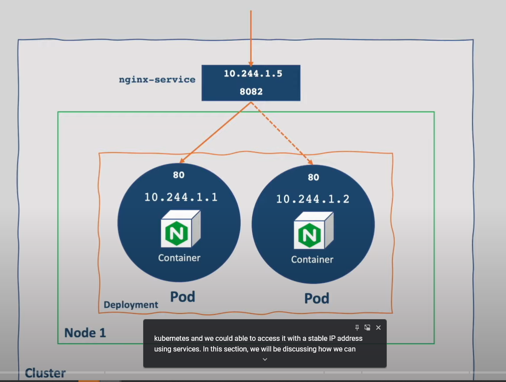
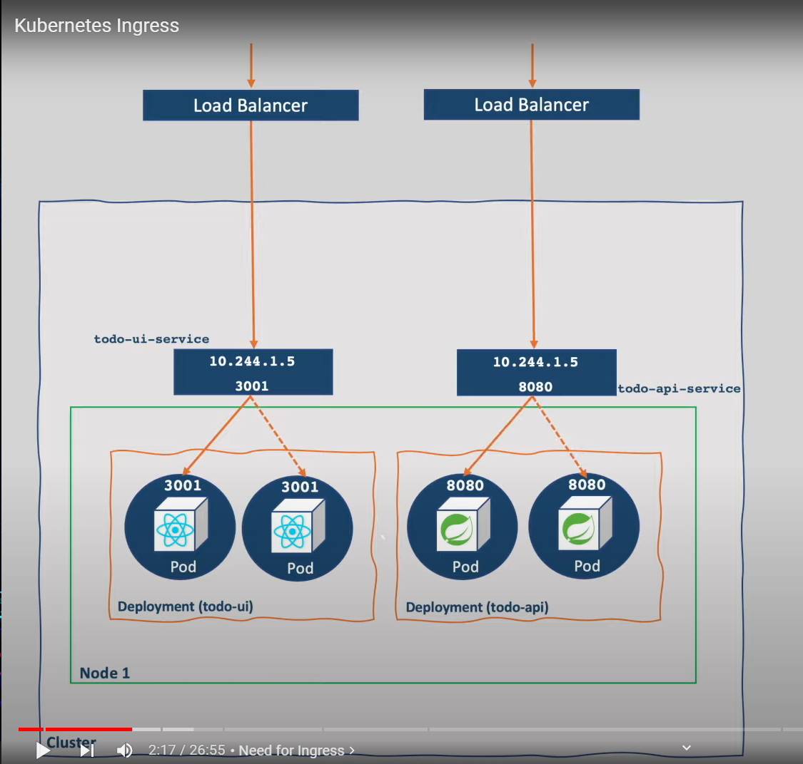
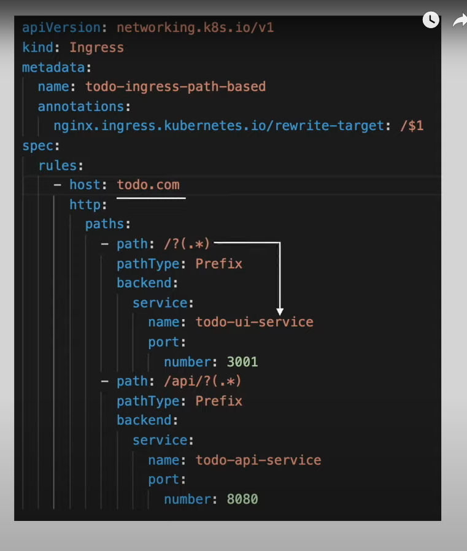
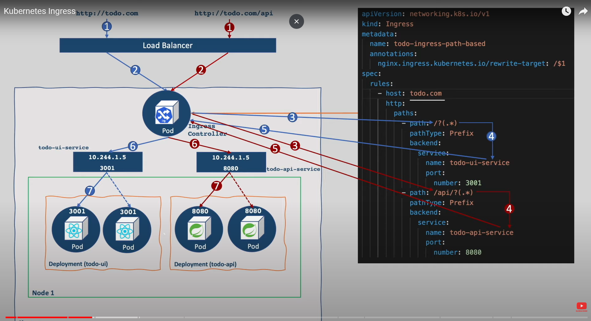
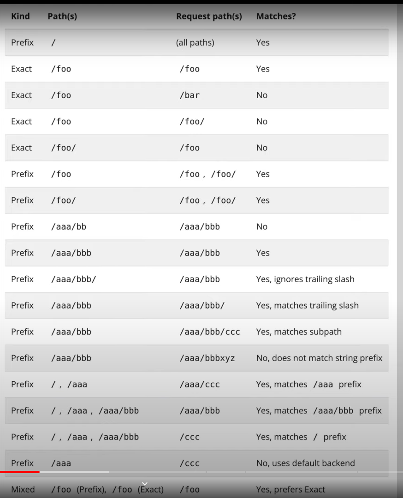

# kubernetes ingress by Pavan Youtube

- here we have `deployed 2 nginx POD` into the `kubernetes cluster` and access them using the `minikube stable ip address` as below 

- 

- **Agenda**

- here we will learn `How to access that same service using the ingress` rather than the `Stable IP address`

- how to `secure` the `application url` using the `https` along with the `ingress`

<br/><br/>

- we know that `one of the way of exposing the Application outside the kubernetes cluster` by using the `NodePort Service`

- with the `help of NodePort Service` we are actually `exposing` A `port on each Node inside the kubernetes cluster` and `exposing it outside of the cluster`

- the `good thing` with the `NodePort Service` being that `User` can call `any node by their IP` with the `nodePort number` then it will going to `access the POD running inside the cluster`

- the `Bad thing` with the `NodePort Service` being `Ports values` should be between `30000-32767`

- another `Bad thing` with the `NodePort Service` being `node ip` will get `reseted` once the `node get restarted` and opening the `ports` inside the `Node` will not be safe as well 

- another `approach` of exposing the `kubernetes Service which been linked to our POD application` to the `outside world` using the `LoadBalacer Service`

- but this `LoadBalacing Service` will going to work if we are working on the `GKE(google kubernetes engine) or amazon EKS(Elastic Kubernetes Service)`

- when `we are in bare metal` we need to set the entry point as `proxy server` 

- when we are creating the `Service type` as `LoadBalacer` a `new LadBalacer` will `going to be get created` in `cloud`

- we need to pay for `each loadBalancer` thats been created inside the `kubernetes cluster` 

- we have `multiple Service to expose` then it will be `difficult` to `manage all the loadBalancer for the service` and there will be a `increase in cost as well`

- 

- for example:-
  
  - if we have the `2 PODs which need to expose to outside world`
  
  - we have the `simple todo application` which been developed in `reactJS`
  
  - we also have the `simple todo api` which been deployed in `springBoot`
  
  - then when we deploy the `both the Services exposed to the outside world` as the `LoadBalancer` then `2 Classic LoadBalancer` will be `created for the same` which `can be costly`
  

- what if we have `only one load balancer` which will be `receive all the request` and `redirect to the request to particular Service Route` then for that we can use the `ingress` , which will going to `redirect` using `hosts or path`

- in `ingress` we will declare `which request will go to which Service`

- here we will be using the `ingress Rules` which will help `in redirecting the route request to a particular service`

- in this case we can redirect the `todo.com` to `todo-ui-service` and `todo.com/api/` to `todo-api-service`

- 

- wring this `ingress rule` to `redirecting the route request to a particular service` `will not be enough` , but in order to `process the ingress rule` we need to use the `ingress controller` which will read the `ingress rule and process them`

- `ingress rule` `does not do much` without the `ingrss controller` 

- we must `deploy an ingress controller` to watch for this `ingress rules`

- without the `ingress controller` the `ingress rule` will going to `perform any action` , hence we need to `deploy the ingress controller` onto the `kubernetes cluster`

- when we make the `http request` then the `ingress controller inspect the http request` will look into the `ingress rules` and `redirect them to the correct POD and associated Service` baseed on the `ingress rule that we have defined`

- when we use the `http://todo.com` then it will hit the `LoadBalancer` then it will goto the `ingress controller POD` and read the `ingress rule defined` and decide which `Service` to call and once decided then `Service` will `redirect to the corresponding POD` which reaches to the `Desired POD`

- then same process whill happen then it will performt the same action `http://todo.com/api`

- 

- then we don't need the `nodePort or LoadBalancer` as the `ServiceType` , as the `Ingress Controller` are in place which is a `POD` and `can access clusterIP Service`

- we can defined the `Services as type as ClusterIP` and `ingress controller` is a `POD` can access that `ClusterIP Service`

- **Ingress in Action**

- when we are running `minikube kubernetes cluster with docker driver` then `ingress` and `ingress-dns` addons are supported in `Linux`

- `minikube kubernetes cluster with docker driver` for the `MacOS and windows` machine `ingress does not work as expected`

- if we are running on `macOS` then we need to create the `minikube kubernetes cluster with virual machine enabled` as `minikube start --vm=true <cluster name>`

- then it will be using the `hyperkit driver` instead of the `docker driver` in that case for the `minikube kubenetes cluster` inside the `MacOS`

- if we want to deploy the `kubernetes ClusterIP Service` then we need to define the `kubernetes ingress`

- we need to deploy the `kubernetes ingress controller` onto the `minikube kubernetes cluster`

- there are many `3rd party implementation of ingress controller` available in the market such as:-
  
  - `haproxy`
  
  - `traefik` 
  
  - `istio`
  
  - `nginx` :- this `implementation` of the `ingress controller` will be maintained by `kubernetes itself`
  
- we can  `activate` the `nginx ingress controller` inside the `minikube kubernetes cluster` by using the command as below

  ```bash
      minikube addons enable ingress -p <cluster name>
      # this will going to enable the nginx ingress controller on out cluster
      # for example we can use it as below 
      minikube addons enable ingress -p minikube
      # here minikube is the kubernetes cluster name as minikube 
      # this will install the kubernetes nginx ingress controller implementation 


  ```

- if we want to verify the `nginx ingress controller` running or not then we use the command as 

  ```bash
      kubectl get po -n ingress-nginx
      # here the we are looking into the POD as nginx in this case
      # this will show the nginx ingress controller POD been running or not 
      # the output will be as below

      NAME                                        READY   STATUS      RESTARTS       AGE
      ingress-nginx-admission-create-dsmqj        0/1     Completed   1              12d
      ingress-nginx-admission-patch-br8wm         0/1     Completed   2              12d
      ingress-nginx-controller-7c6974c4d8-6tvlz   1/1     Running     24 (13h ago)   12d


  ```

- the `nginx-ingress controller` is a `POD` which got exposed using the `Service` as below which will be a `NodePort Service` for the `nginx-ingress controller` POD

  
  ```bash
      kubectl get svc -n ingress-nginx
      # here we are checking for the Service inside the ingress-nginx namespace
      # the output will be as below in this case

      NAME                                 TYPE        CLUSTER-IP      EXTERNAL-IP   PORT(S)                      AGE
      ingress-nginx-controller             NodePort    10.104.39.52    <none>        80:32266/TCP,443:32423/TCP   12d
      ingress-nginx-controller-admission   ClusterIP   10.109.176.55   <none>        443/TCP                      12d

  ```

- as the `minikube kubernetes cluster` doesnot support the type as `LoadBalancer` hence the `NodePort Service` being creaated for the `Same`

- if we are running on the `cloud` then we will have the `nginx-ingress` having the `Service type` as `LoadBalancer` instead of the `NodePort` Service

- now we have the `nginx ingress controller` is ready to `process` the `ingress rules`

- we will be using the `ingress rules` to access the `nginx ingress controller` and then `redirect the request` to specific `Service Type`

- here we can define the `nginx ingress rules` as below 

  ```yaml
      nginx-ingress-demo.yml
      =======================
      # here we can fetch the apiVersion from the command as kubectl api-resources -o wide | grep ingress
      apiVersion: networking.k8s.io/v1 # using the specific Ingress command in this case over here
      kind: Ingress # here the kubernetes object will be of type as Ingress
      metadata: # here the name of the ingress we can provide as the nginx-ingress
        name: nginx-ingress
      spec: # defining the specification for the ingress rules in this case
        rules: # rules i.e ingress rules for redicrecting the request been defined in here which will be considered by the ingress controller
          - host: nginx.demo.com # inside the rules we can define multiple Host in this case where we can define the hostName where we can define multiple path inside host
            http: # here the http forwasrding to the Service
              paths: #here the paths is the array where we can define muliple endpoint for the Same Domain Name
                - path: / # here we are using the root endPont in here
                  pathType: Prefix  # here for everypath we need to define the pathType which is Prefix
                  backend: # here we are defined as which backend the request must to
                    service: # here we will define the Service Name in this case
                      name: <Service Name>
                    port: # port number of the corresponsing Service 
                      number: <port number>


  ```

- here the `pathType` can be one of the `following values` in kubernetes as below

- 

- the `values` for the `pathType` can be as below :- 

  - `Prefix` :- the `url` should match the `path` split by `/` 
             :-  `/foo` will allow the `/foo and /foo/`
             :- if we have defined the `path` as `/aaa/bbb` then it should also match `/aaa/bbb/ccc` in this case when the `pathType` as `prefix`
  
  - `Exact` :- the `url with the endPoint` should match `path exactly` defined with the `case Sensitivity` , with exact  `/foo` will allow only `/foo` not the `/foo/`
  
  - `Implementation Specific` :- which be decided by the `ingress controller`
  
- we can deployt this changes to the `Cluster` by `applying the changes` onto the `kubernetes definition file`

- we can execte this as below 

  ```bash
      kubectl apply -f nginx-ingress-demo.yml
      # deploying the changes to the kubernetes clustyer using the command as below 

      # we can see the ingress created with the command as below 
      kubectl get ing/ingress 
      # here the ingress in the defaault kubernetes namespace in this case
      # here we will be using the ingress Class as niginx in this case
      # when the className as nginx meaning that it is using the nginx controller in this case
      # Address will be taking sometime to be populated
      # when we are in cloud the Address will be the loadbalancer DNS Name and when we are in minikube then will be `minikube ip address` if we are using the `docker driver` in linux
      # but if we are using the `minikube with vm driver which will go for the hyperkit driver then it will be as localhost` 

      
  ```

- here we will be using the `ingress Class` as `niginx` in this case

- also we can see the `address` is `empty` as it will take sometime to `assign the address to the ingress` 

- in we are using the cloud then the `address` will be the address of the `LoadBalancer IP address`

- if we are using the `minikube kubernetes cluster with vm as driver` then we can see the `Address` will be as `localhost`

- if we are using the `minikube kubernetes lcuster with docker driver` then `Address` will be as the `minikube IP Address`

- but when we will be accessing the `domain name` using the `nginx.demo.com` then we can see that `site can't be reached`

- this is because the `nginx.demo.com` is not the valid `DNS name`

- when we `wrtire` the `DNS name` in the `web browser` that should resolve into the `IP Address`

- here we want that if we are using `nginx.demo.com`  as the `DNS name` then that should resolve into `minikube IP`

- we can see the `minikube IP Address` using the command as 

  ```bash
      minikube ip -p <clustername>
      # this will provide the minikube IP Address in this case
      minikube ip -p minikube
      # we will get the respinse in this case as below
      192.168.49.2

  ```

- we need to resolve the `nginx.demo.com` DNS Name to the `minikube IP` address , that can be done by editing the `/etc/hosts` file in this case

- we can define the `/etc/hosts` file by using the command as below 

  ```bash
      sudo nano /etc/hosts
      # here we are editing the `nginx.demo.com` DNS Name to the `minikube IP Address`
      127.0.0.1       localhost
      127.0.1.1       pratik-virtual-machine
      192.168.49.2    fleetman.com
      192.168.49.2    queue.fleetman.com
      192.168.49.2    nginx.demo.com # here we will be resolving ngionx.com domain name server to the minikube IP Address
      # The following lines are desirable for IPv6 capable hosts
      ::1     ip6-localhost ip6-loopback
      fe00::0 ip6-localnet
      ff00::0 ip6-mcastprefix
      ff02::1 ip6-allnodes
      ff02::2 ip6-allrouters


  ```

- on cloud we will be able to map `CMAP` name to the `LoadBalancer`

- now once the `DNS Name resolution been defined inside the /etc/hosts to the minikube` IP address then we can access the `nginx.demo.com`

- we can define the `path` as `/(.*)` which will allow all the endpoint for the `<host url>/<anything>` which bee redirected here

- if we are using the `path` as `/(.*)` then we need to add an `annotation` stating as below 

  
  ```yaml
      nginx-ingress-demo.yml
      =======================
      # here we can fetch the apiVersion from the command as kubectl api-resources -o wide | grep ingress
      apiVersion: networking.k8s.io/v1 # using the specific Ingress command in this case over here
      kind: Ingress # here the kubernetes object will be of type as Ingress
      metadata: # here the name of the ingress we can provide as the nginx-ingress
        name: nginx-ingress
        annotations: # here defining rules to define additional rules for the host and endpoint
          nginx.ingress.kubernetes.io/rewrite-target: /$1
      spec: # defining the specification for the ingress rules in this case
        rules: # rules i.e ingress rules for redicrecting the request been defined in here which will be considered by the ingress controller
          - host: nginx.demo.com # inside the rules we can define multiple Host in this case where we can define the hostName
            http: # here the http forwasrding to the Service
              paths: #here the paths is the array where we can define muliple endpoint for the Same Domain Name
                - path: api/(.*) # here we are using the root endPont in here
                  pathType: Prefix  # here for everypath we need to define the pathType which is Prefix
                  backend: # here we are defined as which backend the request must to
                    service: # here we will define the Service Name in this case
                      name: <Service Name>
                    port: # port number of the corresponsing Service 
                      number: <port number>


  ```

- here the `annotations` inside the `metadata sections` as the `rewrite-target` below 

- here `any character captured` which comes in `path` as `api/(.*)` then we can assign as `$1` for the `rewrite-target annotations`

- then the `rewrite-target annotations` used that as the `parameters`

- whatever the definition comes after the `api/` then will be re-written to the `using the rewrite-target annotation rule`

- for example

  - if we are defining as `http://todo.com/api/api/todo` then the `/api/todo` will goto the `rewrite-target annotations` and rewritten as `http://todo.com/api/todo`

  - here the `/api` wrks like an identifier so that the `rewrite-target annotation` rule will make adjustment to `url+endpoint`

- we can define the `multiple paths` inside the `same host` using the `paths List` which is called as the `path based routing`

- we can also define the `multiple host` inside `host List` which is called as the `host based routing based routing`

- when we describe the `ingress` using the command as below , we will be able to see the `Default Backend`

  ```bash
      kubectl describe ing <ingress name>
      # here we are describing the ingress in this case here
      # here also we have described the basic-routing ingress rule in this case which will provide the Default Backend Info
      kubectl describe ing basic-routing
      # then here we can get the ingress details along with the defaulot backend
      # the output will be as below 
      Name:             basic-routing
      Labels:           <none>
      Namespace:        default
      Address:          192.168.49.2
      Ingress Class:    nginx
      Default backend:  <default>
      Rules:
        Host                Path  Backends
        ----                ----  --------
        fleetman.com        
                            /   fleetman-webapp:80 (<error: endpoints "fleetman-webapp" not found>)
        queue.fleetman.com  
                            /   fleetman-queue:8161 (<error: endpoints "fleetman-queue" not found>)
      Annotations:          <none>
      Events:
        Type    Reason  Age                From                      Message
        ----    ------  ----               ----                      -------
        Normal  Sync    11m (x2 over 11m)  nginx-ingress-controller  Scheduled for sync

  ```  

- if we are trying to access the `defined ingress rules` using the `ingress controller` and `None of the url and Path` been `matched` then it will redirect to the `Default HTTP Backend` Service

- this will be helpful to `defined the custom error message on error Routes`

- to make this work we need to define the `default-http-backend` Service which will be associated to the `POD` where we will define the `custom error messages`

- here the `Port` for the defined `default-http-backend` Service is `80`


- **configuring self signed SSL certificate for securing the ingress definition https link using the TLS certificate** 

- here we need to generate the `self signed certificate` as below 

  ```bash
      openssl req -x509 -newkey rsa:4096 -sha256 -nodes -keyout tls.key -out tls.crt -subj "/CN=fleetman.com" -days 365
      # here we want to generate the self signed certificate and private key using the openssl command
      # here we are requesting the openssl to generate the self signed certificate and private key
      # it will create the private key with the rsa toke of 4096 byte using the sha256 Algorithm
      # here we are generating the key as tls.key and certificate as tls.cert
      # this will be valid for the 365 days
      # here we are also defining the common name CN as fleeman.com as subject

  ```

- now we need to define the `self signed certificate` inside the `ingress rule` that we have defined

- for that we need to define `kubernetes secrets` which will be created from `self signed certificate`

- we can create the `Secret` with the command as below 

  ```bash
      kubectl create secret tls <secret name which should be in the form as common name separate by - rather than . followed by -tls>  --cert <self signed certificate> --key <private key>
      # here we are creating the tls self signed certificate as kubernetes secrets
      # secret name which should be in the form as subj common name separate by - rather than . followed by -tls
      # here the generated self signed certificate need to be defined as  --cert
      # here we are defining the private key that we have generated usig the command as --key
      # for example we can defined as below 
      kubectl create secret tls fleetman-com-tls --cert tls.cert --key tls.key
      # here the certificate been defined as tls.cert 
      # key been created with the tls.key
      # ecret name which should be in the form as subj common name separate by - rather than . followed by -tls
      # hence the fleetman.com become fleetman-com-tls

  ```

- now `ingress rule` we can define the `Secret that we have created` and the `hostname` will will keep our site safe

- hence we can define the `ingress` as below 

  ```yaml
      nginx-ingress-demo.yml
      =======================
      # here we can fetch the apiVersion from the command as kubectl api-resources -o wide | grep ingress
      apiVersion: networking.k8s.io/v1 # using the specific Ingress command in this case over here
      kind: Ingress # here the kubernetes object will be of type as Ingress
      metadata: # here the name of the ingress we can provide as the nginx-ingress
        name: nginx-ingress
      spec: # defining the specification for the ingress rules in this case
        tls:
          - SecretName: fleetman-com-tls # defining the name of the Secret that we have generated in the preveious step
            hosts: # here defining the host as the HostName where we want to access
              - "fleeman.com" # here the hostname will be same as the DNS name
        rules: # rules i.e ingress rules for redicrecting the request been defined in here which will be considered by the ingress controller
          - host: fleetman.com # inside the rules we can define multiple Host in this case where we can define the hostName
            http: # here the http forwasrding to the Service
              paths: #here the paths is the array where we can define muliple endpoint for the Same Domain Name
                - path: api/(.*) # here we are using the root endPont in here
                  pathType: Prefix  # here for everypath we need to define the pathType which is Prefix
                  backend: # here we are defined as which backend the request must to
                    service: # here we will define the Service Name in this case
                      name: <Service Name>
                    port: # port number of the corresponsing Service 
                      number: <port number>

  ```

- we can execte this as below to `deploy it onto the cluster`

  ```bash
      kubectl apply -f nginx-ingress-demo.yml
      # deploying the changes to the kubernetes clustyer using the command as below 
  
  ```

  - now we can access the `ingress rule that we have defined and set on /etc/hosts` inside the `web-browser`
  
  - hence we can define that as `https://fleetman.com` then we can able to see the `warning on the web browser`
  
  - as we define it as `self signing certificate` hence `we can goforward` with the `trusting the certificate request` or we can write `thisisunsafe`
  
  - we can see the `certificate details as self signing certificate in this case`