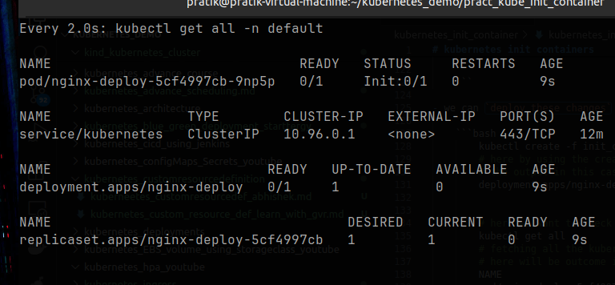
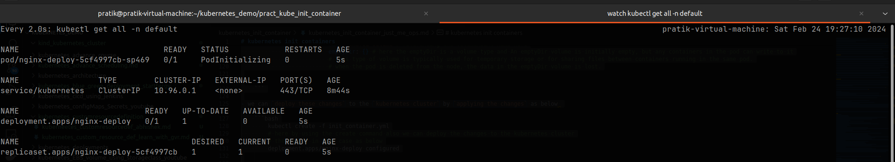
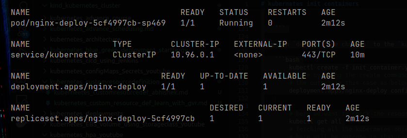

# kubernetes init containers

- what is a `init container` and how to `use an init container` ?

- a `POD` can have `one or more container`

- if we schedule `multiple container` inside the `POD` then all the `container` will be `keep on running` 

- but the `init containers` are `special type of container` which will be `launched and run to complete` and then we can have the `other POD container` inside the `POD`

- the `usecase` of the `init container` being `if we want to run anything to the actual POD container` we `can provide that` to the `init container`

- the `init container` will get to run `before` the `actual POD container` will going to get run 

- lets suppose we have the `POD container` but we don't want to `perform some action in the actual POD container` in order to keep the `container image` `very small`

- we can have `another container` which does the `same work for the actual container inside the POD`

<br/><br/>

- here one example would be `if we have actual container` which will be `Deploying the webApplication`

- but `before` that `we want to checkout to the github and clone the repo and put to a volume which been shared between the initial container and actual POD container` so that `actual container` can `Deploying the webApplication` that can be performed inside the `init container`

- but `we need to keep in mind` that `actual container` `will not start` `untill the init container get completed`

- hence we can't keep the `init container` running `forever` , it will `perform the action` then the `init container` should be `completed`

- we also can have `multiple init container` inside the `single POD along with the actual POD container`

- but the `init container` will start `sequencially` , hence the `first init container` will run followed by `second init container` and etc

- once all the `init container` complete then the `actual container` will going to get started

- if for any reason `init container` `failed` then the `actual container` will `never going to get created`

- the `actual POD container` will keep on `restarting the POD` if that saw the `init container` been `gettting failed` , in that case `again` the `init container will get running` unless the `init container execute the exit to get out of the container successfully`
 
- in order to `avoid this challenge` we need to set the `restartPolicy` as `never` in this case

- so when the `init container` `failed` then it `will not going` to `run the actual POD container` until its fixed

<br/><br/>

- here in the  demo we will be creating the `volume` first which will be shared between the `init container` and `actual nginx POD container` and `host system`

- here the `init container` will create the `index.html` inside the `shared volume` and `exit the container` so that `actuial nginx POD container` been `provisioned`

- then that `index.html in the shared volume as its volumeMount to the same diorectory` will be picked by the `actual POD container` to the `/usr/share/nginx/html` directory to `spun` the `index.html` provided

- as we also want to `expose the nginx POD` onto outside we can create the `Services` for the same as well 

- we can see the `kubernetes cluster info` using the command as below 

    ```bash
        kubectl cluster-info
        # here we are running the kubectl cluster-info to know the details about the cluster
        # here the output will be as below 
        Kubernetes control plane is running at https://127.0.0.1:37973
        CoreDNS is running at https://127.0.0.1:37973/api/v1/namespaces/kube-system/services/kube-dns:dns/proxy

        To further debug and diagnose cluster problems, use 'kubectl cluster-info dump'.


        # we can also see the nodes details using the command as below 
        kubectl get nodes -o wide
        # here we are fetching the kind kubernetes cluster nodes info in this case
        # the output will be as below in this case
        NAME                      STATUS   ROLES           AGE   VERSION   INTERNAL-IP   EXTERNAL-IP   OS-IMAGE             KERNEL-VERSION     CONTAINER-RUNTIME
        mycluster-control-plane   Ready    control-plane   31h   v1.26.0   172.18.0.3    <none>        Ubuntu 22.04.1 LTS   6.5.0-21-generic   containerd://1.6.12
        mycluster-worker          Ready    <none>          31h   v1.26.0   172.18.0.4    <none>        Ubuntu 22.04.1 LTS   6.5.0-21-generic   containerd://1.6.12
        mycluster-worker2         Ready    <none>          31h   v1.26.0   172.18.0.2    <none>        Ubuntu 22.04.1 LTS   6.5.0-21-generic   containerd://1.6.12


    ```

- we can create the `init container` definition yaml as below in this case where the `volume` will be shared between the `init POD container and actual POD containr`

    
    ```yaml
        init_container.yml
        ===================
        apiVersion: apps/v1 # here the apiVersion is apps/v1 as the Deployment belong to the apps core group
        kind: Deployment # here the type of kubernetes object will be of type Deployment
        metadata: # here defining the name for the Deployment as nginx-deploy
            name: nginx-deploy
            labels: # definign the label for the Deployment
                run : nginx
        spec: # defining the specification for the Deployment in this case
            selector: # defining the selector and based on which POD label will be selected
                matchLabels:
                    run : nginx
            replicas: 1
            template: # defining the template for the POD definition
                metadata: # here the POD label been described based on which the Services and deployment will going to pick it 
                    labels: # here we are defining the POD labels
                        run : nginx
                spec: # definign the specification for the POD definition
                    
                    initContainers: # here defining the deficition for the init container in here
                        - name: busybox # name of the init container
                          image: busybox # image for the init container
                          command: ["/bin/sh"] # command for the container
                          args: ["-c","echo 'welcome to kubernetes' > /nginx-share/index.html "] # args passerd to the container
                          volumeMounts: # mounting the volumes of the initContainers
                            - name: shared-volume # name of the volumeMounts
                              mountPath: /nginx-share # defining the mountPath in this case for the container which will referenced by the container
                    
                    containers: # definign the POD definition in here
                        - name: nginx # name of the container
                          image: nginx # image for the container
                          volumeMounts: # mounting the volumes of the actual Container
                            - name: shared-volume # name of the volumeMounts
                              mountPath: /usr/share/nginx/html # defining the mountPath in this case for the container which will referenced by the container
                    
                    volumes: # here we are defining the volumes in this case
                        - name: shared-volume # referencing the volumeMount name here
                          emptyDir: {} # here the emptyDir is a volume type and An emptyDir volume is initially empty, but any containers in the pod can write to it
                          # This type of volume is typically used for temporary storage or for sharing files between containers running in the same pod.
                          # when the pod is deleted from the node, the data in the emptyDir volume is lost.


    ```

- we can `deploy these changes` to the `kubernetes cluster` by `applying the changes` as below 

    ```bash
        kubectl create -f init_container.yml
        # here by using the create command also we can deploy the changes to the kubernetes cluster
        # the output in this case as below
        deployment.apps/nginx-deploy configured


        # here we want to check the resources then we can see that as below 
        kubectl get all
        # fetching all the kubernetes object inside the default namespace
        # here will be outcome in that case
        NAME                               READY   STATUS    RESTARTS   AGE
        pod/nginx-deploy-5cf4997cb-vsjbs   1/1     Running   0          4m26s

        NAME                 TYPE        CLUSTER-IP   EXTERNAL-IP   PORT(S)   AGE
        service/kubernetes   ClusterIP   10.96.0.1    <none>        443/TCP   7m13s

        NAME                           READY   UP-TO-DATE   AVAILABLE   AGE
        deployment.apps/nginx-deploy   1/1     1            1           4m26s

        NAME                                     DESIRED   CURRENT   READY   AGE
        replicaset.apps/nginx-deploy-5cf4997cb   1         1         1       4m26s


    ```

- we can see `when we apply the changes the status been getting changed`

- we can see the at first the status as `init:0` &rarr; `PODinitialized` ,if initialized succdessfully the status become as `Running from the actual POD container`

- 

-  

-  

- here the `volume type` as in this case as `emptyDir` which will be created for the `share volume between the container inside the POD`

- here for the `initContainers` we are mounting the `volumes` inside the `/nginx-share` folder and for the `actual container` it will be the `/usr/share/nginx/html` folder in that case

- then we need to `create` the `kubernetes services` in order to `expose the kubernetes Deployment` hence we can try as below 

    ```bash
        
        kubectl expose deploy <deployment name> --type <Service type> --port <port number to allow traffic> --target-port <targte Port of the container>
        # here we can create the service using the command line in this case as below
        # here we are poining to the deployment and exposing it as Service
        # here the port number as --port to allow the traffic
        # here the type as --type in this case
        # here the --targret-port for the container port been described here
        
        # for example we can define as below 
        kubectl expose deploy nginx-deploy --port 80 --target-port 80 --type NodePort 
        # here we are exposing the port 80 and target port as 80 in this case
        # here the serviceType as NodePort in this case
        # exposing the deployment in this case
        # the output will be as 
        service/nginx-deploy exposed

        # here we want to check the resources then we can see that as below 
        kubectl get all
        # fetching all the kubernetes object inside the default namespace
        # here will be outcome in that case
        NAME                               READY   STATUS    RESTARTS   AGE
        pod/nginx-deploy-5cf4997cb-9np5p   1/1     Running   0          8m30s

        NAME                   TYPE        CLUSTER-IP     EXTERNAL-IP   PORT(S)        AGE
        service/kubernetes     ClusterIP   10.96.0.1      <none>        443/TCP        21m
        service/nginx-deploy   NodePort    10.96.160.45   <none>        80:30250/TCP   31s #here we can see that nodePort Service been defined

        NAME                           READY   UP-TO-DATE   AVAILABLE   AGE
        deployment.apps/nginx-deploy   1/1     1            1           8m30s

        NAME                                     DESIRED   CURRENT   READY   AGE
        replicaset.apps/nginx-deploy-5cf4997cb   1         1         1       8m30s


    ```

- we can access the `Kubernetes Service` by using the `IP_Address of the kind node` which we can get by using the command as below 

- here we will be getting the response in this case below 

    ```bash
        # we can also see the nodes details using the command as below 
        kubectl get nodes -o wide
        # here we are fetching the kind kubernetes cluster nodes info in this case
        # the output will be as below in this case
        NAME                      STATUS   ROLES           AGE   VERSION   INTERNAL-IP   EXTERNAL-IP   OS-IMAGE             KERNEL-VERSION     CONTAINER-RUNTIME
        mycluster-control-plane   Ready    control-plane   31h   v1.26.0   172.18.0.3    <none>        Ubuntu 22.04.1 LTS   6.5.0-21-generic   containerd://1.6.12
        mycluster-worker          Ready    <none>          31h   v1.26.0   172.18.0.4    <none>        Ubuntu 22.04.1 LTS   6.5.0-21-generic   containerd://1.6.12
        mycluster-worker2         Ready    <none>          31h   v1.26.0   172.18.0.2    <none>        Ubuntu 22.04.1 LTS   6.5.0-21-generic   containerd://1.6.12


        # we can use any of the node to access the service as below 
        curl 172.18.0.4:30250
        # accessing the nodePort Service on the kind kubernetes node with the NodePort Service
        # the output will be as below in this case
        welcome to kubernetes

        # we can also scale the deployment by using the command as below 
        kubectl scale deploy <name of the deployment> --replicas=<number of reploca we will be using>
        # for example
        kubectl scale deploy nginx-deploy --replicas=2
        # this command will help in increasing the replicas for the specific deployment that been mentioned 
        # here we will getv the response as below in this case
        deployment.apps/nginx-deploy scaled

        # now also if we atry to access the service we will be able to get the repsonse
        curl 172.18.0.4:30250
        # accessing the nodePort Service on the kind kubernetes node with the NodePort Service
        # the output will be as below in this case
        welcome to kubernetes

    ```

- if we are checking the `Depoloyment` then we can see the info about the `initContiner` and `actual POD container`

- here we can see the info as below in this case

    ```bash
        kubectl get all
        # here we are checking the all the kubernetes workload under the default namespace
        # here we will get the response as below in this case
        NAME                               READY   STATUS    RESTARTS   AGE
        pod/nginx-deploy-5cf4997cb-4kkss   1/1     Running   0          4m25s
        pod/nginx-deploy-5cf4997cb-9np5p   1/1     Running   0          18m

        NAME                   TYPE        CLUSTER-IP     EXTERNAL-IP   PORT(S)        AGE
        service/kubernetes     ClusterIP   10.96.0.1      <none>        443/TCP        31m
        service/nginx-deploy   NodePort    10.96.160.45   <none>        80:30250/TCP   10m

        NAME                           READY   UP-TO-DATE   AVAILABLE   AGE
        deployment.apps/nginx-deploy   2/2     2            2           18m

        NAME                                     DESIRED   CURRENT   READY   AGE
        replicaset.apps/nginx-deploy-5cf4997cb   2         2         2       18m

        # here we can see the Deployment Detail;s as below 
        kubectl describe deploy nginx-deploy
        # fetching the description on the nginx-deploy deployment
        Name:                   nginx-deploy
        Namespace:              default
        CreationTimestamp:      Sat, 24 Feb 2024 19:30:57 +0530
        Labels:                 run=nginx
        Annotations:            deployment.kubernetes.io/revision: 1
        Selector:               run=nginx
        Replicas:               2 desired | 2 updated | 2 total | 2 available | 0 unavailable
        StrategyType:           RollingUpdate
        MinReadySeconds:        0
        RollingUpdateStrategy:  25% max unavailable, 25% max surge
        Pod Template:
        Labels:  run=nginx
        Init Containers: # here we can see the detaqils about the init Container
        busybox:
            Image:      busybox
            Port:       <none>
            Host Port:  <none>
            Command:
            /bin/sh
            Args:
            -c
            echo 'welcome to kubernetes' > /nginx-share/index.html 
            Environment:  <none>
            Mounts:
            /nginx-share from shared-volume (rw) # here the shared vvolume info between the container in the POD been given
        Containers: # here we can see the detaqils about the actual Container
        nginx:
            Image:        nginx
            Port:         <none>
            Host Port:    <none>
            Environment:  <none>
            Mounts:
            /usr/share/nginx/html from shared-volume (rw)
        Volumes: # here we will getting info about the volume thats been created
        shared-volume:
            Type:       EmptyDir (a temporary directory that shares a pod's lifetime) # here we cna see the volume Type as well
            Medium:     
            SizeLimit:  <unset>
        Conditions:
        Type           Status  Reason
        ----           ------  ------
        Progressing    True    NewReplicaSetAvailable
        Available      True    MinimumReplicasAvailable
        OldReplicaSets:  <none>
        NewReplicaSet:   nginx-deploy-5cf4997cb (2/2 replicas created)
        Events:
        Type    Reason             Age    From                   Message
        ----    ------             ----   ----                   -------
        Normal  ScalingReplicaSet  20m    deployment-controller  Scaled up replica set nginx-deploy-5cf4997cb to 1
        Normal  ScalingReplicaSet  5m51s  deployment-controller  Scaled up replica set nginx-deploy-5cf4997cb to 2 from 1


    ```

- if we want to see the `status of the initContainer and PODContainer` we `can get that by describing` the `POD` definition as below 

- we can also add the `kind node name` to the `/etc/hosts` if we want to access the kubernetes service by the `name` not by the `ip address`

- we can do that as below

    ```bash
        sudo nano /etc/hosts
        # here we are using the /etc/hosts to define the DNS name
        # here we can define the kind node ip against the name and we can access that using the  name as below 
        127.0.0.1	localhost
        127.0.1.1	pratik-virtual-machine
        172.18.0.4  kworker # here defining the kind worker node as worker in the /etc/hosts file
        # The following lines are desirable for IPv6 capable hosts
        ::1     ip6-localhost ip6-loopback
        fe00::0 ip6-localnet
        ff00::0 ip6-mcastprefix
        ff02::1 ip6-allnodes
        ff02::2 ip6-allrouters

        # now also if we try to access the service we will be able to get the repsonse
        curl kworker:30250
        # accessing the nodePort Service on the kind kubernetes node with the NodePort Service
        # the output will be as below in this case
        welcome to kubernetes


    ```

- if any of the `init containers` `fails to complete` then the `actual POD container` will not going to run 

- `init containers` are the `prerequisite` for the `actual POD container` in this case

- here we will make the `deliberate change` in the `init container` to make it `fail` then we can see the `POD container` will be `waiting at the POD initializing state`

- the `initContainer` in that case will be in the `CrashedLoopback` stage

- we can make changes to the `init_container.yml` as below 

    ```yaml
        init_container.yml
        ==================
        apiVersion: apps/v1 # here the apiVersion is apps/v1 as the Deployment belong to the apps core group
        kind: Deployment # here the type of kubernetes object will be of type Deployment
        metadata: # here defining the name for the Deployment as nginx-deploy
        name: nginx-deploy
        labels: # definign the label for the Deployment
            run: nginx
        spec: # defining the specification for the Deployment in this case
        selector: # defining the selector and based on which POD label will be selected
            matchLabels:
            run: nginx
        replicas: 1
        template: # defining the template for the POD definition
            metadata: # here the POD label been described based on which the Services and deployment will going to pick it 
            labels: # here we are defining the POD labels
                run: nginx
            spec: # definign the specification for the POD definition

            initContainers: # here defining the deficition for the init container in here
            - name: busybox # name of the init container
                image: busybox # image for the init container
                command: ["asdf"] # command for the container which is not a valid comment in this case
                args: ["-c", "echo 'welcome to kubernetes' > /nginx-share/index.html "] # args passerd to the container
                volumeMounts: # mounting the volumes of the initContainers
                - name: shared-volume # name of the volumeMounts
                mountPath: /nginx-share # defining the mountPath in this case for the container which will referenced by the container

            containers: # definign the POD definition in here
            - name: nginx # name of the container
                image: nginx # image for the container
                volumeMounts: # mounting the volumes of the actual Container
                - name: shared-volume # name of the volumeMounts
                mountPath: /usr/share/nginx/html # defining the mountPath in this case for the container which will referenced by the container

            volumes: # here we are defining the volumes in this case
            - name: shared-volume # referencing the volumeMount name here
                emptyDir: {} # here the emptyDir is a volume type and An emptyDir volume is initially empty, but any containers in the pod can write to it
                # This type of volume is typically used for temporary storage or for sharing files between containers running in the same pod.
                # when the pod is deleted from the node, the data in the emptyDir volume is lost.


    ```

- we can deploy the changes to the `kubernetes cluster` by applying the changes as below 

    ```bash
        
        kubectl delete -f init_container.yml
        # removing the older container provided inside the init_container.yml
        # here the output in this case will be as below 
        deployment.apps "nginx-deploy" deleted

        kubectl apply -f init_container.yml
        # here deploying the changes to the kubernetes cluster by applying the changes in this case for the new file
        # the output will be as below in this case
        deployment.apps "nginx-deploy" created
        
        # if we want to get all the kubernetes object deployed on the default namespace as below
        kubectl get all
        # here fetching all the kubernetes resouce inisde the namespace
        NAME                               READY   STATUS                  RESTARTS     AGE
        pod/nginx-deploy-bd699bdb8-xsndn   0/1     Init:CrashLoopBackOff   1 (4s ago)   11s # here we can see that its try to restart the initContainer until get complete

        NAME                   TYPE        CLUSTER-IP     EXTERNAL-IP   PORT(S)        AGE
        service/kubernetes     ClusterIP   10.96.0.1      <none>        443/TCP        54m
        service/nginx-deploy   NodePort    10.96.160.45   <none>        80:30250/TCP   34m

        NAME                           READY   UP-TO-DATE   AVAILABLE   AGE
        deployment.apps/nginx-deploy   0/1     1            0           11s

        NAME                                     DESIRED   CURRENT   READY   AGE
        replicaset.apps/nginx-deploy-bd699bdb8   1         1         0       11s


        # but if we going to see the POD description details then we can get the below details in that case
        kubectl describe pod nginx-deploy-bd699bdb8-xsndn
        # fetching the POD desccription using the command as below 
        Name:             nginx-deploy-bd699bdb8-xsndn
        Namespace:        default
        Priority:         0
        Service Account:  default
        Node:             mycluster-worker2/172.18.0.4
        Start Time:       Sat, 24 Feb 2024 20:12:49 +0530
        Labels:           pod-template-hash=bd699bdb8
                        run=nginx
        Annotations:      <none>
        Status:           Pending
        IP:               10.244.2.3
        IPs:
        IP:           10.244.2.3
        Controlled By:  ReplicaSet/nginx-deploy-bd699bdb8
        Init Containers: # here is the info about the initContainer
        busybox:
            Container ID:  containerd://0ef0934e0484dd96c4eca54d460814d616e48ffe38d2e1be8840c1c99d249b4c
            Image:         busybox
            Image ID:      docker.io/library/busybox@sha256:6d9ac9237a84afe1516540f40a0fafdc86859b2141954b4d643af7066d598b74
            Port:          <none>
            Host Port:     <none>
            Command:
            asdf
            Args:
            -c
            echo 'welcome to kubernetes' > /nginx-share/index.html 
            State:          Waiting # current state of the initContainer as Waiting
            Reason:       CrashLoopBackOff # the reason for waiting as CrashLoopBackOff
            Last State:     Terminated # here we can see the Last State as Terminated
            Reason:       StartError
            Message:      failed to create containerd task: failed to create shim task: OCI runtime create failed: runc create failed: unable to start container process: 
            exec: "asdf": executable file not found in $PATH: unknown
            # here we can see the error Message in this case in here
            Exit Code:    128
            Started:      Thu, 01 Jan 1970 05:30:00 +0530
            Finished:     Sat, 24 Feb 2024 20:13:42 +0530
            Ready:          False
            Restart Count:  3
            Environment:    <none>
            Mounts:
            /nginx-share from shared-volume (rw)
            /var/run/secrets/kubernetes.io/serviceaccount from kube-api-access-5nrx2 (ro)
        Containers: # here id the info about the container in this case
        nginx:
            Container ID:   
            Image:          nginx
            Image ID:       
            Port:           <none>
            Host Port:      <none>
            State:          Waiting # current state of the POD container as Waiting
            Reason:       PodInitializing # the reason for waiting as PodInitializing
            Ready:          False
            Restart Count:  0
            Environment:    <none>
            Mounts:
            /usr/share/nginx/html from shared-volume (rw)
            /var/run/secrets/kubernetes.io/serviceaccount from kube-api-access-5nrx2 (ro)
        Conditions:
        Type              Status
        Initialized       False # here initiazed state as false
        Ready             False # here the ready state also mean false
        ContainersReady   False # here the containersReady state also mean false
        PodScheduled      True 
        Volumes:
        shared-volume:
            Type:       EmptyDir (a temporary directory that shares a pod's lifetime)
            Medium:     
            SizeLimit:  <unset>
        kube-api-access-5nrx2:
            Type:                    Projected (a volume that contains injected data from multiple sources)
            TokenExpirationSeconds:  3607
            ConfigMapName:           kube-root-ca.crt
            ConfigMapOptional:       <nil>
            DownwardAPI:             true
        QoS Class:                   BestEffort
        Node-Selectors:              <none>
        Tolerations:                 node.kubernetes.io/not-ready:NoExecute op=Exists for 300s
                                    node.kubernetes.io/unreachable:NoExecute op=Exists for 300s
        Events:
        Type     Reason     Age                From               Message
        ----     ------     ----               ----               -------
        Normal   Scheduled  85s                default-scheduler  Successfully assigned default/nginx-deploy-bd699bdb8-xsndn to mycluster-worker2
        Normal   Pulled     82s                kubelet            Successfully pulled image "busybox" in 2.367724119s (2.367730031s including waiting)
        Normal   Pulled     78s                kubelet            Successfully pulled image "busybox" in 2.28428559s (2.284290195s including waiting)
        Normal   Pulled     61s                kubelet            Successfully pulled image "busybox" in 2.644020601s (2.644028595s including waiting)
        Normal   Pulling    34s (x4 over 84s)  kubelet            Pulling image "busybox"
        Normal   Created    32s (x4 over 82s)  kubelet            Created container busybox
        Warning  Failed     32s (x4 over 82s)  kubelet            Error: failed to create containerd task: failed to create shim task: OCI runtime create failed: runc create failed: unable to start container process: exec: "asdf": executable file not found in $PATH: unknown
        Normal   Pulled     32s                kubelet            Successfully pulled image "busybox" in 2.319502059s (2.319551557s including waiting)
        Warning  BackOff    4s (x7 over 78s)   kubelet            Back-off restarting failed container busybox in pod nginx-deploy-bd699bdb8-xsndn_default(435eaf3e-0210-468c-80b6-4c21c199e92b)


    ```