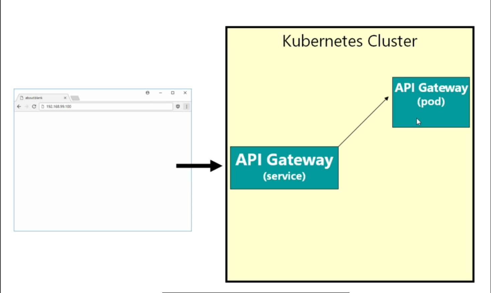
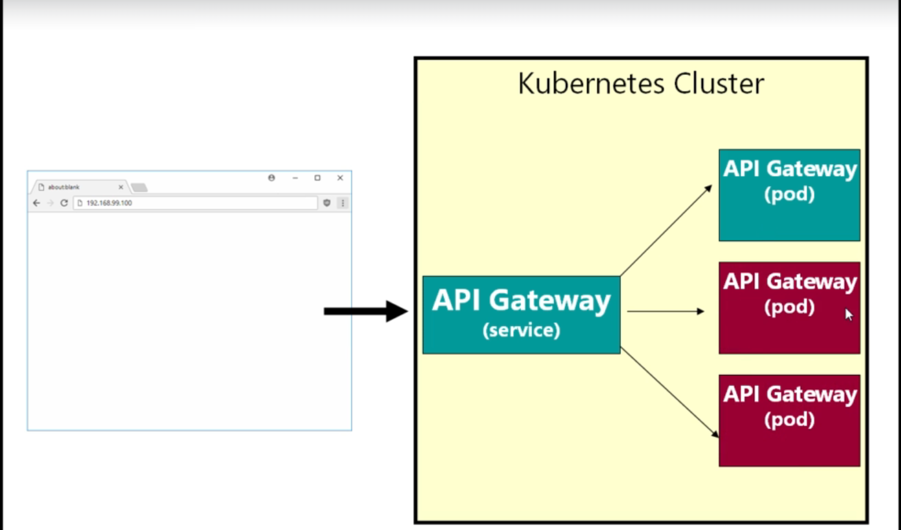

# Rediness and Liveness Probes

- on the `preveious topic` we have `configured` the `HPA(Horizontal POD AutoScaler)`

- but with the `HPA(Horizontal POD Auto Scaler) Rule Setup` there is a `big problem` with the `Setup`

- **Problem with current existing HPA(Horizontal POD AutoScaler)**

- here in the `example` we are considering the `API Gateway POD container` inside the `fleetman microservice architecture system`

- here the `requested web frontend` request will goto the `API Gateway POD microservice` using the `API Gateway kubernetes Service as fleetman-api-gateway`

- the `Kubernetes Service object` will provide the `Networking endpoint for the kubernetes POD microservice` which will `route request` to `any POD` using the `Kubernetes Service object` which will be acting as the `LoadBalancing Solution`

- here the `web frontend javascript code` will going to make the `HTTP request` to the `API Gateway Service` using the `nginx web frontend` which will then be `routed to the API Gateway POD container`

- 

- here we also have the `API Gateway deployment` which will `spin up the API Gateway POD microservices` basee on the `replic provided to the kubernetes Deployment`

- here we also configured the `HPA(Horizontal POD AutoScaler)` which  will be aswsociated to the `API Gateway deployment` to spin `API Gateway POD microservices` if the `CPU request` is more than the `CPU that is originally requested`

- here we have the `Set the HPA Rule` stating that `if the CPU Usage of the API Gateway POD microservices` goes beyond `certain value i.e 400millicore defined as percentage` then the `HPA` will spun the additional `API Gateway POD microservices by changing the number of replicas inside the API Gateway deployment` automatically inside the `kubernetes cluster`

- 

- `Kubernetes HPA Rule` will create the `additional New API Gateway POD microservices` whenever the `CPU Usage exceed the certain value i.e 400millicore defined as percentage`

- here the `additional New API Gateway POD microservices` have the `container inside the POD` which will be `started`

- in kubernetes `as soon as` the `container inside the kubernetes POD` are successfully `started running` , kubernetes will consider the `PODs are in service`

- as soon as the `POD container` inside the `kubernetes POD` are running then `kubernetes consider the POD are in service`

- but the problem being `even though the container start running` but the `software inside the POD container may not be ready to server request coming from the kubernetes Service`

- this will entirely depend on the `language and Framework` that we have used `in order to implement the POD container`

- for some `language or framework` , the `software inside the POD container` will `start instantniously as soon as the POD container markede as running`

- but for `some language and framework` , the `software inside the POD container` will take `few minutes` after starting the `POD container running`

- here for the `POD container build with a simple SpringBoot application` the `software inside the POD container` will take `few seconds(20s to 30s) upto a minutes` after starting the `POD container running` where it will be `ready to receive the request`

- it does not mean that `SpringBoot application` are `slow` , it will `perfectly fine` to take `few seconds(20s to 30s) upto a minutes` in order to `start the HTTP Server Application`

- here the `New Additional POD created by the HPA Rule` , will be marked as `Red` , because , for a `brief period of time` even though the `POD container been running` but the `software inside the POD container` will `not be ready to Serve the request coming from the kubernetes Services` which can be `significant periood of time`

- the `software inside the POD container` , even though the `POD container running` might be

    - `reading the config file in order to make the application running`
    
    - `setting up the Network connection for the application`
    
    - `making the database connection to connect the application with the DB`
    

- after the `HPA Scaling event` , if the `kubernetes Service Request coming in to the API Gateway Kubernetes Service` and the `API Gateway kubernetes Service` redirect the `Service` to `API Gateway POD container` in the `round robin fashion`

- hence the `first request from the API Gateway kubernetes Service` will be redirected to the `API Gateway POD container` which will be running for a long time

- but the `subsequent request from the API Gateway kubernetes Service` will be redirected to the `API Gateway POD container` which will be `created by the HPA Rule` , even though the `POD been running` but the `software inside the POD container will not able to server the request for a brief period of time` , hence the `request will going to hang` and eventually `going to be timed out in this case` and the `enduser will be going to see an error` in this case

- here in that `period of instability` where the `software inside the POD container will not able to server the request for a brief period of time` , the `2/3 of the request will be getting timed out` as mentioned in the `diagram above`

- hence the `random autoscaling due to High CPU Usage by HPA Rule` can cause the `system instability and downtime for the customer`

- **Solution for system instability and downtime due to random autoscaling due to High CPU Usage by HPA Rule**

- the solution to this `problem` is very simple in this case 

- here we can `solve this system instability and downtime due to random autoscaling due to High CPU Usage by HPA Rule` we can configure the `readiness probe`


- **Demoing the system instability and downtime due to random autoscaling due to High CPU Usage by HPA Rule**

- if we are looking at our `workloads inside the kubernetes cluster` , evrything is `quite` and we can see that `API Gateway` been using the `17millicore of the CPU Usage` which well below the `requested CPU percentage`

- we can see that as below 

    ```bash
        kubectl get pods
        # fetching all the PODs inside the `default namespace` in this case here
        # the output will be as below 
        NAME                                 READY   STATUS    RESTARTS         AGE
        api-gateway-597c9f8675-fqv7v         1/1     Running   2 (2m35s ago)    20h
        mongodb-5558cf99d9-l28qp             1/1     Running   52 (2m35s ago)   2d12h
        position-simulator-f9c8794ff-qtwgn   1/1     Running   5 (2m35s ago)    3d2h
        position-tracker-bb49fdd8f-z79ld     1/1     Running   5 (2m35s ago)    3d2h
        queueapp-7fff87bc5d-htbxr            1/1     Running   5 (2m35s ago)    3d3h
        webapp-587c5cbd6d-v6sjt              1/1     Running   11 (98s ago)     2d13h

        # now if we are performing the kubectl top pod then we will be seeing the resource usage of each POD
        # here we will get the info in this case as below 
        kubectl top pod
        # fetching the CPU and memory usage with respect to each POD in this case
        NAME                                 CPU(cores)   MEMORY(bytes)   
        api-gateway-597c9f8675-fqv7v         17m          310Mi                     
        mongodb-5558cf99d9-l28qp             1074m        504Mi           
        position-simulator-f9c8794ff-qtwgn   40m          223Mi           
        position-tracker-bb49fdd8f-z79ld     53m          337Mi           
        queueapp-7fff87bc5d-htbxr            63m          292Mi           
        webapp-587c5cbd6d-v6sjt              0m           3Mi             

        # we also have a HPA rule that been set up which can be foubnd by using the below command 
        kubectl get hpa
        # get the HPA autoscale rule in this case
        # the output will be as below 
        # here it can goto the maxreplica of 5 in this case
        NAME                  REFERENCE                TARGETS    MINPODS   MAXPODS   REPLICAS   AGE
        api-gateway-another   Deployment/api-gateway   17%/400%   1         5         1          12h

    ```

- here we can reach to the `API Gateway` by requesting the `URL endpoint` as `/api` with the `minikube IP and fleetman-webapp nodePort service`

- here the `http://<minikube ip>:<NodePort>` will be redirected to the `fleetman webapp` but the `http://<minikube ip>:<NodePort>/api` will request to the `API Gateway kubernetes Servcie` followed by `API Gateway Kubernetes POD`

-  here we can access the `API Gateway Service endpoint` as `http://<minikube ip>:<NodePort>/api` using curl as well like below 

    ```bash
        curl http://<minikube ip>:<NodePort>/api
        # this will going to request to the API Gateway Service EndPoint in here
        # here we can send the request as below 
        curl http://192.168.49.2:30030/api
        # here we can get the minikube IP by using the command as `minikube ip` command
        # here we can also get the minikube Nodeport using the command as minikube service --url <Service name which is fleetman-webapp> 
        # the output will be as below 
        <p>Fleetman API Gateway at Sat Mar 09 07:35:35 GMT 2024</p>


    ```

- while `practising with the original HPA rule approach` where we will increase the `CPU request of the POD by hitting the /api/panic URL` for the `api gateway POD microservice` , but we need to wait for the `longer time` so that `HPA object can check the metrics-server about a minute each time to check the CPU usage of the api-gateway POD container` the `metrics server` will also been performing the `default sampling in every minute in that case` 

- but here it does not really matter to have the `Automatic Auto Scaling` and we can configure the `workloads.yml` to simulate/perform the `manual HPA AutoScaling` 

- here we will performing the `HPA(Horizontal POD autoscaling)` manually by `increasing the number of number of replica for the API Gateway Deployment`

- here as we are performing the `manual HPA Autoswcaling by changing the Deploy replica count` then we can `delete the existing HPA` as below 

    ```bash
        kubectl delete hpa api-gateway-another
        # here we are removing the Automatic HPA object as we will be created it using the manual HPA
        # hence the output in this case as below
        horizontalpodautoscaler.autoscaling "api-gateway-another" deleted

    ```

- but before that we will making a `curl request to the API Gateway` using the `for loop infiniutely` in a `seprate terminal`

    ```bash
        while true; do
        curl http://192.168.49.2:30030/api ; echo ;
        done
        # here we can get the minikube IP by using the command as `minikube ip` command
        # here we can also get the minikube Nodeport using the command as minikube service --url <Service name which is fleetman-webapp> 
        # echpo command wil make it readable by new line
        # the output will be as below 
        # here we aqwill be performing the ionfinity loop


        # imp
        # here we will be getting the error as 502 Bad Gateway after we increase the replicas of the Api-Gatway Deployment 
        # here we are maunally changing the replicas of the Api-Gatway Deployment to simulate the HPA Autoscaling 
        # this will happen exactly the same if we have the Automatic HPA calculation as well
        # here we can see some of request been working ok and some of the request we are` failing with 502 Bad Gateway error 
        # here it means that `API Gateway` kubernetes Service unable to connect to the `API Gateway POD container` hence throwing  502 Bad Gateway error 
        # here the 502 Gatway means that `whatever Service i,e API Gateway Service` are unavailable in this case
        # not all request will be failing as the kubernetes Service APi Gateway will be loadbalanced and Already REunning API gateway will respond ok
        # this is because whren the new `API Gateway POD` starts even though the POD container is running and kubernetes mark the POD are in servcie
        # but the softyware inside the POD container ready for 20 to 30s which can take upto 60s 
        <p>Fleetman API Gateway at Sat Mar 09 08:16:07 GMT 2024</p> 
        <html>
        <head><title>502 Bad Gateway</title></head>
        <body bgcolor="white">
        <center><h1>502 Bad Gateway</h1></center>
        <hr><center>nginx/1.14.0</center>
        </body>
        </html>
        <p>Fleetman API Gateway at Sat Mar 09 08:16:07 GMT 2024</p> 


        # imp
        # eventually as all the `API Gateway POD` now being serviceable 
        # hence we will be getting the request comiong ok now after sometime
        09 08:16:07 GMT 2024</p>
        <p>Fleetman API Gateway at Sat Mar 09 08:16:07 GMT 2024</p>
        <p>Fleetman API Gateway at Sat Mar 09 08:16:07 GMT 2024</p>
        <p>Fleetman API Gateway at Sat Mar 09 08:16:07 GMT 2024</p>
        <p>Fleetman API Gateway at Sat Mar 09 08:16:07 GMT 2024</p> 

        # when we peform the automatic Autoscaling using the HPA rule this kind of scale up will happen and which can put system in instability and there will be doenntime for the Users

    ```

- so that we can observe that when the new POD been spunned and `POD is running` but the `software inside the POD container is not ready` and `kubernete API Gateway Service` will redirect the request to the `new POD container which is not ready to serve request` and for which we will be getting the `502 Bad gateway Error`

- we can change the `workloads.yml` in order to increase the `no of replicas od the APi Gateway Deployment in order to simulate the HPA Autoscaling`
    
    ```yaml
        workloads.yml
        =============
        apiVersion: apps/v1 # here the Deployment belongs to the apps group hyence defined as below 
        kind: Deployment # type of the kubernetes object is deployment
        metadata: # name of the Deployment been described here
            name: position-simulator
        spec: # specification for the Deployment been defined here
            selector: # selector to select the POD based on the POD label
                matchLabels:
                    app: position-simulator
            replicas: 1 # replicas of the POD defined as 1 at any instance
            template: # template for the POD container
                metadata: # POD labels been defined inside the metadata section
                    labels:
                        app: position-simulator
                spec: # Specification of the POD container been defined in here
                    containers: # container details provided here
                    - name: position-simulator # name of the container
                      image: richardchesterwood/k8s-fleetman-position-simulator:resources # image of the container changing the tags to resources
                      env: # env Variable for the container
                        - name: SPRING_PROFILES_ACTIVE # name 0f the env Variable 
                          value: production-microservice # value of the env Variable
                      resources: # setting up the resource request for the position-simulator POD container
                        requests:
                            memory: 350Mi # setting up the resources in the range as 350Mi i.e 350 Megabyte 
                            cpu: 100m # setting up the resources in this request as  100millicore

        ---

        apiVersion: apps/v1 # here the Deployment belongs to the apps group hence defined as below 
        kind: Deployment # type of the kubernetes object is deployment
        metadata: # name of the Deployment been described here
            name: position-tracker
        spec: # specification for the Deployment been defined here
            selector: # selector to select the POD based on the POD label
                matchLabels:
                    app: position-tracker
            replicas: 1 # replicas of the POD defined as 1 at any instance
            template: # template for the POD container

                metadata: # POD labels been defined inside the metadata section
                    labels:
                        app: position-tracker
                spec: # Specification of the POD container been defined in here
                    containers: # container details provided here
                    - name: position-tracker # name of the container
                      image: richardchesterwood/k8s-fleetman-position-tracker:resources # image of the container changing the tags to resources
                      env: # env Variable for the container
                        - name: SPRING_PROFILES_ACTIVE # name 0f the env Variable 
                          value: production-microservice # value of the env Variable
                      resources: # setting up the resource request for the position-tracker POD container
                        requests:
                            memory: 350Mi # setting up the resources in the range as 350Mi i.e 350 Megabyte 
                            cpu: 100m # setting up the resources in this request as  100millicore


        ---

        apiVersion: apps/v1 # here the Deployment belongs to the apps group hence defined as below 
        kind: Deployment # type of the kubernetes object is Deployment
        metadata: # name of the Deployment been described here
            name: api-gateway
            namespace: default # here the namespace for the POD being as default
        spec: # defining the specification for the Deployment in this case
            selector: # selector for the deployment based on POD label being defined in here
                matchLabels:
                    app: api-gateway
            replicas: 3 #replicas of the POD defined as 3 at any instance
            template: # template for the POD container
                metadata: # POD labels been defined inside the metadata section
                    labels:
                        app: api-gateway
            spec: # Specification of the POD container been defined in here
                containers: # container details provided here
                - name: api-gateway # name of the container
                  image: richardchesterwood/k8s-fleetman-api-gateway:performance # image of the container changing the tags to resources
                  env: # env Variable for the container
                    - name: SPRING_PROFILES_ACTIVE # name 0f the env Variable 
                      value: production-microservice # value of the env Variable
                  resources: # setting up the resource request for the api-gateway POD container
                    requests:
                        memory: 350Mi # setting up the resources in the range as 350Mi i.e 350 Megabyte 
                        cpu: 100m # setting up the resources in this request as  100millicore

        ---

        apiVersion: apps/v1 # here the Deployment belongs to the apps group hence defined as below 
        kind: Deployment # type of the kubernetes object is Deployment
        metadata: # name of the Deployment been described here
            name: webapp
            namespace: default # here the namespace it belong to is default
        spec: # defining the specification for the Deployment in this case
            selector: # selector for the deployment based on POD label being defined in here
                matchLabels:
                    app: webapp
            replicas: 1 # replicas of the POD defined as 1 at any instance
            template: # template for the POD container

                metadata: # POD labels been defined inside the metadata section
                    labels:
                        app: webapp
                spec: # Specification of the POD container been defined in here
                    containers: # container details provided here
                    - name: webapp # name of the container
                      image: richardchesterwood/k8s-fleetman-webapp-angular:release2 # image of the container changing the tags to resources
                      env: # env variable defined for the container
                        - name: SPRING_PROFILES_ACTIVE # name of the env Variable
                          value: production-microservice # value of the env Variable
                      resources:
                        requests:
                            memory: 50Mi
                            cpu: 50m


        ---

        apiVersion: apps/v1 # here the Deployment belongs to the apps group hence defined as below
        kind: Deployment # type of the kubernetes object is Deployment
        metadata: # name of the Deployment been described here
            name: queueapp
        spec: # here the spoecification for the Deployment been defined in here
            replicas: 1 # here we are spinning 1 replica in this case
            selector: # selector for the deployment based on POD label being defined in here
                matchLabels:
                    app: queueapp
            template: # template for the POD container
                metadata: # POD labels been defined inside the metadata section
                    labels:
                        app: queueapp
                spec: # specification for the POC container
                    containers: # container details been provided here
                    - name: queueapp # name of the container
                    image: richardchesterwood/k8s-fleetman-queue:resources # image of the container changing the tags to resources
                    resources: # reouces for the container
                        requests: # here requesting for the resources in the POD container
                            memory: 300Mi # we need the Memory of 300 megabyte
                            cpu: 100m # we need the cpu of 100millicore


    ```

- in here `we can deploy the changes to the kubernetes cluster` by `applying the changes` as below in this case

    ```bash
        kubectl apply -f workloads.yml
        # deploy the changes to the kubernetes cluster` by `applying the changes`
        # here we want to simulate the HPA autoscaling manually in this case 
        deployment.apps/position-simulator unchanged
        deployment.apps/position-tracker unchanged
        deployment.apps/api-gateway configured
        deployment.apps/webapp unchanged
        deployment.apps/queueapp unchanged


    ```

