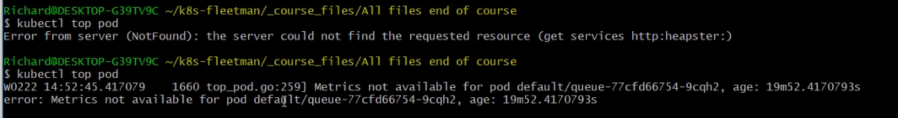

# Enabling Metrics Server in kubernetes

- we have seen the `requests` and `limits`

- `how do we come up` for the `values for the requests and limits` ?

- A `request` is where we tell `kubernetes cluster`  that `what we think a particular POD container` needs in terms of `Memory` or `CPU` to run `comfortably`

- but `we have not discussed` `How do we come up with that values for the resouces such as memory and CPU for the POD container`

- it depends on `technology we will be implemented` for `creating that POD container` as to `How much CPU and Memory POD container needs`

- if we are the `developer of the POD container` then we will have the `rough idea` about `How much of resource such as CPU or memory it needs` 

- `Many of the POD container` is build on `spring boot` hence we can fetch the `amount of Memory or CPU` the `POD container build using the sprint boot application`

- but also we do have the `webapp` application `which been built` using the `angular web application` , we need the `angular knowledge` to know `How much CPU or Memory` it needs

- also we have the `queueapp which is a prebuild POD container based on activeMQ` which been build using the `ActiveMQ` , `we will have to read the docs to know the CPU and memory it uses` 

- `all of it seems to be little vauge` 

- it would be good `if we can do some kind of profiling of POD container` to see `How much of resources each POD container been using at runtime`

- here the `full profiling of the POD application` will be beyond the `scope of the course`

- but we can `definately monitor`  the `running kubernetes cluster` and we can get `basic and useful metrics` for the `how much memory and CPU resource each POD container using`

- we can see `How much resource each POD container been consuming` by using the `simple kubectl command` as below 

    
    ```bash
        
        kubectl top pod
        # here we are using the kubectl top command in this case
        # top command in Linux show the statistics how much resource(Memory and CPU) each process inside the Linux machine been using
        # here also in kiubectl top command will give us the statistics how much resource(Memory and CPU) each POD container been using
        # but here if we are using it for the first time then we more likely yo get an error
        error: Metrics API not available

        # but there will a newer version also available
        kubectl top node
        # this command will provide us the summary of the statistics how much resource(Memory and CPU) for the entire kubernetes cluster
        # but here also if we are using it for the first time then we more likely yo get an error
        error: Metrics API not available


    ```

- `for this command to work` we need to `enable the metrics-server`

- the `Metrics Server` is `nothing but` an `another POD` that we need to `introduce to the kubernetes cluster`

- the `Metrics Server` which is a `POD` which should be running inside the `kube-system` namespace 

- the `Job` of the `Metrics Server POD` running inside the `kube-system namespace` is to gather the `metrics` for the `POD container or entire cluster`

- when we goto the `cloud` we will be performing very hard ro `install and enable the metrics server`

- but we can install that in `minikube very easily`

- the `Metrics Server` is an `addon` on the `minikube kubernetes clustrer` 

- we can see all the `addons on minikube` using the command as `minikube addons list`

    
    ```bash
        minikube addons list
        # here we can use the below command to see all the addon available in minikube kubernetes cluster
        # we can get below response from minikube
        |-----------------------------|----------|--------------|--------------------------------|
        |         ADDON NAME          | PROFILE  |    STATUS    |           MAINTAINER           |
        |-----------------------------|----------|--------------|--------------------------------|
        | ambassador                  | minikube | disabled     | 3rd party (Ambassador)         |
        | auto-pause                  | minikube | disabled     | minikube                       |
        | cloud-spanner               | minikube | disabled     | Google                         |
        | csi-hostpath-driver         | minikube | disabled     | Kubernetes                     |
        | dashboard                   | minikube | disabled     | Kubernetes                     |
        | default-storageclass        | minikube | enabled ✅   | Kubernetes                     |
        | efk                         | minikube | disabled     | 3rd party (Elastic)            |
        | freshpod                    | minikube | disabled     | Google                         |
        | gcp-auth                    | minikube | disabled     | Google                         |
        | gvisor                      | minikube | disabled     | minikube                       |
        | headlamp                    | minikube | disabled     | 3rd party (kinvolk.io)         |
        | helm-tiller                 | minikube | disabled     | 3rd party (Helm)               |
        | inaccel                     | minikube | disabled     | 3rd party (InAccel             |
        |                             |          |              | [info@inaccel.com])            |
        | ingress                     | minikube | enabled ✅   | Kubernetes                     |
        | ingress-dns                 | minikube | enabled ✅   | minikube                       |
        | inspektor-gadget            | minikube | disabled     | 3rd party                      |
        |                             |          |              | (inspektor-gadget.io)          |
        | istio                       | minikube | disabled     | 3rd party (Istio)              |
        | istio-provisioner           | minikube | disabled     | 3rd party (Istio)              |
        | kong                        | minikube | disabled     | 3rd party (Kong HQ)            |
        | kubeflow                    | minikube | disabled     | 3rd party                      |
        | kubevirt                    | minikube | disabled     | 3rd party (KubeVirt)           |
        | logviewer                   | minikube | disabled     | 3rd party (unknown)            |
        | metallb                     | minikube | disabled     | 3rd party (MetalLB)            |
        | metrics-server              | minikube | disabled     | Kubernetes                     |
        | nvidia-device-plugin        | minikube | disabled     | 3rd party (NVIDIA)             |
        | nvidia-driver-installer     | minikube | disabled     | 3rd party (Nvidia)             |
        | nvidia-gpu-device-plugin    | minikube | disabled     | 3rd party (Nvidia)             |
        | olm                         | minikube | disabled     | 3rd party (Operator Framework) |
        | pod-security-policy         | minikube | disabled     | 3rd party (unknown)            |
        | portainer                   | minikube | disabled     | 3rd party (Portainer.io)       |
        | registry                    | minikube | disabled     | minikube                       |
        | registry-aliases            | minikube | disabled     | 3rd party (unknown)            |
        | registry-creds              | minikube | disabled     | 3rd party (UPMC Enterprises)   |
        | storage-provisioner         | minikube | enabled ✅   | minikube                       |
        | storage-provisioner-gluster | minikube | disabled     | 3rd party (Gluster)            |
        | storage-provisioner-rancher | minikube | disabled     | 3rd party (Rancher)            |
        | volumesnapshots             | minikube | disabled     | Kubernetes                     |
        |-----------------------------|----------|--------------|--------------------------------|

        # here we can enable the metrics server POD by using the command as below
        # here we can use the command as 
        minikube addons enable metrics-server
        # here we can enable the metrics-server using the minikube addons enable <addon name>
        # the below will be the response
        💡  metrics-server is an addon maintained by Kubernetes. For any concerns contact minikube on GitHub.
        You can view the list of minikube maintainers at: https://github.com/kubernetes/minikube/blob/master/OWNERS
            ▪ Using image registry.k8s.io/metrics-server/metrics-server:v0.6.4
        🌟  The 'metrics-server' addon is enabled

        # here we can also enable the metallb loadBalancer as below
        minikube addons enable metallb
        # using this command we can enable the metallb load blancer for the bareMetal minikube local kubernetes cluster
        # the output as below for that case
        ❗  metallb is a 3rd party addon and is not maintained or verified by minikube maintainers, enable at your own risk.
        ❗  metallb does not currently have an associated maintainer.
            ▪ Using image quay.io/metallb/speaker:v0.9.6
            ▪ Using image quay.io/metallb/controller:v0.9.6
        🌟  The 'metallb' addon is enabled

        # now when we do the minikube addons list we can see that those addons been added
        minikube addons list 
        # fetching all the minikube addons thats been installed
        # here the output will be as below 
        |-----------------------------|----------|--------------|--------------------------------|
        |         ADDON NAME          | PROFILE  |    STATUS    |           MAINTAINER           |
        |-----------------------------|----------|--------------|--------------------------------|
        | ambassador                  | minikube | disabled     | 3rd party (Ambassador)         |
        | auto-pause                  | minikube | disabled     | minikube                       |
        | cloud-spanner               | minikube | disabled     | Google                         |
        | csi-hostpath-driver         | minikube | disabled     | Kubernetes                     |
        | dashboard                   | minikube | disabled     | Kubernetes                     |
        | default-storageclass        | minikube | enabled ✅   | Kubernetes                     |
        | efk                         | minikube | disabled     | 3rd party (Elastic)            |
        | freshpod                    | minikube | disabled     | Google                         |
        | gcp-auth                    | minikube | disabled     | Google                         |
        | gvisor                      | minikube | disabled     | minikube                       |
        | headlamp                    | minikube | disabled     | 3rd party (kinvolk.io)         |
        | helm-tiller                 | minikube | disabled     | 3rd party (Helm)               |
        | inaccel                     | minikube | disabled     | 3rd party (InAccel             |
        |                             |          |              | [info@inaccel.com])            |
        | ingress                     | minikube | enabled ✅   | Kubernetes                     |
        | ingress-dns                 | minikube | enabled ✅   | minikube                       |
        | inspektor-gadget            | minikube | disabled     | 3rd party                      |
        |                             |          |              | (inspektor-gadget.io)          |
        | istio                       | minikube | disabled     | 3rd party (Istio)              |
        | istio-provisioner           | minikube | disabled     | 3rd party (Istio)              |
        | kong                        | minikube | disabled     | 3rd party (Kong HQ)            |
        | kubeflow                    | minikube | disabled     | 3rd party                      |
        | kubevirt                    | minikube | disabled     | 3rd party (KubeVirt)           |
        | logviewer                   | minikube | disabled     | 3rd party (unknown)            |
        | metallb                     | minikube | enabled ✅   | 3rd party (MetalLB)            |
        | metrics-server              | minikube | enabled ✅   | Kubernetes                     |
        | nvidia-device-plugin        | minikube | disabled     | 3rd party (NVIDIA)             |
        | nvidia-driver-installer     | minikube | disabled     | 3rd party (Nvidia)             |
        | nvidia-gpu-device-plugin    | minikube | disabled     | 3rd party (Nvidia)             |
        | olm                         | minikube | disabled     | 3rd party (Operator Framework) |
        | pod-security-policy         | minikube | disabled     | 3rd party (unknown)            |
        | portainer                   | minikube | disabled     | 3rd party (Portainer.io)       |
        | registry                    | minikube | disabled     | minikube                       |
        | registry-aliases            | minikube | disabled     | 3rd party (unknown)            |
        | registry-creds              | minikube | disabled     | 3rd party (UPMC Enterprises)   |
        | storage-provisioner         | minikube | enabled ✅   | minikube                       |
        | storage-provisioner-gluster | minikube | disabled     | 3rd party (Gluster)            |
        | storage-provisioner-rancher | minikube | disabled     | 3rd party (Rancher)            |
        | volumesnapshots             | minikube | disabled     | Kubernetes                     |
        |-----------------------------|----------|--------------|--------------------------------|


    ```

- then `once we enable the mertics-server minikube addon` then we can see that `metrics-server POD ans Services` been running on the `kube-system namespace`

- hence here we can use below command to validate the same 

    ```bash
        kubectl get all -n kube-system
        # fetching all the kubernetes resource workload inside the kube-system namespace
        # the output in this case will be as below
        NAME                                   READY   STATUS    RESTARTS       AGE
        pod/coredns-5dd5756b68-cmhnt           1/1     Running   2 (18m ago)    10h
        pod/etcd-minikube                      1/1     Running   2 (18m ago)    10h
        pod/kube-apiserver-minikube            1/1     Running   2 (18m ago)    10h
        pod/kube-controller-manager-minikube   1/1     Running   2 (18m ago)    10h
        pod/kube-proxy-2d45t                   1/1     Running   0              17m
        pod/kube-scheduler-minikube            1/1     Running   2 (18m ago)    10h
        pod/metrics-server-7c66d45ddc-pkx8k    1/1     Running   1 (18m ago)    10h # here we can see that metrics-server POD been running which is a part of Deployment
        pod/storage-provisioner                1/1     Running   11 (17m ago)   10h

        NAME                     TYPE        CLUSTER-IP      EXTERNAL-IP   PORT(S)                  AGE
        service/kube-dns         ClusterIP   10.96.0.10      <none>        53/UDP,53/TCP,9153/TCP   10h
        service/metrics-server   ClusterIP   10.104.233.77   <none>        443/TCP                  10h # here we can see that metrics-server Service been running as well

        NAME                        DESIRED   CURRENT   READY   UP-TO-DATE   AVAILABLE   NODE SELECTOR            AGE
        daemonset.apps/kube-proxy   1         1         1       1            1           kubernetes.io/os=linux   10h

        NAME                             READY   UP-TO-DATE   AVAILABLE   AGE
        deployment.apps/coredns          1/1     1            1           10h
        deployment.apps/metrics-server   1/1     1            1           10h

        NAME                                        DESIRED   CURRENT   READY   AGE
        replicaset.apps/coredns-5dd5756b68          1         1         1       10h
        replicaset.apps/metrics-server-7c66d45ddc   1         1         1       10h

    ```

- now if we `go ahead and use the command` as `kubectl top pod` then we will get the `error`

- this is because the `metrics-server POD and Services` `collect/gather` the `metrics about the POD or cluster` based on `over time` and the `default time` for that will be as `1 minute`

- it will be going to take `at least a minuite` before `there's enough data for this command(kubectl top pod)` to provide the `useful response`

- we need to `wait` for `at least a minute` so that `metrics-server` to provide `some userful report`

- we can see all sort of  `different different error` if we issue the `kubectl top pod` command before the `metrics-server` gather the `metrics over time(default being one minurte)`

- here we do have the `queueapp` with the `memory and CPU rouce request` as below in this case

- we can define the `resources_testing.yml` as below in this case as below

    ```yaml
        resources_testing.yml
        =====================
        apiVersion: apps/v1 # here defining the apiversion as apps/v1 as the Deployment belong to the apps apiGroup
        kind: Deployment # here the kubernetes object will be of type as Deployment
        metadata: # defining the name of the Deployment as queueapp in this case
            name: queueapp 
        spec: # defining the specification for the Deployment in here
            selector: # here defining the selectorfor the Deployment which will be selected based on the POD labels
                matchLabels:
                    app: queueapp
            replicas: 2 # here the number of repluicas thats been defined as 2 in this case
            template: # defining the template for the POD definition over here
                metadata: # under the metadata section we are defining the POD labels based on which Deployment and Service will associated with the POD
                    labels:
                        app: queueapp
                spec: # specification for the POD container defined in here
                    containers: # contaiers details is over here
                        - name: queueapp # name of the container as queueapp
                          image: 
                          resources: # requesting for the memory and CPU resource for the POD container
                            requests: # here we are requesting the kubernetes scheduler so that it can make smart decession on which node this POD will spin
                                memory: 300Mi # here we are defining the 300MegaByte of memory been needed for the POD container
                                cpu: 100m # here requesting for the cpu of 100milloicore for the POD container

    ```

- now we can deploy the changes to the `kubernetes cluster` by `applying the changes` as below

    ```bash
        kubectl apply -f resources_testing.yml
        # here we are using the command to deploy the resources onto the kubernetes cluster
        # hence we can use the command output will be as below
        deployment.apps/queueapp created

        # now we need to wait at least for a minute so that mmetrics-server can collect the metriocs over the default time 
        # this will going to provide the response after the calculation

        # now if we are using the command in order to get the profile details about the POD from the metrics server
        # here we can use the command as below in order to get these details 
        kubectl top pod
        # the below will be the response after1minute later the POD been spunned
        NAME                        CPU(cores)   MEMORY(bytes)   
        queueapp-76fd5677bb-k5vbm   4m           289Mi           
        queueapp-76fd5677bb-lgq8d   4m           279Mi 

    ```

- ifr we approching the `kubectl top pod` command before the `metrics` can get the `details` then we might get below errors

- 

- for the `1st time` the `metrics-server POD container are container Creating State` and `metrics-server kubernetes Server` wi;ll not able to `fetch the POD as its in container Creating state`

- this is because the for the `2nd error one` the `queueapp` POD does not have `spunned for 1 minute` hence the `metrics-server POD and Service` does not have `enough metrics` to calculate and `provide appropriate response`

- hence we should `at least wait a minute` after the `metrics-server POD or Service been spunned` or `New Workload been spunned`

- here the `Deployment` has `2 replicas` which create the `2 PODs` hence the `metrics-server` will be `gather the statics for both the PODs`

- here the `CPU and Memory` details `will not display` for the `resource we are requesting` rather it show the `how much of resource the POD container been actually using`

- the `values` displayed by the `kubectl top pod` command will going to be get updated in `once in every minute`  

- here for the `queueapp` we are `requesting for 300 Megabyte` which is below `actual usage of the POD container`

- but ebven iof we made the `request for the reosuce` which is `less than the actual usage of the POD container` then also `it will not create any problem` as long as the `cluster have space`

- this is `because` the `resource request` will be for the `kubernetes scheduler` to make `intelligent decession` it `will not going to` `restict the resource` if it is taking `more resource` as long as the `kubernetes cluster has space to allocate the resource` but that might have effect on `Eviction` which we will learn later

- lets suppose the `actual usage of the queueapp POD container` goes beloynd the `300Megabytes memory requests` lets say `1 GB` then also this will not be a `problem` as long as `kubernetes cluster has space`

- here the `queueapp` POD not been doing anything i.e `its just sitting idle` not reading the `messages from queue` 

- its better to make the `whole microservice system` deployed ion order to `perform the profiling`

- by the `meantime` we can deploy the `workloads.yml` and `storage.yml` and `mongo-stack.yml` and `storage.yml` onto the `kubernetes cluster to see its profili9ng by the metrics server after one minute`

- here we can modify the `workload.yml` file to `support the resources requests for the queueapp`

    ```yaml
        workloads.yml
        ==============
        
        apiVersion: apps/v1 # here the Deployment belongs to the apps group hyence defined as below 
        kind: Deployment # type of the kubernetes object is deployment
        metadata: # name of the Deployment been described here
            name: position-simulator
        spec: # specification for the Deployment been defined here
            selector: # selector to select the POD based on the POD label
                matchlabels:
                    app: position-simulator
            replicas: 1 # replicas of the POD defined as 1 at any instance
            template: # template for the POD container
                metadata: # POD labels been defined inside the metadata section
                    labels:
                        app: position-simulator
                spec: # Specification of the POD container been defined in here
                    containers: # container details provided here
                        - name: position-simulator # name of the container
                          image: richardchesterwood/k8s-fleetman-position-simulator:release2 # image for the container
                          env: # env Variable for the container
                            - name: SPRING_PROFILE_ACTIVE # name 0f the env Variable 
                              value: production-microservice # value of the env Variable
        
        ---

        apiVersion: apps/v1 # here the Deployment belongs to the apps group hence defined as below 
        kind: Deployment # type of the kubernetes object is deployment
        metadata:  # name of the Deployment been described here
            name: position-tracker
        spec: # specification for the Deployment been defined here
            selector: # selector to select the POD based on the POD label
                matchlabels:
                    app: position-tracker
            replicas: 1 # replicas of the POD defined as 1 at any instance
            template: # template for the POD container
                metadata: # POD labels been defined inside the metadata section
                    labels:
                        app: position-tracker
                spec: # Specification of the POD container been defined in here
                    containers: # container details provided here
                        - name: position-tracker # name of the container
                          image: richardchesterwood/k8s-fleetman-position-tracker:release3 # image of the container
                          env: # env Variable for the container
                            - name: SPRING_PROFILE_ACTIVE # name 0f the env Variable 
                              value: production-microservice # value of the env Variable


        ---

        apiVersion: apps/v1 # here the Deployment belongs to the apps group hence defined as below 
        kind: Deployment # type of the kubernetes object is Deployment
        metadata:  # name of the Deployment been described here
            name: api-gateway
            namespace: default # here the namespace for the POD being as default
        spec: # defining the specification for the Deployment in this case
            selector: # selector for the deployment based on POD label being defined in here
                matchLabels:
                    app: api-gateway
            replicas: 1  #replicas of the POD defined as 1 at any instance
            template: # template for the POD container
                metadata: # POD labels been defined inside the metadata section
                    labels:
                        app: api-gateway
                spec: # Specification of the POD container been defined in here
                    containers: # container details provided here
                    - name: api-gateway  # name of the container
                        image: richardchesterwood/k8s-fleetman-api-gateway:release2 # image of the container
                        env:  # env Variable for the container
                        - name: SPRING_PROFILES_ACTIVE # name 0f the env Variable 
                        value: production-microservice # value of the env Variable

        ---

        apiVersion: apps/v1 # here the Deployment belongs to the apps group hence defined as below 
        kind: Deployment # type of the kubernetes object is Deployment
        metadata: # name of the Deployment been described here
            name: webapp
            namespace: default # here the namespace it belong to is default
        spec: # defining the specification for the Deployment in this case
            selector: # selector for the deployment based on POD label being defined in here
                matchLabels:
                    app: webapp
            replicas: 1 # replicas of the POD defined as 1 at any instance
            template: # template for the POD container
                metadata: # POD labels been defined inside the metadata section
                    labels:
                        app: webapp
                spec: # Specification of the POD container been defined in here
                containers: # container details provided here
                  - name: webapp # name of the container
                    image: richardchesterwood/k8s-fleetman-webapp-angular:release2 # image for the container
                    env: # env variable defined for the container
                    - name: SPRING_PROFILES_ACTIVE # name of the env Variable
                      value: production-microservice # value of the env Variable
                    

        ---

        apiVersion: apps/v1 # here the Deployment belongs to the apps group hence defined as below 
        kind: Deployment # type of the kubernetes object is Deployment
        metadata: # name of the Deployment been described here
            name: queueapp
        spec: # here the spoecification for the Deployment been defined in here
            replicas: 1 # here we are spinning 1 replica in this case
            selector: # selector for the deployment based on POD label being defined in here
                matchLabels:
                    app: queueapp
            template: # template for the POD container
                metadata: # POD labels been defined inside the metadata section
                labels:
                    app: queueapp
                spec: # specification for the POC container
                    containers: # container details been provided here
                    - name: queueapp # name of the container
                    image: richardchesterwood/k8s-fleetman-queue:release2 # image of the container
                    resources: # reouces for the container
                        requests: # here requesting for the resources in the POD container
                            memory: 300Mi # we need the Memory of 300 megabyte
                            cpu: 100m # we need the cpu of 100millicore


    ```

- we can define the `mongo-stack.yml` file as below in this case
  
    ```yaml
        mongo-stack.yml
        ===============
        apiVersion: apps/v1  # defining the apiVersion as apps/v1 for the Deployment as it exist in apps group
        kind: Deployment # defining the type of object in this case as Deployment
        metadata: # defining the name for the Deployment out in here
            name: mongodb
        spec: # defining the specification for the Deployment
            replicas: 1 # using 1 replica-set which will responsible to manage the POD 
            selector: # defining the selector key value pair based on the POD label
                matchLabels:
                    app: mongodb
            template: # defining the POD definition inside the template derivatiove
                metadata: # defining the POD label inside the metadata section
                    labels: # defining the POD label as key and value pair
                        app: mongodb
                spec: # defining the specification for the POD definition
                    containers: # defining the containers inside the POD
                        - name: mongodb # name of the container as mongodb
                          image: mongo:3.6.5-jessie # image  we will beusing for the container
                          volumeMounts: # using the volumeMount which will define the lis of folder inside the container we want to map outside 
                            - name: mongo-persist-volume # using the name of the VolumeMount which will be used in the volumes section to refer which folder inside container we want map as there can be multiple folder inside the container map outside of the container 
                              mountPath: /data/db # defining the folder we want to map inside the container
                    
                    volumes: # defining the volume which will tell how we will implement the volume mapping to a hostPath/awsEbsStorage or anything 
                        - name: mongo-persist-volume # referencing the volumeMount based on their name provided
                          persistentVolumeClaim: # defining the persistanceVolumeClaim which will be a separate confifuration file to define how to implement the volume mapping or mount in hostPath/awsEBSStorage
                            claimName: mongo-pvc # defining the claimName which need to be defined inside  the separate confifuration file with the same name in order to claim some storage for the volume
                            # here this mongo-pvc claim name should be defined in the separate configuration file which will define the how to implement volume mapping and also it will claim the spaces for the Persistant Volume


        --- # defining the documentSeparator over here 

        apiVersion: v1 # defining the apiVersion as v1 in here as it belong to the core group 
        kind: Service # defining the kubernetes object type as Service in here
        metadata: # defining the name for the Service whioch should exactly name as fleetman-mongodb
            name: fleetman-mongodb
        spec: # defining the spec for the Service defined here
            selector: # this will select the POD based on label same as the key-value pair
                app: mongodb
            ports: # defining the ports that need to exposed for the Service
                - name: mongoport # name for the port defined as mongoport
                  port: 27017 # defining the port number as 27017 in here
                  protocol: TCP # defining the protocol as TCP
            
            type: ClusterIP # defining it as ClusterIp service which will not avaialble outside of the minikube kubernetes local cluster


    ```

- we can define the `services.yml` for defining the `Services` in this case

    ```yaml
        services.yml
        =============
        apiVersion: v1 # here defining the apiVersion which is v1 for the kubernetes Services hence the apiGroup being as core 
        kind: Service # here the type of kubernetes object will be of as Service
        metadata: # name of the Service being as fleetman-webapp
            name: fleetman-webapp
        spec: # specification for the Services
            selector: # selector for the Kubernetes Service using which based on the POD labels the selector will be selected
                app: webapp
            ports: # defining the ports for the kubernetes services
                - name: http # here the name of the port being as http
                  port: 80 # allowing traffic on port 80
                  targetPort: 80 # container port being as 80
                  protocol: TCP # protocol as TCP
                  nodePort: 30030 # opening Node Port as 30030
            type: NodePort # type of Service as NodePort

        ---

        apiVersion: v1  # here defining the apiVersion which is v1 for the kubernetes Services hence the apiGroup being as core 
        kind: Service   # here the type of kubernetes object will be of as Service
        metadata: # name of the Service being as fleetman-queueapp
            name: fleetman-queue
        spec: # specification for the Services
            selector: # selector for the Kubernetes Service using which based on the POD labels the selector will be selected
                app: queueapp
            ports: # defining the ports for the kubernetes services
                - name: admin # here the name of the port being as admin
                  port: 8161 # allowing traffic on port 8161
                  targetPort: 8161 # container port being as 8161
                  protocol: TCP # protocol as TCP
                  nodePort: 30050  # opening Node Port as 30050
                
                - name: endpoint  # here the name of the port being as endpoint
                  port: 61616 # allowing traffic on port 61616
                  protocol: TCP # protocol as TCP

            type: NodePort # type of Service as NodePort

        ---

        apiVersion: v1 # here defining the apiVersion which is v1 for the kubernetes Services hence the apiGroup being as core 
        kind: Service # here the type of kubernetes object will be of as Service
        metadata: # name of the Service being as fleetman-position-tracker
            name: fleetman-position-tracker
        spec: # specification for the Services
            selector: # selector for the Kubernetes Service using which based on the POD labels the selector will be selected
                app: position-tracker
            ports: # defining the ports for the kubernetes services
                - name: rest # here the name of the port being as rest
                  port: 8080 # allowing traffic on port 8080
                  targetPort: 8080 # container Port is at 8080
                  protocol: TCP # protocol is of TCP

            type: ClusterIP # here the Service Type as ClusterIP

        ---

        apiVersion: v1 # here defining the apiVersion which is v1 for the kubernetes Services hence the apiGroup being as core 
        kind: Service # here the type of kubernetes object will be of as Service
        metadata: # name of the Service being as fleetman-api-gateway
            name: fleetman-api-gateway
        spec: # specification for the Services
            selector: # selector for the Kubernetes Service using which based on the POD labels the selector will be selected
                app: api-gateway
            ports: # defining the ports for the kubernetes services
                - name: rest # here the name of the port being as rest
                  port: 8080 # allowing traffic on port 8080
                  targetPort: 8080 # container Port is at 8080
                  protocol: TCP # protocol is of TCP

            type: ClusterIP # here the Service Type as ClusterIP


    ```


- we can define the `storage.yml` for the defining the `persistentVolume` and `persistentVolumeClaim` as below 

    ```yaml
        storage.yml
        ===========
        apiVersion : v1 # here defining the apiVersion which is v1 for the kubernetes PersistentVolumClaim hence the apiGroup being as core
        kind: PersistentVolumeClaim # here the type of Kubernetes object will be of type as PersistentVolumeClaim
        metadata: # here in the metadata section we are referencing the mongo-pvc which is the claimName we defined in mongo-stack.yml
            name: mongo-pvc
        spec: # specification for the PersistentVolumeClaim
            accessModes: # here defining the accessModes as ReadWriteOnce hence multiple same POD inside the one node only one POD perform rw operation rest will only read
                - ReadWriteOnce
            resources: # requesting for 500Mi of space 
                requests:
                    storage: 500Mi
            storageClassName: local-storage # linking the PersistentVolumeClaim to the PersistentVolume using the storageClassName

        ---

        apiVersion : v1 # here defining the apiVersion which is v1 for the kubernetes PersistentVolumClaim hence the apiGroup being as core
        kind: PersistentVolume # here the type of Kubernetes object will be of type as PersistentVolume
        metadata: # here in the metadata section we are defining  the PersistentVolume as my-stoage
            name: my-storage
        spec: # specvification for the PersistentVolume 
            accessModes: # here defining the accessModes as ReadWriteOnce hence multiple same POD inside the one node only one POD perform rw operation rest will only read
                - ReadWriteOnce
            capacity: # here defining the capacity for the PersistentVolume that will store the data
                storage: 500Mi
            storageClassName: local-storage # linking the PersistentVolumeClaim to the PersistentVolume using the storageClassName
            hostPath: # here as we are using the local minikube cluster we can defined the hostPath in this case
                path: /mnt/mongo-data # path to the Host System
                type: DirectoryOrCreate # if the path not found then we will create the directory mentioned as path

            


    ```

- now we can deploy the changes to the `kubernetes cluster` by `applying the changes` as below

    ```bash

        kubectl delete -f resources_testing.yml
        # deleting the resource created with the resources_testing.yml using the kubectl delete command
        # here the output in this case will be as below 
        deployment.apps/queueapp deleted

        kubectl apply -f .
        # here we are deploying the workloads.yml and storage.yml and services.yml and mongo-stack.yml to the kubernetes cluster
        # here we are using the command to deploy the resources onto the kubernetes cluster
        # hence we can use the command output will be as below
        deployment.apps/position-simulator created
        deployment.apps/position-tracker created
        deployment.apps/api-gateway created
        deployment.apps/webapp created
        deployment.apps/queueapp created
        service/fleetman-webapp created
        service/fleetman-queue created
        service/fleetman-position-tracker created
        service/fleetman-api-gateway created
        deployment.apps/mongodb created
        service/fleetman-mongodb created
        persistentvolumeclaim/mongo-pvc created
        persistentvolume/my-storage created 

        # now if we wait for 1 mins before we see the PODs resouce usage then we can use the command as below 
        kubectl top pod
        # this will show the POD usage info such as below 
        NAME                                  CPU(cores)   MEMORY(bytes)   
        api-gateway-56c46fbcdb-zvfj2          53m          770Mi           
        mongodb-659cb5db54-d6qdj              23m          140Mi           
        position-simulator-5fdb4ddbd5-vs6qj   41m          484Mi           
        position-tracker-59fdfd8cf4-zlwt4     85m          628Mi           
        queueapp-76fd5677bb-g7zbm             68m          370Mi           
        webapp-57fc8f94c8-rk8xf               0m           3Mi 

        # here we can see that api-gateway been using most memory as 770Mi which can be later brought significantly down
        # here upon checking we can see that position-tracker and position-simulator been using java which has memory management hence the POD is upto 500Mi size
        # imp
        # here we can see that even though we have provided the queue as 300Mi size for the queueapp but as it provided with the resource it will not impact the resource provisiong
        # here we can see the angular application taking 3Mi of size


        # now we can also check in the node level usage
        kubeectl top node
        # this will provide the iingo about the cluster level resource usage
        # as we have kube-system POD running along with out POD here we can see the usage as below 
        # the output will be as below
        NAME       CPU(cores)   CPU%   MEMORY(bytes)   MEMORY%   
        minikube   616m         3%     3222Mi          10% 
        # here we have the 32GB memory and we are using only 3GB of memory
        # but if we have the memory as 4GB then it willl showing all the Memory been usaged
    
    ```