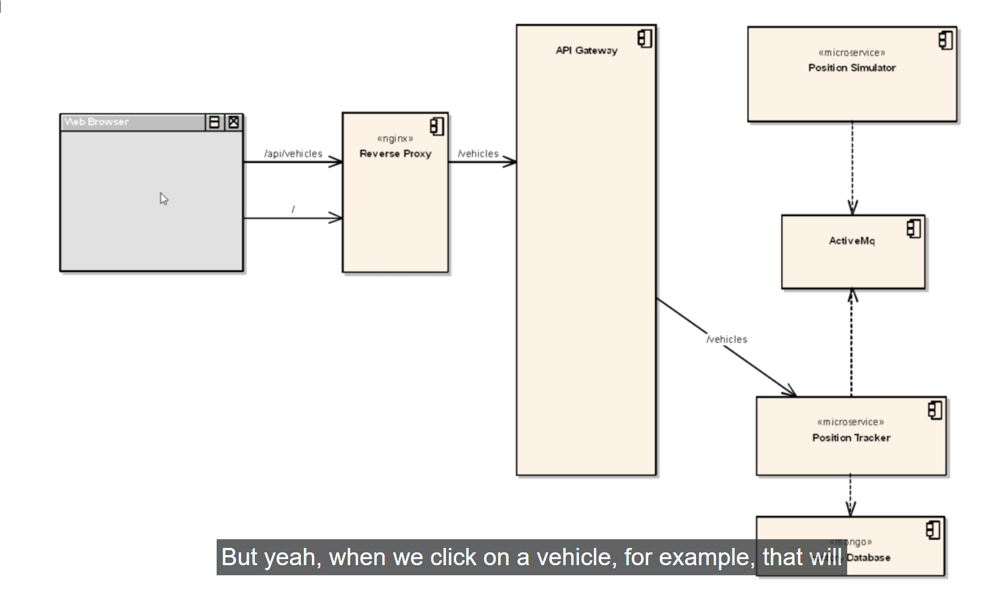
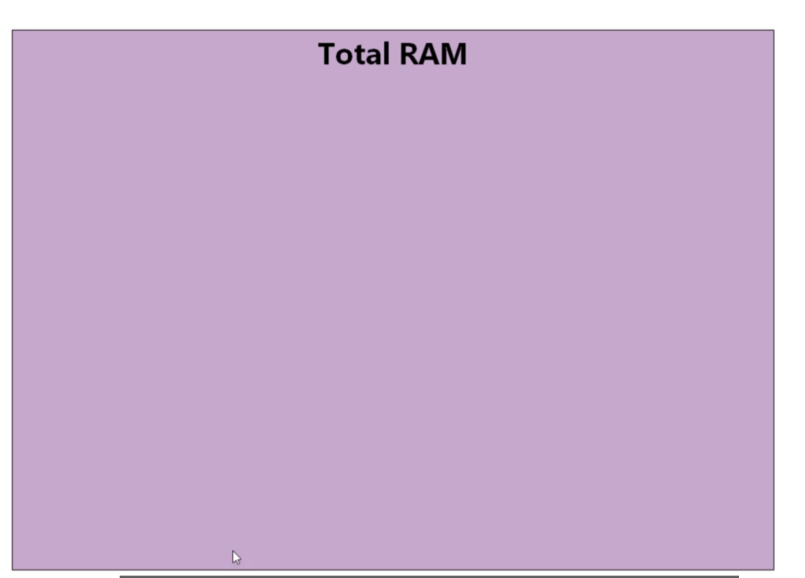
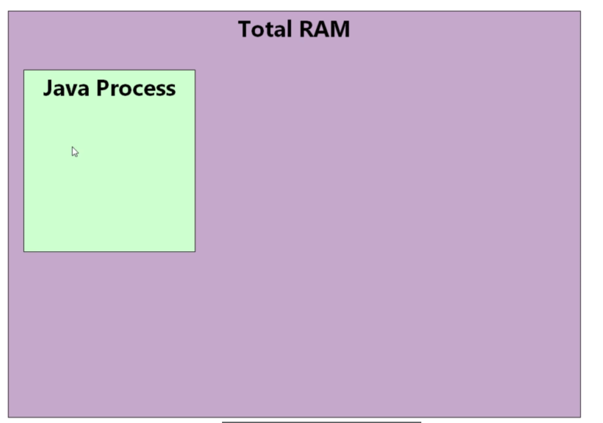
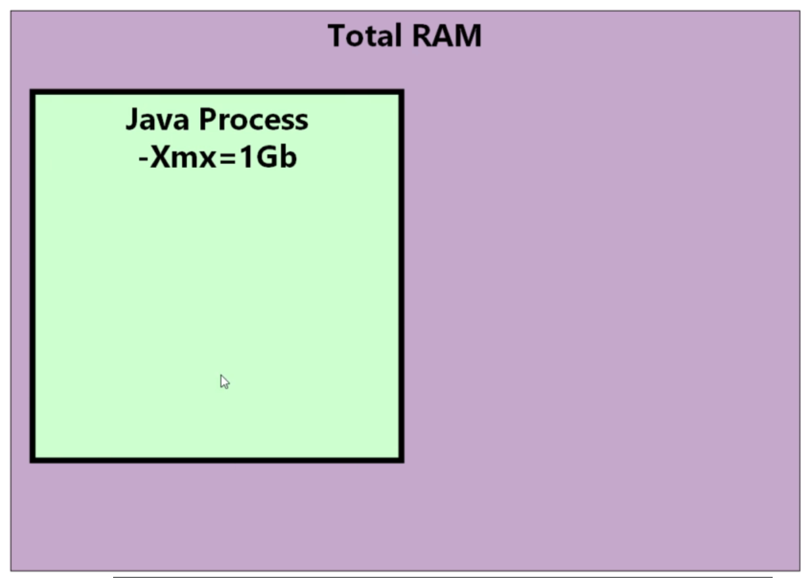
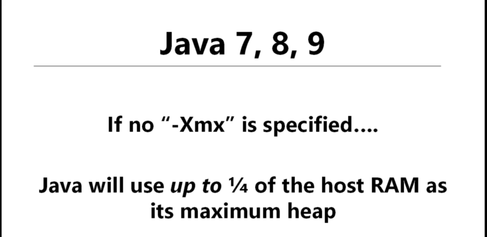
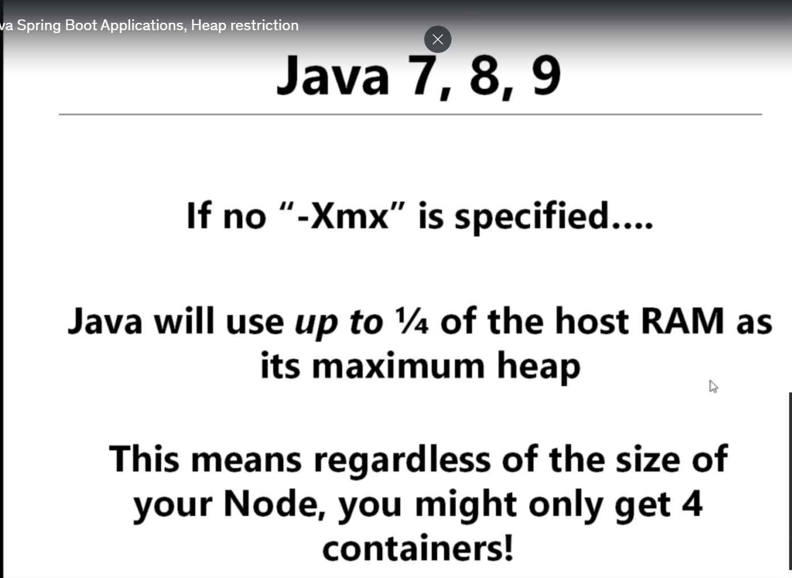
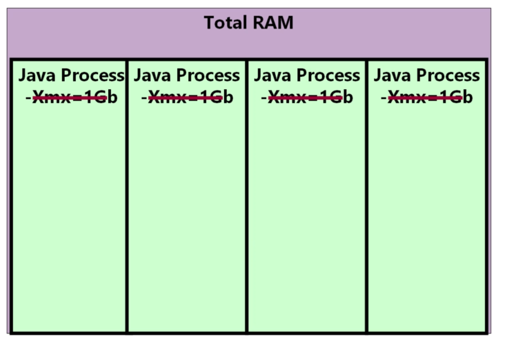
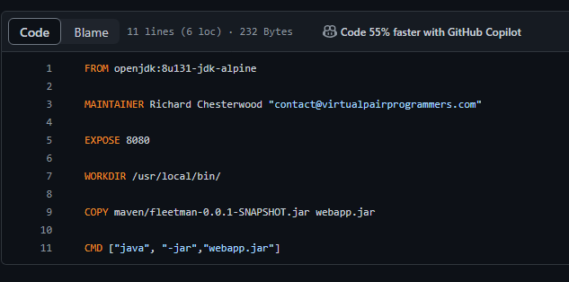
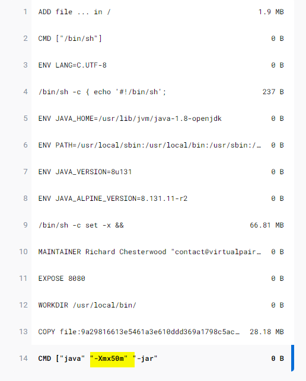

# tuning java springboot application heap restriction 

- here we are going to set some `good values` for the `requests` inside the `container` for the `fleetman microservice system`

- **How to come up with the Sensible value for the container requests**

- A `lot of the answer` is based on the `language or framework` we are using to `build the container`

- In the `current architecture` when we run the `kubectl top pod` command then we can see that `all PODs have heavy RAM memory usage` in this case

- here we will be looking at the `memory usage` in this video in here

    
    ```bash
        kubectl top pod
        # fetching the POD usage using the kubectl top POD command
        # this command will going to show the CPU and Memory resource usage in this case
        NAME                                  CPU(cores)   MEMORY(bytes)   
        api-gateway-56c46fbcdb-xbkdc          952m         683Mi           
        mongodb-659cb5db54-v67ts              369m         215Mi           
        position-simulator-5fdb4ddbd5-tfbnr   233m         341Mi           
        position-tracker-59fdfd8cf4-vcsgt     614m         597Mi           
        queueapp-76fd5677bb-b9ngx             269m         296Mi           
        webapp-66765b68df-8cfbr               34m          11Mi 


    ```

- here we can see that `api-gateway-56c46fbcdb-xbkdc` i.e the `api-gateway POD` been using the `1/2 Gi of RAM` in this case , which is a lot considering the `api-gateway` is not a `complecated POD` , its just a `microservice` which is not doing a `lot of work`

- here we can see that `the webapp POD container` been using the `tiny tiny bit of RAM Memory and CPU of the kubernetes Nodes` in this case , which is completely `down to the implementation` of the `POD`

- here the `webapp POD` been used as the `nginx application` which is a `light weight but very functional web server`

- but `nginx` does a very little inside the `fleetman microservice application` , when we `first access the fleetman web application` or `when we reload the content of the fleetman web application` then `webapp nginx application` deleiverying the `necessary html and javascript content thats been needed for the fleetman web application`

- when we click on the `vehicle` then a `http` request been made to the URL `with the end point as /api/vehicle` which will go to the `nginx web application reverse proxy or web frontend` which been configured to `recognize` the request starts with `/api` and then forward the `traffic` to the `API Gateway`

- here the `nginx` web application need not have to do very much work and by design `creator of the nginx web server which been acting as the web frontend` been `light weight` which will be making the `process very light weight` which will not conssume more `CPU and Memory Resources` 

- but the `below microservices` are build on using the `java application microservcies` , hence consuming `More resources`
  
  - `API Gateway`
  
  - `Position Simulator`
  
  - `Active MQ`
  
  - `Position Tracker`
  
- mostly the `java application microservices` are basically are `memory-intensive` task in this case

- the `Java Application` works with the `Heap` which is a `large In Memory Memory Structure` in `java application` which is being `managed`

- `java` will know when the `area of the Heap Memory` are `unused` and `automatically reclaim those Free Space in Java Application` using the `garbage collection`

- it basically `very common` to see `large memory usage` for the `Java Application` but here in the `fleetman microservice architecture` it will be a `problem`

- the `API Gateway` is a `Small Springboot application` which deals with the `rest request coming from the nginx web application` and forward the request to the `corresponding microservice` of the `fleetman microservice architecture`

- as a part of the `API Gateway` we are using `few 3rd party library plugin` such as `hystrix` which is a plugin from `netflix` , in case the `corresponding microservice been crashed` then it will send a `fallback value` as `return code` to the `Api Gateway microservcie` which will be `return to the client`

- 

- but here all the `java microservcie application` not considered to be `really heavy as they are using high number of RAM` hence we need to `dig a little bit down` for the `same`

- **Explaining the Mistakes on the Java Application Micro Services in the fleetman webapplication**

- here we need to understand first `how the Java Application` works 

- imagine we have the `machine` which have the `certain RAM Memory` as displayed below 

- 

- when we ran the `java application program or process` , `on top of the machine` then it will going to take up  the `Memory that been allocated to the System`

- As the `java program been running` it will going to take `more and more number of RAM Memory`

- 

- but there will be an `internal process` called as `garbage collection` which will happen on the `background automatically` and `reclaim the unused heap Memory`

- there `might be chance` that `Java Application` will `never use more memory` than it was `memory that been allocated intially to the Java Programs`

- tuning the `java application` is a `complecated task` basically its the `balancing act between the RAM Memory consumed by Java Program` to its `java performance`

- we can set the `value for the java program` what will be `maximum size of the Heap Memory for the java application` it can use by setting the `parameter` as `-Xmx` to the `java application`

- when we set the `Maximum Heap Memory Size for the java application` , it provide a chance that `java application does not have a lot of Heap memory` hence start doing the `frequent garbage collection` which can in turn `slow down the process` , in that case then the `java program` will `allocate resize to few more space to the java application from host system` based on the `-Xmx value` and going to `reduce the number of garbage collection` which will increase the `java appluication performance` but at the expenses of `more space`

- the `-Xmx` parameter to the `Java Application` tells java `what will be maximum allowable size of the Heap is` for the `program`

- here we can see the `big black line around the java program` denotes the `maximum allowable size of the Heap is` in the below snips

- 

- eventually the `Java Program` will going to reach the `maximum heap Size` in this case , we can set the `Maximum Heap Size` bysetting up the `-Xmx parameter value`

- when we set the `-Xmx value for the java application` as the `1Gb` that does not mean that `java application` will going to take `1GB Heap Size` at the `beginning` , it will first set the `constant small heap size for the java application` and then `resize and resize if needed eventually till the Maximum Heap Size` defined by the `-Xmx value`
then it will not going to be `get resized`

- when the `Maximum Heap Memory Size` reached then `that does not mean` the `java application` will `run out of Memory` but rather there will `garbage collection process running on the background which will constantly reclaiming the unused Heap Memory`

- here we need to `fetch a value for the RAM Memory` in between so that `java does not do frequent garbage collection as the Heap Memory is less` and also `java program will not going to take too much Host RAM Memory in order avoid the frequent garbage collection`

- for the `fleetman microservice system` the `POD container` been build `without setting` the `Maximum Heap Memory of the java application(-Xmx Parameter)`

- for the `java version upto Java 9 i.e (java 7,8,9)` if we `don't specify` the `Maximum Heap Memory of the java application(-Xmx Parameter)` then it will going to take `1/4th of the Host Memory in that case` by default

- 

- this default `1/4th of the Host Memory in that case` make sense if we are `running the Server with some programs` and on top of that `Server` running the `one java application`

- but here we are ruinning the `4 java application` inside the `kubernetes nodes Server` hence we it will going to take `1/4th of the Host Server Node Memory`

- regardless of the fact that `How Big you kubernetes Server Node` is then `we can run only 4 Java Application as POD container` as each will be going to take `1/4th of the Memory`

- hence we can only run `4 java application` inside the `kubernetes server node` as each `POD container` will going to take `1/4th of the Host Server Memory`

- if we have the `Kubernetes Server node` as `RAM memory as 8Gi` then `each java program application POD container` will take `2Gi of RAM Memory` hence we can only run `4 java application` in that case , there will be `no space` to run `other java programs`

- we need to keep in mind that `this is the Mamimum Heap Memory Size for the java application` that does not mean the `Java Program from the begininning start using the Mamimum Heap Memory` , it will `resize and resize` untill it got to the `final Maximum Heap Size eventually` 

- even though the `java application` been running inside the `POD container` but the `Java Ap-plication still behave as the first class Application` as `java does not know its been running inside the container` and use to demand the `Same Heap Memory as running as stand alone java application running on the Node` in that case

- 

- here we can run the `4 java application` i.e as below is just a `lucky chance`
   
   - `API Gateway`
  
  - `Position Simulator`
  
  - `Active MQ`
  
  - `Position Tracker`
  
- then `None of the java application POD container` are `not greedy enough` to `claim the Maximum Heap Size` but certainly running with the `big chunk of memory` in that case

- here we are running the `minikube kubernetes cluster` with the `--Memory as 4096Mb i.e  4Gi` hence each `java application POD container` can take upto `1Gb as the Maximum Heap Size` , clearly they are not using the `Maximum Heap Size Memory` but can go upto that value

- here `expanding the size of the virtual machine` will `not going to help` in here `as long as we are not setting` the `Maximum Heap Size for the java application POD container`

- 

- from `Java 10 Onwards` java `recognize this problem of taking 1/4th RAM Memory of the Host if the -Xmx is not defined` it is being used `with very good default value for the Maximum Heap Memory for java application POD container` in this case

- if we are running on the `Java 7,8,9` then we need to provide the `command line args -Xmx for the Java Application POD container running inside the kubernetes Server Node to restrict the Maximum Heap Size default value`

- for a `small springboot application` will be able to `run comfortably` with the `Maximum Heap Size` as `50Mb` from the `Host Memory`

- see the [Dave Syer(springboot founder) Discussion](http://bit.ly/2nZVsNR) for the `discussion on what should be the maximum heap size for the small java sprintboot application`

- when we set the `Maximum Heap Size` as `50Mb` for the `Api Gatway java application POD container` then it will not `show 50Mb for the Java Application POD container` when we use the `kubectl top pod` command because the `java application uses other RAM Memory at runtime apart from the Heap Memory also` for which `java application POD container` will be `roughly 3X Maximum Heap Size we mentioned using the -Xmx Value`

- here if we see the `fleetman microservice application` by [Dick Chesterwood Github](https://github.com/DickChesterwood/k8s-fleetman/tree/dependabot/npm_and_yarn/k8s-fleetman-prototype/jquery-3.5.0) &rarr; `k8s-fleetman-api-gateway/src/main/docker/Dockerfile`

- 

- here we can see that `no -Xmx value for the Maximum Heap Size for the java application POD container` not mentioned in `CMD` section of the `Dockerfile` here 

- we have `introduced another image tag` called `resources` for the `Java Application POD container` where we are `specifying the -Xmx value for the Maximum Heap Size for the java application POD container` as below 

- 

- here `all the process that we have defined` will be applicable to the `JVM based language`
  
  - `Scala`
  
  - `Kotlin`
  
  - `Clousure`

- hence for the `java application POD container` inside `workloads.yml` we can change the `image tag` for the POD as below 

    ```yaml
        workloads.yml
        =============
        apiVersion: apps/v1 # here the Deployment belongs to the apps group hyence defined as below 
        kind: Deployment # type of the kubernetes object is deployment
        metadata: # name of the Deployment been described here
          name: position-simulator
        spec: # specification for the Deployment been defined here
          selector: # selector to select the POD based on the POD label
            matchLabels:
              app: position-simulator
          replicas: 1 # replicas of the POD defined as 1 at any instance
          template: # template for the POD container
            metadata: # POD labels been defined inside the metadata section
              labels:
                app: position-simulator
            spec: # Specification of the POD container been defined in here
              containers: # container details provided here
              - name: position-simulator # name of the container
                image: richardchesterwood/k8s-fleetman-position-simulator:resources # image for the container using the resources tag
                env: # env Variable for the container
                - name: SPRING_PROFILES_ACTIVE # name 0f the env Variable 
                  value: production-microservice # value of the env Variable

        ---

        apiVersion: apps/v1 # here the Deployment belongs to the apps group hence defined as below 
        kind: Deployment # type of the kubernetes object is deployment
        metadata: # name of the Deployment been described here
          name: position-tracker
        spec: # specification for the Deployment been defined here
          selector: # selector to select the POD based on the POD label
            matchLabels:
              app: position-tracker
          replicas: 1 # replicas of the POD defined as 1 at any instance
          template: # template for the POD container
            metadata: # POD labels been defined inside the metadata section
              labels:
                app: position-tracker
            spec: # Specification of the POD container been defined in here
              containers: # container details provided here
              - name: position-tracker # name of the container
                image: richardchesterwood/k8s-fleetman-position-tracker:resources # image for the container using the resources tag
                env: # env Variable for the container
                - name: SPRING_PROFILES_ACTIVE # name 0f the env Variable 
                  value: production-microservice # value of the env Variable


        ---

        apiVersion: apps/v1 # here the Deployment belongs to the apps group hence defined as below 
        kind: Deployment # type of the kubernetes object is Deployment
        metadata: # name of the Deployment been described here
          name: api-gateway
          namespace: default # here the namespace for the POD being as default
        spec: # defining the specification for the Deployment in this case
          selector: # selector for the deployment based on POD label being defined in here
            matchLabels:
              app: api-gateway
          replicas: 1 #replicas of the POD defined as 1 at any instance
          template: # template for the POD container
            metadata: # POD labels been defined inside the metadata section
              labels:
                app: api-gateway
            spec: # Specification of the POD container been defined in here
              containers: # container details provided here
              - name: api-gateway # name of the container
                image: richardchesterwood/k8s-fleetman-api-gateway:resources # image for the container using the resources tag
                env: # env Variable for the container
                - name: SPRING_PROFILES_ACTIVE # name 0f the env Variable 
                  value: production-microservice # value of the env Variable

        ---

        apiVersion: apps/v1 # here the Deployment belongs to the apps group hence defined as below 
        kind: Deployment # type of the kubernetes object is Deployment
        metadata: # name of the Deployment been described here
          name: webapp
          namespace: default # here the namespace it belong to is default
        spec: # defining the specification for the Deployment in this case
          selector: # selector for the deployment based on POD label being defined in here
            matchLabels:
              app: webapp
          replicas: 1 # replicas of the POD defined as 1 at any instance
          template: # template for the POD container
            metadata: # POD labels been defined inside the metadata section
              labels:
                app: webapp
            spec: # Specification of the POD container been defined in here
              containers: # container details provided here
              - name: webapp # name of the container
                image: richardchesterwood/k8s-fleetman-webapp-angular:release2 # image for the container
                env: # env variable defined for the container
                - name: SPRING_PROFILES_ACTIVE # name of the env Variable
                  value: production-microservice # value of the env Variable


        ---

        apiVersion: apps/v1 # here the Deployment belongs to the apps group hence defined as below 
        kind: Deployment # type of the kubernetes object is Deployment
        metadata: # name of the Deployment been described here
          name: queueapp
        spec: # here the spoecification for the Deployment been defined in here
          replicas: 1 # here we are spinning 1 replica in this case
          selector: # selector for the deployment based on POD label being defined in here
            matchLabels:
              app: queueapp
          template: # template for the POD container
            metadata: # POD labels been defined inside the metadata section
              labels:
                app: queueapp
            spec: # specification for the POC container
              containers: # container details been provided here
              - name: queueapp # name of the container
                image: richardchesterwood/k8s-fleetman-queue:resources # image for the container using the resources tag
                resources: # reouces for the container
                  requests: # here requesting for the resources in the POD container
                    memory: 300Mi # we need the Memory of 300 megabyte
                    cpu: 100m # we need the cpu of 100millicore


    ```

- we can `deploy the chantges onto the cluster` by `applying the change` as below

  ```bash
      kubectl apply -f workloads.yml
      # deployign the changes to the cluster by applying the changes in this case
      


  ```