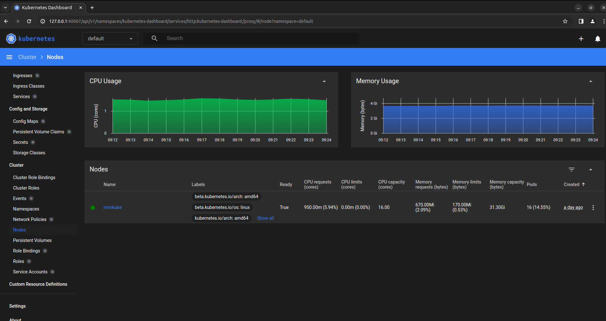

# Viewing Metrics on the Dashboard in kubernetes

- preveiously we have the `kubectl top pod` and `kubectl top node` command which provide the `actual resource used by each POD container or cluster`

- here we are using the `commandline output of the actual resource used by each POD container or cluster` using the `metrics-server`

- but if we want then we can setup `light weight very basic metrics dashboard` so that `we can see a graphical user interface for the metrics output`

- which is a `light weight and very basic implementation of the monitoring system`

- `light weight very basic metrics dashboard` not so `sophesticated as the prometheus` where we can `set up` the `Alarm` , but it is `useful`

- there is `dashboard` build into `kubernetes` , which is `another minikube addon`

- here we can see all the `minikube addons` by using the command as below 

    ```bash
        minikube addons list
        # this will list out all the addons available inside the minikube kubernetes cluster
        # here hence we will get the response as below 
        |-----------------------------|----------|--------------|--------------------------------|
        |         ADDON NAME          | PROFILE  |    STATUS    |           MAINTAINER           |
        |-----------------------------|----------|--------------|--------------------------------|
        | ambassador                  | minikube | disabled     | 3rd party (Ambassador)         |
        | auto-pause                  | minikube | disabled     | minikube                       |
        | cloud-spanner               | minikube | disabled     | Google                         |
        | csi-hostpath-driver         | minikube | disabled     | Kubernetes                     |
        | dashboard                   | minikube | disabled     | Kubernetes                     |
        | default-storageclass        | minikube | enabled ✅   | Kubernetes                     |
        | efk                         | minikube | disabled     | 3rd party (Elastic)            |
        | freshpod                    | minikube | disabled     | Google                         |
        | gcp-auth                    | minikube | disabled     | Google                         |
        | gvisor                      | minikube | disabled     | minikube                       |
        | headlamp                    | minikube | disabled     | 3rd party (kinvolk.io)         |
        | helm-tiller                 | minikube | disabled     | 3rd party (Helm)               |
        | inaccel                     | minikube | disabled     | 3rd party (InAccel             |
        |                             |          |              | [info@inaccel.com])            |
        | ingress                     | minikube | disabled     | Kubernetes                     |
        | ingress-dns                 | minikube | disabled     | minikube                       |
        | inspektor-gadget            | minikube | disabled     | 3rd party                      |
        |                             |          |              | (inspektor-gadget.io)          |
        | istio                       | minikube | disabled     | 3rd party (Istio)              |
        | istio-provisioner           | minikube | disabled     | 3rd party (Istio)              |
        | kong                        | minikube | disabled     | 3rd party (Kong HQ)            |
        | kubeflow                    | minikube | disabled     | 3rd party                      |
        | kubevirt                    | minikube | disabled     | 3rd party (KubeVirt)           |
        | logviewer                   | minikube | disabled     | 3rd party (unknown)            |
        | metallb                     | minikube | disabled     | 3rd party (MetalLB)            |
        | metrics-server              | minikube | enabled ✅   | Kubernetes                     |
        | nvidia-device-plugin        | minikube | disabled     | 3rd party (NVIDIA)             |
        | nvidia-driver-installer     | minikube | disabled     | 3rd party (Nvidia)             |
        | nvidia-gpu-device-plugin    | minikube | disabled     | 3rd party (Nvidia)             |
        | olm                         | minikube | disabled     | 3rd party (Operator Framework) |
        | pod-security-policy         | minikube | disabled     | 3rd party (unknown)            |
        | portainer                   | minikube | disabled     | 3rd party (Portainer.io)       |
        | registry                    | minikube | disabled     | minikube                       |
        | registry-aliases            | minikube | disabled     | 3rd party (unknown)            |
        | registry-creds              | minikube | disabled     | 3rd party (UPMC Enterprises)   |
        | storage-provisioner         | minikube | enabled ✅   | minikube                       |
        | storage-provisioner-gluster | minikube | disabled     | 3rd party (Gluster)            |
        | storage-provisioner-rancher | minikube | disabled     | 3rd party (Rancher)            |
        | volumesnapshots             | minikube | disabled     | Kubernetes                     |
        |-----------------------------|----------|--------------|--------------------------------|

        # here we will need to enable the addon named as dashboard
        # we can anable the addons with the command as below 
        minikube addons enable dashboard
        # here we are enabling the dashboard minikube kubernetes addons in this case
        💡  dashboard is an addon maintained by Kubernetes. For any concerns contact minikube on GitHub.
        You can view the list of minikube maintainers at: https://github.com/kubernetes/minikube/blob/master/OWNERS
            ▪ Using image docker.io/kubernetesui/dashboard:v2.7.0
            ▪ Using image docker.io/kubernetesui/metrics-scraper:v1.0.8
        💡  Some dashboard features require the metrics-server addon. To enable all features please run:

            minikube addons enable metrics-server


        🌟  The 'dashboard' addon is enabled

    ```

- we can see the `POD` spunned inside the `kubernetes-dashboard namespace` as below

- here we will getting additional `POD and Deployment and Service` added onto the `kubernetes-dashboard namespace` while we install the `dashboard minikube addon`

    ```bash
        kubectl -n kubernetes-dashboard get all
        # fetching all the kubernetes workload inside the kubenetes-dashboard namespace 
        # here we will be getting the below info in that case
        NAME                                             READY   STATUS    RESTARTS   AGE
        pod/dashboard-metrics-scraper-7fd5cb4ddc-7nfc8   1/1     Running   0          13h
        pod/kubernetes-dashboard-8694d4445c-ldk8r        1/1     Running   0          13h # here we can see the kubernetes-dashboard POD from the Deployment

        NAME                                TYPE        CLUSTER-IP       EXTERNAL-IP   PORT(S)    AGE
        service/dashboard-metrics-scraper   ClusterIP   10.111.158.107   <none>        8000/TCP   13h
        service/kubernetes-dashboard        ClusterIP   10.97.169.82     <none>        80/TCP     13h # here we can see the kubernetes-dashboard service as well

        NAME                                        READY   UP-TO-DATE   AVAILABLE   AGE
        deployment.apps/dashboard-metrics-scraper   1/1     1            1           13h
        deployment.apps/kubernetes-dashboard        1/1     1            1           13h

        NAME                                                   DESIRED   CURRENT   READY   AGE
        replicaset.apps/dashboard-metrics-scraper-7fd5cb4ddc   1         1         1       13h
        replicaset.apps/kubernetes-dashboard-8694d4445c        1         1         1       13h

    ```

- the `kubernetes-dashboard` is a `Browser Based Application`

- we can goto the `kubernetes-dashboard` service definition and `edit the kubernetes-dashboard Service` to allocate a `NodePort Service Type` with a `allocated port i.e > 30000`

- but there is a `easier way available` in order to access the `kubernetes dashboard` by using the `minikube dashboard` command

- we can run the `minikube dashboard command as below`

    
    ```bash
        minikube dashboard
        # here we are using the minikube dashboard command in order to access the kubernetes dashboard
        # when we execute this command this will provide the outout as below
        # this command will automatically fire up a Browser
        # but the it will going to open in localhost port of the host system rather than minikube IP with port
        🤔  Verifying dashboard health ...
        🚀  Launching proxy ...
        🤔  Verifying proxy health ...
        🎉  Opening http://127.0.0.1:40067/api/v1/namespaces/kubernetes-dashboard/services/http:kubernetes-dashboard:/proxy/ in your default browser...
        libva error: vaGetDriverNameByIndex() failed with unknown libva error, driver_name = (null)
        [4037615:4037615:0226/085838.092814:ERROR:object_proxy.cc(576)] Failed to call method: org.freedesktop.ScreenSaver.GetActive: object_path= /org/freedesktop/ScreenSaver: org.freedesktop.DBus.Error.NotSupported: This method is not implemented
        [4037733:7:0226/085838.095528:ERROR:command_buffer_proxy_impl.cc(131)] ContextResult::kTransientFailure: Failed to send GpuControl.CreateCommandBuffer.
        [4037615:4037615:0226/085840.923378:ERROR:atom_cache.cc(229)] Add WM_CHANGE_STATE to kAtomsToCache


        
        # imp
        # the complexity over here is because we don't have to create any Kubernetes Service
        # as we know the kubernetes-dashboard is a ClusterIP Service hence can't be accessed outside the kubernetes cluster
        # here minikube will going to use a "Kubernetes Service" called `proxy`
        # which is a "mini web-server" which will run on the "host machine" which is not inside the "minikube kubernetes cluster"
        # when the traffic comes to the localhost of the host system then  redirect the traffic will forwarded to the kubernetes-dashboard service in this case
        # this is a quick and dirty way of accessing the Service even though they are working as ClusterIP inside the kubernetes cluster


        # here even we do a `ctrl+c` then we would think that that will stop the `kubernetes Service` i.e `proxy`
        # with which we will be unable to access the kubernetes-dashboard
        # but that will not going to happen when we use this command
        # even though we will be doing the "ctrl+c" thenm also we can ablew to access the "kubernetes dashboard"


    ```

- the `kubernetes dashboard` which got open due to the `minikube dashboard` command is not `paticularly very useful`

- but we can perform `any action` that we performed inside the `kubernetes-dashboard browser` that we are doing using the `kubectl command`

- we can perform action such as 
  
  - we can launch `New POD`
  
  - we can change the `Deployment`
  
  - anything that we are doing using the `kubectl` command

- we can goto the `kubernetes-dashboard` &rarr; `Deployments` &rarr; `select the Deployment` &rarr; `Scale Up the Deployment` as below

-   

- we can goto the `kubernetes-dashboard` &rarr; `Deployments` &rarr; `select the Deployment` &rarr; here we can see the `replicaset info` and `POD info` and `name of image that been used` &rarr; `click on the POD` then we can goto the `logs of the POD` as below 

- 

- 

- if we want to `perform` action with the `graphical User Interface` rather than using the `kubectl commandline` this could be the `tool that can be used`

- when we run in the `prodcution cluster` everything run through the `files` that we `checked into the  Source Control such as github/gitlab`

- then it will handed to the `CICD pipeline` such as `jenkins/azure Pipeline` to `perform all sort of action`  

- here we can get the `actual usage by the cluster Nodes` by `clicking on the Node inside the Cluster` inside the `kubernetes dashboard` showing the `actual resource usage` using the `CPU usage or memory Usage`

- 

- this `feature` been `recently updated`

- if we goto the `kubernetes github issue page` as [kubernetes github Issue Page](https://github.com/kubernetes/dashboard/issues/2986) then we can see the `Issue is now closed`

- if we goto the `corresponding pull request`  on [kubernetes github pull request](https://github.com/kubernetes/dashboard/pull/3504) we can see that `thats now approved` and `implemented`

- but if we are using the `preveious version of the kubernetes` if the `metrics-server kubernetes-dashboard` implementation not done then we will be unable to see the `actual resource usage` inside `clicking on the Node inside the Cluster`

- if we are `using the old kubernetes version` and `unable to get the CPU and Memory Graph on metrics-server kubernetes-dashboard` then we can use the `additional addon called heapster`

- here the `metrics-server service` is a `replacement` for the `heapster service` which `is now` been `depricated and removed`

- so when we try to use the `minikube addons enable heapster` it will be pointing to the `metrics-server addon`

    ```bash
        minikube addons enable heapster
        # here if we try to enable the heapster minikube kubernetes addon then 
        ⌛  using metrics-server addon, heapster is deprecated
        💡  metrics-server is an addon maintained by Kubernetes. For any concerns contact minikube on GitHub.
        You can view the list of minikube maintainers at: https://github.com/kubernetes/minikube/blob/master/OWNERS
            ▪ Using image registry.k8s.io/metrics-server/metrics-server:v0.6.4
        🌟  The 'metrics-server' addon is enabled

    ```

- when we use the command as `minikube dashboard` then it `automatically` `enable the addons as well`

    ```bash

        minikube addons disable dashboard
        # here we are disabling the dashboard minikube addons
        🌑  The 'dashboard' addon is disabled


        minikube dashboard
        # here we are enabling the minikube dashboard command in this case
        🔌  Enabling dashboard ...
        ▪ Using image docker.io/kubernetesui/dashboard:v2.7.0
        ▪ Using image docker.io/kubernetesui/metrics-scraper:v1.0.8
    💡  Some dashboard features require the metrics-server addon. To enable all features please run:

        minikube addons enable metrics-server
        🤔  Verifying dashboard health ...
        🚀  Launching proxy ...
        🤔  Verifying proxy health ...
        🎉  Opening http://127.0.0.1:41787/api/v1/namespaces/kubernetes-dashboard/services/http:kubernetes-dashboard:/proxy/ in your default browser...
        libva error: vaGetDriverNameByIndex() failed with unknown libva error, driver_name = (null)
        [64821:64821:0226/095310.264702:ERROR:object_proxy.cc(576)] Failed to call method: org.freedesktop.ScreenSaver.GetActive: object_path= /org/freedesktop/ScreenSaver: org.freedesktop.DBus.Error.NotSupported: This method is not implemented
        [64928:7:0226/095310.273563:ERROR:command_buffer_proxy_impl.cc(131)] ContextResult::kTransientFailure: Failed to send GpuControl.CreateCommandBuffer.
        [64821:64821:0226/095312.765143:ERROR:atom_cache.cc(229)] Add WM_CHANGE_STATE to kAtomsToCache


    ```

- the `default url of the metrics-server` which will be pointing to the `workloads` which will show the `resource usage` for the `default namespace` such as `POD resource usage`

- but if we goto the `Nodes`  and check the `resource` usage which been provided for `all the namespaces`

- hence we might seen a `surge in CPU and memory usage` using the `Nodes` as it include `all the namesapce suchas kube-public and kube-system and kubernetes-dashboard` etc

- here we can goto `individual POD` in order to see the `resource usage` i.e `CPU and Memory usage` for the `POD container`

- we will be not getting the `grafana and influxdb` while using the `metrics-server` addons

- but if we are using the `heapster` then it will come along with the `default implementation of grafana and influx DB`  

- **How to Delete the Minikube Kubernetes Cluster**

- we can delete the `minikube local kubernetes cluster` then we can use it as below 

- here we can use the command as 

    ```bash
        minikube delete
        # this will remove the minikube kubernetes cluster
        # the below will be response for the same
        Deleting local kubernetes cluster
        Machine Deleted 
        
        rm -rf ~/.kube
        # here we are removing the kube config folder in this case

        rm -rf ~/.minikube
        # here we are removing the minikube config folder in this case

    ```

- **How to disable the yaml file so that `kubectl apply/create` command will not be picking it up**

- we can mention the `yaml definition` file as `*.yml.disabled` then this will be `disables` the `kubectl apply` command will not `pick that up`
-   