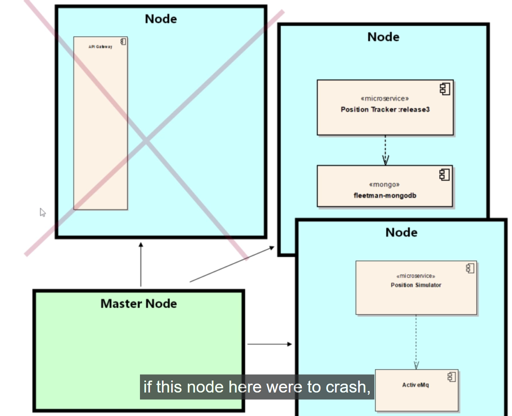

# Getting Started With AWS with kubernetes 

- here in this case we will deploy the `micro-service system` onto some `real hardware`

- one of the `key selling point ` for `kubernetes` being that `it can automate much of your cloud platform`

- by reading the `definition yml` kubernetes can know `what hardware resources being required for the kubernetes deployment` , we don't have to crate the `EC2 instances` or `Auto Scaling Group` or `Load Balancer` , kubernetes will going to do that for us 

- when we are learning about the ` major concept such as loadbalancer`  , we will provide the `heads up for the same`

- when working with the `AWS` we are actually `renting the resources` , we will be `renting` the `services` and `Load Balancer` and `hard drive`

- we can go to the `aws.amazon.com` & `signup link`  create the `new AWS account`

- here the `work we will be doing here way beyond the free tier` hence a `charge will be incured`

- we must have to `delete the resources` once we `done with the resource` , otherwise we will be getting `very big bill`

- currently we are using the `minikube kubernetes local cluster` which is `not intended` for the `production environment`

- `minikube` intended for the `developer` who are working `locally` in order to check `kubernetes configuration`

- preveiously we have the `minikube Linux VM machine` , where `minikube een runnign kubernetes` inside which we deployed the `microservice-system` and also mapped the `volume` to the `Linux VM host` of the `minikube VM` 

- while working on the `microservice architecture` we will be working with the `small potion of the system which can be considered as small sub-system of the microservice`

- if we are handling small portion of the system such as `6 to 7 microservice` which will be enough to fit into the `minikube kubernetes local cluster`

- when we are going to the `production environment` using `cloud` we have to create `multiple nodes`

- `kubernetes nodes` are basically the `physical Server of the system i.e EC2 instances which is the physical server` in case of `AWS Service` 

- perhaps `one node might not be enough to hold the entire micro-service architecture` , hence we need to `deploy multiple Nodes inside the cluster`

- we might have to deploy `small portion or sub system of the microservice architecture to a single node`

- typically in `kubernetes in cloud` we have `multiple nodes inside the single kubernetres cluster`

-  

- there are 2 advanatage of that 
  
  - 1st being the `Node` need not be `big and powerful instances of physical server` because we can deploy just `part or subsytem of the microservice architecture into each of the node`
    
    - on the above example we can see that
      
      - `API Gateway microservice` being deployed to `one node`
      
      - `position-tracker and mongodb microservice` being deployed to `another node`   
      
      - `position-simulator and Active MQ` being deployed into `another node` in this case 
      
      - but one of the `joy of being in kubernetes` that we don't have to `make the decession` that `which microservice pod should goto which node` that been `scheduled` by the `master node`
      
      - `master node` will be `responsible` to `scheduling the PODs into the other nodes inside the kubernetes cluster in cloud`  
  
  - 2nd being , `with little thought we can make the system tolerant to faiulure`  
    
    - if one of the `node inside the kubernetes cluster crashed as below` , then we don't have the `API Gateway microservice` , which can lead to `component not working well`
    
    - 
    
    - the `masternode` will detect that `there is no running instance of API Gateway POD microservice` as the `node went down`
    
    - but as we have `deployed the API Gateway POD microservice as Deployment or replica-set` setting the `number of replicas as 1` , hence at given point `there should be 1 instances of the API Gateway POD microservice` should be running 
    
    - hence `masternode` will run the `instance of API Gateway POD microservice ` in one of the `2 Survibing node as below` inside the `position simulator and Active MQ POD microservice` node
    
    - 
    
    - but we can `architect this another way` where we could have say that `API Gateway POD microservice is critical to the microservice architecture` , if `it down for 30 sec` it can affect the `entire microservice`
    
    - we can spun `2 replicas for the API Gateway microservice POD` which means that `masternode ensure that` the `API Gatway POD microservice` will run in `2 different nodes of the kubernetes cluster at a time` 
    
    - by `architecting correctly` we can make sure that `microservice system resilient enough to survive the node failure` 
  
- we can also `mount the mongodb database to EBS volume which is the virtual hard drive` rather than the `local host system` that we have done last time 

- we can configure the `EBS volume virtual hard drive`  and link them to `any POD running inside the particular node of the kubertes cluster`

- if the `nomgodb POD micrservice been crashed inside the node because of node failure` then it will `restart the PODs into any of the surviving node` and `mongodb POD restarted in another node can still able to connect back to the EBS Volume` so that there will be `no loss of data`

- we need to set the `kuberntes cluster in AWS cloud` with `one masternode and 3 additional nodes where PODs will be running`

- 