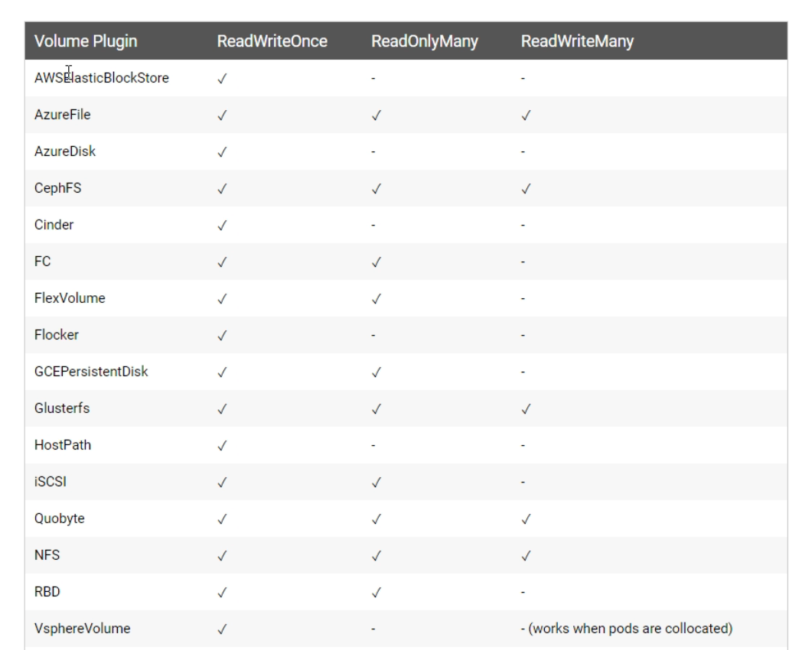
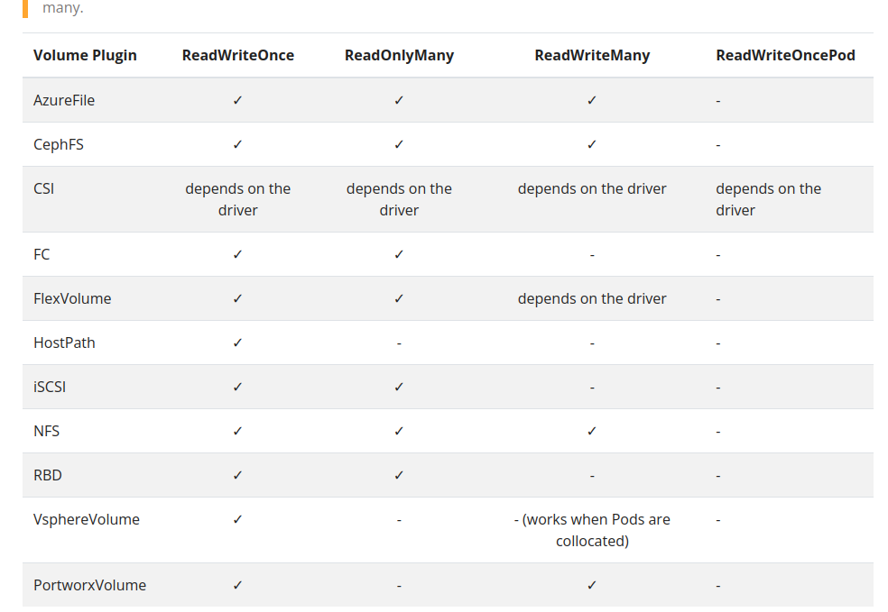

# persistance volume claim in kubernetes 

- we have set a up a `VolumeMount` for the `mongodb POD` which will map the `/data/db folder of the mongodb POD container` to `which will be stored outside of the container, inside the file system of the host`

- one  of the `power of kubernetes is that` we can define the `system configuration` as `VolumeMount where we define the which of the container file system we want to map` we can map it to `different system` such as `HostPath if we want to use the local path of the host system for dev testing` or we can use the `Amazon EBS volume` with the config as `awsElasticBlockStore insted of HostPath`

- but in the `real world scenario` `we don't have only one POD` which need the `Peristance Volume` rather `multiple POD in 100s` requiring the `Persistance Volume` in that case

- if we `define like before and then decided to migrate the persistance storage from one platform to another platform` then `we have to change that in every POD definition` , which can become very tidious to perform ,where we need to change from `hostPath` to `awsElasticBlockStore` on every POD defined inside the `definition yml file`

- here in this case we have `HardCoded` the `implementation of the volume mapping i.e mounting` based on `Single POD` , but a better approach might be, `removing the preveious implmentation of volume mapping or mounting based on single POD hard code reference` and rather use a `reference pointer of configuratrion` where we need to define the `how the implementation of the volume mapping i.e mounting`  going to happen 
 
- if are using `reference pointer for the configuratrion` where the `implementation of the volume mapping mount being defined` then we can `define that configuration i.e how the implementation of the volume mapping mount in a separate file ` , in that case if we are `migrate` the `platform` then we just have to change the `configuration file` no the `reference pointer that we are using inside thye kubernetes object definition yml file`

- in `kubernetes` defining the `reference pointer configuration file where we will define how the implementation of volume mapping going to happen` called a jargon as `persistanceVolumeClaim`

- rather than defining the `hostPath/awsElasticBlockStore inside the volume` for every `POD` we can use the `persistanceVolumeClaim`

- it takes `another key ` called `claimName` where we can define the `reference pointer for the configuration  where we can define the implementation of volume mapping`

- when we are defining the `persistantVolumeClaim` then this `claimName` s`hould claim some storage` `in order to define the volume` in the `reference pointer for the configuration file`

- we can define the `mongo-stack.yml` file as below 

    ```yaml
        mongo-stack.yml
        ===============

        apiVersion: apps/v1  # defining the apiVersion as apps/v1 for the Deployment as it exist in apps group
        kind: Deployment # defining the type of object in this case as Deployment
        metadata: # defining the name for the Deployment out in here
            name: mongodb
        spec: # defining the specification for the Deployment
            replicas: 1 # using 1 replica-set which will responsible to manage the POD 
            selector: # defining the selector key value pair based on the POD label
                matchLabels:
                    app: mongodb
            template: # defining the POD definition inside the template derivatiove
                metadata: # defining the POD label inside the metadata section
                    labels: # defining the POD label as key and value pair
                        app: mongodb
                spec: # defining the specification for the POD definition
                    containers: # defining the containers inside the POD
                        - name: mongodb # name of the container as mongodb
                          image: mongo:3.6.5-jessie # image  we will beusing for the container
                          volumeMount: # using the volumeMount which will define the lis of folder inside the container we want to map outside 
                            - name: mongo-persist-volume # using the name of the VolumeMount which will be used in the volumes section to refer which folder inside container we want map as there can be multiple folder inside the container map outside of the container 
                              mountPath: /data/db # defining the folder we want to map inside the container
                    
                    volumes: # defining the volume which will tell how we will implement the volume mapping to a hostPath/awsEbsStorage or anything 
                        - name: mongo-persist-volume # referencing the volumeMount based on their name provided
                          persistentVolumeClaim: # defining the persistanceVolumeClaim which will be a separate confifuration file to define how to implement the volume mapping or mount in hostPath/awsEBSStorage
                            claimName: mongo-pvc # defining the claimName which need to be defined inside  the separate confifuration file with the same name in order to claim some storage for the volume
                            # here this mongo-pvc claim name should be defined in the separate configuration file which will define the how to implement volume mapping and also it will claim the spaces for the Persistant Volume


        --- # defining the documentSeparator over here 

        apiVersion: v1 # defining the apiVersion as v1 in here as it belong to the core group 
        kind: Service # defining the kubernetes object type as Service in here
        metadata: # defining the name for the Service whioch should exactly name as fleetman-mongodb
            name: fleetman-mongodb
        spec: # defining the spec for the Service defined here
            selector: # this will select the POD based on label same as the key-value pair
                app: mongodb
            ports: # defining the ports that need to exposed for the Service
                - name: mongoport # name for the port defined as mongoport
                  port: 27017 # defining the port number as 27017 in here
                  protocol: TCP # defining the protocol as TCP
            
            type: ClusterIp # defining it as ClusterIp service which will not avaialble outside of the minikube kubernetes local cluster
    
    ```

- we can define these `reference pointer configuration` in the same `yml definition file of kubernetes object` , but here we will be creating a `separate configuration file` for
  
  - claiming storage for the persistent volume
  
  - how to implement volume mapping or mounting for the VolumeMount thats been defined 
  
- here we will be creating a `separate configuration file`  such as `storage.yml` where we will performt the `above 2 action`

- in the `configuration file`  we need to define the `how the storage would be implemented` , here we will be using the `localstorage` which will save to the `hostPath` with the name as `claimName` i.e `mongo-pvc`

- here in this `storage.yml` we will define all the configuration for the `volume mapping and mounting` which can be `localStorage or awsEBSVolume` , but as we are just referencing this configuration inside the `mongo-stack.yml definition file` hence now if we have decided to change the platform then we don't have to make any changes to `mongo-stack.yml`  rather we can just make a change only in the `storage.yml` 

- hence the `kubernetes workload (POD/replica-set/Deplouyment)` does not have the `implementation detail for thge volume mapping or mounting`  , it will just hold the reference pointer for the same , hence when changing the platform for the `volume mapping or mounting` we need not have to change the `kubernetes workload` , we can simply change the `storage.yml configuration file where that reference been defined`

- we can have `100 PODs defined in the workloads` and their corresponding `reference pointer for the PersistentVolumeClaim reference`  , if we want to change then we can just change the `reference pointer configuration file storage.yml` 

- we can define that `storage.yml` as below 

    
    ```yaml

        storage.yml
        ===========
        # here we need to define What we want for the Persiatnt Volume Claim
        apiVersion: v1
        kind: PersistantVolumeClaim
        metadata: # defining the PersistentVolumeClaim with the claimName that we have defined in the volume section of the mongo-stack.yml
            name: mongo-pvc  
        spec: # defining thespecification for the PersistentVolumeClaim
            resources: # here we are requesting for the resource hard disk should be 20Gi i.e 20 Gigabyte inside the kubernetes cluster
                      # here we are requesting the kubernetes to have a  20 Gigabyte Hard Disk Storage for Persistant volume claim
                requests:
                    storage: 20Gi # here using the storage as 20Gi i.e 20Gigabyte 
        
        # we dont have to define the implementation of volume Mapping inside the PersistantVolumeClaim
        # here we are just claiming that we need the 20Gi Hard Disk Resource from kubernetes to store the Peristant Volume

        ---

        # here we wilkl define how to implement the volume mappng or mounting 
        # here we need to define whether thats a local Storage path ot aws EBS volume we need to define  in here

        apiVersion: v1 # defining the apiVersion as v1 in this case
        kind: PersistantVolume # defining the kubernetes object as PersistantVolume
        metadata: # defining the name for the PeristentBolume in here 
            name: local-storage
            # here as we are using the local stoage using the HostPath hence we need to define the name as local-storage
        spec: # defining the specification for the PersistantVolume
            hostPath: # defining the hostPath for the local path inside the host system
                path: /mnt/mongodb-new # defining the path as  /mnt/mongodb-new which will created in the Host System of the kubernetes minikube local cluster which using the Linux VM
                type: DirectoryOrCreate # this is the default option for the type if we don't mention also it will going to be get picked up
            

    
    ```

- here as we have an `entire configuration` for a  `PersistentVolumeClaim` inside the `configuration file` , hence we can `define few additional sophesticated paramter in the configuration yml` which we are not doing on preveious approach

- `we can claim certain amount of hard disk space` for the `particular persistent volume claim`

- we can define that we need `certain resources` by defining the `resources block` inside the `spec block` and inside the `resources block` we need to `requests`  for `storage i.e hard disk of 20Gi i.e 20 Gigabyte`

- here we are specifying that `kubernetes need to go away and fetch 20Gigabytes of hard disk storage for the persistant volume`

- here in the `PersistentVolumeClaim` we don't define `How to implement the volume mapping or mount going to implement` we need dto define that inside the `PersistentVolume`

- we don't have to put `How to implement the volume mapping or mount going to implement` such as `hostPath/awsEbsStorage` inside the `PersistentVolumeClaim` , that need to be defined in another document which is known as the `PersistantVolume` which will be separate from the `PersistantVolumeClaim` 

- here the `PersistentVolumeClaim` syaing `what do we want` and the  `PersistentVolume` stateing `How to implemnent those voulme mapping or mounting whether to use the local folder on host or use AWS EBS volume`

- while defining the `PersistentVolumeClaim` , `which will define what we want to claim for the Persistent Volume ` and  we also have the `PersistentVolume` where we will define the `implementation of volume mapping or mounting whether thats a local Storage on host or aws EBS volume or azure Disk`

- but while defining the `PersistentVolumeClaim` and `PersistentVolume` we need to def9ine few `mandetory specification` that can be as below

- we can see these `mandetory field` for the `persistentVolumeClaim` and `persistentVolume` can  be fetched in [kubernbetes docs for pv and pvc](https://kubernetes.io/docs/concepts/storage/persistent-volumes/)
  

- for `PersistentVolumeClaim` :-->

  -  if we do a `ctrl+F` and search for `persistentVolumeClaim` then we can see that `accessModes` parameter with the list of value `ReadWriteOnce`
  
  - there are `3 option` available for the `accessModes` inside the  `persistentVolumeClaim`
    
      - `ReadWriteOnce` :- the `volume can be mounted as read-write` `by a single node` , ReadWriteOnce access mode still can allow multiple pods to access the volume when the pods are running on the same node , For single pod access, please see ReadWriteOncePod , which will be a case for 99% time or more 
    
      - `ReadOnlyMany` :- `the volume can be mounted as read-only by many nodes.`
    
      - `ReadWrirteMany`  :- the `volume can be mounted as read-write` `by a multiple node`  
  
- for `PersistentVolume` :--->
  
  - if we do a `ctrl+F` and search for `persistentVolume` then we can see that `accessModes` parameter with the list of value `ReadWriteOnce`
  
  - there are `3 option` available for the `accessModes` inside the  `persistentVolume`
    
      - `ReadWriteOnce` :- the `volume can be mounted as read-write` `by a single node` , ReadWriteOnce access mode still can allow multiple pods to access the volume when the pods are running on the same node , For single pod access, please see ReadWriteOncePod , which will be a case for 99% time or more 
    
      - `ReadOnlyMany` :- `the volume can be mounted as read-only by many nodes.`
    
      - `ReadWrirteMany`  :- the `volume can be mounted as read-write` `by a multiple node`  
  
  - in the `PersistentVolume` we need to define `what capacity it must be`
  
  - then we can define the `capacity` parameter i.e `how much of storage we are expecting from the persistent volume`
  
  - here we already define that `How much Storage we need for the persistentVolumeClaim ` , but here we need to define that `How much storage we will have to offer for the persistentVolume`
  
  - which does not make much sense while we are creating the `local folder in host system such as hostPath` , but will make more sense if we are using the `AWS EBS Volume` which will create the `EBS Storage of required capacity inside the cloud resources`
  
  - here in case of the `local folder path  or hostPath` it will the `directory that we want to volume map to in hosts system` will have the capacity of `20 Gi`

  - but as we are using it local `we must have claim the same or more Gi Resource that we are claiming to create  as a part of PersistentVolumeClaim`
  
  - here in the `PersistentVolumeClaim` we are asking for the `20 Gi of storage` from `kubernetes`
  
  -  in the `PersistentVolume` we are fullfilling `how much storage we need to offer which should be either same or more in case of local file path such as hostPath`
  
  - here as we are `claiming the Storage of 20 Gigabytes` hence we need to specify the `same or more amount of resource inside the Persistent Volume` , but we can't claim less 
  
  - `here we can define like as below where we can claim for 20Gi bytes of hard disk storage and saying we need all 20Gi ir More Gi to offer from the Persistent Volume`
  
  - hence we can define as below 

    
    ```yaml
        storage.yml
        ===========
        # here we need to define What we want for the Persiatnt Volume Claim
        apiVersion: v1
        kind: PersistantVolumeClaim
        metadata: # defining the PersistentVolumeClaim with the claimName that we have defined in the volume section of the mongo-stack.yml
            name: mongo-pvc  
        spec: # defining thespecification for the PersistentVolumeClaim
            resources: # here we are requesting for the resource hard disk should be 20Gi i.e 20 Gigabyte inside the kubernetes cluster
                      # here we are requesting the kubernetes to have a  20 Gigabyte Hard Disk Storage for Persistant volume claim
                requests:
                    storage: 20Gi # here using the storage as 20Gi i.e 20Gigabyte 
            
            accessModes:
                - ReadWriteOnce # defining the accessModes as ReadWriteOnce which means it can be accessed by single node one POD can mount it with read write access 
        
        # we dont have to define the implementation of volume Mapping inside the PersistantVolumeClaim
        # here we are just claiming that we need the 20Gi Hard Disk Resource from kubernetes to store the Peristant Volume

        ---

        # here we wilkl define how to implement the volume mappng or mounting 
        # here we need to define whether thats a local Storage path ot aws EBS volume we need to define  in here

        apiVersion: v1 # defining the apiVersion as v1 in this case
        kind: PersistantVolume # defining the kubernetes object as PersistantVolume
        metadata: # defining the name for the PeristentBolume in here 
            name: local-storage
            # here as we are using the local stoage using the HostPath hence we need to define the name as local-storage
        spec: # defining the specification for the PersistantVolume
            hostPath: # defining the hostPath for the local path inside the host system
                path: /mnt/mongodb-new # defining the path as  /mnt/mongodb-new which will created in the Host System of the kubernetes minikube local cluster which using the Linux VM
                type: DirectoryOrCreate # this is the default option for the type if we don't mention also it will going to be get picked up
    
            accessModes:
                - ReadWriteOnce # defining the accessModes as ReadWriteOnce which means it can be accessed by single node one POD can mount it with read write access 

            capacity:
                storage: 20Gi/100Gi # here we are defining that how much space the PersistantVolume going to offer against its PersistantVolumeClaim
        
    
    ```

- we can see that for the `different Persistence volume` su8ch as `aws EBS Storage or azure Disk or hostPath` what type of `accessModes` are supported with it 

-  

- 

- we can see here `awsElasticBlockStore` currently only support the `ReadWriteOnce` support

- here there are `2 separate Document` been defined such as 
  
  - `PersistentVolumeClaim` :--
    
    - here we are defining `what we want to do want ?` , `what do we need to be fullfilled in order to use the mongo container to make it persistent` 
    
    - here the `mongo-pvc` configuration saying `i need 20Gi of storage in order to create the persistent Volume` , `kubernetes has to fulfill that volume storage` 
    
    - then this `pvc` will seach for the `PersistentVolume` which offer the same or more capacity and able to fetch it  
    
    - but if we are having the `ask for 100Gi of storage from the pvc  but the pv offer only 10Gi` which will not work because it not the right match 
  
  - `PersistentVolume`  :---
    
    - here with the `PersistentVolume`  what `physical or virtual Storage` we want for the `mongo container to make it persistent` inside the `kubernetes cluster`
    
    - if we make the `capacity with storage as 100 Gi` and we are using it in `awsElasticBlockStorage env` then we can see that `100Gi of storage created inside the EBS volume for the resource`
    


- trhe `kubernetes administrator` is responsible to `set the capacity for the physical/virtual hard drive` 

- and we as developer can `claim few Gi from it from pvc and use that to perform the Volume Mapping or mounting `

- but here if we have notices the `persitentVolume` and `persistentVolumeClaim` have no `reference between them` , we will be usign the `storage class` in order to set the reference or link between the `pv and pvc`

