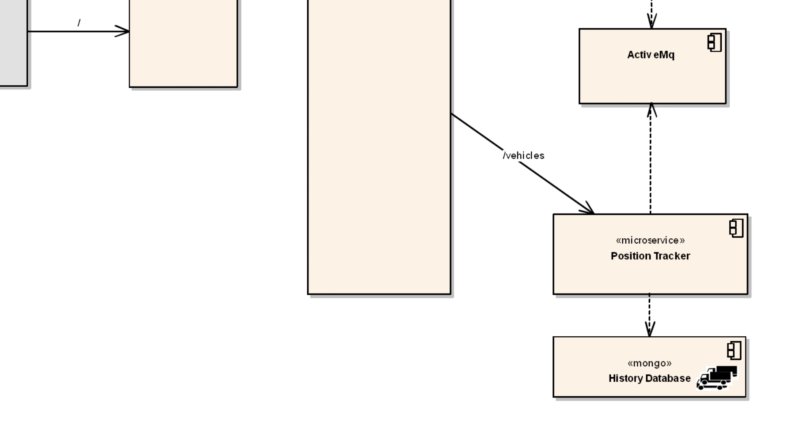

# persistsance and volume in kubernetes 

- we have relasised `when the POD destroyed` all the `data contained inside the POD` is `also lost`

- but `just like docker`  we can store the `data` on a `persistant volume`

- the `peristant volume` can be
  
  - `that could be a file` on the `file system` of the `host of the container`
  
  - it could be `real hard drive` as well on the `cloud environment` such as `EBS(Elastic block store) volume in AWS` 
  
- we have the `semi-realistic micro-service system` running from the `last session` , we will use that to `demo the concept of persistance and volume in kubernetes`

- `last session we have deployed` the `full micro-service architecture` onto `kubernetes local minikube cluster`

- we can start the cluster using the command as `minikube start --driver=docker` in this case out in here

- now we can see all the `kubernetes object using the command` as below where we can see `5 PODs running for 5 different microservice`

    ```bash
        kubectl get all
        # fetching all the kubernetes object from the default namespace in here
        # we will be gteeting the output as below 
        NAME                                      READY   STATUS    RESTARTS       AGE
        pod/api-gateway-5bf5cfc887-7zjtf          1/1h
        pod/position-simulator-56686f95f8-b546s   1/1     Running   5 (42s ago)    32h
        pod/position-tracker-f5bfcf944-hmx6q      1/1     Running   4 (52s ago)    29h
        pod/queueapp-dd9bb6dff-gjhkl              1/1     Running   4 (44s ago)    32h
        pod/webapp-586c6c87cd-gz56x               1/1     Running   16 (16s ago)   27h

        NAME                                TYPE        CLUSTER-IP       EXTERNAL-IP   PORT(S)                          AGE
        service/fleetman-api-gateway        NodePort    10.102.250.14    <none>        8080:30030/TCP                   27h
        service/fleetman-position-tracker   ClusterIP   10.98.86.239     <none>        8080/TCP                         29h
        service/fleetman-queue              NodePort    10.98.82.179     <none>        8161:30010/TCP,61616:30111/TCP   32h
        service/fleetman-webapp             NodePort    10.108.172.151   <none>        80:30080/TCP                     27h
        service/kubernetes                  ClusterIP   10.96.0.1        <none>        443/TCP                          2d12h

        NAME                                 READY   UP-TO-DATE   AVAILABLE   AGE
        deployment.apps/api-gateway          1/1     1            1           27h
        deployment.apps/position-simulator   1/1     1            1           32h
        deployment.apps/position-tracker     1/1     1            1           29h
        deployment.apps/queueapp             1/1     1            1           32h
        deployment.apps/webapp               1/1     1            1           27h

        NAME                                            DESIREDCURRENT   READY   AGE
        replicaset.apps/api-gateway-5bf5cfc887          1         1         1       27h
        replicaset.apps/position-simulator-56686f95f8   1         1         1       32h
        replicaset.apps/position-tracker-f5bfcf944      1         1         1       29h
        replicaset.apps/queueapp-dd9bb6dff              1         1         1       32h
        replicaset.apps/webapp-586c6c87cd               1         1         1       27h

    ```

- we can go to the `minikube IP` with the `nodePort` in order to see `vehicle move around the country`  as below 

    ```bash
        minikube ip
        # fetching the cluster ip using the command as minikube ip command
        192.168.49.2
        
        #now we can travel to the link as 
        http://192.168.49.2:30080
        # here we can see that vehicles been moved around the country 
    
    ```

- now we have the message from the `developer` that `there is a new release of the system` , This is now `release2`

- `Developers` been asking to update `all the existing image to Tag as release2 ` for the `POD image`

- **What special feature about the release2 Tag**
  
  - This `docker image with release2 Tag` will help us in `allow us to track history of each vehicles`
  
  - it also provide the chance to `explore the persistance feature in kubernetes in  this case`

- currently we have `2 definition files` for the `microservices` to `deployed onto` the `local cluster` 

- we have addedd the new feature to `history of where each vehicle have been to be remembered and stored somewhere such as DB/In Memory` 
  
- in order to `update the image` we have to update the `yml definition file` as below 

    
    ```yaml
        workloads.yml
        =============
        apiVersion: apps/v1
        kind: Deployment 
        metadata:
            name: queueapp
        spec:
            replicas: 1
            selectors:
                matchLabels:
                    app: queueapp
            template:
                metadata:
                    labels:
                        app: queueapp

                spec:
                    containers:
                        - name: queueapp
                          image: richardchesterwood/k8s-fleetman-queue:release2
                          # here we are updating the image to the release2 Tags in this case

        ---

        apiVersion: apps/v1
        kind: Deployment
        metadata:
            name: position-simulator
        spec:
            replicas: 1
            selector:
                matchLabels:
                    app: position-simulator
            template:
                metadata:
                    labels:
                        app: position-simulator
                spec:
                    containers:
                        - name: position-simulator
                          image: richardchesterwood/k8s-fleetman-position-simulator:release2
                          # here the making the image Tag to refer to release 2 in this case
                          env:
                            - name: SPRING_PROFILES_ACTIVE
                              value: production-microservice

        ---

        apiVersion: apps/v1
        kind: Deployment
        metadata:
            name: position-tracker
        spec:
            replicas: 1
            selector:
                matchLabels:
                    app: position-tracker
            template:
                metadata:
                    labels:
                        app: position-tracker
                
                spec:
                    containers:
                        - name: position-tracker
                          image: richardchesterwood/k8s-fleetman-position-tracker:release2
                          # here the changint the Tag for the image as release2 in this case
                          env:
                            - name: SPRING_PROFILES_ACTIVE
                            - value: production-microservice
    
    
        ---

        apiVersion: apps/v1
        kind: Deployment
        metadata:
            name: api-gateway
        spec:
            replicas: 1
            selector:
                matchLabels:
                    app: api-gateway
            template:
                metadata:
                    labels:
                        app: api-gateway
                
                spec:
                    containers:
                        - name: position-tracker
                          image: richardchesterwood/k8s-fleetman-api-gateway:release2
                          # here the changint the Tag for the image as release2 in this case
                          env:
                            - name: SPRING_PROFILES_ACTIVE
                            - value: production-microservice


        ---

        apiVersion: apps/v1
        kind: Deployment
        metadata:
        name: webapp
        namespace: default
        spec:
        selector:
            matchLabels:
            app: webapp
        replicas: 1
        template:   
            metadata:
            labels:
                app: webapp
            spec:
            containers:
            - name: webapp
                image: richardchesterwood/k8s-fleetman-webapp-angular:release2
                # here changing the version of the webapp to release2 as well
                env:
                - name: SPRING_PROFILES_ACTIVE
                value: production-microservice

    
    ```

- with the `release2 Tags` we have added the `feature` to allow the `history` , `where each vehicle has been remembered` and `stored somewhere` such as `DB`

- we can apply those changes for the deployment as below 

    ```bash
        cd practical_kube_microservice
        # going to the location where the workload and service definition file been declared
        # applying the changes in here 
        kubectl apply -f .
        # this will apply the changes to all the definition files inside the particular directory
        # we can see the output as below 
        deployment.apps/queueapp configured
        deployment.apps/position-simulator configured
        deployment.apps/position-tracker configured
        deployment.apps/api-gateway configured
        deployment.apps/webapp configured 
    
    ```

- we can see that `kubectl get all` , `which will be taking time sometime` as the `various microservice Deployment` will be `switched over in this case` 


- we can also see the `kubernetes object` inside the `default namespace` as below 

    ```bash
        kubectl get all
        # fetching asll kubernetes object inside the default namepsace in this case out in here
        # below will be the output for the same
        NAME                                    READY   STATUS              RESTARTS       AGE
        pod/api-gateway-7c996ff9db-2hpct        1/1     Running             0              63s
        pod/position-simulator-6f78798c-qvhhr   1/1     Running             0              63s
        pod/position-tracker-5d868b66c7-jvl54   1/1     Running             0              63s
        pod/queueapp-c679b7cdb-qhrfr            0/1     ContainerCreating   0              63s
        pod/queueapp-dd9bb6dff-gjhkl            1/1     Running             4 (112m ago)   34h
        pod/webapp-5bdb5b4bd7-m67nh             1/1     Running             0              63s

        NAME                                TYPE        CLUSTER-IP       EXTERNAL-IP   PORT(S)                          AGE
        service/fleetman-api-gateway        NodePort    10.102.250.14    <none>        8080:30030/TCP                   29h
        service/fleetman-position-tracker   ClusterIP   10.98.86.239     <none>        8080/TCP                         30h
        service/fleetman-queue              NodePort    10.98.82.179     <none>        8161:30010/TCP,61616:30111/TCP   34h
        service/fleetman-webapp             NodePort    10.108.172.151   <none>        80:30080/TCP                     29h
        service/kubernetes                  ClusterIP   10.96.0.1        <none>        443/TCP                          2d14h

        NAME                                 READY   UP-TO-DATE   AVAILABLE   AGE
        deployment.apps/api-gateway          1/1     1            1           29h
        deployment.apps/position-simulator   1/1     1            1           34h
        deployment.apps/position-tracker     1/1     1            1           30h
        deployment.apps/queueapp             1/1     1            1           34h
        deployment.apps/webapp               1/1     1            1           29h

        NAME                                            DESIRED   CURRENT   READY   AGE
        replicaset.apps/api-gateway-5bf5cfc887          0         0         0       29h
        replicaset.apps/api-gateway-7c996ff9db          1         1         1       63s
        replicaset.apps/position-simulator-56686f95f8   0         0         0       34h
        replicaset.apps/position-simulator-6f78798c     1         1         1       63s
        replicaset.apps/position-tracker-5d868b66c7     1         1         1       63s
        replicaset.apps/position-tracker-f5bfcf944      0         0         0       30h
        replicaset.apps/queueapp-c679b7cdb              1         1         0       63s
        replicaset.apps/queueapp-dd9bb6dff              1         1         1       34h
        replicaset.apps/webapp-586c6c87cd               0         0         0       29h
        replicaset.apps/webapp-5bdb5b4bd7               1         1         1       63s
            
    ```

- after the `changes been applied` we need to perform a `hard refresh on a kubernetes webapp Service` to view all the changes in this case 

- we can do as below 

    ```bash
        minikube ip
        # this will provide the minikube local kubernetes cluster IP Address
        # we can perform the below response for the same in this case out in here 
        192.168.49.2

        #now we need to access the nodePort for the webapp Kubernetes service as below 
        http://192.168.49.2:30080
        # here we need to perform a Hard refresh in order to make those changes in this case out in here
        # we can perform the hard refresh by using the command as ctrl+f5 button
        # if we are doing a refresh only then we can see the OLD version as `Fleet Management System R1.A6.01` which is the older version
        # we can see that the left hand side menu bar taking sometime as the other microservices are getting switched over 
        # we can see that because we change the image for the Deployment we can see the POD are getting deleted and recreated
        # but if we do a `Hard Refresh` now we can see the window as `Fleet Managament System R2` in this case


        # here as we have created the Deployment for all the 5 microservices which can lead to 0 Downtime, hence even though we are upgrading it we will not be getting any 5XX Error 
        # rather the old page will going to be rendered up then taking a little delay while deploying the New Deployment PODs(Which can lead to Nothing showing on the left hand side)
        # but if this behaviour is unacceptable then we can discuss that while implementing the same on the cloud
        # we will also be discussing the `What Gurantee of Service we need from the Microservice system`

        # here with the release2 we can see the track of line for Each vehicle once we select the vehicle in that case
        # we can see that after the decent time there will be nice track which been set up for each vehicle

        
    
    ```

- we can `click` the `vehicle shown in the left hand pane` to see `where the vehicle has been` in this case 

- if for some of the `vehicles` if the `tracks are not showing` then we can `deselect and reselect it to populate the track `

- but here the `problem` been `all the records where the vehicle has been` were `simply stored` to the `memory` of the `Application` that `running inside` the `POD`

- `position data` is `being stored` in the `memory of current Spring Boot Application running inside position-tracker POD`

- this is not good practise , `eventually the POD will run out of memory` , not sure `How long it will take` , but `eventually that will going to happen`

- `of course we don't have` the `infity amount of RAM for the position-tracker microservice POD` , at some point that `position-tacker POD` going to be `get crashed` due to `memory Issue`

- we need to make the `microservice architrecture design` so that `microservices are resilient to failure` 

- when we deploy to `distributed microservice system into cloud architecture ` we need to `keep in mind that the node of the cluster can failed at a particular time`

- when the `Position-Tracker microservice POD` going to `run out of memory` and because of the `Deployment` it will going to be `get restarted in this case` , we will lose the `history of the vehicle` on the `Preveious Deployment  which got crashed`

- we can `simulate` as below 

    ```bash
        kubectl delete po position-tracker-5d868b66c7-6zdvx
        # removing the position tracker POD manually as its a part of the Deployment it will goi9ng to restart that POD in the system
        # we can do that as below  
        pod "position-tracker-5d868b66c7-6zdvx" deleted

        # now when the New PODs been spunned then we can go back to the Kubernetes Service i.e fleetman-webapp service
        minikube ip
        # this will provide the minikube local kubernetes cluster IP Address
        # we can perform the below response for the same in this case out in here 
        192.168.49.2

        #now we need to access the nodePort for the webapp Kubernetes service as below 
        http://192.168.49.2:30080
        
        
        # important:->
        # as we have stopped the POD hence all the report are stopped coming iun now 
        # here we don't have to refresh the page and select any other truck
        # we can observe that its working fine 
        # this is because the Preveious line been draw by the webapp Frontend and need not to redraw again
        # but as soon as the PODs been up themn we can see that the new POD been drawing from where the old webapp frontend been redraw
        # but if select andother vehicle or comeback to the original vehicle we can see that those History been now trucketed as itsw been calling the microservice to get the history
        # but as the microservices POD were recently created hence preveious run history wioll be trunketed


    ```

- there is a `clue that there is BAD design exist` in `micro-service architecture`

- as we know the `position tracker` is responsible to 
  
  - fetch the `position of the vehicle from the queue` and then perform `calculating the Speed of the vehicle`
  
  - and `it will also going to allow to track the history of the each vehicle and save it to somewhere such as in memory or DB`

- here this `and track the history of the each vehicle and save it to somewhere such as in memory or DB` is a `Bad Design` in that case out in here

- as the microservice will only be responsible to `only one thing at a time` as a `single responsiblity principle`

- there `should actually be 2 microservice here` , we can `architect a new service in here`
  
  - `position-tacker` microservice will only be responsible to calculate the `speed of the vehicle`
  
  - `history service microservice` will be responsible to `track where each vehicle has been mocing accross the country`
  

- we can also `rename the position-tracker microservice` to `vehicle-telemetry-service microservice`  

- in a `micro-service architecture` like this , the ` this type of design and architecture are emergent` and we will need to be `agile to adopt these changes in this case`

- 

- we can ask the `Developer to create the upgraded version of the Position Tracker` which will `store the Data(Vehicle Position as they move around the country ) into the DB`

- here the `Vehicle Position as they move around the country i.e Data is JSON in nature i.e (Not relational)` hence we will be using the `Document Database` such as `mongoDB` in this case 

- will bring the `new vewrsion of the position-tracker micro service in this case` and `use it to save the Data to mongoDb DB`

