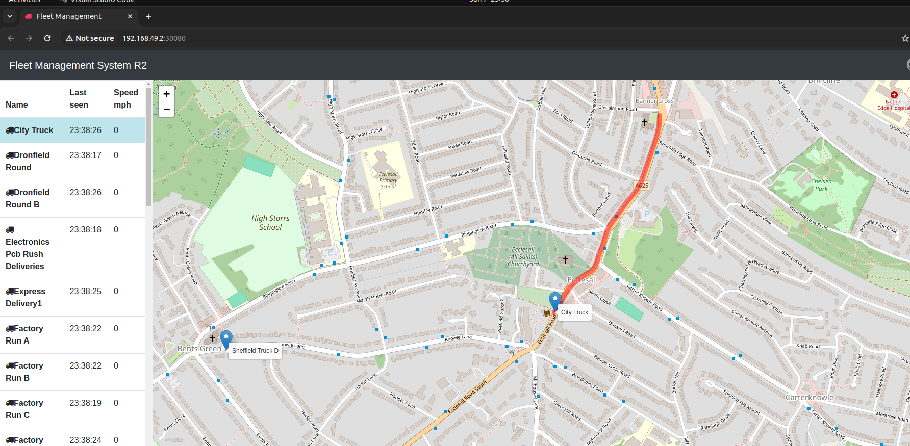

# storage class for Binding PersitentVolume and PersitentVolumeClaim in kubernetes

- we have defined the `PersistentVolumeClaim` which is important from the `developer point of view` which define `what we want for the particular container `

- we also defined the `PersistantVolume` which will be important from the `kubernetes cluster administrator` point of view where we define `how to implement volume mapping or mounting such as local folder of the host` i.e `how to provision the physical volume`

- but we have not seen `how to link the PersistentVolume to PersistentVolumeClaim` , but ` we can link them togethe`r using the `storage class `

- we can add a field called as `storageClasssName` into the `PersistentVolumeClaim` specification section as `spec`

- the `StorageClass` are `really important and useful` when we are using the `cloud environment`

- the `StorageClass` allow the `kubernetes cluster administrator ` to sertup  `different classes of the Storage`

- lets suppose the `kubernetes cluster administrator` using the `setting up the hard disc` which been using the `old magnetic hard disc` , it can provision the `volume for the same`

- we can also use the `SSD Storage` for the `persistentVolume` as well in this case 

- here typically the `SSD Storage will be much faster than the Mangentic Hard Disc Storage`  , we can have the `produce configuration for both of them`

- we can define all these `each Storage Type` by the `Storage Label` inside the `StorageClassName` inside the `PersistanceVolumeClaim`

- when declaring the `PersistanceVolumeClaim` we are defining that which `Stroage Type` we are using the by defaining the  `Storage Label` inside the `StorageClassName` 

- we will looking it to more details when we are going towards the cloud section

- but here we can define the `arbitary Storage Label` inside the `StrageClassName` inside the `spec` section of the `PersistanceVolumeClaim`

- we need to define the `StrageClassName` as `arbitary Storage Label` inside both the `PersistentVolume` and `PersistentVolumeClaim`

- on the runtime the `PersistentVolumeClaim` will look `accross the kubernetes cluster` and look for the `PersistentVolume` which matches 

  - `capacity storage of the PersistentVolume that we are offering` against what we are claiming inside the `PersistentVolumeClaim`
  
  - it also `matches the accessModes having ReadWriteOnce inside the PersistentVolume` which is equal as the `PersistentVolumeClaim` 
  
  - it also check for the `StorageClassName` where we are defining the `StorageLabel as arbitary name` inside the `PersistentVolume` same as for the `PersistentVolumeClaim`

- `the above 3 process of matching is called as binding in kubernetes ` , which means at run time the `PersistentVolumeClaim` will be `satisfied by the PersistentVolume` as it matches all the `3 condition defined above`

- once all these condition matched then we can have the `mongodb POD container` will be associated with the `local folder of the host using the hostPath`

- we can define the `storage.yml` file as below 

    
    ```yaml

        storage.yml
        ===========

        # here it will define what we want for the specific POD

        apiVersion: v1 # defining the apiVersion as v1 as the PersistantVolumeClaim belong to the core group
        kind: PersistantVolumeClaim # here defining the type of kubernetes object is as PersistantVolumeClaim
        metadata: # defining the name for the PersistantVolumeClaim
            name: mongo-pvc
        spec: # defining the specification for PersistantVolumeClaim
            accessModes: # defining the accessMode as ReadWriteOnce i,e single node single POD can perform the mount read-write operation
                - ReadWriteOnce
            resources: # defining the resources that we ask kubernetes to allocate the 20Gigabyte storage for the PersistantVolume claim
                requests:
                    storage: 20Gi
            StorrageClassName: mylocalstorage # using the StorageClassName with arbitary StorageClass label as mylocalstorage

        
        # at run time the PersistentVolumeClaim will look for the PersistentVolume accross the cluster as
        # here it will be looking for the PersistentVolume which have the storage capacity of 20Gi and more
        # it will look for those persistentVolume which will have the accessModes as ReadWriteOnce
        # here it also look for the  persistentVolume which has the StorrageClassName: mylocalstorage set on it 

        
        ---
        
        # here it will describe how to implement physical storage or virtual storage  for volume mapping or mounting 

        apiVersion: v1 # defining the apiVersion as v1 in this case as it belong to the core group
        kind: PersistentVolume # definign the kind as the kubernetes Object is of PersistentVolume tyoe
        metadata: # defining the name for the PersistentVolume here 
            name: local-storage
        spec: # defining the specification for the PersistentVolume here 
            hostPath: # here implementing the hostPath as we are sdaving to the local directory inside the hostpath in this case
                path: /mnt/mongo-data-new # what should be localpath on host to which it will be mapped
                type: DirectoryOrCreate # what type of hostPath we want to use DirectoryOrCreate is the default one if the Directory does not exist then it will be created
            accessModes: # defining the accessModes as ReadWriteOnce it means that only single node single POD can mount to the folder with ReadWriteAccess 
                - ReadWriteOnce
            capacity: # defining the capacity of the PersistentVolume have to offer which should be the capacity of the local folder of the host we want to map 
                storage: 20Gi # it should be >= PersistentVolumeClaim resource value in order to get picked
            StorrageClassName: mylocalstorage # here defining the StorrageClassName with StorrageClasslabel as arbitary value as mylocalstorage t get picked up 

    
    
    ```

- we can `deploy these changes` by `applying the changes` as below 

    
    ```bash
        kubectl apply -f storage.yaml
        # deploying the changes to the cluster by applying the changes in here
        # we can see the output as below in this case
        persistentvolumeclaim/mongo-pvc created
        persistentvolume/local-storage created
    
        # kubectl get all display all the kubernetes workloads inside the default namespace
        # hence when we do the kubectl get all we will not be able to see the PersistentVolume and PersistentVolumeClaim
        kubectl get all
        # fetching all the kubernetes workload details inside the default namespace
        NAME                                    READY   STATUS    RESTARTS       AGE
        pod/api-gateway-7c996ff9db-qjvsx        1/1     Running   3 (55m ago)    3d18h
        pod/mongodb-65bcfc4559-qbdvh            1/1     Running   1 (55m ago)    28h
        pod/position-simulator-6f78798c-jpg5w   1/1     Running   3 (55m ago)    3d18h
        pod/position-tracker-7f5bfddf94-h2qwq   1/1     Running   1 (55m ago)    32h
        pod/queueapp-c679b7cdb-c4qrg            1/1     Running   3 (55m ago)    3d18h
        pod/webapp-5bdb5b4bd7-887wk             1/1     Running   11 (54m ago)   3d18h

        NAME                                TYPE        CLUSTER-IP       EXTERNAL-IP   PORT(S)                          AGE
        service/fleetman-api-gateway        NodePort    10.109.75.231    <none>        8080:30030/TCP                   3d18h
        service/fleetman-mongodb            ClusterIP   10.111.228.40    <none>        27017/TCP                        3d18h
        service/fleetman-position-tracker   ClusterIP   10.110.137.219   <none>        8080/TCP                         3d18h
        service/fleetman-queue              NodePort    10.108.193.88    <none>        8161:30010/TCP,61616:32540/TCP   3d18h
        service/fleetman-webapp             NodePort    10.98.52.62      <none>        80:30080/TCP                     3d18h
        service/kubernetes                  ClusterIP   10.96.0.1        <none>        443/TCP                          3d18h

        NAME                                 READY   UP-TO-DATE   AVAILABLE   AGE
        deployment.apps/api-gateway          1/1     1            1           3d18h
        deployment.apps/mongodb              1/1     1            1           32h
        deployment.apps/position-simulator   1/1     1            1           3d18h
        deployment.apps/position-tracker     1/1     1            1           3d18h
        deployment.apps/queueapp             1/1     1            1           3d18h
        deployment.apps/webapp               1/1     1            1           3d18h

        NAME                                          DESIRED   CURRENT   READY   AGE
        replicaset.apps/api-gateway-7c996ff9db        1         1         1       3d18h
        replicaset.apps/mongodb-58dd94bb85            0         0         0       32h
        replicaset.apps/mongodb-65bcfc4559            1         1         1       28h
        replicaset.apps/position-simulator-6f78798c   1         1         1       3d18h
        replicaset.apps/position-tracker-7f5bfddf94   1         1         1       3d18h
        replicaset.apps/queueapp-c679b7cdb            1         1         1       3d18h
        replicaset.apps/webapp-5bdb5b4bd7             1         1         1       3d18h


        # but if we want to see the kubernetes PersistentVolume then we can use it as below
        kubectl get pv # fetching the PersistentVolume that we have defined as a part of the cluster as below 
        # the output is as below 
        NAME            CAPACITY   ACCESS MODES   RECLAIM POLICY   STATUS   CLAIM               STORAGECLASS     REASON   AGE
        local-storage   20Gi       RWO            Retain           Bound    default/mongo-pvc   mylocalstorage            52m

        # name of the PersistentVolume as metadata defined name which is local-storage
        # here also we are defining the capacity of the physical or cirtual hard drive which is of 20Gi
        # accessMode as ReadWriteOnce which means single node single POD have the read-write access to the mount
        # status as Bound which means its in use in this case out in here
        # we can see the associated PersistentVolumeClaim as default/mongo-pvc where default is the namespace and name of the PersistentVolumeClaim is mongo-pvc
        # here also the StorageClassName which is the StorageClass Label arbitary string as mylocalstorage


        # but here if we want to fetch the PeristanceVolumeClaim then we can get that as below 
        kubectl get pvc # fetching the PersistentVolumeClaim in here
        # we can see the below outcome in this case out in here
        NAME        STATUS   VOLUME          CAPACITY   ACCESS MODES   STORAGECLASS     AGE
        mongo-pvc   Bound    local-storage   20Gi       RWO            mylocalstorage   49m

        # here we can see the details as 
        # name of the PVC being as mongo-pvc
        # status as Bound means its in use
        # volume as persistentVolume i.e having the name as local-storage
        # here the capacity for the Storage for the PersistentVolumeClaim being 20Gigabyte
        # accessMode as ReadWriteOnce which means single node single POD have the read-write access to the mount
        # here the storage class name as mylocalstorage that we have defined in the yml

    
    ```

- here also we have `made the changes` to the `mongo-stack.yml` where we have define the `PersistentVolumeClaim` with the `claimName` inside the `volume section` as below

    ```yaml
        mongo-stack.yml
        ---------------

        apiVersion: apps/v1 # defining the apiVersion as apps/v1 for the Deployment as it exist in apps group
        kind: Deployment # defining the type of object in this case as Deployment
        metadata: # defining the name for the Deployment out in here
            name: mongodb
        spec: # defining the specification for the Deployment
            replicas: 1 # using 1 replica-set which will responsible to manage the POD 
            selector: # defining the selector key value pair based on the POD label
                matchLabels:
                    app: mongodb
            template: # defining the POD definition inside the template derivatiove
                metadata: # defining the POD label inside the metadata section
                    labels: # define the POD label as key value pair in this case
                        app: mongodb

                spec: # defining the specification for the POD definition
                    containers: # defining the containers for the POD inhere
                        - name: mnongodb # defining the name for the container out in here
                          image: mongo:3.6.5-jessie # here we are using the image as mongo:3.6.5-jessie
                          volumeMount: # defining the volumeMount for the docker container as below list
                            - name: mongo-persist-volume # defining the name for the volumeMount which will be used inside the volume section as reference
                              mountPath: /data/db # defining the folder inside the mongodb container which we want to store outside in local host path/aws EBS Storage etc
                    
                    volumes:
                        - name: mongo-persist-volume # referencing the volumeMount section over here
                          persistentVolumeClaim: # defining the PersistentVolumeClaim where we need to refer the 
                            claimName: mongo-pvc # defining the claimName which should claim kubernetes a volume capacity hardDrive

        ---

        apiVersion: v1 # here defining the apiVersion as v1 for the Services which belong to the core group in here  
        kind: Service # defining the kubernetes object type as Service in this case
        metadata: # defining the name of Service inside the metadata section over here
            name: fleetman-mongodb
        spec: # defining the specification for the Kubernetes Services in here
            selector: # defining the selector key value pair which will match the POD label with the smae name to associate a Service to the POD
                app: mongodb
            ports: # defining the Port we want to expose from the POD or container to outside
                - name: mongoport # here giving the name as mongoport in here
                  port: 27017 # the port number defined as 27017 which will allow the traffic
                  targetPort: 27017 # defining the targetPort which will be inside the container will allow 27017
                  protocol: TCP # defining the protocol as TCP in here
            
            type: ClusterIP # defining the type of Service as ClusterIP in this case out in here
    

    ```


- we have to `deploy those changes to to the cluster by applying the changes` as below

    ```bash
        kubectl apply -f mongo-stack.yml
        # deploying the changes to the kubernetes cluster by applying the changes
        # here we can define that as below 
        deployment.apps/mongodb created
        service/fleetman-mongodb unchanged
    
    
        # here we can see now for the mongodb POD the preveious POD been terminated and created the new POD
        # we can see those info as below 
        kubectl get all
        # fetching all kubernetes workloads inside the default namespace as below 
        NAME                                    READY   STATUS    RESTARTS       AGE
        pod/api-gateway-7c996ff9db-qjvsx        1/1     Running   3 (87m ago)    3d18h
        pod/mongodb-6cf46d49cb-fpvt5            1/1     Running   0              91s
        pod/position-simulator-6f78798c-jpg5w   1/1     Running   3 (87m ago)    3d18h
        pod/position-tracker-7f5bfddf94-h2qwq   1/1     Running   1 (87m ago)    33h
        pod/queueapp-c679b7cdb-c4qrg            1/1     Running   3 (87m ago)    3d18h
        pod/webapp-5bdb5b4bd7-887wk             1/1     Running   11 (86m ago)   3d18h

        NAME                                TYPE        CLUSTER-IP       EXTERNAL-IP   PORT(S)                          AGE
        service/fleetman-api-gateway        NodePort    10.109.75.231    <none>        8080:30030/TCP                   3d18h
        service/fleetman-mongodb            ClusterIP   10.101.33.89     <none>        27017/TCP                        2m41s
        service/fleetman-position-tracker   ClusterIP   10.110.137.219   <none>        8080/TCP                         3d18h
        service/fleetman-queue              NodePort    10.108.193.88    <none>        8161:30010/TCP,61616:32540/TCP   3d18h
        service/fleetman-webapp             NodePort    10.98.52.62      <none>        80:30080/TCP                     3d18h
        service/kubernetes                  ClusterIP   10.96.0.1        <none>        443/TCP                          3d18h

        NAME                                 READY   UP-TO-DATE   AVAILABLE   AGE
        deployment.apps/api-gateway          1/1     1            1           3d18h
        deployment.apps/mongodb              1/1     1            1           91s
        deployment.apps/position-simulator   1/1     1            1           3d18h
        deployment.apps/position-tracker     1/1     1            1           3d18h
        deployment.apps/queueapp             1/1     1            1           3d18h
        deployment.apps/webapp               1/1     1            1           3d18h

        NAME                                          DESIRED   CURRENT   READY   AGE
        replicaset.apps/api-gateway-7c996ff9db        1         1         1       3d18h
        replicaset.apps/mongodb-6cf46d49cb            1         1         1       91s
        replicaset.apps/position-simulator-6f78798c   1         1         1       3d18h
        replicaset.apps/position-tracker-7f5bfddf94   1         1         1       3d18h
        replicaset.apps/queueapp-c679b7cdb            1         1         1       3d18h
        replicaset.apps/webapp-5bdb5b4bd7             1         1         1       3d18h

    
        # now we are describing the mongodb POD we can see the volumeMount details and reference to PersistentVolume and PersistentVolumeClaim inside the volume section as below 
        kubectl describe po mongodb-6cf46d49cb-fpvt5
        # or we can write it as below
        kubectl describe pod/mongodb-6cf46d49cb-fpvt5
        # here we can see the below info on the volume section we can see the info about volumeMount and PersistentVolume and PersistentVolumeClaim 

        Name:             mongodb-6cf46d49cb-fpvt5
        Namespace:        default
        Priority:         0
        Service Account:  default
        Node:             minikube/192.168.49.2
        Start Time:       Sun, 07 Jan 2024 23:21:55 +0530
        Labels:           app=mongodb
                        pod-template-hash=6cf46d49cb
        Annotations:      <none>
        Status:           Running
        IP:               10.244.0.106
        IPs:
        IP:           10.244.0.106
        Controlled By:  ReplicaSet/mongodb-6cf46d49cb
        Containers:
        mongodb:
            Container ID:   docker://be631d9e51ebc328964d45fafdf8ee254e70b284faf62046f3f4e53693c17e9e
            Image:          mongo:3.6.5-jessie
            Image ID:       docker-pullable://mongo@sha256:3e00936a4fbd17003cfd33ca808f03ada736134774bfbc3069d3757905a4a326
            Port:           <none>
            Host Port:      <none>
            State:          Running
            Started:      Sun, 07 Jan 2024 23:21:57 +0530
            Ready:          True
            Restart Count:  0
            Environment:    <none>
            Mounts:
            /data/db from mongo-persiste-data (rw)
            /var/run/secrets/kubernetes.io/serviceaccount from kube-api-access-c7svh (ro)
        Conditions:
        Type              Status
        Initialized       True 
        Ready             True 
        ContainersReady   True 
        PodScheduled      True 
        Volumes: # defining the volume here 
        mongo-persiste-data: # this is the VolumeMount that been defined in here
            Type:       PersistentVolumeClaim (a reference to a PersistentVolumeClaim in the same namespace) # here we are defining the PersistentVolumeClaim with the reference pointer to the pvc
            ClaimName:  mongo-pvc #persistentVolumeClaim name is of mongo-pvc
            ReadOnly:   false
        kube-api-access-c7svh:
            Type:                    Projected (a volume that contains injected data from multiple sources)
            TokenExpirationSeconds:  3607
            ConfigMapName:           kube-root-ca.crt
            ConfigMapOptional:       <nil>
            DownwardAPI:             true
        QoS Class:                   BestEffort
        Node-Selectors:              <none>
        Tolerations:                 node.kubernetes.io/not-ready:NoExecute op=Exists for 300s
                                    node.kubernetes.io/unreachable:NoExecute op=Exists for 300s
        Events:
        Type    Reason     Age    From               Message
        ----    ------     ----   ----               -------
        Normal  Scheduled  4m37s  default-scheduler  Successfully assigned default/mongodb-6cf46d49cb-fpvt5 to minikube
        Normal  Pulled     4m36s  kubelet            Container image "mongo:3.6.5-jessie" already present on machine
        Normal  Created    4m36s  kubelet            Created container mongodb
        Normal  Started    4m36s  kubelet            Started container mongodb

    ```

- now we can access the `minikube kubernetes local cluster` to see that those folder were getting created or not 

- we can do that as below

    ```bash
        minikube ssh
        # here we are ssh into the minikube kubernetes cluster 
        # username and passsword not reequired if in need the username is docker and password is tcuser
        # now we have the access the Linux VM of the minikube kubernetes cluster as below 
        # here we can see the below info

        docker@minikube:~$ cd /mnt/
        docker@minikube:/mnt$ ls
        mongo-data  mongo-data-new
        docker@minikube:/mnt$ 

        # here we can see that on the /mnt folder the new files are getting created where the mongo.lock file also exists
        docker@minikube:/mnt$ exit # coming out of the minikube cluster
        logout

    
    ```

- now we can simulate that `if we are removing the mongoDB POD` then also `data become persistent because of the PersistentVolume and PersistentVolumeClaim `

- we can do that as below 

    ```bash
        kubectl delete pod/mongodb-6cf46d49cb-fpvt5
        # removing the mongodb POD here because of Deployment and replicaset these will be recreated again 
        # as the data been mounted hence it can able to persist the data
        pod "mongodb-6cf46d49cb-fpvt5" deleted

        # now if we access the minikube ip and the specific nodePort for the webapp
        # then we can see that data become persistent over here as well
        minikube ip
        # we will get the ip address as rewturned value 
        192.168.49.2

        #now if we access the minikube ip with nodePort of webapp which is of 30080 then we can see as below 
        http://192.168.49.2:30080
        # if we switch between the vehicle we can see that the data become persistent over here 
    
    ```

- 

