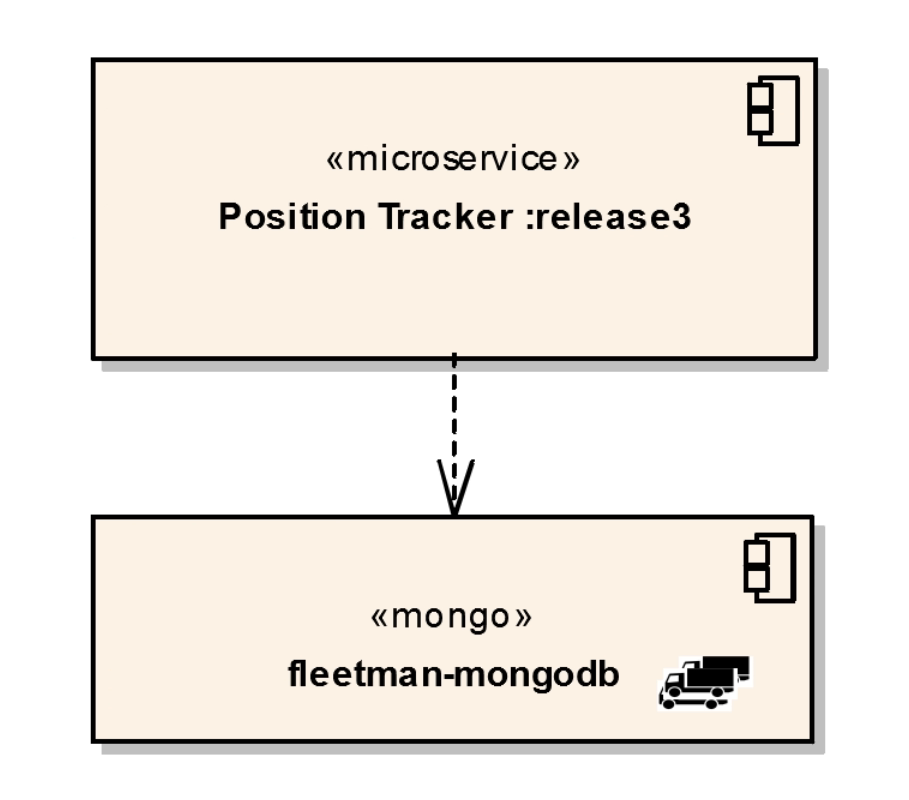

# upgrading to a mongo POD in kubernetes microservice architecture

- here in the `previous video` we did talk about the `DB of some form` , here we will be using the `mongoDB`

- this `mongoDb database` will be only used by the `position-tracker microservice` in order to `store the history of vehicle position as they move accrosss the country`

- it certainly not an `integration DB` which has `years of legecy Data , Triggers and constraints`

- here we will be using `Document Db such as mongo` as the `Data i.e vehicles positions are in the format of JSON in this case`

- the `Developers of the position-tracker microservice` and update the `microservice to release3` so that it can talk to a `mongoDB database` to store the `Data`

- if we just go the [DickChesterwood GitHub](https://github.com/DickChesterwood) &rarr; `k8s-fleetman` &rarr; `Branches` and &rarr;  `Tags as release3` then `k8s-fleetman-position-tracker` &rarr; `src` &rarr; `main` &rarr; `resources` &rarr; `application-production-microservice.properties`  thwn we can see that we are using something as below 

    ```java
        application-production-microservice.properties
        ===============================================
        spring.activemq.broker-url=tcp://fleetman-queue.default.svc.cluster.local:61616
        fleetman.position.queue=positionQueue
        // We'll use the default port 8080 for all microservices in production cluster.
        // TODO but this is reasonable guess! This may change when we scale it out...
        spring.data.mongodb.host=fleetman-mongodb.default.svc.cluster.local

        // here we have added one more line which been telling the spring application from where the mongodb host will be coming from 
        // it has the service name as  fleetman-mongodb which is in the default namespace
        // the full FQDN(fully qualified Domain name) being here is fleetman-mongodb.default.svc.cluster.local

        // here this is a spring boot property been defined for the mongoDB database as spring.data.mongodb.host


    ```

- here this is the same exact `ENV variable we are setting for the sping boot application` where the `ENV variable name = SPRING_PROFILES_ACTIVE` and value being `production-microservice`

- here the `developer` clearly mentioning to `deployer` to create a mongoDB service with thr name as `fleetman-mongodb` to which `position tracker` can save the `position of vehicle as Data`

- here there are 2 things requrired from here 
  
  - `we need to update the position-tacker microservice` from `release2 Tag` to `release3 Tag`
  
  - we also need to spin a `mongoDB Database POD` with `service` named as `fleetman-mongdb` to which `position-tracker microservice can connect and store the Data`
  
  -   

- the `position-tracker microservice` will be using the `kubernetes service discovery` using the `kube-dns Service` inside the `kube-system namespace` to find the `IP Address of the MongoDb POD Service` as `Once the Services associated with POD then it has the IP Address`

- we can update the `position-tacker microservice` from  `release2 Tag` to `release3 Tag` as below 

    ```yaml
        
        workloads.yml
        =============

        apiVersion: apps/v1
        kind: Deployment
        metadata:
        name: queueapp
        spec:
        replicas: 1
        selector:
            matchLabels:
            app: queueapp
        template:
            metadata:
            labels:
                app: queueapp
            spec:
            containers:
            - name: queueapp
                image: richardchesterwood/k8s-fleetman-queue:release2

        ---

        apiVersion: apps/v1
        kind: Deployment
        metadata:
        name: position-simulator
        spec:
        replicas: 1
        selector:
            matchLabels:
            app: position-simulator

        template:
            metadata:
            labels:
                app: position-simulator
            spec:
            containers:
            - image: richardchesterwood/k8s-fleetman-position-simulator:release2
                name: position-simulator
                env:
                - name: SPRING_PROFILES_ACTIVE
                value: production-microservice


        ---

        apiVersion: apps/v1
        kind: Deployment
        metadata:
        name: position-tracker
        spec:
        replicas: 1
        selector:
            matchLabels:
            app: position-tracker
        template:
            metadata:
            labels:
                app: position-tracker
            spec:
            containers:
            - name: position-tracker
                image: richardchesterwood/k8s-fleetman-position-tracker:release3
                # here changing the image of the Tag to release 3 from release2
                env:
                - name: SPRING_PROFILES_ACTIVE
                value: production-microservice

        ---

        apiVersion: apps/v1
        kind: Deployment
        metadata:
        name: api-gateway
        namespace: default
        spec:
        selector:
            matchLabels:
            app: api-gateway
        replicas: 1
        template:
            metadata:
            labels:
                app: api-gateway
            spec:
            containers:
            - name: api-gateway
                image: richardchesterwood/k8s-fleetman-api-gateway:release2
                env:
                - name: SPRING_PROFILES_ACTIVE
                value: production-microservice

        ---

        apiVersion: apps/v1
        kind: Deployment
        metadata:
        name: webapp
        namespace: default
        spec:
        selector:
            matchLabels:
            app: webapp
        replicas: 1
        template:
            metadata:
            labels:
                app: webapp
            spec:
            containers:
            - name: webapp
                image: richardchesterwood/k8s-fleetman-webapp-angular:release2
                env:
                - name: SPRING_PROFILES_ACTIVE
                value: production-microservice
    
    ```

- we can `deploy those changes` by `applying the changes as below`

    
    ```bash
        
        kubeclt apply -f workloads.yml
        # here applying the changes onto the minikube kubernetes cluster as below
        # because of this old POD associated with the Deployment will turned down and new POD associated with the new replica set will come in picture
        # here is the output for the below 
        deployment.apps/queueapp unchanged
        deployment.apps/position-simulator unchanged
        deployment.apps/position-tracker configured
        deployment.apps/api-gateway unchanged
        deployment.apps/webapp unchanged 

        # important points :-
        # when we try to update the position-tracker Deployment to release3 corresponding POD created from it will try to connect to the mongo DB service immediately
        # as there were no monogb service named as fleetman-mongodb is not present there are 2 things will happend here
            # here new POD of the Deployment will crash as the corresponding mongo service will not be available , hence restart the container will happen in an infinity loop, one of the restart can fetch the mongoDB POD service and make the POD up and running
            # or inside the spring boot application the code will try to connect to the mongoDB URI if failed then it will retry to connect to the Database Host which will not let the POD to be restarted as the Application(Spring Boot) will try to connect to the DB host again and again
        
        # in this case scenario-2 will going to happen we can see that using the below command 
        
        
        kubectl get all 
        # fetching all the kubernetes object inside the default name space
        # this will provide the new POD of the position-tracker of release3 we can get the logs then 
        NAME                                    READY   STATUS    RESTARTS   AGE
        pod/api-gateway-7c996ff9db-9qzg8        1/1     Running   0          4h38m
        pod/position-simulator-6f78798c-fknww   1/1     Running   0          4h38m
        pod/position-tracker-7f5bfddf94-rrq72   1/1     Running   0          10m # here we can see that POD with shorted time is the New POD hence we can inspect on the same 
        pod/queueapp-c679b7cdb-ncgbm            1/1     Running   0          4h38m
        pod/webapp-5bdb5b4bd7-gq48r             1/1     Running   0          4h38m

        NAME                                TYPE        CLUSTER-IP       EXTERNAL-IP   PORT(S)                          AGE
        service/fleetman-api-gateway        NodePort    10.109.106.180   <none>        8080:30030/TCP                   4h38m
        service/fleetman-position-tracker   ClusterIP   10.106.74.31     <none>        8080/TCP                         4h38m
        service/fleetman-queue              NodePort    10.102.241.161   <none>        8161:30010/TCP,61616:31039/TCP   4h38m
        service/fleetman-webapp             NodePort    10.99.56.116     <none>        80:30080/TCP                     4h38m
        service/kubernetes                  ClusterIP   10.96.0.1        <none>        443/TCP                          4h40m

        NAME                                 READY   UP-TO-DATE   AVAILABLE   AGE
        deployment.apps/api-gateway          1/1     1            1           4h38m
        deployment.apps/position-simulator   1/1     1            1           4h38m
        deployment.apps/position-tracker     1/1     1            1           4h38m
        deployment.apps/queueapp             1/1     1            1           4h38m
        deployment.apps/webapp               1/1     1            1           4h38m

        NAME                                          DESIRED   CURRENT   READY   AGE
        replicaset.apps/api-gateway-7c996ff9db        1         1         1       4h38m
        replicaset.apps/position-simulator-6f78798c   1         1         1       4h38m
        replicaset.apps/position-tracker-5d868b66c7   0         0         0       4h38m
        replicaset.apps/position-tracker-7f5bfddf94   1         1         1       10m
        replicaset.apps/queueapp-c679b7cdb            1         1         1       4h38m
        replicaset.apps/webapp-5bdb5b4bd7             1         1         1       4h38m
 
        # we can see the logs of a POD by uysing the command as below 
        kubectl logs -f pod/position-tracker-7f5bfddf94-rrq72 # here we are following the logs
        # this will provide the logs for the specific POD in this case out in here
        # here we can see the mongoDb exception we will be getting in this  case =
        # the logs will be huge as the POD not restarting rather the spring boot application itself try to connect to the DB again and again 


        # here in that case we need to deploy the mongoDb POD service first followed by the position-tracker
        # but here we are using the local cluster hence it does not matter but if we are working on a live cluster then the mongoDb POD service first followed by the position-tracker
        # if we have to deploy the PODs and Service in certain manner then there might be chances that there is coupling lies in the system
        # but as here the SpringBoot Application try to connect to the MongoDb Service again and again not letting the POD to be restarted
        # hence in that case it is fine , once the mongoDB Service been up and running then it can connect to it and we can see the info n the web page
        # currently the info on the webpage now being shut down as the position-tracker not connected to the mongoDB servcie 
        # but if we check the webapp will be working fine but no new data will be coming from the position-tracker hence not getting updated in the system


    ```

- now we can set the `mongo Database POD` using it as below 

- we can go to `mongo image` from the `DockerHub` by using the particfular version Tag as `3.6.5-jessie`

- if the `docker image` has `/` inside the `DockerHub` then we can certainly confirm that the `its not the offical image` , but if some comm9on image such as `mongo/mysql` has official image without `/` which is `well tested and vulnerble proof` 

- as its a `Database which is separate to the Micro-servcie` we need to define the `New Definition  YAML file` for the `Deployment` as below `mongo-stack.yml`

- we can define the `mongo POD` as below 

    ```yaml
        mongo-stack.yml
        ===============
        apiVersion: apps/v1 # defining the Deployment with apps/v1 as the Deployment is a part of apps group
        kind: Deployment # defining the kind of kubernetes object as Deployment in this case
        metadata: # defining the name of the Deployment as mongodb
            name: mongodb
        spec: # defining the specification for the deployment out in here
        selector: # defining the selector to select the POD from the labels
            matchLabels:
            app: mongodb
        replicas: 1 # defining the no of replicas for the POD being as 1
        template: # defining the POD definition as template
            metadata:
            labels: # labels for the P{OD being mentioned as  app: mongodb
                app: mongodb
            spec: # defining the specifiction for the containers
            containers:
            - image: mongo:3.6.5-jessie # docker image for the mongoDB POD
                name: mongodb # name of the container defined here
    
    
    ```

- we can `deploy these changes ` by applying  the file as below

    
    ```bash
        kubectl apply -f mongo-stack.yml
        # here applying the changes for the moongo Definition file as below 
        # we will get the output as below 
        deployment.apps/mongodb created

        # we can see all the kubernetes object in this case as below 
        kubectl get all 
        # fetching all the kubernetes object inside the default namespace in here
        NAME                                    READY   STATUS    RESTARTS   AGE
        pod/api-gateway-7c996ff9db-9qzg8        1/1     Running   0          5h2m
        pod/mongodb-58dd94bb85-pzg9g            1/1     Running   0          30m
        pod/position-simulator-6f78798c-fknww   1/1     Running   0          5h2m
        pod/position-tracker-7f5bfddf94-rrq72   1/1     Running   0          33m
        pod/queueapp-c679b7cdb-ncgbm            1/1     Running   0          5h2m
        pod/webapp-5bdb5b4bd7-gq48r             1/1     Running   0          5h2m

        NAME                                TYPE        CLUSTER-IP       EXTERNAL-IP   PORT(S)                          AGE
        service/fleetman-api-gateway        NodePort    10.109.106.180   <none>        8080:30030/TCP                   5h2m
        service/fleetman-position-tracker   ClusterIP   10.106.74.31     <none>        8080/TCP                         5h2m
        service/fleetman-queue              NodePort    10.102.241.161   <none>        8161:30010/TCP,61616:31039/TCP   5h2m
        service/fleetman-webapp             NodePort    10.99.56.116     <none>        80:30080/TCP                     5h2m
        service/kubernetes                  ClusterIP   10.96.0.1        <none>        443/TCP                          5h4m

        NAME                                 READY   UP-TO-DATE   AVAILABLE   AGE
        deployment.apps/api-gateway          1/1     1            1           5h2m
        deployment.apps/mongodb              1/1     1            1           30m
        deployment.apps/position-simulator   1/1     1            1           5h2m
        deployment.apps/position-tracker     1/1     1            1           5h2m
        deployment.apps/queueapp             1/1     1            1           5h2m
        deployment.apps/webapp               1/1     1            1           5h2m

        NAME                                          DESIRED   CURRENT   READY   AGE
        replicaset.apps/api-gateway-7c996ff9db        1         1         1       5h2m
        replicaset.apps/mongodb-58dd94bb85            1         1         1       30m
        replicaset.apps/position-simulator-6f78798c   1         1         1       5h2m
        replicaset.apps/position-tracker-5d868b66c7   0         0         0       5h2m
        replicaset.apps/position-tracker-7f5bfddf94   1         1         1       33m
        replicaset.apps/queueapp-c679b7cdb            1         1         1       5h2m
        replicaset.apps/webapp-5bdb5b4bd7             1         1         1       5h2m

        # now if we want to inspect the mongo POD then we can see the output in this case as below 
        kubectl logs -f pod/mongodb-58dd94bb85-pzg9g
        # here we can see the logs as below in this case
        2024-01-02T21:19:34.926+0000 I CONTROL  [initandlisten] MongoDB starting : pid=1 port=27017 dbpath=/data/db 64-bit host=mongodb-58dd94bb85-pzg9g
        2024-01-02T21:19:34.927+0000 I CONTROL  [initandlisten] db version v3.6.5
        2024-01-02T21:19:34.927+0000 I CONTROL  [initandlisten] git version: a20ecd3e3a174162052ff99913bc2ca9a839d618
        2024-01-02T21:19:34.927+0000 I CONTROL  [initandlisten] OpenSSL version: OpenSSL 1.0.1t  3 May 2016
        2024-01-02T21:19:34.927+0000 I CONTROL  [initandlisten] allocator: tcmalloc
        2024-01-02T21:19:34.927+0000 I CONTROL  [initandlisten] modules: none
        2024-01-02T21:19:34.927+0000 I CONTROL  [initandlisten] build environment:
        2024-01-02T21:19:34.927+0000 I CONTROL  [initandlisten]     distmod: debian81
        2024-01-02T21:19:34.927+0000 I CONTROL  [initandlisten]     distarch: x86_64
        2024-01-02T21:19:34.927+0000 I CONTROL  [initandlisten]     target_arch: x86_64
        2024-01-02T21:19:34.927+0000 I CONTROL  [initandlisten] options: { net: { bindIpAll: true } }
        2024-01-02T21:19:34.927+0000 I STORAGE  [initandlisten] 
        2024-01-02T21:19:34.927+0000 I STORAGE  [initandlisten] ** WARNING: Using the XFS filesystem is strongly recommended with the WiredTiger storage engine
        2024-01-02T21:19:34.927+0000 I STORAGE  [initandlisten] **          See http://dochub.mongodb.org/core/prodnotes-filesystem
        2024-01-02T21:19:34.927+0000 I STORAGE  [initandlisten] wiredtiger_open config: create,cache_size=7462M,session_max=20000,eviction=(threads_min=4,threads_max=4),config_base=false,statistics=(fast),cache_cursors=false,log=(enabled=true,archive=true,path=journal,compressor=snappy),file_manager=(close_idle_time=100000),statistics_log=(wait=0),verbose=(recovery_progress),
        2024-01-02T21:19:35.129+0000 I STORAGE  [initandlisten] WiredTiger message [1704230375:129688][1:0x7f39cd70ea00], txn-recover: Set global recovery timestamp: 0
        2024-01-02T21:19:35.153+0000 I CONTROL  [initandlisten] 
        2024-01-02T21:19:35.153+0000 I CONTROL  [initandlisten] ** WARNING: Access control is not enabled for the database.
        2024-01-02T21:19:35.153+0000 I CONTROL  [initandlisten] **          Read and write access to data and configuration is unrestricted.
        2024-01-02T21:19:35.153+0000 I CONTROL  [initandlisten] 
        2024-01-02T21:19:35.162+0000 I STORAGE  [initandlisten] createCollection: admin.system.version with provided UUID: 8d19b7fd-650c-4e3c-a33e-c00a62fe9585
        2024-01-02T21:19:35.172+0000 I COMMAND  [initandlisten] setting featureCompatibilityVersion to 3.6
        2024-01-02T21:19:35.177+0000 I STORAGE  [initandlisten] createCollection: local.startup_log with generated UUID: 4e8077e3-42fb-4901-856d-6b28b0a1df70
        2024-01-02T21:19:35.187+0000 I FTDC     [initandlisten] Initializing full-time diagnostic data capture with directory '/data/db/diagnostic.data'
        2024-01-02T21:19:35.189+0000 I NETWORK  [initandlisten] waiting for connections on port 27017 # here we can see the info as waiting for connection on 27017 port here

        2024-01-02T21:24:35.190+0000 I STORAGE  [thread1] createCollection: config.system.sessions with generated UUID: 5673a79b-8075-4f87-a3b8-a254b704d36b
        2024-01-02T21:24:35.202+0000 I INDEX    [thread1] build index on: config.system.sessions properties: { v: 2, key: { lastUse: 1 }, name: "lsidTTLIndex", ns: "config.system.sessions", expireAfterSeconds: 1800 }
        2024-01-02T21:24:35.202+0000 I INDEX    [thread1] 	 building index using bulk method; build may temporarily use up to 500 megabytes of RAM
        2024-01-02T21:24:35.203+0000 I INDEX    [thread1] build index done.  scanned 0 total records. 0 secs

    
    ```

- but here on the `mnongoDb POD` we are not using using any `env variable` hence the `Data will be stored to internal memory of mongoDb currently` which will be changing `going onwards`

- currrently the `mongoDb POD` been crashede we will lose the data as its currently save to the `internal memory of the mongoDB` 

- now we need to creaqte the `mongoDB POD service` for `kubernetes service discovery` by `kube-dns service` in `kube-system namespace`

- untill the `kubernetes mongoDB POD` has the `Kubernetes mongoDB POD Service` then that will not be shown in the `kube-dns Service` of the `kube-system namespace`

