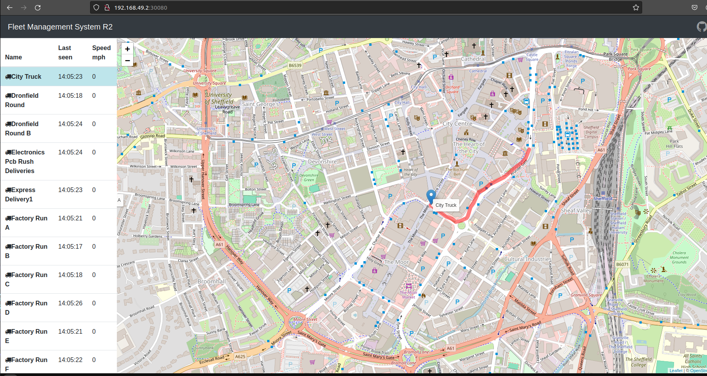
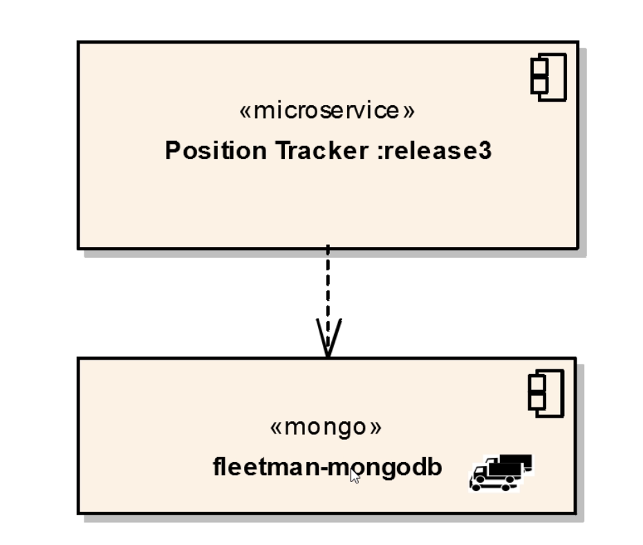
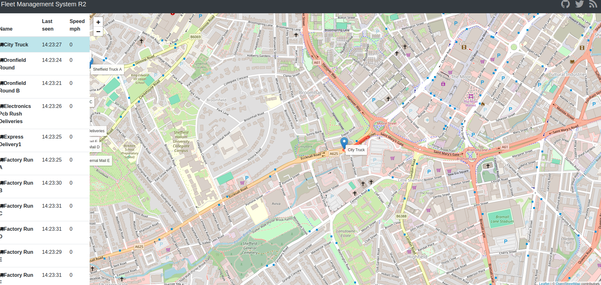

# volume mount in Kubernetes

- now we have the `position tracker microservice` data been saved to the `mongodb database`

- that means the `position tracker POD` been `crashed or restarted` then thats not the problem as `kubernetes Deployment will restart the position tracker POD` and then reconnect to the `fleetman-mongodb` kubernetes service `then we can still have the data history inside the mongodb POD` 

- but thats not enough for the `full peristance` in `kubernetes`

- but we can demo it as below , we can delete the `position tracker POD` which will restart the POD as its the part of the `kubernetes Deployment` , if the `mongo POD Service are working` then `position tracker microservice can connect to it`

    ```bash
        kubectl get all
        # fetching all the kubernetes object inside the default namespace as below 
        NAME                                    READY   STATUS             RESTARTS      AGE
        pod/api-gateway-7c996ff9db-qjvsx        1/1     Running            2 (73s ago)   2d9h
        pod/mongodb-58dd94bb85-4v2px            1/1     Running            2 (73s ago)   2d9h
        pod/position-simulator-6f78798c-jpg5w   1/1     Running            2 (73s ago)   2d9h
        pod/position-tracker-7f5bfddf94-bdkcl   1/1     Running            2 (73s ago)   2d9h
        pod/queueapp-c679b7cdb-c4qrg            1/1     Running            2 (73s ago)   2d9h
        pod/webapp-5bdb5b4bd7-887wk             0/1     CrashLoopBackOff   7 (14s ago)   2d9h

        NAME                                TYPE        CLUSTER-IP       EXTERNAL-IP   PORT(S)                          AGE
        service/fleetman-api-gateway        NodePort    10.109.75.231    <none>        8080:30030/TCP                   2d9h
        service/fleetman-mongodb            ClusterIP   10.111.228.40    <none>        27017/TCP                        2d9h
        service/fleetman-position-tracker   ClusterIP   10.110.137.219   <none>        8080/TCP                         2d9h
        service/fleetman-queue              NodePort    10.108.193.88    <none>        8161:30010/TCP,61616:32540/TCP   2d9h
        service/fleetman-webapp             NodePort    10.98.52.62      <none>        80:30080/TCP                     2d9h
        service/kubernetes                  ClusterIP   10.96.0.1        <none>        443/TCP                          2d9h

        NAME                                 READY   UP-TO-DATE   AVAILABLE   AGE
        deployment.apps/api-gateway          1/1     1            1           2d9h
        deployment.apps/mongodb              1/1     1            1           2d9h
        deployment.apps/position-simulator   1/1     1            1           2d9h
        deployment.apps/position-tracker     1/1     1            1           2d9h
        deployment.apps/queueapp             1/1     1            1           2d9h
        deployment.apps/webapp               0/1     1            0           2d9h

        NAME                                          DESIRED   CURRENT   READY   AGE
        replicaset.apps/api-gateway-7c996ff9db        1         1         1       2d9h
        replicaset.apps/mongodb-58dd94bb85            1         1         1       2d9h
        replicaset.apps/position-simulator-6f78798c   1         1         1       2d9h
        replicaset.apps/position-tracker-7f5bfddf94   1         1         1       2d9h
        replicaset.apps/queueapp-c679b7cdb            1         1         1       2d9h
        replicaset.apps/webapp-5bdb5b4bd7             1         1         0       2d9h

        # now we can remove the position-tracker pod in order to simulate that when the POD restart it will connect to the fleetman-mongodb service
        # and as it access the servcie the data inside the POD will remain intact
        kubectl delete po position-tracker-7f5bfddf94-bdkcl
        # deleting the position-tracker POD 
        # below will be the output 
        pod "position-tracker-7f5bfddf94-bdkcl" deleted

        #now when we do the kubectl get all to fetch all the kubernetes object in default namespace we can get it as below 
        # now we can see that new POD for position-tracker been getting started
        # we can see the outcome as below
        NAME                                    READY   STATUS    RESTARTS        AGE
        pod/api-gateway-7c996ff9db-qjvsx        1/1     Running   2 (5m27s ago)   2d9h
        pod/mongodb-58dd94bb85-4v2px            1/1     Running   2 (5m27s ago)   2d9h
        pod/position-simulator-6f78798c-jpg5w   1/1     Running   2 (5m27s ago)   2d9h
        pod/position-tracker-7f5bfddf94-nn6kp   1/1     Running   0               10s
        pod/queueapp-c679b7cdb-c4qrg            1/1     Running   2 (5m27s ago)   2d9h
        pod/webapp-5bdb5b4bd7-887wk             1/1     Running   8 (4m28s ago)   2d9h

        NAME                                TYPE        CLUSTER-IP       EXTERNAL-IP   PORT(S)                          AGE
        service/fleetman-api-gateway        NodePort    10.109.75.231    <none>        8080:30030/TCP                   2d9h
        service/fleetman-mongodb            ClusterIP   10.111.228.40    <none>        27017/TCP                        2d9h
        service/fleetman-position-tracker   ClusterIP   10.110.137.219   <none>        8080/TCP                         2d9h
        service/fleetman-queue              NodePort    10.108.193.88    <none>        8161:30010/TCP,61616:32540/TCP   2d9h
        service/fleetman-webapp             NodePort    10.98.52.62      <none>        80:30080/TCP                     2d9h
        service/kubernetes                  ClusterIP   10.96.0.1        <none>        443/TCP                          2d9h

        NAME                                 READY   UP-TO-DATE   AVAILABLE   AGE
        deployment.apps/api-gateway          1/1     1            1           2d9h
        deployment.apps/mongodb              1/1     1            1           2d9h
        deployment.apps/position-simulator   1/1     1            1           2d9h
        deployment.apps/position-tracker     1/1     1            1           2d9h
        deployment.apps/queueapp             1/1     1            1           2d9h
        deployment.apps/webapp               1/1     1            1           2d9h

        NAME                                          DESIRED   CURRENT   READY   AGE
        replicaset.apps/api-gateway-7c996ff9db        1         1         1       2d9h
        replicaset.apps/mongodb-58dd94bb85            1         1         1       2d9h
        replicaset.apps/position-simulator-6f78798c   1         1         1       2d9h
        replicaset.apps/position-tracker-7f5bfddf94   1         1         1       2d9h
        replicaset.apps/queueapp-c679b7cdb            1         1         1       2d9h
        replicaset.apps/webapp-5bdb5b4bd7             1         1         1       2d9h

        
        # now if we accessing the minikube ip as below go to the nodePort Service for the webapp we can see the below outcome for the same
        minikube ip
        # below will be the output 
        192.168.49.2

        # now when we are accessing the PORT as below 
        http://192.168.49.2:30080
        # here we can see the outcome for the vehicle will be coming up
        # as it connect to  the DB

    ```

- here we can see that even though the `position-tracker POD crashed and restarted` then also we can connect to the `fleetman-mongodb servcie` and access the `data inside the mongodb data access` as below 

- we don't have to even the `refresh the page of the webapp` once the `position-tracker` microservice been up and running then we can see that `new data will up` and also as it can connect to the `mongo-service POD service fleetman-mongodb` hence it can able to access the data in `mongo POD`  

- we can switch from `one vehicle` to `another vehicle` to see that `we still can access the history of the Data` 

- 

- which is an `improvement` in this case as we have made the `position-tracker as stateless` even thought the `POD crashed or restarted` then we can access the same as the `data been store inside the mongodb POD`

- so far we have justed the problem , currently the `data stored in the file system of the mongodb POD` in this particular case 

- 

- but now the problem is if the `mongodb POD die` then the `data along with it going to die as well in this particular case`

- we can doing the same demo by using it as deleting the `mongodb POD` then we can see that we have loose the data in this case 

    ```bash
        kubectl get all
        # fetching all the kubernetes object inside the default namespace over here 
        NAME                                    READY   STATUS    RESTARTS      AGE
        pod/api-gateway-7c996ff9db-qjvsx        1/1     Running   2 (21m ago)   2d9h
        pod/mongodb-58dd94bb85-98sx6            1/1     Running   0             7s
        pod/position-simulator-6f78798c-jpg5w   1/1     Running   2 (21m ago)   2d9h
        pod/position-tracker-7f5bfddf94-h2qwq   1/1     Running   0             15m
        pod/queueapp-c679b7cdb-c4qrg            1/1     Running   2 (21m ago)   2d9h
        pod/webapp-5bdb5b4bd7-887wk             1/1     Running   8 (20m ago)   2d9h

        NAME                                TYPE        CLUSTER-IP       EXTERNAL-IP   PORT(S)                          AGE
        service/fleetman-api-gateway        NodePort    10.109.75.231    <none>        8080:30030/TCP                   2d9h
        service/fleetman-mongodb            ClusterIP   10.111.228.40    <none>        27017/TCP                        2d9h
        service/fleetman-position-tracker   ClusterIP   10.110.137.219   <none>        8080/TCP                         2d9h
        service/fleetman-queue              NodePort    10.108.193.88    <none>        8161:30010/TCP,61616:32540/TCP   2d9h
        service/fleetman-webapp             NodePort    10.98.52.62      <none>        80:30080/TCP                     2d9h
        service/kubernetes                  ClusterIP   10.96.0.1        <none>        443/TCP                          2d9h

        NAME                                 READY   UP-TO-DATE   AVAILABLE   AGE
        deployment.apps/api-gateway          1/1     1            1           2d9h
        deployment.apps/mongodb              1/1     1            1           2d9h
        deployment.apps/position-simulator   1/1     1            1           2d9h
        deployment.apps/position-tracker     1/1     1            1           2d9h
        deployment.apps/queueapp             1/1     1            1           2d9h
        deployment.apps/webapp               1/1     1            1           2d9h

        NAME                                          DESIRED   CURRENT   READY   AGE
        replicaset.apps/api-gateway-7c996ff9db        1         1         1       2d9h
        replicaset.apps/mongodb-58dd94bb85            1         1         1       7s
        replicaset.apps/position-simulator-6f78798c   1         1         1       2d9h
        replicaset.apps/position-tracker-7f5bfddf94   1         1         1       2d9h
        replicaset.apps/queueapp-c679b7cdb            1         1         1       2d9h
        replicaset.apps/webapp-5bdb5b4bd7             1         1         1       2d9h

    
        # we can see that if we are removing the mongodb pod then we can see that we still don't have the access the hostoprical data in this case 
        kubectl delete po mongodb-58dd94bb85-98sx6
        # here we are remonving the mongodb POD in this case
        # now when we are trying to access the data using the minikube ip then 
        # here we don't have to refresh the webpage 
        # but if we switched between the vehicle we can see the data being lost 

        minikube ip
        # below will be the output 
        192.168.49.2

        # now when we are accessing the PORT as below 
        http://192.168.49.2:30080
        # here we can see the outcome for the vehicle will not be coming up
        # as it can connect to  the DB but the DB container deen died and restarted hence the data contained also lost with it 
    
    
    ```

- 

- if we are using the `database such as mongodb in this case POD` then we can `persist` the `data` as below 

- for the `mongodb POD` all the `data been stored inside the directory inside the mongodb POD` , when the `mongodb POD` crahsed the corresponding `mongodb POD` will also going to die with it , hence all the `data inside the mongodb container will be deleted as well`

- here the requirement being `history of the vehicle which been thrown by the position-tracker microservcie` should be saved `permanently`

- if we have worked with docker we know we can simply do a mount for the same , which will map the `folder inside the container` to the `folder inside the host system`

- that means for that `directory inside the container` will saved the `data` outside of the `container inside the host system`

- `we have the similar concept in kubernetes but that goes well far beyond that concept `

### **How to use the Persistant volume so that mongo POD can survive the POD crash and restart **  

- if we are going to the `kubernetes docs` by url as [Kubernetes Docs for Persistance](https://kubernetes.io/docs/concepts/storage/persistent-volumes/) which will describe the `persistance volume`

- there are `2 separate concept we need to understand` if we have to work with the `kubernetes persistance`
  
  - `persistance volume`

  - `persistance volume claim`   

- here for this case we want the `data of the mongodb container stored to the local folder on the host i.e outside of the container` which will be fine if we are `testing locally`

- but when we move to a `cloud platform` we want more `complex persistance mechanism`

- if we are using the `AWS` we have the concept of `EBS(Elastic block store)` which is a fancy name for the `virtual hard drive`

- when `we move to cloud` `we want to store the mongodb data onto the virtual hard-drive` such as `EBS Volume`

- which means `we can restart the mongoDB container / monogdb POD / even destroy the entire cluster` then also `mongodb data` will still be `persistance in EBS volume`

- kubernetes make all of those very simple where we can jump from one platform to another platform 

### **How to use the Persistant volume on a local hard drive so that mongo POD can survive the POD crash and restart ** 

- we can update the `mongo-stack.yml` file to support that `persistance volume in local hard driver outside the container/POD`

- we have to define the `VolumeMount` inside the `containers underneth the spec of the POD definition` so that it can store the `folder and sub directory inside the mentioned directory` in the `container to stored outside the container in the HOST`

- `VolumeMount` args can take a `list of VolumeMount Directory` which need to be mount fromt the `container`  

- we need to provide two args inside the `VolumeMount` 
  
  - `name` :- we will have to provide the `VolumeMount` which will be used later for reference
  
  - `mountPath`  :- which folder inside the container need to be mapped to the outside host


- for the `mongodb container/POD` that will be the `/data/db folder` in this case , as all the `database data will be daved to the /data/db folder in mongodb container` which we waqnt to expose `outside of the mongo container`

- now we need to tell `kubernetes this is where we want to store the data` that can be done using the `volumes` parameter which is aligned where the `containers level in yml`

- `we have wide verity of choices in kubernetes` that we can make while using the `volumes` i.e `where to we want to mape the container folder`

- this is because `kubernetes real power is` we cna `perform/implement` these `volume mapping using multiple startergy`

- here we want to `map the volume outside of the container but on the host system` , but on the `next chapter` we can configure `kubernetes to configure to volume map to AWS EBS volume`

- we certainly can use `different different multi platform in order to define the volumes for mapping`

- we are not `configuring the volumes inside the vlumeMount paramter` because if we define that for `each directory of container` we need to specifically define the `corresponding volume that need to mapped` which will add the `EBS volume mapping details to the VolumeMount` , for multiple `volumeMount directory of the container we need to define the EBS volume which need to mapped` which is not the `right approach` , also `EBS volume mapping`  will become the `part of the workloads configuration such as POD/replica-set/Deployment` and we need to change it every place if we are changing the `volume that need to mapped` if are changing the `volume mount reference` if we are thinking to chnage from `AWS to microsft azure platform`

- hence kubernetes ask us to move the `volume mapping to the containers section` where we can define `multiple volume mapping`, if need we just have to change in that place if we are thinking to change the `Volume for different cloud provider(AWS --> Azure)` in the next attempt

- we can define that as below what problem going to occure

  ```yaml
  
  
  
  
  
  
  ```

- we need to define `multiple args` inside the `volumes args` which is parallel to the `containers` section in yml for the `volume mapping to the host local folder`

- if we can refer the `Kubernetes API Overview`  [kubernetes API Overview](https://kubernetes.io/docs/reference/generated/kubernetes-api/v1.28/) and goto `config-and-storage-apis` section &rarr; `volume V1 core` then we can see that as 
  
  - `name` := which will be the `VolumeMount name` reference so that it should know which folder from the `container side` we are considering for `volume mapping`
  
  - `HostPath`  := here as we are `volume mapping to the local folder inside the host` hence we need to define as `HostPath`
  
  - `awsElasticBlockStore`  := if we want to `volume map the container folder to EBS Volume`
  
  - `azureDisk` := if we want to use the `Microsoft Azure Data Disk mount on the host`
  
  - `cephfs` := if we want to volume map to the `file system of the redhat platform`
  
  - `gcePersistentDisk` := if we want to volume map to the `GCP platform`
  
  - etc

- here we will be using the `HostPath` as we are `volume mapping to the local folder on  the File System of the host` , but it is not `production approach` which is applicable for `local development and testing`

- we can see an example of how to use the `HostPath` as [HostPath usage as volume mapping](https://kubernetes.io/docs/concepts/storage/volumes/#hostpath)

- inside the `HostPath` we need to define `few params such as below`
  
  - `type` :- the `type of HostPath` we can use for the `volume mapping to the local folder on  the File System of the host`

    - `DirectoryOrCreate` :- `If nothing exists at the given path, an empty directory will be created there as needed with permission set to 0755, having the same group and ownership with Kubelet.` here we will be using this `type of volume mappng` , if nothing exist then it will create the empty directory for the same , we don't have to create it manually for this case 
    
    - `Directory` :- `A directory must exist at the given path`
    
    - `FileOrCreate` :- `If nothing exists at the given path, an empty file will be created there as needed with permission set to 0644, having the same group and ownership with Kubelet.`
    
    - `File` :- `A file must exist at the given path`
    
  
  - `path` :- `path to which on the host file fs we want to map to on the host system`   

  - here as we are running the `minikube kubernetes cluster` which uses the `linux virtual machine` which been `silumating the kubernetes env`

  - here the `path` will refer to the `path inside the minikube kubetnetes virtual machine which been simulating the kubernetes cluster`
  
  - here we will be use the `path` as `/mnt` which will be `mont folder` which will display the `all additional USB flash Hard Drive/shared directory`
  
  - hence we can use the ` USB flash Hard Drive/shared directory` to staore the `mongo Data` , `but we can also save normal folder to it as well which we will be doing today `
  
  - if we are using the `Linux xomputer as host` then this will be the `path here is simple linux file system only`
  
  - 

- we can do that as below the `mongo-stack.yml` as

  
  ```yaml

  
  
  
  
  
  
  
  
  
  
  
  
  
  
  
  
  
  
  
  ```

- we can deploy these changes by applying the change on the `definition yml file` as `miongo-stack.yml`

  ```bash

      # deploy these changes by applying the change
      kubectl apply -f mongo-stack.yml
      # here we will be getting the result as below 


      # if there is any problem in the mount in the POD which can be debug using the kubectl describe command 
      # hence we can do that as 
      kubectl describe pod <POD of the mongodb with volume mount defined>
      # for example
      kubectl describe pod 

      # we can see that using it as below 

  
  
  
  
  
  
  
  
  
  
  
  ```

- for the `windows machine` we can access the `linux virtual machine which minikube been using` as below 

  - if we are using the `Oracle Virtual Box` when we open we can see the `minikube virtual machine` listed there which should be `running stage` as we have done the `minikube start --driver=docker --memory=6144`

  - we can `login to the minikube linux VM` and username and password for it is `username-->docker` and `password-->tcuser` which willm redirect to the `/home/docker folder`

  - we can access the `/mnt/` folder  then we can see the `volume mapped folder in the host` 
  
  - in this folder we can the `hard drive which emulated for the minikube linux VM ` as well 
  
  - we can see that as below

    ```bash
    
    
    
    
    
    
    
    
    
    
    
    
    
    ```


- for the `Linux VM` we can access the `linux virtual machine which minikube been using` as below 
  
  - we can do a `minikube ssh` which will `logon to the minikube Virtual machine no need of user name and password`

  - we can access the `/mnt/` folder  then we can see the `volume mapped folder in the host` here we caqn also see the `/mnt/mongo-data/mongodb.lock`
  
  - in this folder we can the `hard drive which emulated for the minikube linux VM ` as well
  
    ```bash
    
    
    
    
    
    
    
    
    ``` 

- now we can `delete the mongodb POD` to `simulate that we have the mongodb data going to be persisted in here`

- 
  
  ```bash
  
  
  
  
  
  
  
  
  ```

- now we can remove any POD in the `fleet management microservcie` but the `data will be persisted` we can check that by `deleting the position-tracker microservice`

  ```
  
  
  
  
  
  
  
  
  
  
  ```

- when we will be deploying to `AWS` we will also have to see `How resilient the overall microservice system` when the `node inside the cluster get failed` as this `local kubernetes cluster have only one node hence we can't simulate that`

- but if we are removing the `position simulator POD` which been simulating the `vehicles position` then it wilol not send the `position to the Active MQ`

- when the `position simulator POD` restarted it will be restarted from the `beginning` hence we can see some absurd line `as if it teleported` which does not happen if we have the `real vehicle in the production env`

  ```bash

  
  
  
  
  
  
  
  
  
  
  ```   

