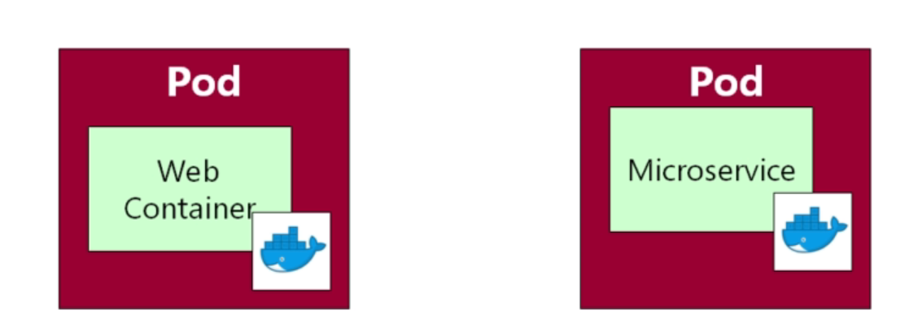
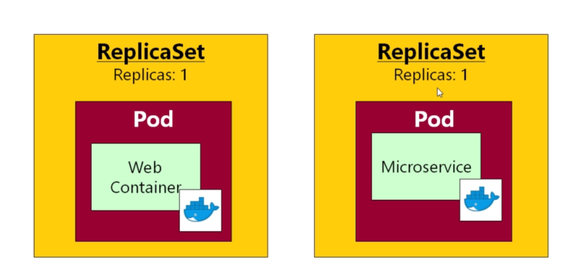
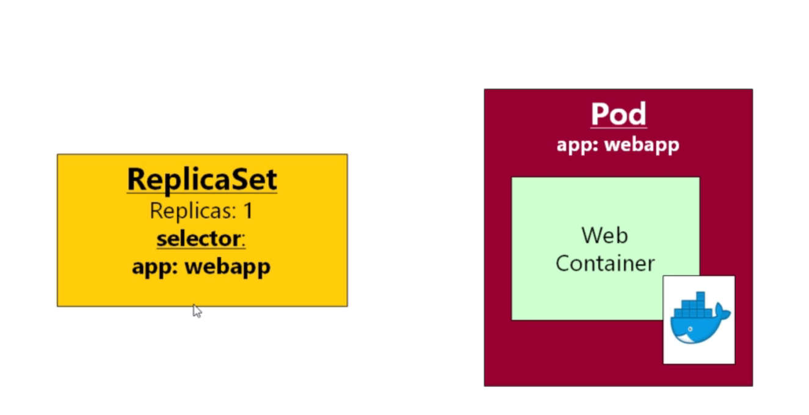
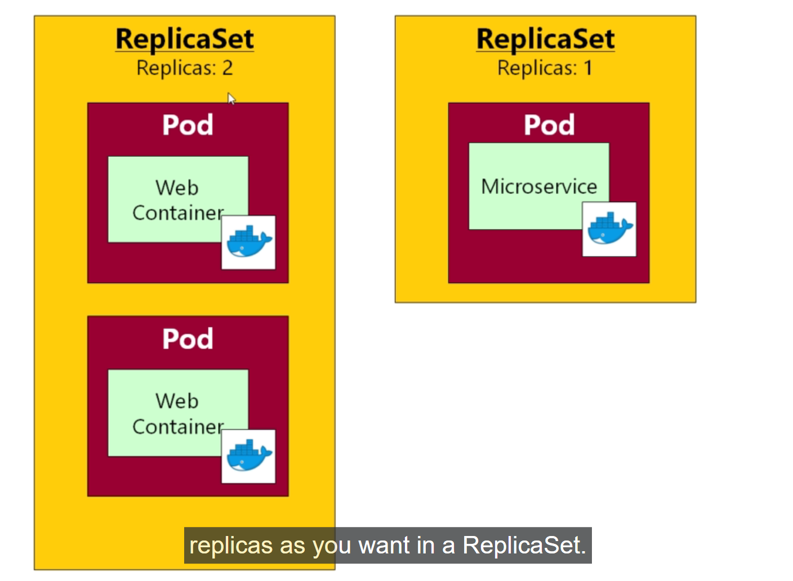

# kubernetes Replica Set 

- with the `POD` and `Services` we know the `core element` of the `kubernetes` , but very `rarely` we deal with `POD` directly

- in the production environment we are more likely to work with `either deployments or replica set`

- `PODs` are `very basic and disposable object` in `kubernetes` , in a `full running production system` we can have `PODs which will going to die`

- there can be `multiple reason for POD to be dead` inside a `full running production system`

  - if a `node going to be get failed` in a `kubernetes cluster` then the `all the PODs running inside the node` will going to `die`

  - if a `POD` `consume too many resources such as CPU` then `kubernetes` will going to `kill that POD`
  
- `PODs` can be `short lived` for whatever reason

- if we are `deploying` the `POD` directly to the `kubernetes cluster` like how we are doing until now `by defining the kubernetes POD definition inside the yml file` and `applying those changes by using the kubectl apply -f <pod definition yml file>` , then `we are responsible` to `pods lifetime` in that case also the `wellfare for that POD`

- that means if `any of POD which been deployed directly to the cluster` then that `might not be able to come back as we are only responsible` for its `lifetime and wellfare for the POD` inside the `kubernetes cluster`

- we can see the `kubernetes Service` details using the below command 

  
  ```bash
      kubectl get all
      # fetching all object from kubenetes cluster as below
      pod/queueapp    1/1     Running   1 (40s ago)   8h
      pod/webapp      1/1     Running   6 (40s ago)   3d15h
      pod/webappnew   1/1     Running   6 (40s ago)   3d15h

      NAME                        TYPE        CLUSTER-IP       EXTERNAL-IP   PORT(S)          AGE
      service/fleetman-queueapp   NodePort    10.100.177.109   <none>        8161:30010/TCP   8h
      service/fleetman-webapp     NodePort    10.106.68.128    <none>        80:30080/TCP     23h
      service/kubernetes          ClusterIP   10.96.0.1        <none>        443/TCP          3d17h
      
      # if we want to fetch the details about the fleetman-webapp then we can see that by using the command as below 
      kubectl describe svc fleetman-webapp
      # using the command as kubernetes describe <object> <object name> we can see the details in kubernetes
      # below will be the output in that case
      Name:                     fleetman-webapp
      Namespace:                default
      Labels:                   <none>
      Annotations:              <none>
      Selector:                 app=webappnew,release=0-5 # here we can see that its been referencing the POD with name as webappnew and release=0-5
      Type:                     NodePort
      IP Family Policy:         SingleStack
      IP Families:              IPv4
      IP:                       10.106.68.128
      IPs:                      10.106.68.128
      Port:                     http  80/TCP
      TargetPort:               80/TCP
      NodePort:                 http  30080/TCP
      Endpoints:                10.244.0.20:80
      Session Affinity:         None
      External Traffic Policy:  Cluster
      Events:                   <none>
  
  ```

- for some reason the `POD` with the name as `webappnew` got `removed` , in order to simulate that we can use the `kiubectl delete <object> <object name>` as below in that case

- when we use the `kubectl delete command` which `by default will gracefully try to shutdown` the `POD` i.e `going to close the container and close app file as well`

- we can also use the `--force` along with the `kubectl delete <object> <object name> --force` which will forceably going to `delete the kubernetes object` 

- we can do that as below 

  
  ```bash
      kubectl delete pod/po webappnew
      # removing the pod for simulating the POD stopped or die by any reason
      # then below will be the output
      pod "webappnew" deleted
  
  ```

- if we are a `docker swarm user` then we can expect the `POD will restarted` , but in case of `kubernetes that ain't going to happen`

- now if we are checking the `kubernetes object inside the minikube kubernetes cluster` then we can do that as below 

  
  ```bash
      kubectl get all
      # fetching all the kubernetes object inside the minikube kubernetes cluster
      # we can see the oputput as below 

      NAME           READY   STATUS    RESTARTS        AGE
      pod/queueapp   1/1     Running   1 (9m41s ago)   8h
      pod/webapp     1/1     Running   6 (9m41s ago)   3d15h

      NAME                        TYPE        CLUSTER-IP       EXTERNAL-IP   PORT(S)          AGE
      service/fleetman-queueapp   NodePort    10.100.177.109   <none>        8161:30010/TCP   8h
      service/fleetman-webapp     NodePort    10.106.68.128    <none>        80:30080/TCP     23h
      service/kubernetes          ClusterIP   10.96.0.1        <none>        443/TCP          3d17h
  
  
  ```

- now when we try to access the `webapp` on the minikube cluster ip using the command as `minikube ip` and accessing the `nodePort` then we can see that `we are unable to access it` because due to the `selector of the kubernetes service fleetman-webapp` still been looking for the `app=webappnew ,release=0-5`

- we don't want that to happen as its not in the sprit of kubernetes 

- this is the reason why we don't deploy `POD` directly to the `kubernetes cluster` , instead we can deploy `replica-set` in that case

- All a `replica set` is `additional configuration` provided to `kubernetes`

- previously we can see the we have `multiple pods `containing `web-container` and `micro-service`

- 

- with the help of `replica-set` we are providing `additional piece of info to kubernetes` that `we can specify How many instances of the POD should run at a given point of time`

- here we are telling kubenetes `How many instances of the POD` should run `at a given point point of time` , we can start simple and simply say `we want one instance of the POD should be running at a given time`

- if the `POD` been `dead` for `any reason` the `kubernetes will spun a new POD instance and make it running in that place`

- we need to do that for all of the `POD` that we have defined inside the `kubernetes cluster`

- 

- we can keep the `replica-set` as `1` for the `POD` , but we can set to `any number` that we want

### How to define a Replica-Set in yml format 

- if we go to the [Kubernetes 1.28 API Docs](https://kubernetes.io/docs/reference/generated/kubernetes-api/v1.28/#replicaset-v1-apps) then underneath the `Workload` section wwe can also seee the `ReplicaSet v1 apps` 

- here we can see the `group` for the `replica-set v1 apps` as `apps` in here hence we can use the `apiVersion` as `apiVersion: app/v1`

- where as `group` for the `PODs` and `Services` will be in the `core` we can see the `apiVersion` as `v1` as `apiVersion: v1`

- these `groups` are nnothing but the `folder` under which the `corresponding API folder been stored` 

- these `apiVersion` will actually allow us to add the `additional kubernetes feature` based on the `version` to the `use new feature definiation yml file` which are in `development`

- that `provide safety` if the new version have to be `changed` then `by changing the apiVersion to the newVersion` we can implement those changes 

- preveiously `replica-set` were used as the `extension` but that has added to `v1 Version` under the group of `apps` 

- but if we want to `replica-set` as below  

  
  ```yaml
      pod-replica-example.yml
      =======================
      apiVersion : apps/v1 # referecing the version as the app/v1 in this case out in here
      kind: ReplicaSet # using the kind as RreplicaSet in here
      metadata: # defining the metadat with name for the replica-set
        # Unique key of the ReplicaSet instance
        name: replicaset-example
      spec:
        # 3 Pods should exist at all times.
        replicas: 3 # defining that 3 POD should exist at once instance 
        selector: # defining the selector over here
          matchLabels: # defining the matchLabel as app:nginx over her which will select from the POD label
            app: nginx
        template: # here inside the template we will describe all the POD definition over here 
          metadata: # defining the metadata for the POD
            name: nginxapp # defining the POD name over here
            labels: # defining the pod label which will be selected from the POD using the selector
              app: nginx 
          spec: # defining the specifgication for the POD
            containers: # defining the container that need to run inside the POD
              - name: nginxapp # defining the docker container name
                image: nginx:1.14 # defining the image for the container to pull the image from
  
  ```

- we don't have to write the `separate yml file` for the `POD` and `replica-set`

- here the above `replica-set` yaml file kind of consider as `2 in 1` , where its the combination of `POD definition` + `Replica-set Definition`

- here on the `metadata` under the `template` inside the `spec` will define the `definition for the PODs`

# Writing the Replica-set

- if we want to put `we can put the entire POD Definition` into a `single yml file` for the `entire architecture`

- `kubernetes does not have any rules` regarding `what we should put onto the yml file`

- we can have `PODs` , `Services` and `Replica-seets` `mixed togethere` into a `single yml file ` or we can separate them into `separate yml file` as well , its entirely upto you

- if we have `1000 PODs` for the `micro-service architecture` then we don't want to all the `POD definition` into a `single file ` , we will try to `decide how to separate them or split them`

- but for this `micro-service` architecture in this course we can put all the `PODs` into `single yml file` and `Services` into `another yaml file` 

- we can update the `current POD definition file` into an `Replica-Set definition yml file`

- we can't have `POD` and `Replica-Set` exist together , we can have `Either the Replica-Set or the POD definition` i.e `one or other`

- when we define the `replica-set` then `we can provide the name of the replica-set as metadata` section  

- if we are defining the `replica set` we don't have to `provide each POD with a specific name` with the `replica-set` `POD` name will be `auto-generated` 

- we can define the `replica-set` as below

  
  
  ```yaml
      pod-replicas.yaml/workload.yml
      ==============================
      apiVersion: apps/v1 # for defining the replica set we need to define the apiVersion as apps/v1 in that case
      kind: ReplicaSet # defining the ReplicaSet in that case over here
      metadata: # providing the name for the replicaset with the name as webapp in this particular case
        name: webapp 
      spec: # defining the specification in that case 
        
        replicas: 1 # dsefining how many instances of the POD should be running on a given time 

        selector: # defining the Selector with the key value pair which will help in picking the PODs by the replica set
          matchLabels: # defining the matchLabel to provide which of the key value pair match with the POD label
            app: webapp # defining the name for the key value pair match with the POD label

        template: # here we can define the POD definition inside the template
          metadata: #defining the name for the POD as well as the POD label
            # but as we know while creating the replicaSet the it will automatically provide the name for the POD hence need not have to provide the same 
            labels: # defining the labels for the POD in this case out in here
              app: webapp # providing the label as the same key-value pair so that replica set can pick the specific POD in this particular case
          
          spec: # defining the specification for the POD in this particular case
            containers: # defining the name and image of the container in this case out in here
              - name: webapp # providing the container with the name as webapp
                image: richardchesterwood/k8s-fleetman-webapp-angular:release0-5
                # defining the image for the container in this particular case out in here
      
      --- # defining the document separator to define another POD for the queueapp
      
      apiVersion: v1 # defining the apiVersion as v1 in  here as we are defining the POD in this case 
      kind: Pod # defining the type of object in this case is of POD
      metadata: # defining the metadata for the POD in this case 
        name: queueapp # defining the name for the POD in here
        labels: # defining the label in the format as Key-value pair
          app: queueapp # defining the name as the key value pair in this case
      spec: # defining the specification for the POD in this case
        containers: # defining the container in this case which will be spunned because of containers# kubernetes Replica Set 

- with the `POD` and `Services` we know the `core element` of the `kubernetes` , but very `rarely` we deal with `POD` directly

- in the production environment we are more likely to work with `either deployments or replica set`

- `PODs` are `very basic and disposable object` in `kubernetes` , in a `full running production system` we can have `PODs which will going to die`

- there can be `multiple reason for POD to be dead` inside a `full running production system`

  - if a `node going to be get failed` in a `kubernetes cluster` then the `all the PODs running inside the node` will going to `die`

  - if a `POD` `consume too many resources such as CPU` then `kubernetes` will going to `kill that POD`
  
- `PODs` can be `short lived` for whatever reason

- if we are `deploying` the `POD` directly to the `kubernetes cluster` like how we are doing until now `by defining the kubernetes POD definition inside the yml file` and `applying those changes by using the kubectl apply -f <pod definition yml file>` , then `we are responsible` to `pods lifetime` in that case also the `wellfare for that POD`

- that means if `any of POD which been deployed directly to the cluster` then that `might not be able to come back as we are only responsible` for its `lifetime and wellfare for the POD` inside the `kubernetes cluster`

- we can see the `kubernetes Service` details using the below command 

  
  ```bash
      kubectl get all
      # fetching all object from kubenetes cluster as below
      pod/queueapp    1/1     Running   1 (40s ago)   8h
      pod/webapp      1/1     Running   6 (40s ago)   3d15h
      pod/webappnew   1/1     Running   6 (40s ago)   3d15h

      NAME                        TYPE        CLUSTER-IP       EXTERNAL-IP   PORT(S)          AGE
      service/fleetman-queueapp   NodePort    10.100.177.109   <none>        8161:30010/TCP   8h
      service/fleetman-webapp     NodePort    10.106.68.128    <none>        80:30080/TCP     23h
      service/kubernetes          ClusterIP   10.96.0.1        <none>        443/TCP          3d17h
      
      # if we want to fetch the details about the fleetman-webapp then we can see that by using the command as below 
      kubectl describe svc fleetman-webapp
      # using the command as kubernetes describe <object> <object name> we can see the details in kubernetes
      # below will be the output in that case
      Name:                     fleetman-webapp
      Namespace:                default
      Labels:                   <none>
      Annotations:              <none>
      Selector:                 app=webappnew,release=0-5 # here we can see that its been referencing the POD with name as webappnew and release=0-5
      Type:                     NodePort
      IP Family Policy:         SingleStack
      IP Families:              IPv4
      IP:                       10.106.68.128
      IPs:                      10.106.68.128
      Port:                     http  80/TCP
      TargetPort:               80/TCP
      NodePort:                 http  30080/TCP
      Endpoints:                10.244.0.20:80
      Session Affinity:         None
      External Traffic Policy:  Cluster
      Events:                   <none>
  
  ```

- for some reason the `POD` with the name as `webappnew` got `removed` , in order to simulate that we can use the `kiubectl delete <object> <object name>` as below in that case

- when we use the `kubectl delete command` which `by default will gracefully try to shutdown` the `POD` i.e `going to close the container and close app file as well`

- we can also use the `--force` along with the `kubectl delete <object> <object name> --force` which will forceably going to `delete the kubernetes object` 

- we can do that as below 

  
  ```bash
      kubectl delete pod/po webappnew
      # removing the pod for simulating the POD stopped or die by any reason
      # then below will be the output
      pod "webappnew" deleted
  
  ```

- if we are a `docker swarm user` then we can expect the `POD will restarted` , but in case of `kubernetes that ain't going to happen`

- now if we are checking the `kubernetes object inside the minikube kubernetes cluster` then we can do that as below 

  
  ```bash
      kubectl get all
      # fetching all the kubernetes object inside the minikube kubernetes cluster
      # we can see the oputput as below 

      NAME           READY   STATUS    RESTARTS        AGE
      pod/queueapp   1/1     Running   1 (9m41s ago)   8h
      pod/webapp     1/1     Running   6 (9m41s ago)   3d15h

      NAME                        TYPE        CLUSTER-IP       EXTERNAL-IP   PORT(S)          AGE
      service/fleetman-queueapp   NodePort    10.100.177.109   <none>        8161:30010/TCP   8h
      service/fleetman-webapp     NodePort    10.106.68.128    <none>        80:30080/TCP     23h
      service/kubernetes          ClusterIP   10.96.0.1        <none>        443/TCP          3d17h
  
  
  ```

- now when we try to access the `webapp` on the minikube cluster ip using the command as `minikube ip` and accessing the `nodePort` then we can see that `we are unable to access it` because due to the `selector of the kubernetes service fleetman-webapp` still been looking for the `app=webappnew ,release=0-5`

- we don't want that to happen as its not in the sprit of kubernetes 

- this is the reason why we don't deploy `POD` directly to the `kubernetes cluster` , instead we can deploy `replica-set` in that case

- All a `replica set` is `additional configuration` provided to `kubernetes`

- previously we can see the we have `multiple pods `containing `web-container` and `micro-service`

- 

- with the help of `replica-set` we are providing `additional piece of info to kubernetes` that `we can specify How many instances of the POD should run at a given point of time`

- here we are telling kubenetes `How many instances of the POD` should run `at a given point point of time` , we can start simple and simply say `we want one instance of the POD should be running at a given time`

- if the `POD` been `dead` for `any reason` the `kubernetes will spun a new POD instance and make it running in that place`

- we need to do that for all of the `POD` that we have defined inside the `kubernetes cluster`

- 

- we can keep the `replica-set` as `1` for the `POD` , but we can set to `any number` that we want

### How to define a Replica-Set in yml format 

- if we go to the [Kubernetes 1.28 API Docs](https://kubernetes.io/docs/reference/generated/kubernetes-api/v1.28/#replicaset-v1-apps) then underneath the `Workload` section wwe can also seee the `ReplicaSet v1 apps` 

- here we can see the `group` for the `replica-set v1 apps` as `apps` in here hence we can use the `apiVersion` as `apiVersion: app/v1`

- where as `group` for the `PODs` and `Services` will be in the `core` we can see the `apiVersion` as `v1` as `apiVersion: v1`

- these `groups` are nnothing but the `folder` under which the `corresponding API folder been stored` 

- these `apiVersion` will actually allow us to add the `additional kubernetes feature` based on the `version` to the `use new feature definiation yml file` which are in `development`

- that `provide safety` if the new version have to be `changed` then `by changing the apiVersion to the newVersion` we can implement those changes 

- preveiously `replica-set` were used as the `extension` but that has added to `v1 Version` under the group of `apps` 

- but if we want to `replica-set` as below  

  
  ```yaml
      pod-replica-example.yml
      =======================
      apiVersion : apps/v1 # referecing the version as the app/v1 in this case out in here
      kind: ReplicaSet # using the kind as RreplicaSet in here
      metadata: # defining the metadat with name for the replica-set
        # Unique key of the ReplicaSet instance
        name: replicaset-example
      spec:
        # 3 Pods should exist at all times.
        replicas: 3 # defining that 3 POD should exist at once instance 
        selector: # defining the selector over here
          matchLabels: # defining the matchLabel as app:nginx over her which will select from the POD label
            app: nginx
        template: # here inside the template we will describe all the POD definition over here 
          metadata: # defining the metadata for the POD
            name: nginxapp # defining the POD name over here
            labels: # defining the pod label which will be selected from the POD using the selector
              app: nginx 
          spec: # defining the specifgication for the POD
            containers: # defining the container that need to run inside the POD
              - name: nginxapp # defining the docker container name
                image: nginx:1.14 # defining the image for the container to pull the image from
  
  ```

- we don't have to write the `separate yml file` for the `POD` and `replica-set`

- here the above `replica-set` yaml file kind of consider as `2 in 1` , where its the combination of `POD definition` + `Replica-set Definition`

- here on the `metadata` under the `template` inside the `spec` will define the `definition for the PODs`

# Writing the Replica-set

- if we want to put `we can put the entire POD Definition` into a `single yml file` for the `entire architecture`

- `kubernetes does not have any rules` regarding `what we should put onto the yml file`

- we can have `PODs` , `Services` and `Replica-seets` `mixed togethere` into a `single yml file ` or we can separate them into `separate yml file` as well , its entirely upto you

- if we have `1000 PODs` for the `micro-service architecture` then we don't want to all the `POD definition` into a `single file ` , we will try to `decide how to separate them or split them`

- but for this `micro-service` architecture in this course we can put all the `PODs` into `single yml file` and `Services` into `another yaml file` 

- we can update the `current POD definition file`  convert it into an `Replica-Set definition yml file`

- we can have `POD` and `Replica-Set` exist together , we can have `Either the Replica-Set or the POD definition` i.e `one or other`

- when we define the `replica-set` then `we can provide the name of the replica-set as metadata` section  

- if we are defining the `replica set` we don't have to `provide each POD with a specific name` with the `replica-set` `POD` name will be `auto-generated` 

- here also we will be `omitting the POD label as releaase:0-5` as `its no longer required` in this case out here

- As the `PODs` were being managed by the `Replica-Set` hence we don't have to `necessaryly provide name to the POD`

- as we are using the `POD labels` while `using the selector  inside the kubernetes Service` hence we need that info as well to be defined

- while defining the `Replica-Set` inside the `spec` section we need to define 3 things
  
  -  `replicas` :- `How many instances of the POD running at a given time`
  
  -  `Selector` :- which will behave exacly as the `Service Selector` in order to help `replica-set` to fetch the `particular POD` based on the `POD labels` such as `Prod/Dev`
                
                :- while selecting the `POD` we need to define the `matchLabels` which will help in fetch the `labels` for the `POD` from the `replicaset` 
  
  - `template` :- where we will have to define the `POD definition inside the Replica sset that we want to create the instance on a given point of time`  

- as we are putting `both PODs and replica-set` inside the `yml defination` then we can call the file as `workloads.yml` as both(POD and ReplicaSet) comes under `Workload API`

- when we are developing the `ReplicaSet` we don't have to bother about the `Selector` as we have achived it using the `Kubernetes Service Selector` , hence in the `ReplicaSet` we can define the `Selector` same as the `POD label` 

- we can define the `replica-set` as below

- 
  
  
  ```yaml
      pod-replicas.yaml/workload.yml
      ==============================
      apiVersion: apps/v1 # for defining the replica set we need to define the apiVersion as apps/v1 in that case
      kind: ReplicaSet # defining the ReplicaSet in that case over here
      metadata: # providing the name for the replicaset with the name as webapp in this particular case
        name: webapp # when we do a kubectl get all we will get the result as ReplicaSet/webapp listed out there
      spec: # defining the specification in that case 
        
        replicas: 1 # defining how many instances of the POD should be running on a given time 

        selector: # defining the Selector with the key value pair which will help in picking the PODs by the replica set
          matchLabels: # defining the matchLabel to provide which of the key value pair match with the POD label
            app: webapp # defining the name for the key value pair match with the POD label

        template: # here we can define the POD definition inside the template
          metadata: #defining the name for the POD as well as the POD label
            # but as we know while creating the replicaSet the it will automatically provide the name for the POD hence need not have to provide the same 
            labels: # defining the labels for the POD in this case out in here
              app: webapp # providing the label as the same key-value pair so that replica set can pick the specific POD in this particular case
          
          spec: # defining the specification for the POD in this particular case
            containers: # defining the name and image of the container in this case out in here
              - name: webapp # providing the container with the name as webapp
                image: richardchesterwood/k8s-fleetman-webapp-angular:release0-5
                # defining the image for the container in this particular case out in here
      
      --- # defining the document separator to define another POD for the queueapp
      
      apiVersion: v1 # defining the apiVersion as v1 in  here as we are defining the POD in this case 
      kind: Pod # defining the type of object in this case is of POD
      metadata: # defining the metadata for the POD in this case 
        name: queueapp # defining the name for the POD in here
        labels: # defining the label in the format as Key-value pair
          app: queueapp # defining the name as the key value pair in this case
      spec: # defining the specification for the POD in this case
        containers: # defining the container in this case which will be spunned because of containers
          - name: queueapp # defining the name for the container in this case 
            image: richardchesterwood/k8s-fleetman-queue:release1 
            # defining the image for the container out in here
            
  ```   

- if the `POD` defined under the `ReplicaSet` crashed then `ReplicaSet` will spun a `New POD` and make it running in that case here

# How to Apply the ReplicaSet to the Kubernetes Cluster

- before `we apply the yaml definition files` for `replica Set` we need to remove the `existing POD that we have deployed directly to the kubernetes cluster` as this ` new replica-set` we want to `deploy` also going to `deploy the new POD on top of the existing POD` in order to avoid confision then we can remove the `existing POD that we have deployed manually`

- we can delete that using the command as 

  
  ```bash
      kubectl delete pod/po --all
      # this will remove all the PODs that reside inside the cluster over here
      # the below will be output in that case
      pod "queueapp" deleted
      pod "webapp" deleted

      # now when try to fetch the kubernetes object inside the kubernetes cluster then we can get the result as below 
      kubectl get all
      # fetching all object inside the kubernetes cluster
      NAME                        TYPE        CLUSTER-IP       EXTERNAL-IP   PORT(S)          AGE
      service/fleetman-queueapp   NodePort    10.104.37.12     <none>        8161:30010/TCP   20m
      service/fleetman-webapp     NodePort    10.100.113.220   <none>        80:30080/TCP     20m
      service/kubernetes          ClusterIP   10.96.0.1        <none>        443/TCP          4d12h
      # here we can see that all POD which are manually deployed earlier are now Terminated
      # also we can only see the list of Services there

  ```

- now we can do a `deploy the new replica-set` by using the command as `kubectl apply -f workload.yml/pod-replica.yml` as below 

  
  ```bash
      kubectl apply -f pod-replica.yml/workload.yml
      # here applying the changes to the replica-set and the POD definition file
      # below will be the output in that case
      replicaset.apps/webapp created
      pod/queueapp created 

      # now when we want to see all the object inside the kubernetes cluster we can see as 
      kubectl get all
      # here we can see that replica-set with the name as webapp already created 
      # we can also that new webapp POD created with some random prefix as well

      NAME               READY   STATUS    RESTARTS   AGE
      pod/queueapp       1/1     Running   0          21m
      pod/webapp-2vjq8   1/1     Running   0          21m

      NAME                        TYPE        CLUSTER-IP       EXTERNAL-IP   PORT(S)          AGE
      service/fleetman-queueapp   NodePort    10.104.37.12     <none>        8161:30010/TCP   20m
      service/fleetman-webapp     NodePort    10.100.113.220   <none>        80:30080/TCP     20m
      service/kubernetes          ClusterIP   10.96.0.1        <none>        443/TCP          4d12h

      NAME                     DESIRED   CURRENT   READY   AGE
      replicaset.apps/webapp   1         1         1       21m


  ```

- here we can see that `replicaset.apps/webapp` created with `DESIRED` , `CURRENT` and `READY` tabs

- `DESIRED` :- at any point of time `How many instances of the POD should be running`

- `CURRENT` :- `How many containers are currently running at this time `  

- `READY`   :- `How many containers  are respnding to the request`

- we can also see the `POD` been cretaed with name as `pod/webapp-2vjq8 ` i.e in the format of `pod/<name of the replica-set >-<random string>` by the `replica-set` that we created

- if we want to see the details about the replica set then we can use the command as below 

  
  ```bash
      kubectl describe replicaset <name of the replica-set>
      #OR in shot
      kubectl describe rs <name of the replica-set>
      # here it will describr the details about the replica-set and PODs inside the replica-set
      # we can see the output as below along with the info about the POD that been sounned from the replica-set int hat case out here on the event section
      Name:         webapp
      Namespace:    default
      Selector:     app=webapp
      Labels:       <none>
      Annotations:  <none>
      Replicas:     1 current / 1 desired # here we know that we desired for 1 instance  of the POD to be runnig and we can see 1 instance been running here
      Pods Status:  1 Running / 0 Waiting / 0 Succeeded / 0 Failed
      Pod Template:
        Labels:  app=webapp
        Containers:
        webapp:
          Image:        richardchesterwood/k8s-fleetman-webapp-angular:release0-5
          Port:         <none>
          Host Port:    <none>
          Environment:  <none>
          Mounts:       <none>
        Volumes:        <none>
      Events:           <none> # on the Event we can see the POD details not sure it is not showing

  ```

- but now if we want to goto `Kubernetes Service` then we need to provide the `particular POD label and Replica Selector` inside the `Service Selector` as well

- hence we can define the `services.yml` file as below 

  ```yaml
      services.yml
      ==============
      apiVersion: v1 # defining the Services Version as v1 as it comes from the core group over here
      kind: Service # defining the type of object as Service in this particular case
      metadata: # defining the name for the Service which might be required by other Service in or5der to communicate
        name: fleetman-webapp
      spec: # defining the specification for the Service over here
        selector: # defining the selector for the Service which will select the POD label in that case
          app: webapp # defining the PODs label to match by the key-value pair
        ports: # defining the Ports for the POD to accept and forward to container 
        - name: http # name of the Port Service been define
          port: 80 # accept traffic on port 80
          targetPort: 80 # forward that to port 80 of container
          nodePort: 30080 # opening the nodePort on 30080 to access outrside the cluster

        type: NodePort # here the type of Service is of NodePort Service Type and can be accessed outside the cluster

      ---
      # differenciating the services of fleetman-webapp to the fleetman-queueapp

      apiVersion: v1 # defining the apiVersion as v1 as Service belong to the core group
      kind: Service # defining the type of kubernetes object is of Service
      metadata: # defining the name of the Service as fleetman-queueapp
        name: fleetman-queueapp
      spec: # defining the specification for the Kubernetes Services
        selector: # defining the selector based on the POD label
          app: queueapp # defining the selector as queueapp in this case
        ports: # defining all the Ports thats been used
        - name: http # defining the Port name as http over here
          port: 8161 # accept traffic on port 80
          targetPort: 8161 # forward that traffic to port 8161 of the container
          protocol: TCP # defining the protocol as TCP in this case
          nodePort: 30010 # opening the nodePort on 30080 to access outrside the cluster

        type: NodePort # here the type of Service is of NodePort Service Type and can be accessed outside the cluster
  
  ```

- now we can deploy the `New Services` based on the `New Selector` using the `kubectl apply -f <template name>`

- hence we will be getting the output as below 

  ```bash
      kubectl apply -f services.yml
      # apply the changes for the Kubernetes Service File as well in here
      # we can see the below output in that case out in here
      service/fleetman-webapp configured
      service/fleetman-queueapp configured


      # now when we access the kubernetes minikube cluster then we can see the info as below 
      minikube ip # which will provide the ip address of the minikube kubernetes local cluster
      #the below will be the output
      192.168.49.2

      #now when we try to access the port 30080 thyen we can see the fleetman-webapp running 
      http://192.168.49.2:30080
      # we can see that Services still running in that case
  
  ```

- we can remove the `POD` which been created by the `replica-set` and observe that as we have defined the `replicas: 1` hence `kubernetes replica-set` will going to automatically `create a New POD` and we can see the details while `describing the replica-set`

- we can delete the `POD` created by the `replica-set` using the `kubectl delete pod/po <POD name>` which will gracefully `Terminate the POD` and due to `replicas: 1` defined in the `replica-set definition` it will goin to spin up a new POD `with the name as pod/<replica-set name>-<random str>` which we can see in the event section

- here we are simulating the `POD crashing` because of `unpredictable reason` due to `Memory Issue or any other reason` 

- when we perform the `kubectl delete pod/po <POD name>` because of the replica-set the `a New POD will be created` with the state as `ContainerCreating` and the `POD` we deleted will be in `Terminating stage`

- 

- we can perform that using the below command 

  ```bash
      kubectl delete pod/po webapp-2vjq8
      # removing the specific POD deliberately to simulate the POD is going to die
      # we can see the output as below 
      pod "webapp-2vjq8" deleted

      #now when we try to access the service now immediately we can see that there is a little down time as the PODs are getting created
      # now when we access the kubernetes minikube cluster then we can see the info as below 
      minikube ip # which will provide the ip address of the minikube kubernetes local cluster
      #the below will be the output
      192.168.49.2

      #now when we try to access the port 30080 thyen we can see the fleetman-webapp not running 
      http://192.168.49.2:30080
      # if we try after some time then after the POD recreated we can see the Service coming back on


      #now when we see all the kubernetes object inside the kubenetes cluster then we can see that a New POD been spunned on as below 
      kubectl get all
      # fetching all the kubernetes object inside the cluster as below 
      NAME               READY   STATUS    RESTARTS   AGE
      pod/queueapp       1/1     Running   0          84m
      pod/webapp-9zj7v   1/1     Running   0          2m28s # here we can see that new POD been spunned on with the proper format

      NAME                        TYPE        CLUSTER-IP       EXTERNAL-IP   PORT(S)          AGE
      service/fleetman-queueapp   NodePort    10.104.37.12     <none>        8161:30010/TCP   82m
      service/fleetman-webapp     NodePort    10.100.113.220   <none>        80:30080/TCP     82m
      service/kubernetes          ClusterIP   10.96.0.1        <none>        443/TCP          4d13h

      NAME                     DESIRED   CURRENT   READY   AGE
      replicaset.apps/webapp   1         1         1       84m

  
      # now if we want to see the details about the replica-set on the Event section we can details that happen to the POD
      kubectl describe rs webapp # fetching the details about the replica-set in that case
      # we can see the below output in that case
      Name:         webapp
      Namespace:    default
      Selector:     app=webapp
      Labels:       <none>
      Annotations:  <none>
      Replicas:     1 current / 1 desired
      Pods Status:  1 Running / 0 Waiting / 0 Succeeded / 0 Failed
      Pod Template:
        Labels:  app=webapp
        Containers:
        webapp:
          Image:        richardchesterwood/k8s-fleetman-webapp-angular:release0-5
          Port:         <none>
          Host Port:    <none>
          Environment:  <none>
          Mounts:       <none>
        Volumes:        <none>
      Events:
        Type    Reason            Age    From                   Message
        ----    ------            ----   ----                   -------
        Normal  SuccessfulCreate  4m19s  replicaset-controller  Created pod: webapp-9zj7v
  
  

  ```
- when we `delete` the `POD` then there will a `Downtime` as we have only `1 instances of the POD running at any instances` untill that new `POD` created the `Services will be unavailable state` which might be `unacceptable in that case`

- Eventhough the `replica-set` quick enough to figure out that the `Existing POD has a fault` and sooner deployed a new POD but during that `POD` been up and running `Services` will be in `unavialble state` can be `unobtainable by end user`

- in order to mitigate this we can have `any number of POD instances as replicas created for the replica-set` in order to avoid the `Downtime` in that case out there

- we can use something like this below , if we have `replicas: 2` we know at any point there will  be `2 instances of the PODs` running `even one go down the other one can still serve the Service request` by the `Service untill the crashed POD been backed up` 

- As an architect we need to decide `How many instances of the POD running at a given instance of time by the replica-set which can contain POD with web-container or micro-service` 

- some time it depends `whether to have more replicas of the PODs inside the Replica-set and Sometimes it does make sense depending on the scenarios` 

- 

- if we have an `web-application` which been using the `web-container inside the POD` , as that is the `frontend` hence making it as `replicas of 2 POD at any instrance` make sense , as we need to run the `frontend web-application inside the POD web container running 24 hours a day and 7 days a weeks`

- currently the `PODs instances` are inside the `Same Node i.e inside the kubernetes cluster` while creating the `replica-set` , while deploying to `production cloud` we need to make sure that those `PODs instances` should run inside different `Nodes inside the kubernetes cluster` so that we can avoid the `loss of a particular node in that case`

- we can replace the `replicas` to `2` and simulate the same thing as `PODs crashing` and we can see that `Services will not be impacted`

- we can do as below 

  
  ```yaml
      workload.yml
      =============
      apiVersion: apps/v1 # for defining the replica set we need to define the apiVersion as apps/v1 in that case
      kind: ReplicaSet # defining the ReplicaSet in that case over here
      metadata: # providing the name for the replicaset with the name as webapp in this particular case
        name: webapp # when we do a kubectl get all we will get the result as ReplicaSet/webapp listed out there
      spec: # defining the specification in that case 
        
        replicas: 2 # defining how many instances of the POD should be running on a given time 

        selector: # defining the Selector with the key value pair which will help in picking the PODs by the replica set
          matchLabels: # defining the matchLabel to provide which of the key value pair match with the POD label
            app: webapp # defining the name for the key value pair match with the POD label

        template: # here we can define the POD definition inside the template
          metadata: #defining the name for the POD as well as the POD label
            # but as we know while creating the replicaSet the it will automatically provide the name for the POD hence need not have to provide the same 
            labels: # defining the labels for the POD in this case out in here
              app: webapp # providing the label as the same key-value pair so that replica set can pick the specific POD in this particular case
          
          spec: # defining the specification for the POD in this particular case
            containers: # defining the name and image of the container in this case out in here
              - name: webapp # providing the container with the name as webapp
                image: richardchesterwood/k8s-fleetman-webapp-angular:release0-5
                # defining the image for the container in this particular case out in here
      
      --- # defining the document separator to define another POD for the queueapp
      
      apiVersion: v1 # defining the apiVersion as v1 in  here as we are defining the POD in this case 
      kind: Pod # defining the type of object in this case is of POD
      metadata: # defining the metadata for the POD in this case 
        name: queueapp # defining the name for the POD in here
        labels: # defining the label in the format as Key-value pair
          app: queueapp # defining the name as the key value pair in this case
      spec: # defining the specification for the POD in this case
        containers: # defining the container in this case which will be spunned because of containers
          - name: queueapp # defining the name for the container in this case 
            image: richardchesterwood/k8s-fleetman-queue:release1 
            # defining the image for the container out in here
  
  
  ```

- now we can deploy those changes by using the `kubectl apply -f <definition file>` as below , we can see that those details will be details in the `Event` section while describing the `replica-set` in this case out in here

  ```bash
      kubectl apply -f workload.yml
      # applying the changes and deploying the replica set with 2 replicas 
      # below will bethe output in that case out here
      replicaset.apps/webapp configured
      pod/queueapp unchanged


      # now when we want to see the all object inside the kubernetes cluster then we can see the details as below 
      kubectl get all
      # we can see the details as below
      NAME               READY   STATUS    RESTARTS   AGE
      pod/queueapp       1/1     Running   0          108m
      pod/webapp-9zj7v   1/1     Running   0          26m # here we can see one instance of POD
      pod/webapp-flvgq   1/1     Running   0          53s # here we can see other instance of POD

      NAME                        TYPE        CLUSTER-IP       EXTERNAL-IP   PORT(S)          AGE
      service/fleetman-queueapp   NodePort    10.104.37.12     <none>        8161:30010/TCP   106m
      service/fleetman-webapp     NodePort    10.100.113.220   <none>        80:30080/TCP     106m
      service/kubernetes          ClusterIP   10.96.0.1        <none>        443/TCP          4d13h

      NAME                     DESIRED   CURRENT   READY   AGE
      replicaset.apps/webapp   2         2         2       108m
  

  ```

- now when we describe the `replica-set` as `kubectl descieb rs <replica-set name>` then we can see the `details` as below 

  ```bash
      kubectl describe rs webapp
      # describing the replica-set with the info as webapp in this case out in here
      Name:         webapp
      Namespace:    default
      Selector:     app=webapp
      Labels:       <none>
      Annotations:  <none>
      Replicas:     2 current / 2 desired # here we can see that 2 current running container and 2 Desired PODs
      Pods Status:  2 Running / 0 Waiting / 0 Succeeded / 0 Failed
      Pod Template:
        Labels:  app=webapp
        Containers:
        webapp:
          Image:        richardchesterwood/k8s-fleetman-webapp-angular:release0-5
          Port:         <none>
          Host Port:    <none>
          Environment:  <none>
          Mounts:       <none>
        Volumes:        <none>
      Events:
        Type    Reason            Age    From                   Message
        ----    ------            ----   ----                   -------
        Normal  SuccessfulCreate  29m    replicaset-controller  Created pod: webapp-9zj7v # here we can see the POD instance
        Normal  SuccessfulCreate  4m11s  replicaset-controller  Created pod: webapp-flvgq # here we can see the other POD instance
  
  ```

- now when we `delete` the `one POD` to simiulate the `POD crashging` and checking the `Service` , still the Service being accessable 

- we can see that as below 


  ```bash
      kubectl delete pod/po webapp-flvgq
      # removing the specific POD deliberately to simulate the POD is going to die
      # we can see the output as below 
      pod "webapp-flvgq" deleted

      #now when we try to access the service now immediately we can see that there is a little down time as the PODs are getting created
      # now when we access the kubernetes minikube cluster then we can see the info as below 
      minikube ip # which will provide the ip address of the minikube kubernetes local cluster
      #the below will be the output
      192.168.49.2

      #now when we try to access the port 30080 thyen we can see the fleetman-webapp running 
      http://192.168.49.2:30080
      # if we try after some time then after the POD recreated we can see the Service coming back on
  
  
  ```

- here the `Kubernetes service` represent the `Networking endpoint` for the `PODs` where the `Browser to visit`

- these `Networking endpoint` can served by `multiple PODs inside the replica-set` and the `PODs serving that service is constantly changing` , which is the model of `kubenetes`

- in the `APi docs` its written that `we need to use the deployment rather than the replica-set in place`  