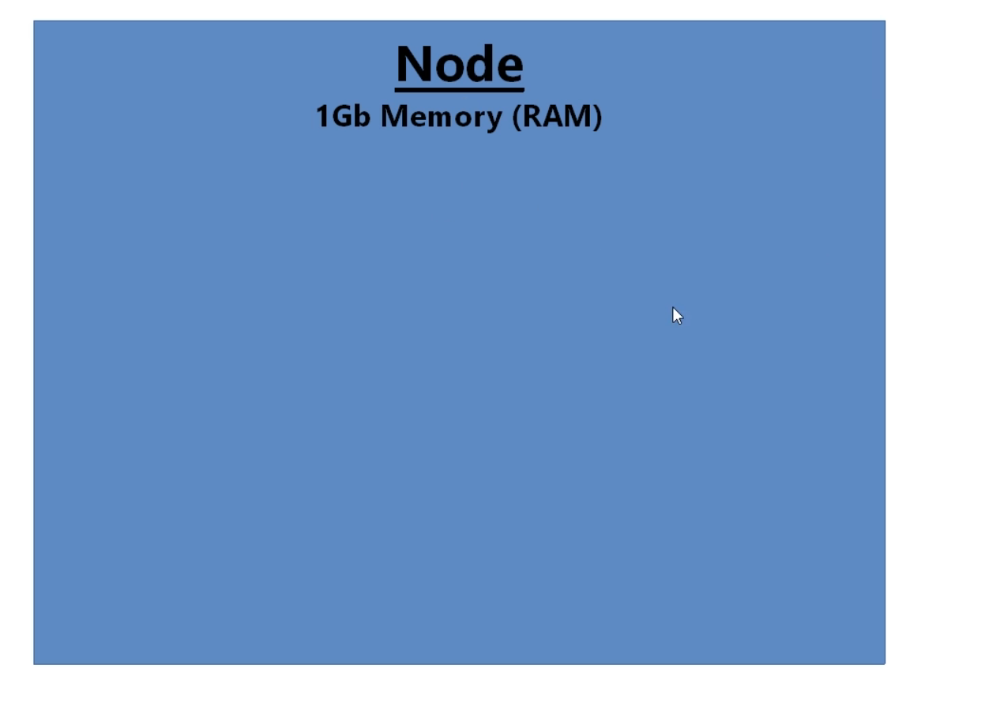
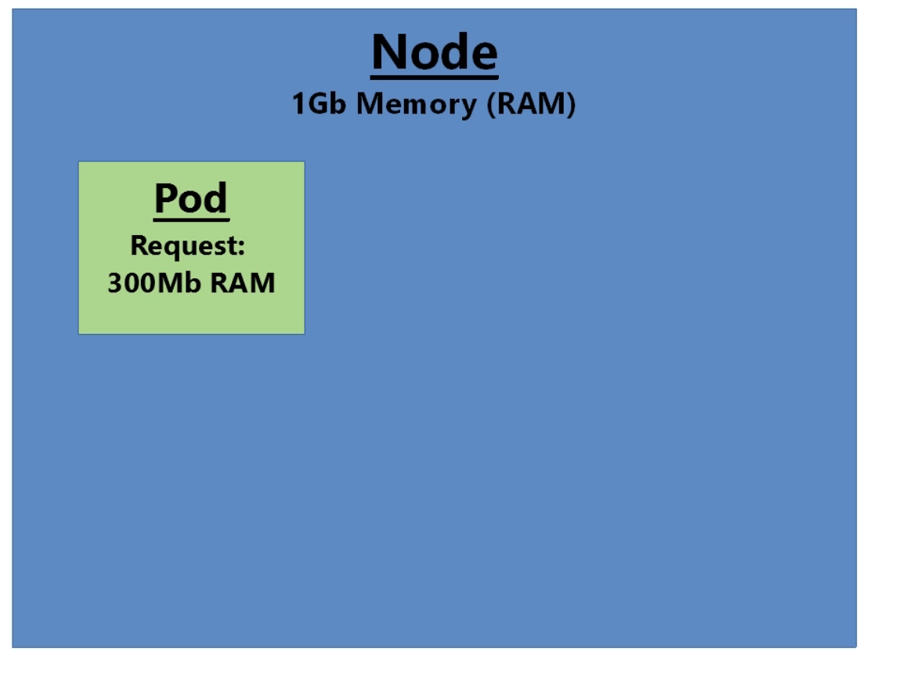
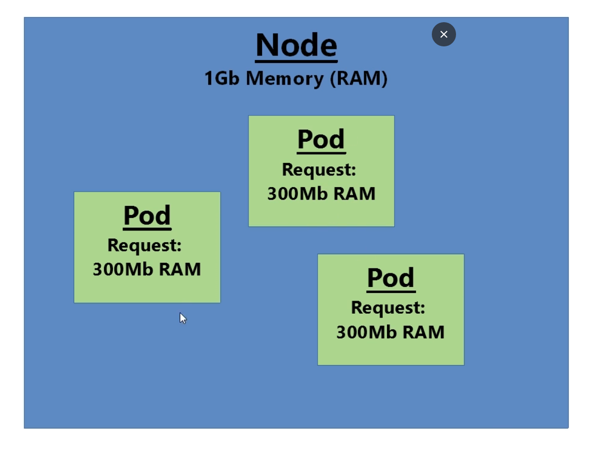
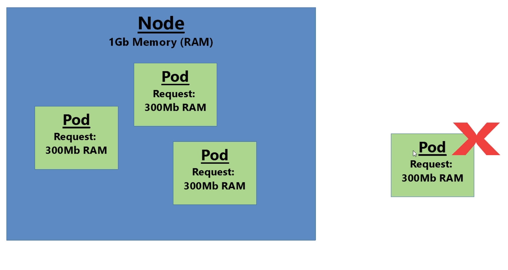

# Memory Request for the Resource in kubernetes 

- here we will be going to cover the `requests and limits` , `requests` in particular are really `important` if we want a `well behaved Kubernetes cluster`

- **Exploring Requests**
  
  - here if we goto the `workloads.yml` where we are defining all the `POD definition` , here actually we are using `Deployment` to define our `POD` in this case
  
  - here if we take `one of the random Deployment from the workloads.yml` such as `queueapp Deployment` in this case
  
  - in this `queueapp Deployment POD definition yml` , we can mention something known as the `Resource Request` as below 

      ```yaml
          workloads.yml
          =============
          apiVersion: apps/v1 # here defining the apiVersion as apps/v1 which belong to the apps group
          kind: Deployment  # here defining the kind as Derployment in this case
          metadata: # defining the name of the Deployment in this case
            name: queueapp
          spec: # defining the specification with respect to the Deployment
            selector: # selector to select the POD based on POD label
              matchLabels:
                app: queueapp
            replicas: 1 # number of replicas to manage our POD
            template: # POD definintion being defined in here as template
              metadata: 
                labels:
                  app: queueapp
              spec: # specification of the POD container being defined in here
                containers: # container being defined in this case
                  - name: queueapp # name of the POD defined in here
                    image: richardchesterwood/k8s-fleetman-queue:release2 # image for the POD being defined in here
                    resources: # here we are requesting for the memory/CPU resource in this case 
                      requests: # here we are requesting for the memory/CPU resource in this case 
                        memory: 300Mi # asking for 300MB of Memory required for this POD with resource request
                        # here actually we can define the memory in 3 ways
                        # if we are defining the 1M=1000K(Kelo Bytes) , 1K=1000Bytes
                        # if we are defining the 1Mi=1024Ki(Kelo Bytes) , 1Ki=1024 bytes (which is often used in here)
                        # if we are using the Bytes directly we can specify the number of Bytes directly number without any prefix  

      ```
  
    
    - the `Resource Request` can `one of the Two things`
      
      - it can be a `Memory Request`
      
      - it can be a `CPU request`
      
    - the `request` is , where `US as deployer` specifying for `requests` ,what we want/think this `POD need` in term of the `resources` that can be in term of `CPU/Memory` in order to run comfortably
    
    - here we will also be discussing 
      
      - how to determine the `these resource request value` for the `POD`  
      
      - `what kind of rules we will be using` in order to determine  `these resource request value` for the `POD`  
      
    - here in the `above example` we are deciding somehow to `decide 300Mi i.e 300 Megabyte of RAM` for the `POD` to run comfortably
    
    - here we will be define the `resources` inside the `container` section which is inside the `spec of the POD definition` inside the `template folder` 
    
    - here in the above example we are requesting for the `memory resource` for `300 MegaByte` foe the `POD container` to run `comfortably` inside the `kubernetes Cluster`
    
    - adding these `resources` inside the `POD container` is optional , hence `up untill now we have not added any resource for the POD definition`
    

- **What Do we gain if we specify the `resource request` in the YAML POD definition**

- in the `production cluster` , we must `specify the resource requests` for the `POD yaml definition` in order for the `POD to run comfortably`

- the `real purpose of defining the request` is while `deploying` the `POD defined with request to the kubewrnetes cluster` it will `instruct the cluster manager` to ensure that `there will be enough memory on the kubernetes node to allow in order to spin the POD container inside it`

- we will be `getting other rich functionality ` `when we are deploying POD definition with resource request` 

- the `POD definition with resource request` will ensure the `cluster manager` to take `intelligent decession` whether or not `node is able to run the POD or not`

- for example:
  
  - lets suppose we have a `kubernetes node` with `1GB of memory in total availability` in place
  
  - whether that can be `minikube(where 1 node hence it has virtual machine with 1GB memory) or physical Kubernetes Node/Server in AWS`
  
  -  
  
  - if we have a `POD definition` then we have `300MB of resource request on that POD` we want to deploy
  
  - the `cluster manager` will be able to `recognize that there will be enough space in the node` will allow the `POD deployed onto that node`
  
  - 
  
  - same would be true if we have `scheduled` 2 more `PODs(same or different) having the same MB of resource request` onto that `kubernetes node` in this case
  
  - 
  
  - `on the kubernetes node` , now we have deployed `900MB worth of Memory consumed resources`
  
  - now if we want to `deploy` one more `POD` with `300MB resource request` , there will not `enough memory on the kubernetes node` to deploy/schedule the `POD onto the Kubernetes node`
  
  - if there were `no other node available in the cluster (such as minikube)` then we will be getting error while trying to `deploy or schedule the 4th POD with the resource request`
  
  - 
  
  - if we have `another kubernetes node which have available space` available such as AWS `cluster manager will schedule/deploy that POD with the resource request` onto the `another kubernetes Node`
  
  - here the `300MB` means `Us the developer workout` to define `what the right Memory need by the POD container which may not be accurate` to run `comfortably`
  

- **Practising resource request with the minikube cluster**  

- 