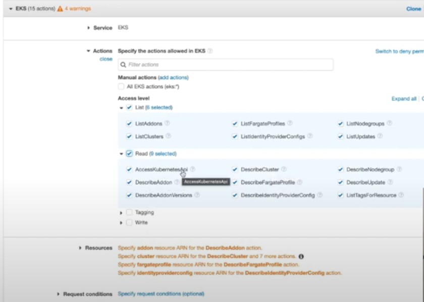

# RBAC in kubernetes EKS cluster

- getting started with AWS EKS is very easy , by using the `eksctl` we can set this `kubernetes cluster ` very easily

- as we are `working along` with `AWS EKS cluster` we need to set `multiple user` and provide these user `limited access` with `different labels`  

- in this we will be performing below things for details 

  - here we will be creating a `new IAM account` and using that `IAM Account` created we need to create `EKS cluster`
  
  - different `IAM permissions` because when we are using the `AWS Service` we need to `set policy/permission` for the `IAM User` to limit the access of the `IAM User Have`
  
  - we will also be looking at the `kubernetes RBAC for authentication and Authorization` process
  
  - then we will create `few users` wiith `diofferent label of access` such as 
    
    - `super-admin` :- `master permission` can perform `any action on the aws EKS cluster`
    
    - `admin` :- `admin user` can able to `delete the Deployment`
    
    - `developer` :- `create the Deployment or PODs` but unable to `delete the Deployments/PODs`
    
    - `trainee` :- `view permission` such as `view the pods and deployments`
    
  
  - `most of the permission` that we discussed `above` been managed by `aws_auth` configMap which lives inside the `EKS cluster`
  
  - here we can goto the `AWS Mgmt console` &rarr; `IAM` &rarr; `Users` &rarr; `Create User` &rarr; `Programatic Access` , we don't need to provide the `AWS Mgmt Console` , so that they don't need the console access rather they can do all the things using the `kubectl` command line args
  
  - while creating the `User` we need to set the `policy or permission` hence select as `Attach Policy Directly`
  
  - hence we can click on `create a Policy` &rarr; `deom the Service we need to select the EKS` in this case
  
  - we can select the `EKS List and EKS Read` permission in this case   
  
  - here we can see things as `clusterAddon/DescribeCluster/AccessKubernetesApi/ListCluster` all `eks cluster related permission` not anything related to the `kubernetes resources`
  
  -  
  
  - then we click the `next` &rarr; `proide a Name to the Policy` as `eks-read-access`
  
  - we need to `associate` the `User` which `we are creating which is progress with the specific permission or policy` i.e `eks-read-access` that we created & `Done`
  
  -  we can perform this action for creating User as `eks-trainee`, `eks-developer`, `eks-admin` , `eks-super-admin` , `eks-cluster-creator` 
  
  -  `as we need to also crete the cluster and we want to provide the super-admin the same as cluster creator hence we need to add one more policy `
  
  - hence for the `eks-cluster-creator` and `eks-super-admin` we need to add few `additional policy` such as `AdministratorAccess Policy`
  
  - we can goto these  `eks-cluster-creator` and `eks-super-admin` and select `Attach Policy Directly` and select the `AdministratorAccess Policy` and add the same
  
  - once done we need to create `multiple named AWS Profile` as below here we do have the `eks-cluster-creator` , we can do the same thing for all the other `USER` as well

    
    ```bash
        aws configure --profile eks-cluster-creator
        # the output will be as below 
        # that we can access using it as below 
        AWS Access Key ID [****************437O]: 
        AWS Secret Access Key [****************HmrV]: 
        Default region name [us-west-2]: 
        Default output format [json]:

        # then this will be added to the ~/.aws/credetials Folder
        [eks-cluster-creator]
        aws_access_key_id = XXXX
        aws_secret_access_key = XXX

        # we can switch the profile by using the command as below 
        export AWS_PROFILE=eks-cluster-creator
        # here exporting to the AWS profile in this case

        # now if we see the current profile and access_Id details then we can see by using it as below
        aws sts get-caller-identity
        # this will provide the info about the current profile which been active
        # if profile not set refer to the default profile
        {
            "UserId": "XXXXXX",
            "Account": "XXXXX",
            "Arn": "arn:aws:iam::520668085636:user/eks-clsuter-creator"
        } 

    ```

- once USER `eks-cluster-creator` set we can `create the cluster` using the `eksctl` command as below 

  ```bash
      eksctl create cluster -f <cluster config file if we already have>
      # we can create the EKS cluster using the coinfigFile as well
      # which we will be seeing in the eks session 
      # else
      eksctl create cluster --name <cluster name> --region <region name> --node-min 3 --version=1.26 
      # here we are creating the cluster using the eksctl command line
      eksctl create cluster --name pratik-cluster --version=1.26 --nodes-min=3
      # this will create the cluster named as pratik-cluster
      # the version of kubernetes is 1.26
      # here we are using the 3 node or node group in this EKS cluster

  ```

- once the lcuster created then we need to set the `context` which will be useful for the `kubectl command` to reach to the `EKS cluster`

- we can do that by 2 ways
  
  - using the `aws eks command line`
  
  - using the `eksctl command line`

- we can do that as below 

  ```bash
      aws eks update-kubeconfig --region <region-name> --name <existing kubernetes cluster name>
      # here we are using the aws eks cli command to connect to the existing AWS EKS kubernetes cluster
      # for example we can connnect as below 
      # for example
      aws eks update-kubeconfig --region us-west-2 --name pratik-cluster 
      # here the outpur will be as below 
      Added new context arn:aws:eks:us-west-2:520668085636:cluster/pratik-cluster to /home/pratik/.kube/config


      # or we can use the eksctl command-line as below 
      eksctl utils write-kubeconfig --cluster=<clustername> --set-kubeconfig-context=true
      # here we will be using the eksctl command line as below 
      # for example 
      eksctl utils write-kubeconfig --cluster=pratik-cluster  --set-kubeconfig-context=true
      # the output will be as below 
      2024-02-08 07:43:52 [✔]  saved kubeconfig as "/home/pratik/.kube/config"


      # if we now use the kubectl command it will able to reach the EKS cluster API Server
      kubectl get all
      # fetching all the object inside the default namespace
      # the output will be as below
      NAME                 TYPE        CLUSTER-IP   EXTERNAL-IP   PORT(S)   AGE
      service/kubernetes   ClusterIP   10.100.0.1   <none>        443/TCP   22h

  ```    

  
- **Difference Between the IAM permission and Kubernetes Permission**

- we can see the reference guide for the same on [Kubernetes RBAC User Guide](https://kubernetes.io/docs/reference/access-authn-authz/rbac/)

- there are `2 things` need to be done in order to `recoginze an valid USER`

  - the `AWS IAM Permission` are for the `User Authentication part` , to `recoginize the valid User`  

  - `kubernetes` will use the `RBAC` framework to handle the `what can the valid USER do` i.e `what all the User can Do`
  
- if we look into the `AWS IAM Permission` which will be as below `you can see that there is no permission with respect to the kubernetes resource such as POD/service/replicaSet/Deployment` it will be taken care by `kubernetes RBAC` but rather to the `cluster configuration` such as `createAddOn/DeleteAddOn/DescribeCluster and etc`

-       

- `kubernetes` `by default` comes with the `RBAC framework` for the `Authorization mechanism`, if needed we can make the `changes` as well for the `ABAC(Attribute Based Access Control)`

- through `RBAC` we can define `Roles and ClusterRoles` where
  
  - `Roles` available `within the particular namespace`
  
  - `ClusterRole` available `throughout` the `cluster` 
  
- for defining the `ClusterRole` we can define the `definition` as below 

  ```yaml
      # here we can define the cluster role apiVersion using the command as below
      # we can use the command as kubectl api-resources -o wide | grep clusterroles
      apiVersion: rbac.authorization.k8s.io/v1
      kind: ClusterRole # here the type of object we will be using is of ClusterRole
      metadata:
        # ClusterRole were not namespaced hence we can ignore mentioning the namespace in this case
        name: pod-reader
      rules: # defining the rule for the CLusterRole
        - apiGroup: [""] # here we are pointing to the core apiGroup under which POD/Services/configMaps/Secrets will going to be get created
          verbs: ["get","watch","list"] # we can also see the verbs we can provide using the command as kubectl api-resources -o wide | grep clusterroles
          # here we are providing the access to read and list the POD and watch the POD changes
          resources: ["pods","pods/logs"] # here we are telling what action it can perform on the cluster based on the Role

  ```

- we also need to create the `ClusterRoleBinding` to associate the `AWS IAM User` to the `ClusterRole` that we have created

- A `ClusterRoleBinding` `grants the permissions defined in a role to a user or set of users`

- we can define the `ClusterRoleBinding` as below  in this case

  ```yaml
      # here we can define the cluster role apiVersion using the command as below
      # we can use the command as kubectl api-resources -o wide | grep clusterrolebindings
      apiVersion: rbac.authorization.k8s.io/v1
      # This cluster role binding allows anyone in the "manager" group to read secrets in any namespace.
      kind: ClusterRoleBinding # definig the kind of kubernete object as ClusterRoleBinding in here
      metadata: # here defining the name of the ClusterRoleBinding in here
        name: read-pods-global
      subjects: # here we are definign the secrets section where we can define the kind as User/Group/Service Account
      - kind: Group # here defining the kind as Group which belong to the AWS IAM UserGroups/User 
        name: manager # Name is case sensitive
        apiGroup: rbac.authorization.k8s.io # here the apiVersion is rbac.authorization.k8s.io/v1 and apiGroup of the ClusterRoleBinding being rbac.authorization.k8s.io
      roleRef: # defining the roleRef for the Role and ClusterRoles
        kind: ClusterRole # here the kind will be of Role/ClusterRole
        name: pod-reader # here we need to provide the ClusterRole name that we have defined earlier
        apiGroup: rbac.authorization.k8s.io # here the apiVersion is rbac.authorization.k8s.io/v1 and apiGroup of the ClusterRoleBinding being rbac.authorization.k8s.io


  ```

- similarly in this case we can define the `ClusterRole` we can define `ClusterRoleBinding` for the `eks-trainee.yml` and `eks-developer.yml` for giving them `set of access of kubernetes resopurce`

  ```yaml
      eks-trainee.yml
      ===============
      # here we can define the cluster role apiVersion using the command as below
      # we can use the command as kubectl api-resources -o wide | grep clusterroles
      apiVersion: rbac.authorization.k8s.io/v1
      kind: ClusterRole # here the type of object we will be using is of ClusterRole
      metadata: # here defining the name of the ClusterRole being as trainee-clusterole
        # ClusterRole were not namespaced hence we can ignore mentioning the namespace in this case
        name: trainee-clusterole
      rules: # defining the rule for the CLusterRole
        - apiGroups: [""] # here we are pointing to the core apiGroup under which POD/Services/configMaps/Secrets will going to be get created
          verbs: ["get","list"] # we can also see the verbs we can provide using the command as kubectl api-resources -o wide | grep clusterroles
          # here we are providing the access to read and list the resources mentioned down
          resources: ["pods","pods/logs","nodes","namespaces"] # here we are telling what action it can perform on the cluster based on the Role on which kubernetes resources

        - apiGroups: ["apps"] # defining the apiGroup as the apps and apiVersion as apps/v1
          verbs: ["get","list"] # we can also see the verbs we can provide using the command as kubectl api-resources -o wide | grep clusterroles
          # here we are providing the access to read and list the resources mentioned down
          resources: ["deployments","daemonsets","statefulesets","replicasets"]
          # here we are telling what action it can perform on the cluster based on the Role on which kubernetes resources

        - apiGroups: ["batch"] # defining the apiGroup as the batch and apiVersion as batch/v1
          verbs: ["get","list"] # we can also see the verbs we can provide using the command as kubectl api-resources -o wide | grep clusterroles
          # here we are providing the access to read and list the resources mentioned down
          resources: ["job"] # here we are telling what action it can perform on the cluster based on the Role on which kubernetes resources

      --- # defining the document separator to define the ClusterRoleBinding
      
      # here we can define the cluster role apiVersion using the command as below
      # we can use the command as kubectl api-resources -o wide | grep clusterrolebindings
      apiVersion: rbac.authorization.k8s.io/v1
      # This cluster role binding allows anyone in the "manager" group to read secrets in any namespace.
      kind: ClusterRoleBinding # definig the kind of kubernete object as ClusterRoleBinding in here
      metadata: # here defining the name of the ClusterRoleBinding in here
        name: trainee-clusterole-binding # defrinign the name of the ClusterRoleBinding in this case out in here
      subjects: # here we are definign the secrets section where we can define the kind as User/Group/Service Account 
        - kind: User ## here defining the kind as Group which belong to the AWS IAM UserGroups/User
          name: eks-trainee # Name of the USER/UserGroup is case sensitive
          apiGroup: rbac.authorization.k8s.io # here the apiVersion is rbac.authorization.k8s.io/v1 and apiGroup of the ClusterRoleBinding being rbac.authorization.k8s.io
      roleRef: # defining the roleRef for the Role and ClusterRoles
        kind: ClusterRole # here defining the kind is of ClusterRole
        name: trainee-clusterole # referencing the name of the ClusterRole in here
        apiGroup: rbac.authorization.k8s.io # here the apiVersion is rbac.authorization.k8s.io/v1 and apiGroup of the ClusterRoleBinding being rbac.authorization.k8s.io


  ```

- we can `deploy these changes to the eks cluster` by `applying the changes` as below 

  ```bash
      kubectl apply -f eks-trainee.yml
      # `deploy these changes to the eks cluster` by `applying the changes`
      # below will be the output for the same
      clusterrole.rbac.authorization.k8s.io/trainee-clusterole created
      clusterrolebinding.rbac.authorization.k8s.io/trainee-clusterole-binding created

  ```

- similarly we can define the `eks-developer.yml` for providing the `developer` the `access to create the Deployments` as below 

  ```yaml
      eks-developer.yml
      =================
      # here we can define the cluster role apiVersion using the command as below
      # we can use the command as kubectl api-resources -o wide | grep clusterroles
      apiVersion: rbac.authorization.k8s.io/v1
      kind: ClusterRole # here the type of object we will be using is of ClusterRole
      metadata: # here defining the name of the ClusterRole being as trainee-clusterole
        # ClusterRole were not namespaced hence we can ignore mentioning the namespace in this case
        name: developer-clusterole
      rules: # defining the rule for the CLusterRole
        - apiGroups: [""] # here we are pointing to the core apiGroup under which POD/Services/configMaps/Secrets will going to be get created
          verbs: ["get","list"] # we can also see the verbs we can provide using the command as kubectl api-resources -o wide | grep clusterroles
          # here we are providing the access to read and list the resources mentioned down
          resources: ["pods","pods/logs","nodes","namespaces"] # here we are telling what action it can perform on the cluster based on the Role on which kubernetes resources

        - apiGroups: ["apps"] # defining the apiGroup as the apps and apiVersion as apps/v1
          verbs: ["get","list","create"] # we can also see the verbs we can provide using the command as kubectl api-resources -o wide | grep clusterroles
          # here we are providing the access to read and list the resources mentioned down
          # here we are also providing the developer to create the Deployments
          resources: ["deployments","daemonsets","statefulesets","replicasets"]
          # here we are telling what action it can perform on the cluster based on the Role on which kubernetes resources

        - apiGroups: ["batch"] # defining the apiGroup as the batch and apiVersion as batch/v1
          verbs: ["get","list"] # we can also see the verbs we can provide using the command as kubectl api-resources -o wide | grep clusterroles
          # here we are providing the access to read and list the resources mentioned down
          resources: ["job"] # here we are telling what action it can perform on the cluster based on the Role on which kubernetes resources

      --- # defining the document separator to define the ClusterRoleBinding
      
      # here we can define the cluster role apiVersion using the command as below
      # we can use the command as kubectl api-resources -o wide | grep clusterrolebindings
      apiVersion: rbac.authorization.k8s.io/v1
      # This cluster role binding allows anyone in the "manager" group to read secrets in any namespace.
      kind: ClusterRoleBinding # definig the kind of kubernete object as ClusterRoleBinding in here
      metadata: # here defining the name of the ClusterRoleBinding in here
        name: developer-clusterole-binding # defrinign the name of the ClusterRoleBinding in this case out in here
      subjects: # here we are definign the secrets section where we can define the kind as User/Group/Service Account 
        - kind: User ## here defining the kind as Group which belong to the AWS IAM UserGroups/User
          name: eks-developer # Name of the USER/UserGroup is case sensitive
          apiGroup: rbac.authorization.k8s.io # here the apiVersion is rbac.authorization.k8s.io/v1 and apiGroup of the ClusterRoleBinding being rbac.authorization.k8s.io
      roleRef: # defining the roleRef for the Role and ClusterRoles
        kind: ClusterRole # here defining the kind is of ClusterRole
        name: developer-clusterole # referencing the name of the ClusterRole in here
        apiGroup: rbac.authorization.k8s.io # here the apiVersion is rbac.authorization.k8s.io/v1 and apiGroup of the ClusterRoleBinding being rbac.authorization.k8s.io


  ```

- we can `deploy these changes to the eks cluster` by `applying the changes` as below 

  ```bash
      kubectl apply -f eks-developer.yml
      # `deploy these changes to the eks cluster` by `applying the changes`
      # below will be the output for the same
      clusterrole.rbac.authorization.k8s.io/developer-clusterole created
      clusterrolebinding.rbac.authorization.k8s.io/developer-clusterole-binding created

  ```

- there is `one thing` which is `very specific` to `EKS cluster` for `authorization` is the `aws auth configMaps`

- this `aws auth configMaps` exists in `kube-system` namespace

- we can see that info using the below command as 

  ```bash
      kubectl get cm -n kube-system
      # checking the configMaps in kube-system namespace
      # the output willo be as below
      NAME                                 DATA   AGE
      amazon-vpc-cni                       2      19h
      aws-auth                             1      19h
      coredns                              1      19h
      extension-apiserver-authentication   6      19h
      kube-proxy                           1      19h
      kube-proxy-config                    1      19h
      kube-root-ca.crt                     1      19h

  ```

- we can `see the YAML definition of the aws-auth configMap` as below 

  ```bash
      
      kubectl get cm aws-auth -n kube-system -o yaml > aws_auth.yml
      # here we are fetching the YAML definition for the aws-auth configMap as below 
      # here we can see the info and redirect to the aws_auth.yml file
      # the output will be as below 
      apiVersion: v1
      data:
        mapRoles: |
          - groups: 
            - system:bootstrappers
            - system:nodes
            rolearn: arn:aws:iam::520668085636:role/eksctl-pratik-cluster-nodegroup-ng-NodeInstanceRole-foFhwjFudhHf
            username: system:node:{{EC2PrivateDNSName}}
      kind: ConfigMap
      metadata:
        creationTimestamp: "2024-02-07T03:59:52Z"
        name: aws-auth
        namespace: kube-system
        resourceVersion: "1298"
        uid: b0f4d21f-fc39-46d6-8e12-5a0b5feeacec

  ```

- here we can see the `default aws-auth configMap` as shown above

- these `role` i.e `default Roles inside the mapRoles key section` will be used by the `eks kubernetes`

- currently we can't see any `mapUsers` section , we need to define the `new User` that we want to add into the `mapUsers` key  which will be inside the `mapRoles` section

- we can have the `Role` assigned for the `User` and add those `Roles` onto  the `mapRoles` section 

- as there are no user present inside the `mapUsers` as it does not even exists , hence no user apart from the `eks-cluster-creator` can access the `cluster`

- we can see the `EKS documentation` for reference []()

- we can modify the `EKS cluster` predefined `aws-auth configMaps` as below 

  ```yaml
      aws_auth.yml
      =============
      apiVersion: v1 # here the apiVersion will be as v1
      data: # showing the data session over here for the key and value pair
        mapRoles: |    # defining the mapRoles which been defined by the AWS EKS already
          - groups: 
            - system:bootstrappers
            - system:nodes
            rolearn: arn:aws:iam::520668085636:role/eksctl-pratik-cluster-nodegroup-ng-NodeInstanceRole-foFhwjFudhHf
            username: system:node:{{EC2PrivateDNSName}}
        mapUsers: |  # defining the mapRoles which been defined by the AWS EKS already
            - userarn: arn:aws:iam::520668085636:user/eks-trainee # defining the rolearn for the USER which can be fetched by aws sts get-caller-identity
              username: eks-trainee # define the username for the IAM USER
            - userarn: arn:aws:iam::520668085636:user/eks-developer # defining the rolearn for the USER which can be fetched by aws sts get-caller-identity
              username: eks-developer # define the username for the IAM USER
      kind: ConfigMap # here the type of Kubernetes object will be as ConfigMap
      metadata: # name of the configMap as aws-auth
        name: aws-auth # defining the name of the configMap as aws-auth
        namespace: kube-system # this will be present inside the kubesystem Namespace
        

  ```

- we can ddeploy changes to the `cluster` by using the command as below 

  ```bash
      kubectl apply -f aws_auth.yml
      # here we will be applying the changes to deploy it onto the cluster
      # the output will be as below 
      configmap/aws-auth created

  ```

- as the `aws-auth configMap` will taking the `username` and `userarn` and will check the `ClusterRoleBinding subjects section` for the same `username` then it will go to the 
`ClusterRole` to fetch that `particular role for that specific username defined inside the ClusterRole`

- kubernetes has also the `buildin groups avialable in eks` which we can see using the below command 

  ```bash
      kubectl get clusterrolebinding -o=jsonpath='{range .items[*]}{.subjects[*].name}{"\n"}{end}'
      # using this command we can see all the available group or ClusterBinding in this case 
      # the output will be as below 
      aws-node
      system:masters
      eks-developer
      eks:addon-manager
      eks:addon-manager
      eks:az-poller
      eks:certificate-controller
      eks:certificate-controller
      eks:certificate-controller
      eks:cloud-controller-manager
      system:kube-controller-manager
      eks:cloudwatch-agent
      eks:cluster-event-watcher
      eks:fargate-manager
      eks:fargate-scheduler
      eks:k8s-metrics
      kube-proxy
      system:node-proxier
      eks:kube-proxy-windows
      eks:network-policy-controller
      system:bootstrappers system:nodes
      eks:node-manager
      eks:nodewatcher
      eks:pod-identity-mutating-webhook
      eks:service-operations
      tagging-controller
      system:authenticated
      attachdetach-controller
      certificate-controller
      clusterrole-aggregation-controller
      cronjob-controller
      daemon-set-controller
      deployment-controller
      disruption-controller
      endpoint-controller
      endpointslice-controller
      endpointslicemirroring-controller
      ephemeral-volume-controller
      expand-controller
      generic-garbage-collector
      horizontal-pod-autoscalerjob-controller
      namespace-controller
      node-controller
      persistent-volume-binder
      pod-garbage-collector
      pv-protection-controller
      pvc-protection-controller
      replicaset-controller
      replication-controller
      resourcequota-controller
      root-ca-cert-publisher
      route-controller
      service-account-controller
      service-controller
      statefulset-controller
      ttl-after-finished-controller
      ttl-controller
      coredns
      system:authenticated
      system:kube-controller-manager
      kube-dns
      system:kube-scheduler
      system:monitoring

      system:kube-proxy
      system:authenticated system:unauthenticated
      system:serviceaccounts
      system:kube-scheduler
      eks-trainee
      eks:vpc-resource-controller eks-vpc-resource-controller

  ```

- here we want the `eks-cluster-superadmin` have the same lavel of access as the `eks-cluster-creator` hence we need to provide the `system:masters`  `build in group access` to it

-  hence we can define `aws_auth.yml` the role as below

  ```yaml
      aws_auth.yml
      ============
      apiVersion: v1 # here the apiVersion will be as v1
      data: # showing the data session over here for the key and value pair
        mapRoles: |    # defining the mapRoles which been defined by the AWS EKS already
          - groups: 
            - system:bootstrappers
            - system:nodes
            rolearn: arn:aws:iam::520668085636:role/eksctl-pratik-cluster-nodegroup-ng-NodeInstanceRole-foFhwjFudhHf
            username: system:node:{{EC2PrivateDNSName}}
        mapUsers: |  # defining the mapRoles which been defined by the AWS EKS already
            - userarn: arn:aws:iam::520668085636:user/eks-trainee # defining the rolearn for the USER which can be fetched by aws sts get-caller-identity
              username: eks-trainee # define the username for the IAM USER
            - userarn: arn:aws:iam::520668085636:user/eks-developer # defining the rolearn for the USER which can be fetched by aws sts get-caller-identity
              username: eks-developer # define the username for the IAM USER
            - userarn:  arn:aws:iam::520668085636:user/eks-cluster-superadmin # defining the rolearn for the USER which can be fetched by aws sts get-caller-identity
              groups: # here defining the group as in system:master in here 
                - system: masters
              username: eks-cluster-superadmin # define the username for the IAM USER
      kind: ConfigMap # here the type of Kubernetes object will be as ConfigMap
      metadata: # name of the configMap as aws-auth
        name: aws-auth # defining the name of the configMap as aws-auth
        namespace: kube-system # this will be present inside the kubesystem Namespace


  ```

- we can ddeploy changes to the `cluster` by using the command as below 

  ```bash
      kubectl apply -f aws_auth.yml
      # here we will be applying the changes to deploy it onto the cluster
      # the output will be as below 
      configmap/aws-auth configuredss

  ```

- **How Everything(Authentication and Authorization) Working under the hood**

- if we goto the `~/.kube/config` to check the `context of the current cluster` then we can see the `cluster name` , `namespace` , `username`

- before we see the `~/.kube/config` we need to install the `aws-iam-authenticator` cli as below 

  ```bash
      # we can install that using the command as below 
      curl -o aws-iam-authenticator https://amazon-eks.s3.us-west-2.amazonaws.com/1.15.10/2020-02-22/bin/linux/amd64/aws-iam-authenticator
      # getting the aws-iam-authenticator files in this case
      # this will download the binary

      # Apply execute permissions to the binary:
      chmod +x ./aws-iam-authenticator

      # And move it into a common directory to execute the command all
      sudo mv ./aws-iam-authenticator /usr/local/bin

      # Test that the aws-iam-authenticator binary works:
      aws-iam-authenticator help

  ```

- here we can see the info as `~/.kube/config` if we see the `User section of it` then we can see the info as below

  ```yaml
      ~/.kube/config
      ===============
      # here we are justing seeing the info about the user section of the ~/.kube/config
      # here is the below info
      - name: eks-clsuter-creator@pratik-cluster.us-west-2.eksctl.io
        user:
          exec:
            apiVersion: client.authentication.k8s.io/v1beta1
            args: # here this is the args passed to the command
            - token
            - -i
            - <cluster name>
            command: aws-iam-authenticator # command being here as aws-iam-authenticator
            env:
            - name: AWS_STS_REGIONAL_ENDPOINTS
              value: regional
            - name: AWS_DEFAULT_REGION
              value: XXXX
            - name: AWS_PROFILE
              value: eks-cluster-creator
            interactiveMode: IfAvailable
            provideClusterInfo: false

  ```

- if we want to know how that works we can see the `Docs` in the link as below [How the aws-iam-authenticator works](https://github.com/kubernetes-sigs/aws-iam-authenticator#how-does-it-work) 

- we can see that `command` being `aws-iam-authenticator` with the args as `aws-iam-authenticator token -i <cluster name>` 

- The token  generated by `aws-iam-authenticator token -i <cluster name>` is passed through the `Kubernetes API server` .

- into the `Authenticator server's /authenticate endpoint` `via` a `webhook configuration`

-  The `Authenticator server validates all the parameters of the pre-signed request to make sure nothing looks funny` 

- then a `subject` will be returned which will be the `username of the current user` which is in our case is `eks-cluster-creator`

- then it will check the `aws-auth` `configMap` inside the `kube-system` namespace and see that `aws-auth configMap` been  `trying to add user using the mapUsers key`

- then it will check the `ClusterBinding` to `fetch the USER inside the subjects and Role inside the roleRef we want to assign`

- then it will check the `ClusterRole` to check `what permission that we want to provide to access the kubernetes resource`

- so when the `request comes` from the `specific User` it will be `autrhenticated and check at aws-auth configMap` and based on the `ClusterRole and ClusterRoleBinding they can access the kubernetes resources`  

- if we are using the command then we will be getting the output as below

  ```bash
     aws-iam-authenticator token -i <clustername>
     # this will provide the Authentication Token which will be sent with the kubectl command to the kubernetes API Server
     # once it went to the kubernetes API Server then it will be checked and validated and send to the aws-auth configmap inside the kube-system namespace
     # then it will check the corresponding User and Roles assigned to it inside the clusterBinding
     # by checking the ClusterRole we can see what type of roles been assigned onto it 
     # then we will be using the aws-auth mapUser to identify the USer and Corresponding Roles assigned to it 
     # based on the roles it can access the resource
     {"kind":"ExecCredential","apiVersion":"client.authentication.k8s.io/v1alpha1","spec":{},"status":{"expirationTimestamp":"2024-02-09T00:59:02Z","token":"k8s-aws-v1.aHR0cHM6Ly9zdHMuYW1hem9uYXdzLmNvbS8_QWN0aW9uPUdldENhbGxlcklkZW50aXR5JlZlcnNpb249MjAxMS0wNi0xNSZYLUFtei1BbGdvcml0aG09QVdTNC1ITUFDLVNIQTI1NiZYLUFtei1DcmVkZW50aWFsPUFLSUFYU09SNFBXQ1BYQ0Q0MzdPJTJGMjAyNDAyMDklMkZ1cy1lYXN0LTElMkZzdHMlMkZhd3M0X3JlcXVlc3QmWC1BbXotRGF0ZT0yMDI0MDIwOVQwMDQ1MDJaJlgtQW16LUV4cGlyZXM9MCZYLUFtei1TaWduZWRIZWFkZXJzPWhvc3QlM0J4LWs4cy1hd3MtaWQmWC1BbXotU2lnbmF0dXJlPWMxMWY4YzBkN2IyM2Y5MTdjYWFmZGIxNTU2MzMyMmFkYmJkMmU4MDNkYjlkNjQ0NjkxODllNTk3YjRjODM0MDE"}}

  ```

- now  we switch to the `eks-trainee` USER then we need to switch the `context` son that `inside the context we can see the current user` and if we want to then `use the context` then we can see the below info

  ```bash
      export AWS_PROFILE="eks-trainee"
      # switching to eks-trainee user in this case

      # we can verify that we have changed the USER by using the command as below 
      aws sts get-caller-identity
      # fetching the current USER and Roles and Account ID details in here

      # now we need to switch the context as below using the eksctl or aws eks command 
      eksctl utils write-kubeconfig --cluster=pratik-cluster  --set-kubeconfig-context=true
      # the output for this command as below 
      2024-02-09 06:21:56 [✔]  saved kubeconfig as "/home/pratik/.kube/config"

      # or we can use the command as below 
      aws eks update-kubeconfig --region us-west-2 --name pratik-cluster 
      # here the outpur will be as below 
      Added new context arn:aws:eks:us-west-2:520668085636:cluster/pratik-cluster to /home/pratik/.kube/config

      # when we switch the context then context get updated with the latest user
      # we can see that info using the command as below 
      kubectl config get-contexts
      # here we can see the context been switched and inside the context we can see the current User


      # now here if we want to list out the POD then we can see the info as below 
      kubectl get all
      # accessing all the workloads inside the defaulot namespace
      # then we will be getting the error as below 
      kubectl get all
      # the output will be as below 
      # as we have access for the PODs but Not For the Services as we have mentioned on the resource of the clusterRole 
      # hence here we can access the PODs and POD logs , Deployment etc
      # here as services not a part of hence wee will getting error 
      Error from server (Forbidden): replicationcontrollers is forbidden: User "eks-trainee" cannot list resource "replicationcontrollers" in API group "" in the namespace "default"
      Error from server (Forbidden): services is forbidden: User "eks-trainee" cannot list resource "services" in API group "" in the namespace "default"
      Error from server (Forbidden): statefulsets.apps is forbidden: User "eks-trainee" cannot list resource "statefulsets" in API group "apps" in the namespace "default"
      Error from server (Forbidden): horizontalpodautoscalers.autoscaling is forbidden: User "eks-trainee" cannot list resource "horizontalpodautoscalers" in API group "autoscaling" in the namespace "default"
      Error from server (Forbidden): cronjobs.batch is forbidden: User "eks-trainee" cannot list resource "cronjobs" in API group "batch" in the namespace "default"
      Error from server (Forbidden): jobs.batch is forbidden: User "eks-trainee" cannot list resource "jobs" in API group "batch" in the namespace "default"

      # but if we want to see the pods inside the kube system namespace then we can see the info as below
      # here the output will be as below 
      kubectl get pods -n kube-system
      #here the output will be as below
      # here we can see the PODs in this case
      NAME                      READY   STATUS    RESTARTS   AGE
      aws-node-4cv4j            2/2     Running   0          44h
      aws-node-7vjpm            2/2     Running   0          44h
      aws-node-z4sn4            2/2     Running   0          44h
      coredns-8fd5d4478-hs9jx   1/1     Running   0          45h
      coredns-8fd5d4478-qxqjj   1/1     Running   0          45h
      kube-proxy-7xr4q          1/1     Running   0          44h
      kube-proxy-9dghq          1/1     Running   0          44h
      kube-proxy-tk8kw          1/1     Running   0          44h

      # now if we want to create a POD or create any Deployment then we will be getting the error as `eks-tainee` does not have the access for the same
      # we can see that as below 

  ```

- we have the `mongo-stack.yml` which is the `Deployment` file then we can see those info as below 

  ```yaml
      mongo-stack.yml
      ===============
      apiVersion: apps/v1 # here we are using the apiVersion as app/v1 as the apiVersion belong to the apps apiGroup
      kind: Deployment # kind of kubernetes being Deployment
      metadata: # name of the Deployment mongodb
        name: mongodb
      spec: # specification for the mongodb
        selector: # selector to select the PODs based on the labels
          matchLabels:
            app: mongodb 
        replicas: 1 # showing the replicas as 1 in this case
        template: # showing the POD template in here
          metadata: # POD labels been described here
            labels:
              app: mongodb
          spec: # specification for the POD described here
            containers: # here is the container details
              - name: mongodb # name of the container
                image: mongo:3.6.5-jessie # image of the container

                 
  ```

- if we want to `deploy the changes` to the `cluster` by `applying the changes` as below 

  ```bash
      kubectl apply -f mongo-stack.yml
      # here we are doing the deployment of the changes by applying onto it 
      # here we can see the outcome as below 
      # we will be seeing the output as below 
      Error from server (Forbidden): error when creating "mongo-stack.yml": deployments.apps is forbidden: User "eks-trainee" cannot create resource "deployments" in API group "apps" in the namespace "default"

  ```

- now we can switch back to the `eks-developer` AWS Role and `change the context for the same` and the perform the same action of `Deploying the Deployment onto the Cluster` then it will going to happen because the `CREATE verbs been there for the eks-developer`

- we can do that as below 

  ```bash
      export AWS_PROFILE="eks-developer"
      # switching to eks-developer user in this case

      # we can verify that we have changed the USER by using the command as below 
      aws sts get-caller-identity
      # fetching the current USER and Roles and Account ID details in here

      # now we need to switch the context as below using the eksctl or aws eks command 
      eksctl utils write-kubeconfig --cluster=pratik-cluster  --set-kubeconfig-context=true
      # the output for this command as below 
      2024-02-09 06:21:56 [✔]  saved kubeconfig as "/home/pratik/.kube/config"

      # or we can use the command as below 
      aws eks update-kubeconfig --region us-west-2 --name pratik-cluster 
      # here the outpur will be as below 
      Added new context arn:aws:eks:us-west-2:520668085636:cluster/pratik-cluster to /home/pratik/.kube/config

      # when we switch the context then context get updated with the latest user
      # we can see that info using the command as below 
      kubectl config get-contexts
      # here we can see the context been switched and inside the context we can see the current User

      kubectl apply -f mongo-stack.yml
      # here we are doing the deployment of the changes by applying onto it 
      # here we can see the outcome as below 
      deployment.apps/mongodb created

      # now if we want to see the Deployment also we can see that using the command as below 
      kubectl get deploy
      # the below will be showing the Deployment inside the default namespace
      NAME      READY   UP-TO-DATE   AVAILABLE   AGE
      mongodb   1/1     1            1           42s

      # but as the `eks-developer` does not have the `delete` permission then we will be getting error performing the `Delete` action 
      # here the outcome will be as below 
      kubectl delete -f mongo-stack.yml
      # deleting the resource that we have created
      # the outcome here is as below 
      Error from server (Forbidden): error when deleting "mongo-stack.yml": deployments.apps "mongodb" is forbidden: User "eks-developer" cannot delete resource "deployments" in API group "apps" in the namespace "default" 
  
  ```

- we can also create the `ClusterRole` and `ClusterRoleBinding` for the `eks-cluster-admin` USER  as well 

- we can define that as below 

  ```yaml
      eks-cluster-admin.yml
      =====================
      # here definign the apiVersion for the ClusterRole as below
      # we can also find the same details by using the command as kubectl api-ressouces -o wide | grep Cluster
      apiVersion: rbac.authorization.k8s.io/v1 # here the apiVersion being rbac.authorization.k8s.io/v1 and apiGroup as rbac.authorization.k8s.io
      kind: ClusterRole # kubernetes object is of type ClusterRole
      metadata: # describing the name for the ClusterRole
        name: admin-clusterrole
      rules: # rule for the Cluster Role with multiple apiGroups which is a List
        - apiGroups: [""] # here we are defining the core apiGroups such as for PODs/Services/configMaps/Secrets
          verbs: ["get","watch","list","create","delete"] # here defining the verbs i.e type of Access for the defined resource the user will have
          resources: ["pods","pods/logs"] # resources inside the apiGroup the Role have access to
        
        - apiGroups: ["apps"] # here we are defining the apps apiGroups such as for Deployments/Replica-sets/DwaemonSets etc
          verbs: ["get","watch","list","create","delete"] # here defining the verbs i.e type of Access for the defined resource the user will have
          resources: ["deployments","replicasets","daemonsets" ,"statefulesets"] # resources inside the apiGroup the Role have access to
        
        - apiGroups: ["batch"] # here we are defining the apps apiGroups such as for jobs and cronjobs and etc
          verbs: ["get", "watch","list"]  # here defining the verbs i.e type of Access for the defined resource the user will have
          resources: ["jobs"] # resources inside the apiGroup the Role have access to
        
      ---
      # here definign the apiVersion for the ClusterRole as below
      # we can also find the same details by using the command as kubectl api-ressouces -o wide | grep Cluster
      apiVersion: rbac.authorization.k8s.io/v1 # here the apiVersion being rbac.authorization.k8s.io/v1 and apiGroup as rbac.authorization.k8s.io
      kind: ClusterRoleBinding # kubernetes object is of type ClusterRoleBinding
      metadata: # describing the name for the ClusterRoleBinding
        name: admin-cluster-rolebinding
      subjects: # defining multiple subvjects for the User/Groups/Service Account
        - kind: User # here the type of kubernetes object is of User
          name: eks-cluster-admin # here the name of user being as eks-cluster-admin
          apiGroup: rbac.authorization.k8s.io # here the apiGroup being as rbac.authorization.k8s.io
      reoleRef: # definign the Role and ClusterRole in here
        kind: ClusterRole # here the kind of kubernetes Roles/ClusterRole
        name: admin-clusterrole # referencing the ClusterRole that we have defined for this admin-clusterrole 
        apiGroup: rbac.authorization.k8s.io # here the apiGroup being as rbac.authorization.k8s.io


  ```

- we need to `switch` to the `eks-cluster-creater` to `create this ClusterRole and ClusterRoleBinding` as the rest of `User` does not have the access to `create such kubernetes resource` and then we need to switch the `context` as well

- we can do that using the command as below 

  ```bash
      export AWS_PROFILE="eks-cluster-creator"
      # switching to eks-cluster-creator user in this case 

      # we can verify that we have changed the USER by using the command as below 
      aws sts get-caller-identity
      # fetching the current USER and Roles and Account ID details in here

      aws eks update-kubeconfig --region us-west-2 --name pratik-cluster 
      # here the outpur will be as below 
      Added new context arn:aws:eks:us-west-2:520668085636:cluster/pratik-cluster to /home/pratik/.kube/config

      #now we can deploy those changes as below to the cluster by applying the changes
      kubectl apply -f eks-cluster-admin.yml
      # then we can see the outcome as 
      clusterrole.rbac.authorization.k8s.io/admin-clusterole created
      clusterrolebinding.rbac.authorization.k8s.io/admin-clusterole-binding created


  ```

- now again we can `switch back to the eks-cluster-admin` user and `change the context and try to delete the Deployment` as below

- we can define that as below 

  ```bash
      export AWS_PROFILE="eks-cluster-admin"
      # switching to eks-cluster-admin user in this case 

      # we can verify that we have changed the USER by using the command as below 
      aws sts get-caller-identity
      # fetching the current USER and Roles and Account ID details in here

      aws eks update-kubeconfig --region us-west-2 --name pratik-cluster 
      # here the outpur will be as below 
      Added new context arn:aws:eks:us-west-2:520668085636:cluster/pratik-cluster to /home/pratik/.kube/config

      # now if we try to delete the resources then we can do that using the below command 
      kubectl delete -f mongo-stack.yml
      # here delete the resource using the eks-cluster-admin User then we will get the response as below 
      deployment.apps "mongodb" deleted 


  ```
