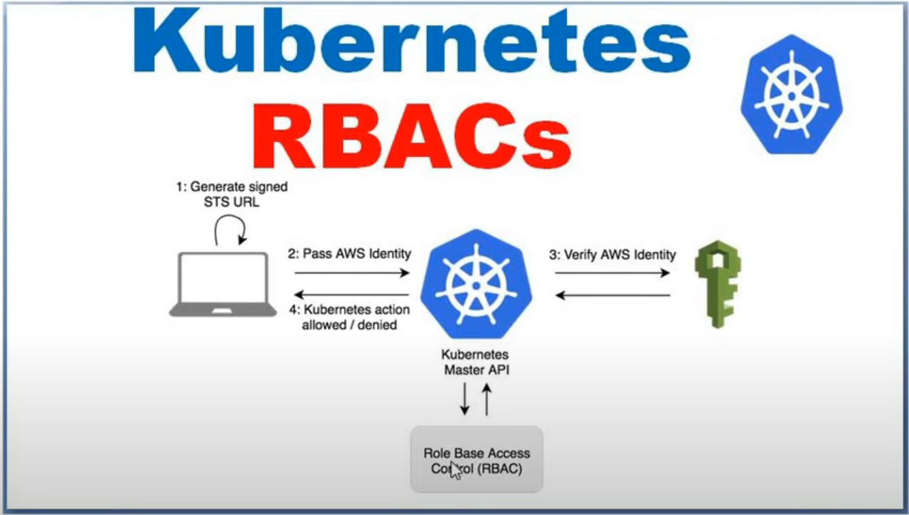

# RBAC on kubernetes EKS cluster

- **how to configure kubernetes RBAC configuration on EKS kubernetes cluster**
  
  - `EKS` which is a `managed kubernetes cluster` , on top of the `EKS cluster` we will be putting the `RBAC configuration`
  
  - we also been `evaluating the scenario` around the `kubernetes RBAC`
    
    - when the `access been given` to the `IAM` user , How to `kubectl or kubernetes api command` will respond
    
    - when the `access not provided` to `IAM User` , How else the `kubectl or kubernetes api command` will respond
    
  - 
  
  - we have the `kubernetes EKS cluster with master API for the kubectl command on which the RBAC been configured`
  
  - here we have the `AWS IAM service` for the `external USER management`