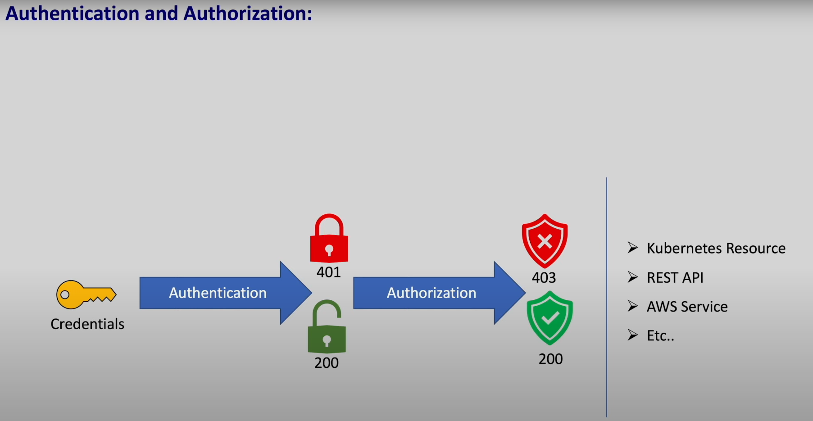
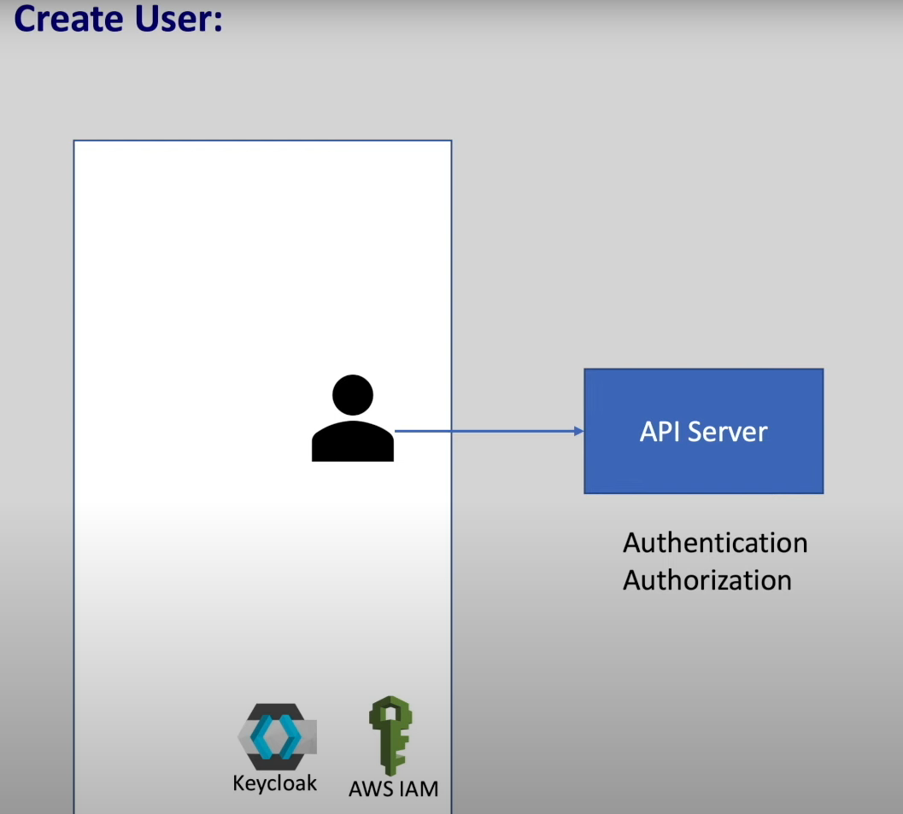
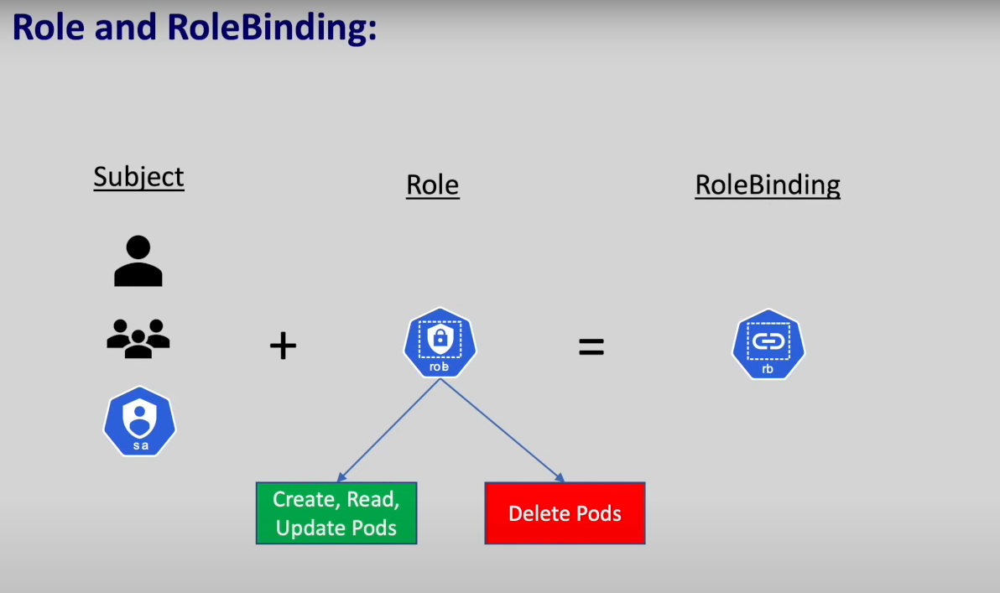

# Role Based Access Control (RBAC) in kubernetes 

- so far we have `access all resource` from the `kubernetes cluster` `without any restriction`

- in `realtime inside the kubernetes cluster` we have `multiple nodes` , `multiple namespaces` and `multiple deployment/replicaset/PODs/Services/other kubernetes resources`

- we have also `multiple resource` accesssing the `kubernetes cluster resources` at `the same time`

- if we don't have `any restriction to kubernetes cluster` , there is a chance of `deleting the kubernetes resource inside the kubernetes cluster accidently`

- we can `provide/impose restriction` to `create/update/delete resources` based on `some roles`

- for example , we can make sure the `developer` can only `deploy certain application` to `certain namespace`

- our `infrastructure management team` can have only `read access` to the `kubernetes cluster resource` for `monitoring task`

- `adminstrator` can perform all the `action` inside the `kubernetes cluster resource`

- **How to restrict access to kubernetes cluster resources using RBAC framework**  

- in general `to access any resource` whether thats a `kubernetes resource` / `REST API service` / `AWS Service` , we need to `prove that we are valid user` by providing `credetials into it` , this `process` is known as `authentication`

- if we `don't have the access to the requested resource` then we will be thrown out `stating a 401 error code` 

- if we are the `valid user ` then we wioll ge the `200 response code`

- once we `prove our authenticity by providing the credetials` that does not mean that `we have access to all the resource inside the kubernetes cluster`

- there are `multiple things` that we can do `in the application` such as 
  
  - `creating a resource`
  
  - `updating a resource`
  
  - `deleteing a resource` 
  
- we `must be authorized` to perform `certain action` as above

- `before accessing any resource` and `after authentication` , we will `checked against our role`  that `we are authorized to perform that action or not` , which is known as `authorization`

- if we are `not authorized` to `perform the requested action` again we will be `thrown out` with a `403 error code`

- if we are `authorized`to `perform the requested action` then we will be getting the `200 response code`

-  

- with `authentication` we are proviing that `we are a valid user` and `with authorization` we will `checked` that `whether we can perform certain task`

- there are `different model with which we can achive this authorization` such as 
  
  - `Role Based Access Control(RBAC)`
  
  - `Attribute Based Access Control(ABAC)`
  
  - `Node Authorization`
  
- `popular authorization` model being as `role based access control (RBAC)` , which determine `certain user` allowed to `perform certain action` on a `kubernetes resoucce` based on the `role`

- `based on the roles` the `amount of access` can vary

- we can have the `below roles` and `amount of access` as below 

    - `developer role` have access to the `create/read/update` resources
    
    - `monitoring role` have the access to the `Read` resources
    
    - `admin role` can have `access to create,read,update and delete`
    
- to start `how the role based access control (RBAC)` work `we need to first create the user`

- in `kubernetes` we `can't create the User` like `how we created PODs or Services or etc`

- `kubernetes` does not manage `users` and should be managed by `external identity platform` such as `keycloak/AWS IAM` , but kubernetes does manage the `Authentication and Authorization`

- `whenever someone perform certain action against  the cluster` the request goes to the `API Server` the `Authentication and Authorization` will be checked , if `it is a valid user and authorized to perform certain task` then it can perform the action on it 

- 

- **How to create a User in minikube kubernetes cluster**

- when we use the `minikube kubernetes cluster` then the `info about the cluster` stored into the `~/.kube/config` file 

- if we open the `~/.kube/config` we can see the below info 

  ```yaml
      ~/.kube/config
      =============
      apiVersion: v1
      # here we can see any number of cluster that we have access to
      # it can be minikube kubernetes cluster or AWS EKS or azure AKS cluster
      clusters:
      - cluster:
          # this is the certificate authority
          # any user which provide valid certificate signed by the certificate authority or CA is consideredn authenticated
          # to authenticated against minikube lets generate a certificate
          # we need to make sure the certificate been signed by the certificate authority or CA mentioned below
          certificate-authority: /home/pratik/.minikube/ca.crt
          extensions:
          - extension:
              last-update: Sun, 04 Feb 2024 11:26:46 IST
              provider: minikube.sigs.k8s.io
              version: v1.32.0
            name: cluster_info
          server: https://192.168.49.2:8443
        name: minikube
      
      # here we can see all the kubernetes context
      # the context contain info about the kubernetes cluster and user and namespace
      # based on the cluster the context can be multiple in number

      contexts:
      - context:
          cluster: minikube
          extensions:
          - extension:
              last-update: Sun, 04 Feb 2024 11:26:46 IST
              provider: minikube.sigs.k8s.io
              version: v1.32.0
            name: context_info
          namespace: default
          user: minikube
        name: minikube
      
      current-context: minikube
      kind: Config
      preferences: {}

      # here we can see multiple User over here
      # when we start the minikube cluster a minikube USER will going to be get created
      # with the minikube USER we have accessed the minikube kubernetes cluster resource
      users:
      - name: minikube
        user:
          client-certificate: /home/pratik/.minikube/profiles/minikube/client.crt
          client-key: /home/pratik/.minikube/profiles/minikube/client.key


  ```

- `any user ` which `provide valid certificate ` `signed by the certificate authority or CA` is `considered authenticated`

- to `authenticated against minikube kubernetews cluster` lets `generate a certificate` first

- we need to make sure the `certificate been signed by the certificate authority or CA mentioned as per the minikube` which is `~/.minikube/ca.crt`

- before we `create the certificate` we need to create the `User Private Key` with `openssl`

- we can do that by using the command as below 

  ```bash
      openssl genrsa -out pratik.key 2048
      # here we are creating the USER private key using the RSA token
      # here the number of bytes is of 2048
      # this will output the pratik.key which is the private USER key

      # then we need to create the certificate signing request(CSR) using the private USER key that we have created
      # for that we can use the command as below 
      openssl req -new -key pratik.key -out pratik.csr -subj "/CN=pratik/O=dev/O=example.org"
      # here we are requesting the creating the certificate signing request(CSR) using the  User Private Key 
      # this will create the pratik.csr certificate signing request(CSR)
      # here also CN stands for the common name which will act as the username
      # here also O stands for the group Name that user will belong to 
      # here we can associate the user to multiple group
      # hence we can mention it as pratik USER and that user belong to dev and example.org group
      # here also we provided the key as the USER private key that wehave generated


      # now we need to send the certificate signing request to the certificate authority CA of the minikube to get it signed
      # here we can do that as below command with openssl
      # we can get the details about the CA i.e certificate authority from ~/.kube/config folder
      sudo openssl x509 -req -CA ~/.minikube/ca.crt -CAkey ~/.minikube/ca.key -CAcreateserial -days 730 -in pratik.csr -out pratik.crt
      # here this will provide the X509 certificate signed by the CA i.e certificate authority of minikube
      # here inside the ~/.minikube folder we can see the below details as :-
      #(addons
      #cache
      #ca.crt
      #ca.key
      #ca.pem
      #cert.pem
      #certs
      #config
      #files
      #key.pem
      #logs
      #machine_client.lock
      #machines
      #profiles
      #proxy-client-ca.crt
      #proxy-client-ca.key
      #)
      # here the CA beenn pointing to ~/.minikube/ca.crt file
      # here CAKey pointing to ~/.minikube/ca.key file
      # here against the -in we are providing the certificate signing request i.e CSR file
      # also we are outputing the pavan.crt certificate file at the outcome
      # here we need provide the sudo permission
      # the output will be as below
      Certificate request self-signature ok
      subject=CN = pratik, O = dev, O = example.org

  ```

- now we need to `add the USER` for which the `certificate been added with certificate authority(CA)` into the `minikube kubernetes cluster using kubectl configuration`

- that we can perform by below operation

  ```bash
      kubectl config set-credetials <USERNAME> --client-certificate=<USER cert that need to be singed by the minikube CA having .crt extension> --client-key=<USER Private Key>
      # this commmand will add the created USER into the minikube kubernetes cluster inside the kubenetes configuration 
      # we can see the ~/.kube/config and we can see the new User been added to the config 
      # here we are using the username as pratik 
      kubectl config set-credetials pratik --client-certificate=pratik.crt --client-key=pratik.key
      # here we are using the USER Private Key as pratik.key
      # also the client certificate as pratik.crt that we have created
      User "pratik" set.

      # now if we saw the ~/.kube/config then the output wiill be below
      cat ~/.kube/config
      # the output will be as below
      apiVersion: v1
      # here we can see any number of cluster that we have access to
      # it can be minikube kubernetes cluster or AWS EKS or azure AKS cluster
      clusters:
      - cluster:
          # this is the certificate authority
          # any user which provide valid certificate signed by the certificate authority or CA is consideredn authenticated
          # to authenticated against minikube lets generate a certificate
          # we need to make sure the certificate been signed by the certificate authority or CA mentioned below
          certificate-authority: /home/pratik/.minikube/ca.crt
          extensions:
          - extension:
              last-update: Sun, 04 Feb 2024 11:26:46 IST
              provider: minikube.sigs.k8s.io
              version: v1.32.0
            name: cluster_info
          server: https://192.168.49.2:8443
        name: minikube
      
      # here we can see all the kubernetes context
      # the context contain info about the kubernetes cluster and user and namespace
      # based on the cluster the context can be multiple in number

      contexts:
      - context:
          cluster: minikube
          extensions:
          - extension:
              last-update: Sun, 04 Feb 2024 11:26:46 IST
              provider: minikube.sigs.k8s.io
              version: v1.32.0
            name: context_info
          namespace: default
          user: minikube
        name: minikube
      
      current-context: minikube
      kind: Config
      preferences: {}

      # here we can see multiple User over here
      # when we start the minikube cluster a minikube USER will going to be get created
      # with the minikube USER we have accessed the minikube kubernetes cluster resource
      users:
      - name: minikube
        user:
          client-certificate: /home/pratik/.minikube/profiles/minikube/client.crt
          client-key: /home/pratik/.minikube/profiles/minikube/client.key
      # here we can see that new user been get added to the USER list over here
      - name: pratik
        user:
          client-certificate: /home/pratik/kubernetes_demo/pratik.crt
          client-key: /home/pratik/kubernetes_demo/pratik.key

      # now we also need to create the context so that we can switch between the default minikube context having minikube user and new context with pratik User
      # we can create the new context by using the command as below 
      kubectl config set-context <context name> --cluster=<cluster name> --user=<user name> --namespcae=<namespace we want to run the kubectl command>
      # in minikube both the context name and cluster name is minikube
      # as we are running the minikube kubernetes cluster we need to provide the cluster as minikube
      # here we are setting the context name to pratik-minikube
      # here we will be usingthe user as pratik
      # here we can also provide the namespace as default in this case
      kubectl config set-context pratik-minikube --cluster=minikube --user=pratik --namespace=default
      # the output will be as below
      Context "pratik-minikube" created


      # now if we chanck the ~/.kube/config then we can see the context also been added to the  ~/.kube/config  file
      cat ~/.kube/config
      # the output will be as below

      apiVersion: v1
      # here we can see any number of cluster that we have access to
      # it can be minikube kubernetes cluster or AWS EKS or azure AKS cluster
      clusters:
      - cluster:
          # this is the certificate authority
          # any user which provide valid certificate signed by the certificate authority or CA is consideredn authenticated
          # to authenticated against minikube lets generate a certificate
          # we need to make sure the certificate been signed by the certificate authority or CA mentioned below
          certificate-authority: /home/pratik/.minikube/ca.crt
          extensions:
          - extension:
              last-update: Sun, 04 Feb 2024 11:26:46 IST
              provider: minikube.sigs.k8s.io
              version: v1.32.0
            name: cluster_info
          server: https://192.168.49.2:8443
        name: minikube
      
      # here we can see all the kubernetes context
      # the context contain info about the kubernetes cluster and user and namespace
      # based on the cluster the context can be multiple in number

      contexts:
      - context:
          cluster: minikube
          extensions:
          - extension:
              last-update: Sun, 04 Feb 2024 11:26:46 IST
              provider: minikube.sigs.k8s.io
              version: v1.32.0
            name: context_info
          namespace: default
          user: minikube
        name: minikube

      # here we can see the new context been added to the ~/.kube/config file

      - context:
          cluster: minikube
          namespace: default
          user: pratik
        name: pratik-minikube
      
      current-context: minikube
      kind: Config
      preferences: {}

      # here we can see multiple User over here
      # when we start the minikube cluster a minikube USER will going to be get created
      # with the minikube USER we have accessed the minikube kubernetes cluster resource
      users:
      - name: minikube
        user:
          client-certificate: /home/pratik/.minikube/profiles/minikube/client.crt
          client-key: /home/pratik/.minikube/profiles/minikube/client.key
      # here we can see that new user been get added to the USER list over here
      - name: pratik
        user:
          client-certificate: /home/pratik/kubernetes_demo/pratik.crt
          client-key: /home/pratik/kubernetes_demo/pratik.key


  ```

- we can verify the `context avialable` inside the `kubectl` by using the command as below command
  
  ```bash
      kubectl config get-contexts
      # fetching all the contexts set in kubectl command line
      # here it will  display the minikube context (created by minikube) , our new context that we have created or any other AWS EKS or azure AKS which been set
      # the outout in this case is as below
      CURRENT   NAME            CLUSTER             AUTHINFO          NAMESPACE
            
         *       minikube        minikube             minikube          default
                 pratik-minikube minikube             pratik            default # here we can see the new context that we have created

      # here the * signifies what is the default context that currently been checked out


      # if we want to switch between the context then we can do that as below
      kubectl config use-context pratik-minikube
      # here switching to the new context n this case
      # the output will be as below
      Switched to context "pratik-minikube".

      # we can verify which is the current context by using the below command as
      kubectl config get-contexts
      # fetching all the contexts set in kubectl command line
      # here it will  display the minikube context (created by minikube) , our new context that we have created or any other AWS EKS or azure AKS which been set
      # the outout in this case is as below
      CURRENT   NAME            CLUSTER             AUTHINFO          NAMESPACE
            
                 minikube        minikube             minikube          default
         *       pratik-minikube minikube             pratik            default # here we can see the new context that we have created

      # here the * signifies what is the default context that currently been checked out


  ```

- now wheatever the `request we are making using kubectl to the API server of the cluster` then we will be getting the `user as <username> that we have set rather than minikube user`

- but now if we try to listdown the `PODs in the cluster` then we can see the below error 

  ```bash
      kubectl get pods
      #  fetcching the PODs inside the default namespace but using the pratik user
      # the output will be as below 
      Error from server (Forbidden): pods is forbidden: User "pratik" cannot list resource "pods" in API group "" in the namespace "default"

  ```

- here we can see the `user pratik` is `unable to list` the `PODs` as the `user` just being created and by default the `new user` does `not have any access to any resources` inside the `minikube cluster`

- here the `user is just a skeleton valid user` but does not have the `authorization to access the resource`

- as the `administrator` we need to `provide the access for the same`

- for that we need to switch to the `minikube context of the minikube clustrer` by using the command as below and we need to `provide access to the pratik user`

  ```bash
      # switch between the context then we can do that as below
      kubectl config use-context minikube
      # here switching to the new context n this case
      # the output will be as below
      Switched to context "minikube".

  ```

- **Role and RoleBinding**

- in kubernetes we can provide `permission` to `user` based on the `role` and `rolebinding`

- we can write the `role definition` as below as `roles.yml`

  
  ```yaml
      roles.yml
      ==========
      apiVersion: rbac.authorization.k8s.io/v1 # here we are using the apiVersion as rbac.authorization.k8s.io/v1 as it belong tpo apiGroup as rbac.authorization.k8s.io
      # also we can see the details using the command as kubectl api-resources -o wide | grep role
      # here we can see the apiVersion for all the kubernetes object in this case
      kind: Role # here the type of object being Role
      metadata: # name of the role provided as pod-reader
        name: pod-reader
      rules: # defining the rules in this case as below
        # here we can define the different apiGroups as list in this case
        - apiGroups: [""] # here the apiGroup means it belong to the core Group so that it can list PODs/Services/configMaps/Secrets and etc
          verbs: ["get","watch","list"] # here we are providing the permission what this role can do which can also be seen in kubectl api-resources -o wide | grep role
          # This allows the role to perform the specified actions on pods, such as retrieving information about them, watching for changes, and listing the existing pods.
          resources: ["pods","pods/logs"]
          # resources field in the roles.yml file specifies the Kubernetes API resources to which the defined role's rules apply
          # the resources field in the roles.yml file specifies what types of objects or entities within a Kubernetes cluster the defined role has permission to interact with.


  ```

- if we want to know about the `apiVersion` or `apiGroup` or `verbs` that can be used we can uise the below command

  ```bash

      kubectl api-resource -o wide
      # this command will give info about the apiVersion and apiGroup and verbs that can be used
      # we can grep the resourceType to fetch more details
      NAME                              SHORTNAMES   APIVERSION                             NAMESPACED   KIND                             VERBS                                                        CATEGORIES
      bindings                                       v1                                     true         Binding                          create                                                       
      componentstatuses                 cs           v1                                     false        ComponentStatus                  get,list                                                     
      configmaps                        cm           v1                                     true         ConfigMap                        create,delete,deletecollection,get,list,patch,update,watch   
      endpoints                         ep           v1                                     true         Endpoints                        create,delete,deletecollection,get,list,patch,update,watch   
      events                            ev           v1                                     true         Event                            create,delete,deletecollection,get,list,patch,update,watch   
      limitranges                       limits       v1                                     true         LimitRange                       create,delete,deletecollection,get,list,patch,update,watch   
      namespaces                        ns           v1                                     false        Namespace                        create,delete,get,list,patch,update,watch                    
      nodes                             no           v1                                     false        Node                             create,delete,deletecollection,get,list,patch,update,watch   
      persistentvolumeclaims            pvc          v1                                     true         PersistentVolumeClaim            create,delete,deletecollection,get,list,patch,update,watch   
      persistentvolumes                 pv           v1                                     false        PersistentVolume                 create,delete,deletecollection,get,list,patch,update,watch   
      pods                              po           v1                                     true         Pod                              create,delete,deletecollection,get,list,patch,update,watch   all
      podtemplates                                   v1                                     true         PodTemplate                      create,delete,deletecollection,get,list,patch,update,watch   
      replicationcontrollers            rc           v1                                     true         ReplicationController            create,delete,deletecollection,get,list,patch,update,watch   all
      resourcequotas                    quota        v1                                     true         ResourceQuota                    create,delete,deletecollection,get,list,patch,update,watch   
      secrets                                        v1                                     true         Secret                           create,delete,deletecollection,get,list,patch,update,watch   
      serviceaccounts                   sa           v1                                     true         ServiceAccount                   create,delete,deletecollection,get,list,patch,update,watch   
      services                          svc          v1                                     true         Service                          create,delete,deletecollection,get,list,patch,update,watch   all
      mutatingwebhookconfigurations                  admissionregistration.k8s.io/v1        false        MutatingWebhookConfiguration     create,delete,deletecollection,get,list,patch,update,watch   api-extensions
      validatingwebhookconfigurations                admissionregistration.k8s.io/v1        false        ValidatingWebhookConfiguration   create,delete,deletecollection,get,list,patch,update,watch   api-extensions
      customresourcedefinitions         crd,crds     apiextensions.k8s.io/v1                false        CustomResourceDefinition         create,delete,deletecollection,get,list,patch,update,watch   api-extensions
      apiservices                                    apiregistration.k8s.io/v1              false        APIService                       create,delete,deletecollection,get,list,patch,update,watch   api-extensions
      controllerrevisions                            apps/v1                                true         ControllerRevision               create,delete,deletecollection,get,list,patch,update,watch   
      daemonsets                        ds           apps/v1                                true         DaemonSet                        create,delete,deletecollection,get,list,patch,update,watch   all
      deployments                       deploy       apps/v1                                true         Deployment                       create,delete,deletecollection,get,list,patch,update,watch   all
      replicasets                       rs           apps/v1                                true         ReplicaSet                       create,delete,deletecollection,get,list,patch,update,watch   all
      statefulsets                      sts          apps/v1                                true         StatefulSet                      create,delete,deletecollection,get,list,patch,update,watch   all
      selfsubjectreviews                             authentication.k8s.io/v1               false        SelfSubjectReview                create                                                       
      tokenreviews                                   authentication.k8s.io/v1               false        TokenReview                      create                                                       
      localsubjectaccessreviews                      authorization.k8s.io/v1                true         LocalSubjectAccessReview         create                                                       
      selfsubjectaccessreviews                       authorization.k8s.io/v1                false        SelfSubjectAccessReview          create                                                       
      selfsubjectrulesreviews                        authorization.k8s.io/v1                false        SelfSubjectRulesReview           create                                                       
      subjectaccessreviews                           authorization.k8s.io/v1                false        SubjectAccessReview              create                                                       
      horizontalpodautoscalers          hpa          autoscaling/v2                         true         HorizontalPodAutoscaler          create,delete,deletecollection,get,list,patch,update,watch   all
      cronjobs                          cj           batch/v1                               true         CronJob                          create,delete,deletecollection,get,list,patch,update,watch   all
      jobs                                           batch/v1                               true         Job                              create,delete,deletecollection,get,list,patch,update,watch   all
      certificatesigningrequests        csr          certificates.k8s.io/v1                 false        CertificateSigningRequest        create,delete,deletecollection,get,list,patch,update,watch   
      leases                                         coordination.k8s.io/v1                 true         Lease                            create,delete,deletecollection,get,list,patch,update,watch   
      endpointslices                                 discovery.k8s.io/v1                    true         EndpointSlice                    create,delete,deletecollection,get,list,patch,update,watch   
      events                            ev           events.k8s.io/v1                       true         Event                            create,delete,deletecollection,get,list,patch,update,watch   
      flowschemas                                    flowcontrol.apiserver.k8s.io/v1beta3   false        FlowSchema                       create,delete,deletecollection,get,list,patch,update,watch   
      prioritylevelconfigurations                    flowcontrol.apiserver.k8s.io/v1beta3   false        PriorityLevelConfiguration       create,delete,deletecollection,get,list,patch,update,watch   
      ingressclasses                                 networking.k8s.io/v1                   false        IngressClass                     create,delete,deletecollection,get,list,patch,update,watch   
      ingresses                         ing          networking.k8s.io/v1                   true         Ingress                          create,delete,deletecollection,get,list,patch,update,watch   
      networkpolicies                   netpol       networking.k8s.io/v1                   true         NetworkPolicy                    create,delete,deletecollection,get,list,patch,update,watch   
      runtimeclasses                                 node.k8s.io/v1                         false        RuntimeClass                     create,delete,deletecollection,get,list,patch,update,watch   
      poddisruptionbudgets              pdb          policy/v1                              true         PodDisruptionBudget              create,delete,deletecollection,get,list,patch,update,watch   
      clusterrolebindings                            rbac.authorization.k8s.io/v1           false        ClusterRoleBinding               create,delete,deletecollection,get,list,patch,update,watch   
      clusterroles                                   rbac.authorization.k8s.io/v1           false        ClusterRole                      create,delete,deletecollection,get,list,patch,update,watch   
      rolebindings                                   rbac.authorization.k8s.io/v1           true         RoleBinding                      create,delete,deletecollection,get,list,patch,update,watch   
      roles                                          rbac.authorization.k8s.io/v1           true         Role                             create,delete,deletecollection,get,list,patch,update,watch   
      priorityclasses                   pc           scheduling.k8s.io/v1                   false        PriorityClass                    create,delete,deletecollection,get,list,patch,update,watch   
      csidrivers                                     storage.k8s.io/v1                      false        CSIDriver                        create,delete,deletecollection,get,list,patch,update,watch   
      csinodes                                       storage.k8s.io/v1                      false        CSINode                          create,delete,deletecollection,get,list,patch,update,watch   
      csistoragecapacities                           storage.k8s.io/v1                      true         CSIStorageCapacity               create,delete,deletecollection,get,list,patch,update,watch   
      storageclasses                    sc           storage.k8s.io/v1                      false        StorageClass                     create,delete,deletecollection,get,list,patch,update,watch   
      volumeattachments                              storage.k8s.io/v1                      false        VolumeAttachment                 create,delete,deletecollection,get,list,patch,update,watch   


  ```

- we can deploy the changes to the cluster by applying the changes as below 

  ```bash
      kubectl apply -f roles.yml
      # here we can see the roles.yml been applied with the changes to deploy the resources to the cluster
      # the output will be as below 
      role.rbac.author5t55ization.k8s.io/pod-reader created

      # now we can see the list of roles using the command as below 
      kubectl get roles
      # we can see the below info here
      NAME         CREATED AT
      pod-reader   2024-02-06T02:58:40Z

      # if we want to see more details about the POD then we can see the below info here
      kubectl describe role <role name>
      # here we can see the below output in this case
      Name:         pod-reader
      Labels:       <none>
      Annotations:  <none>
      PolicyRule:
        Resources  Non-Resource URLs  Resource Names  Verbs
        ---------  -----------------  --------------  -----
        pods/log   []                 []              [get watch list]
        pods       []                 []              [get watch list]


  ```

- now currently we have the `USER` and the `ROLE` ready 

- then we need to then connect the `USER` and `ROLE` using the `RoleBinding` , so that `User` will get the `Permission` defined inside the `Role`

- in `rolebinding` we will `connect` then `subject` with the `role` stated as below 

- 

- here the `subject` can be a
  
  - `user`
  
  - `group`
  
  - `service account`
  
- here the `role` will come with the `permission i.e what resource we can access and what resource we can't access` that we defined for the `role` whicle creating it

- with the `rolebinding` we are `providing` the `user` with `specific permission that been assigned for the roles`

- we can create the `rolebinding` definition as below with `role-binding.yml` file

  ```yaml
      role-binding.yml
      ================
      apiVersion: rbac.authorization.k8s.io/v1 # here we are using the apiVersion as rbac.authorization.k8s.io/v1 as it belong tpo apiGroup as rbac.authorization.k8s.io
      # also we can see the details using the command as kubectl api-resources -o wide | grep binding
      # here we can see the apiVersion for all the kubernetes object in this case
      kind: RoleBinding # here the kubernetes object is of RoleBinding
      metadata: # providing the name for the rolebinding
        name: read-pods
      subjects:
        - kind: User/Group/Service Account
          name: pratik # here we need ptovide the username to which we want to associate the role with which is case-sensitive
          apiGroup: rbac.authorization.k8s.io # here the apiGroup for rolebinding is rbac.authorization.k8s.io
      roleRef: # here we need to define the roleRef which will contains the details about the role we want to assign
        # this will be a dict not a list
        # "roleRef" speccifies the binding to a `Role or ClusterRole` 
        kind: Role # here the kind will be Role as we are associating the role with the user
        name: pod-reader # here this is the name of the role that we want to assign that we have created earlier
        apiGroup: rbac.authorization.k8s.io # here the apiGroup for rolebinding is rbac.authorization.k8s.io


  ```  

- we can deploy the changes to the cluster by applying the changes as below 

  ```bash
      kubectl apply -f role-binding.yml
      # here we can see the info as below to apply changes and deploy resource to cluster
      # the output will be as below
      rolebinding.rbac.authorization.k8s.io/read-pods created 

      # we can see the list of rolebinding using the command as below 
      kubectl get rolebinding
      # the output will be as below 
      NAME        ROLE              AGE
      read-pods   Role/pod-reader   2m30s

      # then if we want to see the details about the roleBinding then we can see that by using the command as
      kubectl describe rolebinding read-pods
      # here we can see the below info
      Name:         read-pods
      Labels:       <none>
      Annotations:  <none>
      Role:
        Kind:  Role
        Name:  pod-reader
      Subjects:
        Kind  Name    Namespace
        ----  ----    ---------
        User  pratik  
  
  ```

- now if we `switch back` to the `context` that we created for the `pratik user` and try to `list down the pods` then we can do that as below 

  ```bash
      


  ```