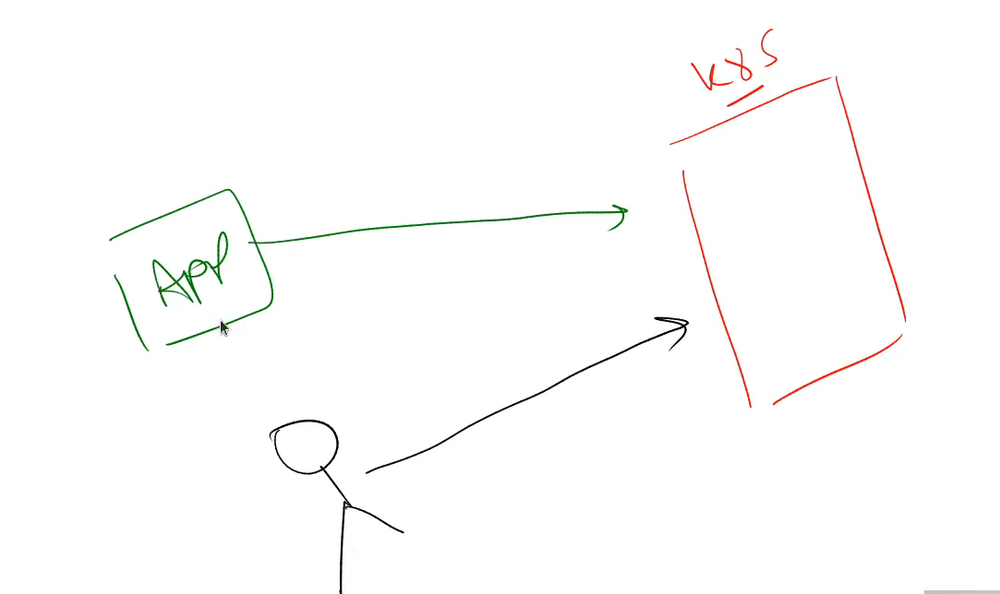

# kubernetes Service Account

- lets suppose we have a `kubernetes cluster`

- if we want to know `how many types of user` that can access the `k8s cluster` then 
  
  - `normal user` such as `kubernetes administrator` or `kubernetes developer` who can perform the `admin` or `develope` something
  
  - the `other type of user` or `we can say it as client` for the `kubernetes cluster` will be a `program or process` that `run inside`the `kubernetes cluster` which want to talk to the `kubernetes API Server` to perform `certain action`
  
  - 
  
- as we know the `if a particular user` want to communicate with the `kubernetess cluster` kubernetes wil not going to `handle the management user` i.e `creation of the User` or `Deletion of the User` that will be handled by the `external identity management service` such as `AWS IAM` or `key cloak`

- but if we want to `access` to the `Kubernetes API Server` from the `application` , for `managing` that `kubernetes has a resource` called `serviceAccount`

- for example 
  
  - if we want to run the `application` on `kubernetes`  which will be running as the `POD`
  
  - from the `application POD` we want to `communicate` with the `kubernetes API Server` then `serviceAccount` will take care of that `communication`
  
  - `kubernetes serviceAccount` is the `kubernetes resource` will make sure `what type of priviledges` will be `allocated` for the `POD` in order to speak to the `kubernetes API Server`
  

- **How kubernetes Service Account Has Created**

- there will be `serviceAccount controller` running as a part of the `kubernetes controller` , which will `create` the `default Service Account` for `each namespace` of the `kubernetes cluster`

- when we create the `new namespace as test` then `kubernetes controller manager` uses the `kubernetes controller` will make sure that there is `serviceAccount` named as `default` will bve created inside the `newly created namespace named default`

- we can also create our own `service Account` inside the `particular namespace` as well in this case

- any `service Account` that `we are creating` will `going to specify` what kind of `priviledges the serviceAccount have` 

- 