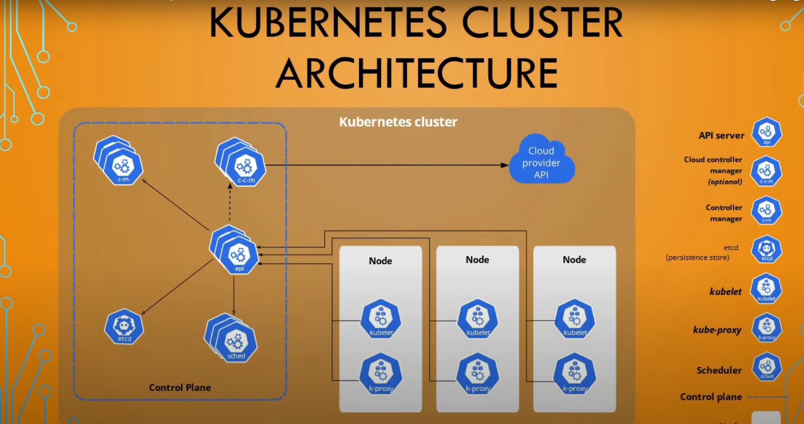
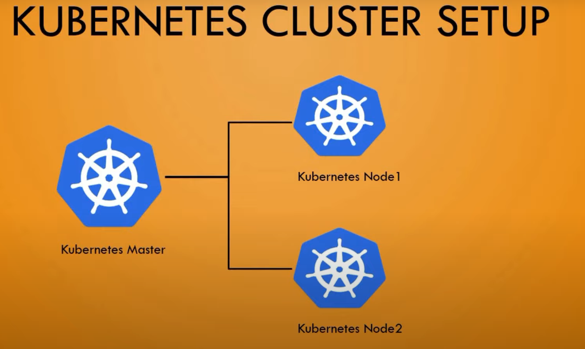
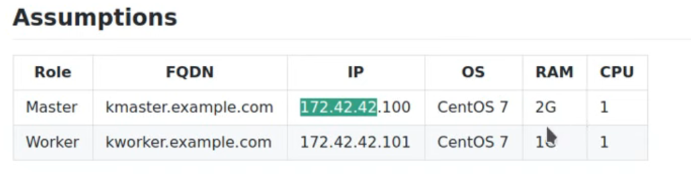

# creating kubernetes cluster using kubeadm 

- inside the `kubernetes cluster` we have the `masternode or control plane` and `worker node`

- there  will be different component which need to be installed on `master` and `worker` node

- the `kubernetes masternode or control plane` have resources such as 
  
  - `API Server`
  
  - `kubernetes controller manager`
  
  - `cloud controller manager(optional)`
  
  - `etcd database`
  
  - `scheduler`
  
  - `kubelet`
  
  - `kube-proxy`
  
- the `worker node` of the `kubernetes` should have below resources such as 
  
  - `kubelet`
  
  - `kube-proxy`

- please refer this picture for reference

- 

- here in this `setup` we will be having the `kubernetes master` and `kubernetes worker node`

- 

- there is `pre-requite` need before `heading onto creating kubernetes cluster`

  - we need `3 virtual machine` in this case

  - kubernetes `master as well as the worker node virtual machine` should have the `2CPU` and `2GB of RAM`
  
  - here we will be using the `local VMWare Virtual Machine or Oracle Virtual Box` hence we need to `assign a StaticIP` for the same
  
  - we need to `set the hostname` for the `Virtual Machine` in this case
  
- if we are using `kubeadm` in order to create the `kubernetes cluster` we need to provide the `below steps`

  - `set the hostname`
  
  - `Assing a Static IP`  
  
  - `Edit the /etc/hosts` file
  
  - `Disable the SELinux`
  
  - `Disable the firewall and iptables settings`
  
  - `setup the kubernetes repo` here we will be `installing` the `kubectl kubeadm and kubelet`
  
  - `installing` the `kubeadm, Docker` and `Enable and Start the Service`
  
  - `Disable the swap`
  
  - `initialize the kubernetes cluster masternode` which will provide the `token` for the `worker node` 
  
  -  `install` the `POD Networking` using the `Calico network` on the `masternode`
  
  - `join the worker node` by using the `token` provided by the `masternode` 
  
- we don't have to run `all the commands` on all the `nodes` 

- this will be `node specific` some command need tpo run on `masternode` and other need to run on `workernode` , few command which will run on the `both master and worker node`

- if we are not having `2GB of RAM` for the Master Node then it will be a `problem`

- hence here the `configuration` should be as below 

- 

- after spinning the `virtual machine` then we need to use the `below command to set the hostname`

    ```bash
        hostnamectl set-hostname k8smaster #(masternode)
        hostnamectl set-hostname k8sworker1 #(workernode)
        # this two command will help in setting the hostname for the both the VM in this case


    ```

- then we need to assign a `static IP` for both `master and workernode`

- 