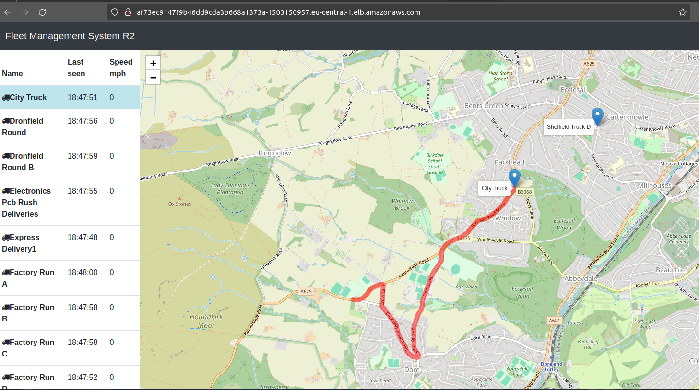

# Extra Kubernetes with EKS Tutorials from youtube for EBS CSI DRIVER

- if we have the `AWS EKS cluster` created  then we can connect to the cluster by using the command as below 

    ```bash
        aws eks update-kubeconfig --region <region-name> --name <existing kubernetes cluster name>
        # here we are using the aws eks cli command to connect to the existing AWS EKS kubernetes cluster
        # for example we can connnect as below 
        aws eks update-kubeconfig --region eu-central-1 --name fleetman
        # here we are trying to connect to the fleetman cluster which is already created with region eu-central-1
        # the output will be as below
        Added new context arn:aws:eks:eu-central-1:520668085636:cluster/fleetman to /home/pratik/.kube/config
        
    ```

- for the `EKS cluster` , the `application in AWS EKS` need a `persistent Storage`

- for the `Persistent Storage` in the `AWS EKS cluster` we need the `AWS EBS volume` Service in that case

- for managing the `AWS EBS Volume` from the `AWS EKS cluster` we need `something` which is called as `EBS CSI DRIVER`

- **Why Do we need the EBS CSI Driver in EKS Cluster**
  
  - `AWS EBS CSI` which stands for `EBS container storage interface` Driver allow `EKS cluster` to manage the `lifecycle of the EBS Volume` for `persistent Volume` in `K8S` `(create/resize/delete) the EBS volume`
  
  -  we can `(create/resize/delete) the EBS volume` inside trhe `kubernetes manifest yml` by using the `EBS CSI DRIVER` inside the `EKS cluster`
  
  - we need to `install` the `EBS CSI Driver` inside the `AWS EKS cluster kubernetes environment` to perform all these action of `(create/resize/delete) the EBS volume` for `persistent volume` through the `kubernetes manifest`
  
- we can deploy the `EBS CSI DRIVER` using the `2 deployment option`
  
  - `Managing the EBS CSI Driver` as `self managed addon`
  
  - `Managing the EBS CSI Driver` as `EKS addon`
  

- we need to associate the `EBS CSI` driver to the `IAM` hence we need the `associate-iam-oidc-provider` access hence we can provide the condition as below 

    ```bash
        eksctl utils associate-iam-oidc-provider --cluster <cluster name> --approve
        # this will help in adding the EBS CSI driver to the IAM profile that we are using in this case
        # for example
        eksctl utils associate-iam-oidc-provider --cluster fleetman --approve
        # the output will be as below 
        2024-01-28 17:52:04 [ℹ]  will create IAM Open ID Connect provider for cluster "fleetman" in "eu-central-1"
        2024-01-28 17:52:05 [✔]  created IAM Open ID Connect provider for cluster "fleetman" in "eu-central-1"

        # this command is used to associate an IAM OIDC (OpenID Connect) provider with your Amazon EKS cluster
        # This association is required for the "Kubernetes API server" to "recognize and trust OIDC tokens" for authentication purposes.
        # The --approve flag indicates that you want to proceed with the association without manual confirmation

        #In simple terms, this command associates an IAM OIDC (OpenID Connect) provider with an Amazon EKS cluster. This association is necessary for the cluster to recognize and trust OIDC tokens for authentication purposes

    ```

- here then we need to `create a role` using the `eksctl command` and provide them the `access to the AmazonEBSCSIDriverPolicy`

- for that we can use the command as below 

    ```bash
        eksctl create iamserviceaccount \
        --name ebs-csi-controller-sa \
        --namespace kube-system \
        --cluster fleetman
        --attch-policy-arn  arn:aws:iam::aws:policy/service-role/AmazonEBSCSIDriverPolicy \
        -- approve \
        -- role-only \
        --role-name  AmazonEKS_EBS_CSI_DriverRole
        
        # this command will use the eksctl to create a Role like how few roles getting created while using the EKS cluster
        # here the rolename will be AmazonEKS_EBS_CSI_DriverRole
        # inside that Role AmazonEBSCSIDriverPolicy policy will be associated
        # we can use this role while creating the Amazon EBS CSI Driver addon on the EKS cluster
    
    ```

- now we need to instrct the `AWS EKS cluster` tpo provide the Addon Service `aws-ebs-csi-driver` which will handle the `AWS EBS from the AWS EKS cluster` for that we can use the command as below 

    ```bash
        eksctl create addon --name aws-ebs-csi-driver --cluster fleetman --service-account-role-arn arn:aws:iam::520668085636:role/AmazonEKS_EBS_CSI_DriverRole --force
        # here we are using the service-account-role-arn from the role that we have created
        # if we go to the role we have create then we can goto the AmazonEKS_EBS_CSI_DriverRole in the summary section we can see the arn 
        # here we are using that arn 
        # --name specify what addon we want to add here
        # --cluster <cluster name>
        # --force for forcefully

    ```

- the `aws-ebs-csi-driver` will be created inside the `kube-system` namespace  which we can founf by using the command as below 

    ```bash
        kubectl get all -n kube-system
        # here fetching all the kubernetes object inside the kube-system namespace over here
        # the output will be as below 
        NAME                                      READY   STATUS    RESTARTS   AGE
        pod/aws-node-dc8vv                        2/2     Running   0          6h51m
        pod/aws-node-hftdr                        2/2     Running   0          6h36m
        pod/aws-node-p6xjc                        2/2     Running   0          6h36m
        pod/coredns-68f96fff95-2pxcw              1/1     Running   0          6h57m
        pod/coredns-68f96fff95-l2fnj              1/1     Running   0          6h57m
        pod/ebs-csi-controller-555ccfdbc6-55rrs   6/6     Running   0          22m # here can see the aws-ebs-csi driver
        pod/ebs-csi-controller-555ccfdbc6-z5rtp   6/6     Running   0          22m # here can see the aws-ebs-csi driver
        pod/ebs-csi-node-d28lb                    3/3     Running   0          22m # here can see the aws-ebs-csi driver
        pod/ebs-csi-node-dmd55                    3/3     Running   0          22m # here can see the aws-ebs-csi driver
        pod/ebs-csi-node-h8pt4                    3/3     Running   0          22m
        pod/kube-proxy-bndm7                      1/1     Running   0          6h51m
        pod/kube-proxy-k9fz2                      1/1     Running   0          6h36m
        pod/kube-proxy-qkdhx                      1/1     Running   0          6h36m

        NAME               TYPE        CLUSTER-IP    EXTERNAL-IP   PORT(S)         AGE
        service/kube-dns   ClusterIP   10.100.0.10   <none>        53/UDP,53/TCP   6h57m

        NAME                                  DESIRED   CURRENT   READY   UP-TO-DATE   AVAILABLE   NODE SELECTOR              AGE
        daemonset.apps/aws-node               3         3         3       3            3           <none>                     6h57m
        daemonset.apps/ebs-csi-node           3         3         3       3            3           kubernetes.io/os=linux     22m
        daemonset.apps/ebs-csi-node-windows   0         0         0       0            0           kubernetes.io/os=windows   22m
        daemonset.apps/kube-proxy             3         3         3       3            3           <none>                     6h57m

        NAME                                 READY   UP-TO-DATE   AVAILABLE   AGE
        deployment.apps/coredns              2/2     2            2           6h57m
        deployment.apps/ebs-csi-controller   2/2     2            2           22m

        NAME                                            DESIRED   CURRENT   READY   AGE
        replicaset.apps/coredns-68f96fff95              2         2         2       6h57m
        replicaset.apps/ebs-csi-controller-555ccfdbc6   2         2         2       22m

    
    ```

- here if we are going to the `AWS EKS cluster` by `AWS Mgmt Console` &rarr; `Services` &rarr; `Elastic Kubernetes Service` &rarr; `open the clster` &rarr; `add-on` then we can see the `AWS EBS CSI Driver` being listed down there

- now we can specify the `storage-aws.yml` file as below for creating the storageclass which will converted to the `persistentVolume` at the run time and associating with the `persistentVolumeClaim` using the `StorageClassName` as below 

    ```yaml
        storage-aws.yaml
        =================
        # What do want?
        apiVersion: v1
        kind: PersistentVolumeClaim
        metadata:
        name: mongo-pvc
        spec:
        storageClassName: cloud-ssd
        accessModes:
        - ReadWriteOnce
        resources:
            requests:
            storage: 7Gi
        ---
        # How do we want it implemented
        apiVersion: storage.k8s.io/v1
        kind: StorageClass
        metadata:
        name: cloud-ssd
        provisioner: ebs.csi.aws.com
        parameters:
        type: gp2
    
    ```

- now we can deploy this to the `AWS EKS cluster` by applying the changes as below 

    ```bash
        kubectl apply -f storage-aws.yml
        # here applying the chamges and deploying the storage account onto the AWS EKS cluster
        # the output in this case will be as below 
        persistentvolumeclaim/mongo-pvc created
        storageclass.storage.k8s.io/cloud-ssd created

    ```

- then we can `apply the changes ` for the `mongo-stack.yml` which will be using the `persistentVolumeclaim` that we saved by using the command as below 

    ```bash
        kubectl apply -f .
        # here deploying all the chnges to the AWS EKS cluster as below 
        # the output will be as below in this case
        deployment.apps/mongodb created
        service/fleetman-mongodb created
        service/fleetman-webapp created
        service/fleetman-queue created
        service/fleetman-api-gateway created
        service/fleetman-position-tracker created
        persistentvolumeclaim/mongo-pvc unchanged
        storageclass.storage.k8s.io/cloud-ssd unchanged
        deployment.apps/webapp created
        deployment.apps/queueapp created
        deployment.apps/position-tracker created
        deployment.apps/position-simulator created
        deployment.apps/api-gateway created

    ```

- now if we accessing the `kubectl det svc` then we can see the `Loadbalancer` for the `webapplication` then  we can do that as below 

    ```bash
        kubectl get svc
        # fetching the Service in the kubernetes default namespace
        # the poutput will be as below 
        NAME                        TYPE           CLUSTER-IP       EXTERNAL-IP                                                                  PORT(S)              AGE
        fleetman-api-gateway        ClusterIP      10.100.93.38     <none>                                                                       8080/TCP             5h13m
        fleetman-mongodb            ClusterIP      10.100.63.51                                                  27017/TCP            29m
        fleetman-position-tracker   ClusterIP      10.100.11.40     <none>                                                                       8080/TCP             5h13m
        fleetman-queue              ClusterIP      10.100.206.185   <none>                                                                       8161/TCP,61616/TCP   5h13m
        fleetman-webapp             LoadBalancer   10.100.103.87    af73ec9147f9b46dd9cda3b668a1373a-1503150957.eu-central-1.elb.amazonaws.com   80:31226/TCP         5h13m
        kubernetes                  ClusterIP      10.100.0.1       <none>                                                                       443/TCP              7h5m
        

    ```

- now we can access the `Load Balancer` for the `fleetman-webapp` service then we will see the `outcome` as below 

- 

- if we want to `delete the addon` i.e `aws-ebs-csi-driver` then we can use the command as below 

    ```bash
        eksctl delete addon --name aws-ebs-csi-driver --cluster <cluster name>
        # this command will delete the AWS EBS CSI Cluster that we have added as the addon this case
        # for example for our cluister we can define that as below 
        eksctl delete addon --name aws-ebs-csi-driver --lcuster fleetman
        # removing the AWS EBS CSI cluister from the addon list here
    
    ```

- if we want to delete the `role` that we have created using the `eksctl command` as below 

    ```bash
        eksctl delete iamserviceaccount --name <service-account name>  --namespace <namespace where this Role been created> --cluster <your cluster name>
        # here we are using the eksctl delete iamserviceaccount to delete the service-account Role that we have created with required permission 
        # hence we can use the command as below 
        # for our fleetman cluster it will be as 
        eksctl delete iamserviceaccount --name ebs-csi-controller-sa --namespace kube-system --cluster fleetman 
        # here this will remove the iamserviceaccount that we have created just abov
    
    ```