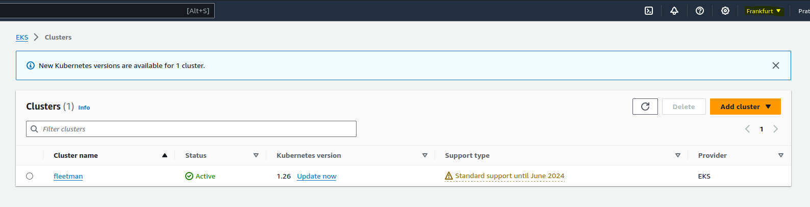
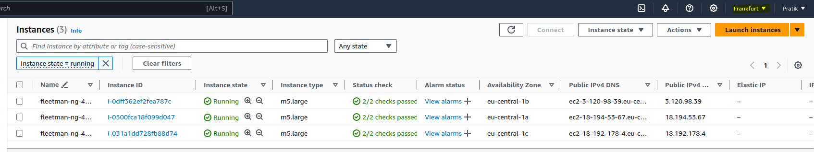

# starting AWS EKS Kubernetes cluster

- if we are using the `standard aws eks commandline` to `create the amazon EKS cluster` , which can be more `tedeious` and we need to provide `lot more command` , but with `eksctl commandline` that can be very easy 

- we can create the `amazon EKS cluster` by using the command as below 

    ```bash
        eksctl create cluster --name fleetman --version=1.26 --nodes-min=3
        # here we are using the  eksctl create cluster command here
        # we can use multiple command line args here
        # but here we are using it as below 
        # --name :- name of the kubernetes cluster else AWS EKS will provide a random name for the cluster
        # --version=1.26 what version of kubernetes we want to run inside the AWS EKS cluster
        # --nodes-min=3 here we are stating to use 3 worker node inside the AWS EKS cluster 

    ```

- this `eksctl create cluster command` will going to create a `lot of expensive resource`

- this will create the `control plane /masternode + loadbalancer` which being managed by `amazon` , which will charge `$0.10 per hour` using the `eksctl create cluster command`

- this command will also going to create the `EC2 instance` which will behave as the `worker node` with `m5.large` instance , which will going to `incur some cost`

- it takes about `20 mins` to run the `eksctl create cluster command` to create `cluster and EC2 instance for worker node`

- now we can verify that using the command as 

    ```bash
        kubectl get all
        # using the kubectl get all to fetch all the kubernetes instance in the default namegroup
        # we can see all the kubernetes object in the default namespace for the EKS cluster
        NAME                 TYPE        CLUSTER-IP   EXTERNAL-IP   PORT(S)   AGE
        service/kubernetes   ClusterIP   10.100.0.1   <none>        443/TCP   56m
    ```

- now if we are going to the `AWS Mgmt console` &rarr; `AWS EKS` &rarr; `we can see the EKS cluster in here` as 

- if we goto the `EC2 instance` &rarr; `do a refresh` then we can see the `Worker node (m5.large) instances` running which will `contains the POD service`

- 

- here we will not be able to see the `control-plane/ masternode` because as those being managed by `amazon`