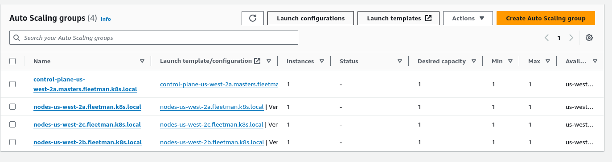

# running Kops cluster in AWS 

- now we have `configure the kops cluster` and also we have `defined how many nodes(master and woker nodes) i.e number of EC2 instance` we want to `spin up for the cluster`

- we now ready to tell `kops` and `build the cluster ` , which will create a lot of `computing resource running in the kops kubernetes cluster` inside the `AWS cloud`

-  we can `build the cluster` by using the command as below

- if we are making change to the `kops cluster configuration` and build the cluster thewn also we can use this command 

    ```bash
        kops update cluster --name ${NAME} --yes --admin=87600h
        # here using the command as kops update cluster which will go and build the cluster in this case 
        # we also have to provide the command line parameter called as --yes and --admin
        
        # when we provide the --yes args then it will confirm and  go ahead and apply those changes in this case
        # if we are not providing the --yes command it will perform an dry-run and tells us what it will going to do rather than doing it  
        
        # in the 2021 version of Kops we have the various security restriction which can e useful in production environment
        # if we don't have the admin priviledges then we can't perform these action or run the cluster
        # here the --admin going to provide admin priviledges for the cluster in order to set up and make the cluster run

        # --admin will provide the administration access to the cluster for 18 hr by defualt 
        # but we can mentioned for a longer term by mentioning hour as --admin=87600h i.e for 10years

        # output of the command will be as below
        # it can take upto 10 mins to execute the command
        # we can see details such as cluster is starting , it should be ready in a few minutres  

    
    ```


- we need to run the command in order to configure the `kubectl` , which can access the `kops cluster` with `admin priviledges`

- in order to `kubectl to execute against the kops kubernetes cluster` we need to run the command as below

    
    ```bash
        kops export kubecfg --admin=87600 --name ${NAME}
        
        # this will change the configuration of the kubectl so that it have the admin priviledges for 10 years
        # so that it can execute the c ommand against the kops kubernetes cluster that we want to create
        # here need to prode the name as the ${NAME} which we set as the env variable

        # the output will be as below 
        kOps has set your kubectl context to fleetman.k8s.local

    ```

- before we start working on the `kops cluster` , we need to `validate` that the `cluster been running up and fine`

- we can validate the `kops cluster that we just created` using the command as below , which should show as healthy and validation successful

- if the `validatation failed` we are getting with the message as `validation failed: unexpected error during validation: error listening nodes: an error on the server ("") has prevented the request from succeeding (get nodes)`  , then that means the `nodes/loadbalancer/AutoScalingGroup are not yet ready` hence we need to wait and `rerun the command` 

- once the `validation of kops cluster being successful` then we can see the `Instance Group info` as well as the `Node Status`

- for that we can run the command as below , which can take around 5 mins to complete the entire operation in this case 

    ```bash
        kops validate cluster --name ${NAME}
        # here we are validating the cluster configuration after creating all the resources such as master and workernode and also the load balancer to make it as control plane 
        # the output in this case case will be as below 
        Validating cluster fleetman.k8s.local

        INSTANCE GROUPS 
        
        NAME                        ROLE            MACHINETYPE	MIN	MAX	 SUBNETS
        control-plane-us-west-2a	ControlPlane	t3.medium	1	1	us-west-2a
        nodes-us-west-2a		    Node		    t3.medium	1	1	us-west-2a
        nodes-us-west-2b		    Node		    t3.medium	1	1	us-west-2b
        nodes-us-west-2c		    Node		    t3.medium	1	1	us-west-2c

        NODE STATUS
        
        NAME			    ROLE		    READY
        i-00b3677e4a32d1118	node		    True
        i-0c9c51d47569a5864	control-plane	True
        i-0de131b744cc7bd5c	node		    True
        i-0f1d204531c714eb4	node		    True

        Your cluster fleetman.k8s.local is ready

    
    ```

- after the command as `kops validate cluster --name ${NAME} --yes --admin=97600h ` , if we go to the `AWS Mgmt console` &rarr; `EC2` &rarr; `Then here we can see there will be few instances getting created based on the number of master and worker node that we specified`

- for our case as we have defined the `one master node` and `3 worker node` hence we will be getting the `4 EC2 instances created for the same as we defined in the nodes` and we can check the name which is exactly that we have seen with the `kops get ig --name ${NAME}` command 

- we also have a `loadbalancer` i.e `classic load balancer` which been created for the same , which we can spot in the `AWS Mgmt console` &rarr; `EC2` &rarr; `Load Balancer` and the `name of the load-balancer` will be as `api-<name of the cluster>-<random str>` which will help in communicate our request to the `master node`

- A `load balancer` in general is used for `redirecting the traffic into EC2 instances`

- the `important thing` about the `load balancer` is that `it has a stable DNS Name`

- the `reason why KOPS created this load balancer` is that `when we use the kubernetes client such as kubectl command such as kubectl get all` the command being run against the `load balancer` and `load balancer` will redirect the `command` to the `master node or control plane` which will provide the required output

- if we check the `Target Group` inside the `load balancer` then we can see that its been redirecting `traffic request` to the `control plane or master node`

- in case the `masternode or control plane` `getting failed `then `eventhough we do have the loadbalancer it will not be able to redirect the request to the masternode untill it cam back up` , hence untill the `control plane or master node restart and become up and running` we can't administer the `kops cluster`

- but as soon as the `masternode or control plane` will get restarted then `it will associate the loadbalancer static DNS name to the new masternode or control plane` hence now `loadbalancer traget group will point to the new masternode or control plane instance` and hence we can issue the `kubectl command such as kubectl get all to the load balancer api`

- the `loadbalncer will cost us some prices` we can check the prices with the below link [AWS Load Balacing Price](https://aws.amazon.com/elasticloadbalancing/pricing/)

- there are `3 type of load balancer` currently 
  
  - `Application Load Balancer`
  
  - `Network Load Balancer`
  
  - `classic Load Balancer`
  
- kops uses the `classic load balancer` in order to handle the request , the `prices of the different type of load balncer being different for different region`

- for the `us-west-2` region that cost around `$0.025 per Classic Load Balancer-hour (or partial hour)`   , which will come around as `$0.6 cent` per day and for month it will be around as `$18 per month`

- these `EC2 instances` that got created by `kops` for the `kubernetes node(master and worker)` that will protected by `AWS Auto Scaling Group`

- we can see those info inside the  `AWS Mgmt console` &rarr; `EC2` &rarr; `Auto Scaling` &rarr; `Auto Scaling Group`

- here we can see the `Auto Scaling Group` will be same as the `instance group MIN and MAX value that we can see` as below 

- 

- here we can see the `both the masternode/control plane and worker node` we can see that `MIN` `1 instances` and `MAX 1 instances` will br running at a `given instance of time`

- that means `for any of the reason if one of the node(master or worker) i.e EC2 instance` get crashed then `AWS AutoScaling group` need to `create a New EC2 Instance a new node for the node which got crashed ` , add it to the `corresponding the load balancer after the new instance get created whether thats master or worker node`

- we can demonstrate it by `taking down one of the node manually` by `AWS Mgmt console` &rarr; `EC2` &rarr; `Choose an EC2 instance node for the cluster` &rarr; `Terminate the instances` which simulate that `Availability zone or Data Center Crashing`

- it will take a bit of time when `AWS Auto Scaling Group` will spin up the `New EC2 instance node and associate it with the load balancer if need to be ` that we have termninated simulating the `Data Center or AZ crash`

- now when the `AWS Auto Scaling Group` creating the new `EC 2 instance node` then we can see that `Those node will be listed` when we do the `kubectl get nodes` untill the `new EC2 instance been spunned`

- once `New EC2 instance been spunned by AUto Scaling Group` we can see the `a New EC2 instance Created with the same node that we shutsown or Terminate simulating the AZ crash or Data center Crash` and `required load balancer associated with it`  

- we can validate that using the command as below command as below

    ```bash
        kubectl get nodes
        # this command if we eun after the Auto Scaling Group created  the New EC2 instance node and associated it with the required load balancer
        # the we can seee the info will be same what we can see preveiously only the IP or AMI id will be little different 

        # the output will be as below 
        ME                  STATUS   ROLES           AGE   VERSION
        i-00b3677e4a32d1118   Ready    node            21h   v1.28.5
        i-0c9c51d47569a5864   Ready    control-plane   21h   v1.28.5
        i-0de131b744cc7bd5c   Ready    node            21h   v1.28.5
        i-0f1d204531c714eb4   Ready    node            21h   v1.28.5

    
    ```

- by the time if the `EC2 instance node` being down we try to deploy resources into the `Kubernetes clsuter` then the `masternode or control plane realises that it should have the one node down` and existing `resources such as PODs/Deployment/ReplicaSet/Services which is running on that stopped node` will be `restarted and distributed accross the surviving node` and by the time `Auto Scaling Group  will try spinning the new EC2 instance node attaching to required load balancer DNS if needed be`

- 