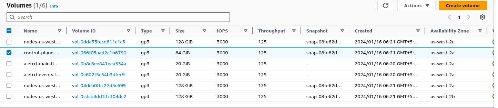
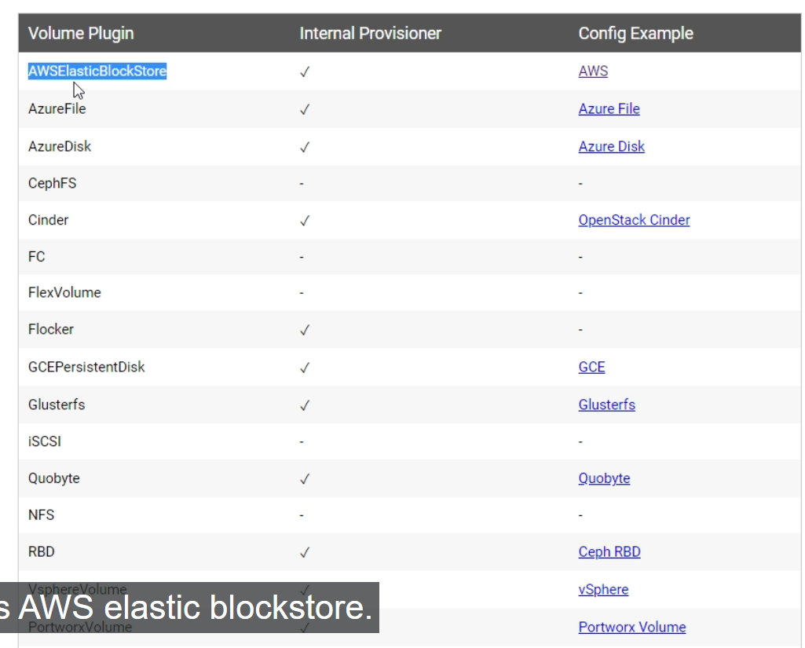
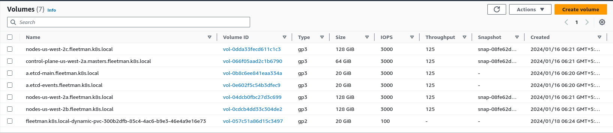

# provisiong SSD Drive with a Storage Class

- **Deploy the Microservices workloads into the kubernetes kops cluster**

- we can validate  that the `kops cluster` been working fine by using the command as `kops validate cluster --name ${NAME}` which should show us the `instance group` as well as the `kubernetes nodes status(masternode and workernode)`

- we can do that using the command as below 

    ```bash
        kops validate cluster --name ${NAME}
        # checking the kops cluster been running fine or not 
        # below should be the output 
        Validating cluster fleetman.k8s.local

        INSTANCE GROUPS
        NAME				ROLE		MACHINETYPE	MIN	MAX	SUBNETS
        control-plane-us-west-2a	ControlPlane	t3.medium	1	1	us-west-2a
        nodes-us-west-2a		Node		t3.medium	1	1	us-west-2a
        nodes-us-west-2b		Node		t3.medium	1	1	us-west-2b
        nodes-us-west-2c		Node		t3.medium	1	1	us-west-2c

        NODE STATUS
        NAME			ROLE		READY
        i-00b3677e4a32d1118	node		True
        i-0c9c51d47569a5864	control-plane	True
        i-0de131b744cc7bd5c	node		True
        i-0f1d204531c714eb4	node		True

        Your cluster fleetman.k8s.local is ready
    
    ```

- if we want to see the `kubernetes object` inside the `default namespace` then we can use the command as below 

    ```bash
        kubectl get all 
        # which will fetch all the kubernetes object in the default namespace
        # then we can get the output in this case as below
        NAME                 TYPE        CLUSTER-IP   EXTERNAL-IP   PORT(S)   AGE
        service/kubernetes   ClusterIP   100.64.0.1   <none>        443/TCP   22h

        # this is the exact same result we can ssee in the minikube local cluster as well in this case 
    
    ```
- now we need to `deploy the workload` into the `kubernetes kops cluster that we have created`

- we have also `4 yaml definition file` in order to `deploy the workloads and services` as below 
  
  - `workloads.yml`
  - `mongo-stack.yml`
  - `storage.yml`
  - `services.yml`

- here the content of the `workloads.yml` file as below which have all the `Deployment workload inf for the microservice system`

    ```yaml
        workloads.yml
        =============
        apiVersion: apps/v1 # as here we are using the Deployment which is inside the apps group we need to use it as apps/v1
        kind: Deployment # defining the kubernetes object as Deployment 
        metadata: # defining the name of the Deployment in here as webapp which will create the replica set which will manage the PODS
            name: webapp 
        spec: # defining the spec for the Deployment in here 
            selector: # defining the selector with the key value pair with the matchLabels
                matchLabels:
                    app: webapp
            replicas: 1 # defining the replicas as 1 as we just need 1 replica set for this 
            template: # defining the POD definition inside the template block in here
                metadata: # defining the metadata for the PODs yml in this case
                    labels: # defining the PODs labels as key value pair
                        app: webapp 
                spec: # defining the spec for the PODS container here
                    containers:
                        - name: webapp # name of cluster being defined
                          image: richardchesterwood/k8s-fleetman-webapp-angular:release2 # images of the cluster being defined
                          env: # defining the environment variable for the POD container here with the name and value pair which will be picked by the container which will help them to fetch the services i.e fleetman-webapp
                            - name: SPRING_PROFILES_ACTIVE # name of the env variable
                              value: production-microservice # name of the value for that env variable
        
        --- # document separator to define another Deployment in the file 

        apiVersion: apps/v1 # as here we are using the Deployment which is inside the apps group we need to use it as apps/v1
        kind: Deployment # defining the kubernetes object as Deployment 
        metadata: # defining the name of the Deployment in here as queueapp which will create the replica set which will manage the PODS
            name: queueapp 
        spec: # defining the spec for the Deployment in here 
            selector: # defining the selector with the key value pair with the matchLabels
                matchLabels:
                    app: queueapp
            replicas: 1 # defining the replicas as 1 as we just need 1 replica set for this 
            template: # defining the POD definition inside the template block in here
                metadata: # defining the metadata for the PODs yml in this case
                    labels: # defining the PODs labels as key value pair
                        app: queueapp 
                spec: # defining the spec for the PODS container here
                    containers:
                        - name: queueapp # name of cluster being defined
                          image: richardchesterwood/k8s-fleetman-queue:release2 # images of the cluster being defined
                          
        --- # document separator to define another Deployment in the file 

        apiVersion: apps/v1 # as here we are using the Deployment which is inside the apps group we need to use it as apps/v1
        kind: Deployment # defining the kubernetes object as Deployment 
        metadata: # defining the name of the Deployment in here as position-tacker which will create the replica set which will manage the PODS
            name: position-tacker 
        spec: # defining the spec for the Deployment in here 
            selector: # defining the selector with the key value pair with the matchLabels
                matchLabels:
                    app: position-tacker
            replicas: 1 # defining the replicas as 1 as we just need 1 replica set for this 
            template: # defining the POD definition inside the template block in here
                metadata: # defining the metadata for the PODs yml in this case
                    labels: # defining the PODs labels as key value pair
                        app: position-tacker 
                spec: # defining the spec for the PODS container here
                    containers:
                        - name: position-tacker # name of cluster being defined
                          image: richardchesterwood/k8s-fleetman-position-tracker:release3 # images of the cluster being defined where it can save the Data into the mongodb rather than the in memory which is defined in release 2 version
                          env: # defining the environment variable for the POD container here with the name and value pair which will be picked by the container which will help them to fetch the services i.e fleetman-webapp
                            - name: SPRING_PROFILES_ACTIVE # name of the env variable
                              value: production-microservice # name of the value for that env variable
    
    
        --- # document separator to define another Deployment in the file 

        apiVersion: apps/v1 # as here we are using the Deployment which is inside the apps group we need to use it as apps/v1
        kind: Deployment # defining the kubernetes object as Deployment 
        metadata: # defining the name of the Deployment in here as position-simulator  which will create the replica set which will manage the PODS
            name: position-simulator 
        spec: # defining the spec for the Deployment in here 
            selector: # defining the selector with the key value pair with the matchLabels
                matchLabels:
                    app: position-simulator 
            replicas: 1 # defining the replicas as 1 as we just need 1 replica set for this 
            template: # defining the POD definition inside the template block in here
                metadata: # defining the metadata for the PODs yml in this case
                    labels: # defining the PODs labels as key value pair
                        app: position-simulator 
                spec: # defining the spec for the PODS container here
                    containers:
                        - name: position-simulator  # name of cluster being defined
                          image: richardchesterwood/k8s-fleetman-position-simulator:release2 # images of the cluster being defined with release2 
                          env: # defining the environment variable for the POD container here with the name and value pair which will be picked by the container which will help them to fetch the services i.e fleetman-webapp
                            - name: SPRING_PROFILES_ACTIVE # name of the env variable
                              value: production-microservice # name of the value for that env variable


        --- # document separator to define another Deployment in the file 

        apiVersion: apps/v1 # as here we are using the Deployment which is inside the apps group we need to use it as apps/v1
        kind: Deployment # defining the kubernetes object as Deployment 
        metadata: # defining the name of the Deployment in here as api-gateway which will create the replica set which will manage the PODS
            name: api-gateway
        spec: # defining the spec for the Deployment in here 
            selector: # defining the selector with the key value pair with the matchLabels
                matchLabels:
                    app: api-gateway
            replicas: 1 # defining the replicas as 1 as we just need 1 replica set for this 
            template: # defining the POD definition inside the template block in here
                metadata: # defining the metadata for the PODs yml in this case
                    labels: # defining the PODs labels as key value pair
                        app: api-gateway
                spec: # defining the spec for the PODS container here
                    containers:
                        - name: api-gateway  # name of cluster being defined
                          image: richardchesterwood/k8s-fleetman-api-gateway:release2 # images of the cluster being defined with release2 
                          env: # defining the environment variable for the POD container here with the name and value pair which will be picked by the container which will help them to fetch the services i.e fleetman-webapp
                            - name: SPRING_PROFILES_ACTIVE # name of the env variable
                              value: production-microservice # name of the value for that env variable
    
    
    
    ```

- similarly for the `mongo-stack.yml` file can be describe as below , where we have the `POD for the mongodb microservice with persistance volume mount onto the hostpath using persistance volume and persitent volume claim` and also the `fleetman-mongodb` kubernetes services in this case 

- we can define the file as below in this case out in here as 

    ```yaml
        mongo-stack.yml
        ================
        apiVersion: apps/v1 # defining the Deployment file for the mongodb which should have the persistent volume hence the apiVersion being  apps/v1
        kind: Deployment # defining the kind of kubernetes object as Deployment in this case
        metadata: # defining the metadata for the Deployment as below 
            name: mongodb # defining the name of the Deployment as mongodb in this case 
        spec: # here we will be using the spec for the Deployment in here 
            selector: #defining the selector for the Deployment to select the POD baed on its label
                matchLabels: 
                    app: mongodb
            replicas: 1 # defining that we need only 1 replicas in this case
            template: # defining the template for the POD in this case
                metadata: # define the metadata for the PODs
                    labels: # PODs label described in here
                        app: mongodb
                spec: # specificiation of the POD described here
                    containers: # definition of the POD container
                        - name: mongodb # name of the container
                          image: mongo:3.6.5-jessie # name of the image for the POD container
                          volumeMount: # folder we want to map from the POD container
                            - name: mongo-persist-data # defining the name of VlumeMount which reference in volumes section 
                              mountPath: /data/db # folder inside the container wewant to map
                    volumes: # volumes will bewhere we want to store the data
                        - name: mongo-persist-data # referencing the VolumeMOunt Name in here as we can define the List of Volumes same as list of VOlumeMounts
                          persistentVolumeClaim: # defining the persistentVolumeClaim which been define din the Storage.yml
                                claimName: mongo-pvc # providing the claimName which been referenced inside the Storage.yml in the PersistentVolumeClaim


        --- # using the document separator as we also define the mongodb kubernetes service as fleetman-mongodb over here
        
        apiVersion: v1 # defining the apiVrsion as v1 in here as Services v1 core belong to the core group
        kind: Service # defining the kind of Kubernetes object is as Service
        metadata: # defining the meta-data for the kubernetes service which must be fleetman-mongodb
            name: fleetman-mongodb
        spec: # defining the spec for the kubernetes service in this case
            selector: # defining the selector for the POD label to associate the POD with Sevice so that stable ip and port will be assigned 
                app: mongodb
            ports: # defining the incoming port we want to allow for the service so that it can access the container exposed port
                - name: mongoport # name of the port being mongoport
                  port: 27017 # allowing port on 27017 from outside
                  targetPort: 27017 # opening the container port 27017
                  protocol: TCP # defining the protocol as TCP in here
            
            type: ClusterIP # defining this  as the ClusterIP hence the services can only be access inside the kubernetes cluster only


    ```

- now we can define the `storage.yml` to define the `persistentVolume and persistentVolumeClaim` for the `mongodb Deployment PODs`

- hence we can define that as below 

    ```yaml
        storage.yaml
        ============
        
        # this answer the question what we want for the volume mounting 
        apiVersion: v1 # as the persistentVolumeClaim belong to core group hence mentioning as v1 version 
        kind: PersistentVolumeClaim # defining the kind of kubernetes object as PersistentVolumeClaim
        metadata: # associating the VolumeClaim we defined in the Deployment over here by providing the same name
            name: mongo-pvc # using the claim Name over here
        spec: # defining the specification for the persistentVolumeClaim
            accessModes: # defining the accessModes as ReadWriteOnce so that a single node POD can read and write the mountPath , but the rest can only Read
                - ReadWriteOnce 
            resources: # requesting for the 20Gi hard Disk for the persistentVolume from kubernetes
                requests: # here we are requesting for the resources to the kubernetes to save these GigaByte place for PersistentVolume
                    storage: 20Gi
            storageClassName: local-setup # defining the StorageClass Name inside the pvc as ocal-setup in order to connect the persistentVolume with persistentVolumeClaim

        --- # using the document separator to define the 

        
        # this will answer how we want to perform or implement the VolumeMapping 
        apiVersion: v1 # as the persistentVolume belong to core group hence mentioning as v1 version 
        kind: PersistentVolume # defining the kind of kubernetes object as PersistentVolume
        metadata: # defining the name of the persistentVolume in here
            name: mongo-local-storage
        spec:
            capacity: # here the capaacity specify How much of the space the persistentVolume have to offer , for local setup it should be >= resource storage but not <
                storage: 20Gi
            hostPath: # defining the Hostpath for the volume mount to the local
                type: DirectoryOrCreate
                path: /mnt/some/new/directory # showing the path in the local sto0rage of the host where we want ot save the data 
            accessModes: # defining the accessModes as ReadWriteOnce so that a single node POD can read and write the mountPath , but the rest can only Read
                - ReadWriteOnce
            storageClassName: local-setup # defining the StorageClass Name inside the pvc as ocal-setup in order to connect the persistentVolume with persistentVolumeClaim

    
    ```

- we can also define the `services.yml` where we will define different type of `kubernetes Sevrices` we want to spin up as a part of the `microservice`

- here we are creating the `Services` for the 
  
  - `webapp`
  - `queuapp`
  - `api-gateway`
  - `position-tracker`

- we don't have the `expose` the `kubernetes services` for the `psoition-simulator` , as this is `standalone Deployment PODs`

- hence we can define the `services.yml` file as below 

    ```yaml
        services.yaml
        ==============
        
        apiVersion: v1 # here the Version of the Service as v1 as it belong to core group
        kind: Services # defining the type of kubernetes object as Service
        metadata: # defining the service name as fleetman-webapp
            name: fleetman-webapp
        spec: # defining the spec for the Service
            selector: # defining the selector which will pick on based upon the POD label
                app: webapp
            ports: # defining the ports to which we want to allow the Service
            - name: http # defining  the name of the ports as http here
              port: 80 # allowing the port as 80  in this case
              protocol: TCP # protocol as tcp in this case
              nodePort: 30080 # with the port 30080 with cluster ip this service can be accessed outside the kubernetes clsuter
            
            type: NodePort # this Service can be accessed outside the cluster
        
        --- 
        
        apiVersion: v1 # here the Version of the Service as v1 as it belong to core group
        kind: Service # defining the type of kubernetes object as Service
        metadata: # defining the service name as fleetman-queue which should be must
            name: fleetman-queue
        spec: # defining the spec for the Service
            selector: # defining the selector which will pick on based upon the POD label
                app: queueapp
            ports: # defining the port definition for the specification 
            - name: admin # here the name of the port can be defined as admin 
              port: 8161 # allowing the port incoming traffic on 8161
              targetPort: 8161 # allowing the port insid ethe container 
              nodePort: 30010 # defining the nodeport 30010 with which we can access the admin console with cluster ip
              protocol: TCP # defining the protocol to be allowed as TCP

            - name: endpoint # defining the name of the port as endpoint
              port: 61616 # this will be used by the endpoint for position-simulator to push the vehicle position and position-tracker to fetch the position from queue
              targetPort: 61616 # allowing the same port from the container here 
              protocol: TCP # defining the protocol to be allowed as TCP
              # here as we have note define the nodePort the clster will define the random nodePort which will be > 30000
            type: NodePort # this Service can be accessed outside the cluster

        ---
        
        apiVersion: v1 # here the Version of the Service as v1 as it belong to core group
        kind: Service # defining the type of kubernetes object as Service
        metadata: # defining the service name as fleetman-api-gateway which should be must
            name: fleetman-api-gateway
        spec: # defining the spec for the Service
            selector: # selector baed on POD label to get associated
                app: api-gateway
            ports:
                - name: gatewayport # name of the port being mentioned in here
                  port: 8080 # allowing the traffic on 8080
                  targetPort: 8080 # allowing the container on port 8080
                  nodePort: 30030 # defining the nodePort service as 30030 to be accessed with cluster iP
                  protocol: TCP # here defining the protocol as TCP in this case

            type: NodePort # definign the ype of Service as NodePort hence can be accessed outside the cluster

        ---

        apiVersion: v1 # here the Version of the Service as v1 as it belong to core group
        kind: Service # defining the type of kubernetes object as Service
        metadata: # defining the service name as fleetman-position-tracker which should be must
            name: fleetman-psotion-tracker # defining the name of the Service as fleetman-position-tracker in this case
        spec: # defining the spec for the Service
            selector: # selector to associate the Service based on POD label
                app: position-tacker
            ports: # defining the incoming ports for the positiontracker so that api-gateway can make the rest call when the particular url been entered 
                - name: rest # here defining the port as rest in this case 
                  port: 8080 # allowing the port 8080 for the rest call by API gateway
                  targetPort: 8080 # allowing the port 8080 from position-tacker container
            type: ClusterIP # defining the type of Sevice as ClusterIp hence can't be accessed outside 

    
    ```

- we can put all these `yaml definition file onto a source code control` and then we can `copy the required definition from the source control` , if we are running using the `bootstrap ec2 Instance`

- here we need to `change the storage.yml`,as the `storage will change dramatically in AWS` , preveiously `we are using the local hostpath outside of the container inside the host system` in order to `mount the volumes` , but we can't perform that `volume moun` ,`when we are in kubernetes kopc cloud cluster` inside a `clustered environment`

- now we can change the `storage` to the `proper hard drive which is hosted by Amazon`

- if we goto `AWS Mgmt console` &rarr; `EC2` &rarr; `Elastic Block Store` &rarr; `Volumes` then we can see that `by default` there were `few volume created by kops while creating cluster`

- `kops` by default create `below volumes for the kubernetes cloud cluster` as with the name `mentioned against the same`
  
  - `128GB volume Hard Drive` for each of the `Worker Node`
  
  - `64GB volume Hard Drive` for the `masternode or control plane`
  
  - `20GB Volume Hard Drive` for the `2 etcd service` which is the `key and value storage`  which the `kops kubernetes cluster been using` 

-  

-  if we want , we can also see the `EC2 instance node (masternode or workernode)` which been associated with the `volume` in the `"Attachment info" where we can see the instance id of the EC2 instance node`

- here we want the `add a new EBS volume` where we will be saving the `mongo-data` which we are preveiously saving on the `local hostpath`

- if we have the `Existing EBS volume` then we can do that using it as below 

    
    ```yaml
        storage.yml
        ===========
        # this answer the question what we want for the volume mounting 
        apiVersion: v1 # as the persistentVolumeClaim belong to core group hence mentioning as v1 version 
        kind: PersistentVolumeClaim # defining the kind of kubernetes object as PersistentVolumeClaim
        metadata: # associating the VolumeClaim we defined in the Deployment over here by providing the same name
            name: mongo-pvc # using the claim Name over here
        spec: # defining the specification for the persistentVolumeClaim
            accessModes: # defining the accessModes as ReadWriteOnce so that a single node POD can read and write the mountPath , but the rest can only Read
                - ReadWriteOnce 
            resources: # requesting for the 20Gi hard Disk for the persistentVolume from kubernetes
                requests: # here we are requesting for the resources to the kubernetes to save these GigaByte place for PersistentVolume
                    storage: 20Gi
            storageClassName: cloud-setup # defining the StorageClass Name inside the pvc as cloud-setup in order to connect the persistentVolume with persistentVolumeClaim

        --- # using the document separator to define the persistentVolume in here 

        apiVersion: v1 # defining the apiVersion as v1 as it belong to the Core Group
        kind: PersistentVolume # here the type of kubernetes object is of PersistentVolume
        metadata: # defining the name of the PersistentVolume as ebs-storage
            name: ebs-storage
        spec:
            accessModes: # here the accessModes is ReadWriteOnce which means only one POD from the same node can perform the read and write operation and rest all inside the same node can perform the read operation but not the write operation
                - ReadWriteOnce
            capacity: # defining the capacity over here as 20Gi that the pv will offer with respect to the Claim
                storage: 20Gi
            # here we can change the hostPath to awsElasticBlockStore in this case 
            # but here we need to create the EBS volume with the specified capacity mentioned from which we can claim 
            # we will have to update the VolumeID manually 
            awsElasticBlockStore: # here the type of persistentVolume we will be using is of awsElasticBlockStore
                volumeID: <EBS_VOLUME_ID> # defining the volumeID in here 
                fsType: ext4  # Adjust the filesystem type if necessary which can be ext4,xfs,ntfs for awsElasticVolume but by default the choose the default underlying filesystem type of storage
            storageClassName: cloud-setup # defining the StorageClass Name inside the pvc as cloud-setup in order to connect the persistentVolume with persistentVolumeClaim


    
    ```

- but `there is better way` available rather than the `updating the info manually after creating the EBS volume by our own`

- the `better way` is to `replace the existing PersistentVolume document yaml configuration` into `StorageClass document yaml configuration`

- we can see the `docs` for the `StorageClass` with the link as [StorageClass Docs](https://kubernetes.io/docs/concepts/storage/storage-classes/)

- A `StorageClass` helps in `create a storage` , which will going to `created dynamically whenever it is required`

- if we go through the `StorageClass Docs` then we can see a section as `Provisiner` where `different type of storageClass for different cloud been used`

- 

- if we click on the `AWSELasticBlockStore` then we will be redirected to [AWSELasticBlockStore Storage Class](https://kubernetes.io/docs/concepts/storage/storage-classes/#aws-ebs)

- this `provisioner` will be used while we are creating the `definition for the StorageClass file`

-  we can define the `StorageClass definition yaml` as below 

    
    ```yaml
        kind: StorageClass # definining the type of kubernetes object is of StorageClass
        apiVersion: storage.k8s.io/v1
        # defining the apiVersion as storage.k8s.io/v1 which is the plugin for the kubernetes hence we can see that weird apiVersion in here 
        # here the apiVersion is little complecated becuase its a plugin to kubernetes 
        metadata: # defining the name for the StorageClass in the metadata section 
            name: slow
        provisioner: kubernetes.io/aws-ebs
        # defining the provisioner defined by the plugin apiVersion that we are using 
        parameters: # the parameters define what type of Storage Volume we want to use and what zones we will be using it in 
            type: io1 # the type of EBS Storage volume we want to use in this case
            # we can dife multiple type of Storage Volume that we want to use
            # we can refer the page as below for this (https://docs.aws.amazon.com/AWSEC2/latest/UserGuide/ebs-volume-types.html)
            # that can be as below
                # - gp2/gp3 :- which is for general purpose SSD storage drive which provide reasible speed for reasonable price for SSD Drive (the default value being gp2)
                # - io1:- which is used for High Performming SSD Storage  
                # - st1/sc1 :- which being Hard Drive HDD or mechanical Disk Drive which we can obtain in lower price but speed is less
                    # - st1 : is a regular Hard Drive HDD
                    # - sc1 :- cold HDD which means only when accessed the Hard Drive will spin up and provide the volume which means speed will be less
            
            # the we can define dedicated AZ zone for the volume against zone or multiple zones against the zones parameter
            # if we leave it empty then it will going to choose the AZ zones in the region in round robin fashion
            zones: us-west-2a , us-west-2b
            iopsPerGB: "10"
            # here the iopsPerGB only applicable if we are selecting the  type as io1
            # here the metadata name of the Storage class is slow because , here even though we are using the High Performing SSD Drive but has low iops Consumption hence its name been given as slow
            # we can link the name of the StorageClass in PersistentVolumeClaim inside the StorageClassName in order to link the StorageClass to PersistentVolumeClaim
    
    ```

- hence for the `storage-aws.yml` we can define that as below with both `StorageClass` and `PersistentVolumeClaim`

    ```yaml
        storage-aws.yml
        ===============
        apiVersion: v1 # defining the apiVersion as v1 for the PersistentVolumeClaim
        kind: PersistentVolumeClaim # defining the type of kubernetes object is of PersistentVolumeClaim
        metadata: # defining the name for the PersistentVolumeClaim
            name: mongo-pvc
        spec: # defining the specification for the PersistentVolumeClaim
            accessModes: # defining the accessModes as ReadWriteOnce which means one Single POD in  same node has access to read write operation but rest all POD in the same node have the Read Access
                - ReadWriteOnce
            resources: # here we are requestring for the resource which will claim 20GB of storage for the PersistentVolume
                requests:
                    storage: 20Gi
            storageClassName: cloud-ssd # associating the StorageClass to the PersistentVolumeClaim using the storageClassName

        ---

        apiVersion: storage.k8s.io/v1 # as here we are using the plugin in hence defining the plugin for the StorageClass
        kind: StorageClass # defining the type of kubernetes object as StorageClass
        metadata: # defining the name for the StorageClass as cloud-ssd which should be linked to the PersistentVolumeClaim StorageClassName
            name: cloud-ssd
        provisioner: kubernetes.io/aws-ebs # defining the provisioner based define in the apiVersionPlugin here
        parameters: # defining the parameter in here with the required type and zones
            type: gp2 # here defining ther Storage Volume Type as gp2 which is the default one
            # here the zone or zones has not been defined hence it will consider the AZ zone in round robin fashion from the region 
            # while creating the StorageClass we don't have to specify the capacity and How much PersistentVolume will be allocated as this will be dynamically allocated based on  the PersistentVolumeClaim claim 

    ```

- now we can `deploy these changes to the kops kubernetes cluster` by using the command as below

    ```bash
        kubectl apply -f storage-aws.yml
        # deploying the changes to the kops kubernetes cluster on default namespace as below 
        # hecen we can see the output as below 
        persistentvolumeclaim/mongo-pvc created
        storageclass.storage.k8s.io/cloud-ssd created
    
    ```

- The `StorageClass` will be converted into the `PersitentVolume` on the run time while deploying the changes

  The `StorageClass` will create `PersitentVolume` with `dynamic name` and the `Size of the PersistentVolume` will be same what we claim in `PersistentVolumeClaim`

- we can run the below command to see the `PersistentVolume which got dynamically bcreated by StorageClass `and `PersistentVolumeClaim`

    ```bash
        kubectl get pvc
        # fetching the PersistentVolumeClaim in the default name space in kops kubernetes cluster as below 
        # we can see the below output in this case out in here
        # we can observe that  VOLUME been associated with it which got dynmically denerated
        # we can see the Status as Bound that means PersistentVolumeClaim ready to be used
        NAME        STATUS   VOLUME                                     CAPACITY   ACCESS MODES   STORAGECLASS   AGE
        mongo-pvc   Bound    pvc-300b2dfb-85c4-4ac6-b9e3-46e4a9e16e73   20Gi       RWO            cloud-ssd      13m

        # similarly we can see the same for the PersistentVolume as below
        # fetching the PersistentVolume which gt dymamically created by the Storage Class
        # here the CAPACITY of the PersistentVolume being as 20Gigabyte that we have defined in the PersitentVolumeClaim
        # here also the Status of dynamic PersistentVolume is of Bound status
        kubectl get pv
        # below will be the output in this case for PersistentVolume
        NAME                                       CAPACITY   ACCESS MODES   RECLAIM POLICY   STATUS   CLAIM               STORAGECLASS   REASON   AGE
        pvc-300b2dfb-85c4-4ac6-b9e3-46e4a9e16e73   20Gi       RWO            Delete           Bound    default/mongo-pvc   cloud-ssd               15m

    ```

- but while getting the `PersitentVolume` using the command as `kubectl get pv` we can see the `RECLAIM POLICY` been set to `Delete` which is the `default value`

- this is because if we delete the `PersistentVolumeClaim i.e pvc` by deleteing the `cluster` then what will happen to the `PersitentVolume that we stored to EBS`

- by default  if we delete the `PersistentVolumeClaim i.e pvc` by deleteing the `cluster` , the `PersitentVolume Storage that we stored to EBS` will also be deleted 

- which will be good for us because `if we want to delete the cluster and  corresponding pvc` the `Volume will be removed automatically` , so there will be `no volume dangling around` , but if we make the  `RECLAIM POLICY` as `Retain` then even though the  `kops cluster deleted the PersitentVolume will have all the Data Required ` , which will help in `archieve the info` , but we need to delete the `volume manually if we want` after the `deleting the kops cluster`


- now if we go to `AWS Mgmt console` &rarr; `EC2` &rarr; `Elastic Block Store` &rarr; `Volumes` , Then we can see that a `New Volume being created` with the name as `<gossip-cluster-name>-dynamic-<name of PersistentVolume>`

- we can see the `EBS volume currently in available status` as there are no `instance attached to it` and we can see the `Attachment info for the volume being empty`

- Also here for the `EBS Volume that got created ` we can see the `Storage Volume is of 20GB` that is what we claimed 

-  