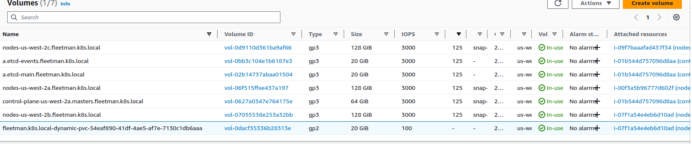
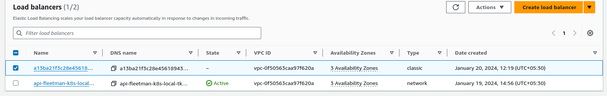
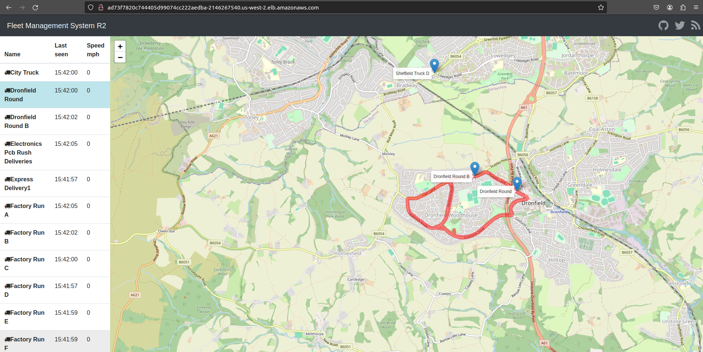

# Deploying the Fleetman Microservice workload into kops kubernetes cluster

- here we need to validate that `storage.yml` file works , we can do that by bringing the `mongo-stack.yml` file in this case

- here we are saying the `data inside the /data/db folder` inside the `mongodb container` need to mapped to the `volumeMount` as `mongo-persist-data` , which also been `referenced/mapped ` in the `volume section` will be `point to utilized `in the `persistentVolumeClaim` and `StorageClass` that we have defined 

- we can define the `mongo-stack.yml` file as below 

    
    ```yaml
        mongo-stack.yml
        ================
        apiVersion: apps/v1 # defining the apiVersios as apps/v1 as the Deployment belong to apps group
        kind: Deployment # defining the type of kubernetes object we will be using for this 
        metadata: # defining the name as mongodb in this case
            name: mongodb
        spec: # defining the specification for the Deployment  over here
            selector: # selector which will select the POD based on their label as key:value pair
                matchLabels:
                    app: mongodb 
            replicas: 1 # defining that we need to create 1 replica set for the Deployment which will manage the PODS restart when it get failed
            template: # defining the template for the PODs to be get created in here
                metadata: # metadata such as name, namespace and labels with key value pair can be described over here
                    labels:
                        app: mongodb
                spec: # specification for the POD been described in here
                    container: # defining the container used inside the POD
                        - name: mongodb # name of the container is mongodb
                          image: mongo:3.6.5-jessie # image used for the POD defined here
                          volumeMount: # defining the volumeMount which will display info about the container Data
                            - name: mongo-persiste-data # name of the container volume that we want to mape provided here
                              mountPath: /data/db # which folder inside the POID container we want to map to outer storage
                    volumes: # defining thew volumes where  we want to save the storage
                        - name: mongo-persiste-data # referencing the volumes where the mapped container volume need to be stored
                          persistentVolumeClaim: # defining the persistentVolumeClaim which will be define whatr resources and storage required for the Volume Mount
                            claimName: mongo-pvc # here defining  the claimName which will be defined in the storage.yml as persistentVolumeClaim name
        
        --- # now we can define the mongodb service as well with the document separator

        apiVersion: v1 # defining the apiVersion as v1 whicdh will be used for the service as service belong to the core group hence mentioned as v1
        kind: Service # here the type of kyubernetes object we will be using is of Service type
        metadata: # defining the name for themongodb service as fleetman-mongodb which will also be used in the position-tracker in order to save the info
            name: fleetman-mongodb 
        spec: # defining the services specification in this case 
            selector: # defining the different selector for Service which will help in fetching the pOD in here 
                app: mongodb
            ports: # defining the ports over here with protocol as TCP
                - name: mongoport # here the name of the port is of mongoport in here
                  port: 27017 # here the port is of 27017
                  protocol: TCP # defining the protocol we will be using is of TCP only
            
            type: ClusterIP # defining the type as the ClusterIP so that  this service can opnly be applied inside the kops kubernetes cluster

    ```

- now we can `deploy the changes to the kops kubernetes cluster` by `applying the changes` as below 

    ```bash
        kubectl apply -f mongo-stack.yml
        # deploying the changes to the kubernetes cluster by applying the changes as below 
        deployment.apps/mongodb created
        service/fleetman-mongodb created
    
    ```

- now we can check the `volume mount` for the `mongodb POD` happended successfully or not by using the `kubectl describe command as below`

- if there were any problem with linking the `mongodb POD` to the `persitentVolume that we created using the storageClass` we can see those info in here 

- hence we can use this command as below 

    ```bash
        kubectl get all 
        
        # fetching all the kubernetes object inside the default namespace inside the kops cluster as below 
        
        NAME                           READY   STATUS    RESTARTS   AGE
        pod/mongodb-578b98fbd4-ccz9t   1/1     Running   0          8m40s
                                                CLUSTER-IP       EXTERNAL-IP   PORT(S)     AGE
        service/fleetman-mongodb   ClusterIP   100.67.231.181   <none>        27017/TCP   9m25s
        service/kubernetes         ClusterIP   100.64.0.1       <none>        443/TCP     20h

        NAME                      READY   UP-TO-DATE   AVAILABLE   AGE
        deployment.apps/mongodb   1/1     1            1           8m41s

        NAME                                 DESIRED   CURRENT   READY   AGE
        replicaset.apps/mongodb-578b98fbd4   1         1         1       8m42s
 
    
        # now we can see that mongodb-pod been running fine for which actually we can see the volume mount happended successfully or not by using the describe command 
        kubectl describe pod/mongodb-578b98fbd4-ccz9t
        # we can see the below output in that case 
        Name:             mongodb-578b98fbd4-ccz9t
        Namespace:        default
        Priority:         0
        Service Account:  default
        Node:             i-07f1a54e4eb6d10ad/172.20.69.188
        Start Time:       Sat, 20 Jan 2024 10:52:38 +0530
        Labels:           app=mongodb
                        pod-template-hash=578b98fbd4
        Annotations:      kubernetes.io/limit-ranger: LimitRanger plugin set: cpu request for container mongodb
        Status:           Running
        IP:               100.96.1.251
        IPs:
        IP:           100.96.1.251
        Controlled By:  ReplicaSet/mongodb-578b98fbd4
        Containers:
        mongodb:
            Container ID:   containerd://352c619e69fa28f2aebcf623f88e8dba49f66c501316da710d5d795ce53c8f61
            Image:          mongo:3.6.5-jessie
            Image ID:       docker.io/library/mongo@sha256:3e00936a4fbd17003cfd33ca808f03ada736134774bfbc3069d3757905a4a326
            Port:           <none>
            Host Port:      <none>
            State:          Running
            Started:      Sat, 20 Jan 2024 10:52:50 +0530
            Ready:          True
            Restart Count:  0
            Requests:
            cpu:        100m
            Environment:  <none>
            Mounts:
            /data/db from mongo-persiste-data (rw)
            /var/run/secrets/kubernetes.io/serviceaccount from kube-api-access-pv6c8 (ro)
        Conditions:
        Type              Status
        Initialized       True 
        Ready             True 
        ContainersReady   True 
        PodScheduled      True 
        Volumes:
        mongo-persiste-data:
            Type:       PersistentVolumeClaim (a reference to a PersistentVolumeClaim in the same namespace)
            ClaimName:  mongo-pvc # here we can see the ClaimName as mongo-pvc in this case out in here
            ReadOnly:   false
        kube-api-access-pv6c8:
            Type:                    Projected (a volume that contains injected data from multiple sources)
            TokenExpirationSeconds:  3607
            ConfigMapName:           kube-root-ca.crt
            ConfigMapOptional:       <nil>
            DownwardAPI:             true
        QoS Class:                   Burstable
        Node-Selectors:              <none>
        Tolerations:                 node.kubernetes.io/not-ready:NoExecute op=Exists for 300s
                                    node.kubernetes.io/unreachable:NoExecute op=Exists for 300s
        Events:
        Type    Reason                  Age   From                     Message
        ----    ------                  ----  ----                     -------
        Normal  Scheduled               11m   default-scheduler        Successfully assigned default/mongodb-578b98fbd4-ccz9t to i-07f1a54e4eb6d10ad # mongopod associated with i-07f1a54e4eb6d10ad instance
        Normal  SuccessfulAttachVolume  11m   attachdetach-controller  AttachVolume.Attach succeeded for volume "pvc-54eaf890-41df-4ae5-af7e-7130c1db6aaa" # here its saying that volume        attachment was successful in this case
        Normal  Pulling                 11m   kubelet                  Pulling image "mongo:3.6.5-jessie"
        Normal  Pulled                  11m   kubelet                  Successfully pulled image "mongo:3.6.5-jessie" in 7.353s (7.353s including waiting)
        Normal  Created                 11m   kubelet                  Created container mongodb
        Normal  Started                 11m   kubelet                  Started container mongodb

    ```

- we can also checkout the `logs of the mongoDB POD` to see where it connected to then we can use it as below 

    ```bash
        kubectl logs -f pod/mongodb-578b98fbd4-ccz9t
        # defining the logs for the POD as below pod/mongodb-578b98fbd4-ccz9t
        # here we can see the -f with logs command means follow
        # this will provide below output in this case 
        2024-01-20T05:22:50.214+0000 I CONTROL  [initandlisten] MongoDB starting : pid=1 port=27017 dbpath=/data/db 64-bit host=mongodb-578b98fbd4-ccz9t
        2024-01-20T05:22:50.214+0000 I CONTROL  [initandlisten] db version v3.6.5
        2024-01-20T05:22:50.214+0000 I CONTROL  [initandlisten] git version: a20ecd3e3a174162052ff99913bc2ca9a839d618
        2024-01-20T05:22:50.214+0000 I CONTROL  [initandlisten] OpenSSL version: OpenSSL 1.0.1t  3 May 2016
        2024-01-20T05:22:50.214+0000 I CONTROL  [initandlisten] allocator: tcmalloc
        2024-01-20T05:22:50.214+0000 I CONTROL  [initandlisten] modules: none
        2024-01-20T05:22:50.214+0000 I CONTROL  [initandlisten] build environment:
        2024-01-20T05:22:50.214+0000 I CONTROL  [initandlisten]     distmod: debian81
        2024-01-20T05:22:50.214+0000 I CONTROL  [initandlisten]     distarch: x86_64
        2024-01-20T05:22:50.214+0000 I CONTROL  [initandlisten]     target_arch: x86_64
        2024-01-20T05:22:50.214+0000 I CONTROL  [initandlisten] options: { net: { bindIpAll: true } }
        2024-01-20T05:22:50.215+0000 I STORAGE  [initandlisten] 
        2024-01-20T05:22:50.215+0000 I STORAGE  [initandlisten] ** WARNING: Using the XFS filesystem is strongly recommended with the WiredTiger storage engine
        2024-01-20T05:22:50.215+0000 I STORAGE  [initandlisten] **          See http://dochub.mongodb.org/core/prodnotes-filesystem
        2024-01-20T05:22:50.215+0000 I STORAGE  [initandlisten] wiredtiger_open config: create,cache_size=1411M,session_max=20000,eviction=(threads_min=4,threads_max=4),config_base=false,statistics=(fast),cache_cursors=false,log=(enabled=true,archive=true,path=journal,compressor=snappy),file_manager=(close_idle_time=100000),statistics_log=(wait=0),verbose=(recovery_progress),
        2024-01-20T05:22:50.835+0000 I STORAGE  [initandlisten] WiredTiger message [1705728170:835289][1:0x7f1480ca1a00], txn-recover: Set global recovery timestamp: 0
        2024-01-20T05:22:50.864+0000 I CONTROL  [initandlisten] 
        2024-01-20T05:22:50.864+0000 I CONTROL  [initandlisten] ** WARNING: Access control is not enabled for the database.
        2024-01-20T05:22:50.864+0000 I CONTROL  [initandlisten] **          Read and write access to data and configuration is unrestricted.
        2024-01-20T05:22:50.864+0000 I CONTROL  [initandlisten] 
        2024-01-20T05:22:50.865+0000 I STORAGE  [initandlisten] createCollection: admin.system.version with provided UUID: c434225d-8493-483e-8818-c7ffce1712c3
        2024-01-20T05:22:50.878+0000 I COMMAND  [initandlisten] setting featureCompatibilityVersion to 3.6
        2024-01-20T05:22:50.881+0000 I STORAGE  [initandlisten] createCollection: local.startup_log with generated UUID: 0f642fc8-7938-4008-ab34-0d1516dbe4b7
        2024-01-20T05:22:50.898+0000 I FTDC     [initandlisten] Initializing full-time diagnostic data capture with directory '/data/db/diagnostic.data'
        2024-01-20T05:22:50.899+0000 I NETWORK  [initandlisten] waiting for connections on port 27017
                                                                # here we can see that its been wauiting on the port 27017 to connect to , to which the position tracker-should connect
        2024-01-20T05:27:50.899+0000 I STORAGE  [thread1] createCollection: config.system.sessions with generated UUID: 1bda8e17-23ff-41e3-ac0a-e92ba6790ec9
        2024-01-20T05:27:50.915+0000 I INDEX    [thread1] build index on: config.system.sessions properties: { v: 2, key: { lastUse: 1 }, name: "lsidTTLIndex", ns: "config.system.sessions", expireAfterSeconds: 1800 }
        2024-01-20T05:27:50.915+0000 I INDEX    [thread1] 	 building index using bulk method; build may temporarily use up to 500 megabytes of RAM
        2024-01-20T05:27:50.916+0000 I INDEX    [thread1] build index done.  scanned 0 total records. 0 secs


    ```

- now if we goto the `AWS Mgmt console` &rarr; `EC2` &rarr; `Elastic Block Store` &rarr; `volumes` then we can see that `the volume that we have created with the storageClass` are now in `in-use` status and associated with the `instance id where the mongo-POD been` running 

- 
   
- now we can deploy the `workloads.yml` file to the `kops cluster` as well by making the below changes

    ```yaml
        workload.yaml
        ==============
        apiVersion: apps/v1 # as here we are using the Deployment which is inside the apps group we need to use it as apps/v1
        kind: Deployment # defining the kubernetes object as Deployment 
        metadata: # defining the name of the Deployment in here as webapp which will create the replica set which will manage the PODS
            name: webapp 
        spec: # defining the spec for the Deployment in here 
            selector: # defining the selector with the key value pair with the matchLabels
                matchLabels:
                    app: webapp
            replicas: 1 # defining the replicas as 1 as we just need 1 replica set for this 
            template: # defining the POD definition inside the template block in here
                metadata: # defining the metadata for the PODs yml in this case
                    labels: # defining the PODs labels as key value pair
                        app: webapp 
                spec: # defining the spec for the PODS container here
                    containers:
                        - name: webapp # name of cluster being defined
                          image: richardchesterwood/k8s-fleetman-webapp-angular:release2 # images of the cluster being defined
                          env: # defining the environment variable for the POD container here with the name and value pair which will be picked by the container which will help them to fetch the services i.e fleetman-webapp
                            - name: SPRING_PROFILES_ACTIVE # name of the env variable
                              value: production-microservice # name of the value for that env variable
        
        --- # document separator to define another Deployment in the file 

        apiVersion: apps/v1 # as here we are using the Deployment which is inside the apps group we need to use it as apps/v1
        kind: Deployment # defining the kubernetes object as Deployment 
        metadata: # defining the name of the Deployment in here as queueapp which will create the replica set which will manage the PODS
            name: queueapp 
        spec: # defining the spec for the Deployment in here 
            selector: # defining the selector with the key value pair with the matchLabels
                matchLabels:
                    app: queueapp
            replicas: 1 # defining the replicas as 1 as we just need 1 replica set for this 
            template: # defining the POD definition inside the template block in here
                metadata: # defining the metadata for the PODs yml in this case
                    labels: # defining the PODs labels as key value pair
                        app: queueapp 
                spec: # defining the spec for the PODS container here
                    containers:
                        - name: queueapp # name of cluster being defined
                          image: richardchesterwood/k8s-fleetman-queue:release2 # images of the cluster being defined
                          
        --- # document separator to define another Deployment in the file 

        apiVersion: apps/v1 # as here we are using the Deployment which is inside the apps group we need to use it as apps/v1
        kind: Deployment # defining the kubernetes object as Deployment 
        metadata: # defining the name of the Deployment in here as position-tacker which will create the replica set which will manage the PODS
            name: position-tacker 
        spec: # defining the spec for the Deployment in here 
            selector: # defining the selector with the key value pair with the matchLabels
                matchLabels:
                    app: position-tacker
            replicas: 1 # defining the replicas as 1 as we just need 1 replica set for this 
            template: # defining the POD definition inside the template block in here
                metadata: # defining the metadata for the PODs yml in this case
                    labels: # defining the PODs labels as key value pair
                        app: position-tacker 
                spec: # defining the spec for the PODS container here
                    containers:
                        - name: position-tacker # name of cluster being defined
                          image: richardchesterwood/k8s-fleetman-position-tracker:release3 # images of the cluster being defined where it can save the Data into the mongodb rather than the in memory which is defined in release 2 version
                          env: # defining the environment variable for the POD container here with the name and value pair which will be picked by the container which will help them to fetch the services i.e fleetman-webapp
                            - name: SPRING_PROFILES_ACTIVE # name of the env variable
                              value: production-microservice # name of the value for that env variable
    
    
        --- # document separator to define another Deployment in the file 

        apiVersion: apps/v1 # as here we are using the Deployment which is inside the apps group we need to use it as apps/v1
        kind: Deployment # defining the kubernetes object as Deployment 
        metadata: # defining the name of the Deployment in here as position-simulator  which will create the replica set which will manage the PODS
            name: position-simulator 
        spec: # defining the spec for the Deployment in here 
            selector: # defining the selector with the key value pair with the matchLabels
                matchLabels:
                    app: position-simulator 
            replicas: 1 # defining the replicas as 1 as we just need 1 replica set for this 
            template: # defining the POD definition inside the template block in here
                metadata: # defining the metadata for the PODs yml in this case
                    labels: # defining the PODs labels as key value pair
                        app: position-simulator 
                spec: # defining the spec for the PODS container here
                    containers:
                        - name: position-simulator  # name of cluster being defined
                          image: richardchesterwood/k8s-fleetman-position-simulator:release2 # images of the cluster being defined with release2 
                          env: # defining the environment variable for the POD container here with the name and value pair which will be picked by the container which will help them to fetch the services i.e fleetman-webapp
                            - name: SPRING_PROFILES_ACTIVE # name of the env variable
                              value: production-microservice # name of the value for that env variable


        --- # document separator to define another Deployment in the file 

        apiVersion: apps/v1 # as here we are using the Deployment which is inside the apps group we need to use it as apps/v1
        kind: Deployment # defining the kubernetes object as Deployment 
        metadata: # defining the name of the Deployment in here as api-gateway which will create the replica set which will manage the PODS
            name: api-gateway
        spec: # defining the spec for the Deployment in here 
            selector: # defining the selector with the key value pair with the matchLabels
                matchLabels:
                    app: api-gateway
            replicas: 1 # defining the replicas as 1 as we just need 1 replica set for this 
            template: # defining the POD definition inside the template block in here
                metadata: # defining the metadata for the PODs yml in this case
                    labels: # defining the PODs labels as key value pair
                        app: api-gateway
                spec: # defining the spec for the PODS container here
                    containers:
                        - name: api-gateway  # name of cluster being defined
                          image: richardchesterwood/k8s-fleetman-api-gateway:release2 # images of the cluster being defined with release2 
                          env: # defining the environment variable for the POD container here with the name and value pair which will be picked by the container which will help them to fetch the services i.e fleetman-webapp
                            - name: SPRING_PROFILES_ACTIVE # name of the env variable
                              value: production-microservice # name of the value for that env variable
    
    
    ```

- we will be having a `look at the number of replicas` in a bit , currently the `number of replicas for the POD` being as `1` in this case

- we can also bring in the `services.yml` file , instead of the `NodePort` we can use here the `LoadBalancer` or `ClusterIP`

- we can make those changes as below 

    ```yaml
        services.yml
        =============
        apiVersion: v1 # here th apiVersion for the Services is v1 as it belong to the core group
        kind: Service # defining the type of kubernetes object as Service
        metadata: # here the name of the Service we want to use is of fleetman-webapp
            name: fleetman-webapp
        spec: # definign the specification for the selector which will pick the POD label
            selector: # defining the selector as app:webapp in this case 
                app: webapp 
            ports: # defining the port definition over here
                - name: http # name of the port used in here as http
                  port: 80 # defining the port to be allowed is 80 also inside the continer is also of 80
                  protocol: TCP # defining the protocol as TCP in this case
            
            type: LoadBalancer # here defining the type of Service we will be using is of LoadBalancer as we are now woreking with the cloud cluster
            
            # important :-
            # preveiously we are using the Service as nodePort service type which been making the nodePort in the range of 30000
            # but the nodePort is for the local development and Testing
            # on the production environment we don't want to use the port 30080 rather we want the port to be 80(which is the normal default)
            # as here we are using the kops cloud kubernetes cluster then we can use the LoadBalancer which we can't use when we are using the minikube development
            # here when we mentioned as Loadbalancer then kops wilol going to create/provisioned and configured another load balancer
            # that LoadBalancer will going to disribute the load accross all the PODs with label as app: webapp running inside any Node
    
        ---

        apiVersion: v1 # here th apiVersion for the Services is v1 as it belong to the core group
        kind: Service # defining the type of kubernetes object as Service
        metadata: # here the name of the Service we want to use is of fleetman-queue
            name: fleetman-queue
        spec: # definign the specification for the selector which will pick the POD label
            selector: # defining the selector as app:queuapp in this case which will help in select based on POD label
                app: queueapp 
            ports: # defining the port definition over here
                - name: admin # name of the port used in here as admin console
                  port: 8161 # defining the port to be allowed is 8161 also inside the continer is also of 8161
                  protocol: TCP # defining the protocol as TCP in this case
                
                - name: endpoint # here the name  of the saervice being used as endpoint
                  port: 61616 # defining the port to be allowed is 61616 also inside the continer is also of 61616
                  protocol: TCP # defining the protocol as TCP in this case
            
            type: ClusterIP # defining the type as ClusterIP as we will be using it only inside the kops kubernetes cluster
            
        ---

        apiVersion: v1 # here th apiVersion for the Services is v1 as it belong to the core group
        kind: Service # defining the type of kubernetes object as Service
        metadata: # here the name of the Service we want to use is of fleetman-api-gateway
            name: fleetman-api-gateway
        spec: # definign the specification for the selector which will pick the POD label
            selector: # defining the selector as app: api-gateway in this case which will be taken from the POD
                app: api-gateway 
            ports: # defining the port definition over here
                - name: rest # name of the port used in here as rest services to the position tracker
                  port: 8080 # defining the port to be allowed is 8080 also inside the continer is also of 808
                  protocol: TCP # defining the protocol as TCP in this case
            
            type: ClusterIP # defining the type as ClusterIP as we will be using it only inside the kops kubernetes cluster
        

        ---

        apiVersion: v1 # here th apiVersion for the Services is v1 as it belong to the core group
        kind: Service # defining the type of kubernetes object as Service
        metadata: # here the name of the Service we want to use is of fleetman-psotion-tracker
            name: fleetman-psotion-tracker
        spec: # definign the specification for the selector which will pick the POD label
            selector: # defining the selector as app: position-tracker in this case which will be taken from the POD
                app: position-tracker
            ports: # defining the port definition over here
                - name: tracker # name of the port used in here for the tracker
                  port: 8080 # defining the port to be allowed is 8080 also inside the continer is also of 808
                  protocol: TCP # defining the protocol as TCP in this case
            
            type: ClusterIP # defining the type as ClusterIP as we will be using it only inside the kops kubernetes cluster
        
    
    ```

- now we can deploy the `workloads.yml` and `services.yml` onto the `kubernetes k8 cluster` by `applying the changes` as below 

    ```bash
        # we can apply chantges to all the yml file i.e services.yml and workloads.yml as blow 
        kubectl apply -f .
        # applying the changes over here 
        deployment.apps/mongodb unchanged
        service/fleetman-mongodb unchanged
        service/fleetman-webapp created
        service/fleetman-queue created
        service/fleetman-api-gateway created
        service/fleetman-psotion-tracker created
        persistentvolumeclaim/mongo-pvc unchanged
        storageclass.storage.k8s.io/cloud-ssd unchanged
        deployment.apps/webapp created
        deployment.apps/queueapp created
        deployment.apps/position-tacker created
        deployment.apps/position-simulator created
        deployment.apps/api-gateway created

        # here we can see all the kubernetes object in the default namespace in the kops kubernetes cluster as below 
        kubectl get all
        # fetching all the kubernetes object inside the default namespace of kops kubernetes cluster 
        NAME                                      READY   STATUS    RESTARTS   AGE
        pod/api-gateway-56c46fbcdb-85v2b          1/1     Running   0          140m
        pod/mongodb-578b98fbd4-7vrr6              1/1     Running   0          140m
        pod/position-simulator-5fdb4ddbd5-82n2d   1/1     Running   0          140m
        pod/position-tracker-59fdfd8cf4-t8j44     1/1     Running   0          140m
        pod/queueapp-f55dcb97d-nf55x              1/1     Running   0          140mpod/webapp-66765b68df-qplvz               1/1     Running   0          140m

        NAME                                TYPE           CLUSTER-IP       EXTERNAL-IP                                                               PORT(S)              AGE
        service/fleetman-api-gateway        ClusterIP      100.68.211.100   <none>                                                                    8080/TCP             140m
        service/fleetman-mongodb            ClusterIP      100.67.56.12     <none>                                                                    27017/TCP            140m
        service/fleetman-position-tracker   ClusterIP      100.71.229.157   <none>                                                                    8080/TCP             140m
        service/fleetman-queue              ClusterIP      100.70.69.242    <none>                                                                    8161/TCP,61616/TCP   140m
        service/fleetman-webapp             LoadBalancer   100.65.80.217    ad73f7820c744405d99074cc222aedba-2146267540.us-west-2.elb.amazonaws.com   80:30101/TCP         140m
        service/kubernetes                  ClusterIP      100.64.0.1       <none>                                                                    443/TCP              24h

        NAME                                 READY   UP-TO-DATE   AVAILABLE   AGE
        deployment.apps/api-gateway          1/1     1            1           140m
        deployment.apps/mongodb              1/1     1            1           140m
        deployment.apps/position-simulator   1/1     1            1           140m
        deployment.apps/position-tracker     1/1     1            1           140m
        deployment.apps/queueapp             1/1     1            1           140m
        deployment.apps/webapp               1/1     1            1           140m

        NAME                                            DESIRED   CURRENT   READY   AGE
        replicaset.apps/api-gateway-56c46fbcdb          1         1         1       140m
        replicaset.apps/mongodb-578b98fbd4              1         1         1       140m
        replicaset.apps/position-simulator-5fdb4ddbd5   1         1         1       140m
        replicaset.apps/position-tracker-59fdfd8cf4     1         1         1       140m
        replicaset.apps/queueapp-f55dcb97d              1         1         1       140m
        replicaset.apps/webapp-66765b68df               1         1         1       140m


    ```

- once all the PODs been `up and running` then here we can see the `logs` of `position-tracker` to validate everythign working fine or not 

- we can do that by using the command as below 

    ```bash
        kubectl describe position-tracker-59fdfd8cf4-t8j44
        # checking the cobntent of POD while getting created 
        # below will be the logs which will be going to get created with it 
        Name:             position-tracker-59fdfd8cf4-t8j44
        Namespace:        default
        Priority:         0
        Service Account:  default
        Node:             i-09f7baaafad437f34/172.20.173.148
        Start Time:       Sat, 20 Jan 2024 12:54:17 +0530
        Labels:           app=position-tracker
                        pod-template-hash=59fdfd8cf4
        Annotations:      kubernetes.io/limit-ranger: LimitRanger plugin set: cpu request for container position-tracker
        Status:           Running
        IP:               100.96.2.149
        IPs:
        IP:           100.96.2.149
        Controlled By:  ReplicaSet/position-tracker-59fdfd8cf4
        Containers:
        position-tracker:
            Container ID:   containerd://cbc2950760811ee491a5c2a8da65e76056080a185f32bdac9b1c07967034defb
            Image:          richardchesterwood/k8s-fleetman-position-tracker:release3
            Image ID:       docker.io/richardchesterwood/k8s-fleetman-position-tracker@sha256:36c43961214ceb71fcc5bf510d525c7c8971ef142fd938815dad336bec0a9b04
            Port:           <none>
            Host Port:      <none>
            State:          Running
            Started:      Sat, 20 Jan 2024 12:54:18 +0530
            Ready:          True
            Restart Count:  0
            Requests:
            cpu:  100m
            Environment:
            SPRING_PROFILES_ACTIVE:  production-microservice
            Mounts:
            /var/run/secrets/kubernetes.io/serviceaccount from kube-api-access-dfxrw (ro)
        Conditions:
        Type              Status
        Initialized       True 
        Ready             True 
        ContainersReady   True 
        PodScheduled      True 
        Volumes:
        kube-api-access-dfxrw:
            Type:                    Projected (a volume that contains injected data from multiple sources)
            TokenExpirationSeconds:  3607
            ConfigMapName:           kube-root-ca.crt
            ConfigMapOptional:       <nil>
            DownwardAPI:             true
        QoS Class:                   Burstable
        Node-Selectors:              <none>
        Tolerations:                 node.kubernetes.io/not-ready:NoExecute op=Exists for 300s
                                    node.kubernetes.io/unreachable:NoExecute op=Exists for 300s
        Events:                      <none>

        # we can also visualize the logs of the position-tracker by using the command as below 
        kubectl logs -f pod/position-tracker-59fdfd8cf4-t8j44
        # here checking the logs of the position-tracker POD in this case out here

        
        2024-01-20 07:24:22.524  INFO 1 --- [           main] c.v.tracker.PositionTrackerApplication   : Starting PositionTrackerApplication v0.0.1-SNAPSHOT on position-tracker-59fdfd8cf4-t8j44 with PID 1 (/webapp.jar started by root in /)
        2024-01-20 07:24:22.537  INFO 1 --- [           main] c.v.tracker.PositionTrackerApplication   : The following profiles are active: production-microservice
        2024-01-20 07:24:22.778  INFO 1 --- [           main] ationConfigEmbeddedWebApplicationContext : Refreshing org.springframework.boot.context.embedded.AnnotationConfigEmbeddedWebApplicationContext@108c4c35: startup date [Sat Jan 20 07:24:22 UTC 2024]; root of context hierarchy
        2024-01-20 07:24:27.514  INFO 1 --- [           main] s.b.c.e.t.TomcatEmbeddedServletContainer : Tomcat initialized with port(s): 8080 (http)
        2024-01-20 07:24:27.538  INFO 1 --- [           main] o.apache.catalina.core.StandardService   : Starting service Tomcat
        2024-01-20 07:24:27.540  INFO 1 --- [           main] org.apache.catalina.core.StandardEngine  : Starting Servlet Engine: Apache Tomcat/8.5.4
        2024-01-20 07:24:27.630  INFO 1 --- [ost-startStop-1] o.a.c.c.C.[Tomcat].[localhost].[/]       : Initializing Spring embedded WebApplicationContext
        2024-01-20 07:24:27.630  INFO 1 --- [ost-startStop-1] o.s.web.context.ContextLoader            : Root WebApplicationContext: initialization completed in 4863 ms
        2024-01-20 07:24:27.842  INFO 1 --- [ost-startStop-1] o.s.b.w.servlet.ServletRegistrationBean  : Mapping servlet: 'dispatcherServlet' to [/]
        2024-01-20 07:24:27.847  INFO 1 --- [ost-startStop-1] o.s.b.w.servlet.FilterRegistrationBean   : Mapping filter: 'characterEncodingFilter' to: [/*]
        2024-01-20 07:24:27.847  INFO 1 --- [ost-startStop-1] o.s.b.w.servlet.FilterRegistrationBean   : Mapping filter: 'hiddenHttpMethodFilter' to: [/*]
        2024-01-20 07:24:27.848  INFO 1 --- [ost-startStop-1] o.s.b.w.servlet.FilterRegistrationBean   : Mapping filter: 'httpPutFormContentFilter' to: [/*]
        2024-01-20 07:24:27.848  INFO 1 --- [ost-startStop-1] o.s.b.w.servlet.FilterRegistrationBean   : Mapping filter: 'requestContextFilter' to: [/*]
        2024-01-20 07:24:28.121  INFO 1 --- [           main] org.mongodb.driver.cluster               : Cluster created with settings {hosts=[fleetman-mongodb.default.svc.cluster.local:27017], mode=MULTIPLE, requiredClusterType=UNKNOWN, serverSelectionTimeout='30000 ms', maxWaitQueueSize=500}
        2024-01-20 07:24:28.122  INFO 1 --- [           main] org.mongodb.driver.cluster               : Adding discovered server fleetman-mongodb.default.svc.cluster.local:27017 to client view of cluster
        2024-01-20 07:24:28.182  INFO 1 --- [ter.local:27017] org.mongodb.driver.cluster               : Exception in monitor thread while connecting to server fleetman-mongodb.default.svc.cluster.local:27017

        com.mongodb.MongoSocketOpenException: Exception opening socket
            at com.mongodb.connection.SocketStream.open(SocketStream.java:63) ~[mongodb-driver-core-3.2.2.jar!/:na]
            at com.mongodb.connection.InternalStreamConnection.open(InternalStreamConnection.java:114) ~[mongodb-driver-core-3.2.2.jar!/:na]
            at com.mongodb.connection.DefaultServerMonitor$ServerMonitorRunnable.run(DefaultServerMonitor.java:128) ~[mongodb-driver-core-3.2.2.jar!/:na]
            at java.lang.Thread.run(Thread.java:748) [na:1.8.0_131]
        Caused by: java.net.ConnectException: Operation not permitted (connect failed)
            at java.net.PlainSocketImpl.socketConnect(Native Method) ~[na:1.8.0_131]
            at java.net.AbstractPlainSocketImpl.doConnect(AbstractPlainSocketImpl.java:350) ~[na:1.8.0_131]
            at java.net.AbstractPlainSocketImpl.connectToAddress(AbstractPlainSocketImpl.java:206) ~[na:1.8.0_131]
        Impl.connect(AbstractPlainSocketImpl.java:188) ~[na:1.8.0_131]
            at java.net.SocksSocketImpl.connect(SocksSocketImpl.java:392) ~[na:1.8.0_131]
            at java.net.Socket.connect(Socket.java:589) ~[na:1.8.0_131]
            at com.mongodb.connection.SocketStreamHelper.initialize(SocketStreamHelper.java:50) ~[mongodb-driver-core-3.2.2.jar!/:na]
            at com.mongodb.connection.SocketStream.open(SocketStream.java:58) ~[mongodb-driver-core-3.2.2.jar!/:na]
            ... 3 common frames omitted

        2024-01-20 07:24:29.079  INFO 1 --- [           main] s.w.s.m.m.a.RequestMappingHandlerAdapter : Looking for @ControllerAdvice: org.springframework.boot.context.embedded.AnnotationConfigEmbeddedWebApplicationContext@108c4c35: startup date [Sat Jan 20 07:24:22 UTC 2024]; root of context hierarchy
        2024-01-20 07:24:29.158  INFO 1 --- [           main] s.w.s.m.m.a.RequestMappingHandlerMapping : Mapped "{[/vehicles/{vehicleName}],methods=[GET]}" onto public org.springframework.http.ResponseEntity<com.virtualpairprogrammers.tracker.domain.VehiclePosition> com.virtualpairprogrammers.tracker.rest.PositionReportsController.getLatestReportForVehicle(java.lang.String)
        2024-01-20 07:24:29.159  INFO 1 --- [           main] s.w.s.m.m.a.RequestMappingHandlerMapping : Mapped "{[/history/{vehicleName}],methods=[GET]}" onto public java.util.Collection<com.virtualpairprogrammers.tracker.domain.VehiclePosition> com.virtualpairprogrammers.tracker.rest.PositionReportsController.getEntireHistoryForVehicle(java.lang.String) throws com.virtualpairprogrammers.tracker.domain.VehicleNotFoundException
        2024-01-20 07:24:29.161  INFO 1 --- [           main] s.w.s.m.m.a.RequestMappingHandlerMapping : Mapped "{[/vehicles/],methods=[GET]}" onto public java.util.Collection<com.virtualpairprogrammers.tracker.domain.VehiclePosition> com.virtualpairprogrammers.tracker.rest.PositionReportsController.getUpdatedPositions(java.util.Date)
        2024-01-20 07:24:29.172  INFO 1 --- [           main] s.w.s.m.m.a.RequestMappingHandlerMapping : Mapped "{[/error],produces=[text/html]}" onto public org.springframework.web.servlet.ModelAndView org.springframework.boot.autoconfigure.web.BasicErrorController.errorHtml(javax.servlet.http.HttpServletRequest,javax.servlet.http.HttpServletResponse)
        2024-01-20 07:24:29.173  INFO 1 --- [           main] s.w.s.m.m.a.RequestMappingHandlerMapping : Mapped "{[/error]}" onto public org.springframework.http.ResponseEntity<java.util.Map<java.lang.String, java.lang.Object>> org.springframework.boot.autoconfigure.web.BasicErrorController.error(javax.servlet.http.HttpServletRequest)
        2024-01-20 07:24:29.255  INFO 1 --- [           main] o.s.w.s.handler.SimpleUrlHandlerMapping  : Mapped URL path [/webjars/**] onto handler of type [class org.springframework.web.servlet.resource.ResourceHttpRequestHandler]
        2024-01-20 07:24:29.255  INFO 1 --- [           main] o.s.w.s.handler.SimpleUrlHandlerMapping  : Mapped URL path [/**] onto handler of type [class org.springframework.web.servlet.resource.ResourceHttpRequestHandler]
        2024-01-20 07:24:29.346  INFO 1 --- [           main] o.s.w.s.handler.SimpleUrlHandlerMapping  : Mapped URL path [/**/favicon.ico] onto handler of type [class org.springframework.web.servlet.resource.ResourceHttpRequestHandler]
        2024-01-20 07:24:29.904  INFO 1 --- [           main] o.s.j.e.a.AnnotationMBeanExporter        : Registering beans for JMX exposure on startup
        2024-01-20 07:24:29.934  INFO 1 --- [           main] o.s.c.support.DefaultLifecycleProcessor  : Starting beans in phase 2147483647
        2024-01-20 07:24:30.595  INFO 1 --- [           main] s.b.c.e.t.TomcatEmbeddedServletContainer : Tomcat started on port(s): 8080 (http)
        2024-01-20 07:24:30.612  INFO 1 --- [           main] c.v.tracker.PositionTrackerApplication   : Started PositionTrackerApplication in 9.628 seconds (JVM running for 11.607) # here we can also seee the position tracker started successfully
        2024-01-20 07:24:30.622  INFO 1 --- [enerContainer-1] org.mongodb.driver.cluster               : No server chosen by WritableServerSelector from cluster description ClusterDescription{type=UNKNOWN, connectionMode=MULTIPLE, all=[ServerDescription{address=fleetman-mongodb.default.svc.cluster.local:27017, type=UNKNOWN, state=CONNECTING, exception={com.mongodb.MongoSocketOpenException: Exception opening socket}, caused by {java.net.ConnectException: Operation not permitted (connect failed)}}]}. Waiting for 30000 ms before timing out
        2024-01-20 07:24:33.984  INFO 1 --- [nio-8080-exec-1] o.a.c.c.C.[Tomcat].[localhost].[/]       : Initializing Spring FrameworkServlet 'dispatcherServlet'
        2024-01-20 07:24:33.985  INFO 1 --- [nio-8080-exec-1] o.s.web.servlet.DispatcherServlet        : FrameworkServlet 'dispatcherServlet': initialization started
        2024-01-20 07:24:34.005  INFO 1 --- [nio-8080-exec-1] o.s.web.servlet.DispatcherServlet        : FrameworkServlet 'dispatcherServlet': initialization completed in 19 ms
        2024-01-20 07:24:34.111  INFO 1 --- [nio-8080-exec-1] org.mongodb.driver.cluster               : No server chosen by ReadPreferenceServerSelector{readPreference=primary} from cluster description ClusterDescription{type=UNKNOWN, connectionMode=MULTIPLE, all=[ServerDescription{address=fleetman-mongodb.default.svc.cluster.local:27017, type=UNKNOWN, state=CONNECTING, exception={com.mongodb.MongoSocketOpenException: Exception opening socket}, caused by {java.net.ConnectException: Operation not permitted (connect failed)}}]}. Waiting for 30000 ms before timing out
        2024-01-20 07:24:34.854  INFO 1 --- [nio-8080-exec-2] org.mongodb.driver.cluster               : No server chosen by ReadPreferenceServerSelector{readPreference=primary} from cluster description ClusterDescription{type=UNKNOWN, connectionMode=MULTIPLE, all=[ServerDescription{address=fleetman-mongodb.default.svc.cluster.local:27017, type=UNKNOWN, state=CONNECTING, exception={com.mongodb.MongoSocketOpenException: Exception opening socket}, caused by {java.net.ConnectException: Operation not permitted (connect failed)}}]}. Waiting for 30000 ms before timing out
        2024-01-20 07:24:35.855  INFO 1 --- [nio-8080-exec-3] org.mongodb.driver.cluster               : No server chosen by ReadPreferenceServerSelector{readPreference=primary} from cluster description ClusterDescription{type=UNKNOWN, connectionMode=MULTIPLE, all=[ServerDescription{address=fleetman-mongodb.default.svc.cluster.local:27017, type=UNKNOWN, state=CONNECTING, exception={com.mongodb.MongoSocketOpenException: Exception opening socket}, caused by {java.net.ConnectException: Operation not permitted (connect failed)}}]}. Waiting for 30000 ms before timing out
        2024-01-20 07:24:36.857  INFO 1 --- [nio-8080-exec-4] org.mongodb.driver.cluster               : No server chosen by ReadPreferenceServerSelector{readPreference=primary} from cluster description ClusterDescription{type=UNKNOWN, connectionMode=MULTIPLE, all=[ServerDescription{address=fleetman-mongodb.default.svc.cluster.local:27017, type=UNKNOWN, state=CONNECTING, exception={com.mongodb.MongoSocketOpenException: Exception opening socket}, caused by {java.net.ConnectException: Operation not permitted (connect failed)}}]}. Waiting for 30000 ms before timing out
        2024-01-20 07:24:37.858  INFO 1 --- [nio-8080-exec-5] org.mongodb.driver.cluster               : No server chosen by ReadPreferenceServerSelector{readPreference=primary} from cluster description ClusterDescription{type=UNKNOWN, connectionMode=MULTIPLE, all=[ServerDescription{address=fleetman-mongodb.default.svc.cluster.local:27017, type=UNKNOWN, state=CONNECTING, exception={com.mongodb.MongoSocketOpenException: Exception opening socket}, caused by {java.net.ConnectException: Operation not permitted (connect failed)}}]}. Waiting for 30000 ms before timing out
        2024-01-20 07:24:38.879  INFO 1 --- [nio-8080-exec-6] org.mongodb.driver.cluster               : No server chosen by ReadPreferenceServerSelector{readPreference=primary} from cluster description ClusterDescription{type=UNKNOWN, connectionMode=MULTIPLE, all=[ServerDescription{address=fleetman-mongodb.default.svc.cluster.local:27017, type=UNKNOWN, state=CONNECTING, exception={com.mongodb.MongoSocketOpenException: Exception opening socket}, caused by {java.net.ConnectException: Operation not permitted (connect failed)}}]}. Waiting for 30000 ms before timing out
        2024-01-20 07:24:39.861  INFO 1 --- [nio-8080-exec-7] org.mongodb.driver.cluster               : No server chosen by ReadPreferenceServerSelector{readPreference=primary} from cluster description ClusterDescription{type=UNKNOWN, connectionMode=MULTIPLE, all=[ServerDescription{address=fleetman-mongodb.default.svc.cluster.local:27017, type=UNKNOWN, state=CONNECTING, exception={com.mongodb.MongoSocketOpenException: Exception opening socket}, caused by {java.net.ConnectException: Operation not permitted (connect failed)}}]}. Waiting for 30000 ms before timing out
        2024-01-20 07:24:40.866  INFO 1 --- [nio-8080-exec-8] org.mongodb.driver.cluster               : No server chosen by ReadPreferenceServerSelector{readPreference=primary} from cluster description ClusterDescription{type=UNKNOWN, connectionMode=MULTIPLE, all=[ServerDescription{address=fleetman-mongodb.default.svc.cluster.local:27017, type=UNKNOWN, state=CONNECTING, exception={com.mongodb.MongoSocketOpenException: Exception opening socket}, caused by {java.net.ConnectException: Operation not permitted (connect failed)}}]}. Waiting for 30000 ms before timing out
        2024-01-20 07:24:41.659  INFO 1 --- [ter.local:27017] org.mongodb.driver.connection            : Opened connection [connectionId{localValue:24, serverValue:1}] to fleetman-mongodb. default.svc.cluster.local:27017 # here we can see it been connected to the fleetman-mongodb Services that we have opended for the mongoDB connection
        2024-01-20 07:24:41.662  INFO 1 --- [ter.local:27017] org.mongodb.driver.cluster               : Monitor thread successfully connected to server with description ServerDescription{address=fleetman-mongodb.default.svc.cluster.local:27017, type=STANDALONE, state=CONNECTED, ok=true, version=ServerVersion{versionList=[3, 6, 5]}, minWireVersion=0, maxWireVersion=6, maxDocumentSize=16777216, roundTripTimeNanos=2034928}
        2024-01-20 07:24:41.662  INFO 1 --- [ter.local:27017] org.mongodb.driver.cluster               : Discovered cluster type of STANDALONE
        2024-01-20 07:24:41.672  INFO 1 --- [nio-8080-exec-2] org.mongodb.driver.connection            : Opened connection [connectionId{localValue:26, serverValue:2}] to fleetman-mongodb.default.svc.cluster.local:27017
        2024-01-20 07:24:41.683  INFO 1 --- [nio-8080-exec-3] org.mongodb.driver.connection            : Opened connection [connectionId{localValue:27, serverValue:8}] to fleetman-mongodb.default.svc.cluster.local:27017
        2024-01-20 07:24:41.683  INFO 1 --- [enerContainer-1] org.mongodb.driver.connection            : Opened connection [connectionId{localValue:28, serverValue:7}] to fleetman-mongodb.default.svc.cluster.local:27017
        2024-01-20 07:24:41.684  INFO 1 --- [nio-8080-exec-5] org.mongodb.driver.connection            : Opened connection [connectionId{localValue:25, serverValue:9}] to fleetman-mongodb.default.svc.cluster.local:27017
        2024-01-20 07:24:41.684  INFO 1 --- [nio-8080-exec-6] org.mongodb.driver.connection            : Opened connection [connectionId{localValue:29, serverValue:10}] to fleetman-mongodb.default.svc.cluster.local:27017
        2024-01-20 07:24:41.684  INFO 1 --- [nio-8080-exec-4] org.mongodb.driver.connection            : Opened connection [connectionId{localValue:33, serverValue:6}] to fleetman-mongodb.default.svc.cluster.local:27017
        2024-01-20 07:24:41.684  INFO 1 --- [nio-8080-exec-7] org.mongodb.driver.connection            : Opened connection [connectionId{localValue:32, serverValue:5}] to fleetman-mongodb.default.svc.cluster.local:27017
        2024-01-20 07:24:41.685  INFO 1 --- [nio-8080-exec-8] org.mongodb.driver.connection            : Opened connection [connectionId{localValue:31, serverValue:4}] to fleetman-mongodb.default.svc.cluster.local:27017
        2024-01-20 07:24:41.685  INFO 1 --- [nio-8080-exec-1] org.mongodb.driver.connection            : Opened connection [connectionId{localValue:30, serverValue:3}] to fleetman-mongodb.default.svc.cluster.local:27017

    
    
    
    ```

- now if we are going to the `AWS Mgmt Console` &rarr; `EC2` &rarr; `load balancing` &rarr; `load balancer` then we can see that there are `2 load balancer` avialble now 
  
  - `api-fleetman-k8s-local-tkmafs`  :- which will handle the contol plain to which we make the `kubectl command` requests
  
  - `<random alphanumber generated Load Balancer>` :- this will be because of the `Loadbalancer type Service for webapp` , which will disribute the `load` accross the `POD` which has the `label as app: webapp` `no matter which node it present`
  

- 

- it will be going to take time `add the instances to the load balancer in order to register`

- if we go to the `AWS Mgmt Console` &rarr; `EC2` &rarr; `load balancing` &rarr; `load balancer` &rarr; `Select the <random alphanumber generated Load Balancer>` &rarr; `Distribution of targets by Availability Zone (AZ)` &rarr; `open` then we can see the `out of service` which will take time to make it `in service`

- or if we `Click the <random alphanumber generated Load Balancer>` &rarr; `Target Instance` then also we can see the `instances should be in out of service` which take time to be `in service`

- the `LoadBalancer` have a `health check process` in place which will ping the `individual instances` and it should get a `series of successful ping` before it consider the `individual instance` in service

- the `delay` can be upto `5 mins`

- now we can access the `LoadBalancer` in the `web browser` without knowing `on which node the web-app POD been running on` i.e because we don't need to know about the `on which node the web-app POD been running on` thats the job pof kubernetes to `find the Node where the webapp POD been running`   

- this work very differently in `docker swarm` , we need to create something called as the `routing mesh` in order for the `LoadBalancer to fetch which Node the Corresponsing POD been running on` , but thats not required for kubernetes

- Now we can use `DNS name of the LoadBalancer` which is a `static component` in `web browser` in order to access the `Fleetman web application` in this case

-  

- if you are getting the `No Service Found` , thats because the `it will taking a bit of time for the instances to come in-service` which will in turn `take time to propagate the AWS Loadbalncer` 

-  