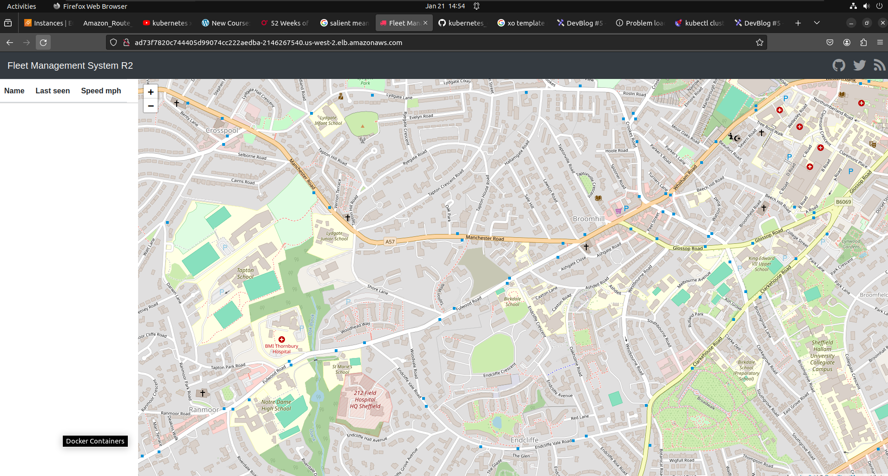
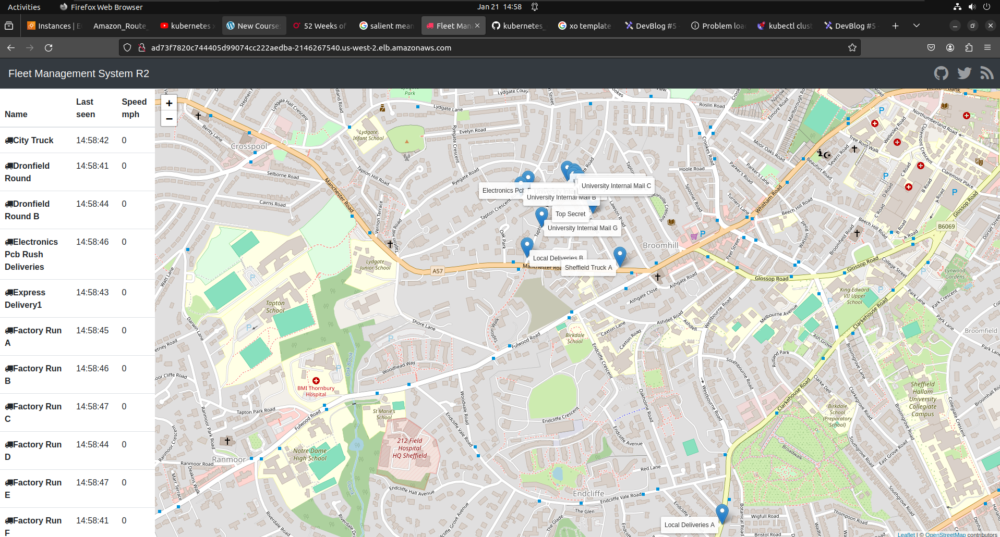

# replicating PODs in kubernetes in kops AWS cluster

- even though the `kops cluster system` did respond very fast when we turn off the `worker node` where the `webapp POD` been running , we will still the `page reloading` for a `longer period of time` , hence we can `consider/claim` that `node in which the webapp POD running` if we `terminate that node` then `fleetman webapp` will not be `running for a significant amount of time even though it will not be timeout`

- it is safe to day that the `website is not accessible` when the `node which run the Webapp POD been crashed or shutdown to simulate the Az failure` , we can see that `user can sit there waiting for the site to be load up`

- **How to address the problem of surviving the node crash for the webapp POD**

- we have `currently only one webapp POD` running inside a `particular worker node` , if that `worker node get crashed` then we can see that `webapp POD will also be crashed` , even though  `kubernetes will spin of the new instance of Webapp POD on the survviving node as it is deployed as Deployment` , it will going to take time which can lead to `bad user experience`

- hence a `better way` is to `deploy mulitple replicas of webapp POD` onto `different different node` , so that even though the `one worker node get crashed` then we have `another webapp POD running in a different node` which can respond to the `webapp request on browser`

- we can edit the `workloads.yml` script we are deploying the `webapp POD` using the `Deployment` , which is a special form of `replica-set` which will handle the `number PODs mentioned against the replicas:<number>` at a `given point of time` 

- we can specify `how many instances of the webapp POD we want to be running at a given point of time we can mentioned that  inside the replicas:<number> section` so that kubernetes will make sure those many number of instances are running at a given instance

- hence we can specify the `wrokloads.yml` as below 

    
    ```yaml
        workloads.yml
        =============
        apiVersion: apps/v1 # here we are using the Deployment which belong to the apps group hence the apiVersion: apps/v1
        kind: Deployment # here thye type of kubernetes object we are using is of Deployment
        metadata: # here defining the name of the Deployment as webapp
            name: webapp
        spec: # defining the specification for the Deployments
            selector: # here providing the selector as app: webappp which will select the POD having the same label in this case 
                matchLabels:
                    app: webapp
            # here we are changing the replicas from 1 to 2 so that at any given instance there should be 2 instances of webapp POD running inside 2 node of the kops cluster 
            replicas: 2 # defining the replicas in number as 2 which means at any given instance there sghould be 2 instances of the POD will be running
            template: # defining the template which been specifically designed for the POD definition
                metadata: # on the mertadata defining the labels
                    labels: # here defining the POD label as key value pair
                        app: webapp
                spec: # defining the specifiction fot the POD definition 
                    containers: # container that run inside the POD can be showned here
                        - name: webapp # name of the container being webapp
                          image: richardchesterwood/k8s-fleetman-webapp-angular:release2 # image for the POD container
                          env: # environment variable used inside the POD container
                            - name: SPRING_PROFILES_ACTIVE # name of the environment variable
                              value: production-microservice # value of the environment variable


        ---

        apiVersion: apps/v1 # here we are using the Deployment which belong to the apps group hence the apiVersion: apps/v1
        kind: Deployment # here thye type of kubernetes object we are using is of Deployment
        metadata: # here defining the name of the Deployment as queueapp
            name: queueapp
        spec: # defining the specification for the Deployments
            selector: # here providing the selector as app: queueapp which will select the POD having the same label in this case 
                matchLabels:
                    app: queueapp
            replicas: 1 # defining the replicas in number as 1 which means at any given instance there should be 1 instances of the POD will be running
            template: # defining the template which been specifically designed for the POD definition
                metadata: # on the mertadata defining the labels
                    labels: # here defining the POD label as key value pair
                        app: queueapp
                containers: # container that run inside the POD can be showned here
                    - name: queueapp # name of the container being webapp
                      image: richardchesterwood/k8s-fleetman-queue:release2 # image for the POD container
        
        ---

        apiVersion: apps/v1  # here we are using the Deployment which belong to the apps group hence the apiVersion: apps/v1
        kind: Deployment # here thye type of kubernetes object we are using is of Deployment
        metadata: # here defining the name of the Deployment as position-tracker
            name: position-tracker
        spec: # defining the specification for the Deployments
            selector: # here providing the selector as app: position-tracker which will select the POD having the same label in this case
                matchLabels:
                    app: position-tracker
            replicas: 1 # defining the replicas in number as 1 which means at any given instance there should be 1 instances of the POD will be running
            template: # defining the template which been specifically designed for the POD definition
                metadata: # on the mertadata defining the labels
                    labels: # here defining the POD label as key value pair
                        app: position-tracker
                containers: # container that run inside the POD can be showned here
                    - name: position-tracker # name of the container being descreibed in here
                      image: richardchesterwood/k8s-fleetman-position-tracker:release3 # image for the container
                      env:  # defining the environment variable in this case
                        - name: SPRING_PROFILES_ACTIVE # name of the environment variable
                          value: production-microservice # value for the environment variable

        ---

        apiVersion: apps/v1  # here we are using the Deployment which belong to the apps group hence the apiVersion: apps/v1
        kind: Deployment # here thye type of kubernetes object we are using is of Deployment
        metadata: # here defining the name of the Deployment as position-simulator
            name: position-simulator
        spec: # defining the specification for the Deployments
            selector: # here providing the selector as app: psotion-simulator which will select the POD having the same label in this case
                matchLabels:
                    app: position-simulator
            replicas: 1 # defining the replicas in number as 1 which means at any given instance there should be 1 instances of the POD will be running
            template: # defining the template which been specifically designed for the POD definition
                metadata: # on the mertadata defining the labels
                    labels: # here defining the POD label as key value pair
                        app: position-simulator
                containers: # container that run inside the POD can be showned here
                    - name: position-simulator # name of the container being descreibed in here
                      image: richardchesterwood/k8s-fleetman-position-simulator:release2 # image for the container
                      env: # defining the environment variable in this case
                        - name: SPRING_PROFILES_ACTIVE # name of the environment variable
                          value: production-microservice # value for the environment variable


        ---

        apiVersion: apps/v1  # here we are using the Deployment which belong to the apps group hence the apiVersion: apps/v1
        kind: Deployment # here thye type of kubernetes object we are using is of Deployment
        metadata: # here defining the name of the Deployment as api-gateway
            name: api-gateway
        spec: # defining the specification for the Deployments
            selector: # here providing the selector as app: api-gateway which will select the POD having the same label in this case
                matchLabels:
                    app: api-gateway
            replicas: 1 # defining the replicas in number as 1 which means at any given instance there should be 1 instances of the POD will be running
            template: # defining the template which been specifically designed for the POD definition
                metadata: # on the mertadata defining the labels
                    labels: # here defining the POD label as key value pair
                        app: api-gateway
                containers: # container that run inside the POD can be showned here
                    - name: api-gateway # defining the name of the container in this case over here
                      image: richardchesterwood/k8s-fleetman-api-gateway:release2 # iomage for the container being describe in here
                      env:  # defining the environment variable in this case
                        - name: SPRING_PROFILES_ACTIVE # name of the environment variable
                          value: production-microservice # value for the environment variable


    
    ```

- now we can `deploy this changes` to the `kops cluster` by making the chantges as below

    ```bash
        kubectl apply -f workloads.yml
        # deploying the changes to the kops kubernetes cluster in the default namespace
        # the below will be the output in this case
        deployment.apps/queueapp unchanged
        deployment.apps/position-simulator unchanged
        deployment.apps/position-tracker unchanged
        deployment.apps/api-gateway unchanged
        deployment.apps/webapp configured # here we can see that webapp deployment POD been showing as running in this case 
    
    
    ```

- the decession of `how many replicas for the POD should been running at a time` will be `completly trade-offs`

- if here both the  `i-00f3a5b96777d602f` and `i-094d7f237494e3fda` noes goes down then the `webapp` will be unavaibleble untill the `Deployment schedule it to survining nodes`

- even though the `no brainer` to run the `webapp POD` accross the `3 different node` which can also increase the `additional overload over the nodes` and `for which we need high instance size  nodes` which can cost some money or we need to `spin up few more nodes`  

- for this case the `2 instance replica-set` will do the jobs , which will be of `High Available` not 100% 

- now when we do the `kubectl get pods -o wide` then we can see the `2 instances of th webapp POD` in that case

    ```bash
        kubectl get pods -o wide
        # here we are seeing the kubernetes PODs and associated Nodes for the same 
        NAME                                  READY   STATUS    RESTARTS   AGE     IP             NODE                  NOMINATED NODE   READINESS GATES
        api-gateway-56c46fbcdb-85v2b          1/1     Running   0          25h     100.96.3.122          <none>
        mongodb-578b98fbd4-7vrr6              1/1     Running   0          25h     100.96.1.172   i-07f1a54e4eb6d10ad   <none>           <none>
        position-simulator-5fdb4ddbd5-82n2d   1/1     Running   0          25h     100.96.3.238   i-00f3a5b96777d602f   <none>           <none>
        position-tracker-59fdfd8cf4-kdk6s     1/1     Running   0          9h      100.96.3.133   i-00f3a5b96777d602f   <none>           <none>
        queueapp-f55dcb97d-z7hgs              1/1     Running   0          9h      100.96.3.130   i-00f3a5b96777d602f   <none>           <none>
        webapp-66765b68df-djrff               1/1     Running   0          9h      100.96.3.117   i-00f3a5b96777d602f   <none>           <none>
        webapp-66765b68df-lfvrm               1/1     Running   0          3m10s   100.96.4.34    i-094d7f237494e3fda   <none>           <none>
        
        # here we can see that 2 instances of the webapp POD been running on different `nodes` i.e `i-00f3a5b96777d602f` and `i-094d7f237494e3fda(which is the new node created due to the Auto Scaling Group)` which was sitting preveiosuly `sitting idle` 
    
    ```

- now if we simulate the `node failue` by stopping the `i-00f3a5b96777d602f` instance then we can observered below things

- if we go to the `AWS Mgmt console`  &rarr; `EC2` &rarr; `running instance` we can see that 

- if we are going to go to the `webapp` POD running `worker node` which is having the `instance-ID` as `i-00f3a5b96777d602f` and goto `instance state` &rarr; `terminate the instance`

- 

- here we can see that `webapp` is still running `fine` , but `we can't see the vehicle data coming in` as the `instance-id` i.e `i-00f3a5b96777d602f` associated with `other PODs apart fromm the webapp POD` such as 
  
  - `position-simulator` 
  
  - `position-tracker`
  
  - `api-gateway`  
  
- hence `kubernetes will be taking time to` restartv the `Deployment POD` for which the `vehicle result coming in can take some time` , once all the `POD been up and running` then we can see that `without refresh the fleetman webapp page` should  have the `vehicle result coming in` which can take upto `30 sec`

- by the mean time we can do check such as below

    ```bash
        # checking all kubernetes object inside the cluster inside default namespace
        NAME                                      READY   STATUS        RESTARTS   AGE
        pod/api-gateway-56c46fbcdb-jjqtd          1/1     Running       0          107s
        pod/mongodb-578b98fbd4-7vrr6              1/1     Running       0          26h
        pod/position-simulator-5fdb4ddbd5-8q925   1/1     Running       0          106s
        pod/position-tracker-59fdfd8cf4-mbh7j     1/1     Running       0          107s
        pod/queueapp-f55dcb97d-plfvm              1/1     Running       0          107s
        pod/queueapp-f55dcb97d-z7hgs              1/1     Terminating   0          9h # here we can see that queueapp is terminating and again restarting
        pod/webapp-66765b68df-lfvrm               1/1     Running       0          9m11s
        pod/webapp-66765b68df-msdff               1/1     Running       0          107s

        NAME                                TYPE           CLUSTER-IP       EXTERNAL-IP                                                               PORT(S)              AGE
        service/fleetman-api-gateway        ClusterIP      100.68.211.100   <none>                                                                    8080/TCP             26h
        service/fleetman-mongodb            ClusterIP      100.67.56.12     <none>                                                                    27017/TCP            26h
        service/fleetman-position-tracker   ClusterIP      100.71.229.157   <none>                                                                    8080/TCP             26h
        service/fleetman-queue              ClusterIP      100.70.69.242    <none>                                                                    8161/TCP,61616/TCP   26h
        service/fleetman-webapp             LoadBalancer   100.65.80.217    ad73f7820c744405d99074cc222aedba-2146267540.us-west-2.elb.amazonaws.com   80:30101/TCP         26h
        service/kubernetes                  ClusterIP      100.64.0.1       <none>                                                                    443/TCP              47h

        NAME                                 READY   UP-TO-DATE   AVAILABLE   AGE
        deployment.apps/api-gateway          1/1     1            1           26h
        deployment.apps/mongodb              1/1     1            1           26h
        deployment.apps/position-simulator   1/1     1            1           26h
        deployment.apps/position-tracker     1/1     1            1           26h
        deployment.apps/queueapp             1/1     1            1           26h
        deployment.apps/webapp               2/2     2            2           26h

        NAME                                            DESIRED   CURRENT   READY   AGE
        replicaset.apps/api-gateway-56c46fbcdb          1         1         1       26h
        replicaset.apps/mongodb-578b98fbd4              1         1         1       26h
        replicaset.apps/position-simulator-5fdb4ddbd5   1         1         1       26h
        replicaset.apps/position-tracker-59fdfd8cf4     1         1         1       26h
        replicaset.apps/queueapp-f55dcb97d              1         1         1       26h
        replicaset.apps/webapp-66765b68df               2         2         2       26h


        # as soon as the all the POD becomes running we can see the vehicle report will start coming in 
        kubectl get all
        # checking all kubernetes object inside the cluster inside default namespace after 5 sec
        # here now we can see all the POD running and vehicle report should start coming in 
        NAME                                      READY   STATUS    RESTARTS   AGE
        pod/api-gateway-56c46fbcdb-jjqtd          1/1     Running   0          15m
        pod/mongodb-578b98fbd4-7vrr6              1/1     Running   0          26h
        pod/position-simulator-5fdb4ddbd5-8q925   1/1     Running   0          15m
        mbh7j     1/1     Running   0          15m
        pod/queueapp-f55dcb97d-plfvm              1/1     Running   0          15m
        pod/webapp-66765b68df-lfvrm               1/1     Running   0          22m
        pod/webapp-66765b68df-msdff               1/1     Running   0          15m

        NAME                                TYPE           CLUSTER-IP       EXTERNAL-IP                                                               PORT(S)              AGE
        service/fleetman-api-gateway        ClusterIP      100.68.211.100   <none>                                                                    8080/TCP             26h
        service/fleetman-mongodb            ClusterIP      100.67.56.12     <none>                                                                    27017/TCP            26h
        service/fleetman-position-tracker   ClusterIP      100.71.229.157   <none>                                                                    8080/TCP             26h
        service/fleetman-queue              ClusterIP      100.70.69.242    <none>                                                                    8161/TCP,61616/TCP   26h
        service/fleetman-webapp             LoadBalancer   100.65.80.217    ad73f7820c744405d99074cc222aedba-2146267540.us-west-2.elb.amazonaws.com   80:30101/TCP         26h
        service/kubernetes                  ClusterIP      100.64.0.1       <none>                                                                    443/TCP              2d

        NAME                                 READY   UP-TO-DATE   AVAILABLE   AGE
        deployment.apps/api-gateway          1/1     1            1           26h
        deployment.apps/mongodb              1/1     1            1           26h
        deployment.apps/position-simulator   1/1     1            1           26h
        deployment.apps/position-tracker     1/1     1            1           26h
        deployment.apps/queueapp             1/1     1            1           26h
        deployment.apps/webapp               2/2     2            2           26h

        NAME                                            DESIRED   CURRENT   READY   AGE
        replicaset.apps/api-gateway-56c46fbcdb          1         1         1       26h
        replicaset.apps/mongodb-578b98fbd4              1         1         1       26h
        replicaset.apps/position-simulator-5fdb4ddbd5   1         1         1       26h
        replicaset.apps/position-tracker-59fdfd8cf4     1         1         1       26h
        replicaset.apps/queueapp-f55dcb97d              1         1         1       26h
        replicaset.apps/webapp-66765b68df               2         2         2       26h

    ```

- 

- hence we have put `what is out of scope` is `it does not matter if the report from the vehicle stopped coming in` as our requirement

- here by `careful use of the replicas` and `deciding how big the cluster should be` and `how resilient our system going to be` we can use the `workload accrodingly` in order to get the `High Available system`

- we can also `simulate what happens if the master node dies`, we can see that in the `logging and monitoring the kubernetes cluster` section 

- but the only cavient being `if the queueapp POD or mongodb POD dies` due to the `node-failure` then we `can see the vehicle report stopped coming in` even though we have `multiple position-tracker and position-simulator` that is because these are `PODs are the data PODs` hence hence `queueapp` is `stateful` in nature

- even though `we try to replicate these PODs will not be helpful` for the `queueapp or mongoDB POD `, because as the `queueapp POD and mongoDB POD being the data POD storeing the data` , if we `spin up multiple instances` of the `queueapp POD` the it can't decide on which `POD` the `data need to be stored` which can cause the `split brain problem and other catastrophic problem`

- in this case the `queueapp POD` and `mongoDB POD` are `stateful in netutre` hence we `can't replicate` the `POD` , hence we always try to `make the POD as stateless` so that we can `replicate it to multiple number` wghich can provide `high avaibalibity`

- but here as we are using the `apache active MQ` which provide support for the `replication` , we can `tweak the code and make those changes to make it as stateless`

- a simpler solution to look at the `cloud priovider` to see that `if the cloud provider` provide support to the `Message Queue and mongoDB database` 

- we can also use the `Amazon Service such as Amazon MQ` which will provide support for the `Active MQ` , make it as `cloud dependent` which will in turn make it as `replicated MQ` which will provide the `url` which can be used in the `position-simulator` and `psotion-tracker`

- similarly `we can use the amazon simple DB` which is a `nosql database` in order to make the `replication possible for the mongoDB`

- but we do need to keep in mind that `i9f we are using the Amazon MQ or amazon Simple DB` then we are making it more `AWS cloud dependent` hence changing the `cloud provider will be diffult later`

