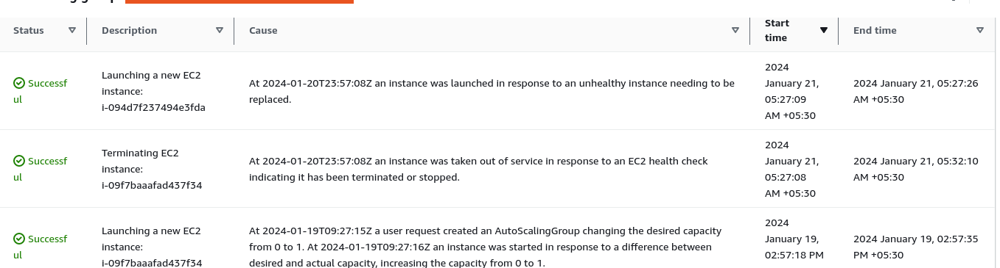

# Serviving the Node Failure inside the kops cluster where the Fleetman-webapp been deployed

- here we will be breaking the `fleetman microservice system` which we have `deployed to amazon kops cluster`

- the requirement over here being `even in the event of any node( or availability zone) failure` the `fleetman website must be accessible`

- here `what is out of scope` is `it does not matter if the report from the vehicle stopped coming in` as long as the  `service event reinstated after the POD restarted` within a `few minutes` , and we can see the `report coming in few minutes after the service event being reinstated`

- if we do a `kubectl get all` then we can see the `PODs/Services/Nodes/Replica-set/Deployment` running on the `default namespace` under the `kops kubernetes cluster`

- but we if we do a `kubectl get pods` to see the `PODs` then we can't see on which node the `PODs` are running

- hence we can sort that issue by the command as `kubectl get pods -o wide` which will display the `on which node the PODs are running in`

- we can do that as below

    ```bash
        kubectl get all
        # fetching all kubernetes object inside the default namespace inside the kops kubernetes cluster
        # here we will be seeing the command as below 
        NAME                                      READY   STATUS    RESTARTS   AGE
        pod/api-gateway-56c46fbcdb-85v2b          1/1     Running   0          16h
        pod/mongodb-578b98fbd4-7vrr6              1/1     Running   0          16h
        pod/position-simulator-5fdb4ddbd5-82n2d   1/1     Running   0          16h
        pod/position-tracker-59fdfd8cf4-t8j44     1/1     Running   0          16h
        pod/queueapp-f55dcb97d-nf55x              1/1     Running   0          16h
        pod/webapp-66765b68df-qplvz               1/1     Running   0          16h

        NAME                                TYPE           CLUSTER-IP       EXTERNAL-IP                                                               PORT(S)              AGE
        service/fleetman-api-gateway        ClusterIP      100.68.211.100   <none>                                                                    8080/TCP             16h
        service/fleetman-mongodb            ClusterIP      100.67.56.12     <none>                                                                    27017/TCP            16h
        service/fleetman-position-tracker   ClusterIP      100.71.229.157   <none>                                                                    8080/TCP             16h
        service/fleetman-queue              ClusterIP      100.70.69.242    <none>                                        /TCP,61616/TCP   16h
        service/fleetman-webapp             LoadBalancer   100.65.80.217    ad73f7820c744405d99074cc222aedba-2146267540.us-west-2.elb.amazonaws.com   80:30101/TCP         16h
        service/kubernetes                  ClusterIP      100.64.0.1       <none>                                                                    443/TCP              38h

        NAME                                 READY   UP-TO-DATE   AVAILABLE   AGE
        deployment.apps/api-gateway          1/1     1            1           16h
        deployment.apps/mongodb              1/1     1            1           16h
        deployment.apps/position-simulator   1/1     1            1           16h
        deployment.apps/position-tracker     1/1     1            1           16h
        deployment.apps/queueapp             1/1     1            1           16h
        deployment.apps/webapp               1/1     1            1           16h

        NAME                                            DESIRED   CURRENT   READY   AGE
        replicaset.apps/api-gateway-56c46fbcdb          1         1         1       16h
        replicaset.apps/mongodb-578b98fbd4              1         1         1       16h
        replicaset.apps/position-simulator-5fdb4ddbd5   1         1         1       16h
        replicaset.apps/position-tracker-59fdfd8cf4     1         1         1       16h
        replicaset.apps/queueapp-f55dcb97d              1         1         1       16h
        replicaset.apps/webapp-66765b68df               1         1         1       16h

        # here we can see the PODs info by using the below command in this case 
        kubectl get pods
        # which will show the basic info about the pods that we want tio run
        # the output in this case will be as below 
        NAME                                  READY   STATUS    RESTARTS   AGE
        api-gateway-56c46fbcdb-85v2b          1/1     Running   0          16h
        mongodb-578b98fbd4-7vrr6              1/1     Running   0          16h
        position-simulator-5fdb4ddbd5-82n2d   1/1     Running   0          16h
        position-tracker-59fdfd8cf4-t8j44     1/1     Running   0          16h
        queueapp-f55dcb97d-nf55x              1/1     Running   0                    1/1     Running   0          16h

        # now we can see which PODs running on which Nodes by using the command as below 
        kubectl get pods -o wide
        # here by outputting the wioder response we can see the which PODs been running on which nodes
        # here the output will be as below 
        NAME                                  READY   STATUS    RESTARTS   AGE   IP             NODE                  NOMINATED NODE   READINESS GATES
        api-gateway-56c46fbcdb-85v2b          1/1     Running   0          16h   100.96.3.122   i-00f3a5b96777d602f   <none>           <none>
        mongodb-578b98fbd4-7vrr6              1/1     Running   0          16h   100.96.1.172   i-07f1a54e4eb6d10ad   <none>           <none>
        position-simulator-5fdb4ddbd5-82n2d   1/1     Running   0          16h   100.96.3.238   i-00f3a5b96777d602f   <none>           <none>
        position-tracker-59fdfd8cf4-t8j44     1/1     Running   0          16h   100.96.2.149   i-09f7baaafad437f34   <none>           <none>
        queueapp-f55dcb97d-nf55x              1/1     Running   0          16h   100.96.2.245   i-09f7baaafad437f34   <none>           <none>
        webapp-66765b68df-qplvz               1/1     Running   0          16h   100.96.2.101   i-09f7baaafad437f34   <none>           <none>

    
    ```

- here we can see that `which PODs been running on which Node` here the `EC2 instance-ID` of the `node` will be displayed against the `Node` info in this case 

- if we go to the `AWS Mgmt console`  &rarr; `EC2` &rarr; `running instance` we can see that 
  
  - the `api-gateway` and `position-simulator`  will be `running inside the same node `which is having the instance ID as `i-00f3a5b96777d602f`  
  
  - the `position-tracker` , `queueapp` and `webapp` will be running inside the `running inside the same node` which is having the `instance-ID` as `i-09f7baaafad437f34 `
  
  - the `mongodb` POD been running inside the `node` which is having the `instance-ID` as `i-07f1a54e4eb6d10ad` 

- **simulating a Node Failure in kops kubernetes cluster**

- as of now with the `required PODs running inside different nodes` we are `failing the requirement that if we stop one node then fleetman webapp should run fine`

- if the `webapp POD` running `node` getting failed then we can see that `webapp should be unavailable and user can see the fleetman webapp not accessable`

- if we are going to go to the `webapp` POD running `worker node` which is having the `instance-ID` as `i-09f7baaafad437f34` and goto `instance state` &rarr; `terminate the instance`

- then we can visit the `AWS ELB DNS Name` on the web browser then we can see for few minutes the `WebPage getting loaded`

- now when we do the `kubectl get pods -o wide` then we can see that below response in this case

    ```bash
        kubectl get pods -o wide
        # fetching which PODs been running on which node as we already shutdown one node
        # the output will be as below this been shown
        
        NAME                                  READY   STATUS    RESTARTS   AGE     IP             NODE                  NOMINATED NODE   READINESS GATES
        api-gateway-56c46fbcdb-85v2b          1/1     Running   0          16h     100.96.3.122   i-00f3a5b96777d602f   <none>           <none>
        mongodb-578b98fbd4-7vrr6              1/1     Running   0          16h     100.96.1.172   i-07f1a54e4eb6d10ad   <none>           <none>
        position-simulator-5fdb4ddbd5-82n2d   1/1     Running   0          16h     100.96.3.238   i-00f3a5b96777d602f   <none>           <none>
        position-tracker-59fdfd8cf4-kdk6s     1/1     Running   0          3m9s    100.96.3.133   i-00f3a5b96777d602f   <none>           <none>
        queueapp-f55dcb97d-z7hgs              1/1     Running   0          3m9s    100.96.3.130   i-00f3a5b96777d602f   <none>           <none>
        webapp-66765b68df-djrff               1/1     Running   0          3m10s   100.96.3.117   i-00f3a5b96777d602f   <none>           <none>
    
        # here we can see the below outcome in this case :->

        # the `position-tracker` , `queueapp` and `webapp` will be running inside the `running inside the same node` which is having the `instance-ID` as `i-09f7baaafad437f34 ` has been moved to `i-00f3a5b96777d602f` suviving `EC2-instance` i.e `nodes` which is in `us-west-2c` avaialability zone
     
    
    ```

- Even though the `fleetman website take time to load up` as the `node been restarted` , but we can see that `by the time ELB load balancer being timeout and display a timeout result` the `new PODs get restarted in the suviving nodes` and hence the `ELB able to fetch the data` before the `timeout happens` 

- but this is `one of the instances`, we can safely assume that `AWS ELB timeout was nearby` , but before that happens we are `lucky` that `new PODs been spunned on the survining nodes`

- now if we goto the `AWS Mgmt console`  &rarr; `EC2` &rarr; `running instance` we can see that `a New Node` been spunned , this is not `due to kubenetes` rather this is due to the `Auto Scaling Group` that we have `discussed` which been `associated with the kops cluster masternode/control plane or workernode`

- 

- if we are going to the `AWS Mgmt console`  &rarr; `EC2` &rarr; `Auto Scaling` then we can see that `Auto Scaling Group`

- if we select the  `Auto Scaling Group` which was associated with the `instance id` having number as `i-09f7baaafad437f34` which is in `us-west-2c` then we can see that `Auto Scaling Group` associated with it was `nodes-us-west-2c.fleetman.k8s.local`

- if we go to the `Activity History` of the `nodes-us-west-2c.fleetman.k8s.local` Auto Scaling Group then we can see the below info

- 

- here we can see that `At 2024 January 21, 05:27:08  an instance was taken out of service in response to an EC2 health check indicating it has been terminated or stopped` and after `1 sec` then we can see the logs as `2024 January 21, 05:27:09  an instance was launched in response to an unhealthy instance needing to be replaced.` as the `Auto Scaling Group associated with the EC2 instance node`  constantly monitoring the `kops kubernetes cluster` if one node being down then we will be getting the `terminated` then `it will spin up the new node in that case`

- but if we check the `kubectl get pods -o wide` we can see the `new node whioch been spunned by the Auto Scaling Group` never used inside the `kubernetes` to spin up the `POD` , what will be better if `kubernetes can stop few PODs and spunned that on the new nodes`

- but this behaviour of `kubernetes` make sense as `kubernetes has no idea` that there will another `kubernetes node`  which it can use 

