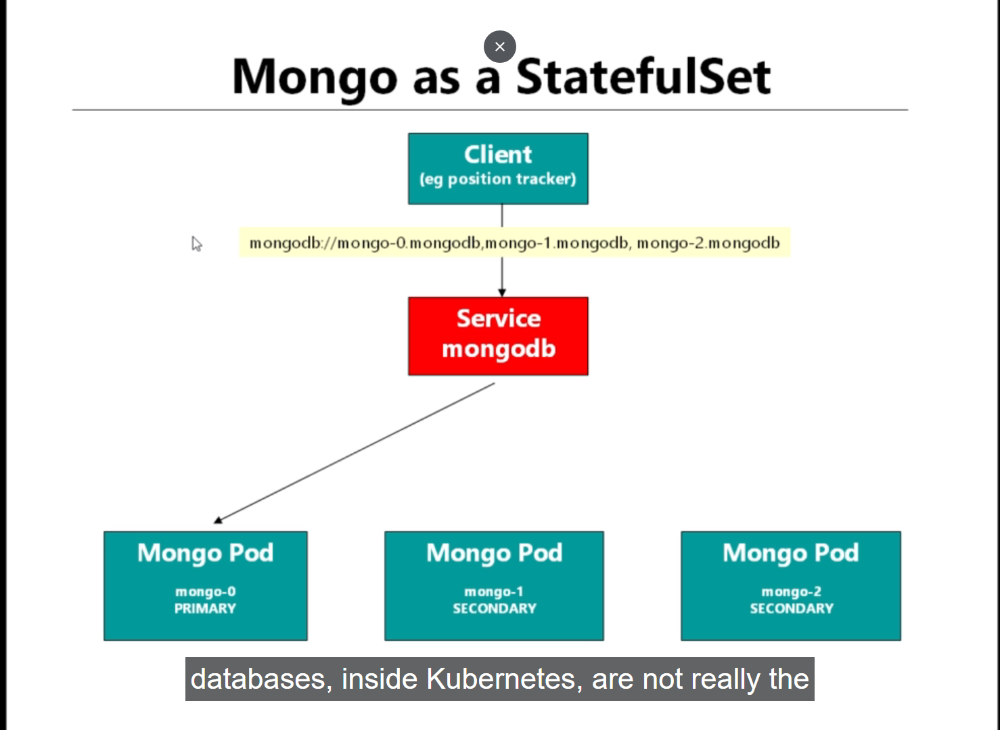

# scaling out the mongoDB database using StatefulSets in kubernetes

- here we will try to `deploy the mongoDB database` as the `StatefulSets` in `kubernetes`

- **Do we need to doing the DataBase POD inside the kubernetes cluster**

- is it a `good idea` to put a `put the database POD` inside the kubernetes cluster ?
 
- we `don't need to have` the `DataBase POD` inside the `kubernetes cluster`

- we `don't normally need to have` the `Database POD` inside the `kubernetes cluster` , because it can be `hard to manage`

- we need the `Database` because we to have the `persistent data` that we want to `store to the database` , hence we also need to think about `backup` and `recoveries` , which is difficult to perform `inside the kubernetes cluster`

- here we need to use `some kind of the database hosted service` to perform these action 

- if we are `running on cloud` such as `AWS` we do have the support to use the `cloud hosted database solution`

- `AWS` has a `service` called `Document DB` `which is pretty much same implementation` as `mongoDB` , after few click we will be getting the `URL for the same`

- then we can `use the URL` inside the `client POD such as client WebApp POD` in order to Use it

- if we can , absoloutely we have the `database` outside of the `cluster` , but that will be `cost a little bit` , but we can save in terms of `additional headache` and `downtime` if we `offload` the `management of the databases` onto the `cloud provider`

- here we have used `mongodb` as the `good example` for the `persistence` concepts such as `volume` here

- here `preveiously` we have the `mongo-stack.yml` which been using the `Deployment` and pointing to the `persistence volume claim`

- we can see those details here for the `mongo-stack.yml` and `Storage.yml` as below 
 
    ```yaml
        mongo-stack.yml
        ===============
        apiVersion: apps/v1 # here the apiVersion for the Deployment belong to the apps apiGroup hence mentioning as apiVersion: apps/v1
        kind: Deployment # here we are also stating the kind of kubernetes object will be as Deployment
        metadata: # name of the Deployment being as mongodb
            name: mongodb
        spec: # specification for the Deployment defined here
            selector: # selector for the POD label so that Deployment will associated with the group
                matchLabels: #
                    app: mongodb
            replicas: 1 # number of replicas in this case as 1 
            template: # template for the POD definition
                metadata: #defining the POD labels inside the metadata info in this case
                    labels:
                        app: mongodb
                spec: # specification for the POD definition
                    containers: # containers details provided here
                        - name: mongodb # name of the container
                          image: mongo:3.6.5-jessie # image for the container
                          volumeMounts: # providing the volumeMount for the container side
                            - name: mongo-persist-volume # name of the volumeMount
                              mountPath: /data/db # path inside the container that we want to mount
                    volumes: #volumes that we want to map to container 
                        - name: mongo-persist-volume # referenicing the volumeMount in here
                          persistentVolumeClaim: # persistentVolume been defined in here
                                claimName: mongo-pvc # claim name which be defined as the Storage.yml file for pvc
                                
        ---

        apiVersion : v1 # here the apiVersion for the Service belong to the core apiGroup hence mentioning as apiVersion: v1
        kind: Service # ype of kubernetes object will be inthe form as Service
        metadata: # naqme of the Service being defined in here
            name: fleetman-mongo
        spec: # specification for the Service been defined in here
            selectors: # selector for the Service defined as mongodb
                app: mongodb
            ports: # ports for the Service configuration defined here
                - name: mongo-port #name of the port
                  port: 27017 # allow traffic on port 27017
                  targetPort: 27017 # container port will be allowed on port 27017
                  protocol: TCP # protocol as TCP
            type: ClusterIP # type of kubernetes Service is ClusterIP which can be accessed inside the kubernetes cluster only 


    ```

- we have also defined the `Storage.yml` to define the `persistentVolume` and `persistentVolumeClaim` as below 

    ```yaml
        Storage.yml
        ===========
        apiVersion: v1 # here the apiVersion for the PersistentVolumeClaim belong to the core apiGroup hence mentioning as apiVersion: v1
        kind: PersistentVolumeClaim # here the kubernetes object will be of type PersistentVolumeClaim
        metadata: # here referencing the persistentVolumeClaim  that we have claimed inside the volume section of the mongo-stack.yml
            name: mongo-pvc
        spec: # defining the specification for the persistentVolumeClaim
            accessModes: # accessMode as ReadWriteOnce means only one POD inside the node can write to the volume rest all POD inside the same node can read
                - ReadWriteOnce
            resources: # requesting for the 7Gi of Storage to be allocated
                requests:
                    storage: 7Gi
            storageClassName: mongo-storage # here defining the StorageClassName to associate the persistentVolumeClaim and persistentVolume

        ---

        apiVersion: v1 # here the apiVersion for the PersistentVolume belong to the core apiGroup hence mentioning as apiVersion: v1
        kind: PersistentVolume # here the kubernetes object will be of type PersistentVolume
        metadata: # here the name of the PersistentVolume as my-local-storage
            name: my-local-storage
        spec: # defining the specification for the persistentVolumeClaim
            accessModes: # accessMode as ReadWriteOnce means only one POD inside the node can write to the volume rest all POD inside the same node can read
                - ReadWriteOnce
            storageClassName: mongo-storage # here defining the StorageClassName to associate the persistentVolumeClaim and persistentVolume
            capacity: # here we are defining the capacity as 7Gi in this case
                storage: 7Gi
            hostPath: # here we are using the hostPath to store it onto the Local minikube Linux VM machine
                path: /mnt/mongo-data # here we can define the path inside the Host System where we want to store that data
                type: DirectoryOrCreate # if the Directory not present create that directory


    ```

- but as discussed earlier , if we `increase the number of replicas for the mongo Deployment` it `will not going to work` , we will be getting `3 independent databases POD in this case`

- here we need the `1 database` , but the `data` will be `shared accross` the `multiple PODs`

- 

- first we need to `deploy` the `minikube-hostpath` provisioner `storageclass` as below , so that `persistenceVolumeClaim` can associated with it

    
    ```yaml
        storage.yml
        ===========
        apiVersion: storage.k8s.io/v1 # this is the apiversion as storage.k8s.io/v1 which can be fetched using the command as below kubectl api-resources -o wide | grep storageclass
        kind: StorageClass # here we need to define the kind of kubernetes object will be as StorageClass
        metadata: # here we are defining the name of the Storage class as standard which is the default storageclass for minikube kubernetes cluster , here we are creating as local-storage
            name: "local-storage"
        provisioner: k8s.io/minikube-hostpath # here defining the provisioner for the minikube-hostpath for the Hostpath in storageClass
        volumeBindingMode: Immediate 
        #  This field determines how Persistent Volumes (PVs) are dynamically bound to Persistent Volume Claims (PVCs).
        # The volumeBindingMode: Immediate means that when a Persistent Volume Claim (PVC) is created, it will be immediately bound to an available Persistent Volume (PV) that satisfies its requirements.
        #  The binding happens without considering whether the PV is actively used by a Pod or not.
        # This setting is in contrast to the WaitForFirstConsumer mode, where the binding of the PVC to a PV only occurs when a Pod using that PVC is scheduled to a node.

    ```

- we can define the `mongo-replicate.yml` which can be described as below 

- if we have the `mongodb` been `deployed to the cluster by mongo-stack.yml` then we need to `delete the existing mongodb POD` and start from the `stratch` 

    
    ```yaml
        mongo-replicate.yml
        ===================
        # here we have defined the HeadLess Service that we have defined which will associated with the StateFUlSet
        apiVersion: v1 # here defining the Service as the Service belong to core group hence we can define that as v1 
        kind: Service # the kind of kubernetes Object in this case will be as Service but as its associated with the StatefulSets considered as the HeadlessService
        metadata: # here we can define the name of the Service and label for the Service been defined here
            name: mongo
            labels:
                name: mongo
        spec: # specification for the Service defined in here
            ports: # ports used for the service defined in here
                - name: mongo # name of the Service Port
                  port: 27017 # allow traffic onto port 27017
                  targetPort: 27017 # here the targetPort as container port 27017
            type: ClusterIP # here the type of Service as ClusterIP in this case
            selector: # selector to select the POD based on the POD label
                role: mongo

        ---
        # here the serviceName along with the StatefulSets headless URL will become as mongodb://mongo-0.mongo,mongo-1.mongo,mongo-2.mongo/fleetman(DatabaseName)
        apiVersion: apps/v1 # defining the apiVersion of the StatefulSets as apps/v1 in this case
        kind: StatefulSet # here the type of kubernetes object we will be using is of StatefulSet
        metadata: # here the name of the StatefulSets is of mongo
            name: mongo
        spec: # here defining the specification for the StatefulSet
            
            selector: # here defining the selector to select the POD based on the labels
                matchLabels:
                    role: mongo
            replicas: 3 # here the number of replicas for the StatefulSet as 3 hence the POD name will be as mongo-0,mongo-1,mongo-2
            serviceName: mongo # here associating the HeadLess Service to the StatefulSets
            template: # here defining the metadata for the POD info in this case
                metadata: # defining the label as POD label as mongo
                    labels:
                        role: mongo
                spec: # here the spec for the POD definition as below 
                    terminationGracePeriodSeconds: 10 # instructing the GracePeriodTermination as 10 sec
                    containers: # continaer details provided here
                    - name: mongo # name of the container
                        image: mongo:4.0.8 # image for the contianer
                        command: # command for the container to crete the mongoDB replica-set
                        - mongod
                        - "--replSet"
                        - rs0
                        - "--smallfiles"
                        - "--noprealloc"
                        - "--bind_ip"
                        - "0.0.0.0"
                        ports: #  This indicates that the container inside the Pod will be listening on port 27017.
                            - containerPort: 27017 # This is typically used to expose a specific service or application running within the container to other containers or services in the Kubernetes cluster
                        volumeMounts: # here we are doing a volumeMount for the container POD folder 
                            - name: mongo-persistent-storage # here the name of the volumeMounts
                              mountPath: /data/db # mountPath for the POD defined in here
                    
                    # here we have the mongodb K8s sidecar POD container in this case
                    - name: mongo-sidecar # name of the image
                      image: cvallance/mongo-k8s-sidecar # image name in here
                      env: # env variable for the POD
                        - name: MONGO_SIDECAR_POD_LABELS # name of the env variable
                            value: "role=mongo" # value of the env variable
                        - name: KUBERNETES_MONGO_SERVICE_NAME # name of the env variable
                            value: mongo # value of the env variable
            
            volumeClaimTemplates: # here is the volumeClaimTemplates template in this case
                - metadata: # metadata info for the PersistentVolumeClaim
                    name: mongo-persistent-storage 
                    spec: # specification for the PersistentVolumeClaim
                        accessModes: ["ReadWriteOnce"] # here the accessMode deefined as ReadWriteOnce
                        storageClassName: "local-storage" # name of the storageClassName to link the PersistentVolumeClaim and PersistentVolume
                        resources: # here we are requesting for the resource as 7Gi of hardDisk
                            requests:
                            storage: 7Gi

        ---

        apiVersion: rbac.authorization.k8s.io/v1 # here defining the apiVersion for the clusterRoleBinding which can be fetched by kubectl api-resources -o wide | grep Binding
        kind: ClusterRoleBinding # here the kubernetes object will be as type of ClusterRoleBinding
        metadata: # name of the clusterBinding as default-view
            name: default-view
        roleRef:
            apiGroup: rbac.authorization.k8s.io # defining the apiGroup which is of rbac.authorization.k8s.io
            kind: ClusterRole # here the kind is of ClusterRole
            name: view # name of the clusterRole as view
        subjects:
            - kind: ServiceAccount # here the subject will be of ServiceAccount
              name: default # here the name of the Service Account as default
              namespace: default # namespace for the Account as default


    ```

- here the `HeadlessService` which looks like the `regular Service` we are naming this as `mongo`

- also the `StatefulSet` which is named as `mongo` which will make the `POD` as `mongo-0` , `mongo-1` and `mongo-2`

- hence the `HeadlessSerivce` can be accessed using the command as `mongo-0.mongo` , `mongo-1.mongo` and `mongo-2.mongo` for all the `3 POD`

- here the `client` will use the `HeadLess Service` as `mongodb://mongo-0.mongo,mongo-1.mongo,mongo-2.mongo/fleetman`

- hence we can think of `individual POD having the service` as `mongo-<no>.mongo`
-0f# scaling out the mongoDB database using StatefulSets in kubernetes

- here we will try to `deploy the mongoDB database` as the `StatefulSets` in `kubernetes`

- **Do we need to doing the DataBase POD inside the kubernetes cluster**

- is it a `good idea` to put a `put the database POD` inside the kubernetes cluster ?
 
- we `don't need to have` the `DataBase POD` inside the `kubernetes cluster`

- we `don't normally need to have` the `Database POD` inside the `kubernetes cluster` , because it can be `hard to manage`

- we need the `Database` because we to have the `persistent data` that we want to `store to the database` , hence we also need to think about `backup` and `recoveries` , which is difficult to perform `inside the kubernetes cluster`

- here we need to use `some kind of the database hosted service` to perform these action 

- if we are `running on cloud` such as `AWS` we do have the support to use the `cloud hosted database solution`

- `AWS` has a `service` called `Document DB` `which is pretty much same implementation` as `mongoDB` , after few click we will be getting the `URL for the same`

- then we can `use the URL` inside the `client POD such as client WebApp POD` in order to Use it

- if we can , absoloutely we have the `database` outside of the `cluster` , but that will be `cost a little bit` , but we can save in terms of `additional headache` and `downtime` if we `offload` the `management of the databases` onto the `cloud provider`

- here we have used `mongodb` as the `good example` for the `persistence` concepts such as `volume` here

- here `preveiously` we have the `mongo-stack.yml` which been using the `Deployment` and pointing to the `persistence volume claim`

- we can see those details here for the `mongo-stack.yml` and `Storage.yml` as below 
 
    ```yaml
        mongo-stack.yml
        ===============
        apiVersion: apps/v1 # here the apiVersion for the Deployment belong to the apps apiGroup hence mentioning as apiVersion: apps/v1
        kind: Deployment # here we are also stating the kind of kubernetes object will be as Deployment
        metadata: # name of the Deployment being as mongodb
            name: mongodb
        spec: # specification for the Deployment defined here
            selector: # selector for the POD label so that Deployment will associated with the group
                matchLabels: #
                    app: mongodb
            replicas: 1 # number of replicas in this case as 1 
            template: # template for the POD definition
                metadata: #defining the POD labels inside the metadata info in this case
                    labels:
                        app: mongodb
                spec: # specification for the POD definition
                    containers: # containers details provided here
                        - name: mongodb # name of the container
                          image: mongo:3.6.5-jessie # image for the container
                          volumeMounts: # providing the volumeMount for the container side
                            - name: mongo-persist-volume # name of the volumeMount
                              mountPath: /data/db # path inside the container that we want to mount
                    volumes: #volumes that we want to map to container 
                        - name: mongo-persist-volume # referenicing the volumeMount in here
                          persistentVolumeClaim: # persistentVolume been defined in here
                                claimName: mongo-pvc # claim name which be defined as the Storage.yml file for pvc
                                
        ---

        apiVersion : v1 # here the apiVersion for the Service belong to the core apiGroup hence mentioning as apiVersion: v1
        kind: Service # ype of kubernetes object will be inthe form as Service
        metadata: # naqme of the Service being defined in here
            name: fleetman-mongo
        spec: # specification for the Service been defined in here
            selectors: # selector for the Service defined as mongodb
                app: mongodb
            ports: # ports for the Service configuration defined here
                - name: mongo-port #name of the port
                  port: 27017 # allow traffic on port 27017
                  targetPort: 27017 # container port will be allowed on port 27017
                  protocol: TCP # protocol as TCP
            type: ClusterIP # type of kubernetes Service is ClusterIP which can be accessed inside the kubernetes cluster only 


    ```

- we have also defined the `Storage.yml` to define the `persistentVolume` and `persistentVolumeClaim` as below 

    ```yaml
        Storage.yml
        ===========
        apiVersion: v1 # here the apiVersion for the PersistentVolumeClaim belong to the core apiGroup hence mentioning as apiVersion: v1
        kind: PersistentVolumeClaim # here the kubernetes object will be of type PersistentVolumeClaim
        metadata: # here referencing the persistentVolumeClaim  that we have claimed inside the volume section of the mongo-stack.yml
            name: mongo-pvc
        spec: # defining the specification for the persistentVolumeClaim
            accessModes: # accessMode as ReadWriteOnce means only one POD inside the node can write to the volume rest all POD inside the same node can read
                - ReadWriteOnce
            resources: # requesting for the 7Gi of Storage to be allocated
                requests:
                    storage: 7Gi
            storageClassName: mongo-storage # here defining the StorageClassName to associate the persistentVolumeClaim and persistentVolume

        ---

        apiVersion: v1 # here the apiVersion for the PersistentVolume belong to the core apiGroup hence mentioning as apiVersion: v1
        kind: PersistentVolume # here the kubernetes object will be of type PersistentVolume
        metadata: # here the name of the PersistentVolume as my-local-storage
            name: my-local-storage
        spec: # defining the specification for the persistentVolumeClaim
            accessModes: # accessMode as ReadWriteOnce means only one POD inside the node can write to the volume rest all POD inside the same node can read
                - ReadWriteOnce
            storageClassName: mongo-storage # here defining the StorageClassName to associate the persistentVolumeClaim and persistentVolume
            capacity: # here we are defining the capacity as 7Gi in this case
                storage: 7Gi
            hostPath: # here we are using the hostPath to store it onto the Local minikube Linux VM machine
                path: /mnt/mongo-data # here we can define the path inside the Host System where we want to store that data
                type: DirectoryOrCreate # if the Directory not present create that directory


    ```

- but as discussed earlier , if we `increase the number of replicas for the mongo Deployment` it `will not going to work` , we will be getting `3 independent databases POD in this case`

- here we need the `1 database` , but the `data` will be `shared accross` the `multiple PODs`

- 

- first we need to `deploy` the `minikube-hostpath` provisioner `storageclass` as below , so that `persistenceVolumeClaim` can associated with it

    
    ```yaml
        storage.yml
        ===========
        apiVersion: storage.k8s.io/v1 # this is the apiversion as storage.k8s.io/v1 which can be fetched using the command as below kubectl api-resources -o wide | grep storageclass
        kind: StorageClass # here we need to define the kind of kubernetes object will be as StorageClass
        metadata: # here we are defining the name of the Storage class as standard which is the default storageclass for minikube kubernetes cluster , here we are creating as local-storage
            name: "local-storage"
        provisioner: k8s.io/minikube-hostpath # here defining the provisioner for the minikube-hostpath for the Hostpath in storageClass
        volumeBindingMode: Immediate 
        #  This field determines how Persistent Volumes (PVs) are dynamically bound to Persistent Volume Claims (PVCs).
        # The volumeBindingMode: Immediate means that when a Persistent Volume Claim (PVC) is created, it will be immediately bound to an available Persistent Volume (PV) that satisfies its requirements.
        #  The binding happens without considering whether the PV is actively used by a Pod or not.
        # This setting is in contrast to the WaitForFirstConsumer mode, where the binding of the PVC to a PV only occurs when a Pod using that PVC is scheduled to a node.

    ```

- we can define the `mongo-replicate.yml` which can be described as below 

- if we have the `mongodb` been `deployed to the cluster by mongo-stack.yml` then we need to `delete the existing mongodb POD` and start from the `stratch` 

    
    ```yaml
        mongo-replicate.yml
        ===================
        # here we have defined the HeadLess Service that we have defined which will associated with the StateFUlSet
        apiVersion: v1 # here defining the Service as the Service belong to core group hence we can define that as v1 
        kind: Service # the kind of kubernetes Object in this case will be as Service but as its associated with the StatefulSets considered as the HeadlessService
        metadata: # here we can define the name of the Service and label for the Service been defined here
            name: mongo
            labels:
                name: mongo
        spec: # specification for the Service defined in here
            ports: # ports used for the service defined in here
                - name: mongo # name of the Service Port
                  port: 27017 # allow traffic onto port 27017
                  targetPort: 27017 # here the targetPort as container port 27017
            type: ClusterIP # here the type of Service as ClusterIP in this case
            selector: # selector to select the POD based on the POD label
                role: mongo

        ---
        # here the serviceName along with the StatefulSets headless URL will become as mongodb://mongo-0.mongo,mongo-1.mongo,mongo-2.mongo/fleetman(DatabaseName)
        apiVersion: apps/v1 # defining the apiVersion of the StatefulSets as apps/v1 in this case
        kind: StatefulSet # here the type of kubernetes object we will be using is of StatefulSet
        metadata: # here the name of the StatefulSets is of mongo
            name: mongo
        spec: # here defining the specification for the StatefulSet
            
            selector: # here defining the selector to select the POD based on the labels
                matchLabels:
                    role: mongo
            replicas: 3 # here the number of replicas for the StatefulSet as 3 hence the POD name will be as mongo-0,mongo-1,mongo-2
            serviceName: mongo # here associating the HeadLess Service to the StatefulSets
            template: # here defining the metadata for the POD info in this case
                metadata: # defining the label as POD label as mongo
                    labels:
                        role: mongo
                spec: # here the spec for the POD definition as below 
                    terminationGracePeriodSeconds: 10 # instructing the GracePeriodTermination as 10 sec
                    containers: # continaer details provided here
                    - name: mongo # name of the container
                        image: mongo:4.0.8 # image for the contianer
                        command: # command for the container to crete the mongoDB replica-set
                        - mongod
                        - "--replSet"
                        - rs0
                        - "--smallfiles"
                        - "--noprealloc"
                        - "--bind_ip"
                        - "0.0.0.0"
                        ports: #  This indicates that the container inside the Pod will be listening on port 27017.
                            - containerPort: 27017 # This is typically used to expose a specific service or application running within the container to other containers or services in the Kubernetes cluster
                        volumeMounts: # here we are doing a volumeMount for the container POD folder 
                            - name: mongo-persistent-storage # here the name of the volumeMounts
                              mountPath: /data/db # mountPath for the POD defined in here
                    
                    # here we have the mongodb K8s sidecar POD container in this case
                    - name: mongo-sidecar # name of the image
                      image: cvallance/mongo-k8s-sidecar # image name in here
                      env: # env variable for the POD
                        - name: MONGO_SIDECAR_POD_LABELS # name of the env variable
                            value: "role=mongo" # value of the env variable
                        - name: KUBERNETES_MONGO_SERVICE_NAME # name of the env variable
                            value: mongo # value of the env variable
            
            volumeClaimTemplates: # here is the volumeClaimTemplates template in this case
                - metadata: # metadata info for the PersistentVolumeClaim
                    name: mongo-persistent-storage 
                    spec: # specification for the PersistentVolumeClaim
                        accessModes: ["ReadWriteOnce"] # here the accessMode deefined as ReadWriteOnce
                        storageClassName: "local-storage" # name of the storageClassName to link the PersistentVolumeClaim and PersistentVolume
                        resources: # here we are requesting for the resource as 7Gi of hardDisk
                            requests:
                            storage: 7Gi

        ---

        apiVersion: rbac.authorization.k8s.io/v1 # here defining the apiVersion for the clusterRoleBinding which can be fetched by kubectl api-resources -o wide | grep Binding
        kind: ClusterRoleBinding # here the kubernetes object will be as type of ClusterRoleBinding
        metadata: # name of the clusterBinding as default-view
            name: default-view
        roleRef:
            apiGroup: rbac.authorization.k8s.io # defining the apiGroup which is of rbac.authorization.k8s.io
            kind: ClusterRole # here the kind is of ClusterRole
            name: view # name of the clusterRole as view
        subjects:
            - kind: ServiceAccount # here the subject will be of ServiceAccount
              name: default # here the name of the Service Account as default
              namespace: default # namespace for the Account as default


    ```

- here the `HeadlessService` which looks like the `regular Service` we are naming this as `mongo`

- also the `StatefulSet` which is named as `mongo` which will make the `POD` as `mongo-0` , `mongo-1` and `mongo-2`

- hence the `HeadlessSerivce` can be accessed using the command as `mongo-0.mongo` , `mongo-1.mongo` and `mongo-2.mongo` for all the `3 POD`

- here the `client` will use the `HeadLess Service` as `mongodb://mongo-0.mongo,mongo-1.mongo,mongo-2.mongo/fleetman`

- hence we can think of `individual POD having the service` as `mongo-<no>.mongo`

- here we are using the command as `mongod --replSet rs0 --smallfiles --noprealloc --bind_ip 0.0.0.0 `  to create the `mongodb replica set`

- here also using the `mongo-sidecar` as `POD` also creting the `replica-set` 

- here the `StatefulSets` will provide the `PODs` with the `good name`

- here the `POD for the mongodb` will going to be `created sequentially` , once the `mongo-0` POD started running then we can put the `mongo-1` and `mongo-2` POD in `running`  

- if we `Deploy` the changes onto the `kubernetes cluster` then we can see the changes as below 

    
    ```bash
        
        kubectl apply -f storage.yml
        # Deploying the StorageClass onto the minikube kubernetes cluster
        # this willshow as below 
        storageclass.storage.k8s.io/local-storage created
        
        kubectl apply -f mongo-replicate.yml
        # Deploying the StatefulSets onto the minikube kubernetes cluster as below 
        # the output will be as below 
        service/mongo created
        statefulset.apps/mongo created
        ClusterRoleBinding.rbac.authorization.k8s.io/default-view created

        # now if we want we can put an watch on the POD as below 
        watch kubectl get pods
        # the output will be as below 
        # here the name of the POD which being created as systematic
        # also the container will be created in order
        # until the ongo-o been running mongo-1 will not start and others as well
        NAME      READY   STATUS    RESTARTS   AGE
        mongo-0   2/2     Running   0          17m
        mongo-1   2/2     Running   0          16m
        mongo-2   2/2     Running   0          16m


    ```


- here we have `Set the persistance volume` as below in this case `/data/db` inside the `container` where all the `mongo data will be stored`

- here we have defined the `volumeMount` with the name as `mongo-persistent-storage`

- the  `volumeMount` with the name as `mongo-persistent-storage` been referenced inside the `volumeClaimTemplates` which been under the same level as `template and selector`

- when we define the `volumeClaimTemplates` , `kubernetes will automatically going to create` the `persistentVolumeClaim` named as `mongo-persistent-storage`

- while ceating the `persistentVolumeClaim(pvc)` for the `StatfulSets` it will provide it a name as `mongo-persistent-storage-<pod name>`

- we can see the details as below 

    ```bash
        kubectl get pvc
        # fetching all the persistentVolumeClaim created inside the default namespace
        # the output will be as below 
        NAME                                           STATUS   VOLUME                                     CAPACITY   ACCESS MODES   STORAGECLASS      AGE
        mongo-persistent-storage-mongo-0               Bound    pvc-661de39d-eab3-4b3d-87f0-77322e7a87eb   7Gi        RWO            fast              27m
        mongo-persistent-storage-mongo-1               Bound    pvc-d9389918-798f-4e1e-a35a-5058989a662b   7Gi        RWO            fast              27m
        mongo-persistent-storage-mongo-2               Bound    pvc-2b4d8a50-4de0-488e-9c1b-91011f853d9d   7Gi        RWO            fast              27m


    ```

- here we have also using the `StorageClass` which is `built-in StorageClass` named as `Standard` which is already present in `kubernetes` , where `minikube` can create the `temporary directory` once the `pv` been created from the `built-in storageClass`

- here the `3 mongo POD` will be writing to the `own minikube temporary directory` which we can see as below 

    
    ```bash
        
        kubectl get storageclass
        # fetching the storageclass available
        NAME                 PROVISIONER                RECLAIMPOLICY   VOLUMEBINDINGMODE   ALLOWVOLUMEEXPANSION   AGE
        local-storage                 k8s.io/minikube-hostpath   Delete          Immediate           false                  47m
        standard (default)   k8s.io/minikube-hostpath   Delete          Immediate           false                  10d


        kubectl get pv
        # this persistentVolume will be created because of the StorageClass
        # we can see the below output for the command 
        NAME                                       CAPACITY   ACCESS MODES   RECLAIM POLICY   STATUS   CLAIM                                                  STORAGECLASS      REASON   AGE
        pvc-2b4d8a50-4de0-488e-9c1b-91011f853d9d   7Gi        RWO            Delete           Bound    default/mongo-persistent-storage-mongo-2               fast                       35m
        pvc-661de39d-eab3-4b3d-87f0-77322e7a87eb   7Gi        RWO            Delete           Bound    default/mongo-persistent-storage-mongo-0               fast                       36m
        pvc-d9389918-798f-4e1e-a35a-5058989a662b   7Gi        RWO            Delete           Bound    default/mongo-persistent-storage-mongo-1               fast                       35m


        # if we want to describe one of the persistentVolume then we can see where its been writing the data to
        kubectl describe pv pvc-2b4d8a50-4de0-488e-9c1b-91011f853d9d
        # here we can see the info in this case as below 
        Name:            pvc-2b4d8a50-4de0-488e-9c1b-91011f853d9d
        Labels:          <none>
        Annotations:     hostPathProvisionerIdentity: c3af1bcf-f337-47ec-8599-695c537b6c97
                        pv.kubernetes.io/provisioned-by: k8s.io/minikube-hostpath
        Finalizers:      [kubernetes.io/pv-protection]
        StorageClass:    fast
        Status:          Bound
        Claim:           default/mongo-persistent-storage-mongo-2
        Reclaim Policy:  Delete
        Access Modes:    RWO
        VolumeMode:      Filesystem
        Capacity:        7Gi
        Node Affinity:   <none>
        Message:         
        Source:
            Type:          HostPath (bare host directory volume)
            Path:          /tmp/hostpath-provisioner/default/mongo-persistent-storage-mongo-2 # here the data will be written by the mongo-2 pod on minikube
            HostPathType:  
        Events:            <none>


    ```

- here the `position-tracker` microservice which is the `client` for the `mongodb database` , this is the `only microservice` that talk to the `mongodb database`

- here the `StatefulSets` will provide the `PODs` with the `good name`

- if we `Deploy` the changes onto the `kubernetes cluster` then we can see the changes as below 

    
    ```bash
        
        kubectl apply -f storage.yml
        # Deploying the StorageClass onto the minikube kubernetes cluster
        # this willshow as below 
        storageclass.storage.k8s.io/local-storage created
        
        kubectl apply -f mongo-replicate.yml
        # Deploying the StatefulSets onto the minikube kubernetes cluster as below 
        # the output will be as below 
        service/mongo created
        statefulset.apps/mongo created
        ClusterRoleBinding.rbac.authorization.k8s.io/default-view created

        # now if we want we can put an watch on the POD as below 
        watch kubectl get pods
        # the output will be as below 
        # here the name of the POD which being created as systematic
        # also the container will be created in order
        # until the ongo-o been running mongo-1 will not start and others as well
        NAME      READY   STATUS    RESTARTS   AGE
        mongo-0   2/2     Running   0          17m
        mongo-1   2/2     Running   0          16m
        mongo-2   2/2     Running   0          16m


    ```

- here we have `Set the persistance volume` as below in this case `/data/db` inside the `container` where all the `mongo data will be stored`

- here we have defined the `volumeMount` with the name as `mongo-persistent-storage`

- the  `volumeMount` with the name as `mongo-persistent-storage` been referenced inside the `volumeClaimTemplates` which been under the same level as `template and selector`

- when we define the `volumeClaimTemplates` , `kubernetes will automatically going to create` the `persistentVolumeClaim` named as `mongo-persistent-storage`

- while ceating the `persistentVolumeClaim(pvc)` for the `StatfulSets` it will provide it a name as `mongo-persistent-storage-<pod name>`

- we can see the details as below 

    ```bash
        kubectl get pvc
        # fetching all the persistentVolumeClaim created inside the default namespace
        # the output will be as below 
        NAME                                           STATUS   VOLUME                                     CAPACITY   ACCESS MODES   STORAGECLASS      AGE
        mongo-persistent-storage-mongo-0               Bound    pvc-661de39d-eab3-4b3d-87f0-77322e7a87eb   7Gi        RWO            fast              27m
        mongo-persistent-storage-mongo-1               Bound    pvc-d9389918-798f-4e1e-a35a-5058989a662b   7Gi        RWO            fast              27m
        mongo-persistent-storage-mongo-2               Bound    pvc-2b4d8a50-4de0-488e-9c1b-91011f853d9d   7Gi        RWO            fast              27m


    ```

- here we have also using the `StorageClass` which is `built-in StorageClass` named as `Standard` which is already present in `kubernetes` , where `minikube` can create the `temporary directory` once the `pv` been created from the `built-in storageClass`

- here the `3 mongo POD` will be writing to the `own minikube temporary directory` which we can see as below 

    
    ```bash
        
        kubectl get storageclass
        # fetching the storageclass available
        NAME                 PROVISIONER                RECLAIMPOLICY   VOLUMEBINDINGMODE   ALLOWVOLUMEEXPANSION   AGE
        local-storage                 k8s.io/minikube-hostpath   Delete          Immediate           false                  47m
        standard (default)   k8s.io/minikube-hostpath   Delete          Immediate           false                  10d


        kubectl get pv
        # this persistentVolume will be created because of the StorageClass
        # we can see the below output for the command 
        NAME                                       CAPACITY   ACCESS MODES   RECLAIM POLICY   STATUS   CLAIM                                                  STORAGECLASS      REASON   AGE
        pvc-2b4d8a50-4de0-488e-9c1b-91011f853d9d   7Gi        RWO            Delete           Bound    default/mongo-persistent-storage-mongo-2               fast                       35m
        pvc-661de39d-eab3-4b3d-87f0-77322e7a87eb   7Gi        RWO            Delete           Bound    default/mongo-persistent-storage-mongo-0               fast                       36m
        pvc-d9389918-798f-4e1e-a35a-5058989a662b   7Gi        RWO            Delete           Bound    default/mongo-persistent-storage-mongo-1               fast                       35m


        # if we want to describe one of the persistentVolume then we can see where its been writing the data to
        kubectl describe pv pvc-2b4d8a50-4de0-488e-9c1b-91011f853d9d
        # here we can see the info in this case as below 
        Name:            pvc-2b4d8a50-4de0-488e-9c1b-91011f853d9d
        Labels:          <none>
        Annotations:     hostPathProvisionerIdentity: c3af1bcf-f337-47ec-8599-695c537b6c97
                        pv.kubernetes.io/provisioned-by: k8s.io/minikube-hostpath
        Finalizers:      [kubernetes.io/pv-protection]
        StorageClass:    fast
        Status:          Bound
        Claim:           default/mongo-persistent-storage-mongo-2
        Reclaim Policy:  Delete
        Access Modes:    RWO
        VolumeMode:      Filesystem
        Capacity:        7Gi
        Node Affinity:   <none>
        Message:         
        Source:
            Type:          HostPath (bare host directory volume)
            Path:          /tmp/hostpath-provisioner/default/mongo-persistent-storage-mongo-2 # here the data will be written by the mongo-2 pod on minikube
            HostPathType:  
        Events:            <none>


    ```

- here the `position-tracker` microservice which is the `client` for the `mongodb database` , this is the `only microservice` that talk to the `mongodb database`

- if we are going to the `DickChesterwood Github Repo for k8s-fleetman` [k8s-fleeman-github-repo](https://github.com/DickChesterwood/k8s-fleetman)

- here if we goto the `Tags` and goto the `release3` then we can see that inside the `k8s-fleetman-position-tracker` &rarr; `src` &rarr; `main` &rarr;  `resources` &rarr; `application-production-microservice.properties` we can see the details as below 

    ```propeties
        application-production-microservice.properties
        ===============================================
        spring.activemq.broker-url=tcp://fleetman-queue.default.svc.cluster.local:61616
        fleetman.position.queue=positionQueue

        # We'll use the default port 8080 for all microservices in production cluster.
        # TODO but this is reasonable guess! This may change when we scale it out...
        
        spring.data.mongodb.host=fleetman-mongodb.default.svc.cluster.local
        # here we are referencing the fleetman-mongodb.default.svc.cluster.local as we are using only one mongodb database

    ```

- but if we `goto` the `helm-refactor` branch then we can see that `k8s-fleetman-position-tracker` &rarr; `src` &rarr; `main` &rarr;  `resources` &rarr; `application-production-microservice.properties` we can see the details as below 


    ```propeties
        application-production-microservice.properties
        ===============================================
        spring.activemq.broker-url=tcp://fleetman-queue.default.svc.cluster.local:61616
        fleetman.position.queue=positionQueue

        # We'll use the default port 8080 for all microservices in production cluster.

        # This is for the replicated mongo cluster
        spring.data.mongodb.uri=mongodb://mongo-0.mongo.default.svc.cluster.local,mongo-1.mongo.default.svc.cluster.local,mongo-2.mongo.default.svc.cluster.local/fleetman
        # here we are using the mongodb statefulsets and defining the URL accoringly

    ```

- here we this `particular configuration` been published as `release4 tag for the position-tacker image`

- hence we can define the `position-tecker` with `release4 image tag` inside the `workloads.yml` as below 

    ```yaml
        workloads.yml
        =============
        apiVersion: apps/v1 # apiVersion as apps/v1 as it belong to the apps Group
        kind: DaemonSet # kubernetes object of type as DaemonSet # THIS IS THE ONLY CHANGE we need to perform
        metadata: # defining the name for the Deployment as webapp
            name: webapp
        spec: # specification for the Deployment 
            selector: # selector to select the POD based on the label
                matchLabels: 
                    app: webapp
            # as based on the Node the PODs will be spuneed hence the there will be no need of the replicas
            template: # defining the template for the POD definition 
                metadata: # POD labels been defined in here
                    labels:
                        app: webapp
                spec: # specification for the POD been described in here
                    containers: # container details are in here
                        - name: webapp # name of the container
                          image: richardchesterwood/k8s-fleetman-webapp-angular:release2 # image of the container
                          env: # env variable needed for the container
                            - name: SPRING_PROFILE_ACTIVE # name of the env Variable
                              value: production-microservice # value of the env Variable

        ---

        apiVersion: apps/v1 # apiVersion as apps/v1 as it belong to the apps Group
        kind: Deployment # kubernetes object of type as Deployment
        metadata: # defining the name for the Deployment as queueapp
            name: queueapp
        spec:
            selector: # selector to select the POD based on the label
                matchLabels: 
                    app: queueapp
            replicas: 1 # here the number of replicas as 1 in this case
            template: # defining the template for the POD definition 
                metadata: # POD labels been defined in here
                    labels:
                        app: queueapp
                spec: # specification for the POD been described in here
                    containers: # container details are in here
                        - name: queueapp # name of the container
                          image: richardchesterwood/k8s-fleetman-queue:release2 # image of the container
        
        ---

        apiVersion: apps/v1 # apiVersion as apps/v1 as it belong to the apps Group
        kind: Deployment # kubernetes object of type as Deployment
        metadata: # defining the name for the Deployment as position-simulator
            name: position-simulator
        spec: # specification for the Deployment 
            selector: # selector to select the POD based on the label
                matchLabels: 
                    app: position-simulator
            replicas: 1 # here the number of replicas as 1 in this case
            template: # defining the template for the POD definition 
                metadata: # POD labels been defined in here
                    labels:
                        app: position-simulator
                spec: # specification for the POD been described in here
                    containers: # container details are in here
                        - name: position-simulator # name of the container
                          image: richardchesterwood/k8s-fleetman-position-simulator:release2 # image of the container
                          env: # env variable needed for the container
                            - name: SPRING_PROFILE_ACTIVE # name of the env Variable
                              value: production-microservice # value of the env Variable


        ---

        apiVersion: apps/v1 # apiVersion as apps/v1 as it belong to the apps Group
        kind: Deployment # kubernetes object of type as Deployment
        metadata: # defining the name for the Deployment as position-tracker
            name: position-tracker
        spec: # specification for the Deployment 
            selector: # selector to select the POD based on the label
                matchLabels: 
                    app: position-tracker
            replicas: 1 # here the number of replicas as 1 in this case
            template: # defining the template for the POD definition 
                metadata: # POD labels been defined in here
                    labels:
                        app: position-tracker
                spec: # specification for the POD been described in here
                    containers: # container details are in here
                        - name: position-tracker # name of the container
                          image: richardchesterwood/k8s-fleetman-position-tracker:release4 # image of the container CHANGING THE IMAGE TAG TO release4 in this case
                          env: # env variable needed for the container
                            - name: SPRING_PROFILE_ACTIVE # name of the env Variable
                              value: production-microservice # value of the env Variable


        ---

        apiVersion: apps/v1 # apiVersion as apps/v1 as it belong to the apps Group
        kind: Deployment # kubernetes object of type as Deployment
        metadata: # defining the name for the Deployment as api-gateway
            name: api-gateway
        spec: # specification for the Deployment 
            selector: # selector to select the POD based on the label
                matchLabels: 
                    app: api-gateway
            replicas: 1 # here the number of replicas as 1 in this case
            template: # defining the template for the POD definition 
                metadata: # POD labels been defined in here
                    labels:
                        app: api-gateway
                spec: # specification for the POD been described in here
                    containers: # container details are in here
                        - name: api-gateway # name of the container
                          image: richardchesterwood/k8s-fleetman-api-gateway:release2 # image of the container
                          env: # env variable needed for the container
                            - name: SPRING_PROFILE_ACTIVE # name of the env Variable
                              value: production-microservice # value of the env Variable


    ```