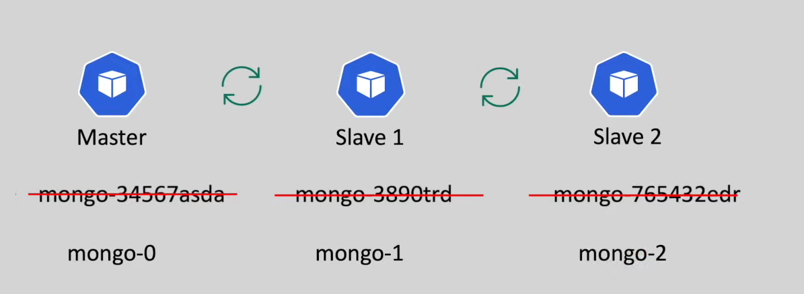

# StatefulSets in kubernetes

- in the `kubernetes volume` we deployed the `mongodb Database` using `Deployment` with `1 replicas`

- to `achieve high availability and enhance overall performance and reliability` we need to deploy `multiple replicas of the mongodb Database into the cluster`

- `mongoDb` is a `stateful Application` hence we can't `Deploy it as regular Deployment resource` to create `multiple replicas`

- here we will discuss about the `stateful and stateless application`

- how to `Deploy` A `stateful application` using the `kubernetes StatefulSets`

- **Difference Between the `stateful and stateless` application**

- here lets suppose we have a `simple springboot application` which does the `simple authentication`

- when the `client` sends the `login request` to the `simple springboot application` then it `does the authentication` and `set the authentication Tag to True` as `{authenticated:true}` and `save the result` into `memory`

- when the `client send the same request again` then `springboot application` can `read from the memory that {authenticated:true}` and `return the User` with the `permit`

- here we are `storing` the `state of the current request on memory` and the `subsequent request is dependent on that preveious request` such application known as the `stateful Application` in this case

- 

- if we have the `multiple instances of the same application` which been managed using the `LoadBalancer` then 
  
  - `1st login request` goes to the `instance-1` which save the `{authenticated:true}` into the `Memory`
  
  - if the `2nd subsequent request` goes to the `instance-2` then `it will not provide the appropriate response to the 2nd request as the {authenticated:true} is not set in the 2nd instance memory`
  
  - 
  
  - 
  
  - as a best practise `it is recomended` to put the `state` into the `database`
  
  - when the `first time the login request come in` then we will `generate the token` and `save to the Database` , the `application` need `token` for the `Subsequent Request` and validate from the `DB` for the `subsequent request`
  
  - here now `no matter how many instances of application are there` we will `get the same result` as we arte not storing the `state into the application memory` rather we are using the `Database` to `store the state`
  
  - here as `we are not storing` the `state onto the database` hence `we will be stating application as the stateless application` and the `DB as the stateful application`
  
  -  


- **What Problem we will face if we deploy the stateful application with multiple replicas using the regular Deployment** 

- **Problem:-1**

  - in the `kubernetes volume` we have deployed the `single replica of the mongodb deployment` and we use the `persistentVolume` to `store the mongodb data`

  - to achieve the `high availability` we need to increase the `number of replicas` of the `mongodb Deployment`

  - here if we `increase the number of replicas for the Deployment` then we can `all replicas will use the same persistentVolume to write the Data` which can lead to `data inconsistency`
  
  - 

  - in the `Distributed DataBase system` , if all the `PODs replica write to the same persistentVolume` then all the `DataBase POD` , will write to the `same Database` which will cause the `Data inconsistency`

  - the `easiest solution` for this being `to use separate persistentVolume` for each of the `Database POD replica`

  - this can be achieved using the `StatefulSets` , where we will be defining the `volumeClaimTemplates` , based on this `volumeClaimTemplates` separate `persistentvolumeClaim` been used for the `each Database POD replica`
  
  - 

- **Problem:-2**
  
  - if there will be `master and slave architecture application` we want to run then 
  
  - here in the `master` will handle the `read and write operation` , but where as the `slave only perform the read operation`
  
  - 
  
  - here for the `effiecient  and reliable replication` then we need to create the `master` should be `up and running first` 
  
  - then the `slave1 application` will `come up` and the `data` will be copied from `master to slave1`
  
  - 
  
  - then the `slave2` will `come up` and `instead of copying` the `data` from `mkaster` to the `slave2` it will copy the `data` from `slave1 to slave 2` so that `load on the master is very less`
  
  - 
  
  - after the `initial clone` all the `slave` will `sync` the data from `master`
  
  - 
  
  - in order to `achieve the intial clone` the `POD application` need to come `one by one` as the `data been copied from the preveious POD replica` 
  
  - but if we use the `Deployment` to deploy these kind of `master and slave architecture application` then all the `replicas` will get `created at the same time parallely` 
  
  - if we deploy that using the `statefulSets` then `POD replica` will going to be created `one by one`
  
  - here if we have created the `replica` using the `statefulSets` then `first the POD-0` will be created and then `POD-1` and `data will be cloned from POD-0 to POD-1` and followed by `POD-2` and `intial data` will be `copied from POD-1 to POD-2`
  
  - if the `first POD` is failed to get create `because of some reason` then `2nd POD will going to get failed` and `not going to be get created` as well
  
  - if we are deleting the `POD replica` created by the `StatefulSets` then the `Last one POD delete first` followed by the reverse way 

- **Problem:-3**

  - here as we discussed in the `master slave architecture application in kubernetes` then we can see that `data need to be copied or cloned or replicated from one POD replica to another POD replica`
  
  - here `POD` need to `know each other` in order to `perform a copy of data` for that we need a `sticky identity` to fond each other in `kubernetes cluster`
  
  - each `POD` can access `each other` using the `sticky identity DNS Name which will be associated with the POD`
  
  - `sticky identity means` we can able to `we can access each POD on a DNS` and the `DNS` will `not change even if the POD restart` , if the `POD name and DNS changes` then the `Other POD` will not be able to identify it
  
  - hence we need to make sure the `POD Name constant` will can go for `StatefulSets` which will create the `predictable and known POD name` 
  
  - here in this case if we use the `Deployment` then we can `ransom name will be assigned to the POD` hence the `POD name will no longer be constant` hence other POD can't able to reach to `other POD`
  
  -  
  
  - even if the `POD` restart , we will still have the `same POD predictable name and DNS`  when it come backup so that we can access that `Service`
  
  - 
  
  - here the `StatefulSets` `not only get` the `sticky name for identity` it also get the `sticky storage` as well
  
  - each of the `POD` having own `persistenceVolume` , when the `POD` restarts it will be associated with the `existing persistentVolume` , for this we `don't have to do anything the statefulSets takes care of that`
  

<br/><br/>


- here the `StatefulSets` does not mean having the `sticky name for identity and DNS and individual storage as persistentVolume` rather it refer to the `Service` to `communicate from one POD to another POD`

- whatever the `Services` that we learned so far behave as the `LoadBalancer` i.e when client try to access the `Service` it will act as an `LoadBalancer` and `distribute the loads between the random PODs` to get the response

- but here in this case we need to talk to the `Specific POD` i.e
  
  - all `Write op-eration` should goto the `master`
  
  - the `Slave1` POD will `get the data from` the `master`
  
  - the `Slave2` POD will `get the data from` the `Slave1`  

- for `communication between the PODs` inside the `StatefulSets` kubernetes provide the `special type of Service` known as the `Headless Service`

- when we specify the `clusterIP: None` inside the `Service Definition` that service behave as the `Headless Service`

- here once we define the `Headless Service` each `POD created by the StatefulSet` get the `DNS Name` as `<StatefulSet>-<index>.<Service Nme>.namespace.svc.cluster.local:27017` i.e as `mongo-0.mongo.default.svc.cluster.local:27017`

- when we access the `mongo-0.mongo.default.svc.cluster.local:27017` DNS Name then the request goes to the `mongo-0` POD created from the `StatefulSet`

- the `Headless Service` provided by the `kubernetes` will be helpful `when we don't to want to handle like the loadbalacer and redirect to random POD to get the response` but rather we just need to `connect to the single POD direectly`

- **Difference Between the Deployment and StatefulSets**

- 

- **StatefulSets in Action**

- we can define the `mongo-statefulset.yml` as below 

  ```yaml
      mongo-statefulset.yml
      =====================
      # here we can tget the details as kubectl api-resources | grep StatefulSets
      apiVersion: apps/v1 # here the apiVersion being as apps/v1 because we know the apiGroup of the StatefulSet is same as Depoyment i.e apps/v1
      kind: StatefulSet # here defining the kind of kubernetes object will be as StatefulSet
      metadata: # here the name of the StatefulSet being as mongo
        name: mongo
      spec:
        selector: # defining the selector to assocaited based on the POD label given in the template Section metadata
          matchLabels:
            app: mongo
        replicas: 3 # here the number of replicas as 3 as it is a StatefulSets the name will be known and predictable as <StatefulSet>-<index>
        ServiceName: mongo # here we need to associate the StatefulSets with the HeadLess Service so that DNS Name resolve into <StatefulSet>-<index>.<Service Nme>.namespace.svc.cluster.local:27017
        template:
          metadata: # here in the metadata we will be define the POD label which will be used as identifier to the Service and StatefulSets
            labels:
              app: mongo
          spec: # here defining the spec for the POD template
            containers: # container info provided here
              - name: mongo # name of the container
                image: mongo:4.0.8 # image for the container
                args: ["--dbpath" , "/data/db"] # args passed to the command when the container ran
                env: # here defining the environment variable for the container
                  - name: MONGO_INITDB_ROOT_USERNAME # env variable name
                    value: "admin" # env variable value
                  - name: MONGO_INITDB_ROOT_PASSWORD # env variable name
                    value: "password" # env variable value
                command: # command that will ran when the POD will run
                  - mongod
                  - "--bind_ip_all"
                  - "--replSet"
                  - rs0
                volumeMounts: # defining the volumeMount which will be associated with the container directory
                  - name: mongo-volume # name of the volumeMount which will be refered in volumes
                    mountPath: /data/db # here we are mapping to /data/db inside the container
        
        volumeMountTemplates: # here we are defining the volumeMountTemplates on the same level as template to create the persistenceVolumeClaim 
          - metadata: # name of the persistenceVolumeClaim
              name: mongo-volume # referencing the volume Claim having the same name as the volumeMount name
            spec: #specification for the persistenceVolumeClaim
              accessModes: ["ReadWriteOnce"] # here the accessMode being ReadWriteOnce which stands for the one POD inside the Node can perform read and write and rest od same POD type can read
              resoures: # here we are defining the resources in here
                requests: # requesting for the resources
                  storage: 7Gi # here we are requesting for the Storage of 7Gi
              storageClassName: local-storage # name of the StorageClasss we need to create for minikube hostPath as local-storage 


  ```