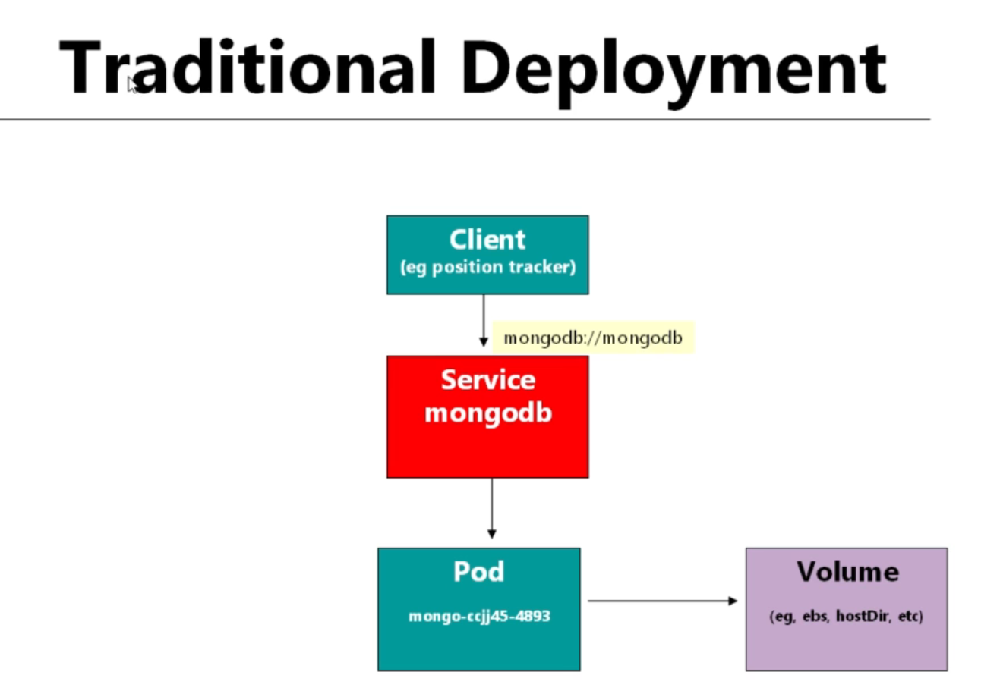

# StatefulSets for Database Replication in kubernetes

- In the `StatefulSets` , the `Stateful` part refer to the `predictable name of the resulting POD`

- **When we should Use these know and Predictable POD Name coming from the StatefulSets**

- we can provide the `offhand answer` , we will use the `StatefulSets` when we want the `predictable or known name of the resulting POD`  or `POD need to start up in sequence` or `client need to address the POD by their name using the headless service` , but `this will not be specific use of the StatefulSets`

- but the `specific or Usual use case of the StatefulSets` will be as 
  
  - if we are working with the `Database POD` and  we want to `replicate it`
  
  - we actually `don't need` a `StatefulSets` if we are working with a `Database` and it is a `single POD`
  
  - but if we want to `Scale Out the Database and there are multiple instances of Database` and `want to replicate it` , then we need to use the `StatefulSets`
  
  - it depends on the `Database implementation` , there are `lot of database` present , `which replicate in different ways`
  
  - But `usually or often` , we can't `replicate` the `DataBase` using the `Deployment or ReplicaSet`
  

- here we will be working on a `specific example` or `hands on Demo` in here

- here if we are going to the `traditional Deployment of the mongodb Database` then we can see it that we are `treating the mongo PODs as cattles but not as pets` hence not `provided the name`

-  

- here the `client of the mongoDB database` is `position-tracker` microservice in this case

- the `client of the mongoDB database` is `position-tracker` microservice using the `normal service using the DNS Name of the service` , which been choosing the `random POD` from the `replica-set` created by the `Deployment`

- here we have choose the `number of replicas as 1` which been choosing the `random POD name` based on the `Deployment`

- we have had `persistent also` as we have connected the `PODs` into the `Volume` such as the `ebs-volume` , which will work fine `as there is only one replication` and here no need of a `statefulSets`

- but if we have the requirement to `replicate the database PODs` then you might think that change the `replicas to any number` inside the `Deployment` and `deploy the changes to the cluster` , but that simply `doesnot work`

- 