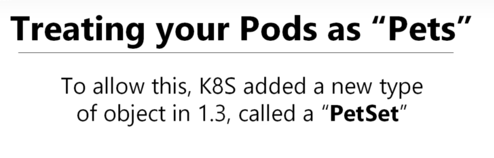

# ScaleSets Overview in kubernetes 

- here we will discuss `what is a statefulSets` and `what is not a statefulSets` ?

- `StatefulSets` are by far the `most misunderstood concept` in `kubernetes` , which is `because of the name` `StatefulSets` `which is quite confusing` 

- if we goto the `kubernetes reference guide` i.e [Reference Guide](https://kubernetes.io/docs/concepts/workloads/controllers/statefulset/)

- the `opening line` described for the `StatefulSets` are `little confusing` , which say `StatefulSet is the workload API object used to manage stateful applications`

- here we don't understand `what the state means` also we don't know `whats the meaning of application` in this context 

- `in order to avoid confusion ` we need to `remeber the gist` of the `StatefulSets` is `not needed for persistence` in `kubernetes` i.e `StatefuleSets are not needed for persistence`

- 

- **What is Persistence in kubernetes**

- we want `some data` to `live longer` than the `lifetime of the container inside the POD`

- we have the `persistence` in the `fleetman microservice` project , we have the `mongo POD` which will be `saving the data into the hard Disc`

- here as we are using the `minikube kubernetes cluster` it will be `saved the files` to the `minikube Linux VM directory`

- if we are `shutdown` the `minikube linux VM` the we will loose access to the `data` , because we are storing in `minikube VM` , which is used for `simulation`

- here the `data` which being stored as the `minikube Linux VM` which is `outside of the container or POD container` in a `Directory or Folder` , which can `take a back off` and `perform any action on it`

- even we migrate the `storage to cloud` , where we also use the `proper virtual SSD Drive` i.e `AWS EBS VOLUME` to `store that data onto the cloud` as well 

- here we do have store the `vehicle history` onto the `virtual Hard Disc` 

- even if we `delete` the `mongodb database POD` and the `POD` will be `restarted again as they are Deployments` and the `restarted POD` will be `associated` to the `EBS volume` as well in this case

- if we are using the `kops along with the AWS` if we want to `delete the cluster` using the command as `kops delete cluster <cluster name>` then it will then delete the `every single resource created by kops along with EBS volume` asssociated with it 

- we can take the `backup of the EBS volume` if `we want to delete` the `kops cluster which been associated with the POD`

- if we have the `production level data inside the EBS Volume` and we are using the `kops AWS cluster`  , if we are assuming the `virtual SSD will be left behind` when we delete the ` kops kubernetes cluster` , by default they won't  

- here if we are running the `fleetman microservice application` for `sometime` then we can see that `history of the vehicle` which been saved to the `mongodb` from the `position-tracker` microservice in this case

- we have associated the `mongo POD` with the `volume` , hence the `dat stored into the mongoDB database POD` being `Persistent`

- if we even delete the `mongodb` POD then also we can see the `Deployment will restart the POD` and `POD will be associated to the existing Volume`

- if we even switch between the `vehicle` inside the `fleetman web application` we can still see the `vehicle history` as the `new mongodb POD associated with the existing Volume` that we have defined 

-  we can see the below details if we perform the action 

    
    ```bash
        kubectl get all
        # fetching all kubernetes workloads inside the default namespace in here
        # the output will be as below 
        NAME                                      READY   STATUS    RESTARTS        AGE
        pod/api-gateway-56c46fbcdb-589hb          1/1     Running   1 (3m18s ago)   6m9s
        pod/mongodb-578b98fbd4-qqq2l              1/1     Running   1 (3m19s ago)   6m9s
        pod/position-simulator-5fdb4ddbd5-9d8xp   1/1     Running   1 (3m18s ago)   6m9s
        pod/position-tracker-59fdfd8cf4-84f8z     1/1     Running   1 (3m18s ago)   6m9s
        pod/queueapp-f55dcb97d-lvxq7              1/1     Running   1 (3m18s ago)   6m9s
        pod/webapp-66765b68df-4chgz               1/1     Running   7 (2m1s ago)    6m9s

        NAME                                TYPE        CLUSTER-IP       EXTERNAL-IP   PORT(S)                          AGE
        service/fleetman-api-gateway        NodePort    10.106.163.114   <none>        8080:30030/TCP                   6m9s
        service/fleetman-mongodb            ClusterIP   10.101.180.150   <none>        27017/TCP                        6m9s
        service/fleetman-position-tracker   ClusterIP   10.108.240.74    <none>        8080/TCP                         6m9s
        service/fleetman-queue              NodePort    10.106.99.197    <none>        8161:30010/TCP,61616:30406/TCP   6m9s
        service/fleetman-webapp             NodePort    10.101.33.136    <none>        80:30080/TCP                     6m9s
        service/kubernetes                  ClusterIP   10.96.0.1        <none>        443/TCP                          6m57s

        NAME                                 READY   UP-TO-DATE   AVAILABLE   AGE
        deployment.apps/api-gateway          1/1     1            1           6m9s
        deployment.apps/mongodb              1/1     1            1           6m9s
        deployment.apps/position-simulator   1/1     1            1           6m9s
        deployment.apps/position-tracker     1/1     1            1           6m9s
        deployment.apps/queueapp             1/1     1            1           6m9s
        deployment.apps/webapp               1/1     1            1           6m9s

        NAME                                            DESIRED   CURRENT   READY   AGE
        replicaset.apps/api-gateway-56c46fbcdb          1         1         1       6m9s
        replicaset.apps/mongodb-578b98fbd4              1         1         1       6m9s
        replicaset.apps/position-simulator-5fdb4ddbd5   1         1         1       6m9s
        replicaset.apps/position-tracker-59fdfd8cf4     1         1         1       6m9s
        replicaset.apps/queueapp-f55dcb97d              1         1         1       6m9s
        replicaset.apps/webapp-66765b68df               1         1         1       6m9s


        # now if we stop the mongodb POD in this case then the deployment will start the new POD
        # but we can see that the new POD also associated with the existing Volume which is a hostPath on minikube vm
        # here the output will be as below 
        kubectl delete pod/mongodb-578b98fbd4-qqq2l
        # removing the monogdb POD over here
        # the output will be as below 
        pod "mongodb-578b98fbd4-qqq2l" deleted

        # we can see the new mongo replacement POD be in place as its a Deployment 
        kubectl get all
        # fetching all the kubernetes object inside the default namespace
        # the output will be as below 
        NAME                                      READY   STATUS    RESTARTS        AGE
        pod/api-gateway-56c46fbcdb-589hb          1/1     Running   1 (6m33s ago)   9m24s
        pod/mongodb-578b98fbd4-gxtls              1/1     Running   0               78s # new replaced mongo POD which will running instead of the OLD POD
        pod/position-simulator-5fdb4ddbd5-9d8xp   1/1     Running   1 (6m33s ago)   9m24s
        pod/position-tracker-59fdfd8cf4-84f8z     1/1     Running   1 (6m33s ago)   9m24s
        pod/queueapp-f55dcb97d-lvxq7              1/1     Running   1 (6m33s ago)   9m24s
        pod/webapp-66765b68df-4chgz               1/1     Running   7 (5m16s ago)   9m24s

        NAME                                TYPE        CLUSTER-IP       EXTERNAL-IP   PORT(S)                          AGE
        service/fleetman-api-gateway        NodePort    10.106.163.114   <none>        8080:30030/TCP                   9m24s
        service/fleetman-mongodb            ClusterIP   10.101.180.150   <none>        27017/TCP                        9m24s
        service/fleetman-position-tracker   ClusterIP   10.108.240.74    <none>        8080/TCP                         9m24s
        service/fleetman-queue              NodePort    10.106.99.197    <none>        8161:30010/TCP,61616:30406/TCP   9m24s
        service/fleetman-webapp             NodePort    10.101.33.136    <none>        80:30080/TCP                     9m24s
        service/kubernetes                  ClusterIP   10.96.0.1        <none>        443/TCP                          10m

        NAME                                 READY   UP-TO-DATE   AVAILABLE   AGE
        deployment.apps/api-gateway          1/1     1            1           9m24s
        deployment.apps/mongodb              1/1     1            1           9m24s
        deployment.apps/position-simulator   1/1     1            1           9m24s
        deployment.apps/position-tracker     1/1     1            1           9m24s
        deployment.apps/queueapp             1/1     1            1           9m24s
        deployment.apps/webapp               1/1     1            1           9m24s

        NAME                                            DESIRED   CURRENT   READY   AGE
        replicaset.apps/api-gateway-56c46fbcdb          1         1         1       9m24s
        replicaset.apps/mongodb-578b98fbd4              1         1         1       9m24s
        replicaset.apps/position-simulator-5fdb4ddbd5   1         1         1       9m24s
        replicaset.apps/position-tracker-59fdfd8cf4     1         1         1       9m24s
        replicaset.apps/queueapp-f55dcb97d              1         1         1       9m24s
        replicaset.apps/webapp-66765b68df               1         1         1       9m24s


    ```

- here we can see the `even now if we switch between the Vehicle` then also we can see the `hostory of the vehicle position` as we have store the `data` by `volume mounting`

- 

- if we switch berrn the `vehicle` then a call been made to the `mongodb Database` as the `mongodb Databaase` already associated to the same volume hence it can get the `preveious history of the data` in this case 

- if we see the `mongo-stack.yml` and the `storage.yml` then we can see the `volume mounting` in that case as below 


    ```yaml
        mongo-stack.yml
        ===============
        apiVersion: apps/v1 # here the apiVersion we can  see belong to apps/v1 as the Deployment belong to the apps api group
        kind: Deployment # type of kubernetes object in this case as Deployment
        metadata: # name of the Deployment being as mongodb
            name: mongodb
        spec: # here goes the specification for the Deployment
            selector: # here we need to define the selector which will select the POD based on the POD label
                matchLabels:
                    app: mongodb
            replicas: 1 # here the number of replicas in this case will be as 1
            template: # here we will define the POD definintion 
                metadata: # we will define the POD definition over here
                    labels: 
                        app: mongodb
                spec: # specification for the POD being describe in here
                    containers: # container details for the POD being defined in here 
                        - name: mongodb # here the name of the container being as mongodb
                          image: mongo:3.6.5-jessie # image for the container as mongo:3.6.5-jessie
                          volumeMounts: # here we are doing the volumentMounting the container path in this case
                            - name: mongo-persist-data # name of the volumeMounts which been refered in volumes
                              mountPath: /data/db # path inside the volume that need to be mapped mongo by default stored in /data/db
                    volumes: # here defining the volume where we will be creating the persistentVolumeClaim for the POD which wilol be provided by the persistentVolume
                        - name: mongo-persist-data # referenicng the volumeMount location over here
                          persistentVolumeClaim: # here we will be using the persistentVolumeClaim
                            claimName: mongo-pvc # here the claimName as mongo-pvc which we need to define

        ---

        apiVersion: v1 # here the apiVersiob being as v1 as the Services belong to the core group
        kind: Service # type of kubernetes object we will be using is of Service
        metadata: # name of the Kubernetes Service in this case
            name: fleetman-mongo 
        spec: # specification for the kubernetes service fleetman-mongodb being as below
            selector: # selector to select the POD so that service can provide the DNS Networking endpoint
               app: mongodb 
            ports: # here describing the Ports info needed for the POD in here
                - name: mongo-port # name of the port being as mongo-port
                  port: 27017 # port which need to be mapped as 27017
                  protocol: TCP # protocol as TCP
            type: ClusterIP # type of Service being ClusterIP


    
    ```

- here we can define the `storage.yml` file as below where we will be defining the `persistentVolumeClaim` and `persistentVolume` in this case

- we will be seeing the output as below in this case 

    ```yaml
        
        storage.yml
        ============
        # here as system Administrator we are making the claim which will be pointing to the persistent Volume Provider
        apiVersion: v1 # here defioning the apiVersion as v1 as persistent Belong to the core apiGroup 
        kind: PersistentVolumeClaim # here the type of kubernetes object being as PersistentVolumeClaim
        metadata: # name of the PersistentVolumeClaim which is mongo-pvc based on the claim Name
            name: mongo-pvc
        spec: # specification for the PersistentVolumeClaim defined here
            accessModes: # here the accessModes as ReadWriteOnce means in a Node only One POD can perform both Read And Write but rest of the POD can do Read Operation
                - ReadWriteOnce
            resources: # requesting for the storage of 7Gi space in here
                requests: 
                    storage: 7Gi
            sorageClassName: local-storage
            # defining the storageClassName to link the persistentVolumeClaim to the persistentVolume
        ---
        # this is the persistent Provider
        apiVersion: v1  # here defioning the apiVersion as v1 as persistent Belong to the core apiGroup
        kind: PeristentVolume # here the type of kubernetes object being as PersistentVolume
        metadata: # name of the PersistentVolume which is my-storage
            name: my-storage
        spec: # specification for the PersistentVolumeClaim defined here
            accessModes: # here the accessModes as ReadWriteOnce means in a Node only One POD can perform both Read And Write but rest of the POD can do Read Operation
                - ReadWriteOnce
            sorageClassName: local-storage
            # defining the storageClassName to link the persistentVolumeClaim to the persistentVolume
            capacity: # definignthe capscity that what we expect the PeristentVolume going to take as storage
                storage: 7Gi
            hostPath: # here definign the hostpath for the host location storage
                path: /mnt/mongo-data # here path where we want to store the the data in the Host System which is minikube Linux VM
                type: DirectoryOrCreate # type of the hostPath defined over here 


    ```

- in case of the `AWS` we have created the `StorageClass` in order to move that `data` to the `virtual SSD on cloud` in a `EBS volume`

- we can do that using the below yaml confioguration using `kops AWS cluster`

    ```yaml
        storage-aws.yml
        ================
        # here as system Administrator we are making the claim which will be pointing to the persistent Volume Provider
        apiVersion: v1 # here defioning the apiVersion as v1 as persistent Belong to the core apiGroup 
        kind: PersistentVolumeClaim # here the type of kubernetes object being as PersistentVolumeClaim
        metadata: # name of the PersistentVolumeClaim which is mongo-pvc based on the claim Name
            name: mongo-pvc
        spec: # specification for the PersistentVolumeClaim defined here
            accessModes: # here the accessModes as ReadWriteOnce means in a Node only One POD can perform both Read And Write but rest of the POD can do Read Operation
                - ReadWriteOnce
            resources: # requesting for the storage of 7Gi space in here
                requests: 
                    storage: 7Gi
            sorageClassName: cloud-ssd
            # defining the storageClassName to link the persistentVolumeClaim to the persistentVolume which is StorageClass in this case

        ---
        # this is the persistent Provider
        # here we are defining the StorageClass Which will be converted to Persistenvolume at runtime 
        apiVersion: storage.k8s.io/v1 # here we can fetch the apiVersion of the storageClass using the command as kubectl api-resources -o wide | grep storage
        kind: StorageClass # defining the type as StorageClass in this case
        metadata: # name of the StorageClass defined as cloud-ssd
            name: cloud-ssd
        provisioner: kubernetes.io/aws-ebs # defining the provisioner as kubernetes.io/aws-ebs in thsi case of kops
        parameters: # here defining the type inside the paratmeters section in here
            type: gp2  # name of the paratmeters being gpp2 in this case which is for the General Purpose

    ```

- this is `persistence in kubernetes` , then `what on earth is a StatefulSets` ? and `what are we missing out by not having the StatefulSets`

- `StatefulSets are not actually used for persistence`

-  

- `SatetfulSets` belong to `something specific` , in order to understand that we need to understand few other things

- lets suppose we have the `fleeman microservice system` running hence we have `multiple series Of PODs` , where each `POD` representing the `specific microservices`

- here we will be considering a `POD` which been for the `API Gateway` , which we have deployed as `POD deployment`

- when we deploy as the `Deployment` then it will `mangle` the `name of the POD` as `<deployment-name>-<replicaset-id>-<some ransom string>`


- there are `couple of reason` for the `mangled named of the POD created from the Deployment`
  
  - when we do a `replication and do replicate` then we can create as many instances of the `POD deployment`
  
  - by providing the `random name` we are making sure that `each POD is unique` as per the `Deployment` 
  

- we can do `replication of the POD deployment` , there might be `several reason to do that `
  
  - perhaps the `api-gatway` is `CPU Intensive microservice` hence `we need multiple replicas for the same` for `horizontal scaling` , they `can be differenceiated between multiple nodes` inside the cluster
  
  - for redundency :- perhaps the `api-gateway` is a `critical application hence the critical POD` without which the `fleetman application` can go down , hence we can set to run `multiple instance` inside the `different availablity zones or Data Centers`   


- lets suppose we have a `client` which want to `make call to the api-gateay POD` , the `client webApp POD` does not have the `visisbility` for the `apiGateway POD`

- this `client` can be `another POD` here we are considering the `webapp POD` which want to send the request to the `api Gateway POD`

- then if the `client WebApp POD` want to make a request to the `api Gateway POD` it `can't do that directly` , the `client webApp POD` does not have the `visisbility` for the `apiGateway POD`

- it need a `kubernetes service object` which will provide the `networking endpoint` for the `client POD` to make the request 

- the `client webApp POD` can use the `Service Name` which will be the `DNS(Domain Name Server)` such as `http://api-gateway` in order to `make the request to` the `api Gateway POD` 

- its the `Job of kubernetes` to `receive that request from the Service` and `processed to any of the POD Deployyment` and get the response out of it 

- `How Does kubernetes Service Decide which POD to call in order to provide the response` ?

- `kubernetes` by default uses the `round robin mechanism` to call the `POD` once the request `reach to the kubernetes service by the DNS Name or Service Name`

- we don't need to bother about that `how kubernetes making request to the POD once the request reaches to the kubernetes service by the DNS name from client WebApp` , that s the job of the `kubernetes` in this case , it does not matter `which POD been called by the kubernetes service` thats the `Job of the kubernetes Service`

- we can `safely assume` that `Service` will route that request to the `random POD` and `get the response from there`

- once the r`equest been served` when the `client WebApp POD request again to the kubernetes Service by the DNS Name or Service Name` the `kubernetes Service` will redirect that to `another POD` , here `Us or the cliuent webapp POD doesa not bother about that `

- 

- here we can see people day that `PODs are treated as cattle but not as Pet`

- in a `DevOps Arena` the `cattle and pets` are the `common phrase` , this comes as `thinking about the Servers` , which comes from `bill baker`

- in `DevOps` we need to treat the `Server` as the `cattle` but not as `pets` 

- in the `old way` we are treating the `server` as `pets` , if there is a `mail server` , if the `mail server anmed as Bob mail server` goes down then `everyone inside the company` will be afftected by it and everyone tryuing to `get that mail server fixed`

- this considered as a `serious anti pattern in DevOps` , we don't want a `Server` have to `patched and patched again`  for `many years`

- but we should `strive in DevOps` for `treating the server as Cattles` , we have a `herd of cattle/servers which is valiable in their own way` , `but we don't provide cattle the name for the cattles` ,  may be we have the `ID Tag for the herd of cattle or Server` , we will not `treat the POD individually`

- we can have the `farm of server` , if `one goes down` , `then we must have re-build another replacement server using some automation technology`

- this is the `model of kubernetes as well` , which will `lead to path` `conside` the `POD` as the `cattle`

- we don't have to bother about the `individual POD` ,  here we know that we got the `5 different POD` in this case having `strage name` and `None of them are special from one another`

- if for some reason `if one goes down` then `then we have other POD in the herd`

-  

- `kubernetes` will automatically `replace that POD` with another `POD in place` as its under the `Deployment`

- here the `client WebApp POD` will not be going to refer to the `Individual POD by their name`

- the `client webapp POD` does not bother if it is getting `served by the POD named as api-gatw3ay-nnvjuu-39392 or other POD having unique name`

- for `most requirement` this is the `scenario` we must be working in the way  of `treating POD as Cattle`

<br/><br/>

- But there are `some special requirement` where we `don't have to treat` the `POD` as the `Cattles or herd of cattles`

- for `some situation` in `kubernetes` we need to define the `POD` as with the `known and predictable names` and we don't want the `PODs` to have the `random garbage name for the POD`

- `we want that because` we want the `client webApp POD` make direct request to the `Api Gatway POD` by calling them `directly as their name`

- this is what we will get from the `statefulsets`

- 


- here is an `abstract example for the simulating the situation where we want the predictable or known name for the POD which will use the kubernetes StatefulSets`

  - here also we want the `multiple instances of the specific POD deployment`

  - here the `POD` are of `same type` in this case , we want the `3 replicas of the POD deployment`

  - but here we don't want the `POD` having the `random jumble of characters` in this case
  
  - here we can have the `predictable or known POD Deployment name` as `my-pod-0`, `my-pod-1` and `my-pod-2`
  
  - the reason of doing that `client webapp POD` want to make request to the `specific instances of the POD` such as `my-pod-0`
  
  -  
  
  - this is more like `treating the PODs as pets rather than cattles`
  
  - this is not exactly same as `server which been patched up for 40 years`  and called the `Bobs Server` 
  
  - here the `pet terminilogy` meaning the `giving the Kubernetes POD a Name` through which the `client webapp POD` can `call them directly`
  

- if we have that above requirement `from kubernetes 1.3 this is being supported` which is known as the `PetSet` functionality


-  
  

- we want to provide `PetSet` functionality `instead` of the `Deployment` if `we have the below requirements`
  
  - if we have the requiorement of giving the `PODs` `predictable ot known name then we have to use it`  such as `POD-0,1,2 etc`
  
  - these `PODs` will always `start up in sequence` , `POD-1` will not start if the `POD-0` did not start successfully
  
  - `clients` can address these `POD` directly `by their name` rather than `services by the POD with random name`


- 

- in the `preveious pictuire` where the `client WebApp POD` want to call the `microservice directly` such as `client WebApp POD` want to call the `my-pod-0` , it sent  request directly to the POD but theres is something hidden

- we still do have servioce in that case as well which is known as the `headless service`

- 

- but there is `no syntax in kubernetes Service yml` ro define the `headless service`

- A `headless service` which is same as the `regular kubenetes service` , but as per `documentation` called it as `headless service`

- 

- here in case of this  `headless kubernetes service` it will do the `loadbalancing` to `redirect the request reach to the service` to `any POD` in `round robin algorithm`

- `while sending the request` only `client provide the name of the POD while making the request` to the `kubernetes headless service`

- its more like each of the `POD` having own copy of `separate kubernetes service`

- the `PetSet` refered as the `StatefulSets` in `kubernetes` ,w hich is the renameing of `PetSet` to `StatefulSets`

- if we go to the `kubernetes github issue page` with the number as `27430` as [Kubernetes Issue 27430](https://github.com/kubernetes/kubernetes/issues/27430) 

- kubernetes `statefulsets` has nothing to do with the `persistent` , we do use the `StatefulSet` for the `persistence PODs where the name is predictable and known` 

- we don't need the `StatefulSets` to perform the `database persistence` 

- there are 3 major functions for the `kubernetes statefulsets` such as 
  
  - if we have the requirement of giving the `PODs` `predictable ot known name then we have to use it`  such as `POD-0,1,2 etc` i.e `<stateful Sets name>-0/1/2`
  
  - these `PODs` will always `start up in sequence` , `POD-1` will not start if the `POD-0` did not start successfully
  
  - `clients` can address these `POD` directly `by their name` rather than `services by the POD with random name`

- if we are thinking , `by the name as statefulSet` , provide the `POD` , if we `restart the POD` which will `restore the data even though the POD container RAM restarted` then we are wrong 

- here the `Stateful` in the `StatefulSets` means the `Stateful Name` in that case