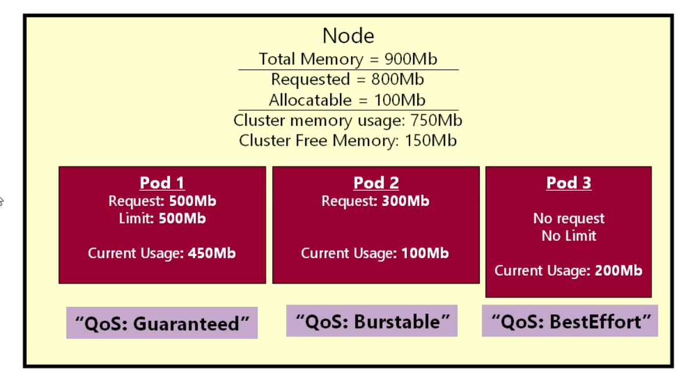
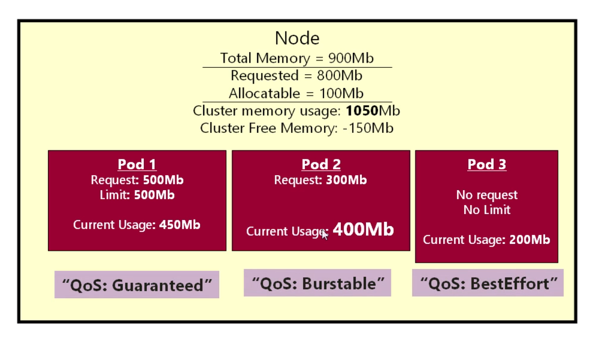
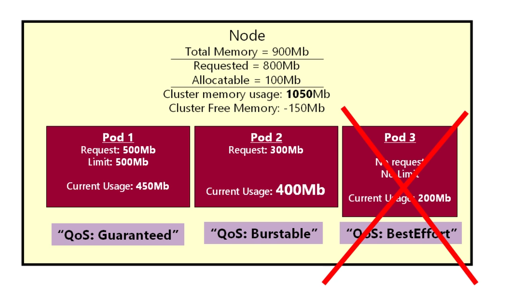
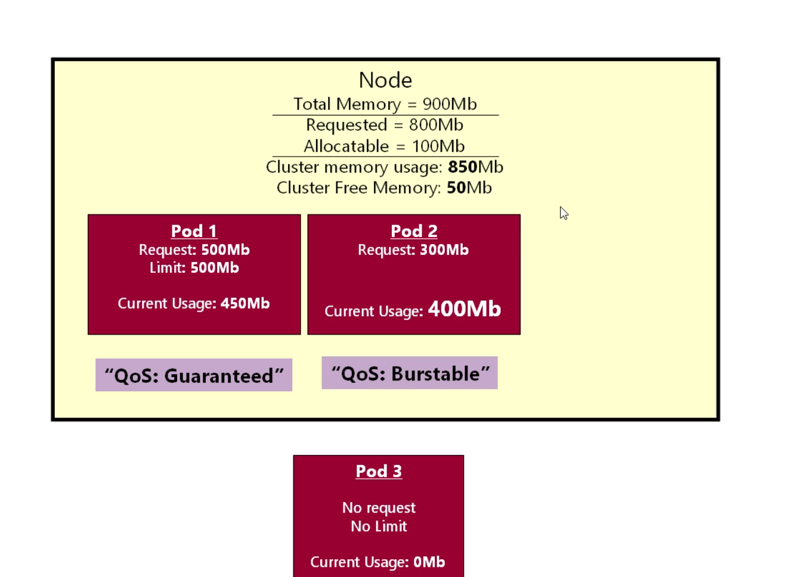
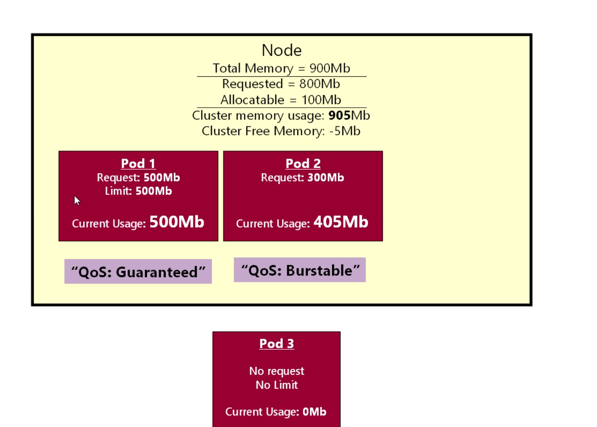
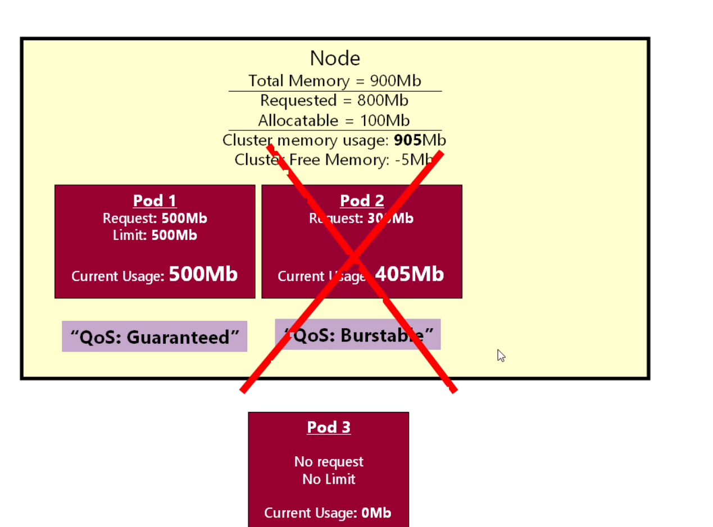
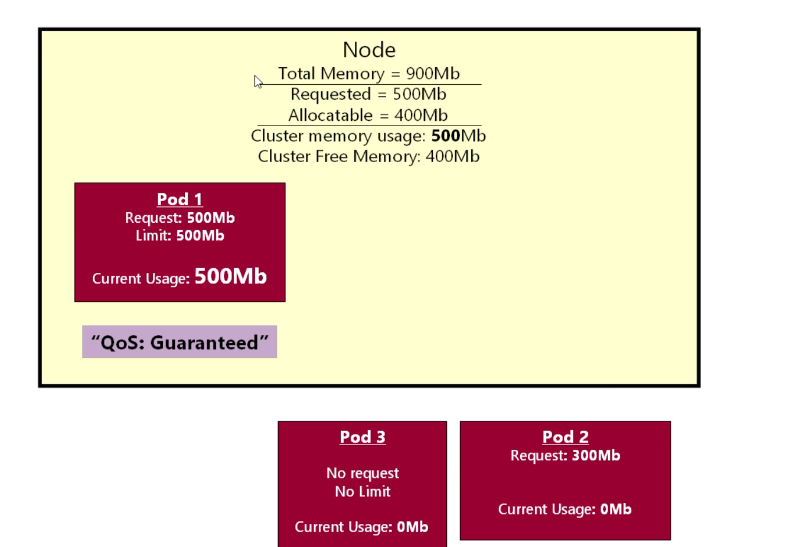

# Evictions

- on any `POD` that we deploy kubernetes will `automatically` will assign the `label` as `QoS class` which is known as the `Quality of Service Class`

- based on the `fairly simple rules` i.e based on the `combination of requests and limits` the `label for the QoS service class given` such as 
  
  - `Guaranteed` :- we will get the `Guaranteed` as `QoS label` if we have specified the `CPU request` as well as the `Memory Request` and the `CPU and Memory requests and limit have the same value`
  
  - `Burstable`  :- we will be getting the `Burstable` as the `QoS label` , if we fail to match the `rules defined for the Guaranteed` , But we have `specified the requests`
  
  - `BestEffort` :- we will be ghetting the `BestEffort` as the `QoS label` , if we are `not bothered with specifying the request and limit for the POD container`

- **What the purpose of the QoS Service Labels**

- the `purpose` of the `QoS` label revolvb around the `kubernetes scheduler`

- this `QoS label` will help `kubernetes scheduler` to `evict` a `POD` from the `kubernetes Node` if the `kubernetes Nodes` comes under `pressure`

- lets suppose the `POD` are running for `very long time` , Overtime the `CPU and Memory Usage` of the `PODs` will going to be get changed

- 

- **Situation01** :-> 

  - Lets suppose , if the `POD1` started using `too much Memory` 

  - but here we can see that `Actual cluster Free Memory` is about `150Mb` looking at the `above diagram`

  - if the `POD1` goes over that `then that will be disaster for the Nodes`

  - if the `kubernetes Node` starts `running out` of the `Resources` , then there might be a chance that `Kubernetes Node` will be `lost from the kubernetes cluster`

  - if we lose `kubernetes Node` from the `Cluster` that can make the `entire kubernetes cluster` to be failed

  - the `kubernetes scheduler` is `One line of defence` against the `failing the kubernetes Node` which subsequently fail the `kubernetes cluster`

  - here from the `Diagram` we know that `POD1 here will never going to be get greedy because we have define the requests and limits for the POD container`

  - here if the `RAM Memory usage of the POD1` goes above the `500Mb` then that will `immediately be evicted from the kubernetes Node` hence the `kubernetes Node will not suffer`

  - here the `kubernetes will use the linux operating system fundamental called cgroups` in order to `terminate the POD` if it `goes beyong the certain limit RAM Memory and CPU Usage` , here the `kubernetes scheduler` need not to be intervene in this case

  - which is `very nice` , this means `this POD being very nice to the kubernetes Nodes that it is running on`

  - `POD1` is very specific `exactly what it will be going to use`, if `that turned out not true` then `POD will be immediately die` and will be `eligible for rescheduling` and will be `rescheduled to same or different kubernetes Node inside the cluster`

  - but here we need to keep in mind that as a developer `we need to set the correct limit` , otherwise we will be getting the `alert` from the `AlertManager` if the `AlertManager` been set , stating that `One the POD been getting frequent restart please have a good look on that` as the `CPU and Memory cross the limit specified`

  - thats the `Best thing about the Guaranteed Qos Service label POD` , the `kubernetes scheduler` does not have to `worry about them`

- **Situation02** :-> 

  - 

  - with the `Move Forward` with the `Time` , the `POD2` start using `more and more resource` i.e `more and more RAM Memmory`

  - lets suppose the `POD2` the usage climb upto `400Mb` of the `RAM Memory`

  - which is a `valid scenario` as the `POD2` requested for the `300Mb of RAM Memory` but using `400Mb` of the `RAM Memory`

  - we already knew the `request` is just a `Hint` for the  `kubernetes scheduler` which tell `How much resource the POD need in turn to run comfortably` , but its not the `Hard Guarantee`

  - hence as we have defined only `resources` hence the `POD` can go ahead consuming the `resource` beyond `What it requested`

  - hence the `Qos Service class label` for the `POD2` will be as `Burstable`

  - the `Burstable Qos Service class label` means `the POD is allowed to do a burst` if the `resource go beyong whats been requested`

  - generally the `Burstable` we `can go over for a short periods`

  - but  in kubernetes `Burstable Qos Service class label` means we have `defined the resource requests for the POD` , but `POD might go beyond the requested Resources`

  - if we look at the `maths on the Top` then we can see that `here the kubernetes Node Now in an unstable state`

  - here `Actual POD Usage` then that became as `450Mb+400Mb+200Mb` which becaame as `1050Mb` which is exactly as `Available cluster Usage`

  - here we have `Overcommitted for the 150Mb Available cluster Memory` we can say  in the better term

  - this will not be a `tolerable position for the kubernetes Nodes` and the `kubernetes scheduler` do its very best `stop this from happening`

  - here in this case the `kubernetes scheduler` will going to `evict one or more POD` from the `kubernetes Node` in order to make sure that `kubernetes Node` has enough `resource` to run `smoothly`

- the `algorithm that kubernetes scheduler` uses in order to `evict the POD` will be as `it will remove the BestEffort POD first` , if that `has not free up enough resource` from the `kubernetes Node` then it will be `evict the Burstable POD` , only then if it `has not free up enough resource` from the `kubernetes Node` then it will going to `evict the Guaranteed POD`

- here the `point of the QoS label` will be as the `automatic priority system` in order to `evict a POD from the Kubernetes Node based on the QoS Service class label`

- here the `POD3` which has the `QoS Service label` as `BestEffort` which in other word we can say it as the `Rude POD`

- the `kubernetes scheduler` has `No Idea` what `POD3` will be do in future i.e `How much resource it going to Use` , it has `No Way of Predicting its resource usage` , hence the `kubernetes scheduler` cdonsidered as the `dangerous POD to schedule onto the kubernetes Node` hence that `rude POD` will be `first in the list to be get evicted`

- Hence `kubernetes scheduler` will going to make the `QoS Service class label` as `Best Effort`

- here the `Kubernetes scheduler` saying with the `QoS Service class label` as `Best Effort` as :- `kubernetes will try its best to schedule the POD` but in case the `Kubernetes Nodes under pressure will evict the POD` don't be surprised

- 

- `Evicting` the `POD` does not mean that `POD got terminated forever` but it will be `rescheduled inside another suitable kubernetes Node` which will `automatically restart the POD` inside another `kubernetes Node`

- here we can't see `another kubernetes Node` , but lets assume that `we have the kubernetes Nodes` inside the `kubernetes cluster` where the `evicted rude POD` will going to be `get scheduled`

- if there is `No kubernetes Node Availbale` then `POD` `can't be scheduled at all` , then if we are using the `cluster Autoscaling` then we can `spin up` another `Node` for the `kubernetes cluster` where the `POD can be scheduled` 

- 

- now as the `rude POD` having the `QoS Service class label` as `Best Effort` been `evicted and rescheduled to another kubernetes Node` we have the `Math in place` as below

- 

- now we have the `total request RAM Memory` as `500Mb+300Mb` as `800Mb`

- Based on the `Actual POD Usage` the `Actual Cluster RAM Memory Usage` is now become as `450Mb+400Mb` which will be of `850Mb` which gives the `Actual Cluster RAM Memory Free` being as `900Mb-850Mb` i.e `50Mb` which being `balanced` and the `kubernetes Node` will continue run `smoothly`

- Lets suppose `with Over time` the `things change again`

- 

- Lets say `Now the POD1` start using the `More RAM Memory` as `500Mb` as describe in the `diagram` 

- here we don't want to `go over the limit of the POD1` as we know if the `POD1 goes over the limit` then the `POD` will be `Automatically evicted`

- but here the `POD1` been using the `500Mb` which is `within the Limit` and `perfectlyvalid in this case`

- but here we also can see that `Over Time` the `POD2` start using the `little bit more memory` as `405Mb`

- here now we can see the `Actual POD Usage` is now `500Mb+405Mb` which will be of `950Mb` which is greater than `Actual Cluster RAM Memory Usage`

- here we can see that `Kubernetes Node` being Now `Over Commited` as `905Mb` which is beyong the `Actual Cluster RAM Memory which is 900Mb` hence the `Actual Cluster RAM Memory Free eing as -5Mb`

- hence the `kubernetes scheduler` has to `evict some POD from the over commited Kubernetes Node` to free up the `resources on kubernetes Resource` , as there are no `BestEffort QoS Service class avialable` hence the `kubernetes scheduler` will going to `remove the Burstable QoS Service Class label POD` which is the `POD2`

- this make sense as the `kubernetes Scheduler` will say to `POD2` that `look POD2 you requested for resource of 300Mb` , `if you have stuck to the requested resource the kubernetes Node will not be overuse and will be stable` because the `total requested RAM Memory` being as `500Mb+300Mb` which is `800Mb` which is below the `Total RAM Memory of the kubernetes Node` , as `POD2` became greedy and `Actual POD usage` being `405Mb` which is `beyond the request RAM Memory`  hence need to be `evicted`

- 

- hence the `POD2` now being `rescheduled` to `Another Kubernetes Nodes` and `restarted Over there`

- which can update the math for the `kubernetes cluster` as below in this case as below

- 

- here we have the `Requested RAM Memory` as `500Mb` for the `POD1`

- hence the `Allocable becomes` as `900Mb-500Mb` i.e `400Mb`

- the `Actual POD usage` for the `kubernetes Node` being as `500Mb` hence the `Actual Clsuter RAM Memory Usage` as `500Mb` as there is only `One POD`

- also we can see that `Actual cluster RAM Memory Free` for the `future request being` as below `900Mb-500Mb` i.e `400Mb`

- In practise in the `real production cluster` things are `far more complecated` as there are `Multipl POD` and `each POD can have different set of combination with requests and limits` than the `diagram` but the `principle remain be the Same`

- the `main purpose of Eviction` is to `ensure the kubernetes Node don't get OverLoaded` which can be a `disaster in kubernetes cluster`

- we can see the `QOS reference guide` as [Kubernetes QoS reference Manual](https://kubernetes.io/docs/tasks/configure-pod-container/quality-service-pod/)

- the `QoS Service class label` given based on the `resources and Limits` defined for the `POD container` not for the `POD`

- it should be `better idea` to define the `resource and limit` for the `POD container`

- lets suppose inside the `POD` we have `Multiple POD container` then we need to define the `requests and limit for each POD container` if we want to set the `QOS Service class label as Guaranteed foe the POD with 2 POD ciontainer`

- the `QoS Service class label` will make decession about `Scheduling and evicting the PODs`